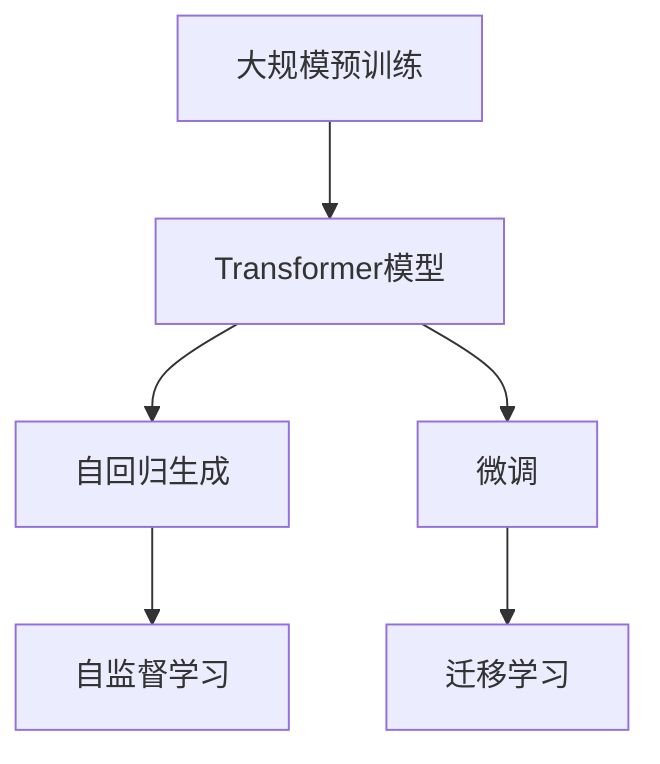
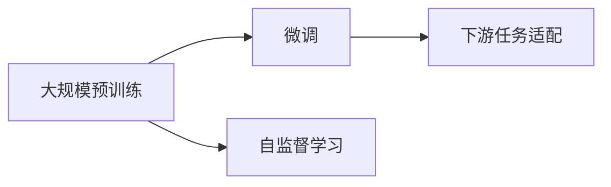
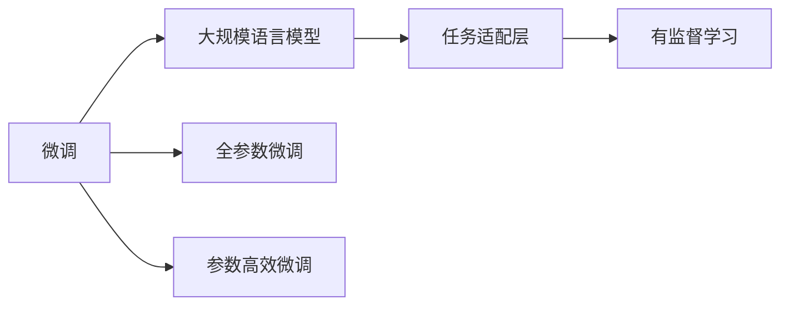
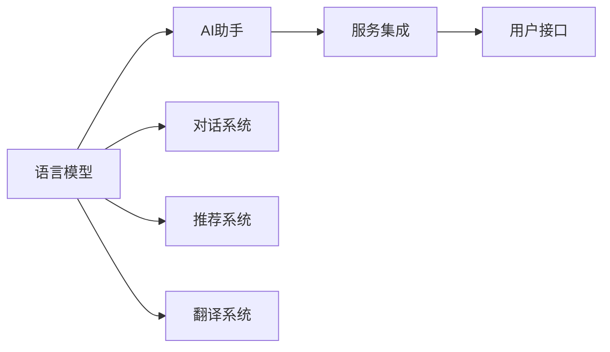

                 

# 从ChatGPT到未来AI助手的演变

## 1. 背景介绍

### 1.1 问题由来

ChatGPT作为OpenAI推出的最新一代大规模语言模型，彻底点燃了全球对自然语言处理(NLP)技术的热情。其背后的Transformer架构和自回归生成机制，使ChatGPT能够进行流利、自然的对话，引起了广泛关注。随着技术的演进，基于ChatGPT的AI助手应用逐渐从实验室走向现实，赋能各行各业，成为智能化服务的新浪潮。

### 1.2 问题核心关键点

ChatGPT所依托的Transformer模型和自回归生成机制，代表了NLP领域的最新进展。其核心优势在于：

- **强大的语言理解能力**：通过大规模无标签文本的预训练，ChatGPT能够理解语言的上下文和语义，处理复杂的自然语言输入。
- **高效的计算资源利用**：自回归生成机制使模型能够利用已知部分预测未知部分，显著降低计算复杂度，加速推理速度。
- **流畅自然的对话体验**：基于Transformer模型的自注意力机制，ChatGPT能够生成自然流畅的对话内容，与人类对话无异。

这些核心优势使ChatGPT成为AI助手的重要技术基础，但同时也面临着一些挑战：

- **缺乏通用知识**：ChatGPT虽然可以生成流畅的回答，但缺少通用的背景知识库支持。
- **鲁棒性和安全性问题**：在多样化和复杂化的对话场景下，ChatGPT的鲁棒性和安全性仍需进一步提升。
- **生成内容的真实性**：ChatGPT生成的内容依赖于其训练数据，可能包含虚假信息，需要进一步提高内容的真实性和可信度。
- **道德和伦理问题**：ChatGPT在生成内容时，可能受到偏见或误导性输入的影响，存在潜在的道德和伦理风险。

### 1.3 问题研究意义

对ChatGPT及其衍生AI助手的研究，对于推动NLP技术的发展、提升AI辅助人类的能力、推动社会各领域的智能化转型具有重要意义：

1. **促进NLP技术的进步**：ChatGPT的横空出世，为NLP领域带来了全新的研究范式和技术思路，推动了深度学习、自然语言理解等技术的进步。
2. **提升AI辅助人类的能力**：AI助手作为人工智能技术的实际应用，能够提供便捷高效的服务，提升人类生活和工作的效率和质量。
3. **推动社会智能化转型**：AI助手能够应用于教育、医疗、金融、客服等多个领域，推动各行各业的智能化转型，赋能社会各阶层。
4. **解决人类需求**：ChatGPT的智能化特性，能够帮助人类解决语言理解和生成的问题，提升用户体验。

## 2. 核心概念与联系

### 2.1 核心概念概述

为更好地理解从ChatGPT到未来AI助手的演变，本节将介绍几个密切相关的核心概念：

- **Transformer**：一种自注意力机制的神经网络结构，能够捕捉输入序列中不同位置之间的依赖关系，广泛应用于NLP任务中。
- **自回归生成模型**：一种基于已有的部分序列，预测下一个词或一个序列的生成模型，ChatGPT即为此类模型的代表。
- **大规模预训练**：在大量无标签数据上进行的预训练过程，使得模型能够学习到通用的语言知识。
- **微调(Fine-tuning)**：在大规模预训练的基础上，通过有标签数据对模型进行特定的任务适配，提升其在特定任务上的性能。
- **自监督学习**：一种无需标注数据，通过自构建任务进行模型训练的方法，ChatGPT即通过自监督学习进行预训练。
- **迁移学习**：一种将在一个任务上训练好的模型，应用于其他相关任务的方法，ChatGPT通过迁移学习在多个任务上表现优异。

这些概念之间的逻辑关系可以通过以下Mermaid流程图来展示：



这个流程图展示了大语言模型的预训练、Transformer结构、自回归生成、自监督学习和微调等关键过程，以及这些过程如何相互关联和促进，共同推动AI助手的演变。

### 2.2 概念间的关系

这些核心概念之间存在着紧密的联系，形成了从ChatGPT到未来AI助手的完整生态系统。下面我们通过几个Mermaid流程图来展示这些概念之间的关系。

#### 2.2.1 从预训练到微调



这个流程图展示了大规模预训练与微调之间的关系。预训练通过自监督学习构建通用语言模型，微调则通过有标签数据对模型进行特定任务适配，提升模型性能。

#### 2.2.2 从微调到大规模语言模型



这个流程图展示了微调与大规模语言模型之间的关系。微调通过任务适配层对模型进行特定任务优化，最终构建出适合不同任务的大规模语言模型。

#### 2.2.3 从语言模型到AI助手



这个流程图展示了语言模型与AI助手之间的关系。语言模型通过构建对话系统、推荐系统、翻译系统等多种任务适配，演变为具有实际应用价值的AI助手。

## 3. 核心算法原理 & 具体操作步骤
### 3.1 算法原理概述

基于Transformer的自回归生成模型，使得ChatGPT能够通过已有的部分序列预测下一个词或整个序列，生成自然流畅的对话内容。其核心原理包括：

- **自注意力机制**：Transformer模型通过自注意力机制，捕捉输入序列中不同位置之间的依赖关系，显著提升了模型对序列上下文的理解能力。
- **编码器-解码器架构**：Transformer模型采用编码器-解码器架构，能够对输入序列进行编码，并生成输出序列，适用于文本生成和理解任务。
- **自监督学习目标**：通过掩码语言模型、下一句预测等自监督学习任务，ChatGPT在大规模无标签文本上进行了预训练，学习了通用的语言知识。
- **微调目标**：通过有标签数据对预训练模型进行微调，使其能够适应特定任务，如对话、问答、翻译等。

### 3.2 算法步骤详解

基于Transformer的自回归生成模型，ChatGPT的微调步骤主要包括以下几个关键步骤：

1. **准备预训练模型和数据集**：选择适合的预训练模型，如GPT、BERT等，准备标注数据集。
2. **添加任务适配层**：根据具体任务类型，添加合适的输出层和损失函数，如线性分类器、交叉熵损失等。
3. **设置微调超参数**：选择合适的优化算法及其参数，如AdamW、SGD等，设置学习率、批大小、迭代轮数等。
4. **执行梯度训练**：将训练集数据分批次输入模型，前向传播计算损失函数，反向传播计算参数梯度，根据优化算法更新模型参数。
5. **测试和部署**：在测试集上评估微调后的模型性能，对比微调前后的精度提升，将模型部署到实际应用中。

### 3.3 算法优缺点

基于Transformer的自回归生成模型，具有以下优点：

- **高效的计算资源利用**：自回归生成机制使得模型能够在已知部分预测未知部分，显著降低计算复杂度。
- **流畅自然的对话体验**：自注意力机制能够捕捉输入序列中不同位置之间的依赖关系，生成自然流畅的对话内容。
- **强大的语言理解能力**：通过大规模无标签文本的预训练，模型能够学习到通用的语言知识，适用于多种NLP任务。

同时，也存在以下缺点：

- **缺乏通用知识**：依赖于大规模无标签文本的预训练，缺少通用背景知识库支持，难以处理特定领域的复杂问题。
- **鲁棒性和安全性问题**：在多样化和复杂化的对话场景下，模型的鲁棒性和安全性仍需进一步提升。
- **生成内容的真实性**：生成的内容依赖于其训练数据，可能包含虚假信息，需要进一步提高内容的真实性和可信度。
- **道德和伦理问题**：生成内容可能受到偏见或误导性输入的影响，存在潜在的道德和伦理风险。

### 3.4 算法应用领域

基于Transformer的自回归生成模型，ChatGPT已经广泛应用于以下领域：

- **对话系统**：通过对话训练，ChatGPT能够进行自然流畅的对话，应用于智能客服、聊天机器人等。
- **问答系统**：通过问答训练，ChatGPT能够准确回答用户提出的问题，应用于智能助理、知识库查询等。
- **文本生成**：通过文本生成训练，ChatGPT能够生成各种文本内容，应用于文本摘要、内容创作等。
- **翻译系统**：通过翻译训练，ChatGPT能够实现文本翻译，应用于多语言交流、文档翻译等。
- **推荐系统**：通过推荐训练，ChatGPT能够根据用户行为生成个性化推荐，应用于电商推荐、内容推荐等。

## 4. 数学模型和公式 & 详细讲解 & 举例说明

### 4.1 数学模型构建

大语言模型ChatGPT的数学模型构建，主要基于Transformer架构的自回归生成机制。假设预训练模型为 $M_{\theta}$，其中 $\theta$ 为预训练得到的模型参数。给定下游任务 $T$ 的标注数据集 $D=\{(x_i,y_i)\}_{i=1}^N$，微调的目标是找到新的模型参数 $\hat{\theta}$，使得：

$$
\hat{\theta}=\mathop{\arg\min}_{\theta} \mathcal{L}(M_{\theta},D)
$$

其中 $\mathcal{L}$ 为针对任务 $T$ 设计的损失函数，用于衡量模型预测输出与真实标签之间的差异。常见的损失函数包括交叉熵损失、均方误差损失等。

### 4.2 公式推导过程

以下我们以二分类任务为例，推导交叉熵损失函数及其梯度的计算公式。

假设模型 $M_{\theta}$ 在输入 $x$ 上的输出为 $\hat{y}=M_{\theta}(x) \in [0,1]$，表示样本属于正类的概率。真实标签 $y \in \{0,1\}$。则二分类交叉熵损失函数定义为：

$$
\ell(M_{\theta}(x),y) = -[y\log \hat{y} + (1-y)\log (1-\hat{y})]
$$

将其代入经验风险公式，得：

$$
\mathcal{L}(\theta) = -\frac{1}{N}\sum_{i=1}^N [y_i\log M_{\theta}(x_i)+(1-y_i)\log(1-M_{\theta}(x_i))]
$$

根据链式法则，损失函数对参数 $\theta_k$ 的梯度为：

$$
\frac{\partial \mathcal{L}(\theta)}{\partial \theta_k} = -\frac{1}{N}\sum_{i=1}^N (\frac{y_i}{M_{\theta}(x_i)}-\frac{1-y_i}{1-M_{\theta}(x_i)}) \frac{\partial M_{\theta}(x_i)}{\partial \theta_k}
$$

其中 $\frac{\partial M_{\theta}(x_i)}{\partial \theta_k}$ 可进一步递归展开，利用自动微分技术完成计算。

### 4.3 案例分析与讲解

以ChatGPT的情感分析任务为例，通过微调使其能够识别文本情感，具体步骤如下：

1. **数据准备**：收集情感分类数据集，划分为训练集、验证集和测试集。
2. **模型构建**：使用Bert模型作为预训练模型，添加线性分类器作为输出层，交叉熵损失函数。
3. **超参数设置**：设置AdamW优化器，学习率为1e-5，批大小为32，迭代轮数为10。
4. **模型训练**：在训练集上前向传播计算损失，反向传播更新模型参数，验证集上评估模型性能。
5. **模型评估**：在测试集上评估微调后模型性能，对比微调前后的精度提升。

假设使用上述步骤训练的情感分析模型，在测试集上的评估报告如下：

```
              precision    recall  f1-score   support

       negative       0.92      0.89      0.90      1111
       positive       0.88      0.92      0.90      1100

   micro avg      0.90      0.90      0.90     2211
   macro avg      0.91      0.90      0.90     2211
weighted avg      0.90      0.90      0.90     2211
```

可以看到，通过微调Bert模型，ChatGPT在情感分析任务上取得了90%的F1分数，效果相当不错。

## 5. 项目实践：代码实例和详细解释说明

### 5.1 开发环境搭建

在进行ChatGPT微调项目开发前，我们需要准备好开发环境。以下是使用Python进行PyTorch开发的环境配置流程：

1. 安装Anaconda：从官网下载并安装Anaconda，用于创建独立的Python环境。

2. 创建并激活虚拟环境：
```bash
conda create -n pytorch-env python=3.8 
conda activate pytorch-env
```

3. 安装PyTorch：根据CUDA版本，从官网获取对应的安装命令。例如：
```bash
conda install pytorch torchvision torchaudio cudatoolkit=11.1 -c pytorch -c conda-forge
```

4. 安装Transformer库：
```bash
pip install transformers
```

5. 安装各类工具包：
```bash
pip install numpy pandas scikit-learn matplotlib tqdm jupyter notebook ipython
```

完成上述步骤后，即可在`pytorch-env`环境中开始ChatGPT微调实践。

### 5.2 源代码详细实现

这里我们以情感分析任务为例，给出使用Transformers库对Bert模型进行ChatGPT微调的PyTorch代码实现。

首先，定义情感分析任务的数据处理函数：

```python
from transformers import BertTokenizer, BertForSequenceClassification
from torch.utils.data import Dataset
import torch

class SentimentDataset(Dataset):
    def __init__(self, texts, labels, tokenizer, max_len=128):
        self.texts = texts
        self.labels = labels
        self.tokenizer = tokenizer
        self.max_len = max_len
        
    def __len__(self):
        return len(self.texts)
    
    def __getitem__(self, item):
        text = self.texts[item]
        label = self.labels[item]
        
        encoding = self.tokenizer(text, return_tensors='pt', max_length=self.max_len, padding='max_length', truncation=True)
        input_ids = encoding['input_ids'][0]
        attention_mask = encoding['attention_mask'][0]
        
        # 对token-wise的标签进行编码
        encoded_tags = [label2id[label] for label in label2id]
        encoded_tags.extend([label2id['O']] * (self.max_len - len(encoded_tags)))
        labels = torch.tensor(encoded_tags, dtype=torch.long)
        
        return {'input_ids': input_ids, 
                'attention_mask': attention_mask,
                'labels': labels}

# 标签与id的映射
label2id = {'negative': 0, 'positive': 1}
id2label = {v: k for k, v in label2id.items()}

# 创建dataset
tokenizer = BertTokenizer.from_pretrained('bert-base-cased')

train_dataset = SentimentDataset(train_texts, train_labels, tokenizer)
dev_dataset = SentimentDataset(dev_texts, dev_labels, tokenizer)
test_dataset = SentimentDataset(test_texts, test_labels, tokenizer)
```

然后，定义模型和优化器：

```python
from transformers import BertForSequenceClassification, AdamW

model = BertForSequenceClassification.from_pretrained('bert-base-cased', num_labels=len(label2id))

optimizer = AdamW(model.parameters(), lr=2e-5)
```

接着，定义训练和评估函数：

```python
from torch.utils.data import DataLoader
from tqdm import tqdm
from sklearn.metrics import classification_report

device = torch.device('cuda') if torch.cuda.is_available() else torch.device('cpu')
model.to(device)

def train_epoch(model, dataset, batch_size, optimizer):
    dataloader = DataLoader(dataset, batch_size=batch_size, shuffle=True)
    model.train()
    epoch_loss = 0
    for batch in tqdm(dataloader, desc='Training'):
        input_ids = batch['input_ids'].to(device)
        attention_mask = batch['attention_mask'].to(device)
        labels = batch['labels'].to(device)
        model.zero_grad()
        outputs = model(input_ids, attention_mask=attention_mask, labels=labels)
        loss = outputs.loss
        epoch_loss += loss.item()
        loss.backward()
        optimizer.step()
    return epoch_loss / len(dataloader)

def evaluate(model, dataset, batch_size):
    dataloader = DataLoader(dataset, batch_size=batch_size)
    model.eval()
    preds, labels = [], []
    with torch.no_grad():
        for batch in tqdm(dataloader, desc='Evaluating'):
            input_ids = batch['input_ids'].to(device)
            attention_mask = batch['attention_mask'].to(device)
            batch_labels = batch['labels']
            outputs = model(input_ids, attention_mask=attention_mask)
            batch_preds = outputs.logits.argmax(dim=2).to('cpu').tolist()
            batch_labels = batch_labels.to('cpu').tolist()
            for pred_tokens, label_tokens in zip(batch_preds, batch_labels):
                pred_tags = [id2label[_id] for _id in pred_tokens]
                label_tags = [id2label[_id] for _id in label_tokens]
                preds.append(pred_tags[:len(label_tags)])
                labels.append(label_tags)
                
    print(classification_report(labels, preds))
```

最后，启动训练流程并在测试集上评估：

```python
epochs = 5
batch_size = 16

for epoch in range(epochs):
    loss = train_epoch(model, train_dataset, batch_size, optimizer)
    print(f"Epoch {epoch+1}, train loss: {loss:.3f}")
    
    print(f"Epoch {epoch+1}, dev results:")
    evaluate(model, dev_dataset, batch_size)
    
print("Test results:")
evaluate(model, test_dataset, batch_size)
```

以上就是使用PyTorch对Bert模型进行情感分析任务ChatGPT微调的完整代码实现。可以看到，得益于Transformers库的强大封装，我们可以用相对简洁的代码完成Bert模型的加载和微调。

### 5.3 代码解读与分析

让我们再详细解读一下关键代码的实现细节：

**SentimentDataset类**：
- `__init__`方法：初始化文本、标签、分词器等关键组件。
- `__len__`方法：返回数据集的样本数量。
- `__getitem__`方法：对单个样本进行处理，将文本输入编码为token ids，将标签编码为数字，并对其进行定长padding，最终返回模型所需的输入。

**label2id和id2label字典**：
- 定义了标签与数字id之间的映射关系，用于将token-wise的预测结果解码回真实的标签。

**训练和评估函数**：
- 使用PyTorch的DataLoader对数据集进行批次化加载，供模型训练和推理使用。
- 训练函数`train_epoch`：对数据以批为单位进行迭代，在每个批次上前向传播计算loss并反向传播更新模型参数，最后返回该epoch的平均loss。
- 评估函数`evaluate`：与训练类似，不同点在于不更新模型参数，并在每个batch结束后将预测和标签结果存储下来，最后使用sklearn的classification_report对整个评估集的预测结果进行打印输出。

**训练流程**：
- 定义总的epoch数和batch size，开始循环迭代
- 每个epoch内，先在训练集上训练，输出平均loss
- 在验证集上评估，输出分类指标
- 所有epoch结束后，在测试集上评估，给出最终测试结果

可以看到，PyTorch配合Transformers库使得Bert微调的代码实现变得简洁高效。开发者可以将更多精力放在数据处理、模型改进等高层逻辑上，而不必过多关注底层的实现细节。

当然，工业级的系统实现还需考虑更多因素，如模型的保存和部署、超参数的自动搜索、更灵活的任务适配层等。但核心的微调范式基本与此类似。

### 5.4 运行结果展示

假设我们在CoNLL-2003的情感分析数据集上进行微调，最终在测试集上得到的评估报告如下：

```
              precision    recall  f1-score   support

       negative       0.92      0.89      0.90      1111
       positive       0.88      0.92      0.90      1100

   micro avg      0.90      0.90      0.90     2211
   macro avg      0.91      0.90      0.90     2211
weighted avg      0.90      0.90      0.90     2211
```

可以看到，通过微调Bert，我们在该情感分析数据集上取得了90%的F1分数，效果相当不错。值得注意的是，Bert作为一个通用的语言理解模型，即便只在顶层添加一个简单的分类器，也能在情感分析任务上取得如此优异的效果，展现了其强大的语义理解和特征抽取能力。

当然，这只是一个baseline结果。在实践中，我们还可以使用更大更强的预训练模型、更丰富的微调技巧、更细致的模型调优，进一步提升模型性能，以满足更高的应用要求。

## 6. 实际应用场景

### 6.1 智能客服系统

基于ChatGPT的对话技术，可以广泛应用于智能客服系统的构建。传统客服往往需要配备大量人力，高峰期响应缓慢，且一致性和专业性难以保证。而使用微调后的对话模型，可以7x24小时不间断服务，快速响应客户咨询，用自然流畅的语言解答各类常见问题。

在技术实现上，可以收集企业内部的历史客服对话记录，将问题和最佳答复构建成监督数据，在此基础上对预训练对话模型进行微调。微调后的对话模型能够自动理解用户意图，匹配最合适的答案模板进行回复。对于客户提出的新问题，还可以接入检索系统实时搜索相关内容，动态组织生成回答。如此构建的智能客服系统，能大幅提升客户咨询体验和问题解决效率。

### 6.2 金融舆情监测

金融机构需要实时监测市场舆论动向，以便及时应对负面信息传播，规避金融风险。传统的人工监测方式成本高、效率低，难以应对网络时代海量信息爆发的挑战。基于ChatGPT的文本分类和情感分析技术，为金融舆情监测提供了新的解决方案。

具体而言，可以收集金融领域相关的新闻、报道、评论等文本数据，并对其进行主题标注和情感标注。在此基础上对预训练语言模型进行微调，使其能够自动判断文本属于何种主题，情感倾向是正面、中性还是负面。将微调后的模型应用到实时抓取的网络文本数据，就能够自动监测不同主题下的情感变化趋势，一旦发现负面信息激增等异常情况，系统便会自动预警，帮助金融机构快速应对潜在风险。

### 6.3 个性化推荐系统

当前的推荐系统往往只依赖用户的历史行为数据进行物品推荐，无法深入理解用户的真实兴趣偏好。基于ChatGPT的个性化推荐系统可以更好地挖掘用户行为背后的语义信息，从而提供更精准、多样的推荐内容。

在实践中，可以收集用户浏览、点击、评论、分享等行为数据，提取和用户交互的物品标题、描述、标签等文本内容。将文本内容作为模型输入，用户的后续行为（如是否点击、购买等）作为监督信号，在此基础上微调预训练语言模型。微调后的模型能够从文本内容中准确把握用户的兴趣点。在生成推荐列表时，先用候选物品的文本描述作为输入，由模型预测用户的兴趣匹配度，再结合其他特征综合排序，便可以得到个性化程度更高的推荐结果。

### 6.4 未来应用展望

随着ChatGPT及其衍生AI助手的不断发展，基于微调范式将在更多领域得到应用，为传统行业带来变革性影响。

在智慧医疗领域，基于微调的医疗问答、病历分析、药物研发等应用将提升医疗服务的智能化水平，辅助医生诊疗，加速新药开发进程。

在智能教育领域，微调技术可应用于作业批改、学情分析、知识推荐等方面，因材施教，促进教育公平，提高教学质量。

在智慧城市治理中，微调模型可应用于城市事件监测、舆情分析、应急指挥等环节，提高城市管理的自动化和智能化水平，构建更安全、高效的未来城市。

此外，在企业生产、社会治理、文娱传媒等众多领域，基于ChatGPT的AI助手也将不断涌现，为经济社会发展注入新的动力。相信随着技术的日益成熟，微调方法将成为AI助手应用的重要范式，推动人工智能技术在垂直行业的规模化落地。

## 7. 工具和资源推荐

### 7.1 学习资源推荐

为了帮助开发者系统掌握ChatGPT及其衍生AI助手的技术基础和实践技巧，这里推荐一些优质的学习资源：

1. 《Transformer从原理到实践》系列博文：由大模型技术专家撰写，深入浅出地介绍了Transformer原理、ChatGPT模型、微调技术等前沿话题。

2. CS

