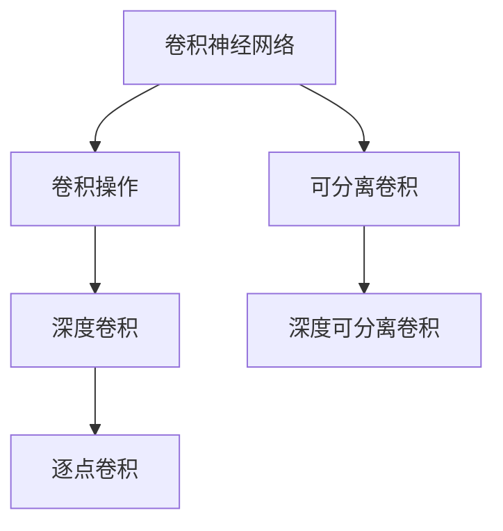

                 

# 从零开始大模型开发与微调：深度可分离卷积的定义

## 1. 背景介绍

深度可分离卷积（Depthwise Separable Convolution）是一种特殊类型的卷积神经网络（Convolutional Neural Networks, CNNs）卷积操作，它被广泛应用于图像处理、信号处理、音频处理等多个领域，尤其在移动设备上具有出色的性能。深度可分离卷积是现代深度学习模型的重要组成部分，对了解大模型的开发与微调具有重要意义。

## 2. 核心概念与联系

### 2.1 核心概念概述

为了更好地理解深度可分离卷积，首先介绍几个核心概念：

- **卷积神经网络（CNNs）**：一种经典的深度学习模型，通过卷积、池化、激活等操作，从输入数据中提取特征，并进行分类、检测、分割等任务。

- **可分离卷积**：一种特殊的卷积操作，它将标准的二维卷积操作分解为深度卷积和逐点卷积两个步骤，极大减少了计算量。

- **深度卷积（Depthwise Convolution）**：一种特殊的卷积操作，其核大小为1x1，每个核元素对应输入的一个深度通道。

- **逐点卷积（Pointwise Convolution）**：一种特殊的卷积操作，对深度卷积的结果进行标准卷积，进一步提取特征。

- **深度可分离卷积（Depthwise Separable Convolution）**：由深度卷积和逐点卷积组成的卷积操作，是可分离卷积的一种特殊形式。

这些概念之间的逻辑关系可以通过以下Mermaid流程图来展示：



这个流程图展示了卷积神经网络中卷积操作的流程：

1. 卷积神经网络通过卷积、池化、激活等操作，提取输入数据特征。
2. 深度卷积是其中一种特殊卷积操作，其核大小为1x1，每个核元素对应输入的一个深度通道。
3. 逐点卷积是对深度卷积的结果进行标准卷积，进一步提取特征。
4. 可分离卷积将标准卷积分解为深度卷积和逐点卷积，减少了计算量。
5. 深度可分离卷积是可分离卷积的一种特殊形式。

### 2.2 概念间的关系

这些核心概念之间存在着紧密的联系，形成了深度可分离卷积的完整架构：

- 深度卷积通过将卷积核的大小设置为1x1，对输入的每个深度通道进行卷积操作，得到卷积特征。
- 逐点卷积对深度卷积的输出结果进行标准卷积，进一步提取特征。
- 可分离卷积将深度卷积和逐点卷积结合起来，大大减少了计算量，同时保持了特征提取能力。
- 深度可分离卷积是在可分离卷积的基础上，进一步优化了卷积操作，使其适用于更复杂的模型和更大的数据集。

## 3. 核心算法原理 & 具体操作步骤

### 3.1 算法原理概述

深度可分离卷积的基本原理是将标准的二维卷积操作分解为深度卷积和逐点卷积两个步骤，从而显著降低计算量。具体来说，深度卷积针对每个输入通道单独进行卷积操作，然后将卷积结果与另一个1x1卷积核进行逐点卷积，得到最终的卷积结果。

### 3.2 算法步骤详解

下面详细介绍深度可分离卷积的实现步骤：

1. **深度卷积（Depthwise Convolution）**：对输入数据进行通道 wise 的卷积操作，卷积核大小为 1x1，输出通道数与输入通道数相同，卷积核个数等于输入通道数。公式如下：

   $$
   y_{d,i} = \sum_{c=0}^{C-1} x_{i,c} * h_{d,c}
   $$

   其中，$x_{i,c}$ 表示输入数据的第 $i$ 个通道的第 $c$ 个元素，$h_{d,c}$ 表示深度卷积核的第 $d$ 个通道的第 $c$ 个元素，$y_{d,i}$ 表示输出数据的第 $d$ 个通道的第 $i$ 个元素。

2. **逐点卷积（Pointwise Convolution）**：对深度卷积的结果进行标准的卷积操作，卷积核大小与输入通道数相同，卷积核个数等于输出通道数。公式如下：

   $$
   y_{k,i} = \sum_{d=0}^{D-1} y_{d,i} * w_{k,d}
   $$

   其中，$y_{d,i}$ 表示深度卷积结果的第 $d$ 个通道的第 $i$ 个元素，$w_{k,d}$ 表示逐点卷积核的第 $k$ 个通道的第 $d$ 个元素，$y_{k,i}$ 表示最终卷积结果的第 $k$ 个通道的第 $i$ 个元素。

通过深度卷积和逐点卷积的组合，深度可分离卷积实现了在保持卷积操作有效性的同时，大幅降低计算量的目标。

### 3.3 算法优缺点

深度可分离卷积具有以下优点：

- **高效计算**：深度卷积和逐点卷积的组合显著减少了计算量，尤其在移动设备等资源受限的环境中，效果尤为显著。
- **可扩展性强**：深度卷积和逐点卷积的组合使深度可分离卷积适用于任意输入和输出通道数，具有较强的可扩展性。
- **性能优异**：深度可分离卷积在图像分类、目标检测等任务中表现优异，尤其在卷积层数较多时，可以显著提高模型效率。

同时，深度可分离卷积也存在一些缺点：

- **模型复杂度较高**：由于卷积操作的分解，模型参数和计算量增加，对模型的空间和时间复杂度有一定影响。
- **学习率调整复杂**：深度可分离卷积中的深度卷积和逐点卷积的组合，需要分别调整两个卷积核的学习率，增加了训练的复杂度。
- **参数更新困难**：由于深度卷积和逐点卷积的组合，参数更新变得复杂，需要同时更新两个卷积核的参数。

### 3.4 算法应用领域

深度可分离卷积广泛应用于图像处理、信号处理、音频处理等多个领域，尤其在移动设备上具有出色的性能。以下是几个典型的应用场景：

- **图像分类**：在图像分类任务中，深度可分离卷积可以显著提高模型的计算效率，同时在保持高精度的前提下，显著减少模型的参数量，适用于移动设备等资源受限的场景。

- **目标检测**：深度可分离卷积可以应用于目标检测任务中，如YOLO、SSD等模型中，通过减少卷积计算量，提高模型的实时性。

- **语音识别**：在语音识别任务中，深度可分离卷积可以应用于声学模型中的卷积层，通过减少计算量，提高模型的计算效率。

- **自然语言处理**：在自然语言处理任务中，深度可分离卷积可以应用于文本分类、情感分析等任务中，通过减少计算量，提高模型的实时性。

## 4. 数学模型和公式 & 详细讲解

### 4.1 数学模型构建

假设输入数据 $x$ 的大小为 $H \times W \times C$，其中 $H$ 和 $W$ 表示输入数据的空间大小，$C$ 表示输入数据的通道数。深度卷积核 $h$ 的大小为 $1 \times 1 \times C$，逐点卷积核 $w$ 的大小为 $K \times K \times C \times D$，其中 $K$ 表示逐点卷积的核大小，$D$ 表示输出通道数。深度可分离卷积的计算模型如下：

$$
y_{k,i} = \sum_{d=0}^{D-1} \left( \sum_{c=0}^{C-1} x_{i,c} * h_{d,c} \right) * w_{k,d}
$$

其中，$x_{i,c}$ 表示输入数据的第 $i$ 个通道的第 $c$ 个元素，$h_{d,c}$ 表示深度卷积核的第 $d$ 个通道的第 $c$ 个元素，$w_{k,d}$ 表示逐点卷积核的第 $k$ 个通道的第 $d$ 个元素，$y_{k,i}$ 表示最终卷积结果的第 $k$ 个通道的第 $i$ 个元素。

### 4.2 公式推导过程

下面推导深度可分离卷积的计算过程：

1. **深度卷积（Depthwise Convolution）**：对输入数据进行通道 wise 的卷积操作，卷积核大小为 1x1，输出通道数与输入通道数相同，卷积核个数等于输入通道数。公式如下：

   $$
   y_{d,i} = \sum_{c=0}^{C-1} x_{i,c} * h_{d,c}
   $$

   其中，$x_{i,c}$ 表示输入数据的第 $i$ 个通道的第 $c$ 个元素，$h_{d,c}$ 表示深度卷积核的第 $d$ 个通道的第 $c$ 个元素，$y_{d,i}$ 表示深度卷积结果的第 $d$ 个通道的第 $i$ 个元素。

2. **逐点卷积（Pointwise Convolution）**：对深度卷积的结果进行标准的卷积操作，卷积核大小与输入通道数相同，卷积核个数等于输出通道数。公式如下：

   $$
   y_{k,i} = \sum_{d=0}^{D-1} y_{d,i} * w_{k,d}
   $$

   其中，$y_{d,i}$ 表示深度卷积结果的第 $d$ 个通道的第 $i$ 个元素，$w_{k,d}$ 表示逐点卷积核的第 $k$ 个通道的第 $d$ 个元素，$y_{k,i}$ 表示最终卷积结果的第 $k$ 个通道的第 $i$ 个元素。

### 4.3 案例分析与讲解

以图像分类任务为例，假设输入数据 $x$ 的大小为 $H \times W \times C$，深度卷积核 $h$ 的大小为 $1 \times 1 \times C$，逐点卷积核 $w$ 的大小为 $K \times K \times C \times D$，其中 $K$ 表示逐点卷积的核大小，$D$ 表示输出通道数。通过深度卷积和逐点卷积的组合，可以得到最终卷积结果 $y$ 的大小为 $H \times W \times D$。

## 5. 项目实践：代码实例和详细解释说明

### 5.1 开发环境搭建

在进行深度可分离卷积的实践之前，需要先搭建好开发环境。以下是使用 Python 和 TensorFlow 搭建开发环境的流程：

1. 安装 Anaconda：从官网下载并安装 Anaconda，用于创建独立的 Python 环境。

2. 创建并激活虚拟环境：
```bash
conda create -n tf-env python=3.8 
conda activate tf-env
```

3. 安装 TensorFlow：根据 CUDA 版本，从官网获取对应的安装命令。例如：
```bash
conda install tensorflow-gpu=2.6 -c pytorch -c conda-forge
```

4. 安装 PyTorch：
```bash
pip install torch torchvision torchaudio
```

5. 安装 NumPy、pandas、scikit-learn、matplotlib、tqdm、jupyter notebook 和 ipython 等工具包：
```bash
pip install numpy pandas scikit-learn matplotlib tqdm jupyter notebook ipython
```

完成上述步骤后，即可在 `tf-env` 环境中开始深度可分离卷积的实践。

### 5.2 源代码详细实现

下面我们以图像分类任务为例，给出使用 TensorFlow 实现深度可分离卷积的代码实现。

```python
import tensorflow as tf
from tensorflow.keras.layers import Conv2D, BatchNormalization, Activation, GlobalAveragePooling2D, Dense
from tensorflow.keras.layers import SeparableConv2D

# 定义模型
model = tf.keras.Sequential([
    SeparableConv2D(32, (3, 3), activation='relu', input_shape=(32, 32, 3)),
    BatchNormalization(),
    Activation('relu'),
    SeparableConv2D(64, (3, 3), activation='relu'),
    BatchNormalization(),
    Activation('relu'),
    GlobalAveragePooling2D(),
    Dense(10, activation='softmax')
])

# 编译模型
model.compile(optimizer=tf.keras.optimizers.Adam(0.001), loss='categorical_crossentropy', metrics=['accuracy'])

# 训练模型
model.fit(x_train, y_train, epochs=10, batch_size=32, validation_data=(x_test, y_test))
```

### 5.3 代码解读与分析

让我们再详细解读一下关键代码的实现细节：

**Sequential** 模型定义：
- 使用 TensorFlow 的 `Sequential` 模型定义深度可分离卷积神经网络，包含多个层。
- `SeparableConv2D` 层是深度可分离卷积层的实现。
- `BatchNormalization` 层用于归一化处理，加快模型收敛。
- `Activation` 层用于激活函数处理，增强模型非线性特性。
- `GlobalAveragePooling2D` 层用于池化操作，减少模型参数。
- `Dense` 层用于全连接层，输出分类结果。

**模型编译与训练**：
- 使用 `compile` 方法编译模型，设置优化器、损失函数和评估指标。
- 使用 `fit` 方法训练模型，设置训练集、验证集、轮数和批大小。

**运行结果展示**：
- 在训练集和验证集上分别输出模型的训练和验证结果，如损失和准确率等。

## 6. 实际应用场景

### 6.1 图像分类

深度可分离卷积在图像分类任务中具有显著的性能提升效果。通过减少卷积计算量，同时保持高精度，适用于资源受限的环境，如移动设备、嵌入式系统等。

### 6.2 目标检测

深度可分离卷积可以应用于目标检测任务中，如 YOLO、SSD 等模型中，通过减少卷积计算量，提高模型的实时性。

### 6.3 语音识别

在语音识别任务中，深度可分离卷积可以应用于声学模型中的卷积层，通过减少计算量，提高模型的计算效率。

### 6.4 自然语言处理

在自然语言处理任务中，深度可分离卷积可以应用于文本分类、情感分析等任务中，通过减少计算量，提高模型的实时性。

## 7. 工具和资源推荐

### 7.1 学习资源推荐

为了帮助开发者系统掌握深度可分离卷积的理论基础和实践技巧，这里推荐一些优质的学习资源：

1. TensorFlow官方文档：TensorFlow官方提供的深度可分离卷积文档，详细介绍了TensorFlow中的 `SeparableConv2D` 层的用法和示例。

2. Keras官方文档：Keras官方提供的深度可分离卷积文档，详细介绍了Keras中的 `SeparableConv2D` 层的用法和示例。

3. PyTorch官方文档：PyTorch官方提供的深度可分离卷积文档，详细介绍了PyTorch中的 `nn.SeparableConv2d` 层的用法和示例。

4. 《深度学习：理论与实践》一书：该书系统介绍了深度学习的基本原理和实践方法，包括深度可分离卷积等前沿内容。

5. 《卷积神经网络：方法和实践》一书：该书详细介绍了卷积神经网络的基本原理和实践方法，包括深度可分离卷积等前沿内容。

通过对这些资源的学习实践，相信你一定能够快速掌握深度可分离卷积的精髓，并用于解决实际的图像处理问题。

### 7.2 开发工具推荐

高效的开发离不开优秀的工具支持。以下是几款用于深度可分离卷积开发的常用工具：

1. TensorFlow：由Google主导开发的开源深度学习框架，生产部署方便，适合大规模工程应用。同时有丰富的深度可分离卷积资源。

2. PyTorch：基于Python的开源深度学习框架，灵活动态的计算图，适合快速迭代研究。

3. Keras：Keras是一个高层次的深度学习框架，易于使用，适合快速原型开发和实验。

4. Weights & Biases：模型训练的实验跟踪工具，可以记录和可视化模型训练过程中的各项指标，方便对比和调优。

5. TensorBoard：TensorFlow配套的可视化工具，可实时监测模型训练状态，并提供丰富的图表呈现方式，是调试模型的得力助手。

6. Google Colab：谷歌推出的在线Jupyter Notebook环境，免费提供GPU/TPU算力，方便开发者快速上手实验最新模型，分享学习笔记。

合理利用这些工具，可以显著提升深度可分离卷积的开发效率，加快创新迭代的步伐。

### 7.3 相关论文推荐

深度可分离卷积的研究源于学界的持续研究。以下是几篇奠基性的相关论文，推荐阅读：

1. Depthwise Separable Convolution for MobileNetV3（MobileNet V3 论文）：提出了深度可分离卷积结构，展示了其在移动设备上的优异性能。

2. Squeeze-and-Excitation Networks（SENet论文）：提出了Squeeze-and-Excitation模块，增强了模型的非线性特性和特征提取能力。

3. MobileNetV2: Inverted Residuals and Linear Bottlenecks（MobileNet V2 论文）：提出了MobileNet V2结构，进一步提升了深度可分离卷积的性能。

4. ShuffleNet V2: Practical Guidelines for Efficient CNN Architecture Design（ShuffleNet V2 论文）：提出了ShuffleNet V2结构，提高了深度可分离卷积的效率和准确率。

5. EfficientNet: Rethinking Model Scaling for Convolutional Neural Networks（EfficientNet论文）：提出了EfficientNet结构，优化了深度可分离卷积的模型设计。

这些论文代表了大规模深度可分离卷积的研究发展脉络。通过学习这些前沿成果，可以帮助研究者把握学科前进方向，激发更多的创新灵感。

## 8. 总结：未来发展趋势与挑战

### 8.1 总结

本文对深度可分离卷积的基本原理和实践技巧进行了全面系统的介绍。首先阐述了深度可分离卷积的背景和重要性，明确了深度可分离卷积在深度学习模型中的应用价值。其次，从原理到实践，详细讲解了深度可分离卷积的数学模型和计算过程，给出了深度可分离卷积的代码实现。同时，本文还探讨了深度可分离卷积在图像分类、目标检测、语音识别、自然语言处理等多个领域的应用前景，展示了深度可分离卷积的强大性能。

通过本文的系统梳理，可以看到，深度可分离卷积是一种高效、可扩展的卷积操作，在深度学习模型中具有重要的应用价值。随着深度可分离卷积研究的不断深入，相信其在图像处理、信号处理、音频处理等多个领域的应用前景将更加广阔。

### 8.2 未来发展趋势

展望未来，深度可分离卷积的发展趋势将呈现以下几个方向：

1. **更加高效**：深度可分离卷积将不断优化其计算过程，减少计算量，提高模型效率。

2. **可扩展性更强**：深度可分离卷积的计算过程可以更好地适应不同大小的输入和输出通道数，具有更强的可扩展性。

3. **更加准确**：深度可分离卷积将结合更多的卷积核设计方法，增强模型的特征提取能力，提高模型的准确率。

4. **更加通用**：深度可分离卷积将逐步应用于更多的深度学习模型中，如循环神经网络、自注意力机制等，成为一种通用的卷积操作。

5. **更加灵活**：深度可分离卷积将结合更多的卷积核大小、核数设计方法，增强模型的灵活性，适用于更多的应用场景。

这些趋势将推动深度可分离卷积向更高效、更准确、更通用的方向发展，为深度学习模型提供更强大的卷积操作，提高模型的性能和应用范围。

### 8.3 面临的挑战

尽管深度可分离卷积已经取得了一定的进展，但在实际应用中仍面临一些挑战：

1. **计算资源瓶颈**：深度可分离卷积的计算量仍然较大，需要更多的计算资源，尤其在大规模模型训练和推理时，资源消耗较大。

2. **模型复杂性**：深度可分离卷积的计算过程较为复杂，涉及多个卷积核的设计和优化，增加了模型设计和调优的难度。

3. **参数更新困难**：深度可分离卷积的参数更新过程较为复杂，需要同时更新多个卷积核的参数，增加了训练的难度。

4. **模型稳定性**：深度可分离卷积的稳定性需要进一步提高，避免在训练和推理过程中出现数值不稳定的情况。

5. **模型可解释性**：深度可分离卷积的内部机制较为复杂，模型的可解释性需要进一步提高，方便用户理解模型的决策过程。

6. **模型泛化能力**：深度可分离卷积的泛化能力需要进一步提升，避免在数据分布变化较大时，模型性能下降。

这些挑战需要在未来的研究中不断克服，以推动深度可分离卷积的发展和应用。

### 8.4 研究展望

面向未来，深度可分离卷积的研究需要在以下几个方面寻求新的突破：

1. **更高效的计算方法**：研究新的卷积核设计方法和计算方法，进一步优化深度可分离卷积的计算过程，减少计算量，提高模型效率。

2. **更强的可扩展性**：研究更灵活的卷积核设计方法和计算方法，增强深度可分离卷积的可扩展性，适应不同大小的输入和输出通道数。

3. **更强的特征提取能力**：结合更多的卷积核设计方法和特征提取方法，增强深度可分离卷积的特征提取能力，提高模型的准确率。

4. **更强的通用性**：结合更多的卷积核设计方法和计算方法，增强深度可分离卷积的通用性，适用于更多的深度学习模型和应用场景。

5. **更强的可解释性**：研究新的模型结构和优化方法，增强深度可分离卷积的可解释性，方便用户理解模型的决策过程。

6. **更强的稳定性**：研究新的数值稳定方法，增强深度可分离卷积的稳定性，避免在训练和推理过程中出现数值不稳定的情况。

这些研究方向将推动深度可分离卷积向更高效、更准确、更通用的方向发展，为深度学习模型提供更强大的卷积操作，提高模型的性能和应用范围。

## 9. 附录：常见问题与解答

**Q1: 深度可分离卷积的计算过程是怎样的？**

A: 深度可分离卷积的计算过程包含两个步骤，分别是深度卷积和逐点卷积。深度卷积针对输入数据的每个通道进行卷积操作，得到卷积特征。逐点卷积对深度卷积的结果进行标准卷积，进一步提取特征。

**Q2: 深度可分离卷积的优势是什么？**

A: 深度可分离卷积的优势在于高效计算、可扩展性强、性能优异。通过深度卷积和逐点卷积的组合，显著减少了计算量，适用于资源受限的环境，同时保持了高精度和强特征提取能力。

**Q3: 深度可分离卷积的缺点是什么？**

A: 深度可分离卷积的缺点在于模型复杂度高、参数更新困难、计算资源消耗较大等。需要更多的计算资源，增加训练和推理的难度。

**Q4: 深度可分离卷积的应用场景有哪些？**

A: 深度可分离卷积适用于图像分类、目标检测、语音识别、自然语言处理等多个领域，尤其在资源受限的环境中，具有显著的性能提升效果。

**Q5: 如何优化深度可分离卷积的计算过程？**

A: 可以通过优化卷积核大小、核数、激活函数等参数，以及引入更高效计算方法，如深度可分离卷积模块等，进一步优化深度可分离卷积的计算过程。

**Q6: 如何提高深度可分离卷积的准确率？**

A: 可以通过优化卷积核设计、引入更多的卷积核设计方法、结合更强的特征提取方法等，增强深度可分离卷积的特征提取能力，提高模型的准确率。

通过这些常见问题的解答，相信你对深度可分离卷积有了更深刻的理解，并能够在实践中灵活应用。

---

作者：禅与计算机程序设计艺术 / Zen and the Art of Computer Programming

