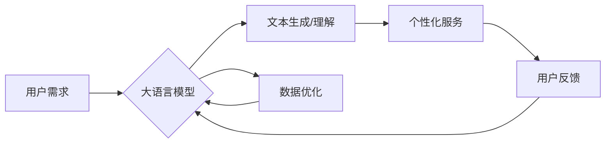

> 大语言模型, 商业模式, AI产品矩阵, 创业, 迁移学习, 个性化服务, 数据驱动, 持续迭代

# 创业者探索大模型新商业模式，打造AI产品矩阵

> 关键词：大语言模型，商业模式，AI产品矩阵，创业，迁移学习，个性化服务，数据驱动，持续迭代

## 1. 背景介绍

随着人工智能技术的飞速发展，大语言模型（Large Language Model，LLM）如BERT、GPT-3等逐渐成为科技界的热点。这些模型能够理解和生成人类语言，为各行各业提供了强大的技术支持。对于创业者而言，探索大模型在商业模式中的应用，打造AI产品矩阵，成为提升企业竞争力的重要途径。

### 1.1 问题的由来

在信息爆炸的时代，创业者面临着激烈的市场竞争和不断变化的市场需求。如何利用先进的人工智能技术，快速响应市场变化，打造差异化的产品和服务，成为创业者关注的焦点。大语言模型作为一种强大的语言理解和生成工具，为创业者提供了新的可能性。

### 1.2 研究现状

目前，大语言模型在商业模式中的应用主要体现在以下几个方面：

- **内容创作与编辑**：利用大语言模型自动生成文章、报告、代码等，提高内容创作效率。
- **智能客服与交互**：通过大语言模型构建智能客服系统，提升客户服务体验。
- **个性化推荐**：利用大语言模型分析用户行为，实现个性化推荐，提高用户满意度。
- **数据分析与洞察**：利用大语言模型处理和分析大量文本数据，提取有价值的信息和洞察。

### 1.3 研究意义

探索大模型在商业模式中的应用，对于创业者具有以下意义：

- **降低成本**：利用大语言模型实现自动化，减少人力成本，提高效率。
- **提升竞争力**：通过打造AI产品矩阵，提供差异化的服务，提升企业竞争力。
- **增强创新能力**：大语言模型能够帮助创业者发现新的市场机会，增强创新能力。

### 1.4 本文结构

本文将从以下几个方面探讨创业者如何利用大模型打造AI产品矩阵：

- **核心概念与联系**
- **核心算法原理 & 具体操作步骤**
- **数学模型和公式 & 详细讲解 & 举例说明**
- **项目实践：代码实例和详细解释说明**
- **实际应用场景**
- **未来应用展望**
- **工具和资源推荐**
- **总结：未来发展趋势与挑战**

## 2. 核心概念与联系

### 2.1 核心概念

- **大语言模型**：一种能够理解和生成人类语言的深度学习模型，如BERT、GPT-3等。
- **迁移学习**：将一个领域的学习经验应用到另一个相关领域的学习中。
- **个性化服务**：根据用户需求和偏好提供定制化的服务。
- **数据驱动**：基于数据分析和洞察进行决策和优化。

### 2.2 架构流程图



## 3. 核心算法原理 & 具体操作步骤

### 3.1 算法原理概述

大语言模型通过在大量文本数据上预训练，学习到丰富的语言知识和模式。在此基础上，创业者可以利用迁移学习技术，将大语言模型应用于不同的场景，实现个性化服务。

### 3.2 算法步骤详解

1. **数据收集与处理**：收集与目标应用场景相关的文本数据，并进行清洗、标注等预处理工作。
2. **模型选择与预训练**：选择合适的大语言模型，并在预训练数据上进行预训练。
3. **模型微调**：利用迁移学习技术，在收集到的标注数据上对模型进行微调。
4. **个性化服务**：根据用户需求和偏好，利用微调后的模型提供个性化服务。
5. **用户反馈与迭代**：收集用户反馈，不断优化模型和服务。

### 3.3 算法优缺点

#### 优点

- **高效性**：大语言模型能够快速处理和分析大量文本数据，提高工作效率。
- **个性化**：通过迁移学习，可以实现个性化服务，提升用户满意度。
- **灵活性**：大语言模型的应用场景广泛，可以根据不同需求进行定制化开发。

#### 缺点

- **数据依赖**：模型性能很大程度上取决于数据的质量和数量。
- **计算资源**：大语言模型的训练和推理需要大量的计算资源。
- **可解释性**：模型的决策过程往往难以解释，可能存在安全隐患。

### 3.4 算法应用领域

大语言模型在以下领域具有广泛的应用前景：

- **内容创作与编辑**：自动生成文章、报告、代码等。
- **智能客服与交互**：构建智能客服系统，提升客户服务体验。
- **个性化推荐**：根据用户行为和偏好提供个性化推荐。
- **数据分析与洞察**：分析市场趋势、用户需求等，提供决策支持。

## 4. 数学模型和公式 & 详细讲解 & 举例说明

### 4.1 数学模型构建

大语言模型通常采用深度神经网络（Deep Neural Network，DNN）进行构建。以下以Transformer模型为例，介绍其数学模型。

#### Transformer模型

Transformer模型是一种基于自注意力机制（Self-Attention Mechanism）的神经网络模型，其核心思想是利用自注意力机制，对输入序列进行全局建模。

#### 数学公式

$$
\text{Attention}(Q, K, V) = \text{softmax}\left(\frac{QK^T}{\sqrt{d_k}}\right)V
$$

其中：

- $Q$：查询序列的线性变换。
- $K$：键序列的线性变换。
- $V$：值序列的线性变换。
- $d_k$：键和查询的维度。
- $\text{softmax}$：Softmax函数。

### 4.2 公式推导过程

#### Softmax函数

Softmax函数是一种将实数向量映射到概率分布的函数，其公式如下：

$$
\text{Softmax}(x_i) = \frac{e^{x_i}}{\sum_{j=1}^n e^{x_j}}
$$

其中：

- $x_i$：输入向量中的第 $i$ 个元素。
- $n$：输入向量的维度。

#### 自注意力机制

自注意力机制通过计算查询序列与键序列的相似度，来建模序列内部的关系。其计算公式如下：

$$
\text{Attention}(Q, K, V) = \text{softmax}\left(\frac{QK^T}{\sqrt{d_k}}\right)V
$$

其中：

- $Q$：查询序列的线性变换。
- $K$：键序列的线性变换。
- $V$：值序列的线性变换。
- $d_k$：键和查询的维度。
- $\text{softmax}$：Softmax函数。

### 4.3 案例分析与讲解

以智能客服系统为例，介绍大语言模型在实际应用中的数学模型和公式。

#### 模型选择

选择预训练的BERT模型作为基础模型，并在标注数据上进行微调。

#### 数学模型

BERT模型基于Transformer架构，其数学模型如上所述。

#### 公式推导过程

1. **文本预处理**：对输入文本进行分词、编码等预处理。
2. **模型输入**：将预处理后的文本输入BERT模型。
3. **自注意力机制**：BERT模型通过自注意力机制，计算文本内部的相似度。
4. **池化层**：将自注意力机制的结果进行池化，得到文本的语义表示。
5. **输出层**：将语义表示输入输出层，得到预测结果。

## 5. 项目实践：代码实例和详细解释说明

### 5.1 开发环境搭建

1. **Python环境**：安装Python 3.7及以上版本。
2. **深度学习框架**：安装TensorFlow或PyTorch。
3. **预训练模型**：下载预训练的BERT模型。

### 5.2 源代码详细实现

以下是一个简单的智能客服系统示例：

```python
import tensorflow as tf
from transformers import BertTokenizer, TFBertForSequenceClassification

# 1. 加载预训练模型和分词器
tokenizer = BertTokenizer.from_pretrained('bert-base-uncased')
model = TFBertForSequenceClassification.from_pretrained('bert-base-uncased')

# 2. 文本预处理
def preprocess(text):
    encoding = tokenizer(text, truncation=True, padding=True, max_length=512)
    return encoding

# 3. 模型预测
def predict(text):
    encoding = preprocess(text)
    input_ids = tf.convert_to_tensor(encoding['input_ids'])
    attention_mask = tf.convert_to_tensor(encoding['attention_mask'])
    outputs = model(input_ids, attention_mask=attention_mask)
    logits = outputs.logits
    return logits

# 4. 测试
text = "您好，我想咨询一下关于产品A的售后服务政策。"
logits = predict(text)
predictions = tf.argmax(logits, axis=1)
print(f"预测结果：{predictions.numpy()[0]}")
```

### 5.3 代码解读与分析

1. **导入库**：导入TensorFlow和Transformers库。
2. **加载模型和分词器**：加载预训练的BERT模型和分词器。
3. **文本预处理**：定义预处理函数，对输入文本进行分词、编码等操作。
4. **模型预测**：定义预测函数，将预处理后的文本输入模型，得到预测结果。
5. **测试**：测试模型，预测用户提问的类别。

### 5.4 运行结果展示

运行代码后，模型将预测用户提问的类别，例如“售后服务咨询”等。

## 6. 实际应用场景

### 6.1 智能客服系统

利用大语言模型构建智能客服系统，能够提高客户服务效率，提升客户满意度。

### 6.2 个性化推荐系统

利用大语言模型分析用户行为，实现个性化推荐，提高用户满意度。

### 6.3 内容创作与编辑

利用大语言模型自动生成文章、报告、代码等，提高内容创作效率。

### 6.4 数据分析与洞察

利用大语言模型处理和分析大量文本数据，提取有价值的信息和洞察。

## 7. 工具和资源推荐

### 7.1 学习资源推荐

- 《深度学习自然语言处理》
- 《动手学深度学习》
- 《Transformer从原理到实践》

### 7.2 开发工具推荐

- TensorFlow
- PyTorch
- HuggingFace Transformers库

### 7.3 相关论文推荐

- Transformer：Attention is All You Need
- BERT：Pre-training of Deep Bidirectional Transformers for Language Understanding
- GPT-3：Language Models are Few-Shot Learners

## 8. 总结：未来发展趋势与挑战

### 8.1 研究成果总结

本文介绍了大语言模型在商业模式中的应用，并探讨了创业者如何利用大模型打造AI产品矩阵。通过迁移学习、个性化服务、数据驱动等技术，大语言模型能够帮助创业者提高效率、提升竞争力、增强创新能力。

### 8.2 未来发展趋势

- **模型规模扩大**：随着计算资源的提升，未来大语言模型将更加庞大，能够处理更加复杂的任务。
- **迁移学习技术进步**：迁移学习技术将更加成熟，能够更好地将预训练模型应用于不同领域。
- **个性化服务升级**：个性化服务将更加精准，能够满足用户多样化的需求。
- **数据驱动决策**：数据驱动决策将成为常态，帮助企业更好地应对市场变化。

### 8.3 面临的挑战

- **数据安全和隐私**：如何保护用户数据安全和隐私，成为一大挑战。
- **计算资源限制**：大语言模型的训练和推理需要大量的计算资源，如何降低成本成为关键。
- **模型可解释性**：大语言模型的决策过程难以解释，如何提高可解释性成为重要课题。
- **伦理问题**：如何避免大语言模型被用于不当用途，成为需要关注的伦理问题。

### 8.4 研究展望

未来，大语言模型在商业模式中的应用将更加广泛，为创业者提供更多机遇。同时，如何应对挑战，推动大语言模型健康发展，也将成为研究的重要方向。

## 9. 附录：常见问题与解答

**Q1：大语言模型在哪些领域具有应用价值？**

A：大语言模型在内容创作、智能客服、个性化推荐、数据分析与洞察等领域具有广泛的应用价值。

**Q2：如何利用大语言模型打造AI产品矩阵？**

A：创业者可以通过以下步骤利用大语言模型打造AI产品矩阵：
1. 选择合适的大语言模型。
2. 收集与目标应用场景相关的文本数据。
3. 利用迁移学习技术对模型进行微调。
4. 将微调后的模型应用于不同的场景，提供个性化服务。

**Q3：大语言模型的训练和推理需要哪些计算资源？**

A：大语言模型的训练和推理需要大量的计算资源，包括GPU、TPU等。

**Q4：如何保证大语言模型的可解释性？**

A：提高大语言模型的可解释性需要从多个方面进行努力，包括改进模型结构、引入可解释性技术等。

**Q5：大语言模型在应用中存在哪些伦理问题？**

A：大语言模型在应用中存在数据安全和隐私、歧视、偏见等伦理问题，需要引起重视并采取措施加以解决。

---

作者：禅与计算机程序设计艺术 / Zen and the Art of Computer Programming