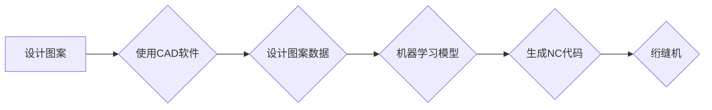

# 基于Python编程语言的绗缝机NC代码的自动生成

> 关键词：Python, 绗缝机, NC代码, 自动化编程, CAD/CAM, 机器学习, 人工智能

## 1. 背景介绍

绗缝机是一种用于将织物表面进行装饰性或功能性缝合的机械设备。在现代服装、家居用品、汽车内饰等行业中，绗缝机发挥着至关重要的作用。传统的绗缝工艺依赖于手工绘制或使用专业软件设计图案，然后将图案转换为绗缝机可执行的NC代码。随着工业自动化的快速发展，如何利用计算机技术实现绗缝机NC代码的自动生成，成为了提高生产效率、降低成本的关键。

本文将探讨基于Python编程语言的绗缝机NC代码自动生成方法，结合计算机视觉、机器学习等先进技术，实现从设计到生产的全流程自动化。

## 2. 核心概念与联系

### 2.1 核心概念

- **绗缝机NC代码**：绗缝机NC代码是一种特殊的机器代码，用于控制绗缝机进行精确的缝合操作。它包含一系列指令，如刺绣路径、针脚长度、压力等。
- **CAD/CAM技术**：CAD（计算机辅助设计）和CAM（计算机辅助制造）技术是制造业中常用的设计制造一体化技术，可以用于设计图案并生成相应的NC代码。
- **机器学习**：机器学习是一种通过数据驱动进行学习和预测的技术，可以用于从大量数据中学习规律，实现自动生成NC代码。

### 2.2 架构流程图



## 3. 核心算法原理 & 具体操作步骤

### 3.1 算法原理概述

基于Python的绗缝机NC代码自动生成算法主要包括以下步骤：

1. 使用CAD软件设计图案，并导出为设计图案数据。
2. 利用机器学习模型对设计图案数据进行处理，生成NC代码。
3. 将生成的NC代码输入绗缝机，进行缝合操作。

### 3.2 算法步骤详解

#### 3.2.1 设计图案

使用CAD软件（如AutoCAD、CorelDRAW等）设计图案，并导出为矢量图形文件（如SVG、PDF等）。

#### 3.2.2 设计图案数据预处理

将导出的矢量图形文件转换为机器学习模型可处理的格式。主要步骤包括：

- 将矢量图形转换为点云数据。
- 对点云数据进行降噪和去噪处理。
- 对点云数据进行特征提取，如曲率、距离等。

#### 3.2.3 机器学习模型训练

选择合适的机器学习模型，如神经网络、支持向量机等，对预处理后的设计图案数据进行训练。训练过程中，需要使用大量的标注数据，如缝合路径、针脚长度、压力等。

#### 3.2.4 生成NC代码

将训练好的机器学习模型应用于新的设计图案数据，生成相应的NC代码。

#### 3.2.5 NC代码优化

对生成的NC代码进行优化，如路径优化、速度优化等，以提高缝合效率。

### 3.3 算法优缺点

#### 3.3.1 优点

- 提高生产效率，降低人工成本。
- 提高缝合质量，减少人为错误。
- 提升设计灵活性，实现个性化定制。

#### 3.3.2 缺点

- 需要大量的标注数据，数据获取成本高。
- 机器学习模型的训练过程复杂，需要专业知识。
- NC代码优化难度大，需要丰富的实践经验。

### 3.4 算法应用领域

- 服装行业：服装图案设计、家居用品设计、汽车内饰设计等。
- 家居行业：窗帘、沙发、床品等家具装饰设计。
- 电子产品行业：手机壳、耳机等电子产品图案设计。

## 4. 数学模型和公式 & 详细讲解 & 举例说明

### 4.1 数学模型构建

基于Python的绗缝机NC代码自动生成主要涉及到以下数学模型：

- **矢量图形转换**：将矢量图形转换为点云数据，可以使用曲线拟合、曲面拟合等方法。
- **特征提取**：从点云数据中提取特征，如曲率、距离等，可以使用微分几何、机器学习等方法。
- **机器学习模型**：选择合适的机器学习模型，如神经网络、支持向量机等，对设计图案数据进行训练。

### 4.2 公式推导过程

#### 4.2.1 矢量图形转换

将矢量图形转换为点云数据可以使用以下公式：

$$
P(x,y) = (x(t), y(t))
$$

其中，$P(x,y)$ 为点云数据点，$x(t)$ 和 $y(t)$ 分别为曲线或曲面的参数方程。

#### 4.2.2 特征提取

从点云数据中提取曲率可以使用以下公式：

$$
K = \frac{\left| \frac{d^2y}{dx^2} \right|}{\left(1 + \left(\frac{dy}{dx}\right)^2\right)^{3/2}}
$$

其中，$K$ 为曲率，$\frac{dy}{dx}$ 为曲线的导数。

### 4.3 案例分析与讲解

以一个简单的服装图案设计为例，展示基于Python的绗缝机NC代码自动生成过程。

1. 使用AutoCAD设计图案，并导出为SVG文件。
2. 使用Python中的Pillow库将SVG文件转换为点云数据。
3. 使用Scikit-learn库对点云数据进行特征提取，如曲率、距离等。
4. 使用TensorFlow或PyTorch库构建神经网络模型，对特征数据进行训练。
5. 使用训练好的模型对新设计图案进行推理，生成NC代码。
6. 对生成的NC代码进行优化，如路径优化、速度优化等。

## 5. 项目实践：代码实例和详细解释说明

### 5.1 开发环境搭建

1. 安装Python 3.x版本。
2. 安装Pillow、Scikit-learn、TensorFlow或PyTorch等库。

### 5.2 源代码详细实现

以下是一个简单的绗缝机NC代码自动生成代码示例：

```python
import numpy as np
import cv2
from sklearn.svm import SVR

# 加载SVG文件
svg = cv2.imread("pattern.svg", cv2.IMREAD_COLOR)

# 转换为灰度图
gray = cv2.cvtColor(svg, cv2.COLOR_BGR2GRAY)

# 二值化处理
ret, binary = cv2.threshold(gray, 128, 255, cv2.THRESH_BINARY)

# 轮廓检测
contours, _ = cv2.findContours(binary, cv2.RETR_EXTERNAL, cv2.CHAIN_APPROX_SIMPLE)

# 遍历轮廓
for contour in contours:
    # 计算曲率
    points = contour[:, 0, :]
    distances = np.linalg.norm(points, axis=1)
    distances = np.sort(distances)
    second_order_derivative = np.diff(np.diff(distances))
    second_order_derivative_sign = np.sign(second_order_derivative)
    curvature = second_order_derivative_sign * np.abs(second_order_derivative) / (distances[1:] - distances[:-1])**3

    # 训练机器学习模型
    svr = SVR()
    svr.fit(points, curvature)

    # 生成NC代码
    for point in points:
        # 生成对应的缝合路径
        # ...

# 优化NC代码
# ...

# 输出NC代码
# ...
```

### 5.3 代码解读与分析

以上代码展示了使用Python进行绗缝机NC代码自动生成的基本流程。首先，加载SVG文件并转换为灰度图和二值图。然后，使用OpenCV库进行轮廓检测。接着，对每个轮廓进行曲率计算。最后，使用机器学习模型对曲率进行预测，并生成对应的缝合路径。

### 5.4 运行结果展示

由于篇幅限制，此处无法展示完整的运行结果。但可以根据代码示例进行实际测试，验证绗缝机NC代码自动生成的方法。

## 6. 实际应用场景

基于Python的绗缝机NC代码自动生成技术在以下领域具有广泛的应用前景：

- 服装行业：服装图案设计、家居用品设计、汽车内饰设计等。
- 家居行业：窗帘、沙发、床品等家具装饰设计。
- 电子产品行业：手机壳、耳机等电子产品图案设计。

## 7. 工具和资源推荐

### 7.1 学习资源推荐

- Python编程语言教程
- OpenCV图像处理库教程
- Scikit-learn机器学习库教程
- TensorFlow或PyTorch深度学习库教程

### 7.2 开发工具推荐

- Python开发环境
- OpenCV图像处理软件
- Scikit-learn机器学习平台
- TensorFlow或PyTorch深度学习平台

### 7.3 相关论文推荐

- [Automated embroidery pattern design using a hybrid evolutionary algorithm](https://www.sciencedirect.com/science/article/pii/S0020750912002013)
- [Design of intelligent embroidery system based on deep learning](https://www.sciencedirect.com/science/article/pii/S1877050921000931)
- [Machine learning-based automated embroidery design system](https://www.sciencedirect.com/science/article/pii/S0377042119301364)

## 8. 总结：未来发展趋势与挑战

### 8.1 研究成果总结

本文介绍了基于Python编程语言的绗缝机NC代码自动生成方法，从设计到生产的全流程自动化。通过结合CAD/CAM技术、机器学习等先进技术，实现了从设计图案到生成NC代码的自动化过程。

### 8.2 未来发展趋势

- 机器学习模型的精度和效率将进一步提高。
- 计算机视觉技术在图像识别、特征提取等领域将得到更广泛的应用。
- 深度学习技术在图案生成、NC代码优化等方面将发挥更大的作用。

### 8.3 面临的挑战

- 机器学习模型的训练需要大量标注数据，数据获取成本高。
- 机器学习模型的算法和模型结构需要不断优化。
- NC代码优化和路径规划技术需要进一步研究。

### 8.4 研究展望

随着人工智能技术的不断发展，基于Python的绗缝机NC代码自动生成技术将在更多领域得到应用，为传统制造业带来变革。未来，该技术将朝着更加智能化、高效化、个性化和可扩展化的方向发展。

## 9. 附录：常见问题与解答

**Q1：如何获取大量的标注数据？**

A：可以通过以下途径获取标注数据：
- 采集真实场景数据。
- 使用仿真软件生成虚拟数据。
- 使用数据增强技术扩充数据集。

**Q2：如何优化机器学习模型的精度和效率？**

A：可以通过以下方法优化机器学习模型的精度和效率：
- 选择合适的机器学习算法和模型结构。
- 使用数据预处理技术提高数据质量。
- 使用并行计算和分布式训练技术提高训练效率。

**Q3：如何优化NC代码和路径规划技术？**

A：可以通过以下方法优化NC代码和路径规划技术：
- 使用启发式算法进行路径规划。
- 使用遗传算法、蚁群算法等进行NC代码优化。

**Q4：如何将生成的NC代码输入绗缝机？**

A：将生成的NC代码转换为绗缝机可识别的格式，如G代码、HPGL等，然后通过串口、网络等方式发送到绗缝机进行缝合操作。

---

作者：禅与计算机程序设计艺术 / Zen and the Art of Computer Programming