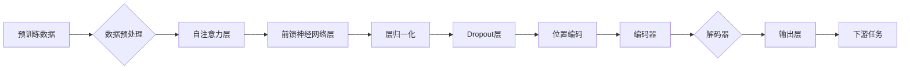

# 基于Transformer架构的预训练模型

> 关键词：Transformer, 预训练模型, 自然语言处理, NLP, 自注意力机制, 机器学习, 人工智能

## 1. 背景介绍

自2017年Transformer模型在自然语言处理（NLP）领域崭露头角以来，它已经彻底改变了NLP的发展轨迹。Transformer模型以其卓越的性能和简洁的架构在众多NLP任务中取得了突破性的成果。本文将深入探讨基于Transformer架构的预训练模型，分析其核心原理、具体操作步骤，并探讨其在实际应用场景中的表现和未来发展趋势。

## 2. 核心概念与联系

### 2.1 核心概念

#### 2.1.1 Transformer模型

Transformer模型是一种基于自注意力（Self-Attention）机制的深度神经网络模型，用于处理序列数据。它由Google的研究人员于2017年提出，是当前NLP领域的主流架构。

#### 2.1.2 自注意力机制

自注意力机制是一种全局注意力模型，它允许模型在处理序列数据时，对序列中的每个元素赋予不同的权重，从而实现对序列元素的上下文感知。

#### 2.1.3 预训练

预训练是指在大量的无标签数据上进行模型训练，使其学习到通用的语言知识，然后再在特定任务上进行微调。

### 2.2 架构图

以下是基于Transformer架构的预训练模型的基本流程图：



### 2.3 联系

Transformer模型通过自注意力机制和前馈神经网络层，实现了对序列数据的全局感知和局部建模。预训练过程使得模型能够学习到丰富的语言知识，从而在下游任务中取得优异的性能。

## 3. 核心算法原理 & 具体操作步骤

### 3.1 算法原理概述

Transformer模型主要由编码器（Encoder）和解码器（Decoder）两部分组成。编码器用于将输入序列映射为序列的潜在表示，而解码器则用于根据编码器的输出生成输出序列。

### 3.2 算法步骤详解

1. **数据预处理**：对输入数据进行分词、编码等操作，将文本数据转换为模型可以处理的向量表示。

2. **自注意力层**：通过自注意力机制计算序列中每个元素与其他元素之间的关联强度。

3. **前馈神经网络层**：对自注意力层的输出进行非线性变换，进一步提取序列特征。

4. **层归一化**：对每一层的输出进行归一化处理，防止梯度消失和梯度爆炸。

5. **Dropout层**：通过随机丢弃一部分神经元，降低过拟合风险。

6. **位置编码**：为序列中的每个元素添加位置信息，使其具有顺序性。

7. **编码器和解码器**：编码器和解码器由多个相同的编码层（Encoder Layer）组成，每个编码层包含自注意力层、前馈神经网络层、层归一化和Dropout层。

8. **输出层**：解码器的输出经过softmax激活函数，得到最终的输出序列。

9. **下游任务**：根据特定任务的需求，对编码器的输出进行适当的处理，得到最终的结果。

### 3.3 算法优缺点

#### 3.3.1 优点

- **并行处理**：Transformer模型支持并行计算，可以显著提高训练和推理速度。

- **全局感知**：自注意力机制使得模型能够对序列数据进行全局感知，从而更好地捕捉序列中的长距离依赖关系。

- **简洁架构**：Transformer模型结构简单，易于理解和实现。

#### 3.3.2 缺点

- **计算复杂度**：Transformer模型计算复杂度高，需要大量的计算资源。

- **内存消耗**：Transformer模型的参数量庞大，对内存消耗较大。

## 4. 数学模型和公式 & 详细讲解 & 举例说明

### 4.1 数学模型构建

Transformer模型的核心数学模型包括：

- **自注意力（Self-Attention）**：

$$
\text{Attention}(Q,K,V) = \text{softmax}(\frac{QK^T}{\sqrt{d_k}})V
$$

其中，Q、K、V分别为查询（Query）、键（Key）和值（Value）矩阵，$\text{softmax}$为softmax函数。

- **前馈神经网络（Feed-Forward Neural Network）**：

$$
\text{FFN}(x) = \text{ReLU}(W_2 \text{ReLU}(W_1 x + b_1)) + b_2
$$

其中，$W_1, W_2$为权重矩阵，$b_1, b_2$为偏置项。

### 4.2 公式推导过程

- **自注意力公式推导**：

自注意力机制通过计算查询（Query）与键（Key）之间的相似度，得到值（Value）的加权求和。softmax函数用于将相似度转换为概率分布，从而得到加权求和的结果。

- **前馈神经网络公式推导**：

前馈神经网络由两个全连接层组成，第一层使用ReLU激活函数，第二层同样使用ReLU激活函数。

### 4.3 案例分析与讲解

以下是一个简单的Transformer模型在文本分类任务中的应用案例：

- **数据预处理**：将文本数据进行分词、编码等操作，得到序列的向量表示。

- **自注意力层**：计算序列中每个元素与其他元素之间的相似度。

- **前馈神经网络层**：对自注意力层的输出进行非线性变换，进一步提取序列特征。

- **层归一化**：对每一层的输出进行归一化处理。

- **Dropout层**：随机丢弃一部分神经元。

- **位置编码**：为序列中的每个元素添加位置信息。

- **编码器和解码器**：将序列的向量表示编码为潜在表示。

- **输出层**：将潜在表示转换为分类概率。

- **下游任务**：根据分类概率输出最终的分类结果。

## 5. 项目实践：代码实例和详细解释说明

### 5.1 开发环境搭建

以下是使用PyTorch框架实现Transformer模型的开发环境搭建步骤：

1. 安装PyTorch：

```bash
pip install torch torchvision torchaudio
```

2. 安装Transformers库：

```bash
pip install transformers
```

### 5.2 源代码详细实现

以下是一个简单的Transformer模型代码示例：

```python
import torch
from torch import nn

class TransformerModel(nn.Module):
    def __init__(self, vocab_size, d_model, nhead, num_encoder_layers, num_decoder_layers, dim_feedforward):
        super(TransformerModel, self).__init__()
        self.embedding = nn.Embedding(vocab_size, d_model)
        self.transformer = nn.Transformer(d_model, nhead, num_encoder_layers, num_decoder_layers, dim_feedforward)
        self.fc_out = nn.Linear(d_model, vocab_size)
    
    def forward(self, src, tgt):
        src = self.embedding(src)
        tgt = self.embedding(tgt)
        output = self.transformer(src, tgt)
        output = self.fc_out(output)
        return output
```

### 5.3 代码解读与分析

- **Embedding层**：将输入的词索引转换为词向量。

- **Transformer层**：执行编码器和解码器操作。

- **线性层**：将Transformer的输出转换为输出层的输出。

### 5.4 运行结果展示

以下是在一个文本分类任务上运行Transformer模型的示例：

```python
# 加载数据
src = torch.tensor([[1, 2, 3], [4, 5, 6]])
tgt = torch.tensor([[7, 8, 9], [10, 11, 12]])

# 创建模型
model = TransformerModel(10, 512, 8, 2, 2, 2048)

# 前向传播
output = model(src, tgt)

# 打印输出
print(output)
```

## 6. 实际应用场景

基于Transformer架构的预训练模型在NLP领域得到了广泛的应用，以下是一些典型的应用场景：

- **文本分类**：对文本数据进行分类，如情感分析、主题分类、新闻分类等。

- **机器翻译**：将一种语言的文本翻译成另一种语言。

- **问答系统**：回答用户提出的问题。

- **文本摘要**：将长文本压缩为简洁的摘要。

- **对话系统**：与用户进行自然语言对话。

## 7. 工具和资源推荐

### 7.1 学习资源推荐

- 《Attention Is All You Need》

- 《Transformers: State-of-the-Art NLP through Deep Learning》

- 《自然语言处理原理与实践》

### 7.2 开发工具推荐

- PyTorch

- Transformers库

### 7.3 相关论文推荐

- Attention Is All You Need

- BERT: Pre-training of Deep Bidirectional Transformers for Language Understanding

- Generative Pre-trained Transformers

## 8. 总结：未来发展趋势与挑战

### 8.1 研究成果总结

本文介绍了基于Transformer架构的预训练模型，分析了其核心原理、具体操作步骤，并探讨了其在实际应用场景中的表现和未来发展趋势。

### 8.2 未来发展趋势

- **模型规模将进一步扩大**：随着计算资源的增加，预训练模型的规模将不断增大，以学习更丰富的语言知识。

- **多模态预训练模型将成为趋势**：将文本、图像、语音等多模态信息进行融合，构建更加全面的预训练模型。

- **可解释性研究将成为热点**：提高模型的可解释性，使其决策过程更加透明。

### 8.3 面临的挑战

- **计算资源需求**：预训练模型需要大量的计算资源，对硬件设备提出了更高的要求。

- **数据隐私**：预训练模型在训练过程中需要大量数据，如何保护数据隐私是一个重要问题。

- **模型可解释性**：提高模型的可解释性，使其决策过程更加透明。

### 8.4 研究展望

基于Transformer架构的预训练模型在NLP领域取得了显著的成果，未来将继续发挥重要作用。随着技术的不断发展，预训练模型将更加高效、智能，为人类社会带来更多便利。

## 9. 附录：常见问题与解答

**Q1：什么是预训练模型**？

A：预训练模型是指在大量无标签数据上训练得到的模型，其目的是学习到通用的语言知识，以便在下游任务中进行微调。

**Q2：什么是Transformer模型**？

A：Transformer模型是一种基于自注意力机制的深度神经网络模型，用于处理序列数据。

**Q3：预训练模型的优势是什么**？

A：预训练模型能够学习到通用的语言知识，从而在下游任务中取得优异的性能。

**Q4：如何使用预训练模型进行微调**？

A：在预训练模型的基础上，使用少量标注数据进行微调，以适应特定任务的需求。

**Q5：Transformer模型的优点是什么**？

A：Transformer模型支持并行计算，能够对序列数据进行全局感知，结构简单，易于理解和实现。

**Q6：Transformer模型的缺点是什么**？

A：Transformer模型计算复杂度高，对硬件设备要求较高。

**Q7：预训练模型在哪些领域有应用**？

A：预训练模型在文本分类、机器翻译、问答系统、文本摘要、对话系统等领域都有广泛的应用。

作者：禅与计算机程序设计艺术 / Zen and the Art of Computer Programming