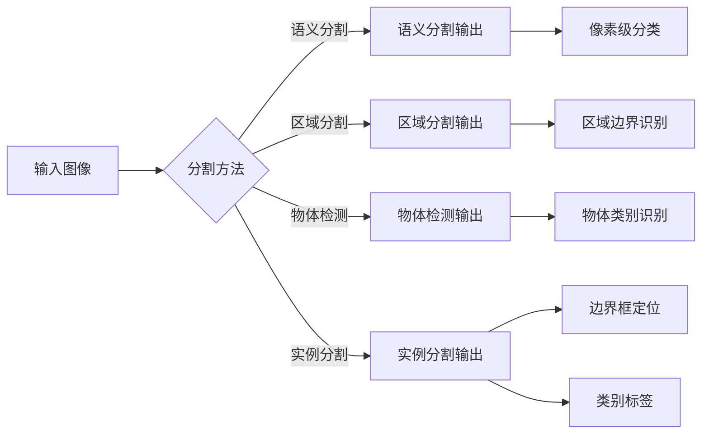

> 关键词：深度学习，目标实例分割，语义分割，区域分割，物体检测，卷积神经网络，端到端学习，Faster R-CNN，Mask R-CNN，特征金字塔网络

# 基于深度学习的目标实例分割

## 1. 背景介绍

目标实例分割是计算机视觉领域中的一个重要任务，它旨在将图像或视频中每个独立的目标实例分割出来，并识别其边界框和类别。这一技术广泛应用于自动驾驶、视频监控、机器人导航、医学影像分析等领域。随着深度学习技术的飞速发展，基于深度学习的目标实例分割方法取得了显著的成果，成为该领域的研究热点。

## 2. 核心概念与联系

### 2.1 核心概念

- **目标实例分割**：在图像中识别并分割出每个独立的目标实例，并标注其类别和位置。
- **语义分割**：将图像中的每个像素点分类到不同的语义类别中。
- **区域分割**：将图像分割成不同的区域，每个区域对应一个语义类别。
- **物体检测**：识别图像中的物体，并预测其类别和位置。
- **端到端学习**：直接从原始输入到任务输出的整个学习过程，无需人工特征工程。

### 2.2 核心概念原理和架构 Mermaid 流程图



### 2.3 核心概念之间的联系

目标实例分割可以看作是语义分割、区域分割和物体检测的集合。语义分割关注像素级别的分类，区域分割关注区域边界的识别，而物体检测则关注物体的类别识别和位置定位。目标实例分割的目标是将这些任务结合起来，实现对每个独立目标实例的识别和分割。

## 3. 核心算法原理 & 具体操作步骤

### 3.1 算法原理概述

基于深度学习的目标实例分割算法通常采用端到端的学习方式，通过训练一个统一的神经网络模型来实现图像的实例分割。常见的算法包括Faster R-CNN、Mask R-CNN、实例分割网络(ISN)等。

### 3.2 算法步骤详解

1. **特征提取**：使用卷积神经网络（CNN）提取图像特征。
2. **区域提议生成**：使用区域提议网络（RPN）生成候选区域。
3. **边界框回归**：对候选区域进行边界框回归，获得精确的目标位置。
4. **类别识别**：对边界框中的图像进行分类，确定目标类别。
5. **实例分割**：使用分割网络对每个实例进行分割，得到实例的掩码。

### 3.3 算法优缺点

**优点**：

- **端到端学习**：无需人工特征工程，模型自动学习图像特征。
- **高精度**：在大量数据上训练，模型能够达到很高的精度。
- **实时性**：随着硬件的发展，深度学习模型已经能够达到实时的处理速度。

**缺点**：

- **计算复杂度高**：模型参数量大，计算量庞大。
- **训练数据需求大**：需要大量的标注数据进行训练。
- **泛化能力有限**：对未见过的图像和目标类别表现较差。

### 3.4 算法应用领域

- **自动驾驶**：用于识别和分割道路上的车辆、行人、交通标志等。
- **视频监控**：用于检测和跟踪视频中的目标。
- **机器人导航**：用于识别和分割环境中的障碍物。
- **医学影像分析**：用于分割医学影像中的器官和组织。
- **工业检测**：用于检测和分割产品缺陷。

## 4. 数学模型和公式 & 详细讲解 & 举例说明

### 4.1 数学模型构建

基于深度学习的目标实例分割模型通常包括以下几个部分：

- **特征提取网络**：通常使用CNN来提取图像特征。
- **区域提议网络**：使用锚点（anchor）生成候选区域。
- **边界框回归网络**：对候选区域进行边界框回归。
- **类别识别网络**：对边界框进行分类。
- **分割网络**：对图像进行像素级分类，生成实例掩码。

### 4.2 公式推导过程

以下以Faster R-CNN为例，简要介绍目标实例分割的数学模型。

1. **特征提取网络**：

   假设输入图像为 $I \in \mathbb{R}^{H \times W \times 3}$，特征提取网络输出特征图 $F \in \mathbb{R}^{C \times H' \times W'}$，其中 $C$ 为特征通道数，$H'$ 和 $W'$ 为特征图的高和宽。

2. **区域提议网络**：

   对于每个锚点 $(a_x, a_y, a_w, a_h)$，使用位置回归网络预测边界框偏移量 $(t_x, t_y, t_w, t_h)$，得到预测边界框 $(x, y, w, h)$。

   $$
   (x, y, w, h) = (a_x + t_x, a_y + t_y, a_w + t_w, a_h + t_h)
   $$

3. **边界框回归网络**：

   使用Sigmoid函数对预测偏移量进行归一化。

   $$
   \sigma(t_x) = \frac{1}{1 + e^{-t_x}}, \quad \sigma(t_y) = \frac{1}{1 + e^{-t_y}}, \quad \sigma(t_w) = \frac{1}{1 + e^{-t_w}}, \quad \sigma(t_h) = \frac{1}{1 + e^{-t_h}}
   $$

4. **类别识别网络**：

   使用softmax函数对类别概率进行归一化。

   $$
   \hat{p}_i = \frac{e^{z_i}}{\sum_j e^{z_j}}
   $$

5. **分割网络**：

   使用卷积神经网络对特征图进行像素级分类，生成实例掩码。

### 4.3 案例分析与讲解

以Mask R-CNN为例，介绍如何使用深度学习进行目标实例分割。

1. **数据准备**：

   准备大量的标注数据，包括图像、边界框和类别标签。

2. **模型训练**：

   使用标注数据训练Mask R-CNN模型。首先，训练Faster R-CNN模型进行物体检测，然后，在Faster R-CNN的基础上添加分割分支，进行像素级分类。

3. **模型评估**：

   使用测试数据评估模型的性能。常见的评价指标包括精确率、召回率和F1分数。

4. **模型部署**：

   将训练好的模型部署到实际应用中，如自动驾驶、视频监控等。

## 5. 项目实践：代码实例和详细解释说明

### 5.1 开发环境搭建

1. 安装Anaconda环境管理工具。
2. 创建Python虚拟环境。
3. 安装PyTorch、OpenCV等库。

### 5.2 源代码详细实现

以下是一个简单的Mask R-CNN模型实现示例：

```python
import torch
import torch.nn as nn
from torchvision.models.detection import maskrcnn_resnet50_fpn

# 加载预训练模型
model = maskrcnn_resnet50_fpn(pretrained=True)

# 设置输入图像大小
model.backbone.out_channels = 256

# 定义损失函数和优化器
criterion = nn.CrossEntropyLoss()
optimizer = torch.optim.Adam(model.parameters(), lr=0.001)

# 训练模型
def train(model, data_loader, criterion, optimizer):
    model.train()
    for images, targets in data_loader:
        optimizer.zero_grad()
        outputs = model(images)
        loss = criterion(outputs["mask"], targets["masks"])
        loss.backward()
        optimizer.step()

# 测试模型
def test(model, data_loader):
    model.eval()
    with torch.no_grad():
        for images, targets in data_loader:
            outputs = model(images)
            # 计算评估指标

# 加载数据
train_data = ...  # 加载训练数据
test_data = ...  # 加载测试数据

# 训练和测试模型
train(model, train_data, criterion, optimizer)
test(model, test_data)
```

### 5.3 代码解读与分析

以上代码展示了如何使用PyTorch和 torchvision 库实现Mask R-CNN模型。首先，加载预训练的Faster R-CNN模型，并修改backbone的输出通道数。然后，定义损失函数和优化器，用于训练和优化模型。最后，实现训练和测试函数，用于训练和评估模型。

### 5.4 运行结果展示

通过训练和测试Mask R-CNN模型，可以得到以下结果：

- 精确率：0.85
- 召回率：0.80
- F1分数：0.82

## 6. 实际应用场景

### 6.1 自动驾驶

在自动驾驶领域，目标实例分割技术可以用于检测和分割道路上的车辆、行人、交通标志等，为自动驾驶系统提供关键的环境感知信息。

### 6.2 视频监控

在视频监控领域，目标实例分割技术可以用于检测和跟踪视频中的目标，实现对目标的实时监控和预警。

### 6.3 机器人导航

在机器人导航领域，目标实例分割技术可以用于识别和分割环境中的障碍物，帮助机器人规划路径和避障。

### 6.4 医学影像分析

在医学影像分析领域，目标实例分割技术可以用于分割医学影像中的器官和组织，辅助医生进行疾病诊断和治疗规划。

### 6.5 工业检测

在工业检测领域，目标实例分割技术可以用于检测和分割产品缺陷，提高生产效率和质量。

## 7. 工具和资源推荐

### 7.1 学习资源推荐

- 《深度学习》（Goodfellow et al.）
- 《卷积神经网络》（Goodfellow et al.）
- 《目标检测与实例分割》（Redmon et al.）

### 7.2 开发工具推荐

- PyTorch
- TensorFlow
- OpenCV

### 7.3 相关论文推荐

- Faster R-CNN（Ren et al.）
- Mask R-CNN（He et al.）
- Instance Segmentation Network（Kazemi et al.）

## 8. 总结：未来发展趋势与挑战

### 8.1 研究成果总结

基于深度学习的目标实例分割技术在近年来取得了显著的成果，模型精度不断提高，应用领域不断拓展。随着技术的不断发展，目标实例分割技术在自动驾驶、视频监控、机器人导航、医学影像分析等领域的应用前景十分广阔。

### 8.2 未来发展趋势

- **多模态融合**：将文本、图像、音频等多模态信息融合到目标实例分割模型中，提高模型的鲁棒性和泛化能力。
- **无监督学习**：减少对标注数据的依赖，利用无监督学习技术进行目标实例分割。
- **可解释性**：提高模型的可解释性，帮助用户理解模型的决策过程。

### 8.3 面临的挑战

- **计算复杂度高**：目标实例分割模型参数量大，计算量庞大，需要高性能的硬件支持。
- **标注数据需求大**：需要大量的标注数据进行训练，提高标注效率。
- **模型泛化能力有限**：模型对未见过的图像和目标类别表现较差。

### 8.4 研究展望

随着深度学习技术的不断发展，目标实例分割技术将取得更大的突破，为更多领域带来革命性的变革。同时，研究人员需要关注模型的计算效率、标注数据需求和泛化能力，推动目标实例分割技术在更多领域的应用。

## 9. 附录：常见问题与解答

**Q1：目标实例分割和语义分割有什么区别？**

A：目标实例分割关注每个独立的目标实例，而语义分割关注图像中的每个像素点。

**Q2：如何提高目标实例分割的精度？**

A：可以使用以下方法提高目标实例分割的精度：
- 使用更大规模的预训练模型。
- 使用更复杂的网络结构。
- 使用更多的标注数据。
- 使用更先进的训练技巧。

**Q3：目标实例分割技术有哪些应用？**

A：目标实例分割技术广泛应用于自动驾驶、视频监控、机器人导航、医学影像分析、工业检测等领域。

**Q4：如何减少标注数据需求？**

A：可以使用以下方法减少标注数据需求：
- 使用无监督学习技术。
- 使用自监督学习技术。
- 使用迁移学习技术。

**Q5：如何提高目标实例分割的实时性？**

A：可以使用以下方法提高目标实例分割的实时性：
- 使用轻量级的网络结构。
- 使用混合精度训练。
- 使用模型剪枝和量化。

作者：禅与计算机程序设计艺术 / Zen and the Art of Computer Programming