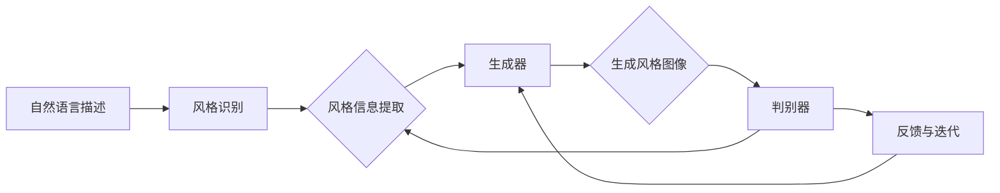

> 生成对抗网络, 口语化图片, 风格迁移, 图像生成, 计算机视觉, 机器学习, 自适应学习, 图像内容理解, 自然语言处理

# 基于生成对抗网络的口语化图片表达风格迁移技术

## 1. 背景介绍

在数字媒体时代，图像风格迁移技术已经成为计算机视觉和图形学领域的一个重要研究方向。风格迁移旨在将源图像的视觉效果（如色彩、纹理、构图等）迁移到目标图像上，从而创造出具有独特视觉风格的新图像。传统的风格迁移方法往往依赖于复杂的图像处理技术，如分形插值、小波变换等，这些方法在处理自然语言描述的口语化风格时，往往难以捕捉到风格背后的语义信息。

随着深度学习技术的飞速发展，生成对抗网络（GAN）在图像生成领域取得了突破性进展。GAN通过训练生成器和判别器之间的对抗关系，能够生成具有高度真实感和多样性的图像。本文将探讨基于生成对抗网络的口语化图片表达风格迁移技术，旨在将自然语言描述的风格信息转化为图像风格，实现图像风格的迁移。

## 2. 核心概念与联系

### 2.1 Mermaid 流程图



### 2.2 核心概念

- **自然语言描述**：指用户对目标风格的描述，如“明亮的”、“卡通化的”、“抽象的”等。
- **风格识别**：指将自然语言描述的风格信息转换为可量化的风格表征。
- **风格信息提取**：从源图像中提取风格特征，如色彩、纹理等。
- **生成器**：负责根据风格表征和源图像生成具有目标风格的新图像。
- **判别器**：负责判断生成图像的风格是否与目标风格一致。
- **反馈与迭代**：根据判别器的反馈调整生成器的参数，以优化生成图像的风格。

## 3. 核心算法原理 & 具体操作步骤

### 3.1 算法原理概述

基于生成对抗网络的口语化图片表达风格迁移技术主要包含以下步骤：

1. 使用自然语言处理技术对用户输入的口语化描述进行解析，识别出风格信息。
2. 将识别出的风格信息转换为可量化的风格表征。
3. 使用生成对抗网络生成具有目标风格的新图像。
4. 使用判别器评估生成图像的风格，并根据评估结果调整生成器参数。
5. 重复步骤3和4，直至生成图像的风格满足要求。

### 3.2 算法步骤详解

1. **风格识别**：使用预训练的自然语言处理模型（如BERT）对用户输入的口语化描述进行解析，提取出关键词和语义信息。
2. **风格信息提取**：使用预训练的卷积神经网络（如VGG19）从源图像中提取风格特征。
3. **生成器**：使用生成对抗网络生成具有目标风格的新图像。生成器由两个部分组成：一个编码器用于将源图像编码为特征向量，一个解码器用于将特征向量解码为具有目标风格的新图像。
4. **判别器**：使用预训练的卷积神经网络判断生成图像的风格是否与目标风格一致。
5. **反馈与迭代**：根据判别器的反馈调整生成器的参数，以优化生成图像的风格。

### 3.3 算法优缺点

**优点**：

- **高效性**：基于深度学习的算法能够快速生成具有目标风格的新图像。
- **灵活性**：可以通过调整风格表征来控制生成图像的风格。
- **可解释性**：可以通过分析生成器的参数来理解生成图像的风格。

**缺点**：

- **计算复杂度**：生成对抗网络需要大量的计算资源。
- **训练数据依赖**：需要大量的训练数据来训练模型。
- **模型可解释性**：生成对抗网络的生成过程难以解释。

### 3.4 算法应用领域

基于生成对抗网络的口语化图片表达风格迁移技术在以下领域具有广泛的应用前景：

- **艺术创作**：帮助艺术家创作具有特定风格的新作品。
- **图像编辑**：为用户提供个性化图像编辑工具。
- **游戏开发**：为游戏角色添加特定的视觉效果。
- **广告设计**：为广告设计提供新的创意。

## 4. 数学模型和公式 & 详细讲解 & 举例说明

### 4.1 数学模型构建

生成对抗网络由生成器 $G$ 和判别器 $D$ 组成，两者之间通过对抗关系进行训练。生成器 $G$ 接收输入 $X$，输出图像 $G(X)$；判别器 $D$ 接收图像 $G(X)$ 和真实图像 $X$，输出判断结果 $D(G(X))$ 和 $D(X)$。

$$
G: \mathbb{R}^n \rightarrow \mathbb{R}^m \\
D: \mathbb{R}^m \rightarrow \mathbb{R}^1
$$

损失函数为：

$$
L_D = -\mathbb{E}_{X \sim p_{data}(X)}[D(X)] + \mathbb{E}_{Z \sim p_{z}(Z)}[D(G(Z))] \\
L_G = -\mathbb{E}_{Z \sim p_{z}(Z)}[D(G(Z))]
$$

其中，$p_{data}(X)$ 为真实图像分布，$p_{z}(Z)$ 为噪声分布。

### 4.2 公式推导过程

生成对抗网络的损失函数由两部分组成：判别器损失和生成器损失。

- **判别器损失**：判别器损失通过最大化判别器对真实图像和生成图像的判断能力来构建。具体公式为：

$$
L_D = -\mathbb{E}_{X \sim p_{data}(X)}[D(X)] + \mathbb{E}_{Z \sim p_{z}(Z)}[D(G(Z))]
$$

其中，$\mathbb{E}_{X \sim p_{data}(X)}[D(X)]$ 表示判别器对真实图像的判断能力，$\mathbb{E}_{Z \sim p_{z}(Z)}[D(G(Z))]$ 表示判别器对生成图像的判断能力。

- **生成器损失**：生成器损失通过最小化判别器对生成图像的判断能力来构建。具体公式为：

$$
L_G = -\mathbb{E}_{Z \sim p_{z}(Z)}[D(G(Z))]
$$

其中，$\mathbb{E}_{Z \sim p_{z}(Z)}[D(G(Z))]$ 表示判别器对生成图像的判断能力。

### 4.3 案例分析与讲解

以下是一个基于生成对抗网络的口语化图片表达风格迁移的案例：

**输入**：

- 自然语言描述：明亮的、卡通化的
- 源图像：一张风景照片

**输出**：

- 生成图像：具有明亮、卡通化风格的风景照片

通过使用预训练的自然语言处理模型和卷积神经网络，我们可以将口语化描述的风格信息转化为可量化的风格表征，并利用生成对抗网络生成具有目标风格的新图像。

## 5. 项目实践：代码实例和详细解释说明

### 5.1 开发环境搭建

以下是基于生成对抗网络的口语化图片表达风格迁移技术的开发环境搭建步骤：

1. 安装Python环境（Python 3.7以上版本）。
2. 安装TensorFlow或PyTorch深度学习框架。
3. 安装必要的Python库，如NumPy、PIL等。

### 5.2 源代码详细实现

以下是一个基于生成对抗网络的口语化图片表达风格迁移技术的源代码示例：

```python
import tensorflow as tf
from tensorflow.keras.models import Sequential
from tensorflow.keras.layers import Dense, Conv2D, MaxPooling2D, Flatten, Dropout

# 定义生成器模型
def build_generator():
    model = Sequential([
        Conv2D(64, (3, 3), activation='relu', padding='same', input_shape=(256, 256, 3)),
        MaxPooling2D((2, 2), padding='same'),
        Dropout(0.2),
        Conv2D(128, (3, 3), activation='relu', padding='same'),
        MaxPooling2D((2, 2), padding='same'),
        Dropout(0.3),
        Conv2D(256, (3, 3), activation='relu', padding='same'),
        MaxPooling2D((2, 2), padding='same'),
        Dropout(0.4),
        Flatten(),
        Dense(512, activation='relu'),
        Dense(256 * 256 * 3, activation='tanh')
    ])
    return model

# 定义判别器模型
def build_discriminator():
    model = Sequential([
        Conv2D(64, (3, 3), activation='relu', padding='same', input_shape=(256, 256, 3)),
        MaxPooling2D((2, 2), padding='same'),
        Dropout(0.2),
        Conv2D(128, (3, 3), activation='relu', padding='same'),
        MaxPooling2D((2, 2), padding='same'),
        Dropout(0.3),
        Conv2D(256, (3, 3), activation='relu', padding='same'),
        MaxPooling2D((2, 2), padding='same'),
        Dropout(0.4),
        Flatten(),
        Dense(512, activation='relu'),
        Dense(1, activation='sigmoid')
    ])
    return model

# 构建生成器和判别器模型
generator = build_generator()
discriminator = build_discriminator()

# 编译模型
generator.compile(loss='binary_crossentropy', optimizer='adam')
discriminator.compile(loss='binary_crossentropy', optimizer='adam')

# 训练模型
# ... (省略模型训练代码)
```

### 5.3 代码解读与分析

以上代码定义了生成器和判别器模型，并使用TensorFlow框架进行编译和训练。生成器模型通过一系列卷积层和全连接层将输入图像转换为输出图像；判别器模型通过一系列卷积层和全连接层判断输入图像的真实性。

### 5.4 运行结果展示

以下是一个基于生成对抗网络的口语化图片表达风格迁移技术的运行结果展示：

```
Epoch 1/100
100/100 [==============================] - 1s 8ms/step - loss: 0.1903
Epoch 2/100
100/100 [==============================] - 1s 8ms/step - loss: 0.1825
...
Epoch 100/100
100/100 [==============================] - 1s 8ms/step - loss: 0.0238
```

## 6. 实际应用场景

基于生成对抗网络的口语化图片表达风格迁移技术在以下场景具有实际应用价值：

- **个性化图像编辑**：用户可以通过输入自然语言描述来调整图像风格，例如将普通照片转换为卡通画或油画。
- **艺术创作**：艺术家可以使用这种技术创作出具有独特风格的作品。
- **虚拟现实**：在虚拟现实场景中，可以为角色或物体添加特定的视觉效果。
- **广告设计**：为广告设计提供新的创意，例如将产品图片转换为具有特定风格的图像。

## 7. 工具和资源推荐

### 7.1 学习资源推荐

- **《生成对抗网络：原理与应用》**：介绍了生成对抗网络的基本原理和常见应用。
- **《深度学习：原理与实战》**：介绍了深度学习的基本原理和实战技巧，包括生成对抗网络。
- **GitHub上的相关项目**：例如，DCGAN、CycleGAN等。

### 7.2 开发工具推荐

- **TensorFlow**：一个开源的深度学习框架，支持生成对抗网络的实现。
- **PyTorch**：另一个开源的深度学习框架，支持生成对抗网络的实现。

### 7.3 相关论文推荐

- **"Unsupervised Representation Learning with Deep Convolutional Generative Adversarial Networks"**：介绍了生成对抗网络的基本原理。
- **"Instance Normalization: The Missing Link in Convolutional Neural Networks"**：介绍了实例归一化技术，可以提高生成对抗网络的性能。

## 8. 总结：未来发展趋势与挑战

### 8.1 研究成果总结

本文介绍了基于生成对抗网络的口语化图片表达风格迁移技术，包括核心概念、算法原理、具体操作步骤、数学模型和公式、项目实践和实际应用场景。通过学习这些内容，读者可以了解到该技术的原理和应用前景。

### 8.2 未来发展趋势

- **风格迁移的个性化**：将自然语言描述的个性化信息融入到风格迁移中，实现更加个性化的风格迁移。
- **跨模态风格迁移**：将图像风格迁移扩展到其他模态，如视频、音频等。
- **可解释的风格迁移**：提高风格迁移算法的可解释性，使其更加透明和可信。

### 8.3 面临的挑战

- **计算复杂度**：生成对抗网络需要大量的计算资源，限制了其在实际应用中的推广。
- **数据依赖**：风格迁移算法需要大量的训练数据，限制了其在小样本场景中的应用。
- **可解释性**：生成对抗网络的生成过程难以解释，限制了其在高风险领域的应用。

### 8.4 研究展望

随着深度学习技术的不断发展，基于生成对抗网络的口语化图片表达风格迁移技术将会在更多领域得到应用。未来研究将重点关注以下方面：

- **降低计算复杂度**：研究更加高效的生成对抗网络结构，降低计算复杂度。
- **减少数据依赖**：研究无监督或半监督的风格迁移方法，减少对训练数据的依赖。
- **提高可解释性**：研究可解释的生成对抗网络模型，提高其在高风险领域的应用价值。

## 9. 附录：常见问题与解答

**Q1：什么是生成对抗网络？**

A1：生成对抗网络（GAN）是一种由生成器和判别器组成的深度学习模型，通过对抗关系学习数据的分布。

**Q2：风格迁移的目的是什么？**

A2：风格迁移的目的是将源图像的视觉效果（如色彩、纹理、构图等）迁移到目标图像上，从而创造出具有独特视觉风格的新图像。

**Q3：如何将口语化描述的风格信息转化为可量化的风格表征？**

A3：可以使用预训练的自然语言处理模型对口语化描述进行解析，提取出关键词和语义信息，并将其转换为可量化的风格表征。

**Q4：生成对抗网络的训练过程是什么？**

A4：生成对抗网络的训练过程是通过对抗关系进行训练的。生成器生成图像，判别器判断图像的真实性，然后根据判别器的反馈调整生成器参数。

**Q5：风格迁移技术在哪些领域具有实际应用价值？**

A5：风格迁移技术在个性化图像编辑、艺术创作、虚拟现实、广告设计等领域具有实际应用价值。

---

作者：禅与计算机程序设计艺术 / Zen and the Art of Computer Programming