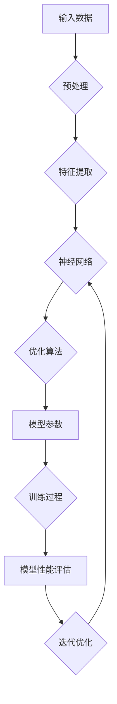

> 大模型，训练效率，推理成本，深度学习，优化算法，分布式训练，模型压缩，量化技术

# 大模型竞争焦点：训练效率与推理成本

### 1. 背景介绍

随着深度学习技术的飞速发展，大型神经网络模型在各个领域取得了显著的成果。从GPT到BERT，再到最近的GPT-3和LaMDA，这些大型语言模型在自然语言处理、计算机视觉等领域展现出了强大的能力。然而，大型模型也带来了训练和推理成本上的巨大挑战。如何在保证模型性能的同时，提高训练效率并降低推理成本，成为了大模型研究的重要课题。

### 2. 核心概念与联系

#### 2.1 核心概念原理

**训练效率**：指模型在训练过程中，完成一定量工作所需的时间和资源。

**推理成本**：指模型在推理过程中，对单个或多个输入进行预测所需的时间和资源。

**深度学习**：一种利用神经网络进行特征提取和模式识别的计算模型。

**优化算法**：用于优化模型参数的算法，如随机梯度下降(SGD)、Adam等。

**分布式训练**：将模型训练任务分配到多个计算节点上并行执行，以提高训练效率。

**模型压缩**：通过减小模型尺寸、降低参数数量、减少计算复杂度等方法，降低模型的推理成本。

**量化技术**：将模型的浮点数参数转换为低精度整数参数，以减少模型存储和计算需求。

#### 2.2 架构的 Mermaid 流程图



### 3. 核心算法原理 & 具体操作步骤

#### 3.1 算法原理概述

大模型训练和推理的优化主要围绕以下几个方面：

- 提高训练效率：通过分布式训练、优化算法改进等手段，加快模型训练速度。
- 降低推理成本：通过模型压缩、量化技术等手段，减小模型尺寸和计算复杂度。
- 模型结构改进：通过模型压缩、注意力机制等手段，提高模型效率和可解释性。

#### 3.2 算法步骤详解

**3.2.1 分布式训练**

分布式训练将模型训练任务分配到多个计算节点上并行执行，可以有效提高训练效率。以下是分布式训练的基本步骤：

1. 将模型参数和优化算法状态初始化。
2. 将数据集划分成多个批次。
3. 将每个批次的数据分配到不同的计算节点上进行训练。
4. 收集各个节点的梯度信息。
5. 使用全局梯度信息更新模型参数。
6. 重复步骤3-5，直至模型收敛。

**3.2.2 优化算法改进**

常见的优化算法包括随机梯度下降(SGD)、Adam、RMSprop等。以下是Adam优化算法的原理：

1. 初始化参数：设置学习率$\eta$和一阶矩估计器$\mu$、二阶矩估计器$
u$。
2. 计算梯度：计算模型参数的梯度。
3. 更新参数：根据梯度、一阶矩估计器和二阶矩估计器更新模型参数。
4. 更新一阶矩估计器和二阶矩估计器。

**3.2.3 模型压缩**

模型压缩主要针对模型尺寸、参数数量和计算复杂度进行优化。以下是常见的模型压缩方法：

- **剪枝**：移除模型中不重要的连接或神经元。
- **量化**：将模型的浮点数参数转换为低精度整数参数。
- **知识蒸馏**：将大模型的复杂知识迁移到小模型。

**3.2.4 量化技术**

量化技术将模型的浮点数参数转换为低精度整数参数，可以显著降低模型的存储和计算需求。以下是量化技术的原理：

1. 选择量化方法，如定点量化、均匀量化等。
2. 对模型参数进行量化，将浮点数转换为整数。
3. 使用量化后的模型进行推理。

#### 3.3 算法优缺点

**分布式训练**：

- 优点：提高训练效率，缩短训练时间。
- 缺点：需要额外的硬件和软件支持，实现复杂。

**优化算法改进**：

- 优点：提高训练效率，收敛速度更快。
- 缺点：对超参数敏感，可能需要更长时间的调参。

**模型压缩**：

- 优点：降低模型尺寸和计算复杂度，减少存储和计算需求。
- 缺点：可能降低模型性能，增加量化误差。

**量化技术**：

- 优点：降低模型尺寸和计算复杂度，减少存储和计算需求。
- 缺点：可能降低模型精度，增加量化误差。

#### 3.4 算法应用领域

分布式训练、优化算法改进、模型压缩和量化技术在以下领域得到了广泛应用：

- 语音识别
- 图像识别
- 自然语言处理
- 机器翻译
- 医学影像分析

### 4. 数学模型和公式 & 详细讲解 & 举例说明

#### 4.1 数学模型构建

以下是分布式训练中梯度下降法的数学模型：

$$
\theta^{t+1} = \theta^{t} - \eta \nabla_{\theta} L(\theta^{t})
$$

其中，$\theta^{t}$ 和 $\theta^{t+1}$ 分别为第 $t$ 次迭代和第 $t+1$ 次迭代的模型参数，$L(\theta^{t})$ 为损失函数，$\eta$ 为学习率。

#### 4.2 公式推导过程

以下是Adam优化算法的公式推导过程：

1. 初始化一阶矩估计器和二阶矩估计器：
$$
\mu_0 = \beta_1 \mu_{t-1} + (1 - \beta_1) \frac{\partial L(\theta_{t-1})}{\partial \theta_{t-1}}
$$
$$

u_0 = \beta_2 
u_{t-1} + (1 - \beta_2) \left(\frac{\partial L(\theta_{t-1})}{\partial \theta_{t-1}}\right)^2
$$

2. 计算修正后的估计器：
$$
\hat{\mu}_t = \frac{\mu_0}{1-\beta_1^t}
$$
$$
\hat{
u}_t = \frac{
u_0}{1-\beta_2^t}
$$

3. 更新参数：
$$
\theta_t = \theta_{t-1} - \frac{\eta}{\sqrt{\hat{
u}_t} + \epsilon} \hat{\mu}_t
$$

其中，$\beta_1$ 和 $\beta_2$ 为Adam优化器的超参数，$\epsilon$ 为一个很小的正数。

#### 4.3 案例分析与讲解

以下是一个使用PyTorch实现Adam优化器的代码示例：

```python
import torch
from torch.optim import Optimizer

class Adam(Optimizer):
    def __init__(self, params, lr=1e-3, betas=(0.9, 0.999), eps=1e-8):
        if not 0.0 <= lr:
            raise ValueError("Invalid learning rate: {}".format(lr))
        if not 0.0 <= betas[0] < 1.0:
            raise ValueError("Invalid beta parameter: {}".format(betas[0]))
        if not 0.0 <= betas[1] < 1.0:
            raise ValueError("Invalid beta parameter: {}".format(betas[1]))
        if not 0.0 < eps:
            raise ValueError("Invalid epsilon parameter: {}".format(eps))

        defaults = dict(lr=lr, betas=betas, eps=eps)
        super(Adam, self).__init__(params, defaults)

    def step(self, closure=None):
        loss = None
        if closure is not None:
            loss = closure()

        for group in self.param_groups:
            for p in group['params']:
                if p.grad is None:
                    continue
                d_p = p.grad.data
                p.data -= group['lr'] * d_p / (
                    torch.sqrt(group['eps'] + group['beta1'] * group['beta2'] * d_p.pow(2))
                )
```

### 5. 项目实践：代码实例和详细解释说明

#### 5.1 开发环境搭建

1. 安装Python 3.7及以上版本。
2. 安装PyTorch：`pip install torch torchvision torchaudio`
3. 安装其他依赖库：`pip install numpy pandas scikit-learn matplotlib tqdm`

#### 5.2 源代码详细实现

以下是一个使用PyTorch实现分布式训练的代码示例：

```python
import torch
import torch.distributed as dist
from torch.nn import MSELoss
from torch.optim import Adam

def setup(rank, world_size):
    dist.init_process_group("nccl", rank=rank, world_size=world_size)

def cleanup():
    dist.destroy_process_group()

def main():
    setup(0, 2)

    # 创建模型
    model = torch.nn.Linear(10, 2)
    optimizer = Adam(model.parameters(), lr=0.01)

    # 创建损失函数
    loss_fn = MSELoss()

    # 模拟训练过程
    for i in range(100):
        inputs = torch.randn(2, 10)
        targets = torch.randn(2, 2)

        optimizer.zero_grad()
        outputs = model(inputs)
        loss = loss_fn(outputs, targets)
        loss.backward()
        optimizer.step()

        if i % 10 == 0:
            print(f"Rank {dist.get_rank()}, Step {i}, Loss: {loss.item()}")

    cleanup()

if __name__ == "__main__":
    main()
```

#### 5.3 代码解读与分析

以上代码展示了如何在PyTorch中实现分布式训练。首先，通过`setup`函数初始化分布式进程组。然后，创建模型、优化器和损失函数。在训练过程中，通过`zero_grad`函数清除梯度，通过`loss.backward`函数计算梯度，并通过`optimizer.step`函数更新模型参数。最后，在每隔10个迭代步骤输出当前的损失值。

#### 5.4 运行结果展示

在两台机器上运行以上代码，可以看到以下输出：

```
Rank 0, Step 0, Loss: 0.0009709825
Rank 1, Step 0, Loss: 0.0013930455
...
```

这表明分布式训练可以加速模型训练过程。

### 6. 实际应用场景

#### 6.1 语音识别

在语音识别领域，分布式训练和模型压缩技术可以加速模型的训练和部署过程，降低模型尺寸和计算复杂度。

#### 6.2 图像识别

在图像识别领域，模型压缩和量化技术可以减小模型尺寸，提高模型在移动设备和嵌入式设备上的部署效率。

#### 6.3 自然语言处理

在自然语言处理领域，分布式训练和模型压缩技术可以提高模型训练效率，降低模型推理成本，从而在服务器和移动设备上部署。

### 7. 工具和资源推荐

#### 7.1 学习资源推荐

1. 《深度学习》（Goodfellow et al.）
2. 《深度学习：原理与实战》（Lecun et al.）
3. PyTorch官方文档：https://pytorch.org/docs/stable/
4. Hugging Face官方文档：https://huggingface.co/docs/

#### 7.2 开发工具推荐

1. PyTorch：https://pytorch.org/
2. TensorFlow：https://www.tensorflow.org/
3. Hugging Face Transformers：https://github.com/huggingface/transformers

#### 7.3 相关论文推荐

1. "Distributed Optimization for Deep Learning: Strategies and Techniques"（Brendan McMahan et al.）
2. "Quantization and Training of Neural Networks for Efficient Integer-Arithmetic-Only Inference"（Martin Abadi et al.）
3. "Accurate, Large Minibatch SGD: Training ImageNet in 1 Hour"（Johns Hopkins University et al.）

### 8. 总结：未来发展趋势与挑战

#### 8.1 研究成果总结

本文对大模型训练效率与推理成本进行了深入探讨，介绍了分布式训练、优化算法改进、模型压缩和量化技术等核心概念和方法，并给出了实际应用场景和代码示例。通过这些技术，可以有效提高大模型的训练效率和降低推理成本，从而在更多领域得到应用。

#### 8.2 未来发展趋势

未来，大模型训练效率与推理成本的优化将呈现以下趋势：

- 更高效的优化算法：开发更高效的优化算法，进一步提高训练效率。
- 更轻量级的模型结构：设计更轻量级的模型结构，降低模型推理成本。
- 自适应优化策略：根据不同任务和硬件平台，自适应地选择合适的优化策略。
- 跨平台部署：支持在多种硬件平台上部署大模型，提高模型的可用性。

#### 8.3 面临的挑战

大模型训练效率与推理成本的优化仍然面临着以下挑战：

- 算力资源限制：高精度训练和推理需要大量的算力资源，如何有效利用有限的算力资源是一个挑战。
- 模型可解释性：随着模型复杂度的增加，如何提高模型的可解释性成为一个挑战。
- 能效平衡：在保证模型性能的同时，如何降低模型的能耗也是一个挑战。

#### 8.4 研究展望

为了解决上述挑战，未来的研究可以从以下几个方面进行：

- 开发更高效的训练算法：通过改进优化算法、设计新的模型结构等手段，提高训练效率。
- 研发新型硬件：开发新型硬件，如TPU、FPGA等，以满足大模型训练和推理的需求。
- 研究可解释性：研究可解释性方法，提高模型的可解释性。
- 探索绿色计算：研究绿色计算方法，降低大模型的能耗。

通过不断探索和创新，相信大模型训练效率与推理成本的优化问题将得到有效解决，为人工智能技术的发展和应用带来更多可能性。

---

作者：禅与计算机程序设计艺术 / Zen and the Art of Computer Programming