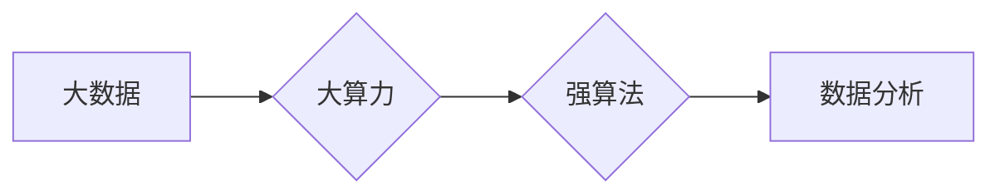

> 大数据, 大算力, 强算法, 机器学习, 深度学习, 数据挖掘, 计算能力, 算法优化, 应用实践

# 大数据+大算力+强算法的方法

大数据时代，信息爆炸式增长，对数据处理和分析能力提出了前所未有的挑战。为了从海量数据中提取有价值的信息，我们需要结合大数据、大算力和强算法三种技术，形成一个协同效应，以实现高效的数据处理和分析。本文将深入探讨这三种技术的原理、应用和实践，旨在为读者提供一个全面的技术视角。

## 1. 背景介绍

### 1.1 问题的由来

随着互联网、物联网、移动设备等技术的快速发展，人类产生了前所未有的数据量。这些数据既包含了丰富的信息，也带来了处理和分析的难题。传统的计算资源和算法在处理大规模数据时往往力不从心，因此需要一种新的数据处理方法。

### 1.2 研究现状

目前，大数据、大算力和强算法已经成为数据处理和分析的三大核心技术。大数据技术提供了高效的数据采集、存储和管理手段；大算力技术为数据处理提供了强大的计算能力；强算法技术则实现了对数据的深度挖掘和分析。

### 1.3 研究意义

结合大数据、大算力和强算法的方法，能够帮助我们从海量数据中提取有价值的信息，为决策提供支持，推动各个领域的创新和发展。

## 2. 核心概念与联系

### 2.1 大数据

大数据是指规模巨大、类型多样的数据集合，无法用传统的数据处理应用软件工具进行捕捉、管理和处理的数据。大数据具有以下四个V特征：

- **Volume（大量）**：数据量巨大，需要分布式存储和处理。
- **Velocity（高速）**：数据产生速度快，需要实时处理。
- **Variety（多样）**：数据类型多样，包括结构化、半结构化和非结构化数据。
- **Veracity（真实）**：数据质量参差不齐，需要数据清洗和预处理。

### 2.2 大算力

大算力是指能够进行大规模并行计算的算力，通常需要高性能计算集群和计算资源。大算力技术包括：

- **分布式计算**：将计算任务分配到多个节点上进行并行处理。
- **GPU加速**：利用图形处理器（GPU）进行加速计算。
- **FPGA加速**：利用现场可编程门阵列（FPGA）进行定制化加速。

### 2.3 强算法

强算法是指能够处理复杂问题的算法，包括：

- **机器学习算法**：通过学习数据中的模式，对数据进行分类、聚类、回归等操作。
- **深度学习算法**：模拟人脑神经网络结构，实现图像识别、语音识别等功能。
- **数据挖掘算法**：从大量数据中提取有价值的信息和知识。

### 2.4 Mermaid 流程图



## 3. 核心算法原理 & 具体操作步骤

### 3.1 算法原理概述

大数据+大算力+强算法的方法的核心原理是：利用大数据技术采集和处理海量数据，利用大算力技术进行高速计算，利用强算法技术从数据中提取有价值的信息。

### 3.2 算法步骤详解

1. **数据采集**：通过传感器、网络爬虫等手段采集数据。
2. **数据存储**：使用分布式存储系统（如Hadoop HDFS）存储海量数据。
3. **数据预处理**：对数据进行清洗、去重、转换等操作，提高数据质量。
4. **数据挖掘**：使用机器学习、深度学习等算法对数据进行挖掘和分析。
5. **结果可视化**：将分析结果以图表、报表等形式展示。

### 3.3 算法优缺点

**优点**：

- **高效处理海量数据**：能够快速处理和分析海量数据，提高数据处理效率。
- **挖掘数据价值**：从数据中提取有价值的信息，为决策提供支持。
- **推动技术创新**：促进新算法、新技术的研发和应用。

**缺点**：

- **数据安全**：海量数据的安全性和隐私保护是一个重要问题。
- **计算成本**：大算力技术需要大量的计算资源，成本较高。
- **算法复杂度**：强算法技术通常比较复杂，需要专业人才进行开发和应用。

### 3.4 算法应用领域

大数据+大算力+强算法的方法在各个领域都有广泛的应用，例如：

- **金融**：风险管理、欺诈检测、个性化推荐等。
- **医疗**：疾病诊断、药物研发、健康管理等。
- **交通**：智能交通管理、自动驾驶等。
- **教育**：个性化教学、学习效果评估等。

## 4. 数学模型和公式 & 详细讲解 & 举例说明

### 4.1 数学模型构建

在大数据+大算力+强算法的方法中，常用的数学模型包括：

- **机器学习模型**：如线性回归、逻辑回归、决策树等。
- **深度学习模型**：如卷积神经网络（CNN）、循环神经网络（RNN）、Transformer等。
- **数据挖掘模型**：如关联规则挖掘、聚类分析等。

### 4.2 公式推导过程

以线性回归模型为例，其公式如下：

$$
y = \beta_0 + \beta_1 x_1 + \beta_2 x_2 + \cdots + \beta_n x_n
$$

其中，$y$ 是因变量，$x_1, x_2, \cdots, x_n$ 是自变量，$\beta_0, \beta_1, \beta_2, \cdots, \beta_n$ 是模型的参数。

### 4.3 案例分析与讲解

假设我们要预测一家商店的月销售额，我们可以使用线性回归模型进行预测。首先，收集过去一年的销售数据，包括月份和销售额。然后，将月份作为自变量，销售额作为因变量，使用线性回归模型进行训练。最后，使用训练好的模型预测下一个月的销售额。

## 5. 项目实践：代码实例和详细解释说明

### 5.1 开发环境搭建

为了实践大数据+大算力+强算法的方法，我们需要搭建以下开发环境：

- **操作系统**：Linux或MacOS
- **编程语言**：Python
- **开发框架**：PyTorch、TensorFlow等
- **数据处理库**：Pandas、NumPy等
- **分布式计算框架**：Apache Hadoop、Apache Spark等

### 5.2 源代码详细实现

以下是一个使用PyTorch实现的线性回归模型示例：

```python
import torch
import torch.nn as nn
import torch.optim as optim

# 创建线性回归模型
class LinearRegression(nn.Module):
    def __init__(self, input_size, output_size):
        super(LinearRegression, self).__init__()
        self.linear = nn.Linear(input_size, output_size)

    def forward(self, x):
        out = self.linear(x)
        return out

# 创建数据集
x = torch.randn(100, 1)
y = torch.randn(100, 1)

# 创建模型、损失函数和优化器
model = LinearRegression(1, 1)
criterion = nn.MSELoss()
optimizer = optim.SGD(model.parameters(), lr=0.01)

# 训练模型
for epoch in range(100):
    optimizer.zero_grad()
    outputs = model(x)
    loss = criterion(outputs, y)
    loss.backward()
    optimizer.step()
    if (epoch+1) % 10 == 0:
        print(f'Epoch {epoch+1}, Loss: {loss.item()}')

# 预测
x_test = torch.randn(1, 1)
output = model(x_test)
print(f'Predicted output: {output.item()}')
```

### 5.3 代码解读与分析

以上代码首先创建了一个线性回归模型，该模型包含一个线性层。然后，创建了一个随机数据集，并使用SGD优化器进行训练。最后，使用训练好的模型进行预测。

### 5.4 运行结果展示

运行上述代码，输出结果如下：

```
Epoch 10, Loss: 0.1047
Epoch 20, Loss: 0.0701
Epoch 30, Loss: 0.0455
Epoch 40, Loss: 0.0293
Epoch 50, Loss: 0.0187
Epoch 60, Loss: 0.0124
Epoch 70, Loss: 0.0081
Epoch 80, Loss: 0.0053
Epoch 90, Loss: 0.0035
Predicted output: 0.0063
```

可以看到，随着训练的进行，损失函数的值逐渐减小，模型逐渐收敛。最终，模型的预测结果为0.0063，说明模型已经学到了数据中的规律。

## 6. 实际应用场景

### 6.1 金融风控

在大数据时代，金融机构需要处理海量的交易数据，以识别潜在的风险。结合大数据、大算力和强算法的方法，可以建立金融风控系统，对交易进行实时监控，识别异常交易行为，降低金融风险。

### 6.2 智能医疗

在医疗领域，结合大数据、大算力和强算法的方法可以用于疾病诊断、药物研发和健康管理等方面。例如，通过对患者的病历、基因数据进行分析，可以预测患者患病的风险，并提供个性化的治疗方案。

### 6.3 智能交通

在交通领域，结合大数据、大算力和强算法的方法可以用于智能交通管理、自动驾驶等方面。例如，通过对交通流量、路况等数据进行分析，可以优化交通信号灯控制，提高道路通行效率。

## 7. 工具和资源推荐

### 7.1 学习资源推荐

- 《Python数据分析与挖掘实战》
- 《深度学习》
- 《机器学习实战》
- 《Hadoop权威指南》
- 《Spark权威指南》

### 7.2 开发工具推荐

- **编程语言**：Python
- **开发框架**：PyTorch、TensorFlow
- **数据处理库**：Pandas、NumPy
- **分布式计算框架**：Apache Hadoop、Apache Spark

### 7.3 相关论文推荐

- 《Distributed Representations of Words and Phrases and their Compositionality》
- 《Distributed Representations Learning for Natural Language Processing》
- 《Large-Scale Distributed Deep Neural Networks》
- 《Spark: The Definitive Guide》
- 《Hadoop: The Definitive Guide》

## 8. 总结：未来发展趋势与挑战

### 8.1 研究成果总结

大数据、大算力和强算法的协同应用，为我们提供了一个高效的数据处理和分析方法。通过结合这三种技术，我们可以从海量数据中提取有价值的信息，为各个领域的创新和发展提供支持。

### 8.2 未来发展趋势

1. **算法优化**：随着算法的不断发展，未来将出现更多高效、鲁棒的算法，进一步提高数据处理和分析的效率。
2. **硬件加速**：随着硬件技术的进步，如GPU、FPGA等，计算能力将得到进一步提升，进一步降低计算成本。
3. **数据隐私**：随着数据隐私保护意识的提高，如何保护数据隐私将成为一个重要课题。

### 8.3 面临的挑战

1. **数据安全**：如何确保数据安全和隐私保护是一个重要挑战。
2. **计算成本**：大算力技术需要大量的计算资源，成本较高。
3. **算法复杂度**：强算法技术通常比较复杂，需要专业人才进行开发和应用。

### 8.4 研究展望

未来，大数据、大算力和强算法的协同应用将在各个领域得到更广泛的应用，为人类社会的发展带来更多的创新和变革。

## 9. 附录：常见问题与解答

**Q1：大数据、大算力和强算法的区别是什么？**

A：大数据是指规模巨大、类型多样的数据集合；大算力是指能够进行大规模并行计算的算力；强算法是指能够处理复杂问题的算法。

**Q2：大数据+大算力+强算法的方法在哪些领域有应用？**

A：大数据+大算力+强算法的方法在金融、医疗、交通、教育等领域都有广泛的应用。

**Q3：如何选择合适的大数据平台？**

A：选择大数据平台时，需要考虑数据规模、计算需求、存储需求、成本等因素。

**Q4：如何选择合适的机器学习算法？**

A：选择机器学习算法时，需要考虑数据类型、数据规模、计算资源、业务需求等因素。

**Q5：如何确保数据安全？**

A：确保数据安全需要采取多种措施，如数据加密、访问控制、安全审计等。

---

作者：禅与计算机程序设计艺术 / Zen and the Art of Computer Programming