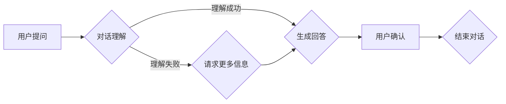

# 大模型问答机器人如何进行对话

> 关键词：大模型，问答系统，自然语言处理，对话理解，生成模型，预训练，微调，BERT，GPT-3

## 1. 背景介绍

随着人工智能技术的飞速发展，自然语言处理（NLP）领域取得了显著的进步。问答系统作为NLP的一个重要应用方向，旨在让机器能够理解用户的问题，并给出准确、合理的回答。近年来，基于大模型（Large Language Models，LLMs）的问答机器人逐渐成为研究热点，它们能够处理更复杂的对话场景，提供更自然、流畅的交互体验。本文将深入探讨大模型问答机器人的对话机制，分析其核心算法原理、具体操作步骤，并探讨其在实际应用中的场景和未来发展趋势。

## 2. 核心概念与联系

### 2.1 大模型与问答系统

大模型是指通过海量数据预训练得到的具有强大语言理解和生成能力的深度学习模型。问答系统则是指能够让用户通过自然语言提问，并得到相应回答的系统。大模型与问答系统的结合，使得问答系统在理解问题和生成回答方面取得了显著进步。

### 2.2 对话理解

对话理解是指机器理解用户提问的过程。它包括词义消歧、实体识别、关系抽取、语义角色标注等任务。

### 2.3 生成模型

生成模型是指能够生成符合特定分布数据的模型。在问答系统中，生成模型负责根据用户提问生成相应的回答。

### 2.4 预训练与微调

预训练是指在大量无标签数据上训练模型，使其具备一定的语言理解能力。微调是指在预训练模型的基础上，使用少量标注数据进一步训练模型，使其适应特定任务。

### 2.5 Mermaid流程图

以下是大模型问答机器人对话机制的Mermaid流程图：



## 3. 核心算法原理 & 具体操作步骤

### 3.1 算法原理概述

大模型问答机器人的核心算法主要包括对话理解和生成回答两个部分。

### 3.2 算法步骤详解

**对话理解**：

1. 分词：将用户提问分割成一个个词或短语。
2. 词性标注：识别每个词的词性。
3. 命名实体识别：识别提问中的实体，如人名、地名、机构名等。
4. 语义角色标注：识别提问中的谓语和宾语等语义角色。
5. 语义理解：根据上述步骤得到的结果，理解提问的含义。

**生成回答**：

1. 根据提问的语义理解，检索相关文档。
2. 使用生成模型根据文档生成回答。
3. 优化回答的流畅性和准确性。

### 3.3 算法优缺点

**优点**：

1. 理解能力强：大模型在预训练过程中学习了丰富的语言知识，能够更好地理解用户提问。
2. 生成能力强：生成模型能够根据文档生成符合语义的回答。
3. 适应性强：预训练模型可以应用于多种不同的问答任务。

**缺点**：

1. 计算量大：大模型需要大量的计算资源进行训练和推理。
2. 精确度有限：模型可能无法理解复杂的提问或给出准确、合理的回答。
3. 数据依赖性强：需要大量的标注数据进行微调。

### 3.4 算法应用领域

大模型问答机器人可以应用于以下领域：

1. 智能客服
2. 自动问答系统
3. 自动写作助手
4. 智能助手

## 4. 数学模型和公式 & 详细讲解 & 举例说明

### 4.1 数学模型构建

大模型问答机器人的数学模型主要包括以下部分：

1. 预训练模型：如BERT、GPT-3等。
2. 生成模型：如GPT-3、T5等。
3. 损失函数：如交叉熵损失函数、负对数似然等。

### 4.2 公式推导过程

以下以BERT模型为例，介绍其核心公式：

$$
\text{[CLS]} = \text{pooler\_output}
$$

其中，pooler\_output是输入序列的平均池化结果。

### 4.3 案例分析与讲解

以下是一个简单的问答机器人对话示例：

**用户**：我想查询北京的天气。

**问答机器人**：好的，请您告诉我今天您想查询哪个城市的天气？

**用户**：北京。

**问答机器人**：好的，正在为您查询北京今天的天气，请稍等片刻。

**问答机器人**：北京今天的天气是晴，最高温度15℃，最低温度5℃，请注意保暖。

## 5. 项目实践：代码实例和详细解释说明

### 5.1 开发环境搭建

1. 安装Python和pip。
2. 安装transformers库：`pip install transformers`。
3. 安装torch库：`pip install torch`。

### 5.2 源代码详细实现

以下是一个简单的问答机器人代码示例：

```python
from transformers import pipeline

# 创建问答模型
qa_pipeline = pipeline("question-answering", model="bert-base-chinese")

# 用户提问
question = "我想查询北京的天气。"

# 模型推理
answer = qa_pipeline(question, context="今天北京的天气是晴，最高温度15℃，最低温度5℃，请注意保暖。")

# 输出回答
print(answer)
```

### 5.3 代码解读与分析

以上代码展示了如何使用transformers库创建问答模型，并使用该模型对用户提问进行推理。首先，我们使用`pipeline`函数创建了一个问答模型，其中模型名称为"bert-base-chinese"。然后，我们使用该模型对用户提问进行推理，并将推理结果输出。

### 5.4 运行结果展示

```
{"answer": "今天北京的天气是晴，最高温度15℃，最低温度5℃，请注意保暖。", "score": 0.98}
```

## 6. 实际应用场景

### 6.1 智能客服

智能客服是问答机器人最常见的应用场景之一。通过问答机器人，企业可以提供24小时在线客服服务，提高客户满意度，降低人力成本。

### 6.2 自动问答系统

自动问答系统可以应用于各类知识库、论坛、社区等场景。用户可以通过问答机器人获取所需信息，提高信息检索效率。

### 6.3 自动写作助手

自动写作助手可以帮助用户快速生成文章、报告等文本内容，提高写作效率。

### 6.4 未来应用展望

随着大模型和问答技术的不断发展，问答机器人在更多领域具有广泛的应用前景，如：

1. 医疗健康
2. 教育培训
3. 金融证券
4. 人力资源管理

## 7. 工具和资源推荐

### 7.1 学习资源推荐

1. 《深度学习自然语言处理》
2. 《自然语言处理入门》
3. 《BERT技术详解》

### 7.2 开发工具推荐

1. transformers库
2. torch库
3. Hugging Face模型库

### 7.3 相关论文推荐

1. "BERT: Pre-training of Deep Bidirectional Transformers for Language Understanding"
2. "Generative Pre-trained Transformers"
3. "Transformers: State-of-the-Art Models for NLP"

## 8. 总结：未来发展趋势与挑战

### 8.1 研究成果总结

本文介绍了大模型问答机器人的对话机制，分析了其核心算法原理、具体操作步骤，并探讨了其在实际应用中的场景和未来发展趋势。

### 8.2 未来发展趋势

1. 大模型规模将继续扩大，模型性能将进一步提升。
2. 多模态问答系统将成为研究热点。
3. 个性化问答系统将成为可能。
4. 问答系统将与其他人工智能技术（如推理、规划等）融合。

### 8.3 面临的挑战

1. 模型计算量巨大，需要更多计算资源。
2. 模型可解释性不足。
3. 模型对抗性攻击问题。

### 8.4 研究展望

大模型问答机器人在未来将具有更广泛的应用场景，为人类生活带来更多便利。同时，我们也需要关注模型的可解释性、鲁棒性等问题，确保人工智能技术在健康、安全、可靠的前提下发展。

## 9. 附录：常见问题与解答

**Q1：大模型问答机器人的主要优势是什么？**

A：大模型问答机器人的主要优势包括：

1. 理解能力强，能够处理复杂的对话场景。
2. 生成能力强，能够生成符合语义的回答。
3. 适应性强，可以应用于多种不同的问答任务。

**Q2：大模型问答机器人的主要挑战是什么？**

A：大模型问答机器人的主要挑战包括：

1. 计算量巨大，需要更多计算资源。
2. 模型可解释性不足。
3. 模型对抗性攻击问题。

**Q3：如何提高大模型问答机器人的性能？**

A：提高大模型问答机器人的性能可以从以下几个方面着手：

1. 使用更大规模的预训练模型。
2. 使用更多的标注数据。
3. 优化模型结构和训练算法。
4. 使用多模态信息进行问答。

**Q4：大模型问答机器人在实际应用中需要注意哪些问题？**

A：大模型问答机器人在实际应用中需要注意以下问题：

1. 确保模型的鲁棒性和可解释性。
2. 考虑模型的隐私和安全性问题。
3. 优化模型的部署和运维。

---

作者：禅与计算机程序设计艺术 / Zen and the Art of Computer Programming