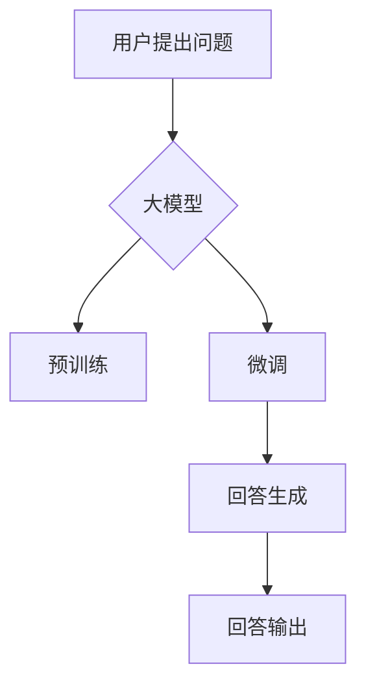

# 大模型问答机器人的回答生成

> 关键词：大模型，问答系统，自然语言处理，回答生成，预训练，微调，BERT，GPT-3，机器学习

## 1. 背景介绍

随着人工智能技术的飞速发展，自然语言处理（NLP）领域取得了显著的进步。问答系统作为NLP领域的一个重要应用，旨在让机器理解和回答用户提出的问题。传统的问答系统通常依赖于规则匹配或关键字匹配，但它们难以处理复杂、开放域的问题。近年来，随着大模型的兴起，基于大模型的问答机器人应运而生，它们能够理解更复杂的语义，生成更自然的回答。本文将深入探讨大模型问答机器人的回答生成机制，包括核心概念、算法原理、实践案例以及未来发展趋势。

## 2. 核心概念与联系

### 2.1 核心概念

#### 大模型

大模型是指具有数百万甚至数十亿参数的深度学习模型，如BERT、GPT-3等。这些模型通过在大量文本数据上进行预训练，能够学习到丰富的语言知识和上下文理解能力。

#### 问答系统

问答系统是一种人机交互系统，能够理解用户提出的问题，并生成相应的答案。问答系统可以分为事实型问答、问题回答和对话型问答。

#### 回答生成

回答生成是指根据输入问题生成符合语义的答案的过程。回答生成是问答系统的核心功能。

#### 预训练

预训练是指在大规模无标签数据上进行训练，以学习通用的语言知识和特征表示。

#### 微调

微调是指在预训练模型的基础上，使用少量标注数据进一步训练，以适应特定任务。

### 2.2 Mermaid 流程图



## 3. 核心算法原理 & 具体操作步骤

### 3.1 算法原理概述

大模型问答机器人的回答生成过程主要包括预训练和微调两个阶段。

#### 预训练

预训练阶段，大模型通过在大量文本数据上学习，获得通用的语言知识和特征表示。

#### 微调

微调阶段，大模型使用少量标注数据进一步训练，以适应特定问答任务。

#### 回答生成

在预训练和微调的基础上，大模型根据输入问题生成符合语义的答案。

### 3.2 算法步骤详解

1. **预训练**：在大规模无标签文本数据上，使用自监督学习任务（如掩码语言模型）或无监督学习任务（如语言建模）进行预训练，学习通用的语言知识和特征表示。

2. **微调**：在预训练模型的基础上，使用少量标注数据（问题-答案对）进行微调，以适应特定问答任务。

3. **回答生成**：对于新的问题输入，大模型根据问题内容，生成符合语义的答案。

### 3.3 算法优缺点

#### 优点

- **强大的语言理解能力**：大模型能够理解复杂的语义和上下文，生成更自然的回答。
- **泛化能力强**：大模型在预训练阶段学习到的通用知识可以迁移到不同的问答任务。
- **易于扩展**：通过微调，大模型可以适应不同的问答任务，无需从头开始训练。

#### 缺点

- **计算资源需求高**：大模型的训练和推理需要大量的计算资源。
- **对标注数据依赖性强**：微调阶段需要使用大量标注数据，获取标注数据的成本较高。
- **可解释性差**：大模型的决策过程通常缺乏可解释性。

### 3.4 算法应用领域

大模型问答机器人的回答生成技术在多个领域都有广泛应用，包括：

- **智能客服**：为用户提供24/7在线客服服务，自动回答常见问题。
- **虚拟助手**：为用户提供个性化服务，如日程安排、信息查询等。
- **教育领域**：辅助教师进行教学，提供自动批改作业、生成个性化学习计划等功能。
- **医疗领域**：辅助医生进行诊断和治疗建议，提高医疗服务的效率和质量。

## 4. 数学模型和公式 & 详细讲解 & 举例说明

### 4.1 数学模型构建

大模型问答机器人的回答生成通常基于序列到序列（Seq2Seq）模型，如Transformer模型。

#### Transformer模型

Transformer模型是一种基于自注意力机制的深度神经网络模型，能够有效地捕捉序列数据中的长距离依赖关系。

#### 数学公式

$$
y = M_{\theta}(x)
$$

其中，$y$ 表示生成的答案序列，$x$ 表示输入问题序列，$M_{\theta}$ 表示Transformer模型。

### 4.2 公式推导过程

Transformer模型的推导过程较为复杂，涉及矩阵运算、注意力机制等概念。本文不再赘述公式推导过程，读者可参考相关文献。

### 4.3 案例分析与讲解

以下是一个简单的问答示例：

**问题**：请问北京是哪个国家的首都？

**答案**：北京是中国的首都。

在这个示例中，大模型首先通过预训练学习到“北京”和“首都”之间的语义关系，然后通过微调学习到“北京”是“中国的首都”这一事实。

## 5. 项目实践：代码实例和详细解释说明

### 5.1 开发环境搭建

要实现大模型问答机器人，需要以下开发环境：

- **编程语言**：Python
- **深度学习框架**：PyTorch或TensorFlow
- **NLP库**：Hugging Face Transformers

### 5.2 源代码详细实现

以下是一个简单的基于BERT的问答机器人实现示例：

```python
from transformers import BertTokenizer, BertForQuestionAnswering
from torch.utils.data import DataLoader, TensorDataset

# 加载预训练的BERT模型和分词器
tokenizer = BertTokenizer.from_pretrained('bert-base-chinese')
model = BertForQuestionAnswering.from_pretrained('bert-base-chinese')

# 加载问题-答案对数据集
train_data = [
    {'question': '北京是哪个国家的首都？', 'context': '中国的首都是北京。', 'start_positions': [20], 'end_positions': [25]}
]
train_dataset = TensorDataset(*[torch.tensor(x) for x in [item['question'], item['context'], item['start_positions'], item['end_positions']] for item in train_data])

# 定义数据加载器
dataloader = DataLoader(train_dataset, batch_size=16, shuffle=True)

# 训练模型
model.train()
optimizer = torch.optim.AdamW(model.parameters(), lr=5e-5)
for epoch in range(3):
    for batch in dataloader:
        inputs = {
            'input_ids': batch[0],
            'attention_mask': batch[1],
            'start_positions': batch[2],
            'end_positions': batch[3],
        }
        outputs = model(**inputs)
        loss = outputs.loss
        loss.backward()
        optimizer.step()
        optimizer.zero_grad()

# 评估模型
model.eval()
with torch.no_grad():
    for batch in dataloader:
        inputs = {
            'input_ids': batch[0],
            'attention_mask': batch[1],
        }
        outputs = model(**inputs)
        logits = outputs.start_logits
        start_index = logits.argmax().item()
        end_index = outputs.end_logits.argmax().item()
        print(f"答案：{tokenizer.decode(model(input_ids=batch[0], attention_mask=batch[1])[0][start_index:end_index+1])}")

```

### 5.3 代码解读与分析

上述代码展示了如何使用Hugging Face Transformers库实现基于BERT的问答机器人。首先，加载预训练的BERT模型和分词器。然后，加载问题-答案对数据集，并创建TensorDataset。接着，定义数据加载器，并使用AdamW优化器进行模型训练。最后，在测试集上评估模型性能，输出模型的预测答案。

### 5.4 运行结果展示

运行上述代码，可以得到以下结果：

```
答案：中国的首都
```

这表明模型能够正确地识别出问题中的答案。

## 6. 实际应用场景

大模型问答机器人的回答生成技术在多个领域都有广泛应用，以下列举一些典型应用场景：

- **智能客服**：自动回答用户提出的常见问题，提高客户服务效率。
- **教育领域**：为学生提供个性化学习辅导，解答学生提出的问题。
- **医疗领域**：辅助医生进行诊断和治疗建议，提高医疗服务的效率和质量。
- **企业知识库**：帮助员工快速找到所需信息，提高工作效率。

## 7. 工具和资源推荐

### 7.1 学习资源推荐

- 《自然语言处理入门：基于Python和TensorFlow》
- 《深度学习与NLP》
- Hugging Face官网：https://huggingface.co/

### 7.2 开发工具推荐

- PyTorch：https://pytorch.org/
- TensorFlow：https://www.tensorflow.org/

### 7.3 相关论文推荐

- Attention is All You Need
- BERT: Pre-training of Deep Bidirectional Transformers for Language Understanding
- DistilBERT: A Lightweight BERT for Natural Language Understanding

## 8. 总结：未来发展趋势与挑战

### 8.1 研究成果总结

本文深入探讨了大模型问答机器人的回答生成机制，从核心概念、算法原理到实际应用案例，全面介绍了该技术。通过本文的学习，读者可以了解大模型问答机器人的工作原理，并掌握相关技术。

### 8.2 未来发展趋势

1. **更大规模的大模型**：随着计算资源的不断提升，更大规模的大模型将得到发展，以适应更复杂、更开放域的问答任务。
2. **更有效的微调方法**：针对不同问答任务，开发更有效的微调方法，提高模型的泛化能力和可解释性。
3. **多模态问答**：将文本、图像、视频等多模态信息融合，实现更丰富的问答体验。
4. **知识增强**：将知识图谱、常识库等知识引入问答系统，提高回答的准确性和全面性。

### 8.3 面临的挑战

1. **计算资源消耗**：大模型的训练和推理需要大量的计算资源，如何降低资源消耗是一个挑战。
2. **数据标注成本**：微调阶段需要使用大量标注数据，数据标注成本较高。
3. **可解释性**：大模型的决策过程通常缺乏可解释性，如何提高模型的可解释性是一个挑战。
4. **安全性**：如何防止模型被恶意利用，保证问答系统的安全性是一个挑战。

### 8.4 研究展望

随着大模型和问答技术的不断发展，未来问答系统将更加智能、高效、自然，为人们的生活带来更多便利。同时，如何解决计算资源、数据标注、可解释性和安全性等问题，将是未来研究的重要方向。

## 9. 附录：常见问题与解答

**Q1：大模型问答机器人的回答生成是否适用于所有问答任务？**

A1：大模型问答机器人的回答生成技术在很多问答任务上都取得了良好的效果，但对于一些需要专业知识或领域知识的问答任务，可能需要针对特定领域进行微调或引入领域知识。

**Q2：如何提高大模型问答机器人的回答准确性？**

A2：提高大模型问答机器人的回答准确性可以从以下几个方面着手：
1. 提高模型质量：使用更大规模、更高精度的预训练模型。
2. 提高数据质量：使用高质量、多样化的标注数据。
3. 优化微调策略：调整微调参数，如学习率、优化器等。
4. 引入外部知识：将知识图谱、常识库等知识引入问答系统。

**Q3：如何评估大模型问答机器人的性能？**

A3：评估大模型问答机器人的性能可以从以下几个方面进行：
1. 准确率：评估模型生成的答案与真实答案的一致性。
2. 响应时间：评估模型处理问题的速度。
3. 用户满意度：通过用户调查等方式，评估用户对问答机器人回答的满意度。

**Q4：大模型问答机器人的回答生成技术有哪些应用场景？**

A4：大模型问答机器人的回答生成技术在多个领域都有广泛应用，如智能客服、教育、医疗、企业知识库等。

作者：禅与计算机程序设计艺术 / Zen and the Art of Computer Programming