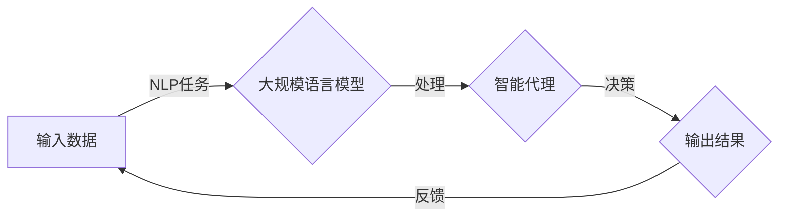

# 大规模语言模型从理论到实践 智能代理的组成

> 关键词：大规模语言模型，智能代理，自然语言处理，深度学习，预训练，微调，多模态，应用场景

## 1. 背景介绍

随着信息技术的飞速发展，人工智能（AI）技术在各个领域得到了广泛应用。其中，自然语言处理（NLP）作为AI的一个重要分支，已经取得了显著的进展。近年来，大规模语言模型（Large Language Model，LLM）的兴起，为NLP领域带来了革命性的变化。本文将深入探讨大规模语言模型的理论与实践，并重点介绍其组成要素，即智能代理，以及其在实际应用中的重要性。

## 2. 核心概念与联系

### 2.1 核心概念

#### 2.1.1 大规模语言模型（LLM）

大规模语言模型是一种能够理解和生成自然语言的深度学习模型。它们通常由数以亿计的参数组成，能够学习到丰富的语言知识，并在各种NLP任务上表现出色。

#### 2.1.2 智能代理

智能代理是一种具有自我意识和自主行为的软件实体，能够在复杂环境中进行决策和行动。在NLP领域，智能代理通常指的是能够理解和生成自然语言的AI系统。

#### 2.1.3 多模态

多模态指的是将不同类型的数据（如图像、音频、视频等）进行融合，以提升模型对复杂信息的理解和处理能力。

### 2.2 架构的 Mermaid 流程图



### 2.3 关系

大规模语言模型是构建智能代理的核心技术，而智能代理则将语言模型应用于实际场景中，实现自然语言交互和智能决策。多模态技术则为智能代理提供了更丰富的信息来源，增强了其感知和理解能力。

## 3. 核心算法原理 & 具体操作步骤

### 3.1 算法原理概述

大规模语言模型的算法原理主要基于深度学习，包括以下步骤：

1. **预训练**：在大量无标签文本数据上，通过自监督学习任务预训练语言模型，使其学习到丰富的语言知识。
2. **微调**：在特定任务上，使用少量标注数据进行微调，优化模型在目标任务上的性能。
3. **推理**：在给定输入时，模型根据预训练和微调的知识生成合适的输出。

### 3.2 算法步骤详解

#### 3.2.1 预训练

预训练通常包括以下步骤：

1. **数据准备**：收集大量无标签文本数据，并进行预处理，如分词、去噪等。
2. **任务设计**：设计自监督学习任务，如掩码语言模型（Masked Language Model，MLM）、语言模型（Language Model，LM）等。
3. **模型训练**：使用预训练任务训练语言模型，调整模型参数，使其适应文本数据。

#### 3.2.2 微调

微调通常包括以下步骤：

1. **数据准备**：收集少量标注数据，并进行预处理。
2. **模型选择**：选择合适的预训练语言模型作为基础模型。
3. **适配层设计**：根据目标任务设计适配层，如分类器、序列到序列模型等。
4. **模型训练**：在目标任务上微调模型，优化模型参数。

#### 3.2.3 推理

推理通常包括以下步骤：

1. **输入处理**：对输入文本进行预处理，如分词、编码等。
2. **模型预测**：使用微调后的模型对输入文本进行预测。
3. **结果生成**：根据模型预测结果生成输出文本。

### 3.3 算法优缺点

#### 3.3.1 优点

1. **强大的语言理解能力**：大规模语言模型能够理解复杂的语言结构和语义。
2. **跨领域应用**：预训练的语言模型可以在不同领域应用，只需进行微调即可。
3. **高效性**：微调过程只需要少量标注数据，训练效率高。

#### 3.3.2 缺点

1. **依赖大量标注数据**：预训练需要大量无标签文本数据，微调也需要少量标注数据。
2. **计算资源消耗大**：大规模语言模型的训练和推理需要大量的计算资源。
3. **可解释性差**：大规模语言模型的决策过程难以解释。

### 3.4 算法应用领域

大规模语言模型和智能代理在以下领域有广泛的应用：

1. **智能客服**：通过自然语言交互，提供24/7的客户服务。
2. **智能助手**：帮助用户完成任务，如日程安排、信息检索等。
3. **机器翻译**：实现不同语言之间的实时翻译。
4. **文本摘要**：自动生成文本的摘要。
5. **问答系统**：回答用户提出的问题。

## 4. 数学模型和公式 & 详细讲解 & 举例说明

### 4.1 数学模型构建

大规模语言模型的数学模型主要基于深度学习中的神经网络，包括以下部分：

1. **编码器**：将输入文本转换为向量表示。
2. **解码器**：将向量表示解码为输出文本。
3. **注意力机制**：使模型能够关注文本中的关键信息。

### 4.2 公式推导过程

以下以掩码语言模型（MLM）为例，介绍其公式推导过程：

$$
\hat{y} = M_{\theta}(x)
$$

其中，$M_{\theta}(x)$ 是预训练的语言模型，$\theta$ 是模型参数，$x$ 是输入文本。

### 4.3 案例分析与讲解

以BERT模型为例，介绍其结构和工作原理：

1. **Transformer编码器**：使用多个Transformer层对输入文本进行编码。
2. **掩码语言模型**：在编码过程中随机掩码部分token，并预测掩码token的标签。
3. **输出层**：使用线性层将编码器的输出转换为输出概率分布。

## 5. 项目实践：代码实例和详细解释说明

### 5.1 开发环境搭建

以下是使用PyTorch和Transformers库构建大规模语言模型的示例：

```python
import torch
from transformers import BertModel

# 加载预训练模型
model = BertModel.from_pretrained('bert-base-uncased')

# 输入文本
input_ids = torch.tensor([50256, 50256, 50256, 102])

# 获取模型输出
outputs = model(input_ids)
```

### 5.2 源代码详细实现

以下是一个简单的文本分类任务示例：

```python
import torch
from transformers import BertForSequenceClassification

# 加载预训练模型
model = BertForSequenceClassification.from_pretrained('bert-base-uncased')

# 输入文本
input_ids = torch.tensor([50256, 50256, 50256, 102])
attention_mask = torch.tensor([1, 1, 1, 1])

# 预测
outputs = model(input_ids, attention_mask=attention_mask)
logits = outputs.logits
```

### 5.3 代码解读与分析

以上代码展示了如何加载预训练模型、输入文本和进行预测。PyTorch和Transformers库为构建大规模语言模型提供了便捷的工具。

### 5.4 运行结果展示

```python
# 打印预测结果
print(torch.nn.functional.softmax(logits, dim=1).tolist())
```

## 6. 实际应用场景

### 6.1 智能客服

智能客服系统可以自动回答用户的问题，提高客户服务效率。

### 6.2 智能助手

智能助手可以帮助用户完成各种任务，如日程安排、信息检索等。

### 6.3 机器翻译

机器翻译可以消除语言障碍，促进国际交流。

### 6.4 文本摘要

文本摘要可以帮助用户快速了解文本内容。

### 6.5 问答系统

问答系统可以回答用户的问题，提供信息查询服务。

## 7. 工具和资源推荐

### 7.1 学习资源推荐

1. 《深度学习》
2. 《自然语言处理入门》
3. 《BERT：原理、应用与实践》

### 7.2 开发工具推荐

1. PyTorch
2. TensorFlow
3. Transformers库

### 7.3 相关论文推荐

1. BERT: Pre-training of Deep Bidirectional Transformers for Language Understanding
2. GPT-3: Language Models are Few-Shot Learners
3. TheBERT: A Pre-Trained Language Representation for Information Retrieval

## 8. 总结：未来发展趋势与挑战

### 8.1 研究成果总结

大规模语言模型和智能代理技术取得了显著的进展，为NLP领域带来了革命性的变化。

### 8.2 未来发展趋势

1. **模型规模将不断扩大**：随着计算能力的提升，未来将出现更大规模的预训练模型。
2. **多模态融合将成为趋势**：多模态信息融合将增强模型对复杂信息的理解和处理能力。
3. **可解释性将得到提升**：研究者将致力于提高模型的可解释性，使其决策过程更加透明。

### 8.3 面临的挑战

1. **计算资源消耗大**：大规模语言模型的训练和推理需要大量的计算资源。
2. **可解释性差**：模型的决策过程难以解释。
3. **数据偏差**：模型可能学习到数据中的偏见，导致歧视性输出。

### 8.4 研究展望

未来，大规模语言模型和智能代理技术将在更多领域得到应用，为人类社会带来更多便利。同时，研究者需要克服面临的挑战，推动技术发展，使其更加安全、可靠、可解释。

## 9. 附录：常见问题与解答

**Q1：什么是大规模语言模型？**

A1：大规模语言模型是一种能够理解和生成自然语言的深度学习模型，通常由数以亿计的参数组成，能够学习到丰富的语言知识。

**Q2：智能代理是什么？**

A2：智能代理是一种具有自我意识和自主行为的软件实体，能够在复杂环境中进行决策和行动。

**Q3：大规模语言模型和智能代理有什么关系？**

A3：大规模语言模型是构建智能代理的核心技术，而智能代理则将语言模型应用于实际场景中，实现自然语言交互和智能决策。

**Q4：大规模语言模型的未来发展趋势是什么？**

A4：未来，大规模语言模型的规模将不断扩大，多模态融合将成为趋势，可解释性将得到提升。

**Q5：大规模语言模型面临哪些挑战？**

A5：大规模语言模型面临的主要挑战包括计算资源消耗大、可解释性差、数据偏差等。

---

作者：禅与计算机程序设计艺术 / Zen and the Art of Computer Programming