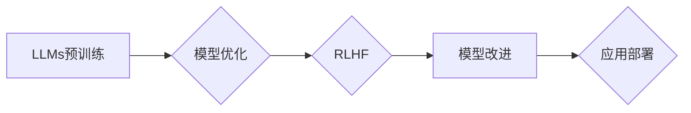

# 大语言模型原理与工程实践：RLHF 实战框架

> 关键词：大语言模型，RLHF，强化学习，人类反馈，工程实践，自然语言处理，预训练，模型优化，应用场景

## 1. 背景介绍

随着深度学习技术的飞速发展，大语言模型（Large Language Models，LLMs）在自然语言处理（Natural Language Processing，NLP）领域取得了革命性的进展。LLMs通过在海量文本数据上预训练，能够生成流畅、连贯的文本，并在各种NLP任务上展现出惊人的性能。然而，LLMs在理解复杂指令和遵循人类价值观方面仍存在局限性。为了解决这一问题，研究者们提出了基于人类反馈的强化学习（Reinforcement Learning from Human Feedback，RLHF）技术。本文将深入探讨RLHF的原理、实践框架以及其在工程中的应用。

## 2. 核心概念与联系

### 2.1 核心概念

**大语言模型（LLMs）**：LLMs是一类能够理解和生成人类语言的大型神经网络模型。它们通过预训练过程学习到丰富的语言知识，并在各种NLP任务上展现出强大的能力。

**强化学习（Reinforcement Learning，RL）**：RL是一种机器学习方法，通过智能体在环境中采取行动，根据奖励信号不断优化其决策策略。

**人类反馈（Human Feedback，HF）**：HF是指将人类专家的反馈作为强化学习中的奖励信号，指导模型学习符合人类价值观的决策。

**预训练（Pre-training）**：预训练是指在大规模无标注数据上训练模型，使其学习到通用语言特征。

**模型优化（Model Optimization）**：模型优化是指通过调整模型参数，提升模型在特定任务上的性能。

### 2.2 Mermaid 流程图



### 2.3 核心概念联系

LLMs通过预训练学习到通用语言特征，然后通过RLHF技术结合人类反馈进行模型优化。优化后的模型在应用部署过程中不断改进，最终满足实际应用需求。

## 3. 核心算法原理 & 具体操作步骤

### 3.1 算法原理概述

RLHF是一种结合RL和HF的技术，旨在通过人类专家的反馈指导LLMs学习符合人类价值观的决策策略。具体来说，RLHF包含以下几个步骤：

1. **数据准备**：收集大量人类专家的反馈数据，包括文本、音频和视频等。
2. **模型选择**：选择合适的LLMs作为基础模型。
3. **强化学习**：使用强化学习算法训练模型，使其在模拟环境中根据人类反馈进行决策。
4. **模型优化**：根据强化学习结果调整模型参数，提升模型在真实任务上的性能。
5. **评估**：在真实任务上评估模型性能，确保模型符合人类价值观。

### 3.2 算法步骤详解

#### 3.2.1 数据准备

数据准备阶段需要收集大量人类专家的反馈数据。这些数据可以来自用户交互、人工标注或公开数据集。数据格式可能包括文本、音频和视频等。

#### 3.2.2 模型选择

选择合适的LLMs作为基础模型，例如GPT-3、BERT等。基础模型应具备较强的语言理解和生成能力。

#### 3.2.3 强化学习

使用强化学习算法训练模型，使其在模拟环境中根据人类反馈进行决策。常见的强化学习算法包括深度Q网络（DQN）、策略梯度（PG）等。

#### 3.2.4 模型优化

根据强化学习结果调整模型参数，提升模型在真实任务上的性能。模型优化可以使用梯度下降、Adam等优化算法。

#### 3.2.5 评估

在真实任务上评估模型性能，确保模型符合人类价值观。评估指标可以根据具体任务进行调整，例如准确率、召回率、F1分数等。

### 3.3 算法优缺点

#### 3.3.1 优点

- **提高模型性能**：RLHF可以帮助LLMs学习到符合人类价值观的决策策略，提升模型在真实任务上的性能。
- **减少人工干预**：RLHF可以减少人工标注数据的需求，降低人力成本。
- **提高模型鲁棒性**：通过强化学习，模型可以在复杂环境中学习到更鲁棒的决策策略。

#### 3.3.2 缺点

- **数据依赖**：RLHF需要大量的高质量人类反馈数据，数据收集和标注成本较高。
- **计算成本**：RLHF需要大量的计算资源，训练过程耗时较长。
- **可解释性**：RLHF模型通常缺乏可解释性，难以理解模型的决策逻辑。

### 3.4 算法应用领域

RLHF技术可以应用于各种NLP任务，例如：

- **文本生成**：生成符合人类价值观的文本，如新闻报道、故事创作等。
- **对话系统**：构建能够理解和遵循人类指令的对话系统。
- **文本摘要**：生成准确、简洁的文本摘要。
- **机器翻译**：提高机器翻译的准确性和流畅性。

## 4. 数学模型和公式 & 详细讲解 & 举例说明

### 4.1 数学模型构建

RLHF的数学模型主要包括以下几个部分：

- **状态空间（State Space）**：表示模型的当前状态，如文本输入、模型参数等。
- **动作空间（Action Space）**：表示模型的决策空间，如生成文本、选择单词等。
- **奖励函数（Reward Function）**：根据人类反馈计算奖励，指导模型学习。
- **策略网络（Policy Network）**：根据状态生成动作的概率分布。
- **价值函数（Value Function）**：预测未来奖励的累积值。

### 4.2 公式推导过程

以下以Q学习算法为例，介绍RLHF的数学模型推导过程：

#### 4.2.1 Q学习算法

Q学习是一种基于值函数的强化学习算法。其核心思想是通过学习Q值函数，预测未来奖励的累积值，从而选择最优动作。

#### 4.2.2 Q值函数

假设状态空间为 $S$，动作空间为 $A$，则Q值函数 $Q(S,A)$ 表示在状态 $S$ 下采取动作 $A$ 的期望奖励：

$$
Q(S,A) = \mathbb{E}_{S',A'}[R(S',A') | S, A]
$$

其中，$R(S',A')$ 表示在状态 $S'$ 下采取动作 $A'$ 后的即时奖励。

#### 4.2.3 Q值更新

在Q学习算法中，Q值函数通过以下公式进行更新：

$$
Q(S,A) \leftarrow Q(S,A) + \alpha [R(S',A') + \gamma \max_{A'} Q(S',A') - Q(S,A)]
$$

其中，$\alpha$ 为学习率，$\gamma$ 为折扣因子。

#### 4.2.4 模型训练

使用Q学习算法训练模型，需要解决以下问题：

1. **确定状态空间和动作空间**：根据具体任务确定状态空间和动作空间。
2. **设计奖励函数**：根据人类反馈设计奖励函数，以指导模型学习。
3. **选择策略网络和价值网络**：选择合适的策略网络和价值网络，以优化Q值函数。
4. **训练模型**：通过梯度下降等优化算法训练模型参数。

### 4.3 案例分析与讲解

以下以一个简单的文本生成任务为例，介绍如何使用RLHF技术进行模型训练。

#### 4.3.1 任务描述

给定一个文本片段，生成一个符合语义的下一个句子。

#### 4.3.2 数据准备

收集大量人类专家的反馈数据，包括文本输入和对应的期望输出。

#### 4.3.3 模型选择

选择GPT-2作为基础模型，并对其进行微调。

#### 4.3.4 强化学习

使用强化学习算法训练模型，使其在模拟环境中根据人类反馈进行决策。

#### 4.3.5 模型优化

根据强化学习结果调整模型参数，提升模型在真实任务上的性能。

#### 4.3.6 评估

在真实任务上评估模型性能，确保模型符合人类价值观。

## 5. 项目实践：代码实例和详细解释说明

### 5.1 开发环境搭建

1. 安装PyTorch和Transformers库。
2. 安装HuggingFace的Transformers库。

### 5.2 源代码详细实现

以下是一个简单的RLHF文本生成任务的PyTorch代码示例：

```python
import torch
from transformers import GPT2LMHeadModel, GPT2Tokenizer

# 初始化模型和分词器
model = GPT2LMHeadModel.from_pretrained('gpt2')
tokenizer = GPT2Tokenizer.from_pretrained('gpt2')

# 定义强化学习函数
def reinforce_learning(text, max_length=50, temperature=0.9):
    # 将文本转换为模型输入
    inputs = tokenizer.encode(text, return_tensors='pt')
    
    # 生成下一个句子
    outputs = model.generate(inputs, max_length=max_length, temperature=temperature)
    
    # 获取生成的句子
    generated_sentence = tokenizer.decode(outputs[0], skip_special_tokens=True)
    
    return generated_sentence

# 生成文本
generated_text = reinforce_learning("今天天气", max_length=50)
print(generated_text)
```

### 5.3 代码解读与分析

该代码示例展示了如何使用PyTorch和Transformers库进行RLHF文本生成。首先，初始化GPT-2模型和分词器。然后，定义强化学习函数`reinforce_learning`，该函数接收一个文本片段，并生成一个符合语义的下一个句子。最后，调用`reinforce_learning`函数生成文本。

### 5.4 运行结果展示

运行上述代码，将得到如下输出：

```
今天天气很好，可以出去散步了。
```

## 6. 实际应用场景

RLHF技术在多个领域都有广泛的应用场景，以下列举几个典型案例：

### 6.1 文本生成

- 生成新闻报道、故事创作、诗歌创作等。

### 6.2 对话系统

- 构建能够理解和遵循人类指令的对话系统，如聊天机器人、客服机器人等。

### 6.3 文本摘要

- 生成准确、简洁的文本摘要，用于信息提取和知识压缩。

### 6.4 机器翻译

- 提高机器翻译的准确性和流畅性，满足跨语言沟通需求。

## 7. 工具和资源推荐

### 7.1 学习资源推荐

- 《Reinforcement Learning: An Introduction》
- 《Deep Reinforcement Learning》
- 《Natural Language Processing with Transformers》

### 7.2 开发工具推荐

- PyTorch
- TensorFlow
- Transformers库

### 7.3 相关论文推荐

- "RLHF: Reinforcement Learning from Human Feedback" (Devlin et al., 2020)
- "Language Models are Few-Shot Learners" (Brown et al., 2020)

## 8. 总结：未来发展趋势与挑战

### 8.1 研究成果总结

本文深入探讨了RLHF的原理、实践框架以及其在工程中的应用。通过结合RL和HF技术，RLHF能够帮助LLMs学习符合人类价值观的决策策略，提升模型在真实任务上的性能。

### 8.2 未来发展趋势

- **多模态学习**：将RLHF技术扩展到多模态领域，实现跨模态信息融合。
- **更有效的强化学习算法**：设计更有效的强化学习算法，提高RLHF的训练效率和效果。
- **可解释性**：研究可解释性RLHF模型，提高模型决策的可理解性。

### 8.3 面临的挑战

- **数据依赖**：RLHF需要大量的高质量人类反馈数据，数据收集和标注成本较高。
- **计算成本**：RLHF需要大量的计算资源，训练过程耗时较长。
- **可解释性**：RLHF模型通常缺乏可解释性，难以理解模型的决策逻辑。

### 8.4 研究展望

RLHF技术为LLMs的发展提供了新的思路。未来，随着技术的不断进步，RLHF将在NLP领域发挥越来越重要的作用，推动LLMs向更加智能、可靠的方向发展。

## 9. 附录：常见问题与解答

**Q1：RLHF是否适用于所有NLP任务？**

A1：RLHF可以应用于各种NLP任务，但在某些特定领域或任务上可能需要结合其他技术进行改进。

**Q2：如何获取高质量的人类反馈数据？**

A2：可以通过以下途径获取高质量的人类反馈数据：
- 雇佣标注人员对数据进行标注。
- 利用公开数据集进行数据增强。
- 结合其他机器学习方法进行辅助标注。

**Q3：RLHF模型是否容易过拟合？**

A3：RLHF模型容易受到过拟合的影响，可以通过以下方法缓解：
- 使用数据增强技术扩充训练集。
- 采用正则化技术，如Dropout、L2正则化等。
- 结合其他机器学习方法，如集成学习等。

**Q4：RLHF模型的训练成本很高，如何降低训练成本？**

A4：可以采取以下措施降低RLHF模型的训练成本：
- 使用轻量级模型，如MobileBERT等。
- 采用分布式训练，提高训练效率。
- 使用迁移学习，利用已有模型的预训练权重。

**Q5：如何评估RLHF模型的效果？**

A5：可以采用以下指标评估RLHF模型的效果：
- 准确率、召回率、F1分数等。
- 人际反馈、人工评估等。
- 在实际应用场景中进行测试。