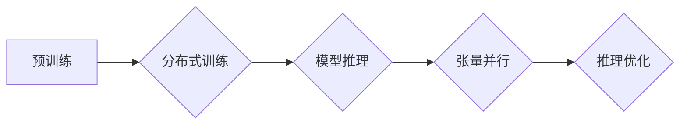

> 关键词：大语言模型，推理工程，并行度，张量并行，分布式训练，深度学习，性能优化，GPU，高性能计算

# 大语言模型原理与工程实践：大语言模型推理工程提高并行度：张量并行 

## 1. 背景介绍

随着深度学习技术的飞速发展，大语言模型（Large Language Models, LLMs）如BERT、GPT等在自然语言处理（Natural Language Processing, NLP）领域取得了显著的成果。这些模型在预训练阶段需要处理海量数据，对计算资源有极高的要求。而在模型部署到实际应用中时，推理阶段的效率同样至关重要。本文将探讨如何在大语言模型推理工程中通过张量并行技术提高并行度，从而提升模型推理性能。

## 2. 核心概念与联系

### 2.1 核心概念原理

#### Mermaid 流程图



#### 关联概念

- **预训练（Pre-training）**：在大规模无标签数据上进行训练，使模型学习到通用的语言表示。
- **分布式训练（Distributed Training）**：将模型训练分布在多个计算节点上，提高训练速度和效率。
- **模型推理（Model Inference）**：将模型应用于实际数据，生成预测结果。
- **张量并行（Tensor Parallelism）**：通过并行处理张量运算来提高模型推理的并行度。
- **推理优化（Inference Optimization）**：针对推理阶段进行优化，提高推理速度和降低资源消耗。

### 2.2 架构

张量并行是提高大语言模型推理并行度的一种重要技术。它通过将模型中的张量分解为多个子张量，并分别在不同的计算设备上并行计算，从而提高并行度。

## 3. 核心算法原理 & 具体操作步骤

### 3.1 算法原理概述

张量并行主要基于以下原理：

- **张量分解**：将模型中的张量分解为多个子张量，每个子张量可以在不同的计算设备上并行计算。
- **计算设备分配**：根据计算设备的性能和资源，将子张量分配到不同的设备上。
- **数据传输**：在计算设备之间进行数据传输，确保子张量可以在正确的设备上计算。

### 3.2 算法步骤详解

1. **模型分析**：分析模型的结构和计算依赖关系，确定哪些张量可以并行计算。
2. **张量分解**：将可并行计算的张量分解为多个子张量。
3. **计算设备分配**：根据计算设备的性能和资源，将子张量分配到不同的设备上。
4. **数据传输**：在计算设备之间进行数据传输，确保子张量可以在正确的设备上计算。
5. **并行计算**：在不同的计算设备上并行计算子张量。
6. **结果合并**：将不同设备上的计算结果合并，得到最终的输出。

### 3.3 算法优缺点

#### 优点

- **提高并行度**：通过并行处理张量运算，可以显著提高模型推理的并行度，从而加速推理速度。
- **资源利用率高**：可以在多台计算设备上并行计算，提高资源利用率。

#### 缺点

- **设计复杂**：张量并行需要分析模型结构，设计计算设备分配策略，以及实现数据传输机制，设计复杂。
- **通信开销**：计算设备之间需要传输数据，可能会带来通信开销。

### 3.4 算法应用领域

张量并行技术可以应用于以下领域：

- **大语言模型推理**：BERT、GPT等大语言模型的推理。
- **计算机视觉**：图像分类、目标检测等任务的推理。
- **语音识别**：语音识别任务的推理。

## 4. 数学模型和公式 & 详细讲解 & 举例说明

### 4.1 数学模型构建

张量并行技术涉及到多个数学概念，包括张量、矩阵运算、线性代数等。以下是一些基本概念：

- **张量（Tensor）**：张量是多维数组，可以表示为 $T_{i_1, i_2, ..., i_d}$，其中 $d$ 表示张量的维度。
- **矩阵运算**：矩阵运算包括矩阵乘法、矩阵加法、矩阵转置等。
- **线性代数**：线性代数是研究向量空间和线性映射的数学分支。

### 4.2 公式推导过程

以下是一个简单的张量并行示例：

假设有一个 $2 \times 2 \times 2$ 的张量 $T$，我们将其分解为两个 $1 \times 2 \times 2$ 的子张量 $T_1$ 和 $T_2$。

$$
T = \begin{pmatrix}
a_{11} & a_{12} \\
a_{21} & a_{22}
\end{pmatrix}
$$

$$
T_1 = \begin{pmatrix}
a_{11} & a_{12}
\end{pmatrix}, \quad T_2 = \begin{pmatrix}
a_{21} & a_{22}
\end{pmatrix}
$$

在两个不同的计算设备上分别计算 $T_1$ 和 $T_2$，然后将结果合并：

$$
T' = T_1 + T_2
$$

### 4.3 案例分析与讲解

以BERT模型为例，我们可以将模型的注意力机制中的查询（Query）、键（Key）和值（Value）张量进行张量并行。通过将每个张量分解为多个子张量，并在不同的GPU上并行计算，可以显著提高推理速度。

## 5. 项目实践：代码实例和详细解释说明

### 5.1 开发环境搭建

为了实现张量并行，我们需要搭建以下开发环境：

- **深度学习框架**：PyTorch或TensorFlow等。
- **计算设备**：多台GPU或TPU。
- **分布式训练库**：PyTorch Distributed或TensorFlow Distribute。

### 5.2 源代码详细实现

以下是一个使用PyTorch实现张量并行的示例代码：

```python
import torch
import torch.nn as nn
from torch.nn.parallel import DistributedDataParallel as DDP

class MyModel(nn.Module):
    def __init__(self):
        super(MyModel, self).__init__()
        self.layer = nn.Linear(10, 10)

    def forward(self, x):
        return self.layer(x)

def main():
    # 初始化计算设备和分布式训练环境
    world_size = torch.distributed.get_world_size()
    rank = torch.distributed.get_rank()
    torch.distributed.init_process_group(backend='nccl')

    # 创建模型
    model = MyModel().to(rank)
    ddp_model = DDP(model, device_ids=[rank])

    # 数据加载和预处理
    # ...

    # 训练过程
    for data, target in dataloader:
        data, target = data.to(rank), target.to(rank)
        output = ddp_model(data)
        loss = criterion(output, target)
        optimizer.zero_grad()
        loss.backward()
        optimizer.step()

if __name__ == '__main__':
    main()
```

### 5.3 代码解读与分析

- `MyModel` 类定义了一个简单的线性层模型。
- `DistributedDataParallel` 类用于包装模型，实现张量并行。
- 在训练过程中，将数据和标签送到对应的计算设备上。
- 使用分布式训练库进行分布式训练。

### 5.4 运行结果展示

通过运行上述代码，我们可以看到模型在多台GPU上的并行训练过程。通过增加计算设备的数量，可以进一步提高模型的并行度，从而加速训练速度。

## 6. 实际应用场景

张量并行技术在大语言模型推理工程中具有广泛的应用场景，以下是一些实际应用案例：

- **智能问答系统**：使用BERT模型进行问答，通过张量并行技术提高推理速度，提升用户体验。
- **自然语言生成**：使用GPT模型进行文本生成，通过张量并行技术提高生成速度，降低成本。
- **机器翻译**：使用机器翻译模型进行翻译，通过张量并行技术提高翻译速度，提升效率。

## 7. 工具和资源推荐

### 7.1 学习资源推荐

- 《深度学习》系列书籍
- PyTorch官方文档
- TensorFlow官方文档

### 7.2 开发工具推荐

- PyTorch
- TensorFlow
- PyTorch Distributed
- TensorFlow Distribute

### 7.3 相关论文推荐

- Distributed Training of Deep Learning Models with PyTorch
- Distributed Training Strategies for Deep Learning

## 8. 总结：未来发展趋势与挑战

### 8.1 研究成果总结

本文介绍了大语言模型推理工程中张量并行的原理、算法和实际应用。通过张量并行技术，可以显著提高模型推理的并行度，从而提升推理性能。

### 8.2 未来发展趋势

随着深度学习技术的不断发展，张量并行技术将朝着以下方向发展：

- **更先进的并行策略**：探索更有效的张量分解和计算设备分配策略。
- **异构计算**：将张量并行与其他并行技术（如数据并行、流水线并行）相结合，进一步提高并行度。
- **低延迟通信**：研究低延迟的通信机制，提高分布式训练和推理的效率。

### 8.3 面临的挑战

张量并行技术在实际应用中面临以下挑战：

- **通信开销**：计算设备之间的数据传输可能会带来通信开销。
- **模型复杂性**：实现张量并行需要分析模型结构，设计计算设备分配策略，以及实现数据传输机制。
- **资源限制**：在资源有限的情况下，如何有效地进行张量并行是一个挑战。

### 8.4 研究展望

为了克服张量并行技术面临的挑战，未来的研究方向包括：

- **低延迟通信技术**：研究低延迟的通信机制，提高分布式训练和推理的效率。
- **模型压缩技术**：通过模型压缩技术，减小模型尺寸，降低通信开销。
- **硬件优化**：设计专用硬件，提高张量并行计算的性能。

## 9. 附录：常见问题与解答

**Q1：张量并行与数据并行的区别是什么？**

A：张量并行和数据并行都是提高模型并行度的技术。张量并行主要针对模型中的张量进行并行计算，而数据并行主要针对输入数据进行并行计算。

**Q2：张量并行的适用场景有哪些？**

A：张量并行适用于需要并行计算张量运算的模型，如深度学习模型、大语言模型等。

**Q3：如何实现张量并行？**

A：实现张量并行需要分析模型结构，设计计算设备分配策略，以及实现数据传输机制。

**Q4：张量并行有哪些优势？**

A：张量并行可以显著提高模型推理的并行度，从而提升推理性能。

**Q5：张量并行有哪些劣势？**

A：张量并行需要分析模型结构，设计计算设备分配策略，以及实现数据传输机制，设计复杂。此外，通信开销也是一个需要考虑的问题。

---

作者：禅与计算机程序设计艺术 / Zen and the Art of Computer Programming