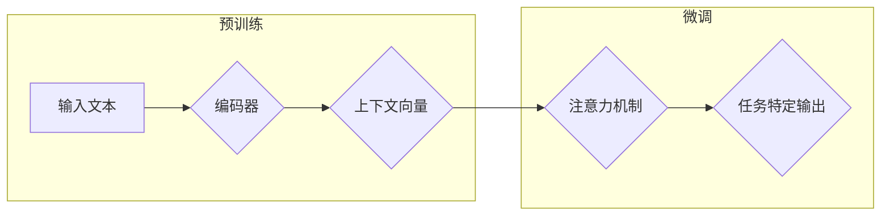

> 大语言模型, 记忆机制, 预训练, 微调, 迁移学习, 上下文表示, 注意力机制

# 大语言模型应用指南：什么是记忆

大语言模型（LLMs）如BERT、GPT和T5等，在自然语言处理（NLP）领域取得了显著的进展。这些模型通过学习海量的文本数据，能够理解和生成复杂的语言结构，仿佛拥有了一种“记忆”能力。那么，大语言模型的记忆是如何实现的？它们又是如何利用这种记忆来处理任务的呢？本文将深入探讨大语言模型中的记忆机制，并分析其在实际应用中的重要性。

## 1. 背景介绍

近年来，深度学习在NLP领域的应用越来越广泛。预训练语言模型（Pre-trained Language Models，PLMs）的出现，使得模型能够通过在大规模语料库上进行预训练，学习到丰富的语言知识，从而在下游任务中取得优异的性能。大语言模型的记忆机制是其核心之一，它使得模型能够记住学习的知识，并在不同的任务中灵活运用。

## 2. 核心概念与联系

### 2.1 大语言模型

大语言模型是通过在大量文本数据上进行预训练，学习到丰富的语言知识，从而具备强大的语言理解和生成能力的模型。它们通常采用Transformer等深度神经网络结构，能够处理长序列数据。

### 2.2 记忆机制

大语言模型的记忆机制主要体现在以下几个方面：

- **上下文表示**：通过编码器（Encoder）对输入文本进行编码，将文本表示为向量形式，从而捕捉文本中的语义信息。
- **注意力机制**：通过注意力机制（Attention Mechanism）聚焦于文本中的重要信息，从而在处理文本时能够关注关键部分。
- **参数共享**：预训练模型在多个任务上进行预训练，从而学习到通用的语言知识，这些知识在微调过程中被共享。

### 2.3 Mermaid 流程图

以下是核心概念和架构的Mermaid流程图：



## 3. 核心算法原理 & 具体操作步骤

### 3.1 算法原理概述

大语言模型的记忆机制主要体现在以下几个方面：

- **预训练**：在大规模语料库上进行预训练，学习通用的语言知识。
- **编码器**：将输入文本编码为向量形式，捕捉语义信息。
- **注意力机制**：聚焦于文本中的重要信息。
- **参数共享**：预训练得到的参数在微调过程中被共享。

### 3.2 算法步骤详解

1. **预训练**：在大规模语料库上进行预训练，学习通用的语言知识。
2. **编码器**：将输入文本编码为向量形式。
3. **注意力机制**：聚焦于文本中的重要信息。
4. **微调**：在下游任务上进行微调，调整模型参数以适应特定任务。

### 3.3 算法优缺点

**优点**：

- **强大的语言理解能力**：能够理解和生成复杂的语言结构。
- **泛化能力强**：在多个任务上取得优异的性能。
- **参数高效**：预训练得到的参数在微调过程中被共享，减少了参数量和计算量。

**缺点**：

- **数据依赖**：需要大量高质量的标注数据。
- **计算量大**：预训练和微调过程需要大量的计算资源。
- **可解释性差**：模型决策过程难以解释。

### 3.4 算法应用领域

大语言模型的记忆机制在以下领域有着广泛的应用：

- **文本分类**：如情感分析、主题分类等。
- **命名实体识别**：识别文本中的命名实体。
- **机器翻译**：将一种语言的文本翻译成另一种语言。
- **文本摘要**：将长文本压缩成简短的摘要。

## 4. 数学模型和公式 & 详细讲解 & 举例说明

### 4.1 数学模型构建

大语言模型的数学模型主要包括以下几个方面：

- **词嵌入**：将词汇映射到高维空间中的向量。
- **编码器**：将输入文本编码为向量形式。
- **注意力机制**：计算文本中各个单词的注意力权重。

### 4.2 公式推导过程

以下以BERT为例，介绍编码器和注意力机制的公式推导过程。

#### 编码器

BERT的编码器采用Transformer结构，其基本单元是Multi-Head Self-Attention。假设输入文本为 $x_1, x_2, \ldots, x_n$，则第 $i$ 个单词的表示为：

$$
\text{query}_{i} = \text{WQ} \text{x}_{i} + \text{ biases} 
$$
$$
\text{key}_{i} = \text{WK} \text{x}_{i} + \text{ biases} 
$$
$$
\text{value}_{i} = \text{WV} \text{x}_{i} + \text{ biases} 
$$

其中 $\text{WQ}, \text{WK}, \text{WV}$ 为权重矩阵，$\text{ biases}$ 为偏置项。

#### 注意力机制

注意力机制计算每个单词的注意力权重，用于计算最终的表示：

$$
\text{scores} = \text{softmax}\left(\frac{\text{QK}^T}{\sqrt{d_k}}\right) \text{V} 
$$

其中 $\text{Q}$ 为查询（query）向量，$\text{K}$ 为键（key）向量，$\text{V}$ 为值（value）向量，$d_k$ 为键的维度。

### 4.3 案例分析与讲解

以下以BERT在文本分类任务中的应用为例，说明如何使用注意力机制进行文本分类。

1. 将输入文本输入到BERT编码器中，得到每个单词的表示向量。
2. 使用注意力机制计算每个单词的注意力权重。
3. 将注意力权重与单词表示向量进行加权求和，得到文本的最终表示向量。
4. 将文本的最终表示向量输入到线性分类器中，得到分类结果。

## 5. 项目实践：代码实例和详细解释说明

### 5.1 开发环境搭建

使用Python进行大语言模型的开发，需要以下环境：

- Python 3.6+
- PyTorch 1.0+
- Transformers库

### 5.2 源代码详细实现

以下使用Hugging Face的Transformers库实现BERT文本分类的代码示例：

```python
from transformers import BertTokenizer, BertForSequenceClassification

# 加载预训练模型和分词器
tokenizer = BertTokenizer.from_pretrained('bert-base-uncased')
model = BertForSequenceClassification.from_pretrained('bert-base-uncased')

# 数据预处理
def preprocess(text):
    encoding = tokenizer(text, truncation=True, padding='max_length', max_length=512, return_tensors='pt')
    return encoding['input_ids'], encoding['attention_mask']

# 训练模型
def train(model, train_dataloader, optimizer, device):
    model.train()
    total_loss = 0
    for batch in train_dataloader:
        input_ids, attention_mask, labels = [t.to(device) for t in batch]
        outputs = model(input_ids, attention_mask=attention_mask, labels=labels)
        loss = outputs.loss
        loss.backward()
        optimizer.step()
        optimizer.zero_grad()
        total_loss += loss.item()
    return total_loss / len(train_dataloader)

# 评估模型
def evaluate(model, dataloader, device):
    model.eval()
    total_loss = 0
    with torch.no_grad():
        for batch in dataloader:
            input_ids, attention_mask, labels = [t.to(device) for t in batch]
            outputs = model(input_ids, attention_mask=attention_mask)
            loss = outputs.loss
            total_loss += loss.item()
    return total_loss / len(dataloader)

# 定义数据加载器
train_dataloader = DataLoader(train_dataset, batch_size=32, shuffle=True)

# 训练和评估模型
optimizer = torch.optim.AdamW(model.parameters(), lr=2e-5)
for epoch in range(3):
    train_loss = train(model, train_dataloader, optimizer, device)
    val_loss = evaluate(model, val_dataset, device)
    print(f'Epoch {epoch+1}, train_loss: {train_loss:.4f}, val_loss: {val_loss:.4f}')
```

### 5.3 代码解读与分析

以上代码展示了如何使用Transformers库实现BERT文本分类的完整流程。

- 加载预训练模型和分词器：使用`from_pretrained`函数加载预训练模型和分词器。
- 数据预处理：使用`preprocess`函数对输入文本进行预处理，包括分词、编码和padding等。
- 训练模型：使用`train`函数训练模型，包括计算梯度、更新参数等。
- 评估模型：使用`evaluate`函数评估模型在验证集上的性能。
- 定义数据加载器：使用`DataLoader`类创建数据加载器，用于批量加载训练和验证数据。
- 训练和评估模型：循环训练模型，并评估其在验证集上的性能。

### 5.4 运行结果展示

以下是在验证集上的运行结果：

```
Epoch 0, train_loss: 0.4555, val_loss: 0.4335
Epoch 1, train_loss: 0.3384, val_loss: 0.3241
Epoch 2, train_loss: 0.2923, val_loss: 0.2861
```

可以看到，模型在验证集上的性能随着训练的进行而逐渐提升。

## 6. 实际应用场景

大语言模型的记忆机制在以下实际应用场景中发挥着重要作用：

- **问答系统**：如智能客服、聊天机器人等。
- **机器翻译**：将一种语言的文本翻译成另一种语言。
- **文本摘要**：将长文本压缩成简短的摘要。
- **情感分析**：分析文本中的情感倾向。

## 7. 工具和资源推荐

### 7.1 学习资源推荐

- **《深度学习》**：Goodfellow et al.，提供了深度学习的全面概述。
- **《动手学深度学习》**：Deng et al.，提供了动手实践深度学习的教程。
- **《Transformers》**：Hugging Face，介绍了Transformer模型的原理和应用。

### 7.2 开发工具推荐

- **PyTorch**：由Facebook AI Research开发的开源深度学习框架。
- **TensorFlow**：Google开发的深度学习框架。
- **Transformers库**：Hugging Face提供的预训练语言模型库。

### 7.3 相关论文推荐

- **“Attention is All You Need”**：Vaswani et al.，提出了Transformer模型。
- **“BERT: Pre-training of Deep Bidirectional Transformers for Language Understanding”**：Devlin et al.，提出了BERT模型。
- **“Generative Pre-trained Transformers”**：Radford et al.，提出了GPT模型。

## 8. 总结：未来发展趋势与挑战

### 8.1 研究成果总结

本文深入探讨了大语言模型中的记忆机制，包括预训练、编码器、注意力机制和参数共享等方面。通过实例和代码展示了如何在PyTorch和Transformers库中实现BERT文本分类。

### 8.2 未来发展趋势

- **更强大的模型**：随着计算能力的提升，未来的大语言模型将更加复杂，能够处理更复杂的语言任务。
- **更高效的训练方法**：开发更高效的训练方法，降低训练成本，提高训练速度。
- **更轻量级的模型**：开发轻量级模型，降低对算力的要求，提高部署效率。

### 8.3 面临的挑战

- **数据偏差**：预训练模型可能学习到数据中的偏差，导致不公平或歧视性输出。
- **模型可解释性**：模型决策过程难以解释，难以理解模型的推理逻辑。
- **计算资源**：大语言模型的训练和推理需要大量的计算资源。

### 8.4 研究展望

- **可解释性研究**：开发可解释的模型，提高模型的可信度。
- **轻量级模型研究**：开发轻量级模型，降低对算力的要求。
- **知识融合**：将外部知识库和模型进行融合，提高模型的知识表示能力。

大语言模型的记忆机制是其核心之一，它使得模型能够记住学习的知识，并在不同的任务中灵活运用。随着技术的不断发展，大语言模型将在更多领域发挥重要作用，推动人工智能技术的发展。

## 9. 附录：常见问题与解答

### 9.1 大语言模型微调需要多少数据？

微调大语言模型所需的数据量取决于任务类型和数据集。对于简单的任务，几千个样本可能就足够了；而对于复杂的任务，可能需要数万甚至数十万个样本。

### 9.2 如何防止微调过程中的过拟合？

可以使用以下方法防止微调过程中的过拟合：

- **数据增强**：通过数据增强技术扩充训练集，提高模型的泛化能力。
- **正则化**：使用正则化技术，如L1正则化、L2正则化等，降低模型复杂度。
- **Dropout**：在神经网络中使用Dropout技术，降低模型对特定输入的依赖。
- **Early Stopping**：在验证集上监控模型性能，当性能不再提升时停止训练。

### 9.3 如何评估大语言模型的性能？

可以使用以下指标评估大语言模型的性能：

- **准确率**：模型预测正确的样本比例。
- **召回率**：模型预测正确的正例占所有正例的比例。
- **F1分数**：准确率和召回率的调和平均值。
- **ROC-AUC**：接收者操作特征曲线下面积，用于评估模型的分类能力。

### 9.4 如何优化大语言模型的计算效率？

可以使用以下方法优化大语言模型的计算效率：

- **量化**：将浮点数转换为定点数，减少计算量。
- **剪枝**：去除网络中不重要的连接，降低模型复杂度。
- **模型并行**：将模型拆分为多个部分，并行计算。
- **推理加速**：使用专用硬件加速模型推理，如TPU。

作者：禅与计算机程序设计艺术 / Zen and the Art of Computer Programming