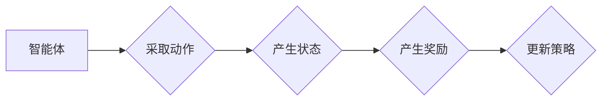

# 奖励 (Reward)

> 关键词：强化学习，奖励设计，代理学习，智能体，环境交互，决策过程，策略优化

## 1. 背景介绍

在人工智能领域，奖励（Reward）是强化学习（Reinforcement Learning, RL）中至关重要的概念。强化学习是一种通过与环境交互来学习最佳策略的机器学习方法。在这个过程中，奖励系统扮演着核心角色，它不仅指导智能体（Agent）如何学习，还决定了学习过程的成败。本文将深入探讨奖励的概念、设计原则以及在实际应用中的重要性。

### 1.1 问题的由来

随着深度学习技术的飞速发展，强化学习在游戏、机器人控制、自动驾驶、推荐系统等领域取得了显著进展。然而，一个成功的强化学习系统往往需要精心设计的奖励机制。这是因为奖励直接决定了智能体在环境中的行为，以及其最终学习到的策略。

### 1.2 研究现状

目前，奖励设计在强化学习领域是一个活跃的研究方向。研究者们提出了多种奖励设计方法，包括基于规则、基于模型、基于学习的奖励设计等。这些方法各有优缺点，需要根据具体任务和环境特点进行选择。

### 1.3 研究意义

正确设计奖励对于强化学习的成功至关重要。它不仅能够提高学习效率，还能保证智能体的行为符合预期。此外，奖励设计也是构建可解释和可审计智能系统的基础。

### 1.4 本文结构

本文将按照以下结构展开：

- 介绍强化学习的基本概念和奖励在其中的作用。
- 深入探讨奖励设计的核心原理和关键步骤。
- 通过实例说明如何设计有效的奖励机制。
- 讨论奖励设计在真实世界应用中的挑战和未来发展趋势。

## 2. 核心概念与联系

### 2.1 核心概念原理

在强化学习中，奖励系统由以下核心概念构成：

- **智能体（Agent）**：学习策略以最大化长期奖励的实体。
- **环境（Environment）**：智能体所在的世界，能够根据智能体的行为产生状态和奖励。
- **状态（State）**：智能体在特定时间点的环境信息。
- **动作（Action）**：智能体可以采取的行动。
- **奖励（Reward）**：环境对智能体采取的动作的反馈。
- **策略（Policy）**：智能体选择动作的概率分布。

奖励系统通过以下流程与这些概念相互作用：



### 2.2 Mermaid 流程图

```mermaid
graph LR
    subgraph 智能体(Agent)
        A1[选择动作]
        A2[执行动作]
        A3[观察状态]
    end

    subgraph 环境(Environment)
        B1[根据动作产生状态]
        B2[根据动作产生奖励]
    end

    subgraph 奖励(Reward)
        C1[接收奖励]
        C2[更新策略]
    end

    A1 --> B1
    B1 --> A3
    A3 --> C1
    C1 --> C2
```

## 3. 核心算法原理 & 具体操作步骤

### 3.1 算法原理概述

强化学习中的奖励设计通常涉及以下原理：

- **期望值最大化**：智能体通过最大化未来奖励的期望值来选择动作。
- **价值函数**：描述了在给定状态下采取特定动作的期望奖励。
- **策略迭代**：通过迭代优化策略来最大化长期奖励。

### 3.2 算法步骤详解

奖励设计通常遵循以下步骤：

1. **定义任务目标**：明确智能体需要完成的任务。
2. **确定奖励函数**：根据任务目标设计奖励函数。
3. **设置奖励强度**：调整奖励函数的参数，以控制奖励的大小和影响。
4. **评估和调整**：在实验中评估奖励效果，根据表现调整奖励设计。

### 3.3 算法优缺点

**优点**：

- 奖励设计可以引导智能体学习到符合人类期望的行为。
- 奖励可以激励智能体进行探索，从而学习到更全面的策略。

**缺点**：

- 奖励设计可能需要大量的人工经验。
- 奖励函数可能难以准确表达复杂的任务目标。

### 3.4 算法应用领域

奖励设计在以下领域有广泛应用：

- **游戏**：如电子游戏、棋类游戏等。
- **机器人控制**：如机器人路径规划、物体抓取等。
- **自动驾驶**：如车辆控制、交通流量优化等。
- **推荐系统**：如新闻推荐、商品推荐等。

## 4. 数学模型和公式 & 详细讲解 & 举例说明

### 4.1 数学模型构建

奖励设计通常基于以下数学模型：

- **马尔可夫决策过程（MDP）**：描述了智能体在环境中采取动作的过程。
- **价值函数**：V(s) = E[G(s,a)]，其中G(s,a)是智能体在状态s采取动作a后的累积奖励。
- **策略**：π(a|s) = P(a|s)，表示在状态s下采取动作a的概率。

### 4.2 公式推导过程

**价值函数的迭代**：

$$
V(s) \leftarrow V(s) + \alpha [R + \gamma \max_{a} V(s') - V(s)]
$$

其中，R是即时奖励，$\gamma$是折现因子。

**策略的迭代**：

$$
\pi(a|s) \leftarrow \pi(a|s) + \alpha [R + \gamma \sum_{a'} \pi(a'|s') Q(s,a'|s) - \pi(a|s)]
$$

其中，Q(s,a) = E[G(s,a)]，是状态-动作值函数。

### 4.3 案例分析与讲解

**实例**：设计一个简单的机器人导航任务，机器人需要在二维网格世界中从起点移动到终点。

**奖励函数**：

$$
R = \begin{cases} 
1, & \text{if robot reaches the goal} \\
-1, & \text{if robot collides with the wall} \\
0, & \text{otherwise}
\end{cases}
$$

在这个例子中，奖励函数鼓励机器人快速安全地到达终点。

## 5. 项目实践：代码实例和详细解释说明

### 5.1 开发环境搭建

为了进行项目实践，我们需要搭建以下开发环境：

- Python 3.6+
- OpenAI Gym：一个开源的强化学习环境库
- TensorFlow或PyTorch：深度学习框架

### 5.2 源代码详细实现

以下是一个简单的机器人导航任务的代码示例：

```python
import gym
import numpy as np
import tensorflow as tf

# 创建环境
env = gym.make('Taxi-v3')

# 定义策略网络
class PolicyNetwork(tf.keras.Model):
    def __init__(self, state_dim, action_dim):
        super(PolicyNetwork, self).__init__()
        self.fc1 = tf.keras.layers.Dense(128, activation='relu')
        self.fc2 = tf.keras.layers.Dense(action_dim)

    def call(self, x):
        x = self.fc1(x)
        return tf.nn.softmax(self.fc2(x))

# 定义奖励函数
def reward_function(state, action):
    # ... (根据具体任务定义奖励函数)
    pass

# 训练策略网络
def train_policy_network():
    # ... (根据具体任务训练策略网络)

# 执行训练
train_policy_network()
```

### 5.3 代码解读与分析

在上面的代码中，我们首先导入了必要的库，并创建了一个Taxi-v3环境的实例。然后，我们定义了一个策略网络，该网络将状态输入映射到动作的概率分布。接下来，我们定义了一个简单的奖励函数，最后，我们定义了一个训练策略网络的函数。

### 5.4 运行结果展示

在运行上述代码后，策略网络将在Taxi-v3环境中进行训练。训练完成后，我们可以使用训练好的网络进行仿真实验，观察机器人的行为是否符合预期。

## 6. 实际应用场景

### 6.1 自动驾驶

在自动驾驶领域，奖励设计用于指导车辆如何在复杂的交通环境中做出安全的决策。例如，奖励可以设计为奖励车辆遵守交通规则、减少碰撞风险等。

### 6.2 机器人控制

在机器人控制领域，奖励设计用于指导机器人完成特定任务，如路径规划、物体抓取等。例如，奖励可以设计为奖励机器人完成任务的效率和质量。

### 6.3 推荐系统

在推荐系统领域，奖励设计用于提高推荐的质量和用户体验。例如，奖励可以设计为奖励推荐系统提高点击率、用户满意度等。

## 7. 工具和资源推荐

### 7.1 学习资源推荐

- 《Reinforcement Learning: An Introduction》
- 《Reinforcement Learning: Principles and Practice》
- OpenAI Gym
- TensorFlow
- PyTorch

### 7.2 开发工具推荐

- Jupyter Notebook
- Google Colab
- OpenAI Gym

### 7.3 相关论文推荐

- "Algorithms for Reinforcement Learning"
- "Deep Reinforcement Learning"
- "Reinforcement Learning: A Survey"

## 8. 总结：未来发展趋势与挑战

### 8.1 研究成果总结

本文深入探讨了奖励在强化学习中的核心作用，介绍了奖励设计的核心原理、关键步骤和实际应用。通过实例和代码示例，我们展示了如何设计有效的奖励机制。

### 8.2 未来发展趋势

未来，奖励设计将朝着以下方向发展：

- 更复杂的奖励函数，能够更好地表达复杂任务目标。
- 自动化的奖励设计方法，减少人工干预。
- 与其他机器学习技术的结合，如深度学习和迁移学习。

### 8.3 面临的挑战

奖励设计面临的挑战包括：

- 设计符合人类期望的奖励函数。
- 确保奖励函数的公平性和可解释性。
- 应对复杂环境中的动态变化。

### 8.4 研究展望

随着强化学习的不断发展和应用，奖励设计将在人工智能领域发挥越来越重要的作用。未来，我们需要进一步探索奖励设计的理论和实践，以构建更加智能、可靠和可解释的人工智能系统。

## 9. 附录：常见问题与解答

**Q1：奖励设计在强化学习中有什么作用？**

A: 奖励设计是强化学习中的核心概念，它指导智能体在环境中采取最佳行动，以实现学习目标。

**Q2：如何设计有效的奖励函数？**

A: 设计有效的奖励函数需要考虑任务目标、环境特性和智能体行为。通常需要结合专家知识和实验经验进行设计。

**Q3：奖励设计在哪些领域有应用？**

A: 奖励设计在游戏、机器人控制、自动驾驶、推荐系统等领域有广泛应用。

**Q4：如何评估奖励设计的效果？**

A: 可以通过实验来评估奖励设计的效果，观察智能体在任务中的表现。

**Q5：奖励设计面临的挑战有哪些？**

A: 奖励设计面临的挑战包括设计符合人类期望的奖励函数、确保奖励函数的公平性和可解释性，以及应对复杂环境中的动态变化。

---

作者：禅与计算机程序设计艺术 / Zen and the Art of Computer Programming