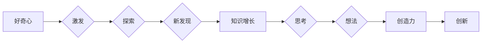

# 好奇心与创造力：探索的双翼

> 关键词：好奇心，创造力，探索，思维模式，问题解决，创新，设计思维，学习，认知科学

## 1. 背景介绍

在人类历史的长河中，好奇心和创造力一直是推动社会进步和个人成长的两大引擎。从古至今，无论是科学技术的突破，还是艺术文化的繁荣，都离不开人们对未知世界的好奇探索和对现有规则的打破创新。本文将探讨好奇心与创造力的本质，分析它们之间的关系，并探讨如何在IT领域应用这些理念，以激发个人的创新潜力，推动技术发展。

### 1.1 好奇心的起源

好奇心是人类天生的一种特质，它是我们探索世界、获取知识、解决问题的内在驱动力。从认知科学的角度来看，好奇心可能与大脑中多巴胺系统的活动有关，这种神经递质与奖励和愉悦感相关，从而激励个体追求新奇和未知。

### 1.2 创造力的定义

创造力是指个体产生新颖、有用想法的能力。它不仅仅是产生新事物的能力，还包括对现有事物的新组合、新应用和新改进。在IT领域，创造力是技术创新的核心，它推动着新的软件架构、新的算法和新的用户体验的产生。

### 1.3 好奇心与创造力的关系

好奇心和创造力是相辅相成的。好奇心激发了对未知的好奇和探索，而创造力则将这种好奇心转化为具体的想法和解决方案。它们共同构成了探索的双翼，推动个体和人类社会不断向前发展。

## 2. 核心概念与联系

### 2.1 好奇心与创造力的 Mermaid 流程图



### 2.2 思维模式

好奇心和创造力的实现依赖于特定的思维模式。以下是一些关键的思维模式：

- **批判性思维**：对现有观念和假设进行质疑和验证。
- **设计思维**：以用户为中心，通过迭代设计解决方案。
- **系统思维**：从整体的角度看待问题，理解各个部分的相互关系。

### 2.3 问题解决

好奇心和创造力在问题解决中起着关键作用。以下是问题解决的一般步骤：

- **识别问题**：发现并定义问题。
- **分析问题**：理解问题的原因和影响因素。
- **生成想法**：提出可能的解决方案。
- **评估和选择**：评估不同解决方案的优缺点，选择最佳方案。
- **实施和评估**：实施解决方案并评估结果。

## 3. 核心算法原理 & 具体操作步骤

### 3.1 算法原理概述

好奇心和创造力的原理涉及多个领域，包括认知科学、心理学、社会学等。以下是几个核心原理：

- **认知失调**：当个体持有相互矛盾的观点时，会产生不舒适的感受，进而促使个体寻求解决方案以减少失调。
- **原型启发**：通过观察现实世界中的原型，激发新的想法和解决方案。
- **头脑风暴**：通过集体讨论，激发创意和想法的产生。

### 3.2 算法步骤详解

以下是激发好奇心和创造力的一些具体步骤：

1. **设定目标**：明确你想要解决的问题或创造的价值。
2. **收集信息**：广泛收集相关信息，包括数据、案例、理论等。
3. **探索和实验**：尝试不同的方法和思路，进行实验和原型设计。
4. **反思和迭代**：反思实验结果，不断迭代和优化解决方案。

### 3.3 算法优缺点

好奇心和创造力的方法具有以下优点：

- **激发创新**：能够产生新颖的想法和解决方案。
- **提高效率**：通过优化现有流程，提高工作效率。
- **促进学习**：通过实践和学习，不断扩展知识面。

然而，这种方法也存在一些缺点：

- **风险**：创新往往伴随着风险，可能失败。
- **时间成本**：创新过程需要时间和资源。
- **不确定性**：创新的结果往往不可预测。

### 3.4 算法应用领域

好奇心和创造力的方法可以应用于以下领域：

- **产品创新**：开发新的产品和服务。
- **技术革新**：推动新技术的发展。
- **教育**：培养学生的创造力和解决问题的能力。

## 4. 数学模型和公式 & 详细讲解 & 举例说明

### 4.1 数学模型构建

在探索好奇心和创造力的过程中，我们可以构建一些简单的数学模型来分析问题。

例如，我们可以将好奇心和创造力的关系表示为一个函数：

$$
C = f(Q, I)
$$

其中，$C$ 代表创造力，$Q$ 代表好奇心，$I$ 代表个体或集体的知识基础。

### 4.2 公式推导过程

这个公式的推导过程如下：

- 好奇心 $Q$ 是创造力 $C$ 的一个重要因素，因此 $Q$ 应该是 $C$ 的增函数。
- 知识基础 $I$ 也会对创造力产生影响，因此 $I$ 应该是 $C$ 的增函数。
- 两个增函数的乘积也是一个增函数，因此 $C$ 应该是 $Q$ 和 $I$ 的乘积。

### 4.3 案例分析与讲解

以下是一个关于好奇心和创造力的案例：

**案例**：一个年轻的程序员想要开发一个能够帮助人们学习新语言的应用。

**分析**：这个程序员的好奇心驱使他去探索语言学习的新方法，他利用自己的编程知识，结合现有的学习理论，开发了一个创新的语言学习应用。

**讲解**：这个案例表明，好奇心和创造力是推动创新的重要因素。程序员的好奇心让他想要解决语言学习的问题，而他的创造力则让他能够将这个想法变为现实。

## 5. 项目实践：代码实例和详细解释说明

### 5.1 开发环境搭建

为了更好地理解好奇心和创造力的应用，我们可以通过一个简单的代码实例来演示。

首先，我们需要一个文本编辑器和编程环境，如Visual Studio Code或PyCharm。

### 5.2 源代码详细实现

以下是一个简单的Python代码实例，它使用头脑风暴技术来激发创造力：

```python
import random

def brainstorm(questions, max_answers):
    answers = []
    while len(answers) < max_answers:
        for question in questions:
            print(question)
            answer = input("Your answer: ")
            answers.append(answer)
    return answers

questions = [
    "如果我可以发明一种新的语言，它应该具备哪些特点？",
    "如何利用人工智能技术改善城市交通拥堵问题？",
    "如何让机器学习更好地理解人类情感？"
]

max_answers = 5
answers = brainstorm(questions, max_answers)

print("Generated answers:")
for answer in answers:
    print(answer)
```

### 5.3 代码解读与分析

这个代码实例首先定义了一个`brainstorm`函数，它接受一个问题和最大答案数量的参数。函数内部，它使用一个循环来重复提问，直到收集到足够的答案。每次提问后，它会等待用户输入答案，并将答案添加到列表中。

### 5.4 运行结果展示

当你运行这段代码时，它会依次提问三个问题，并等待你输入答案。最终，它会输出你输入的所有答案。

## 6. 实际应用场景

好奇心和创造力的方法可以应用于各种实际场景，以下是一些例子：

- **产品开发**：通过头脑风暴和用户研究来设计新的产品。
- **技术创新**：通过探索新技术和现有技术的组合来推动技术创新。
- **教育**：通过项目式学习和案例研究来培养学生的创造力。

### 6.4 未来应用展望

随着人工智能和机器学习的发展，好奇心和创造力的应用将越来越广泛。以下是一些未来的应用展望：

- **个性化学习**：通过分析学生的学习模式和兴趣，提供个性化的学习体验。
- **智能设计**：利用人工智能技术来辅助设计师进行创新设计。
- **智能决策**：通过分析大量数据，帮助决策者做出更好的决策。

## 7. 工具和资源推荐

### 7.1 学习资源推荐

- 《创新者的窘境》
- 《设计思维》
- 《深度工作》
- 《黑客与画家》

### 7.2 开发工具推荐

- Miro
- Trello
- GitHub
- Jupyter Notebook

### 7.3 相关论文推荐

- "The role of curiosity in creative cognition"
- "The creative problem-solving process"
- "Design thinking for innovation"

## 8. 总结：未来发展趋势与挑战

### 8.1 研究成果总结

本文探讨了好奇心和创造力的本质，分析了它们之间的关系，并探讨了如何在IT领域应用这些理念。我们通过数学模型、案例分析、代码实例等方式，展示了好奇心和创造力在激发创新和推动技术发展中的重要作用。

### 8.2 未来发展趋势

未来，好奇心和创造力的应用将更加广泛和深入。随着人工智能和机器学习的发展，我们将能够更好地理解好奇心和创造力的机制，并将其应用于更复杂的场景。

### 8.3 面临的挑战

然而，好奇心和创造力的应用也面临着一些挑战，包括：

- **资源限制**：创新往往需要大量的时间和资源。
- **不确定性**：创新的结果往往不可预测。
- **伦理问题**：创新可能带来一些伦理问题，如数据隐私、人工智能的偏见等。

### 8.4 研究展望

未来，我们需要进一步研究好奇心和创造力的机制，开发出更加有效的方法来激发和培养创造力。同时，我们还需要关注创新带来的社会影响，确保创新能够造福人类社会。

## 9. 附录：常见问题与解答

**Q1：好奇心和创造力是否可以培养？**

A1：是的，好奇心和创造力是可以培养的。通过学习、实践和反思，我们可以提高自己的好奇心和创造力。

**Q2：如何激发好奇心？**

A2：激发好奇心可以通过以下方法：

- 探索新事物
- 学习新知识
- 提出问题
- 培养好奇心

**Q3：如何培养创造力？**

A3：培养创造力可以通过以下方法：

- 练习创造性思维
- 培养批判性思维
- 多角度思考问题
- 不断实践和反思

**Q4：好奇心和创造力在IT领域有哪些具体应用？**

A4：好奇心和创造力在IT领域的应用包括：

- 新产品开发
- 技术创新
- 用户界面设计
- 软件开发

**Q5：如何平衡好奇心和创造力与实际工作？**

A5：平衡好奇心和创造力与实际工作可以通过以下方法：

- 设定明确的目标和计划
- 合理安排时间
- 保持专注和耐心
- 保持学习和实践

---

作者：禅与计算机程序设计艺术 / Zen and the Art of Computer Programming