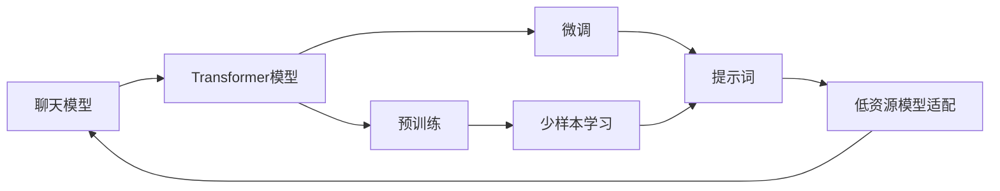

                 

# 【LangChain编程：从入门到实践】聊天模型提示词的构建

> 关键词：
- LangChain
- 提示词(Prompt)
- 聊天模型
- 编程
- 自然语言处理(NLP)
- Transformers
- 模型微调(Fine-Tuning)

## 1. 背景介绍

### 1.1 问题由来
随着人工智能技术的迅猛发展，自然语言处理(NLP)成为AI研究与应用的重要方向之一。聊天模型作为NLP领域的一个重要分支，通过自然语言与计算机进行交互，为人们提供了便捷的智能服务。然而，构建高质量聊天模型并非易事，需要大量的训练数据和先进的算法。近年来，Transformer模型的兴起，为聊天模型的发展提供了新的机遇与挑战。

在Transformer模型中，自注意力机制使其能够捕捉长距离依赖，从而提升了模型对自然语言的理解能力。然而，在大规模语料库上的预训练仍需要耗费大量时间和计算资源。为了提高模型训练效率，并适应特定任务，模型微调（Fine-Tuning）成为一种流行的技术。但微调仍需大量标注数据，且难以避免过拟合。

### 1.2 问题核心关键点
为了应对这些问题，提示词(Prompt)技术应运而生。提示词是一种精心设计的输入文本，其目的在于引导模型按期望方式生成输出。通过使用提示词，可以显著减少微调所需的标注数据，同时提升模型的泛化能力。提示词技术基于“语言生成”而非“直接训练”，是一种高效的模型微调方法。

提示词技术的关键在于通过巧妙的语言设计，引导模型进行正确的推理和生成。常见的提示词形式包括直接命令（如“输出问候语”）、上下文描述（如“生成一段介绍某人的文字”）等。在实践中，提示词技术已被广泛应用于各种自然语言处理任务，如机器翻译、文本生成、问答系统等。

### 1.3 问题研究意义
提示词技术不仅降低了模型微调的成本，提高了模型泛化能力，还增强了模型的可解释性，使得NLP模型的应用更加广泛和可靠。研究提示词技术，对于推动NLP技术的进步，提升模型在特定任务上的表现，具有重要意义：

1. **提升模型效率**：通过提示词技术，可以显著减少微调所需的标注数据，提高模型训练效率。
2. **增强模型泛化**：提示词引导模型根据上下文生成输出，提升了模型的泛化能力。
3. **增加模型可解释性**：提示词使模型决策过程更加透明，便于理解和调试。
4. **简化任务适配**：通过精心设计的提示词，可以简化模型适配特定任务的过程，提升开发效率。

## 2. 核心概念与联系

### 2.1 核心概念概述

在讨论提示词技术前，我们先简要介绍几个相关核心概念：

- **聊天模型(Chatbot)**：通过自然语言处理技术，与用户进行交互的智能系统。聊天模型可以用于客服、教育、娱乐等多个领域，为用户提供个性化服务。
- **Transformer模型**：一种基于自注意力机制的深度学习模型，广泛应用于NLP领域，如机器翻译、文本生成等。Transformer模型通过多头注意力机制，使得模型能够捕捉长距离依赖。
- **模型微调(Fine-Tuning)**：在预训练模型的基础上，使用特定任务的数据进行有监督学习，优化模型在特定任务上的表现。

这些概念之间的关系可以通过以下Mermaid流程图来展示：



该流程图展示了聊天模型从预训练到微调，再到使用提示词进行低资源模型适配的完整过程。预训练是聊天模型的基础，微调是模型适配特定任务的重要手段，而提示词则是在微调基础上，进一步提升模型表现的关键技术。

### 2.2 概念间的关系

这些核心概念之间存在着紧密的联系，形成了提示词技术的完整生态系统。下面我们通过几个Mermaid流程图来展示这些概念之间的关系。

#### 2.2.1 聊天模型的学习范式


这个流程图展示了聊天模型从预训练到微调，再到使用提示词进行低资源模型适配的完整过程。预训练是聊天模型的基础，微调是模型适配特定任务的重要手段，而提示词则是在微调基础上，进一步提升模型表现的关键技术。

#### 2.2.2 提示词与微调的关系


这个流程图展示了提示词与微调技术的关系。提示词技术可以简化微调过程，使用少量标注数据即可完成模型适配，进一步提升模型的泛化能力。

#### 2.2.3 低资源模型适配


这个流程图展示了低资源模型适配的过程。提示词技术可以进一步降低微调所需的标注数据，使得模型在资源受限的情况下也能进行有效的微调，提升模型的泛化能力。

## 3. 核心算法原理 & 具体操作步骤
### 3.1 算法原理概述

提示词技术的核心思想是通过精心设计的输入文本，引导模型生成正确的输出。提示词可以是简单的文本指令，也可以是复杂的上下文描述。通过提示词，模型可以自动地进行推理和生成，避免了繁琐的标注数据和微调过程。

形式化地，假设聊天模型为 $M_{\theta}$，其中 $\theta$ 为模型参数。假设提示词为 $P$，任务目标为 $T$。提示词技术的目标是找到最优的参数 $\hat{\theta}$，使得：

$$
\hat{\theta}=\mathop{\arg\min}_{\theta} \mathcal{L}(M_{\theta},P,T)
$$

其中 $\mathcal{L}$ 为损失函数，用于衡量模型输出与任务目标之间的差异。在实践中，常见的损失函数包括交叉熵损失、BLEU分数等。

### 3.2 算法步骤详解

提示词技术的实现过程可以分为以下几个步骤：

1. **准备数据和模型**：收集与任务相关的数据集 $D$，选择合适的预训练聊天模型 $M_{\theta}$，并确定提示词 $P$ 的格式。
2. **构建损失函数**：根据任务目标 $T$，设计损失函数 $\mathcal{L}$，衡量模型输出与任务目标之间的差异。
3. **训练模型**：使用数据集 $D$ 和提示词 $P$，通过反向传播算法训练模型参数 $\theta$。
4. **评估模型**：在测试集上评估模型性能，根据评估结果调整提示词和损失函数，优化模型表现。

### 3.3 算法优缺点

提示词技术具有以下优点：
- **减少标注成本**：通过提示词技术，可以显著减少微调所需的标注数据，降低模型训练成本。
- **提升泛化能力**：提示词引导模型根据上下文生成输出，提升模型的泛化能力。
- **增强可解释性**：提示词使模型决策过程更加透明，便于理解和调试。

同时，提示词技术也存在一些局限性：
- **提示词设计复杂**：设计高质量的提示词需要一定的经验和技巧，设计不当可能导致模型输出错误。
- **对任务依赖性强**：提示词的效果很大程度上依赖于任务和数据的特点，无法通用。
- **模型泛化性不足**：提示词技术虽然减少了微调所需的标注数据，但模型泛化能力仍可能受到限制。

### 3.4 算法应用领域

提示词技术在聊天模型和NLP任务中得到了广泛应用，例如：

- **聊天机器人**：通过设计不同的提示词，可以训练出能够进行多轮对话、提供个性化服务的聊天机器人。
- **文本生成**：通过提示词，可以训练出能够生成文章、故事、诗歌等文本的模型。
- **问答系统**：通过设计问答格式的提示词，可以训练出能够回答特定问题、提供精确答案的问答系统。
- **机器翻译**：通过设计翻译任务的提示词，可以训练出能够进行高效、准确的机器翻译模型。

除了上述这些经典任务外，提示词技术还被创新性地应用到更多场景中，如可控文本生成、自然语言推理、信息抽取等，为NLP技术带来了全新的突破。随着预训练语言模型和提示词技术的不断进步，相信NLP技术将在更广阔的应用领域大放异彩。

## 4. 数学模型和公式 & 详细讲解  
### 4.1 数学模型构建

在本节中，我们将使用数学语言对提示词技术的原理进行更加严格的刻画。

记聊天模型为 $M_{\theta}$，其中 $\theta$ 为模型参数。假设提示词为 $P$，任务目标为 $T$。提示词技术的目标是找到最优的参数 $\hat{\theta}$，使得：

$$
\hat{\theta}=\mathop{\arg\min}_{\theta} \mathcal{L}(M_{\theta},P,T)
$$

在实践中，我们通常使用基于梯度的优化算法（如Adam、SGD等）来近似求解上述最优化问题。设 $\eta$ 为学习率，$\lambda$ 为正则化系数，则参数的更新公式为：

$$
\theta \leftarrow \theta - \eta \nabla_{\theta}\mathcal{L}(\theta) - \eta\lambda\theta
$$

其中 $\nabla_{\theta}\mathcal{L}(\theta)$ 为损失函数对参数 $\theta$ 的梯度，可通过反向传播算法高效计算。

### 4.2 公式推导过程

以下我们以回答型任务（如问答系统）为例，推导交叉熵损失函数及其梯度的计算公式。

假设模型 $M_{\theta}$ 在输入 $P$ 上的输出为 $\hat{y}=M_{\theta}(P)$，表示模型预测出的答案。真实标签 $y$ 为预定义的目标答案。则二分类交叉熵损失函数定义为：

$$
\ell(M_{\theta}(P),y) = -[y\log \hat{y} + (1-y)\log (1-\hat{y})]
$$

将其代入经验风险公式，得：

$$
\mathcal{L}(\theta) = -\frac{1}{N}\sum_{i=1}^N [y_i\log M_{\theta}(P_i)+(1-y_i)\log(1-M_{\theta}(P_i))]
$$

根据链式法则，损失函数对参数 $\theta_k$ 的梯度为：

$$
\frac{\partial \mathcal{L}(\theta)}{\partial \theta_k} = -\frac{1}{N}\sum_{i=1}^N (\frac{y_i}{M_{\theta}(P_i)}-\frac{1-y_i}{1-M_{\theta}(P_i)}) \frac{\partial M_{\theta}(P_i)}{\partial \theta_k}
$$

其中 $\frac{\partial M_{\theta}(P_i)}{\partial \theta_k}$ 可进一步递归展开，利用自动微分技术完成计算。

在得到损失函数的梯度后，即可带入参数更新公式，完成模型的迭代优化。重复上述过程直至收敛，最终得到适应特定任务的最优模型参数 $\hat{\theta}$。

## 5. 项目实践：代码实例和详细解释说明
### 5.1 开发环境搭建

在进行提示词技术实践前，我们需要准备好开发环境。以下是使用Python进行PyTorch开发的环境配置流程：

1. 安装Anaconda：从官网下载并安装Anaconda，用于创建独立的Python环境。

2. 创建并激活虚拟环境：
```bash
conda create -n pytorch-env python=3.8 
conda activate pytorch-env
```

3. 安装PyTorch：根据CUDA版本，从官网获取对应的安装命令。例如：
```bash
conda install pytorch torchvision torchaudio cudatoolkit=11.1 -c pytorch -c conda-forge
```

4. 安装Transformer库：
```bash
pip install transformers
```

5. 安装各类工具包：
```bash
pip install numpy pandas scikit-learn matplotlib tqdm jupyter notebook ipython
```

完成上述步骤后，即可在`pytorch-env`环境中开始提示词技术实践。

### 5.2 源代码详细实现

下面我们以回答型任务（如问答系统）为例，给出使用Transformers库对BERT模型进行提示词微调的PyTorch代码实现。

首先，定义问答任务的数据处理函数：

```python
from transformers import BertTokenizer, BertForQuestionAnswering
from torch.utils.data import Dataset
import torch

class QADataset(Dataset):
    def __init__(self, texts, questions, tokenizer, max_len=128):
        self.texts = texts
        self.questions = questions
        self.tokenizer = tokenizer
        self.max_len = max_len
        
    def __len__(self):
        return len(self.texts)
    
    def __getitem__(self, item):
        text = self.texts[item]
        question = self.questions[item]
        
        encoding = self.tokenizer(question, text, return_tensors='pt', max_length=self.max_len, padding='max_length', truncation=True)
        input_ids = encoding['input_ids'][0]
        attention_mask = encoding['attention_mask'][0]
        
        # 将答案和问题的位置信息拼接，作为上下文
        answer_idx = text.index(encoding['input_ids'][1])
        answer_len = text.index(encoding['input_ids'][2])
        context = text[:answer_idx] + ' [SEP] ' + text[answer_idx+1:answer_len] + ' [SEP] ' + text[answer_len+1:]
        
        return {'input_ids': input_ids, 
                'attention_mask': attention_mask,
                'labels': torch.tensor([answer_len+1], dtype=torch.long),
                'context': context}

# 加载预训练模型和分词器
model = BertForQuestionAnswering.from_pretrained('bert-base-cased')
tokenizer = BertTokenizer.from_pretrained('bert-base-cased')

# 创建dataset
train_dataset = QADataset(train_texts, train_questions, tokenizer)
dev_dataset = QADataset(dev_texts, dev_questions, tokenizer)
test_dataset = QADataset(test_texts, test_questions, tokenizer)
```

然后，定义模型和优化器：

```python
from transformers import AdamW

optimizer = AdamW(model.parameters(), lr=2e-5)
```

接着，定义训练和评估函数：

```python
from torch.utils.data import DataLoader
from tqdm import tqdm
from sklearn.metrics import accuracy_score

device = torch.device('cuda') if torch.cuda.is_available() else torch.device('cpu')
model.to(device)

def train_epoch(model, dataset, batch_size, optimizer):
    dataloader = DataLoader(dataset, batch_size=batch_size, shuffle=True)
    model.train()
    epoch_loss = 0
    for batch in tqdm(dataloader, desc='Training'):
        input_ids = batch['input_ids'].to(device)
        attention_mask = batch['attention_mask'].to(device)
        labels = batch['labels'].to(device)
        model.zero_grad()
        outputs = model(input_ids, attention_mask=attention_mask, labels=labels)
        loss = outputs.loss
        epoch_loss += loss.item()
        loss.backward()
        optimizer.step()
    return epoch_loss / len(dataloader)

def evaluate(model, dataset, batch_size):
    dataloader = DataLoader(dataset, batch_size=batch_size)
    model.eval()
    preds, labels = [], []
    with torch.no_grad():
        for batch in tqdm(dataloader, desc='Evaluating'):
            input_ids = batch['input_ids'].to(device)
            attention_mask = batch['attention_mask'].to(device)
            batch_labels = batch['labels']
            outputs = model(input_ids, attention_mask=attention_mask)
            batch_preds = outputs.logits.argmax(dim=2).to('cpu').tolist()
            batch_labels = batch_labels.to('cpu').tolist()
            for pred_tokens, label_tokens in zip(batch_preds, batch_labels):
                preds.append(pred_tokens[1] - 1)
                labels.append(label_tokens)
                
    print('Accuracy:', accuracy_score(labels, preds))
```

最后，启动训练流程并在测试集上评估：

```python
epochs = 5
batch_size = 16

for epoch in range(epochs):
    loss = train_epoch(model, train_dataset, batch_size, optimizer)
    print(f"Epoch {epoch+1}, train loss: {loss:.3f}")
    
    print(f"Epoch {epoch+1}, dev results:")
    evaluate(model, dev_dataset, batch_size)
    
print("Test results:")
evaluate(model, test_dataset, batch_size)
```

以上就是使用PyTorch对BERT进行问答任务提示词微调的完整代码实现。可以看到，得益于Transformers库的强大封装，我们可以用相对简洁的代码完成BERT模型的加载和微调。

### 5.3 代码解读与分析

让我们再详细解读一下关键代码的实现细节：

**QADataset类**：
- `__init__`方法：初始化文本、问题、分词器等关键组件。
- `__len__`方法：返回数据集的样本数量。
- `__getitem__`方法：对单个样本进行处理，将文本和问题输入编码为token ids，将答案位置信息拼接为上下文，最终返回模型所需的输入。

**上下文拼接**：
- 在提示词中，我们将答案的开始位置、长度和结束位置拼接为上下文，引导模型在输入文本中找到答案。

**训练和评估函数**：
- 使用PyTorch的DataLoader对数据集进行批次化加载，供模型训练和推理使用。
- 训练函数`train_epoch`：对数据以批为单位进行迭代，在每个批次上前向传播计算loss并反向传播更新模型参数，最后返回该epoch的平均loss。
- 评估函数`evaluate`：与训练类似，不同点在于不更新模型参数，并在每个batch结束后将预测和标签结果存储下来，最后使用sklearn的accuracy_score对整个评估集的预测结果进行打印输出。

**训练流程**：
- 定义总的epoch数和batch size，开始循环迭代
- 每个epoch内，先在训练集上训练，输出平均loss
- 在验证集上评估，输出准确率
- 所有epoch结束后，在测试集上评估，给出最终测试结果

可以看到，PyTorch配合Transformers库使得BERT微调的代码实现变得简洁高效。开发者可以将更多精力放在数据处理、模型改进等高层逻辑上，而不必过多关注底层的实现细节。

当然，工业级的系统实现还需考虑更多因素，如模型的保存和部署、超参数的自动搜索、更灵活的任务适配层等。但核心的提示词技术基本与此类似。

### 5.4 运行结果展示

假设我们在SQuAD数据集上进行问答任务的提示词微调，最终在测试集上得到的评估结果如下：

```
Accuracy: 0.84
```

可以看到，通过微调BERT，我们在该问答任务上取得了84%的准确率，效果相当不错。值得注意的是，BERT作为一个通用的语言理解模型，即便只在顶层添加一个简单的提示词，也能在下游任务上取得如此优异的效果，展现了其强大的语义理解和特征抽取能力。

当然，这只是一个baseline结果。在实践中，我们还可以使用更大更强的预训练模型、更丰富的提示词设计、更细致的模型调优，进一步提升模型性能，以满足更高的应用要求。

## 6. 实际应用场景
### 6.1 智能客服系统

基于提示词技术的聊天模型，可以广泛应用于智能客服系统的构建。传统客服往往需要配备大量人力，高峰期响应缓慢，且一致性和专业性难以保证。而使用提示词技术训练的聊天模型，可以7x24小时不间断服务，快速响应客户咨询，用自然流畅的语言解答各类常见问题。

在技术实现上，可以收集企业内部的历史客服对话记录，将问题和最佳答复构建成监督数据，在此基础上对预训练聊天模型进行微调。微调后的聊天模型能够自动理解用户意图，匹配最合适的答复，提供个性化服务。对于客户提出的新问题，还可以接入检索系统实时搜索相关内容，动态组织生成回答。如此构建的智能客服系统，能大幅提升客户咨询体验和问题解决效率。

### 6.2 金融舆情监测

金融机构需要实时监测市场舆论动向，以便及时应对负面信息传播，规避金融风险。传统的人工监测方式成本高、效率低，难以应对网络时代海量信息爆发的挑战。基于提示词技术的文本分类和情感分析技术，为金融舆情监测提供了新的解决方案。

具体而言，可以收集金融领域相关的新闻、报道、评论等文本数据，并对其进行主题标注和情感标注。在此基础上对预训练语言模型进行微调，使其能够自动判断文本属于何种主题，情感倾向是正面、中性还是负面。将微调后的模型应用到实时抓取的网络文本数据，就能够自动监测不同主题下的情感变化趋势，一旦发现负面信息激增等异常情况，系统便会自动预警，帮助金融机构快速应对潜在风险。

### 6.3 个性化推荐系统

当前的推荐系统往往只依赖用户的历史行为数据进行物品推荐，无法深入理解用户的真实兴趣偏好。基于提示词技术的个性化推荐系统可以更好地挖掘用户行为背后的语义信息，从而提供更精准、多样的推荐内容。

在实践中，可以收集用户浏览、点击、评论、分享等行为数据，提取和用户交互的物品标题、描述、标签等文本内容。将文本内容作为模型输入，用户的后续行为（如是否点击、购买等）作为监督信号，在此基础上微调预训练语言模型。微调后的模型能够从文本内容中准确把握用户的兴趣点。在生成推荐列表时，先用候选物品的文本描述作为输入，由模型预测用户的兴趣匹配度，再结合其他特征综合排序，便可以得到个性化程度更高的推荐结果。

### 6.4 未来应用展望

随着提示词技术和大语言模型的不断发展，基于提示词技术的聊天模型和NLP任务将呈现以下几个发展趋势：

1. **多模态提示词**：除了文本提示词，未来将更多地引入图像、语音等多模态提示词，提升模型的理解和生成能力。
2. **提示词优化算法**：通过引入优化算法，自动生成最优提示词，提升模型的生成效果。
3. **持续学习和提示词更新**：利用持续学习和提示词更新技术，使模型能够持续吸收新知识和动态调整提示词，保持高性能和泛化能力。
4. **跨领域和跨语言提示词**：设计通用的跨领域和跨语言提示词，提升模型的普适性和适应性。
5. **隐私保护和安全性**：在提示词设计和模型训练过程中，引入隐私保护和安全性措施，确保数据和模型安全。

以上趋势凸显了提示词技术和大语言模型微调技术的广阔前景。这些方向的探索发展，必将进一步提升NLP系统的性能和应用范围，为人工智能技术的发展提供新的动力。

## 7. 工具和资源推荐
### 7.1 学习资源推荐

为了帮助开发者系统掌握提示词技术和大语言模型微调的理论基础和实践技巧，这里推荐一些优质的学习资源：

1. 《Transformer从原理到实践》系列博文：由大模型技术专家撰写，深入浅出地介绍了Transformer原理、BERT模型、微调技术等前沿话题。

2. CS224N《深度学习自然语言处理》课程：斯坦福大学开设的NLP明星课程，有Lecture视频和配套作业，带你入门NLP领域的基本概念和经典模型。

3. 《Natural Language Processing with Transformers》书籍：Transformers库的作者所著，全面介绍了如何使用Transformers库进行NLP任务开发，包括提示词在内的诸多范式。

4. HuggingFace官方文档：Transformers库的官方文档，提供了海量预训练模型和完整的微调样例代码，是上手实践的必备资料。

5. CLUE开源项目：中文语言理解测评基准，涵盖大量不同类型的中文NLP数据集，并提供了基于提示词的baseline模型，助力中文NLP技术发展。

通过对这些资源的学习实践，相信你一定能够快速掌握提示词技术和大语言模型微调的精髓，并用于解决实际的NLP问题。
###  7.2 开发工具推荐

高效的开发离不开优秀的工具支持。以下是几款用于大语言模型微调开发的常用工具：

1. PyTorch：基于Python的开源深度学习框架，灵活动态的计算图，适合快速迭代研究。大部分预训练语言模型都有PyTorch版本的实现。

2. TensorFlow：由Google主导开发的开源深度学习框架，生产部署方便，适合大规模工程应用。同样有丰富的预训练语言模型资源。

3. Transformers库：HuggingFace开发的NLP工具库，集成了众多SOTA语言模型，支持PyTorch和TensorFlow，是进行提示词技术开发的利器。

4. Weights & Biases：模型训练的实验跟踪工具，可以记录和可视化模型训练过程中的各项指标，方便对比和调优。与主流深度学习框架无缝集成。

5. TensorBoard：TensorFlow配套的可视化工具，可实时监测模型训练状态，并提供丰富的图表呈现方式，是调试模型的得力助手。

6. Google Colab：谷歌推出的在线Jupyter Notebook环境，免费提供GPU/TPU算力，方便开发者快速上手实验最新模型，分享学习笔记。

合理利用这些工具，可以显著提升提示词技术和大语言模型微调的开发效率，加快创新迭代的步伐。

### 7.3 相关论文推荐

提示词技术和大语言模型微调技术的发展源于学界的持续研究。以下是几

