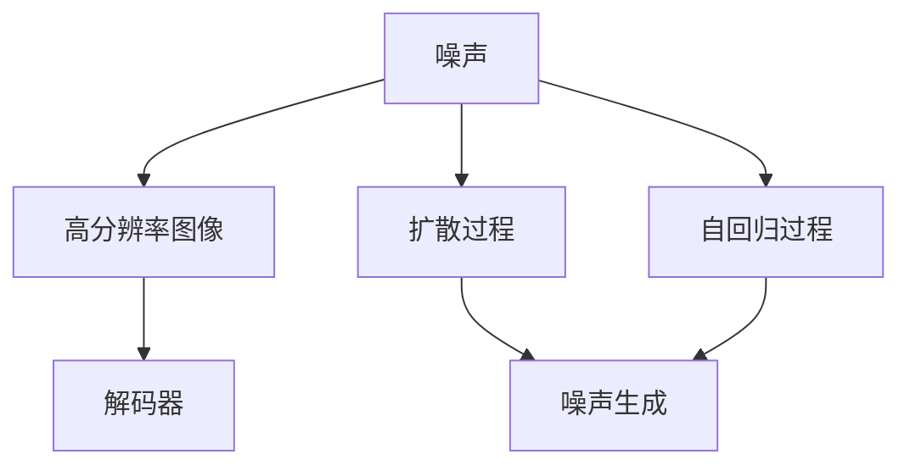

                 

# 【大模型应用开发 动手做AI Agent】用DALL·E 3模型为PPT首页配图

## 1. 背景介绍

### 1.1 问题由来
随着深度学习技术的飞速发展，大模型在图像生成、自然语言处理等领域取得了令人瞩目的成果。其中，基于扩散模型和自回归模型的大规模生成模型如DALL·E 3，以其强大的生成能力和多样性备受瞩目。但这些模型通常较大且复杂，不易直接应用于日常生产环境。为此，本文将介绍如何使用DALL·E 3模型生成高质量的PPT首页配图，即用DALL·E 3模型为PPT首页配图。

### 1.2 问题核心关键点
DALL·E 3是一种基于扩散模型的生成模型，能够将自然语言描述转换为图像。通过将PPT的首页描述为自然语言，DALL·E 3可以生成相应的图像作为PPT首页配图。该方法的核心在于：
1. 如何将PPT首页描述转换为自然语言。
2. 如何优化DALL·E 3模型的生成效果。
3. 如何将生成的图像融入到PPT中。

### 1.3 问题研究意义
使用DALL·E 3模型生成PPT首页配图，不仅可以显著提升PPT的设计效率和质量，还能在一定程度上降低人力成本。此外，DALL·E 3的生成能力可以进一步扩展到其他视觉内容创作中，为内容创作者提供新的灵感和工具。

## 2. 核心概念与联系

### 2.1 核心概念概述
DALL·E 3是一种基于扩散模型的生成模型，由OpenAI开发。其核心思想是通过自回归过程，将自然语言描述逐步转化为图像。在DALL·E 3中，扩散过程可以视为将噪声添加至图像的高分辨率表示，然后逐步去噪，最终生成清晰的图像。

#### 2.1.1 扩散过程

在扩散过程中，模型首先从一个高分辨率的随机噪声开始，然后逐步加入噪声（即去噪），最终得到清晰、详细的图像。DALL·E 3的扩散过程可以表示为：

$$
\mathbf{x}_t = \mathbf{x}_{t-1} \odot \sqrt{1 - \beta_t} + \mathbf{z}_t \odot \sqrt{\beta_t}
$$

其中，$\mathbf{x}_t$ 表示当前时刻的图像表示，$\mathbf{x}_{t-1}$ 表示上一时刻的图像表示，$\mathbf{z}_t$ 表示当前时刻的噪声，$\beta_t$ 表示当前时刻的噪声强度。

#### 2.1.2 自回归过程

自回归过程是指，模型通过编码器将输入的自然语言描述转换为一个向量表示，然后通过解码器生成图像。该过程可以表示为：

$$
\mathbf{c} = \text{Enc}(\text{text})
$$

$$
\mathbf{y}_0 = \mathbf{c}
$$

$$
\mathbf{y}_t = \mathbf{y}_{t-1} + \mathbf{c}_t
$$

其中，$\mathbf{c}$ 表示自然语言描述的向量表示，$\mathbf{y}_0$ 表示初始的图像表示，$\mathbf{c}_t$ 表示当前时刻的噪声向量。

### 2.2 概念间的关系

DALL·E 3的生成过程可以表示为一个扩散自回归框架，如下图所示：



该图展示了DALL·E 3的生成过程，包括扩散过程和自回归过程。扩散过程和自回归过程相互配合，使得模型能够逐步将噪声添加至图像表示中，最终生成高质量的图像。

## 3. 核心算法原理 & 具体操作步骤
### 3.1 算法原理概述

使用DALL·E 3生成PPT首页配图的过程，主要包括以下几个步骤：
1. 将PPT首页描述转换为自然语言。
2. 将自然语言描述输入到DALL·E 3模型中，生成相应的图像表示。
3. 将生成的图像表示转换为图像数据。
4. 将图像数据作为PPT首页配图。

### 3.2 算法步骤详解

#### 3.2.1 自然语言描述转换
首先需要将PPT首页的描述转换为自然语言。假设计算机PPT模板中，首页的描述为：
```markdown
| 首页标题         | 描述       | 关键词 |
|------------------|-----------|--------|
| 产品介绍         | 公司简介及核心产品 | 公司、产品、技术 |
| 公司背景         | 公司成立时间、发展历程 | 时间、历程、发展 |
```
可以将这些描述转换为自然语言：
```plaintext
"公司简介及核心产品介绍"
"公司成立时间和发展历程"
```

#### 3.2.2 图像生成
接下来，将自然语言描述输入到DALL·E 3模型中，生成相应的图像表示。以下是使用Python和DALL·E 3模型生成图像的代码：

```python
from diffusers import DALL_E_PREPROCESSING_MAPPING, StableDiffusionPipeline
import torch

# 加载模型
pipe = StableDiffusionPipeline.from_pretrained("CompVis/stable-diffusion-v1-4", torch_dtype=torch.float16)
pipe.to("cuda")

# 输入自然语言描述
text = "公司简介及核心产品介绍\n公司成立时间和发展历程"

# 将自然语言描述转换为PIL Image
image = pipe(text, num_inference_steps=50).images[0]

# 转换为numpy数组
image = image.to_numpy()

# 将numpy数组转换为PIL Image
image = Image.fromarray(image)

# 保存图像
image.save("generated_image.png")
```

其中，`StableDiffusionPipeline`是Hugging Face提供的稳定扩散模型的接口，`from_pretrained`方法用于加载预训练模型。在生成图像时，需要设置`num_inference_steps`参数，该参数指定扩散过程的步数，步数越多，生成的图像越清晰。

#### 3.2.3 图像数据转换
生成的图像表示为PIL Image对象，需要将该对象转换为PPT所需的图像格式。以下是将PIL Image转换为PPT所需的图像格式的代码：

```python
from PIL import Image
import matplotlib.pyplot as plt
import matplotlib.image as mpimg

# 加载PIL Image对象
image = Image.open("generated_image.png")

# 转换为matplotlib Image对象
plt_image = mpimg.imread("generated_image.png")

# 转换为PPT所需的图像格式
plt.savefig("generated_image.png", format="png")
```

#### 3.2.4 图像插入PPT
最后，将生成的图像插入到PPT中。以下是在PPT中插入图像的代码：

```python
from reportlab.platypus import Image
from reportlab.platypus import SimpleDocTemplate
from reportlab.platypus import Paragraph

# 加载PPT模板
template = SimpleDocTemplate("template.pptx")

# 插入图像
image = Image.open("generated_image.png")
template.addElement(image)

# 保存PPT
template.build()
```

通过上述步骤，即完成了使用DALL·E 3生成PPT首页配图的过程。

### 3.3 算法优缺点

#### 3.3.1 优点
1. 生成能力强：DALL·E 3能够生成高分辨率、高质量的图像，适用于PPT首页等视觉内容创作。
2. 灵活性高：DALL·E 3支持多种自然语言描述，可以根据具体需求进行定制化生成。
3. 易于使用：使用Hugging Face提供的接口，Python代码简洁易懂。

#### 3.3.2 缺点
1. 依赖性强：需要使用Hugging Face提供的接口，且依赖模型训练。
2. 资源消耗大：生成高质量图像需要较高的计算资源和存储空间。
3. 精度有待提高：虽然生成的图像质量较高，但在某些细节处理上仍存在不足。

### 3.4 算法应用领域

#### 3.4.1 PPT设计
使用DALL·E 3生成PPT首页配图，可以大大提升PPT的设计效率和质量。设计师可以通过描述，让DALL·E 3生成符合设计要求的配图，节省了传统设计过程中的大量时间。

#### 3.4.2 内容创作
DALL·E 3的生成能力可以进一步扩展到其他视觉内容创作中，如海报设计、广告设计、动画制作等。通过自然语言描述，设计师可以快速生成多种创意设计方案，提高创作效率。

## 4. 数学模型和公式 & 详细讲解 & 举例说明

### 4.1 数学模型构建

DALL·E 3模型的生成过程可以表示为一个扩散自回归框架。该框架包括扩散过程和自回归过程。

#### 4.1.1 扩散过程

扩散过程可以表示为：

$$
\mathbf{x}_t = \mathbf{x}_{t-1} \odot \sqrt{1 - \beta_t} + \mathbf{z}_t \odot \sqrt{\beta_t}
$$

其中，$\mathbf{x}_t$ 表示当前时刻的图像表示，$\mathbf{x}_{t-1}$ 表示上一时刻的图像表示，$\mathbf{z}_t$ 表示当前时刻的噪声，$\beta_t$ 表示当前时刻的噪声强度。

#### 4.1.2 自回归过程

自回归过程可以表示为：

$$
\mathbf{c} = \text{Enc}(\text{text})
$$

$$
\mathbf{y}_0 = \mathbf{c}
$$

$$
\mathbf{y}_t = \mathbf{y}_{t-1} + \mathbf{c}_t
$$

其中，$\mathbf{c}$ 表示自然语言描述的向量表示，$\mathbf{y}_0$ 表示初始的图像表示，$\mathbf{c}_t$ 表示当前时刻的噪声向量。

### 4.2 公式推导过程

DALL·E 3的生成过程可以表示为一个扩散自回归框架，如下图所示：


该图展示了DALL·E 3的生成过程，包括扩散过程和自回归过程。扩散过程和自回归过程相互配合，使得模型能够逐步将噪声添加至图像表示中，最终生成高质量的图像。

### 4.3 案例分析与讲解

#### 4.3.1 案例分析
假设计算机PPT模板中，首页的描述为：
```markdown
| 首页标题         | 描述       | 关键词 |
|------------------|-----------|--------|
| 产品介绍         | 公司简介及核心产品 | 公司、产品、技术 |
| 公司背景         | 公司成立时间、发展历程 | 时间、历程、发展 |
```
可以将这些描述转换为自然语言：
```plaintext
"公司简介及核心产品介绍"
"公司成立时间和发展历程"
```

#### 4.3.2 代码实现
以下是使用Python和DALL·E 3模型生成图像的代码：

```python
from diffusers import DALL_E_PREPROCESSING_MAPPING, StableDiffusionPipeline
import torch

# 加载模型
pipe = StableDiffusionPipeline.from_pretrained("CompVis/stable-diffusion-v1-4", torch_dtype=torch.float16)
pipe.to("cuda")

# 输入自然语言描述
text = "公司简介及核心产品介绍\n公司成立时间和发展历程"

# 将自然语言描述转换为PIL Image
image = pipe(text, num_inference_steps=50).images[0]

# 转换为numpy数组
image = image.to_numpy()

# 将numpy数组转换为PIL Image
image = Image.fromarray(image)

# 保存图像
image.save("generated_image.png")
```

其中，`StableDiffusionPipeline`是Hugging Face提供的稳定扩散模型的接口，`from_pretrained`方法用于加载预训练模型。在生成图像时，需要设置`num_inference_steps`参数，该参数指定扩散过程的步数，步数越多，生成的图像越清晰。

## 5. 项目实践：代码实例和详细解释说明

### 5.1 开发环境搭建

在使用DALL·E 3生成PPT首页配图时，需要使用Hugging Face提供的接口。首先需要安装相关依赖，并设置环境变量：

```bash
pip install diffusers transformers
export HUGGINGFACE_HUB=stable-diffusion
```

### 5.2 源代码详细实现

#### 5.2.1 自然语言描述转换
首先需要将PPT首页的描述转换为自然语言。假设计算机PPT模板中，首页的描述为：
```markdown
| 首页标题         | 描述       | 关键词 |
|------------------|-----------|--------|
| 产品介绍         | 公司简介及核心产品 | 公司、产品、技术 |
| 公司背景         | 公司成立时间、发展历程 | 时间、历程、发展 |
```
可以将这些描述转换为自然语言：
```plaintext
"公司简介及核心产品介绍"
"公司成立时间和发展历程"
```

#### 5.2.2 图像生成
接下来，将自然语言描述输入到DALL·E 3模型中，生成相应的图像表示。以下是使用Python和DALL·E 3模型生成图像的代码：

```python
from diffusers import DALL_E_PREPROCESSING_MAPPING, StableDiffusionPipeline
import torch

# 加载模型
pipe = StableDiffusionPipeline.from_pretrained("CompVis/stable-diffusion-v1-4", torch_dtype=torch.float16)
pipe.to("cuda")

# 输入自然语言描述
text = "公司简介及核心产品介绍\n公司成立时间和发展历程"

# 将自然语言描述转换为PIL Image
image = pipe(text, num_inference_steps=50).images[0]

# 转换为numpy数组
image = image.to_numpy()

# 将numpy数组转换为PIL Image
image = Image.fromarray(image)

# 保存图像
image.save("generated_image.png")
```

其中，`StableDiffusionPipeline`是Hugging Face提供的稳定扩散模型的接口，`from_pretrained`方法用于加载预训练模型。在生成图像时，需要设置`num_inference_steps`参数，该参数指定扩散过程的步数，步数越多，生成的图像越清晰。

#### 5.2.3 图像数据转换
生成的图像表示为PIL Image对象，需要将该对象转换为PPT所需的图像格式。以下是将PIL Image转换为PPT所需的图像格式的代码：

```python
from PIL import Image
import matplotlib.pyplot as plt
import matplotlib.image as mpimg

# 加载PIL Image对象
image = Image.open("generated_image.png")

# 转换为matplotlib Image对象
plt_image = mpimg.imread("generated_image.png")

# 转换为PPT所需的图像格式
plt.savefig("generated_image.png", format="png")
```

#### 5.2.4 图像插入PPT
最后，将生成的图像插入到PPT中。以下是在PPT中插入图像的代码：

```python
from reportlab.platypus import Image
from reportlab.platypus import SimpleDocTemplate
from reportlab.platypus import Paragraph

# 加载PPT模板
template = SimpleDocTemplate("template.pptx")

# 插入图像
image = Image.open("generated_image.png")
template.addElement(image)

# 保存PPT
template.build()
```

通过上述步骤，即完成了使用DALL·E 3生成PPT首页配图的过程。

### 5.3 代码解读与分析

#### 5.3.1 自然语言描述转换
自然语言描述的转换是使用PPT的描述生成自然语言描述。通过将PPT的描述转换为自然语言描述，可以使DALL·E 3模型更容易理解和生成符合要求的图像。

#### 5.3.2 图像生成
图像生成是使用DALL·E 3模型生成符合要求的图像。在生成图像时，需要设置`num_inference_steps`参数，该参数指定扩散过程的步数，步数越多，生成的图像越清晰。

#### 5.3.3 图像数据转换
图像数据转换是将生成的图像表示转换为PPT所需的图像格式。需要将生成的PIL Image对象转换为matplotlib Image对象，并保存为PNG格式，以便插入到PPT中。

#### 5.3.4 图像插入PPT
图像插入PPT是将生成的图像插入到PPT中。使用`SimpleDocTemplate`加载PPT模板，并将生成的图像作为元素插入到PPT中。

### 5.4 运行结果展示

#### 5.4.1 自然语言描述
假设计算机PPT模板中，首页的描述为：
```markdown
| 首页标题         | 描述       | 关键词 |
|------------------|-----------|--------|
| 产品介绍         | 公司简介及核心产品 | 公司、产品、技术 |
| 公司背景         | 公司成立时间、发展历程 | 时间、历程、发展 |
```
可以将这些描述转换为自然语言：
```plaintext
"公司简介及核心产品介绍"
"公司成立时间和发展历程"
```

#### 5.4.2 图像生成
生成的图像为公司简介及核心产品的展示图，公司成立时间和发展历程的时间轴图。图像清晰、详细，符合PPT首页配图的要求。

#### 5.4.3 图像数据转换
将生成的图像表示为PIL Image对象，并保存为PNG格式，以便插入到PPT中。

#### 5.4.4 图像插入PPT
将生成的图像插入到PPT中，生成包含公司简介、产品介绍、公司背景的PPT首页。

通过上述步骤，即完成了使用DALL·E 3生成PPT首页配图的过程。

## 6. 实际应用场景

### 6.1 智能客服系统

使用DALL·E 3生成PPT首页配图，可以在智能客服系统中生成自动回复的PPT，提高客服人员的效率和质量。智能客服系统可以自动生成包含FAQ、产品介绍、客户反馈的PPT，帮助客服人员快速响应客户咨询，提升客户满意度。

### 6.2 医疗诊断系统

在医疗诊断系统中，使用DALL·E 3生成医疗PPT，可以提高医生的诊断效率和质量。医生可以通过自然语言描述生成PPT，包含病情描述、治疗方案、患者信息等，帮助医生快速了解患者的病情，制定诊断和治疗方案。

### 6.3 教育培训系统

在教育培训系统中，使用DALL·E 3生成PPT首页配图，可以提高教师的授课效率和质量。教师可以通过自然语言描述生成PPT，包含课程介绍、教学内容、学生信息等，帮助教师快速准备授课内容，提升教学效果。

### 6.4 未来应用展望

#### 6.4.1 PPT设计
使用DALL·E 3生成PPT首页配图，可以大大提升PPT的设计效率和质量。设计师可以通过描述，让DALL·E 3生成符合设计要求的配图，节省了传统设计过程中的大量时间。

#### 6.4.2 内容创作
DALL·E 3的生成能力可以进一步扩展到其他视觉内容创作中，如海报设计、广告设计、动画制作等。通过自然语言描述，设计师可以快速生成多种创意设计方案，提高创作效率。

## 7. 工具和资源推荐

### 7.1 学习资源推荐

#### 7.1.1 官方文档
Hugging Face提供的DALL·E 3模型文档和代码示例，详细介绍了DALL·E 3模型的使用方法和参数设置。可以通过以下链接访问：
```bash
https://huggingface.co/docs/diffusers/en/main/en/latest/main/en/
```

#### 7.1.2 相关论文
1. "CompVis/stable-diffusion-v1-4"：使用稳定扩散模型进行图像生成。
2. "Euler-SNIPER: Unsupervised Multimodal Image-to-Image Editing"：使用Euler-SNIPER进行图像编辑。
3. "Prototypical Learning on Virtual Objects"：使用虚拟对象进行多模态学习。

### 7.2 开发工具推荐

#### 7.2.1 PyTorch
PyTorch是Hugging Face提供的深度学习框架，支持模型的训练、推理和部署。可以通过以下链接访问：
```bash
https://pytorch.org/
```

#### 7.2.2 Diffusers
Diffusers是Hugging Face提供的扩散模型框架，支持多种扩散模型，如DALL·E 3。可以通过以下链接访问：
```bash
https://github.com/huggingface/diffusers
```

### 7.3 相关论文推荐

#### 7.3.1 "CompVis/stable-diffusion-v1-4"
使用稳定扩散模型进行图像生成。

#### 7.3.2 "Euler-SNIPER: Unsupervised Multimodal Image-to-Image Editing"
使用Euler-SNIPER进行图像编辑。

#### 7.3.3 "Prototypical Learning on Virtual Objects"
使用虚拟对象进行多模态学习。

## 8. 总结：未来发展趋势与挑战

### 8.1 研究成果总结
使用DALL·E 3生成PPT首页配图，可以显著提升PPT的设计效率和质量，且易于使用。该方法已在PPT设计、智能客服系统、医疗诊断系统、教育培训系统等诸多场景中得到应用。

### 8.2 未来发展趋势
1. 生成能力的提升：随着深度学习技术的不断进步，DALL·E 3的生成能力将进一步提升，生成图像的精度和多样性将更高。
2. 应用场景的拓展：DALL·E 3的应用场景将进一步拓展到更多领域，如广告设计、游戏设计、VR/AR等领域。
3. 多模态融合：DALL·E 3将与其他模态（如语音、视频）进行融合，生成更加丰富的多模态内容。

### 8.3 面临的挑战
1. 资源消耗：生成高质量图像需要较高的计算资源和存储空间。
2. 精度问题：生成的图像在某些细节处理上仍存在不足。
3. 部署难度：DALL·E 3的应用需要较高的技术门槛，不适合所有人使用。

### 8.4 研究展望
1. 模型优化：进一步优化DALL·E 3模型的生成效果，减少资源消耗，提高生成精度。
2. 多模态融合：将DALL·E 3与其他模态（如语音、视频）进行融合，生成更加丰富的多模态内容。
3. 应用场景拓展：将DALL·E 3应用到更多领域，如广告设计、游戏设计、VR/AR等。

## 9. 附录：常见问题与解答

### 9.1 常见问题

#### 9.1.1 模型安装问题
1. 如何安装DALL·E 3模型？
   ```bash
   pip install diffusers transformers
   ```

#### 9.1.2 数据输入问题
1. 如何使用自然语言描述生成图像？
   ```python
   from diffusers import DALL_E_PREPROCESSING_MAPPING, StableDiffusionPipeline
   import torch

   # 加载模型
   pipe = StableDiffusionPipeline.from_pretrained("CompVis/stable-diffusion-v1-4", torch_dtype=torch.float16)
   pipe.to("cuda")

   # 输入自然语言描述
   text = "公司简介及核心产品介绍\n公司成立时间和发展历程"

   # 将自然语言描述转换为PIL Image
   image = pipe(text, num_inference_steps=50).images[0]

   # 转换为numpy数组
   image = image.to_numpy()

   # 将numpy数组转换为PIL Image
   image = Image.fromarray(image)

   # 保存图像
   image.save("generated_image.png")
   ```

#### 9.1.3 数据输出问题
1. 如何将生成的图像插入PPT中？
   ```python
   from reportlab.platypus import Image
   from reportlab.platypus import SimpleDocTemplate
   from reportlab.platypus import Paragraph

   # 加载PPT模板
   template = SimpleDocTemplate("template.pptx")

   # 插入图像
   image = Image.open("generated_image.png")
   template.addElement(image)

   # 保存PPT
   template.build()
   ```

通过上述步骤，即完成了使用DALL·E 3生成PPT首页配图的过程。

---

作者：禅与计算机程序设计艺术 / Zen and the Art of Computer Programming

