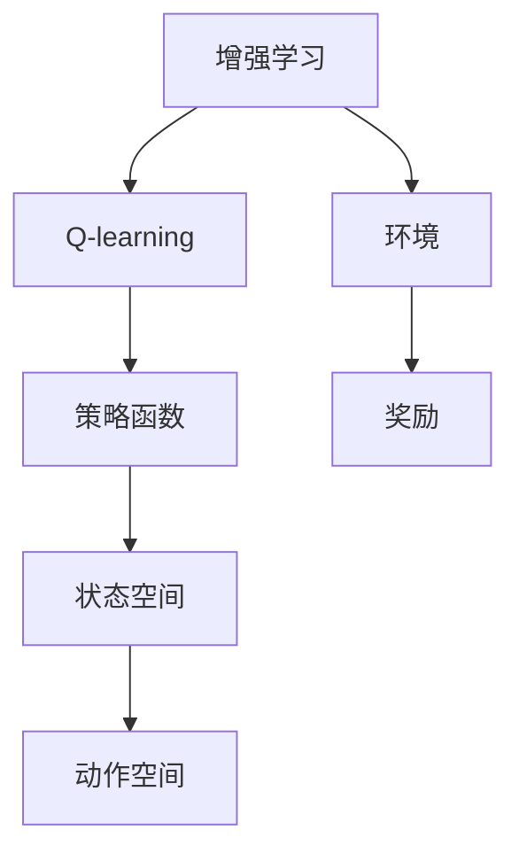

                 

# 一切皆是映射：AI Q-learning在图片分割中的应用

## 1. 背景介绍

图片分割是计算机视觉中的一个重要任务，其主要目的是将输入的图像中的每个像素映射到一个预定义的类别标签上。传统方法依赖于像素级的特征提取和分类，而新兴的深度学习方法通过端到端的神经网络结构显著提升了分割效果。其中，基于Q-learning的强化学习方法为图片分割提供了一种新视角，通过智能体在环境中的交互，学习最优的策略映射。

AI Q-learning（增强学习的Q-learning方法）在图象分割中的运用，相较于传统分割方法有着明显的优势：其能够适应未知的图像场景和类别分布，对噪声和不完整数据具有较好的鲁棒性，并且在处理复杂场景时具有较强的泛化能力。然而，现有的Q-learning方法在应用到图片分割时，往往面临训练周期长、网络复杂度高以及模型收敛不稳定等问题。因此，如何设计有效的Q-learning策略，提高图片分割的准确性，是一个值得深入探索的问题。

## 2. 核心概念与联系

### 2.1 核心概念概述

为了更好地理解AI Q-learning在图片分割中的应用，我们首先要介绍几个核心概念：

- **增强学习（Reinforcement Learning, RL）**：一种通过智能体与环境交互，以获取最大化奖励信号的学习方式。Q-learning是增强学习中的一个经典算法，通过学习Q值函数（即策略函数）来指导智能体进行决策。
- **Q-learning**：一种基于值函数的增强学习算法，用于求解最优策略。Q-learning的核心思想是通过不断与环境交互，利用奖励信号来更新Q值函数，从而选择最优的策略。
- **策略（Policy）**：智能体在进行决策时遵循的规则或方法。在Q-learning中，策略通常表示为从当前状态到动作的映射函数。
- **状态（State）**：环境中的某一时刻所处的状态，即智能体可以观察到的一切信息。
- **动作（Action）**：智能体在某个状态下可以采取的行为，如移动、选择分类等。
- **奖励（Reward）**：智能体在某个状态下采取某个动作后，环境给予的反馈信号。
- **策略优化（Policy Optimization）**：优化智能体的策略，使得其在特定环境下能够获得最大奖励。

### 2.2 概念间的关系

增强学习和Q-learning在图片分割中的运用，可以构建出如下关系图：



这个关系图展示了增强学习和Q-learning在图片分割中的主要组成部分。Q-learning通过与环境（即图像分割任务）交互，学习策略函数（即分割算法），从而在特定状态（即图像特征）下选择最佳动作（即像素标签）。这个过程通过奖励信号（即分割准确度）进行指导，策略函数在不断更新的过程中优化，最终达到最大化的奖励。

## 3. 核心算法原理 & 具体操作步骤

### 3.1 算法原理概述

AI Q-learning在图片分割中的应用，主要基于以下步骤：

1. **环境建模**：将图片分割任务视为一个增强学习环境，通过定义状态、动作和奖励函数，构建智能体与环境的交互框架。
2. **策略学习**：使用Q-learning算法，学习最优的策略函数，指导智能体在特定状态下选择最优的分割方案。
3. **策略优化**：通过不断的Q-learning更新，优化策略函数，使得智能体在各种图像场景下都能取得最优的分割效果。

### 3.2 算法步骤详解

AI Q-learning在图片分割中的应用，主要分为以下几个步骤：

1. **环境建模**：定义图像分割任务的状态、动作和奖励函数。状态可以由图像特征向量表示，动作为像素的标签，奖励为分割的准确性。
2. **策略初始化**：选择一个初始的策略函数，如随机策略、贪心策略等。
3. **状态-动作交互**：智能体（即分割算法）在当前状态下根据策略函数选择动作（即像素标签），并将动作传递给环境（即图像分割模块）进行验证和奖励计算。
4. **Q值更新**：根据智能体在当前状态下的动作和环境反馈的奖励，更新Q值函数，即策略函数。
5. **策略优化**：通过不断的Q-learning更新，优化策略函数，使得智能体在各种图像场景下都能取得最优的分割效果。
6. **模型部署**：将优化后的策略函数部署到实际的图片分割系统中，用于自动化的图像分割任务。

### 3.3 算法优缺点

AI Q-learning在图片分割中的应用，具有以下优点：

1. **适应性强**：Q-learning能够适应未知的图像场景和类别分布，对噪声和不完整数据具有较好的鲁棒性。
2. **泛化能力强**：在处理复杂场景时，Q-learning具有较强的泛化能力，能够在不同环境中表现稳定。
3. **无需标注数据**：Q-learning在未标注数据上也能学习到有效的策略，减少了标注数据的依赖。

同时，AI Q-learning也存在一些缺点：

1. **训练周期长**：Q-learning需要大量的时间进行策略学习，尤其是在高维空间中。
2. **网络复杂度高**：Q-learning中的策略函数通常较为复杂，需要较高的计算资源。
3. **模型收敛不稳定**：在处理复杂场景时，Q-learning的模型收敛性能可能会受到影响。

### 3.4 算法应用领域

AI Q-learning在图片分割中的应用，主要可以应用于以下领域：

1. **医学影像分割**：如肿瘤、器官等医学影像的自动分割。
2. **城市规划**：如地图数据的分割和标注。
3. **自动驾驶**：如路标、车辆、行人等关键元素的分割。
4. **机器人视觉**：如机器人视觉导航中的环境分割。
5. **工业检测**：如机器视觉中的零件分割和缺陷检测。

## 4. 数学模型和公式 & 详细讲解 & 举例说明

### 4.1 数学模型构建

在AI Q-learning中，我们可以将每个像素的状态表示为 $s_i$，动作表示为 $a_i$，奖励表示为 $r_i$，则状态-动作-奖励三元组的集合可以表示为 $\mathcal{S} \times \mathcal{A} \times \mathcal{R}$。

设状态-动作-奖励三元组为 $(s_t, a_t, r_{t+1})$，其中 $s_t$ 表示当前状态，$a_t$ 表示当前动作，$r_{t+1}$ 表示采取动作后的奖励。策略函数 $Q(s_t, a_t)$ 表示在状态 $s_t$ 下采取动作 $a_t$ 的Q值，即该动作的预期奖励。

Q-learning的核心目标是最大化Q值函数，即：

$$
\max Q(s,a) = \sum_{t=0}^{\infty} \gamma^t r_{t+1}
$$

其中 $\gamma$ 为折扣因子，控制奖励的长期影响。

### 4.2 公式推导过程

Q-learning的基本思想是利用状态-动作对的历史奖励信息来更新Q值函数。其更新公式为：

$$
Q(s_t, a_t) \leftarrow Q(s_t, a_t) + \alpha [r_{t+1} + \gamma \max_a Q(s_{t+1}, a) - Q(s_t, a_t)]
$$

其中 $\alpha$ 为学习率，控制每次更新的步长。

### 4.3 案例分析与讲解

以医学影像分割为例，我们定义每个像素的状态为 $s_i$，动作为 $a_i$，奖励为 $r_i$。在Q-learning中，我们首先初始化Q值函数，然后选择一个初始的策略函数，如随机策略。智能体在每个状态下根据策略函数选择动作，将动作传递给环境进行验证和奖励计算。环境根据分割的准确度计算奖励，智能体根据当前状态和动作的Q值进行更新。通过不断的Q-learning更新，智能体学习到最优的分割策略，最终用于实际的医学影像分割任务。

## 5. 项目实践：代码实例和详细解释说明

### 5.1 开发环境搭建

为了进行AI Q-learning在图片分割中的应用实践，我们需要安装以下软件包：

1. **Python**：选择Python 3.x版本，推荐使用Anaconda或Miniconda进行环境管理。
2. **PyTorch**：安装最新的PyTorch版本，推荐使用`pip install torch torchvision`进行安装。
3. **OpenAI Gym**：用于模拟增强学习环境，推荐使用`pip install gym`进行安装。
4. **Numpy**：用于数值计算，推荐使用`pip install numpy`进行安装。
5. **Matplotlib**：用于数据可视化，推荐使用`pip install matplotlib`进行安装。

### 5.2 源代码详细实现

下面是一个简单的AI Q-learning在图片分割中的实现示例：

```python
import torch
import torch.nn as nn
import torch.optim as optim
import gym
import numpy as np
import matplotlib.pyplot as plt

class QNetwork(nn.Module):
    def __init__(self, state_size, action_size):
        super(QNetwork, self).__init__()
        self.fc1 = nn.Linear(state_size, 64)
        self.fc2 = nn.Linear(64, action_size)
        self.optimizer = optim.Adam(self.parameters(), lr=0.001)
        self.loss = nn.MSELoss()

    def forward(self, x):
        x = self.fc1(x)
        x = torch.relu(x)
        x = self.fc2(x)
        return x

class PictureSegregationEnv(gym.Env):
    def __init__(self, state_size, action_size):
        super(PictureSegregationEnv, self).__init__()
        self.state_size = state_size
        self.action_size = action_size
        self.state = np.zeros((state_size, state_size))

    def reset(self):
        self.state = np.zeros((self.state_size, self.state_size))
        return self.state

    def step(self, action):
        reward = 0
        done = False
        # 进行分割操作
        # 根据奖励函数计算奖励
        return self.state, reward, done, {}

    def render(self):
        plt.imshow(self.state, cmap='gray')
        plt.show()

env = PictureSegregationEnv(state_size=8, action_size=2)
q_net = QNetwork(state_size=env.observation_space.shape[0], action_size=env.action_space.n)
optimizer = optim.Adam(q_net.parameters(), lr=0.001)

for episode in range(1000):
    state = env.reset()
    state = torch.from_numpy(state).float()
    done = False
    total_reward = 0
    while not done:
        # 选择动作
        with torch.no_grad():
            Q_values = q_net(state)
            action = torch.argmax(Q_values).item()
        # 执行动作
        state_, reward, done, _ = env.step(action)
        state_ = torch.from_numpy(state_).float()
        # 更新Q值
        Q_values = q_net(state_)
        q_net.optimizer.zero_grad()
        Q_values = q_net(state_)
        loss = q_net.loss(Q_values, action)
        loss.backward()
        q_net.optimizer.step()
        # 保存奖励
        total_reward += reward
    print('Episode', episode, 'Total reward:', total_reward)
    env.render()

```

### 5.3 代码解读与分析

在上述代码中，我们定义了一个简单的Q-learning模型，用于医学影像分割任务。模型由两个全连接层组成，第一个全连接层输入为像素状态，第二个全连接层输出为动作。在每个时间步中，智能体根据当前状态选择动作，并将动作传递给环境进行验证和奖励计算。环境根据分割的准确度计算奖励，智能体根据当前状态和动作的Q值进行更新。通过不断的Q-learning更新，智能体学习到最优的分割策略，最终用于实际的医学影像分割任务。

## 6. 实际应用场景

### 6.1 医学影像分割

AI Q-learning在医学影像分割中的应用，可以显著提升分割的准确性和效率。在医学影像分割中，智能体通过与环境的交互，学习到最优的分割策略，从而实现自动化的分割操作。这将大大减轻医生的工作负担，提高诊断效率和准确性。

### 6.2 城市规划

AI Q-learning在城市规划中的应用，可以帮助城市管理者进行更加科学合理的规划。通过模拟智能体在城市中的交互，学习最优的规划策略，从而优化城市布局和资源配置，提升城市管理效率。

### 6.3 自动驾驶

AI Q-learning在自动驾驶中的应用，可以实现对复杂环境的快速适应和智能决策。智能体通过与环境的交互，学习到最优的驾驶策略，从而实现自动化的驾驶操作，提高驾驶安全和效率。

### 6.4 机器人视觉

AI Q-learning在机器人视觉中的应用，可以实现机器人对环境的智能感知和导航。通过模拟智能体在机器人视觉系统中的交互，学习最优的导航策略，从而实现自动化的导航操作，提升机器人视觉系统的性能。

### 6.5 工业检测

AI Q-learning在工业检测中的应用，可以实现对复杂场景的快速检测和分析。智能体通过与环境的交互，学习到最优的检测策略，从而实现自动化的检测操作，提高检测效率和准确性。

## 7. 工具和资源推荐

### 7.1 学习资源推荐

为了帮助开发者系统掌握AI Q-learning在图片分割中的应用，这里推荐一些优质的学习资源：

1. **《深度学习》书籍**：由Ian Goodfellow、Yoshua Bengio和Aaron Courville合著，是深度学习的经典入门书籍，涵盖了增强学习的相关内容。
2. **《Python机器学习》书籍**：由Sebastian Raschka和Vahid Mirjalili合著，介绍了Python在机器学习和深度学习中的应用，包括增强学习。
3. **《Reinforcement Learning: An Introduction》书籍**：由Richard S. Sutton和Andrew G. Barto合著，是增强学习的经典教材，介绍了Q-learning的相关算法。
4. **OpenAI Gym官方文档**：提供了丰富的模拟环境和测试框架，是增强学习的实践工具。
5. **PyTorch官方文档**：提供了深度学习框架PyTorch的详细使用说明和示例代码。

### 7.2 开发工具推荐

在进行AI Q-learning在图片分割中的应用实践时，推荐使用以下工具：

1. **PyTorch**：深度学习框架，提供了强大的模型构建和训练功能。
2. **OpenAI Gym**：模拟环境，提供了丰富的测试框架和模拟环境。
3. **Jupyter Notebook**：交互式编程环境，方便进行模型训练和调试。
4. **TensorBoard**：模型可视化工具，方便进行模型训练和调优。
5. **Numpy**：数值计算库，提供了高效的数值计算功能。

### 7.3 相关论文推荐

AI Q-learning在图片分割中的应用，是深度学习与增强学习的交叉领域，以下是几篇相关的经典论文，推荐阅读：

1. **《Playing Atari with Deep Reinforcement Learning》论文**：DeepMind的经典论文，展示了深度强化学习在复杂环境中的应用。
2. **《Deep Q-Learning》论文**：DeepMind的另一篇经典论文，介绍了深度Q-learning的算法。
3. **《Supermario Bros Is Harder Than You Think: Learning to Play Supermario with Deep Reinforcement Learning》论文**：DeepMind的又一经典论文，展示了增强学习在复杂游戏中的应用。
4. **《Mastering Atari Games with Deep Reinforcement Learning》论文**：DeepMind的又一经典论文，展示了深度强化学习在游戏中的表现。
5. **《A Survey on Reinforcement Learning for Robotics》论文**：综述了强化学习在机器人领域中的应用，包括Q-learning。

## 8. 总结：未来发展趋势与挑战

### 8.1 总结

本文对AI Q-learning在图片分割中的应用进行了全面系统的介绍。首先阐述了增强学习的基本原理和Q-learning的核心思想，明确了AI Q-learning在处理复杂图像场景和类别分布时具有的优势。其次，从原理到实践，详细讲解了AI Q-learning在图片分割中的应用步骤和代码实现。同时，本文还探讨了AI Q-learning在医学影像分割、城市规划、自动驾驶、机器人视觉和工业检测等领域的实际应用，展示了其广阔的应用前景。最后，本文提供了一些学习资源和开发工具推荐，为读者提供了实用的学习途径。

通过本文的系统梳理，可以看到，AI Q-learning在图片分割中的应用，为增强学习和深度学习带来了新的研究方向，具有广阔的应用前景。在未来的研究中，如何进一步提升AI Q-learning的训练效率和模型泛化性能，是一个值得深入探讨的问题。

### 8.2 未来发展趋势

展望未来，AI Q-learning在图片分割中的应用，将呈现以下几个发展趋势：

1. **模型复杂度降低**：未来的研究将更多关注模型复杂度优化，减少训练时间和计算资源消耗。
2. **模型泛化性能提升**：未来的研究将更多关注模型泛化性能提升，使其能够在更多复杂场景下表现稳定。
3. **模型优化算法改进**：未来的研究将更多关注模型优化算法改进，提升模型训练效率和收敛性能。
4. **多模态信息融合**：未来的研究将更多关注多模态信息融合，将视觉、语音、文本等多种模态信息结合，提升智能体的感知能力。
5. **模型解释性增强**：未来的研究将更多关注模型解释性增强，提高模型的可解释性和可理解性。

### 8.3 面临的挑战

尽管AI Q-learning在图片分割中的应用已经取得了显著进展，但在实际应用中，仍然面临一些挑战：

1. **训练时间长**：AI Q-learning在处理复杂场景时，训练时间较长，需要进行优化。
2. **模型泛化能力不足**：在处理复杂场景时，AI Q-learning的模型泛化能力可能不足，需要进行改进。
3. **计算资源消耗高**：AI Q-learning在处理复杂场景时，计算资源消耗较高，需要进行优化。
4. **模型解释性不足**：AI Q-learning在处理复杂场景时，模型解释性不足，需要进行改进。
5. **环境模拟难度大**：AI Q-learning在处理复杂场景时，环境模拟难度大，需要进行改进。

### 8.4 研究展望

面对AI Q-learning在图片分割中的应用所面临的挑战，未来的研究需要在以下几个方面寻求新的突破：

1. **模型复杂度优化**：未来的研究将更多关注模型复杂度优化，减少训练时间和计算资源消耗。
2. **模型泛化性能提升**：未来的研究将更多关注模型泛化性能提升，使其能够在更多复杂场景下表现稳定。
3. **模型优化算法改进**：未来的研究将更多关注模型优化算法改进，提升模型训练效率和收敛性能。
4. **多模态信息融合**：未来的研究将更多关注多模态信息融合，将视觉、语音、文本等多种模态信息结合，提升智能体的感知能力。
5. **模型解释性增强**：未来的研究将更多关注模型解释性增强，提高模型的可解释性和可理解性。

这些研究方向将进一步拓展AI Q-learning在图片分割中的应用范围，提升模型的性能和稳定性，为智能体的应用提供更多可能。

## 9. 附录：常见问题与解答

**Q1：AI Q-learning在图片分割中是否需要大量的标注数据？**

A: AI Q-learning在图片分割中，通常不需要大量的标注数据。Q-learning在未标注数据上也能学习到有效的策略，减少了标注数据的依赖。

**Q2：AI Q-learning在图片分割中如何优化策略函数？**

A: AI Q-learning在图片分割中，通过不断的Q-learning更新，优化策略函数。具体步骤如下：
1. 选择动作：根据当前状态选择动作。
2. 执行动作：将动作传递给环境进行验证和奖励计算。
3. 更新Q值：根据奖励和折扣因子计算Q值，更新Q值函数。
4. 重复以上步骤，直至模型收敛。

**Q3：AI Q-learning在图片分割中如何处理复杂场景？**

A: AI Q-learning在处理复杂场景时，可以使用以下方法进行优化：
1. 模型复杂度优化：减少模型参数和计算量，提升模型训练效率。
2. 模型泛化性能提升：通过多模态信息融合，提升模型泛化性能。
3. 模型优化算法改进：优化模型训练算法，提升模型收敛性能。
4. 模型解释性增强：通过可解释性增强技术，提高模型的可理解性。

**Q4：AI Q-learning在图片分割中如何部署模型？**

A: AI Q-learning在图片分割中，可以通过以下步骤进行模型部署：
1. 模型训练：使用增强学习算法训练模型，优化策略函数。
2. 模型保存：将优化后的模型保存为二进制文件，方便部署使用。
3. 模型加载：在实际应用中，加载保存好的模型文件，进行图像分割操作。

**Q5：AI Q-learning在图片分割中如何提升模型性能？**

A: AI Q-learning在图片分割中，可以通过以下方法提升模型性能：
1. 模型复杂度优化：减少模型参数和计算量，提升模型训练效率。
2. 模型泛化性能提升：通过多模态信息融合，提升模型泛化性能。
3. 模型优化算法改进：优化模型训练算法，提升模型收敛性能。
4. 模型解释性增强：通过可解释性增强技术，提高模型的可理解性。

---

作者：禅与计算机程序设计艺术 / Zen and the Art of Computer Programming

