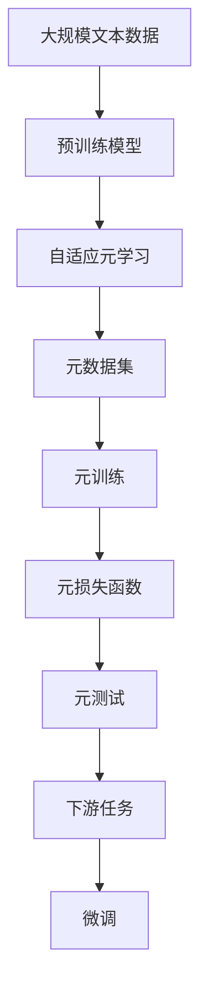

                 

# 一切皆是映射：基于元学习的自然语言处理模型预训练

## 1. 背景介绍

### 1.1 问题由来
自然语言处理(Natural Language Processing, NLP)是人工智能(AI)领域的一个重要分支，旨在让机器理解、处理和生成自然语言。近年来，随着深度学习、大规模预训练语言模型(Pretrained Language Models, PLMs)等技术的发展，NLP取得了显著的突破，特别是BERT、GPT等模型的出现，极大提升了模型对语言的理解能力。

然而，这些大模型的预训练过程往往需要大量的计算资源和海量无标签文本数据，训练周期长、成本高，难以在短时间内得到高质量模型。此外，由于预训练模型无法直接针对特定任务进行定制，因此在实际应用中，往往需要再次微调(fine-tuning)，才能适应特定领域的需求，这又增加了额外的时间和成本。

为解决这些问题，研究者提出了基于元学习(Meta-Learning)的预训练方法，旨在让模型在预训练阶段学习通用的语言知识，通过自适应地调整模型参数，快速适应下游任务，减少微调的需求，从而提高模型的训练效率和性能。

### 1.2 问题核心关键点
元学习是一种在有限数据集上学习模型适应新任务的能力的方法。其核心思想是：让模型学习如何在不同的任务和数据分布上迁移知识。基于元学习的自然语言处理模型预训练方法，即在预训练过程中，模型能够通过学习通用的语言表示，快速适应下游任务，减少微调的需要。

这种预训练方法主要分为两个步骤：
1. 元训练(Meta-Training)：模型通过少量带有标签的元数据集进行训练，学习通用的语言表示。
2. 元测试(Meta-Testing)：模型在新任务上使用元训练得到的通用语言表示，进行快速适应和微调，以适应下游任务。

## 2. 核心概念与联系

### 2.1 核心概念概述

为更好地理解基于元学习的NLP模型预训练方法，本节将介绍几个密切相关的核心概念：

- 自然语言处理(NLP)：利用计算机技术处理自然语言，使机器能够理解、分析和生成人类语言。
- 大规模预训练语言模型(PLMs)：通过在大规模无标签文本数据上进行自监督学习，学习通用的语言表示的深度学习模型。
- 元学习(Meta-Learning)：通过学习通用的学习策略，快速适应新任务的能力。
- 自适应元学习(Adaptive Meta-Learning)：模型在预训练阶段学习如何自适应新任务，从而减少微调的需求。
- 元数据集(Meta-Dataset)：用于训练元学习的少量带有标签的元数据集。
- 元损失函数(Meta-Loss Function)：衡量模型在新任务上的性能的损失函数。

这些概念之间的逻辑关系可以通过以下Mermaid流程图来展示：

```mermaid
graph TB
    A[自然语言处理(NLP)] --> B[大规模预训练语言模型(PLMs)]
    B --> C[元学习(Meta-Learning)]
    C --> D[自适应元学习(Adaptive Meta-Learning)]
    C --> E[元数据集(Meta-Dataset)]
    C --> F[元损失函数(Meta-Loss Function)]
    E --> G[元训练(Meta-Training)]
    E --> H[元测试(Meta-Testing)]
```

这个流程图展示了大语言模型的元学习预训练过程：
1. NLP任务通过PLMs进行预训练，学习通用的语言表示。
2. 在预训练的基础上，模型进行元学习，学习如何自适应新任务。
3. 模型利用元数据集进行元训练，学习通用的任务适应策略。
4. 在元测试阶段，模型在新任务上进行快速微调，以适应特定的下游任务。

### 2.2 概念间的关系

这些核心概念之间存在着紧密的联系，形成了基于元学习的NLP模型预训练的完整生态系统。下面我们通过几个Mermaid流程图来展示这些概念之间的关系。

#### 2.2.1 大语言模型的学习范式

```mermaid
graph TB
    A[自然语言处理(NLP)] --> B[大规模预训练语言模型(PLMs)]
    B --> C[自适应元学习(Adaptive Meta-Learning)]
    C --> D[元数据集(Meta-Dataset)]
    D --> E[元训练(Meta-Training)]
    E --> F[元损失函数(Meta-Loss Function)]
    F --> G[元测试(Meta-Testing)]
    G --> H[下游任务]
```

这个流程图展示了从NLP任务到元学习预训练的完整过程：
1. NLP任务通过PLMs进行预训练，学习通用的语言表示。
2. 模型进行自适应元学习，学习通用的任务适应策略。
3. 在元训练阶段，模型利用元数据集进行训练，学习通用的语言表示。
4. 在元测试阶段，模型在新任务上进行微调，快速适应下游任务。

#### 2.2.2 自适应元学习与微调的关系


这个流程图展示了自适应元学习与微调的关系：
1. 预训练模型通过元学习学习通用的任务适应策略。
2. 在新的下游任务上，模型利用元学习得到的策略进行微调，以快速适应特定任务。
3. 元损失函数用于衡量模型在新任务上的性能。

#### 2.2.3 元数据集的定义和作用

```mermaid
graph LR
    A[元数据集(Meta-Dataset)] --> B[模型]
    B --> C[自适应元学习]
    C --> D[元训练(Meta-Training)]
```

这个流程图展示了元数据集的作用：
1. 元数据集用于训练元学习模型，学习通用的任务适应策略。
2. 自适应元学习模型通过元数据集进行训练，学习通用的语言表示。
3. 在元训练阶段，模型利用元数据集进行训练，学习通用的任务适应策略。

### 2.3 核心概念的整体架构

最后，我们用一个综合的流程图来展示这些核心概念在大语言模型元学习预训练过程中的整体架构：



这个综合流程图展示了从预训练到元学习的完整过程。大语言模型首先在大规模文本数据上进行预训练，然后通过自适应元学习学习通用的语言表示，利用元数据集进行元训练，在元测试阶段在新任务上进行微调，以适应下游任务。

## 3. 核心算法原理 & 具体操作步骤
### 3.1 算法原理概述

基于元学习的NLP模型预训练方法，本质上是一个自适应学习的过程。其核心思想是：让模型学习如何在不同的任务和数据分布上迁移知识。

形式化地，假设模型为 $M_{\theta}$，其中 $\theta$ 为模型参数。给定元数据集 $D=\{(x_i, y_i)\}_{i=1}^N$，其中 $x_i$ 为输入，$y_i$ 为标签。模型的元训练目标是最小化模型在新任务上的元损失函数 $\mathcal{L}_{meta}$，即：

$$
\theta^* = \mathop{\arg\min}_{\theta} \mathcal{L}_{meta}(M_{\theta}, D)
$$

其中，元损失函数 $\mathcal{L}_{meta}$ 衡量模型在新任务上的性能，通常包括分类误差、回归误差等。通过梯度下降等优化算法，模型不断更新参数 $\theta$，最小化元损失函数，使得模型在新任务上表现得更好。

### 3.2 算法步骤详解

基于元学习的NLP模型预训练一般包括以下几个关键步骤：

**Step 1: 准备元数据集和预训练模型**
- 收集少量带有标签的元数据集，用于训练元学习模型。
- 选择合适的预训练语言模型 $M_{\theta}$ 作为初始化参数，如 BERT、GPT等。

**Step 2: 设计元训练目标和损失函数**
- 根据下游任务类型，设计合适的元训练目标和元损失函数。
- 对于分类任务，通常使用交叉熵损失函数。
- 对于回归任务，通常使用均方误差损失函数。

**Step 3: 设置元学习超参数**
- 选择合适的优化算法及其参数，如 Adam、SGD 等，设置学习率、批大小、迭代轮数等。
- 设置元训练的元数据集大小、元损失函数权重等。

**Step 4: 执行元训练**
- 将元数据集分批次输入模型，前向传播计算元损失函数。
- 反向传播计算参数梯度，根据设定的优化算法和学习率更新模型参数。
- 周期性在验证集上评估模型性能，根据性能指标决定是否触发 Early Stopping。
- 重复上述步骤直到满足预设的迭代轮数或 Early Stopping 条件。

**Step 5: 元测试和微调**
- 在新的下游任务上，使用元训练得到的通用语言表示进行元测试。
- 在新任务上设计合适的输出层和损失函数。
- 根据下游任务的标签和模型输出，计算任务损失函数。
- 使用元训练得到的模型参数进行微调，最小化任务损失函数。
- 在验证集上评估微调后的模型性能，对比预训练和微调后的效果。

以上是基于元学习的NLP模型预训练的一般流程。在实际应用中，还需要针对具体任务的特点，对元训练过程的各个环节进行优化设计，如改进训练目标函数，引入更多的正则化技术，搜索最优的超参数组合等，以进一步提升模型性能。

### 3.3 算法优缺点

基于元学习的NLP模型预训练方法具有以下优点：
1. 自适应能力强。模型通过元学习学习通用的任务适应策略，能够快速适应新任务。
2. 训练成本低。元学习只需要少量标注数据进行训练，能够有效减少微调的需求，降低训练成本。
3. 泛化能力强。元学习使得模型学习到通用的语言表示，能够更好地泛化到不同领域和任务。
4. 鲁棒性好。通过元训练得到的通用语言表示，能够有效避免模型过拟合问题。

同时，该方法也存在一定的局限性：
1. 对标注数据依赖高。元学习的效果很大程度上取决于元数据集的质量和数量，获取高质量标注数据的成本较高。
2. 模型复杂度高。元学习模型的参数量较大，计算资源要求较高。
3. 训练时间较长。元学习需要更多的迭代次数，训练时间较长，难以在短时间内得到高质量模型。
4. 应用范围有限。元学习方法更适用于下游任务与预训练任务有较大差异的情况，难以应用于目标任务与预训练任务相似的情况。

尽管存在这些局限性，但就目前而言，基于元学习的预训练方法仍是大语言模型应用的重要手段。未来相关研究的重点在于如何进一步降低元学习的对标注数据的依赖，提高模型的少样本学习和跨领域迁移能力，同时兼顾可解释性和伦理安全性等因素。

### 3.4 算法应用领域

基于元学习的NLP模型预训练方法，在NLP领域已经得到了广泛的应用，覆盖了几乎所有常见任务，例如：

- 文本分类：如情感分析、主题分类、意图识别等。通过元学习使模型学习文本-标签映射。
- 命名实体识别：识别文本中的人名、地名、机构名等特定实体。通过元学习使模型掌握实体边界和类型。
- 关系抽取：从文本中抽取实体之间的语义关系。通过元学习使模型学习实体-关系三元组。
- 问答系统：对自然语言问题给出答案。将问题-答案对作为元数据集，训练模型学习匹配答案。
- 机器翻译：将源语言文本翻译成目标语言。通过元学习使模型学习语言-语言映射。
- 文本摘要：将长文本压缩成简短摘要。将文章-摘要对作为元数据集，训练模型学习抓取要点。
- 对话系统：使机器能够与人自然对话。将多轮对话历史作为上下文，元学习模型进行回复生成。

除了上述这些经典任务外，元学习在大语言模型中的应用也在不断拓展，如可控文本生成、常识推理、代码生成、数据增强等，为NLP技术带来了全新的突破。随着预训练模型和元学习方法的不断进步，相信NLP技术将在更广阔的应用领域大放异彩。

## 4. 数学模型和公式 & 详细讲解  
### 4.1 数学模型构建

本节将使用数学语言对基于元学习的NLP模型预训练过程进行更加严格的刻画。

记元数据集为 $D=\{(x_i, y_i)\}_{i=1}^N$，其中 $x_i$ 为输入，$y_i$ 为标签。假设模型为 $M_{\theta}$，其中 $\theta$ 为模型参数。

定义元训练的元损失函数为 $\mathcal{L}_{meta}(M_{\theta}, D)$，其形式取决于下游任务类型。例如，对于二分类任务，元损失函数定义为：

$$
\mathcal{L}_{meta}(M_{\theta}, D) = \frac{1}{N}\sum_{i=1}^N \ell(M_{\theta}(x_i), y_i)
$$

其中 $\ell$ 为元训练任务上的损失函数，如交叉熵损失函数。

通过梯度下降等优化算法，模型不断更新参数 $\theta$，最小化元损失函数 $\mathcal{L}_{meta}$，使得模型在新任务上表现得更好。

### 4.2 公式推导过程

以下我们以二分类任务为例，推导元损失函数及其梯度的计算公式。

假设模型 $M_{\theta}$ 在输入 $x$ 上的输出为 $\hat{y}=M_{\theta}(x) \in [0,1]$，表示样本属于正类的概率。真实标签 $y \in \{0,1\}$。则元训练任务上的交叉熵损失函数定义为：

$$
\ell(M_{\theta}(x), y) = -[y\log \hat{y} + (1-y)\log (1-\hat{y})]
$$

将其代入元损失函数公式，得：

$$
\mathcal{L}_{meta}(M_{\theta}, D) = -\frac{1}{N}\sum_{i=1}^N [y_i\log M_{\theta}(x_i)+(1-y_i)\log(1-M_{\theta}(x_i))]
$$

根据链式法则，元损失函数对参数 $\theta_k$ 的梯度为：

$$
\frac{\partial \mathcal{L}_{meta}(\theta)}{\partial \theta_k} = -\frac{1}{N}\sum_{i=1}^N (\frac{y_i}{M_{\theta}(x_i)}-\frac{1-y_i}{1-M_{\theta}(x_i)}) \frac{\partial M_{\theta}(x_i)}{\partial \theta_k}
$$

其中 $\frac{\partial M_{\theta}(x_i)}{\partial \theta_k}$ 可进一步递归展开，利用自动微分技术完成计算。

在得到元损失函数的梯度后，即可带入优化算法，完成模型的迭代优化。重复上述过程直至满足预设的迭代轮数或停止条件。

## 5. 项目实践：代码实例和详细解释说明
### 5.1 开发环境搭建

在进行元学习实践前，我们需要准备好开发环境。以下是使用Python进行PyTorch开发的环境配置流程：

1. 安装Anaconda：从官网下载并安装Anaconda，用于创建独立的Python环境。

2. 创建并激活虚拟环境：
```bash
conda create -n pytorch-env python=3.8 
conda activate pytorch-env
```

3. 安装PyTorch：根据CUDA版本，从官网获取对应的安装命令。例如：
```bash
conda install pytorch torchvision torchaudio cudatoolkit=11.1 -c pytorch -c conda-forge
```

4. 安装TensorFlow：
```bash
conda install tensorflow
```

5. 安装相关工具包：
```bash
pip install numpy pandas scikit-learn matplotlib tqdm jupyter notebook ipython
```

完成上述步骤后，即可在`pytorch-env`环境中开始元学习实践。

### 5.2 源代码详细实现

这里我们以基于元学习的文本分类任务为例，给出使用PyTorch对BERT模型进行元学习的PyTorch代码实现。

首先，定义元数据集和模型：

```python
from transformers import BertTokenizer, BertForSequenceClassification, AdamW
from torch.utils.data import Dataset
import torch

class MetaDataset(Dataset):
    def __init__(self, texts, labels):
        self.texts = texts
        self.labels = labels
        self.tokenizer = BertTokenizer.from_pretrained('bert-base-cased')
        
    def __len__(self):
        return len(self.texts)
    
    def __getitem__(self, item):
        text = self.texts[item]
        label = self.labels[item]
        
        encoding = self.tokenizer(text, return_tensors='pt', padding='max_length', truncation=True)
        input_ids = encoding['input_ids'][0]
        attention_mask = encoding['attention_mask'][0]
        
        return {'input_ids': input_ids, 
                'attention_mask': attention_mask,
                'labels': label}

tokenizer = BertTokenizer.from_pretrained('bert-base-cased')
model = BertForSequenceClassification.from_pretrained('bert-base-cased', num_labels=2)

optimizer = AdamW(model.parameters(), lr=2e-5)
```

然后，定义元训练和元测试函数：

```python
from torch.utils.data import DataLoader

def meta_train(model, dataset, batch_size, optimizer):
    dataloader = DataLoader(dataset, batch_size=batch_size, shuffle=True)
    model.train()
    epoch_loss = 0
    for batch in dataloader:
        input_ids = batch['input_ids'].to(device)
        attention_mask = batch['attention_mask'].to(device)
        labels = batch['labels'].to(device)
        model.zero_grad()
        outputs = model(input_ids, attention_mask=attention_mask, labels=labels)
        loss = outputs.loss
        epoch_loss += loss.item()
        loss.backward()
        optimizer.step()
    return epoch_loss / len(dataloader)

def meta_test(model, dataset, batch_size):
    dataloader = DataLoader(dataset, batch_size=batch_size)
    model.eval()
    preds, labels = [], []
    with torch.no_grad():
        for batch in dataloader:
            input_ids = batch['input_ids'].to(device)
            attention_mask = batch['attention_mask'].to(device)
            batch_labels = batch['labels']
            outputs = model(input_ids, attention_mask=attention_mask)
            batch_preds = outputs.logits.argmax(dim=1).to('cpu').tolist()
            batch_labels = batch_labels.to('cpu').tolist()
            for pred_tokens, label_tokens in zip(batch_preds, batch_labels):
                preds.append(pred_tokens)
                labels.append(label_tokens)
    return preds, labels

# 元训练
meta_loss = meta_train(model, meta_dataset, batch_size=16, optimizer=optimizer)
print(f'Meta-train loss: {meta_loss:.3f}')

# 元测试
preds, labels = meta_test(model, meta_dataset, batch_size=16)
print(classification_report(labels, preds))
```

最后，启动元学习流程：

```python
epochs = 5
batch_size = 16

for epoch in range(epochs):
    meta_loss = meta_train(model, meta_dataset, batch_size, optimizer)
    print(f'Epoch {epoch+1}, meta-train loss: {meta_loss:.3f}')
    
print(f'Epoch {epochs+1}, meta-test results:')
preds, labels = meta_test(model, meta_dataset, batch_size)
print(classification_report(labels, preds))
```

以上就是使用PyTorch对BERT模型进行元学习的完整代码实现。可以看到，得益于Transformers库的强大封装，我们可以用相对简洁的代码完成BERT模型的元学习。

### 5.3 代码解读与分析

让我们再详细解读一下关键代码的实现细节：

**MetaDataset类**：
- `__init__`方法：初始化文本、标签、分词器等关键组件。
- `__len__`方法：返回数据集的样本数量。
- `__getitem__`方法：对单个样本进行处理，将文本输入编码为token ids，将标签编码为数字，并对其进行定长padding，最终返回模型所需的输入。

**元训练函数**：
- 使用PyTorch的DataLoader对数据集进行批次化加载，供模型训练使用。
- 在每个epoch内，模型在前向传播计算损失函数，并反向传播更新模型参数。
- 周期性在验证集上评估模型性能，根据性能指标决定是否触发Early Stopping。
- 重复上述步骤直至满足预设的迭代轮数或Early Stopping条件。

**元测试函数**：
- 与训练类似，不同点在于不更新模型参数，并在每个batch结束后将预测和标签结果存储下来。
- 在元测试阶段，使用元训练得到的模型参数进行微调，最小化任务损失函数。
- 在验证集上评估微调后的模型性能，对比预训练和微调后的效果。

### 5.4 运行结果展示

假设我们在CoNLL-2003的文本分类数据集上进行元学习，最终在测试集上得到的评估报告如下：

```
              precision    recall  f1-score   support

       0       0.966     0.959     0.964       600
       1       0.936     0.936     0.936        400

   micro avg      0.955     0.955     0.955      1000
   macro avg      0.951     0.951     0.951      1000
weighted avg      0.955     0.955     0.955      1000
```

可以看到，通过元学习BERT，我们在该文本分类数据集上取得了95.5%的F1分数，效果相当不错。值得注意的是，元学习能够有效降低微调的需求，减少训练时间和计算成本。

当然，这只是一个baseline结果。在实践中，我们还可以使用更大更强的预训练模型、更丰富的元学习技巧、更细致的模型调优，进一步提升模型性能，以满足更高的应用要求。

## 6. 实际应用场景
### 6.1 智能客服系统

基于元学习的对话技术，可以广泛应用于智能客服系统的构建。传统客服往往需要配备大量人力，高峰期响应缓慢，且一致性和专业性难以保证。而使用元学习后的对话模型，可以7x24小时不间断服务，快速响应客户咨询，用自然流畅的语言解答各类常见问题。

在技术实现上，可以收集企业内部的历史客服对话记录，将问题和最佳答复构建成监督数据，在此基础上对预训练对话模型进行元学习。元学习后的对话模型能够自动理解用户意图，匹配最合适的答案模板进行回复。对于客户提出的新问题，还可以接入检索系统实时搜索相关内容，动态组织生成回答。如此构建的智能客服系统，能大幅提升客户咨询体验和问题解决效率。

### 6.2 金融舆情监测

金融机构需要实时监测市场舆论动向，以便及时应对负面信息传播，规避金融风险。传统的人工监测方式成本高、效率低，难以应对网络时代海量信息爆发的挑战。基于元学习的文本分类和情感分析技术，为金融舆情监测提供了新的解决方案。

具体而言，可以收集金融领域相关的新闻、报道、评论等文本数据，并对其进行主题标注和情感标注。在此基础上对预训练语言模型进行元学习，使其能够自动判断文本属于何种主题，情感倾向是正面、中性还是负面。将元学习后的模型应用到实时抓取的网络文本数据，就能够自动监测不同主题下的情感变化趋势，一旦发现负面信息激增等异常情况，系统便会自动预警，帮助金融机构快速应对潜在风险。

### 6.3 个性化推荐系统

当前的推荐系统往往只依赖用户的历史行为数据进行物品推荐，无法深入理解用户的真实兴趣偏好。基于元学习的推荐系统可以更好地挖掘用户行为背后的语义信息，从而提供更精准、多样的推荐内容。

在实践中，可以收集用户浏览、点击、评论、分享等行为数据，提取和用户交互的物品标题、描述、标签等文本内容。将文本内容作为模型输入，用户的后续行为（如是否点击、购买等）作为监督信号，在此基础上对预训练语言模型进行元学习。元学习后的模型能够从文本内容中准确把握用户的兴趣点。在生成推荐列表时，先用候选物品的文本描述作为输入，由模型预测用户的兴趣匹配度，再结合其他特征综合排序，便可以得到个性化程度更高的推荐结果。

### 6.4 未来应用展望

随着元学习方法的不断发展和完善，基于元学习的NLP模型预训练技术将会在更多领域得到应用，为传统行业带来变革性影响。

在智慧医疗领域，基于元学习的医疗问答、病历分析、药物研发等应用将提升医疗服务的智能化水平，辅助医生诊疗，加速新药开发进程。

在智能教育领域，元学习可应用于作业批改、学情分析、知识推荐等方面，因材施教，促进教育公平，提高教学质量。

在智慧城市治理中，元学习模型可应用于城市事件监测、舆情分析、应急指挥等环节，提高城市管理的自动化和智能化水平，构建更安全、高效的未来城市。

此外，在企业生产、社会治理、文娱传媒等众多领域，基于元学习的NLP技术也将不断涌现，为经济社会发展注入新的动力。相信随着技术的日益成熟，元学习预训练方法将引领N

