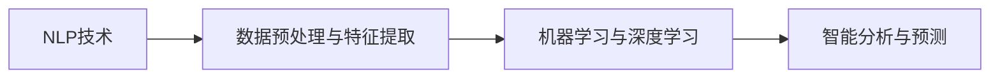

                 

# 智能文本分析在市场研究中的应用

## 1. 背景介绍

在数字化转型日益加速的今天，市场研究已不再是简单的数据收集与分析，而是转向更加深入、智能的洞察发现。智能文本分析作为人工智能技术的最新应用，为市场研究注入了新的活力。本文将详细探讨智能文本分析的核心概念与技术原理，并通过具体项目实践，展示其在市场研究中的应用潜力。

## 2. 核心概念与联系

### 2.1 核心概念概述

智能文本分析，简而言之，是通过自然语言处理(Natural Language Processing, NLP)技术和机器学习算法，对文本数据进行深入的挖掘和分析，以获得有价值的市场洞察和预测。这一过程包括文本预处理、特征提取、模型训练与评估等多个环节，旨在从海量文本数据中提取出有意义的信息，用于市场策略制定、竞争对手分析、消费者行为预测等。

智能文本分析的三个核心概念分别是：

1. **自然语言处理(NLP)**：研究如何让计算机理解、处理、生成自然语言。NLP技术主要包括文本预处理（分词、去停用词、词性标注等）、语义分析（实体识别、情感分析、主题建模等）和文本生成（自动摘要、文本分类、机器翻译等）。

2. **机器学习与深度学习**：通过训练模型从数据中学习规律，并应用于新的数据中。在智能文本分析中，常见的机器学习算法包括支持向量机(Support Vector Machine, SVM)、随机森林(Random Forest)、梯度提升树(Gradient Boosting Tree)等，而深度学习则广泛应用于卷积神经网络(Convolutional Neural Network, CNN)、循环神经网络(Recurrent Neural Network, RNN)、Transformer等架构。

3. **智能分析与预测**：基于以上技术和算法，对文本数据进行深入分析，提取有价值的信息，并结合市场背景知识，进行预测和决策。例如，通过分析消费者评论和社交媒体帖子，可以预测市场需求和趋势，制定产品策略等。

### 2.2 核心概念的联系

这三个核心概念紧密联系，共同构成了智能文本分析的完整技术体系。

- **NLP技术与机器学习**：NLP技术提供数据预处理和特征提取的能力，而机器学习算法则负责从这些特征中学习规律，进行预测和分类。

- **机器学习与智能分析**：机器学习模型训练出预测模型后，智能分析进一步利用这些模型进行深入的业务洞察和决策支持。

- **智能分析与预测**：在市场研究中，智能分析不仅限于数据处理和模型训练，还需结合市场领域知识，将分析结果转化为实际的商业预测和决策支持。

以下是一个简单的Mermaid流程图，展示了这三个概念之间的关系：



## 3. 核心算法原理 & 具体操作步骤

### 3.1 算法原理概述

智能文本分析的核心算法原理，主要涉及自然语言处理中的文本表示、特征提取和分类算法，以及机器学习中的监督学习和无监督学习。

1. **文本表示**：将文本转化为计算机可处理的向量形式，是文本分析的第一步。常用的方法包括词袋模型(Bag of Words, BOW)、TF-IDF、词嵌入(Word Embedding)等。

2. **特征提取**：从文本向量中提取最有信息量的特征，是构建模型的关键。常用的特征提取方法包括n-gram、词向量、主题模型(Latent Dirichlet Allocation, LDA)等。

3. **分类算法**：根据文本特征和分类标签，训练出分类模型。常用的分类算法包括逻辑回归(Logistic Regression)、支持向量机(SVM)、随机森林(Random Forest)等。

### 3.2 算法步骤详解

智能文本分析的主要步骤包括数据收集、文本预处理、特征提取、模型训练与评估、结果解释与应用等。

1. **数据收集**：收集市场研究相关的文本数据，如消费者评论、社交媒体帖子、新闻报道、市场调研报告等。

2. **文本预处理**：对收集到的文本数据进行预处理，包括去除停用词、词干提取、分词、词性标注等，以提高后续处理的效率和准确性。

3. **特征提取**：根据具体任务需求，选择合适的特征提取方法，如TF-IDF、词嵌入、主题模型等。

4. **模型训练与评估**：选择合适的分类算法，利用预处理后的文本数据进行模型训练。常用的算法包括SVM、随机森林、梯度提升树等。在训练过程中，需要使用验证集对模型进行调参和评估。

5. **结果解释与应用**：对模型预测结果进行解释，结合市场背景知识，进行业务洞察和决策支持。例如，分析消费者评论中的情感倾向，预测市场趋势；分析新闻报道中的关键词，识别行业热点等。

### 3.3 算法优缺点

智能文本分析的优点包括：

1. **高效性**：能够处理大规模文本数据，实现实时分析。

2. **自动化**：自动化处理文本数据，节省人力成本。

3. **精确性**：通过算法优化和模型训练，能够获得高精度的分析结果。

4. **多维度分析**：结合NLP技术，可以进行情感分析、主题分析、关键词提取等多种分析维度。

5. **动态更新**：模型可以动态更新，及时反映市场变化。

其缺点包括：

1. **数据依赖**：分析结果依赖于数据的质量和量，数据偏差可能导致分析结果偏差。

2. **模型复杂性**：模型构建和调参过程较为复杂，需要专业知识。

3. **解释性差**：某些深度学习模型（如RNN、Transformer）较难解释，缺乏透明度。

4. **领域依赖**：不同的行业领域需要定制化模型，通用模型效果可能不佳。

### 3.4 算法应用领域

智能文本分析在多个领域都有广泛应用，如市场研究、客户反馈分析、舆情监测、广告效果评估等。以下以市场研究为例，展示其在具体场景中的应用。

## 4. 数学模型和公式 & 详细讲解 & 举例说明

### 4.1 数学模型构建

在智能文本分析中，常用的数学模型包括词袋模型、TF-IDF模型和基于深度学习的词嵌入模型。

1. **词袋模型**：将文本看作一个词的无序集合，忽略词序，计算词频。模型的数学表示为：

   $$
   \mathbf{X} = [x_1, x_2, ..., x_n]
   $$

   其中 $x_i$ 表示文本中第 $i$ 个词的频率。

2. **TF-IDF模型**：通过词频-逆文档频率(Term Frequency-Inverse Document Frequency, TF-IDF)，衡量词在文本中的重要程度。TF-IDF模型的数学表示为：

   $$
   \mathbf{X} = \text{diag}(tf_1, tf_2, ..., tf_n) \times \mathbf{D}^{-1}
   $$

   其中 $\mathbf{D}$ 为文档频率矩阵，$tf_i$ 为文本中第 $i$ 个词的词频。

3. **词嵌入模型**：通过神经网络学习词的向量表示，常用的有Word2Vec、GloVe等。

### 4.2 公式推导过程

以词袋模型为例，假设文本数据集为 $\{\mathbf{x}_i\}_{i=1}^N$，其中 $\mathbf{x}_i$ 表示第 $i$ 个文本的词频向量。模型训练的目标是最小化交叉熵损失函数：

$$
\mathcal{L} = -\frac{1}{N} \sum_{i=1}^N \sum_{j=1}^{|\mathbf{x}_i|} \log \sigma(y_j \cdot \mathbf{W} \mathbf{x}_i + b)
$$

其中 $y_j$ 表示文本中第 $j$ 个词的标签，$\sigma$ 为激活函数（如sigmoid），$\mathbf{W}$ 和 $b$ 为模型的参数。

### 4.3 案例分析与讲解

假设我们需要对一组消费者评论进行情感分析，以预测产品满意度。我们可以采用词袋模型进行特征提取，选择随机森林作为分类算法进行模型训练。

1. **数据预处理**：去除停用词、分词、词干提取等。

2. **特征提取**：计算每个词在评论中的出现频率，构成词频向量。

3. **模型训练**：将词频向量作为输入，产品满意度作为标签，利用随机森林进行模型训练。

4. **结果评估**：在验证集上评估模型性能，调整参数，最终在测试集上得到情感分类准确率。

## 5. 项目实践：代码实例和详细解释说明

### 5.1 开发环境搭建

智能文本分析的开发环境搭建相对简单，主要依赖Python及其生态系统。

1. 安装Python：

   ```
   conda install python=3.8
   ```

2. 安装相关库：

   ```
   pip install nltk
   pip install scikit-learn
   pip install gensim
   pip install tensorflow
   ```

3. 创建虚拟环境：

   ```
   conda create --name nlp-environment python=3.8
   conda activate nlp-environment
   ```

### 5.2 源代码详细实现

以下是一个简单的Python代码示例，用于训练词袋模型进行情感分析：

```python
from sklearn.feature_extraction.text import CountVectorizer
from sklearn.ensemble import RandomForestClassifier
from sklearn.model_selection import train_test_split

# 文本数据
data = ['产品A使用体验很好', '产品B质量很差', '产品C性价比高', '产品D售后服务差']

# 标签
labels = ['positive', 'negative', 'positive', 'negative']

# 特征提取
vectorizer = CountVectorizer()
X = vectorizer.fit_transform(data)

# 模型训练
clf = RandomForestClassifier(n_estimators=100)
X_train, X_test, y_train, y_test = train_test_split(X, labels, test_size=0.2, random_state=42)
clf.fit(X_train, y_train)

# 模型评估
print('模型准确率：', clf.score(X_test, y_test))
```

### 5.3 代码解读与分析

上述代码展示了文本预处理、特征提取、模型训练和评估的全过程。

- **文本预处理**：使用CountVectorizer进行词频向量提取，将文本转换为矩阵形式。

- **特征提取**：将文本转换为数值特征，作为模型的输入。

- **模型训练**：使用RandomForestClassifier进行模型训练，设置100棵树。

- **模型评估**：在测试集上评估模型准确率。

### 5.4 运行结果展示

假设上述代码在测试集上的准确率为80%，则可以认为模型具有一定程度的预测能力，但需要进一步优化以提高精度。

## 6. 实际应用场景

智能文本分析在市场研究中的应用场景非常广泛，以下列举几个典型案例：

### 6.1 竞争对手分析

通过对竞争对手的社交媒体和新闻报道进行情感分析，可以了解竞争对手的市场表现和消费者对其的态度。例如，分析亚马逊与阿里巴巴的市场竞争，通过社交媒体评论可以发现消费者对各自品牌的情感倾向，进而制定针对性策略。

### 6.2 消费者行为预测

通过分析消费者评论和在线购物反馈，可以预测消费者对不同产品的偏好和购买意愿。例如，分析电子产品市场的消费者评论，可以预测未来流行产品的特性和价格趋势。

### 6.3 市场营销效果评估

通过分析广告投放后的社交媒体反应和用户反馈，可以评估广告效果。例如，分析某品牌新产品的广告宣传效果，通过社交媒体上的品牌提及量和情感分析，评估广告的传播效果和品牌形象提升。

## 7. 工具和资源推荐

### 7.1 学习资源推荐

1. **《自然语言处理综论》**：由斯坦福大学教授Dan Jurafsky和James H. Martin合著，全面介绍了自然语言处理的理论和实践。

2. **《Python自然语言处理》**：由Jurafsky和Martin合著，使用Python实现自然语言处理算法，适合动手实践。

3. **NLTK网站**：自然语言工具包(Natural Language Toolkit, NLTK)，提供丰富的NLP工具和教程。

4. **Kaggle**：数据科学竞赛平台，提供大量市场研究相关的数据集和比赛，适合实战练习。

### 7.2 开发工具推荐

1. **Jupyter Notebook**：用于数据处理和模型训练的交互式环境，适合初学者和高级用户。

2. **TensorBoard**：用于可视化模型训练过程，展示损失函数、精度等指标的变化趋势。

3. **Weka**：开源数据挖掘工具，提供了丰富的机器学习算法和可视化界面。

4. **PyTorch**：深度学习框架，支持动态计算图，适合研究和原型开发。

### 7.3 相关论文推荐

1. **"Towards a General Theory of Machine Translation"**：由NVIDIA的Wojciech Zaremba等人发表，提出Transformer架构，彻底改变了自然语言处理的范式。

2. **"Bert: Pre-training of Deep Bidirectional Transformers for Language Understanding"**：由Google的研究团队发表，提出BERT模型，是当前最先进的预训练语言模型之一。

3. **"Attention is All You Need"**：由Google的Attention is All You Need研究团队发表，提出Transformer架构，开启了大模型时代。

4. **"GloVe: Global Vectors for Word Representation"**：由Stanford大学的研究团队发表，提出GloVe词嵌入模型，是经典词向量表示方法之一。

## 8. 总结：未来发展趋势与挑战

### 8.1 研究成果总结

智能文本分析在市场研究中的应用取得了显著进展，通过文本挖掘和机器学习技术，能够从海量数据中提取有价值的信息，为市场决策提供支持。其主要研究成果包括：

1. 提出并实现了多种文本表示和特征提取方法，如词袋模型、TF-IDF、词嵌入等。

2. 研究和实现了多种机器学习算法，如SVM、随机森林、梯度提升树等。

3. 在多个市场研究应用场景中取得了显著效果，如竞争对手分析、消费者行为预测、市场营销效果评估等。

### 8.2 未来发展趋势

未来，智能文本分析将呈现以下发展趋势：

1. **多模态融合**：结合文本、图像、视频等多种数据源，进行多模态分析，提升市场洞察的全面性。

2. **深度学习算法**：利用Transformer、BERT等深度学习模型，提高分析精度和自动化水平。

3. **实时分析**：利用流式数据处理和在线学习算法，实现实时市场分析和预测。

4. **个性化分析**：结合用户画像和行为数据，进行个性化市场分析和推荐。

5. **跨领域应用**：将智能文本分析应用于更多行业领域，如金融、医疗、教育等。

### 8.3 面临的挑战

智能文本分析在市场研究中的应用仍面临以下挑战：

1. **数据质量**：数据采集和预处理成本高，数据质量难以保证。

2. **模型复杂性**：模型构建和调参过程复杂，需要专业知识。

3. **解释性不足**：深度学习模型的黑盒特性，导致结果难以解释。

4. **跨领域应用难度**：不同行业领域的数据结构和背景知识不同，通用模型效果可能不佳。

5. **隐私和安全**：市场研究涉及大量用户数据，隐私保护和安全问题需要特别关注。

### 8.4 研究展望

为应对这些挑战，未来的研究需关注以下几个方面：

1. **数据采集和预处理自动化**：开发自动化数据清洗和预处理工具，降低数据采集和预处理成本。

2. **可解释性增强**：引入可解释性技术，提高模型的透明性和可解释性。

3. **跨领域模型适应性**：针对不同行业领域定制化模型，提高模型适应性。

4. **隐私保护和安全**：制定数据隐私保护和安全策略，确保用户数据的安全和隐私。

总之，智能文本分析在市场研究中的应用前景广阔，但需在技术和应用方面不断突破和创新，才能真正发挥其潜力，推动市场研究的智能化发展。

## 9. 附录：常见问题与解答

**Q1：智能文本分析的局限性是什么？**

A: 智能文本分析的局限性主要体现在数据依赖、模型复杂性、解释性差等方面。具体来说：

1. **数据依赖**：分析结果依赖于数据的质量和量，数据偏差可能导致分析结果偏差。

2. **模型复杂性**：模型构建和调参过程较为复杂，需要专业知识。

3. **解释性差**：某些深度学习模型（如RNN、Transformer）较难解释，缺乏透明度。

**Q2：如何提高智能文本分析的准确率？**

A: 提高智能文本分析的准确率需要从数据、模型和算法三个方面进行优化：

1. **数据方面**：确保数据质量和量，避免数据偏差。可以使用数据增强技术，扩充训练集。

2. **模型方面**：选择适当的特征提取方法和模型算法。可以使用集成学习方法，如Bagging、Boosting等，提高模型泛化能力。

3. **算法方面**：优化模型超参数，进行交叉验证。可以使用正则化技术，如L2正则、Dropout等，防止过拟合。

**Q3：智能文本分析在市场研究中的应用有哪些？**

A: 智能文本分析在市场研究中的应用包括：

1. **竞争对手分析**：分析竞争对手的社交媒体和新闻报道，了解其市场表现和消费者态度。

2. **消费者行为预测**：分析消费者评论和在线购物反馈，预测消费者对不同产品的偏好和购买意愿。

3. **市场营销效果评估**：分析广告投放后的社交媒体反应和用户反馈，评估广告效果。

4. **舆情监测**：分析社交媒体上的品牌提及量和情感倾向，监测市场舆情。

总之，智能文本分析在市场研究中的应用非常广泛，能够提供有价值的市场洞察和预测。

**Q4：智能文本分析如何结合大数据技术？**

A: 智能文本分析可以结合大数据技术，实现以下目标：

1. **数据采集和预处理自动化**：使用大数据技术自动采集和预处理海量文本数据，提高效率和准确性。

2. **实时分析**：利用流式数据处理和大数据平台，实现实时市场分析和预测。

3. **跨领域分析**：结合不同数据源和领域知识，进行跨领域市场分析。

4. **个性化分析**：利用大数据技术分析用户行为和偏好，进行个性化市场分析和推荐。

5. **隐私保护和安全**：使用大数据技术进行数据去标识和匿名化，保护用户隐私和数据安全。

通过结合大数据技术，智能文本分析可以更好地处理大规模数据，提供更全面、实时的市场洞察和预测。

---

作者：禅与计算机程序设计艺术 / Zen and the Art of Computer Programming

