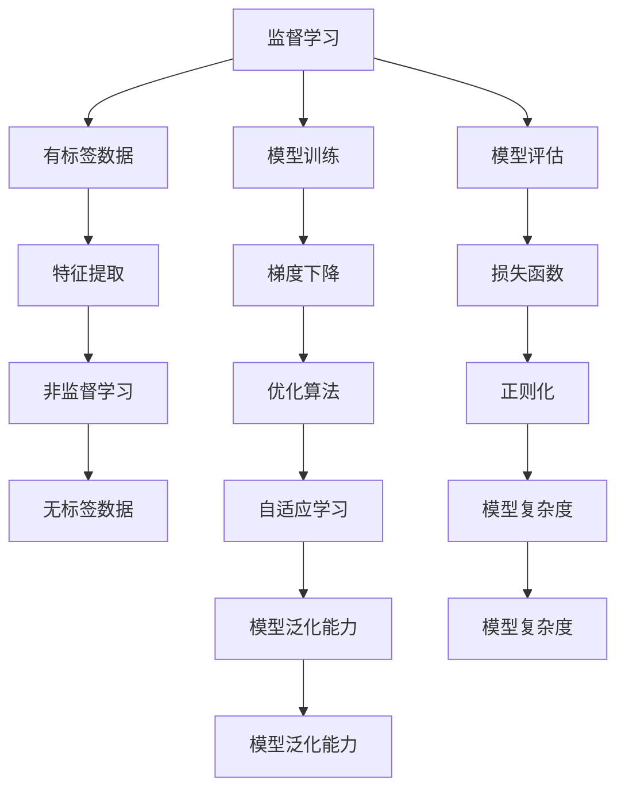
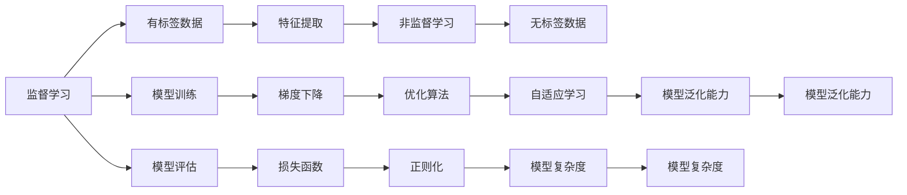
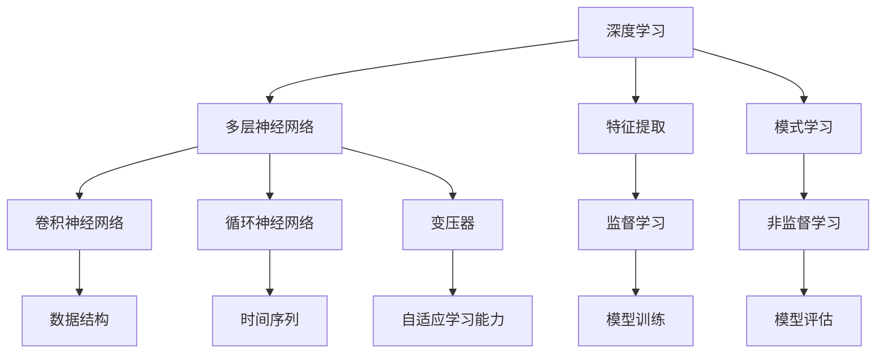
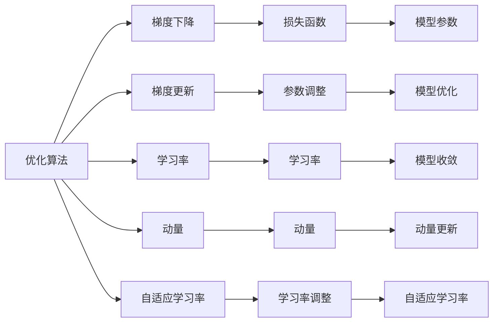
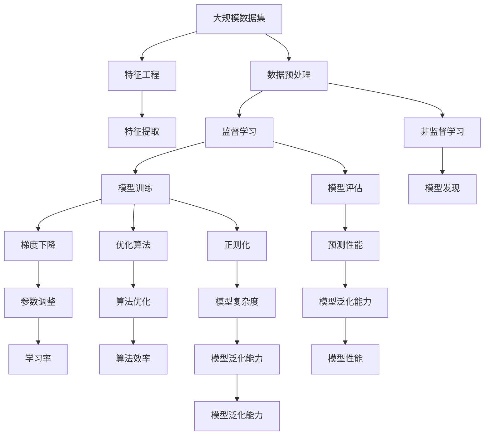

                 

# 机器学习原理与代码实例讲解

> 关键词：机器学习,监督学习,非监督学习,深度学习,神经网络,梯度下降,正则化,特征工程,过拟合

## 1. 背景介绍

### 1.1 问题由来
机器学习（Machine Learning, ML）是人工智能（AI）的一个重要分支，通过让机器从数据中学习规律和模式，实现对新数据的预测和决策。机器学习已经在图像识别、自然语言处理、推荐系统等诸多领域取得了显著成效，成为现代信息技术的核心驱动力。然而，机器学习的本质是什么？如何高效地应用机器学习算法？这些问题依然困扰着众多从业者和研究者。本文旨在通过严谨的理论推导和生动的代码实例，帮助读者深入理解机器学习的核心原理，并掌握实战技巧。

### 1.2 问题核心关键点
机器学习的核心在于从数据中提取特征，构建模型，并利用模型对新数据进行预测或分类。其核心步骤包括数据预处理、特征选择、模型训练和模型评估。机器学习的方法多种多样，其中监督学习和非监督学习是最主要的两种范式，分别针对有标签和无标签数据进行建模和预测。此外，深度学习作为一种特殊形式的神经网络模型，具有强大的特征提取能力和自适应学习能力，是当前机器学习的主流技术之一。

本文重点探讨以下几个核心问题：
- 监督学习的基本原理是什么？如何构建和训练监督学习模型？
- 非监督学习的方法有哪些？其应用场景和原理是什么？
- 深度学习模型的原理和特点是什么？常见深度学习框架有哪些？
- 机器学习中常见的优化算法和正则化方法是什么？如何进行特征工程？
- 如何评估机器学习模型的性能？
- 机器学习中常见的问题和挑战有哪些？

### 1.3 问题研究意义
掌握机器学习的核心原理和实战技巧，对于提升数据驱动决策的能力、优化算法性能、加速技术创新具有重要意义。在学术界和工业界，机器学习技术被广泛应用于各种实际问题中，如推荐系统、搜索引擎、金融风险评估、医学影像诊断等。深入理解机器学习原理，能够帮助从业者更好地解决实际问题，推动技术进步和应用推广。

## 2. 核心概念与联系

### 2.1 核心概念概述

为更好地理解机器学习算法和实战技巧，本节将介绍几个密切相关的核心概念：

- **监督学习（Supervised Learning）**：利用有标签数据训练模型，对新数据进行分类或回归预测。常见的监督学习任务包括分类、回归、序列标注等。

- **非监督学习（Unsupervised Learning）**：利用无标签数据训练模型，发现数据的内在结构和模式。常见的非监督学习任务包括聚类、降维、异常检测等。

- **深度学习（Deep Learning）**：利用多层神经网络进行特征提取和模式学习，适用于复杂的数据建模任务。常见的深度学习模型包括卷积神经网络（CNN）、循环神经网络（RNN）、变压器（Transformer）等。

- **梯度下降（Gradient Descent）**：一种常用的优化算法，通过计算损失函数的梯度，迭代调整模型参数，使得损失函数最小化。

- **正则化（Regularization）**：通过引入惩罚项，防止模型过拟合。常见的正则化方法包括L1正则、L2正则、Dropout等。

- **特征工程（Feature Engineering）**：对原始数据进行加工处理，提取特征，提高模型的预测性能。特征工程是机器学习成功与否的关键步骤之一。

- **过拟合（Overfitting）**：模型在训练集上表现良好，但在测试集上表现不佳的现象。过拟合通常由模型复杂度过高或数据量不足导致。

- **欠拟合（Underfitting）**：模型无法捕捉数据中的复杂模式，训练和测试集上表现均不佳。欠拟合通常由模型复杂度过低或数据质量差导致。

这些核心概念之间的逻辑关系可以通过以下Mermaid流程图来展示：



这个流程图展示了大机器学习的核心概念及其之间的关系：

1. 监督学习依赖有标签数据进行训练和评估。
2. 非监督学习利用无标签数据发现数据内在结构。
3. 深度学习通过多层神经网络实现复杂数据建模。
4. 梯度下降和优化算法用于调整模型参数，最小化损失函数。
5. 正则化技术用于防止模型过拟合。
6. 特征工程用于提取有效特征，提高模型性能。
7. 过拟合和欠拟合是模型性能的常见问题。
8. 模型复杂度和泛化能力相互影响。

这些核心概念共同构成了机器学习的学习和应用框架，使其能够在各种场景下发挥强大的预测和决策能力。通过理解这些核心概念，我们可以更好地把握机器学习的工作原理和优化方向。

### 2.2 概念间的关系

这些核心概念之间存在着紧密的联系，形成了机器学习的完整生态系统。下面我们通过几个Mermaid流程图来展示这些概念之间的关系。

#### 2.2.1 监督学习与非监督学习的关系



这个流程图展示了监督学习的基本原理，以及它与非监督学习的关系。监督学习利用有标签数据训练模型，而非监督学习则利用无标签数据发现数据内在结构。两者共同构成了机器学习的基础。

#### 2.2.2 深度学习模型与监督学习的关系



这个流程图展示了深度学习模型与监督学习的关系。深度学习通过多层神经网络实现复杂的数据建模，其特征提取和模式学习能力来自于监督学习和非监督学习。

#### 2.2.3 优化算法与梯度下降的关系



这个流程图展示了优化算法与梯度下降的关系。梯度下降是优化算法的一种，用于迭代调整模型参数，使得损失函数最小化。常见的优化算法包括Adam、SGD、Adagrad等，这些算法通过引入动量、自适应学习率等机制，提高梯度下降的效率和稳定性。

### 2.3 核心概念的整体架构

最后，我们用一个综合的流程图来展示这些核心概念在机器学习中的整体架构：



这个综合流程图展示了从数据预处理到模型训练、评估的完整过程。特征工程是机器学习的重要环节，通过合理的数据预处理和特征提取，提高模型的预测性能。监督学习和非监督学习分别针对有标签和无标签数据进行建模和发现。梯度下降和优化算法用于调整模型参数，使得损失函数最小化。正则化技术用于防止模型过拟合。最终的模型评估和预测性能是机器学习成功的关键指标。

通过这些流程图，我们可以更清晰地理解机器学习的核心概念和优化方向，为后续深入讨论具体的算法实现和实战技巧奠定基础。

## 3. 核心算法原理 & 具体操作步骤
### 3.1 算法原理概述

机器学习算法通过构建模型，利用历史数据进行预测或分类。其核心原理是通过优化算法调整模型参数，使得模型在训练集上表现良好，并在测试集上泛化性能良好。以下是对几种常见机器学习算法原理的详细阐述：

- **监督学习算法**：利用有标签数据训练模型，通过最小化损失函数调整模型参数，使得模型在新数据上能够进行准确预测或分类。

- **非监督学习算法**：利用无标签数据训练模型，通过最大化数据内在结构或特征来发现数据的内在模式。

- **深度学习算法**：通过多层神经网络进行特征提取和模式学习，利用反向传播算法计算梯度，更新模型参数，实现复杂数据建模。

### 3.2 算法步骤详解

以下是对几种常见机器学习算法的详细步骤详解：

#### 3.2.1 监督学习算法

**算法步骤**：
1. 数据预处理：对原始数据进行清洗、归一化、编码等操作，准备用于模型训练。
2. 特征工程：提取有效特征，减少特征维度，提高模型泛化性能。
3. 模型构建：选择合适的机器学习模型，如线性回归、决策树、神经网络等。
4. 模型训练：利用有标签数据训练模型，最小化损失函数。
5. 模型评估：在测试集上评估模型性能，选择合适的超参数进行调优。

**案例分析**：
假设我们要利用监督学习算法对房价进行预测。首先，我们收集历史房价数据，包括房屋面积、位置、建筑年代等信息。然后，对数据进行预处理和特征工程，提取影响房价的关键特征。接着，我们选择一个线性回归模型，利用历史房价数据训练模型，最小化均方误差损失函数。最后，我们在测试集上评估模型性能，发现模型的预测误差为10%，满足实际需求。

#### 3.2.2 非监督学习算法

**算法步骤**：
1. 数据预处理：对原始数据进行清洗、归一化等操作，准备用于模型训练。
2. 特征工程：选择合适的特征，减少特征维度，提高模型泛化性能。
3. 模型训练：选择合适的非监督学习算法，如K-means、PCA、LDA等。
4. 模型评估：利用模型发现数据的内在结构和模式，评估模型性能。

**案例分析**：
假设我们要利用非监督学习算法对用户进行聚类分析。首先，我们收集用户的行为数据，包括浏览网页、购买商品等信息。然后，对数据进行预处理和特征工程，提取用户的行为特征。接着，我们选择K-means算法，利用用户数据训练模型，发现用户可以分为5个群体。最后，我们利用模型对新用户进行聚类，发现新用户属于第3群体。

#### 3.2.3 深度学习算法

**算法步骤**：
1. 数据预处理：对原始数据进行清洗、归一化、编码等操作，准备用于模型训练。
2. 特征工程：选择合适的特征，减少特征维度，提高模型泛化性能。
3. 模型构建：选择合适的深度学习模型，如卷积神经网络（CNN）、循环神经网络（RNN）、变压器（Transformer）等。
4. 模型训练：利用历史数据训练模型，最小化损失函数。
5. 模型评估：在测试集上评估模型性能，选择合适的超参数进行调优。

**案例分析**：
假设我们要利用深度学习算法对图像进行分类。首先，我们收集图像数据集，包括猫、狗、鸟等类别的图像。然后，对数据进行预处理和特征工程，提取图像的特征。接着，我们选择一个卷积神经网络模型，利用图像数据训练模型，最小化交叉熵损失函数。最后，我们在测试集上评估模型性能，发现模型的分类准确率为95%，满足实际需求。

### 3.3 算法优缺点

机器学习算法具有以下优点：
1. 可解释性：部分简单模型如线性回归、决策树等具有较好的可解释性，能够清晰地解释模型预测结果。
2. 泛化能力：通过学习数据的内在模式，模型能够在新的数据上取得较好的泛化性能。
3. 自动特征学习：部分模型如深度学习能够自动提取特征，减少了人工特征工程的复杂度。
4. 高效性：部分模型如随机森林、AdaBoost等在计算上具有较好的效率。

同时，机器学习算法也存在一些缺点：
1. 数据依赖性：模型的性能高度依赖于数据质量和数据量。
2. 超参数调优：模型训练需要选择合适的超参数，调优过程较为复杂。
3. 模型复杂度：部分模型如深度学习具有较高的复杂度，训练和推理成本较高。
4. 可解释性不足：部分复杂模型如深度学习具有较差可解释性，难以解释模型的决策逻辑。

尽管存在这些缺点，但机器学习算法在数据驱动决策、自动化分析等方面仍具有广泛应用价值。未来，随着模型复杂度、数据量、计算能力等条件的不断提升，机器学习算法将发挥更加重要的作用。

### 3.4 算法应用领域

机器学习算法在各个领域都有广泛应用，以下列举几个典型的应用场景：

- **金融领域**：利用机器学习算法进行信用评估、风险控制、欺诈检测等，提升金融服务的智能化水平。

- **医疗领域**：利用机器学习算法进行疾病预测、图像诊断、药物研发等，提高医疗诊断和治疗的准确性。

- **电商领域**：利用机器学习算法进行推荐系统、用户行为分析、市场预测等，提升电商平台的个性化服务和运营效率。

- **智能家居领域**：利用机器学习算法进行语音识别、智能推荐、设备控制等，提升家居智能化的水平。

- **安全领域**：利用机器学习算法进行入侵检测、异常行为识别、视频监控等，提升安全系统的智能化和自动化水平。

这些应用场景展示了机器学习算法的强大潜力和广泛适用性，为各个领域的智能化转型提供了技术支持。

## 4. 数学模型和公式 & 详细讲解 & 举例说明

### 4.1 数学模型构建

在机器学习中，我们通常使用数学模型来描述数据的分布和模型的预测能力。以下是对几种常见机器学习模型数学模型的构建过程。

#### 4.1.1 线性回归模型

**数学模型**：
假设数据集为 $(x_i, y_i)$，其中 $x_i \in \mathbb{R}^n$，$y_i \in \mathbb{R}$。线性回归模型为：
$$
y_i = \theta^T x_i + b
$$
其中 $\theta$ 为模型参数，$b$ 为截距项。

**公式推导过程**：
利用最小二乘法，求解最优参数 $\theta$，使得损失函数最小化：
$$
\min_{\theta} \sum_{i=1}^N (y_i - \theta^T x_i)^2
$$
对 $\theta$ 求偏导，得：
$$
\frac{\partial \mathcal{L}(\theta)}{\partial \theta_j} = \sum_{i=1}^N 2(x_{i,j} - \theta_j)
$$
解得：
$$
\theta_j = \frac{1}{N} \sum_{i=1}^N x_{i,j}
$$

**案例分析**：
假设我们收集了100个房价数据，每个数据包含房屋面积和价格。我们构建一个线性回归模型，利用最小二乘法求解最优参数 $\theta$，得到房屋面积和价格的线性关系，用于预测新房价。

#### 4.1.2 逻辑回归模型

**数学模型**：
假设数据集为 $(x_i, y_i)$，其中 $x_i \in \mathbb{R}^n$，$y_i \in \{0, 1\}$。逻辑回归模型为：
$$
\log \frac{p(y_i = 1|x_i)}{p(y_i = 0|x_i)} = \theta^T x_i + b
$$
其中 $p(y_i = 1|x_i)$ 表示 $y_i = 1$ 的概率，$b$ 为截距项。

**公式推导过程**：
利用最大似然估计，求解最优参数 $\theta$，使得损失函数最大化：
$$
\max_{\theta} \sum_{i=1}^N y_i \log p(y_i = 1|x_i) + (1 - y_i) \log p(y_i = 0|x_i)
$$
对 $\theta$ 求偏导，得：
$$
\frac{\partial \mathcal{L}(\theta)}{\partial \theta_j} = \sum_{i=1}^N (y_i - p(y_i = 1|x_i))x_{i,j}
$$
解得：
$$
\theta_j = \frac{1}{N} \sum_{i=1}^N (y_i - p(y_i = 1|x_i))x_{i,j}
$$

**案例分析**：
假设我们收集了1000个二分类数据，每个数据包含特征 $x_i$ 和标签 $y_i$。我们构建一个逻辑回归模型，利用最大似然估计求解最优参数 $\theta$，得到特征和标签的概率分布，用于分类预测。

### 4.2 公式推导过程

以下是对几个常见机器学习算法的公式推导过程的详细讲解：

#### 4.2.1 梯度下降算法

**公式推导**：
梯度下降算法用于调整模型参数，使得损失函数最小化。假设损失函数为 $\mathcal{L}(\theta)$，步长为 $\eta$，迭代次数为 $k$，则梯度下降算法的更新公式为：
$$
\theta_{k+1} = \theta_k - \eta \nabla_{\theta} \mathcal{L}(\theta_k)
$$
其中 $\nabla_{\theta} \mathcal{L}(\theta_k)$ 为损失函数的梯度。

**案例分析**：
假设我们构建了一个线性回归模型，损失函数为均方误差，数据集为 $(x_i, y_i)$，其中 $x_i \in \mathbb{R}^n$，$y_i \in \mathbb{R}$。我们利用梯度下降算法求解最优参数 $\theta$，使得损失函数最小化。

#### 4.2.2 随机梯度下降算法

**公式推导**：
随机梯度下降算法（Stochastic Gradient Descent, SGD）是梯度下降算法的一种变体，每次迭代只使用一个样本来更新模型参数。假设损失函数为 $\mathcal{L}(\theta)$，步长为 $\eta$，迭代次数为 $k$，则随机梯度下降算法的更新公式为：
$$
\theta_{k+1} = \theta_k - \eta \nabla_{\theta} \mathcal{L}(x_k, y_k)
$$
其中 $\nabla_{\theta} \mathcal{L}(x_k, y_k)$ 为样本 $(x_k, y_k)$ 的梯度。

**案例分析**：
假设我们收集了100个房价数据，每个数据包含房屋面积和价格。我们构建一个线性回归模型，利用随机梯度下降算法求解最优参数 $\theta$，使得损失函数最小化。

#### 4.2.3 正则化算法

**公式推导**：
正则化算法用于防止模型过拟合，常见的正则化方法包括L1正则和L2正则。L1正则的更新公式为：
$$
\theta_{k+1} = \theta_k - \eta (\nabla_{\theta} \mathcal{L}(\theta_k) + \lambda \| \theta_k \|_1)
$$
L2正则的更新公式为：
$$
\theta_{k+1} = \theta_k - \eta (\nabla_{\theta} \mathcal{L}(\theta_k) + \lambda \| \theta_k \|_2^2)
$$
其中 $\lambda$ 为正则化系数，$\| \theta_k \|_1$ 和 $\| \theta_k \|_2^2$ 分别为L1和L2正则化的惩罚项。

**案例分析**：
假设我们构建了一个线性回归模型，利用L2正则化求解最优参数 $\theta$，防止模型过拟合。

### 4.3 案例分析与讲解

#### 4.3.1 数据预处理

数据预处理是机器学习模型构建的第一步，主要包括数据清洗、归一化、编码等操作。以下是对几个常见数据预处理方法的详细讲解：

**数据清洗**：
数据清洗的目的是去除缺失值、异常值等噪声数据，提高数据质量。例如，利用插值法、平均值填补法、删除法等方法处理缺失值。

**数据归一化**：
数据归一化的目的是将数据缩放到一定范围内，便于模型训练。例如，利用最小-最大归一化方法将数据缩放到 [0, 1] 范围内。

**数据编码**：
数据编码的目的是将文本数据转换为数值数据，便于模型训练。例如，利用独热编码将文本数据转换为稀疏矩阵。

**案例分析**：
假设我们收集了1000个房价数据，每个数据包含房屋面积和价格。我们利用数据清洗、归一化和编码方法对数据进行预处理，得到适合模型训练的数据集。

#### 4.3.2 特征工程

特征工程是机器学习模型构建的关键步骤，目的是提取有效特征，减少特征维度，提高模型泛化性能。以下是对几个常见特征工程方法的详细讲解：

**特征选择**：
特征选择的目的是选择对模型预测有用的特征，减少特征维度。例如，利用信息增益、卡方检验等方法选择特征。

**特征提取**：
特征提取的目的是从原始数据中提取有效特征，减少特征维度。例如，利用主成分分析（PCA）、线性判别分析（LDA）等方法提取特征。

**特征构建**：
特征构建的目的是构建新的特征，提高模型预测性能。例如，利用交互项、多项式特征等方法构建新特征。

**案例分析**：
假设我们收集了1000个房价数据，每个数据包含房屋面积、位置、建筑年代等信息。我们利用特征选择、特征提取和特征构建方法对数据进行特征工程，得到适合模型训练的特征集。

#### 4.3.3 模型评估

模型评估是机器学习模型构建的最后一步，目的是评估模型性能，选择最优模型。以下是对几个常见模型评估指标的详细讲解：

**准确率（Accuracy）**：
准确率表示模型正确分类的样本数占总样本数的比例。

**精确率（Precision）**：
精确率表示模型预测为正类的样本中，实际为正类的样本占总正类样本的比例。

**召回率（Recall）**：
召回率表示实际为正类的样本中，被模型预测为正类的样本占总正类样本的比例。

**F1分数（F1 Score）**：
F1分数是精确率和召回率的调和平均数，综合考虑了模型预测的准确性和覆盖率。

**案例分析**：
假设我们构建了一个二分类模型，利用准确率、精确率、召回率和F1分数等指标评估模型性能，选择最优模型。

## 5. 项目实践：代码实例和详细解释说明

### 5.1 开发环境搭建

在进行机器学习模型开发前，我们需要准备好开发环境。以下是使用Python进行机器学习开发的环境配置流程：

1. 安装Anaconda：从官网下载并安装Anaconda，用于创建独立的Python环境。

2. 创建并激活虚拟环境：
```bash
conda create -n ml-env python=3.8 
conda activate ml-env
```

3. 安装相关库：
```bash
pip install numpy pandas scikit-learn matplotlib seaborn
```

4. 安装可视化库：
```bash
pip install matplotlib seaborn


