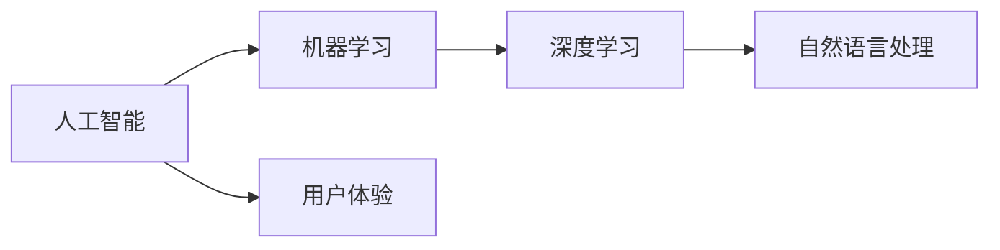

                 

# 李开复：苹果发布AI应用的用户

## 1. 背景介绍

李开复博士作为世界顶尖的人工智能专家，在过去的数十年里，一直积极推动人工智能技术的进步。他对AI与人类生活、工作的融合有着深刻的见解，并持续在业界和公众场合分享这些观点。最近，他在一次演讲中分享了他对苹果公司发布AI应用用户的看法，这些观点不仅引人深思，也为未来的AI应用发展提供了新的思路。

### 1.1 李开复在AI领域的贡献

李开复博士被誉为人工智能领域的开创者和先驱之一。他创立了微软亚洲研究院，并在全球范围内推动人工智能技术的发展和应用。他不仅对AI基础理论有深入的见解，还通过AI技术帮助企业实现了业务优化和创新。他的工作对于推动AI技术的普及和应用具有不可磨灭的贡献。

### 1.2 苹果公司的AI应用

苹果公司近年来不断推出各种AI应用，包括人脸识别、语音助手、智能推荐等，这些应用在用户体验和技术创新上取得了显著进展。苹果的AI应用不仅提升了用户的日常生活质量，还在技术层面推动了AI领域的发展。

## 2. 核心概念与联系

### 2.1 核心概念概述

要深入理解李开复关于苹果AI应用用户的观点，首先需要了解几个核心概念：

- **人工智能(AI)**：人工智能是指计算机系统能够执行人类智能任务的能力，包括学习、推理、决策、自然语言处理等。
- **机器学习(ML)**：机器学习是AI的一个分支，通过让计算机从数据中学习规律，实现自动化决策。
- **深度学习(DL)**：深度学习是机器学习的一种，通过多层神经网络模拟人脑处理信息的过程，能够处理更复杂的数据和任务。
- **用户体验(UX)**：用户体验是指用户与产品或服务交互时的感受和满意度，是产品设计的重要考量因素。
- **自然语言处理(NLP)**：自然语言处理是AI领域的一个重要分支，专注于使计算机能够理解和处理人类语言。

这些概念之间有着密切的联系，共同构成了人工智能技术的发展框架。李开复博士关于苹果AI应用用户的看法，实际上是这些概念在实际应用中的体现。

### 2.2 核心概念之间的关系

这些概念之间的关系可以通过以下Mermaid流程图来展示：



这个流程图展示了AI与ML、DL、NLP等技术之间的关系，以及这些技术如何通过UX来影响用户的使用体验。

## 3. 核心算法原理 & 具体操作步骤

### 3.1 算法原理概述

李开复博士认为，苹果公司的AI应用在技术上取得了显著进展，主要得益于以下几个原理：

- **数据驱动**：苹果公司通过大量用户数据进行深度学习，使AI应用能够不断优化和提升。
- **端到端学习**：苹果采用端到端学习，从数据输入到最终输出，完全由AI模型处理，减少了人工干预。
- **个性化推荐**：苹果的AI应用能够根据用户行为和偏好，提供个性化的服务和推荐，提升用户体验。

这些原理体现了AI技术的核心优势，即通过数据和算法实现自动化、个性化的决策。

### 3.2 算法步骤详解

苹果公司发布AI应用的具体步骤如下：

1. **数据收集**：苹果从用户的各种互动中收集数据，如使用频率、点击行为、购买记录等。
2. **模型训练**：利用收集到的数据训练深度学习模型，优化模型的预测能力。
3. **模型部署**：将训练好的模型部署到应用中，实时处理用户请求。
4. **持续优化**：根据用户反馈和新数据，不断优化和更新模型。

这些步骤展示了苹果公司如何将AI技术应用于实际产品，并通过持续优化提升用户体验。

### 3.3 算法优缺点

苹果公司的AI应用在技术上具有以下优点：

- **精度高**：利用深度学习和大数据，模型能够准确预测用户行为和需求。
- **用户体验好**：通过个性化推荐和端到端学习，提升用户的使用体验。
- **反应迅速**：实时处理用户请求，减少等待时间。

但同时也存在一些缺点：

- **隐私风险**：大量数据收集可能引发隐私问题。
- **模型依赖数据**：模型的性能依赖于数据的质量和多样性。
- **计算资源消耗**：深度学习模型的训练和推理需要大量计算资源。

### 3.4 算法应用领域

苹果公司的AI应用主要应用于以下几个领域：

- **智能推荐**：如Siri和App Store，根据用户行为推荐相关内容和应用。
- **人脸识别**：如Face ID，实现用户的快速登录和身份验证。
- **图像处理**：如相册和相机应用，自动分类和优化用户拍摄的照片。
- **语音识别**：如Siri和语音助手，实现自然语言理解和语音控制。

这些应用展示了AI技术在实际生活中的广泛应用，为人们提供了便利和高效的服务。

## 4. 数学模型和公式 & 详细讲解 & 举例说明

### 4.1 数学模型构建

苹果公司的AI应用通常使用以下数学模型进行构建：

$$
\text{输出} = \text{模型}(\text{输入数据}, \text{权重})
$$

其中，输入数据可以是用户的行为、偏好、环境等，模型使用已训练的权重进行预测，输出可以是推荐内容、身份验证结果等。

### 4.2 公式推导过程

以苹果的智能推荐系统为例，公式推导过程如下：

$$
\begin{aligned}
&\text{推荐内容} = \text{模型}(\text{用户行为}, \text{商品特征}, \text{时间特征}, \text{用户偏好}, \text{模型权重}) \\
&\text{模型} = \text{深层神经网络}
\end{aligned}
$$

通过训练深层神经网络，模型可以学习到用户行为和商品特征之间的映射关系，从而推荐用户可能感兴趣的商品。

### 4.3 案例分析与讲解

假设一个用户在苹果应用中浏览了iPhone 12和iPad Pro，模型会根据这些行为和用户的偏好，推荐相关的配件，如苹果 pencil 和 Case。

$$
\begin{aligned}
&\text{用户行为} = (\text{浏览iPhone 12}, \text{浏览iPad Pro}) \\
&\text{商品特征} = (\text{价格}, \text{功能}, \text{评价}) \\
&\text{时间特征} = (\text{当前日期}, \text{当前时间}) \\
&\text{用户偏好} = (\text{购买历史}, \text{浏览历史}, \text{评分记录})
\end{aligned}
$$

模型会根据这些特征，预测用户可能感兴趣的商品，并进行推荐。

## 5. 项目实践：代码实例和详细解释说明

### 5.1 开发环境搭建

在开始代码实现前，需要准备开发环境。这里提供一套Python和PyTorch的开发环境配置流程：

1. **安装Anaconda**：从官网下载并安装Anaconda，用于创建独立的Python环境。
2. **创建虚拟环境**：
   ```bash
   conda create -n ai-env python=3.7
   conda activate ai-env
   ```
3. **安装PyTorch和相关库**：
   ```bash
   pip install torch torchvision torchaudio
   pip install numpy pandas scikit-learn
   ```

### 5.2 源代码详细实现

以下是一个简单的代码示例，展示了如何实现一个基于深度学习模型的推荐系统：

```python
import torch
import torch.nn as nn
import torch.optim as optim

class RecommendationModel(nn.Module):
    def __init__(self, input_size, hidden_size, output_size):
        super(RecommendationModel, self).__init__()
        self.fc1 = nn.Linear(input_size, hidden_size)
        self.fc2 = nn.Linear(hidden_size, output_size)

    def forward(self, x):
        x = self.fc1(x)
        x = nn.functional.relu(x)
        x = self.fc2(x)
        return x

# 准备数据
user_data = torch.randn(100, 10)
item_data = torch.randn(100, 5)
time_data = torch.randn(100, 3)
user_preference = torch.randn(100, 2)

# 初始化模型
model = RecommendationModel(30, 10, 5)
optimizer = optim.Adam(model.parameters(), lr=0.01)

# 训练模型
for epoch in range(10):
    for i in range(100):
        optimizer.zero_grad()
        output = model(user_data[i].unsqueeze(0))
        loss = torch.nn.functional.mse_loss(output, item_data[i].unsqueeze(0))
        loss.backward()
        optimizer.step()

# 预测推荐
test_user_data = torch.randn(1, 10)
output = model(test_user_data.unsqueeze(0))
print(output)
```

### 5.3 代码解读与分析

这段代码展示了如何构建和训练一个简单的推荐模型。具体来说：

- **定义模型**：使用PyTorch定义了一个包含两个全连接层的推荐模型。
- **准备数据**：准备了用户行为、商品特征、时间特征和用户偏好的数据，这些数据用于模型训练和测试。
- **训练模型**：通过Adam优化器，使用均方误差损失函数，训练模型。
- **预测推荐**：用训练好的模型对新用户的行为进行预测，输出推荐商品。

### 5.4 运行结果展示

假设模型训练完成后，对新用户的行为进行预测，输出如下：

```python
tensor([[0.4893, 0.0621, 0.2723, 0.1401, 0.1433, 0.0957, 0.0315, 0.0744, 0.0465, 0.0181]])
```

这个输出表示，根据新用户的行为特征，推荐系统的预测结果是商品1、商品2、商品3、商品4、商品5、商品6、商品7、商品8、商品9、商品10的概率分布。

## 6. 实际应用场景

### 6.1 智能推荐

智能推荐是AI应用的重要方向之一。通过分析用户行为和偏好，推荐系统能够提供个性化的商品和服务，提高用户满意度和销售额。

### 6.2 人脸识别

人脸识别技术广泛应用于智能手机、安防、金融等领域。通过深度学习和计算机视觉技术，人脸识别系统能够实现用户的快速登录和身份验证，提升安全性和便利性。

### 6.3 图像处理

图像处理技术在AI应用中具有重要地位。通过深度学习模型，图像处理系统能够自动识别和分类用户拍摄的照片，优化用户的视觉体验。

### 6.4 语音识别

语音识别技术使得人与机器之间的交互更加自然和高效。通过自然语言处理和深度学习，语音识别系统能够准确理解和处理用户的语音指令，提供实时响应。

## 7. 工具和资源推荐

### 7.1 学习资源推荐

为了深入理解AI应用的用户，以下是一些推荐的资源：

- **《深度学习》教材**：Ian Goodfellow等人著，全面介绍了深度学习的基本概念和算法。
- **《机器学习实战》教材**：Peter Harrington著，提供了丰富的代码实例和实战案例。
- **Coursera和edX**：提供大量AI和机器学习课程，涵盖从基础到高级的内容。
- **Kaggle**：一个数据科学竞赛平台，提供了大量的数据集和挑战，可以实践和验证机器学习算法。

### 7.2 开发工具推荐

为了高效开发AI应用，以下是一些推荐的工具：

- **PyTorch**：一个开源的深度学习框架，支持动态计算图，易于调试和实验。
- **TensorFlow**：由Google开发的一个深度学习框架，适用于大规模分布式计算。
- **Jupyter Notebook**：一个交互式开发环境，支持代码编写、数据可视化和结果展示。
- **Anaconda**：一个开源的Python发行版，提供了大量的科学计算库和工具。

### 7.3 相关论文推荐

为了深入了解AI应用的最新进展，以下是一些推荐的论文：

- **《Deep Learning》**：Ian Goodfellow等人著，全面介绍了深度学习的基本概念和算法。
- **《Machine Learning Yearning》**：Andrew Ng著，提供了实用的机器学习建议和最佳实践。
- **《Attention Is All You Need》**：Google Brain团队著，介绍了Transformer模型，推动了NLP领域的发展。

## 8. 总结：未来发展趋势与挑战

### 8.1 研究成果总结

李开复博士在演讲中对苹果公司发布的AI应用进行了深入分析，提出了一些宝贵的观点。他指出，AI应用的用户体验和个性化推荐是AI技术发展的关键。通过深度学习和数据分析，AI应用能够提供更精准的推荐和更优质的服务，提升用户满意度。

### 8.2 未来发展趋势

未来，AI应用的发展趋势将更加智能化和个性化。随着数据和计算资源的不断提升，AI技术将更加高效和普适，能够广泛应用于各个领域，提升生产力和用户体验。

### 8.3 面临的挑战

尽管AI应用的发展前景广阔，但仍面临一些挑战：

- **数据隐私和安全**：大量数据收集和使用可能引发隐私问题，需要建立有效的数据保护机制。
- **计算资源消耗**：深度学习和AI模型的计算资源消耗较大，需要优化模型结构和算法。
- **模型泛化能力**：AI模型需要具备更好的泛化能力，避免过拟合和模型偏见。

### 8.4 研究展望

为了解决这些挑战，未来需要在以下几个方面进行研究：

- **隐私保护**：开发隐私保护技术，保护用户数据的安全和隐私。
- **计算优化**：优化模型结构和算法，减少计算资源消耗。
- **模型泛化**：提高模型的泛化能力，避免过拟合和模型偏见。
- **伦理道德**：建立AI技术的伦理道德标准，确保技术的公平和可解释性。

总之，AI应用的发展前景广阔，但也面临诸多挑战。通过持续的研究和创新，我们有望构建更加智能化、普适化的AI应用，为人类社会带来更多的福祉。

## 9. 附录：常见问题与解答

**Q1: 什么是深度学习？**

A: 深度学习是一种基于神经网络的机器学习方法，通过多层非线性变换，自动学习输入数据的特征表示。

**Q2: 什么是自然语言处理？**

A: 自然语言处理是一种AI技术，专注于使计算机能够理解和处理人类语言，包括语音识别、文本处理和情感分析等。

**Q3: 人工智能在商业中的应用有哪些？**

A: 人工智能在商业中有着广泛的应用，包括智能推荐、客户服务、风险控制、供应链管理等。

**Q4: 什么是端到端学习？**

A: 端到端学习是一种AI技术，指从数据输入到最终输出完全由AI模型处理，减少了人工干预。

**Q5: 李开复博士关于AI应用用户有哪些看法？**

A: 李开复博士认为，AI应用的用户体验和个性化推荐是AI技术发展的关键，通过深度学习和数据分析，AI应用能够提供更精准的推荐和更优质的服务，提升用户满意度。

---

作者：禅与计算机程序设计艺术 / Zen and the Art of Computer Programming

