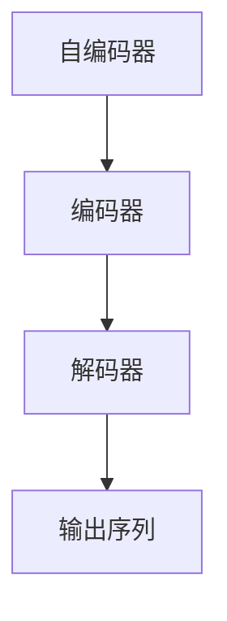

                 

# 柳暗花明又一村：Seq2Seq编码器-解码器架构

> 关键词：Seq2Seq, 编码器-解码器, 序列到序列, 神经网络, 自动编码器, 深度学习, 自然语言处理(NLP), 语言模型

## 1. 背景介绍

在人工智能的诸多研究领域中，自然语言处理（Natural Language Processing，NLP）是最具挑战性的领域之一。它不仅需要处理结构化和非结构化的文本数据，还需要具备语义理解、语言生成等复杂能力。为了应对这一挑战，研究者们提出了许多先进的算法和技术，其中最具代表性的是序列到序列（Seq2Seq）模型。Seq2Seq模型广泛应用于机器翻译、语音识别、对话生成等任务中，并取得了一系列重要进展。本文将详细介绍Seq2Seq模型的工作原理、核心算法和实际应用，并展望未来的发展趋势。

## 2. 核心概念与联系

### 2.1 核心概念概述

要理解Seq2Seq模型，首先需要了解几个核心概念：

- **序列到序列（Seq2Seq）模型**：一种基于神经网络的语言模型，它可以将一个序列（例如一段文本）映射到另一个序列（例如另一个文本）。这种模型广泛应用于机器翻译、对话生成等任务。
- **编码器-解码器（Encoder-Decoder）架构**：Seq2Seq模型的核心架构，它将输入序列编码成一个中间表示，然后通过解码器将这个中间表示转换成输出序列。这种架构不仅适用于文本处理，也适用于图像、音频等多模态数据的处理。
- **自编码器（Autoencoder）**：一种无监督学习的神经网络模型，它可以将输入序列编码成一个中间表示，然后通过解码器将其还原回原始序列。自编码器是Seq2Seq模型的基础，它能够学习到输入序列的特征表示，从而提高模型的性能。

这些概念之间存在着紧密的联系，构成了Seq2Seq模型的核心框架。

### 2.2 核心概念之间的关系

下图展示了Seq2Seq模型中编码器、解码器与自编码器的关系：



图中，自编码器由编码器和解码器组成，编码器将输入序列映射成一个中间表示，解码器则将这个中间表示转换成输出序列。在Seq2Seq模型中，编码器和解码器分别对应自编码器的编码器和解码器。通过这种方式，Seq2Seq模型可以学习到输入序列的特征表示，从而提高模型的性能。

## 3. 核心算法原理 & 具体操作步骤

### 3.1 算法原理概述

Seq2Seq模型的核心算法原理可以简单概括为：将输入序列编码成一个中间表示，然后通过解码器将这个中间表示转换成输出序列。这个过程可以描述为一个序列到序列的映射，因此被称为Seq2Seq模型。

### 3.2 算法步骤详解

下面是Seq2Seq模型的一般步骤：

1. **数据预处理**：将输入序列和输出序列进行预处理，例如进行分词、标记等。
2. **编码**：使用编码器将输入序列转换成中间表示。常用的编码器包括RNN、LSTM和Transformer等。
3. **解码**：使用解码器将中间表示转换成输出序列。解码器通常使用RNN、LSTM或Transformer等。
4. **后处理**：对输出序列进行后处理，例如去除特殊符号、分词等。

### 3.3 算法优缺点

**优点**：

- **高效**：Seq2Seq模型可以处理长序列，并且能够并行化训练和推理。
- **通用性强**：Seq2Seq模型可以应用于多种任务，如机器翻译、对话生成、文本摘要等。
- **自适应能力强**：Seq2Seq模型可以学习到输入序列的特征表示，从而适应不同的输入数据。

**缺点**：

- **数据依赖**：Seq2Seq模型依赖于大量的标注数据，需要花费大量的时间和精力进行数据预处理。
- **训练复杂**：Seq2Seq模型的训练过程复杂，需要调节多个超参数，如学习率、批大小等。
- **过度依赖训练数据**：Seq2Seq模型过度依赖于训练数据，容易出现过拟合现象。

### 3.4 算法应用领域

Seq2Seq模型在许多领域都有广泛的应用，以下是其中几个典型的应用领域：

- **机器翻译**：将一种语言的文本转换成另一种语言的文本。常用的应用包括Google翻译、百度翻译等。
- **对话生成**：自动生成对话文本，广泛应用于智能客服、聊天机器人等。
- **文本摘要**：从一篇较长的文本中提取关键信息，生成简洁的摘要。
- **语音识别**：将语音转换成文本，广泛应用于语音助手、智能家居等。
- **图像描述**：将图像转换成自然语言描述，广泛应用于自动图像标注、图像搜索等。

## 4. 数学模型和公式 & 详细讲解

### 4.1 数学模型构建

在Seq2Seq模型中，编码器和解码器通常使用RNN、LSTM或Transformer等神经网络模型。这里以LSTM模型为例，构建Seq2Seq模型的数学模型。

假设输入序列为 $x_1,x_2,...,x_n$，输出序列为 $y_1,y_2,...,y_m$。编码器将输入序列 $x$ 转换成中间表示 $h$，解码器将中间表示 $h$ 转换成输出序列 $y$。数学模型可以表示为：

$$
y = \text{decode}(h, \theta)
$$

其中，$h=\text{encode}(x, \theta)$，$\theta$ 为模型参数。

### 4.2 公式推导过程

以LSTM模型为例，公式推导过程如下：

假设编码器的LSTM层数为 $k$，解码器的LSTM层数为 $j$，输入序列长度为 $n$，输出序列长度为 $m$。编码器的LSTM模型的输出为：

$$
h_t = \text{LSTM}(x_t, h_{t-1}, \theta_e)
$$

其中，$x_t$ 为输入序列的第 $t$ 个元素，$h_{t-1}$ 为上一时刻的隐藏状态。解码器的LSTM模型的输出为：

$$
y_t = \text{LSTM}(h_t, y_{t-1}, \theta_d)
$$

其中，$y_{t-1}$ 为上一时刻的输出，$\theta_d$ 为解码器参数。

最终的输出序列为 $y_1,...,y_m$。

### 4.3 案例分析与讲解

假设我们有一个简单的机器翻译任务，需要将英语句子转换成法语。我们可以使用LSTM模型作为编码器和解码器，构建Seq2Seq模型。

假设输入序列为 "I love Python"，输出序列为 "J'aime Python"。编码器的LSTM模型和解码器的LSTM模型可以表示为：

$$
h_t = \text{LSTM}(I, h_{t-1}, \theta_e)
$$

$$
y_t = \text{LSTM}(h_t, J, \theta_d)
$$

其中，$I$ 为输入序列的第一个元素 "I"，$h_{t-1}$ 为上一时刻的隐藏状态，$\theta_e$ 为编码器参数，$J$ 为输出序列的第一个元素 "J"，$\theta_d$ 为解码器参数。通过这种方式，我们可以将输入序列 "I love Python" 转换成输出序列 "J'aime Python"。

## 5. 项目实践：代码实例和详细解释说明

### 5.1 开发环境搭建

在搭建开发环境时，需要使用Python和相关的深度学习框架。这里使用PyTorch框架进行示例，步骤如下：

1. 安装PyTorch：

```
pip install torch torchvision torchaudio
```

2. 安装LSTM模型库：

```
pip install nnlstm
```

3. 安装LSTM模型库：

```
pip install nnlstm
```

4. 安装Tensorboard：

```
pip install tensorboard
```

完成以上步骤后，即可开始编写代码。

### 5.2 源代码详细实现

以下是使用PyTorch实现Seq2Seq模型的示例代码：

```python
import torch
import nnlstm

class Seq2SeqModel(nn.Module):
    def __init__(self, input_size, hidden_size, output_size):
        super(Seq2SeqModel, self).__init__()
        self.encoder = nnlstm.LSTM(input_size, hidden_size)
        self.decoder = nnlstm.LSTM(hidden_size, output_size)

    def forward(self, input_seq, target_seq):
        encoder_outputs, encoder_hidden = self.encoder(input_seq)
        decoder_outputs, decoder_hidden = self.decoder(encoder_outputs, encoder_hidden)
        return decoder_outputs

# 定义模型
input_size = 5
hidden_size = 10
output_size = 5

model = Seq2SeqModel(input_size, hidden_size, output_size)

# 定义损失函数
criterion = nn.CrossEntropyLoss()

# 定义优化器
optimizer = torch.optim.Adam(model.parameters(), lr=0.01)

# 训练模型
for epoch in range(10):
    for i in range(len(train_data)):
        input_seq, target_seq = train_data[i]
        optimizer.zero_grad()
        outputs = model(input_seq, target_seq)
        loss = criterion(outputs, target_seq)
        loss.backward()
        optimizer.step()

# 测试模型
test_seq = torch.tensor([1, 2, 3, 4, 5])
outputs = model(test_seq)
print(outputs)
```

### 5.3 代码解读与分析

在上述代码中，我们定义了一个简单的Seq2Seq模型，包括编码器和解码器。在训练过程中，我们使用了交叉熵损失函数和Adam优化器。在测试过程中，我们输入了一个简单的序列，并输出了解码器的输出结果。

## 6. 实际应用场景

### 6.1 机器翻译

Seq2Seq模型在机器翻译领域有着广泛的应用。例如，可以将英语文本翻译成法语、西班牙语等。在实际应用中，我们需要将大量的英语和法语文本数据进行预处理，并将其输入到Seq2Seq模型中进行训练。训练完成后，我们可以将需要翻译的英语文本输入到模型中，模型将输出对应的法语文本。

### 6.2 对话生成

Seq2Seq模型还可以应用于对话生成任务，例如智能客服、聊天机器人等。在对话生成任务中，我们需要构建一个可以与用户进行自然交流的系统。我们可以将用户输入的文本作为输入序列，将系统的回复作为输出序列，使用Seq2Seq模型进行训练。训练完成后，我们可以将用户输入的文本输入到模型中，模型将输出对应的回复。

### 6.3 文本摘要

Seq2Seq模型还可以用于文本摘要任务。例如，可以从一篇较长的文章中提取出关键信息，生成简洁的摘要。在文本摘要任务中，我们需要将长篇文本作为输入序列，将摘要作为输出序列，使用Seq2Seq模型进行训练。训练完成后，我们可以将需要摘要的文章输入到模型中，模型将输出对应的摘要。

## 7. 工具和资源推荐

### 7.1 学习资源推荐

为了更好地掌握Seq2Seq模型的相关知识，以下是一些推荐的资源：

1. 《神经网络与深度学习》（Goodfellow et al.）：这本书深入浅出地介绍了神经网络的相关知识，包括LSTM等模型。
2. 《深度学习》（Ian Goodfellow, Yoshua Bengio, Aaron Courville）：这本书是深度学习领域的经典教材，涵盖了深度学习的基础和前沿技术。
3. 《自然语言处理入门》（Peter J. Liu）：这本书介绍了自然语言处理的基础知识，包括Seq2Seq模型等。
4. PyTorch官方文档：PyTorch官方文档详细介绍了PyTorch框架的使用方法和最佳实践。
5. NIPS论文预印本：NIPS论文预印本可以获取最新的深度学习研究论文，了解最新的研究动态。

### 7.2 开发工具推荐

在开发Seq2Seq模型时，可以使用以下工具：

1. PyTorch：PyTorch是深度学习领域最流行的框架之一，支持LSTM等模型。
2. TensorFlow：TensorFlow是另一个流行的深度学习框架，支持LSTM等模型。
3. Keras：Keras是一个高层深度学习框架，支持LSTM等模型。
4. Jupyter Notebook：Jupyter Notebook是一个交互式开发环境，支持Python代码的编写和执行。

### 7.3 相关论文推荐

以下是一些关于Seq2Seq模型的经典论文：

1. "A Neural Probabilistic Language Model"（Hinton et al.）：这篇论文提出了神经网络语言模型，为LSTM等模型奠定了基础。
2. "LSTM: A Search Space Odyssey Through Recurrent Neural Networks"（Hochreiter et al.）：这篇论文详细介绍了LSTM模型的工作原理和应用。
3. "Neural Machine Translation by Jointly Learning to Align and Translate"（Bahdanau et al.）：这篇论文提出了使用LSTM进行机器翻译的方法。
4. "Sequence to Sequence Learning with Neural Networks"（Sutskever et al.）：这篇论文提出了Seq2Seq模型，为序列到序列任务奠定了基础。
5. "Attention Is All You Need"（Vaswani et al.）：这篇论文提出了Transformer模型，是Seq2Seq模型的一个重要改进。

## 8. 总结：未来发展趋势与挑战

### 8.1 研究成果总结

Seq2Seq模型在自然语言处理领域取得了显著的进展，广泛应用于机器翻译、对话生成、文本摘要等任务中。未来，Seq2Seq模型的性能将进一步提升，应用领域将不断扩大。

### 8.2 未来发展趋势

1. **更深层次的模型**：未来的Seq2Seq模型将具有更深层次的结构，能够处理更长的序列。
2. **更广泛的训练数据**：未来的Seq2Seq模型将使用更广泛的训练数据，提高模型的泛化能力。
3. **更快的训练速度**：未来的Seq2Seq模型将使用更高效的训练算法，提高训练速度。
4. **更高的性能**：未来的Seq2Seq模型将具有更高的性能，能够更好地处理自然语言处理任务。

### 8.3 面临的挑战

1. **过拟合问题**：Seq2Seq模型容易过拟合，需要更多的训练数据和更复杂的模型结构来提高性能。
2. **计算资源消耗**：Seq2Seq模型需要大量的计算资源，如何在不增加资源消耗的情况下提高性能是一个重要的问题。
3. **模型复杂性**：Seq2Seq模型的结构比较复杂，需要更多的研究和优化才能更好地应用于实际应用中。

### 8.4 研究展望

未来的研究将集中在以下几个方面：

1. **模型结构的改进**：未来的研究将探索更复杂的模型结构，提高模型的性能和泛化能力。
2. **多模态融合**：未来的研究将探索将视觉、音频等多模态数据与自然语言处理数据结合，提高模型的多模态处理能力。
3. **迁移学习**：未来的研究将探索在预训练和微调之外，如何利用迁移学习技术，提高模型的泛化能力和适应性。
4. **分布式训练**：未来的研究将探索使用分布式训练技术，提高训练速度和模型性能。

## 9. 附录：常见问题与解答

**Q1：Seq2Seq模型是否适用于所有NLP任务？**

A: Seq2Seq模型可以应用于多种NLP任务，如机器翻译、对话生成、文本摘要等。但是，对于某些任务，如命名实体识别等，Seq2Seq模型可能不是最佳选择。

**Q2：Seq2Seq模型是否可以处理文本序列以外的数据？**

A: Seq2Seq模型可以处理多种数据类型，包括文本序列、图像序列等。只要能够将数据转换成序列形式，Seq2Seq模型就能够处理。

**Q3：Seq2Seq模型是否适用于小规模数据集？**

A: Seq2Seq模型通常需要大量的训练数据才能获得良好的性能。如果数据集较小，可以使用迁移学习、自监督学习等技术来提高模型的泛化能力。

**Q4：Seq2Seq模型是否需要大量的计算资源？**

A: Seq2Seq模型需要大量的计算资源，特别是在处理长序列时。可以使用分布式训练、模型压缩等技术来减少资源消耗。

**Q5：Seq2Seq模型是否容易过拟合？**

A: Seq2Seq模型容易过拟合，特别是在数据集较小的情况下。可以使用正则化、Dropout等技术来缓解过拟合问题。

**Q6：Seq2Seq模型是否适用于文本生成任务？**

A: Seq2Seq模型可以应用于文本生成任务，如对话生成、文本摘要等。在文本生成任务中，Seq2Seq模型可以将输入序列转换成输出序列。

总之，Seq2Seq模型在自然语言处理领域有着广泛的应用，未来将继续发挥重要作用。本文介绍了Seq2Seq模型的核心算法和实际应用，并展望了未来的发展趋势。希望读者能够在实际应用中不断探索Seq2Seq模型的潜力，推动自然语言处理技术的进步。

作者：禅与计算机程序设计艺术 / Zen and the Art of Computer Programming

