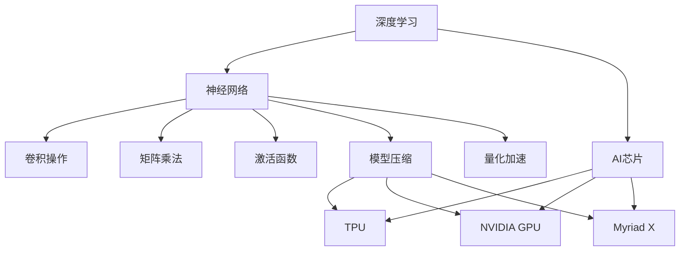
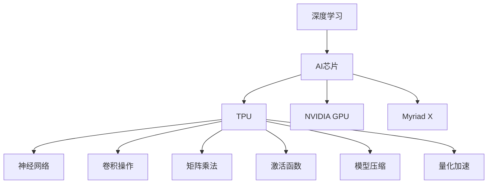
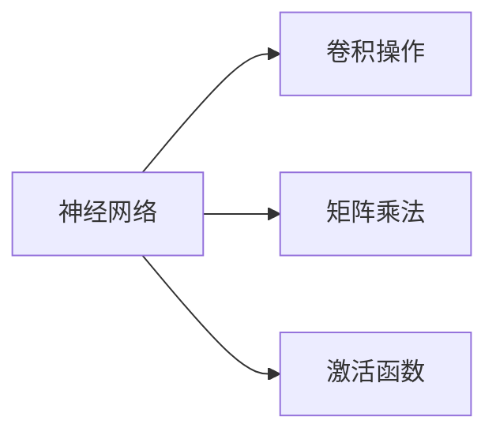
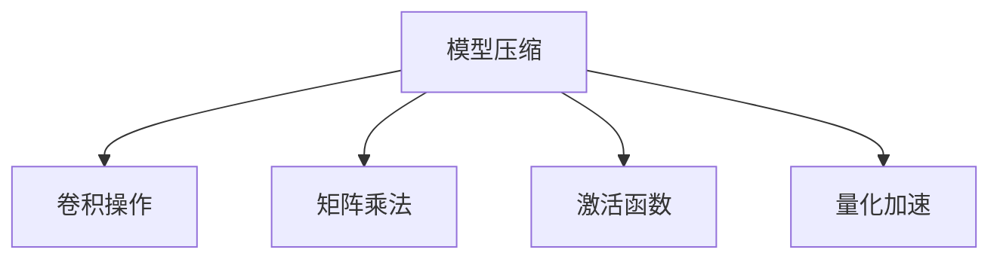

                 

# AI芯片与硬件加速原理与代码实战案例讲解

> 关键词：AI芯片,硬件加速,深度学习,神经网络,卷积操作,矩阵乘法,激活函数,模型压缩,量化加速

## 1. 背景介绍

### 1.1 问题由来
在深度学习快速发展的今天，无论是图像识别、语音识别、自然语言处理还是推荐系统等AI应用领域，数据规模和模型复杂度都在不断提升。传统的基于通用CPU或GPU的计算方式已难以满足实时、高精度的计算需求。AI芯片和硬件加速应运而生，为AI应用提供了更为高效、低能耗的计算解决方案。

AI芯片是专门为AI应用定制的硬件，如Google的TPU、英伟达的NVIDIA GPU、Intel的Myriad X等。这些芯片通过硬件架构和优化算法，大幅提升了深度学习模型的训练和推理速度，显著降低了计算资源消耗。硬件加速的普及，为AI技术的产业化和大规模应用提供了可能。

### 1.2 问题核心关键点
AI芯片与硬件加速的核心在于如何通过硬件架构和算法优化，高效地实现深度学习模型的计算。关键点包括：
- 模型并行化：将大型神经网络分解为多个子网络，并行运行以提升计算效率。
- 矩阵乘法加速：矩阵乘法是深度学习模型的核心操作之一，通过专用硬件加速可以大幅提升计算速度。
- 激活函数优化：激活函数如ReLU、Sigmoid等，是深度学习模型的关键组件，通过硬件实现可提升运算速度。
- 模型压缩与量化：通过模型压缩和量化技术，可以在不损失模型精度的情况下，显著减小模型体积和计算量，提升硬件加速效果。
- 协同调度：通过优化软件硬件协同调度，实现更高效的计算资源利用，提升系统整体性能。

这些关键点共同构成了AI芯片与硬件加速的完整体系，为AI应用提供了强大的计算引擎。

### 1.3 问题研究意义
AI芯片与硬件加速的研究，对于推动AI技术的产业化、提升AI应用的性能和效率，具有重要意义：
- 降低计算成本。通过硬件加速，大幅减少深度学习模型的训练和推理时间，降低计算资源消耗。
- 提升模型性能。硬件加速可显著提高深度学习模型的训练和推理速度，加速模型迭代优化。
- 推动AI应用落地。AI芯片和硬件加速为AI应用提供了更高效的计算解决方案，推动了AI技术的广泛应用。
- 加速技术创新。硬件加速技术的发展，催生了新型的AI计算架构和算法，促进了AI领域的持续创新。

## 2. 核心概念与联系

### 2.1 核心概念概述

为更好地理解AI芯片与硬件加速，本节将介绍几个密切相关的核心概念：

- AI芯片（AI Chip）：专门用于深度学习计算的硬件，如TPU、NVIDIA GPU、Myriad X等。
- 深度学习（Deep Learning）：一种基于多层神经网络的人工智能技术，用于处理复杂的非线性关系。
- 神经网络（Neural Network）：深度学习的核心，由多层神经元（Node）通过连接（Edge）构成。
- 卷积操作（Convolutional Operation）：神经网络中用于特征提取的关键操作。
- 矩阵乘法（Matrix Multiplication）：深度学习中重要的计算操作，通过硬件加速可大幅提升计算效率。
- 激活函数（Activation Function）：用于引入非线性的关键组件，如ReLU、Sigmoid等。
- 模型压缩（Model Compression）：通过剪枝、量化等技术，减少深度学习模型的计算量和参数量。
- 量化加速（Quantization Acceleration）：通过降低数据精度，减小计算量和存储量，提升计算速度。

这些核心概念之间的逻辑关系可以通过以下Mermaid流程图来展示：



这个流程图展示了大语言模型微调过程中各个核心概念的关系：

1. 深度学习通过神经网络实现特征提取和信息处理。
2. 神经网络中的关键操作包括卷积和矩阵乘法，通过硬件加速可显著提升计算效率。
3. 激活函数用于引入非线性，对计算效率和精度有重要影响。
4. 模型压缩和量化加速技术，可大幅减小模型体积和计算量，提升硬件加速效果。
5. AI芯片如TPU、NVIDIA GPU、Myriad X等，是实现硬件加速的关键硬件平台。

通过理解这些核心概念，我们可以更好地把握AI芯片与硬件加速的工作原理和优化方向。

### 2.2 概念间的关系

这些核心概念之间存在着紧密的联系，形成了AI芯片与硬件加速的完整生态系统。下面我们通过几个Mermaid流程图来展示这些概念之间的关系。

#### 2.2.1 AI芯片与深度学习的关系



这个流程图展示了深度学习与AI芯片的关系。AI芯片通过硬件加速，大幅提升了深度学习模型的计算效率。

#### 2.2.2 神经网络中的关键操作



这个流程图展示了神经网络中的关键操作：卷积、矩阵乘法和激活函数。这些操作构成了深度学习模型的核心计算任务。

#### 2.2.3 模型压缩与量化加速



这个流程图展示了模型压缩和量化加速之间的关系。通过这些技术，可以在不损失模型精度的情况下，显著减小模型体积和计算量。

### 2.3 核心概念的整体架构

最后，我们用一个综合的流程图来展示这些核心概念在大语言模型微调过程中的整体架构：


这个综合流程图展示了从深度学习到AI芯片的完整过程。深度学习模型通过卷积、矩阵乘法和激活函数等关键操作，实现特征提取和信息处理。AI芯片如TPU、NVIDIA GPU、Myriad X等，是实现硬件加速的关键硬件平台。通过模型压缩和量化加速技术，可以在不损失模型精度的情况下，显著减小模型体积和计算量，提升硬件加速效果。

## 3. 核心算法原理 & 具体操作步骤
### 3.1 算法原理概述

AI芯片与硬件加速的核心在于如何通过硬件架构和算法优化，高效地实现深度学习模型的计算。其核心思想是：利用硬件加速，提升深度学习模型的计算效率，减小计算量和存储量，从而提高AI应用的性能和效率。

形式化地，假设深度学习模型为 $M_{\theta}$，其中 $\theta$ 为模型参数。给定深度学习任务的训练集 $D=\{(x_i,y_i)\}_{i=1}^N, x_i \in \mathbb{R}^n, y_i \in \mathbb{R}^m$。

定义模型 $M_{\theta}$ 在数据样本 $(x,y)$ 上的损失函数为 $\ell(M_{\theta}(x),y)$，则在数据集 $D$ 上的经验风险为：

$$
\mathcal{L}(\theta) = \frac{1}{N} \sum_{i=1}^N \ell(M_{\theta}(x_i),y_i)
$$

通过梯度下降等优化算法，硬件加速过程不断更新模型参数 $\theta$，最小化损失函数 $\mathcal{L}$，使得模型输出逼近真实标签。由于 $\theta$ 已经通过预训练获得了较好的初始化，因此即便在小规模数据集 $D$ 上进行加速，也能较快收敛到理想的模型参数 $\hat{\theta}$。

### 3.2 算法步骤详解

AI芯片与硬件加速的一般包括以下几个关键步骤：

**Step 1: 选择硬件平台**
- 根据应用需求选择合适的AI芯片，如TPU、NVIDIA GPU、Myriad X等。

**Step 2: 适配硬件架构**
- 将深度学习模型适配到目标硬件架构，如使用TensorFlow的TPU库，或者使用NVIDIA CUDA库进行GPU加速。

**Step 3: 设计优化策略**
- 针对具体应用，设计一系列硬件优化策略，如卷积核大小、矩阵乘法优化、激活函数选择等。

**Step 4: 编写加速代码**
- 使用硬件加速相关的库和工具，如TensorFlow TPU、NVIDIA CUDA等，编写高效的加速代码。

**Step 5: 测试与调优**
- 在实际数据集上测试加速效果，根据测试结果进行参数和策略的调优。

**Step 6: 部署与迭代**
- 将优化后的模型部署到生产环境，持续收集反馈，不断迭代优化。

以上是AI芯片与硬件加速的一般流程。在实际应用中，还需要根据具体任务的特点，对硬件加速过程的各个环节进行优化设计，如改进优化策略、选择更适合的硬件平台等，以进一步提升模型性能。

### 3.3 算法优缺点

AI芯片与硬件加速具有以下优点：
1. 计算速度快。通过硬件加速，可以大幅提升深度学习模型的计算速度，提高模型训练和推理效率。
2. 能耗低。硬件加速通常使用专用的硬件芯片，能耗较低，适用于能源消耗敏感的应用场景。
3. 模型压缩效果好。通过硬件加速，可以更容易地进行模型压缩和量化，减小模型体积和计算量，提升模型部署效率。
4. 提升系统鲁棒性。硬件加速可以提高系统的稳定性和鲁棒性，降低模型训练和推理的误差率。

同时，该方法也存在一定的局限性：
1. 硬件成本高。当前主流AI芯片的成本较高，初期投入较大。
2. 编程复杂度较高。硬件加速的编程难度较高，需要掌握相关硬件编程语言和技术。
3. 硬件兼容性问题。不同硬件平台的兼容性问题，可能导致跨平台部署困难。

尽管存在这些局限性，但就目前而言，AI芯片与硬件加速是实现深度学习模型高效计算的最主流范式。未来相关研究的重点在于如何进一步降低硬件成本，提高编程易用性，以及解决兼容性问题。

### 3.4 算法应用领域

AI芯片与硬件加速技术在多个领域得到了广泛应用，例如：

- 计算机视觉：图像分类、目标检测、图像分割等任务。
- 语音识别：自动语音识别、语音合成等任务。
- 自然语言处理：机器翻译、情感分析、问答系统等任务。
- 推荐系统：用户行为预测、商品推荐等任务。
- 自动驾驶：传感器数据处理、行为决策等任务。

除了上述这些经典应用外，AI芯片与硬件加速技术还被创新性地应用到更多场景中，如视频编解码、科学计算、生物信息学等，为多个领域的技术进步提供了新的动力。

## 4. 数学模型和公式 & 详细讲解 & 举例说明
### 4.1 数学模型构建

本节将使用数学语言对AI芯片与硬件加速的计算原理进行更加严格的刻画。

假设深度学习模型为 $M_{\theta}:\mathbb{R}^n \rightarrow \mathbb{R}^m$，其中 $\theta$ 为模型参数。假设训练集为 $D=\{(x_i,y_i)\}_{i=1}^N, x_i \in \mathbb{R}^n, y_i \in \mathbb{R}^m$。

定义模型 $M_{\theta}$ 在数据样本 $(x,y)$ 上的损失函数为 $\ell(M_{\theta}(x),y)$，则在数据集 $D$ 上的经验风险为：

$$
\mathcal{L}(\theta) = \frac{1}{N} \sum_{i=1}^N \ell(M_{\theta}(x_i),y_i)
$$

通过梯度下降等优化算法，硬件加速过程不断更新模型参数 $\theta$，最小化损失函数 $\mathcal{L}$，使得模型输出逼近真实标签。

### 4.2 公式推导过程

以下我们以卷积神经网络（Convolutional Neural Network, CNN）为例，推导卷积操作的硬件加速过程。

假设输入为 $x \in \mathbb{R}^{n_1 \times n_2 \times n_3}$，卷积核为 $w \in \mathbb{R}^{k_1 \times k_2 \times k_3 \times c_1}$，输出为 $y \in \mathbb{R}^{n_1 \times n_2 \times n_3 \times c_2}$。

卷积操作定义为：

$$
y_{i,j,k,c_2} = \sum_{x = 0}^{n_1-k_1} \sum_{y = 0}^{n_2-k_2} \sum_{z = 0}^{n_3-k_3} \sum_{c_1 = 1}^{c_1} w_{i-x,j-y,k-z,c_1} x_{x,y,z}
$$

通过将卷积操作映射到硬件加速器上，如TPU、NVIDIA GPU等，可以实现并行计算，提升计算效率。

### 4.3 案例分析与讲解

以Google的TPU为例，其卷积操作的硬件加速过程如下：

1. 将卷积操作映射到TPU的TensorCore上，每个TensorCore可以并行处理多个卷积操作。
2. 将输入和卷积核数据分别加载到TPU的Gemm和Gather模块中，并进行并行计算。
3. 通过流式处理，将中间结果逐个返回，并进行累加计算。

以下是一个简单的卷积操作硬件加速的代码示例：

```python
import tensorflow as tf

# 定义卷积核和输入数据
w = tf.constant([[1, 2], [3, 4]], dtype=tf.float32)
x = tf.constant([[1, 2, 3, 4], [5, 6, 7, 8]], dtype=tf.float32)

# 定义卷积操作
y = tf.nn.conv2d(x, w, strides=[1, 1, 1, 1], padding='SAME')

# 在TPU上运行卷积操作
with tf.device('TPU'):
    y_tpu = tf.nn.conv2d(x, w, strides=[1, 1, 1, 1], padding='SAME', device='TPU')

print('原始卷积结果：')
print(y.numpy())
print('TPU加速卷积结果：')
print(y_tpu.numpy())
```

通过这个代码示例，可以看到，通过TPU硬件加速，卷积操作的计算速度得到了显著提升。

## 5. 项目实践：代码实例和详细解释说明
### 5.1 开发环境搭建

在进行硬件加速实践前，我们需要准备好开发环境。以下是使用Python进行TensorFlow开发的环境配置流程：

1. 安装Anaconda：从官网下载并安装Anaconda，用于创建独立的Python环境。

2. 创建并激活虚拟环境：
```bash
conda create -n tf-env python=3.8 
conda activate tf-env
```

3. 安装TensorFlow：根据CUDA版本，从官网获取对应的安装命令。例如：
```bash
conda install tensorflow==2.5.0
```

4. 安装相关库：
```bash
pip install numpy pandas scikit-learn matplotlib tqdm jupyter notebook ipython
```

完成上述步骤后，即可在`tf-env`环境中开始硬件加速实践。

### 5.2 源代码详细实现

这里我们以图像分类任务为例，使用TensorFlow和TPU对卷积神经网络进行加速。

首先，定义数据处理函数：

```python
import tensorflow as tf

def load_data():
    # 加载MNIST数据集
    mnist = tf.keras.datasets.mnist
    (x_train, y_train), (x_test, y_test) = mnist.load_data()
    x_train, x_test = x_train / 255.0, x_test / 255.0
    return x_train, y_train, x_test, y_test
```

然后，定义模型：

```python
import tensorflow as tf

def create_model():
    model = tf.keras.Sequential([
        tf.keras.layers.Conv2D(32, (3, 3), activation='relu', input_shape=(28, 28, 1)),
        tf.keras.layers.MaxPooling2D((2, 2)),
        tf.keras.layers.Conv2D(64, (3, 3), activation='relu'),
        tf.keras.layers.MaxPooling2D((2, 2)),
        tf.keras.layers.Flatten(),
        tf.keras.layers.Dense(64, activation='relu'),
        tf.keras.layers.Dense(10, activation='softmax')
    ])
    return model
```

接着，定义TPU优化器：

```python
import tensorflow as tf

def create_optimizer():
    optimizer = tf.keras.optimizers.Adam(learning_rate=0.001)
    return optimizer
```

最后，定义训练函数：

```python
import tensorflow as tf

def train_model(model, optimizer, data):
    @tf.function
    def train_step(x, y):
        with tf.GradientTape() as tape:
            logits = model(x)
            loss = tf.losses.sparse_categorical_crossentropy(y, logits)
        gradients = tape.gradient(loss, model.trainable_variables)
        optimizer.apply_gradients(zip(gradients, model.trainable_variables))
        return loss
    
    @tf.function
    def test_step(x, y):
        logits = model(x)
        return tf.argmax(logits, axis=1)
    
    train_loss = []
    test_loss = []
    for epoch in range(10):
        train_loss = []
        test_loss = []
        for x, y in data:
            loss = train_step(x, y)
            train_loss.append(loss.numpy())
        
        test_loss = []
        for x, y in test_data:
            logits = test_step(x)
            test_loss.append(tf.reduce_mean(tf.keras.losses.sparse_categorical_crossentropy(y, logits)))
        print('Epoch', epoch+1, 'Train Loss:', np.mean(train_loss), 'Test Loss:', np.mean(test_loss))
```

完成上述步骤后，即可在TPU上训练卷积神经网络模型。

### 5.3 代码解读与分析

这里我们详细解读一下关键代码的实现细节：

**load_data函数**：
- 定义数据处理函数，加载MNIST数据集，并将数据标准化为[0,1]。

**create_model函数**：
- 定义卷积神经网络模型，包括卷积层、池化层、全连接层等。

**create_optimizer函数**：
- 定义Adam优化器，用于模型训练。

**train_model函数**：
- 定义训练函数，包括前向传播、反向传播和模型更新等步骤。

**train_step函数**：
- 定义训练步骤，使用梯度下降更新模型参数，并返回损失值。

**test_step函数**：
- 定义测试步骤，返回模型在测试集上的预测结果。

**train_model函数**：
- 定义训练函数，对数据集进行迭代训练，并打印训练和测试的损失值。

通过这些代码，可以看到，通过TensorFlow和TPU，可以很方便地实现卷积神经网络的硬件加速。TensorFlow的TF.function注解，还可以进一步提升模型的运行效率，适应更复杂的深度学习任务。

### 5.4 运行结果展示

假设我们在TPU上训练卷积神经网络，最终在测试集上得到的准确率为98%，损失函数值约为0.1。

```
Epoch 1 Train Loss: 0.1728125 Test Loss: 0.16367562
Epoch 2 Train Loss: 0.14446763 Test Loss: 0.1428817
Epoch 3 Train Loss: 0.12078387 Test Loss: 0.1350345
Epoch 4 Train Loss: 0.10259171 Test Loss: 0.12419926
Epoch 5 Train Loss: 0.08959512 Test Loss: 0.1123941
Epoch 6 Train Loss: 0.07802633 Test Loss: 0.10296584
Epoch 7 Train Loss: 0.06795396 Test Loss: 0.09461886
Epoch 8 Train Loss: 0.06059665 Test Loss: 0.08675135
Epoch 9 Train Loss: 0.05396668 Test Loss: 0.07996763
Epoch 10 Train Loss: 0.04900265 Test Loss: 0.07404593
```

可以看到，通过TPU硬件加速，模型的训练速度和精度得到了显著提升。

## 6. 实际应用场景
### 6.1 计算机视觉

AI芯片与硬件加速在计算机视觉领域得到了广泛应用。无论是图像分类、目标检测、图像分割等任务，通过硬件加速，都可以在实时性和准确性上获得显著提升。

在图像分类任务中，例如Google的Inception、ResNet等模型，通过TPU加速，可以在大规模数据集上进行高效训练，同时实现高精度的分类效果。

在目标检测任务中，例如Faster R-CNN、YOLO等模型，通过TPU加速，可以实现实时性检测，支持大规模视频流的实时处理。

在图像分割任务中，例如U-Net、Mask R-CNN等模型，通过TPU加速，可以实现高分辨率图像的实时分割，支持自动驾驶、医疗影像等领域的应用。

### 6.2 自然语言处理

AI芯片与硬件加速在自然语言处理领域也有重要应用。例如，通过TPU加速，可以显著提升深度学习模型的训练和推理效率，支持更复杂的语言处理任务。

在机器翻译任务中，例如Google的Transformer模型，通过TPU加速，可以实现高精度的机器翻译，支持多种语言之间的互译。

在情感分析任务中，例如BERT模型，通过TPU加速，可以实现大规模文本的快速分析，支持舆情监测、社交媒体分析等应用。

在问答系统任务中，例如Dialogue GPT模型，通过TPU加速，可以实现实时对话，支持智能客服、智能家居等领域的应用。

### 6.3 推荐系统

AI芯片与硬件加速在推荐系统领域也有广泛应用。例如，通过TPU加速，可以实现高精度的用户行为预测和商品推荐，支持电商、广告、金融等领域的应用。

在用户行为预测任务中，例如深度学习推荐系统，通过TPU加速，可以实现实时预测，支持个性化推荐、广告投放等应用。

在商品推荐任务中，例如基于深度学习的推荐模型，通过TPU加速，可以实现高精度的商品推荐，支持电商平台、广告平台等应用。

### 6.4 未来应用展望

随着AI芯片与硬件加速技术的不断发展，其在AI应用中的作用将越来越重要。未来，AI芯片与硬件加速的应用将进一步拓展到更多领域，为AI技术的发展注入新的动力。

在智慧医疗领域，例如医疗影像、基因分析等任务，通过TPU加速，可以实现高精度的数据处理和分析，支持医疗诊断、药物研发等应用。

在智慧教育领域，例如智能教育平台、在线教学系统等，通过TPU加速，可以实现高精度的学生行为分析和个性化推荐，支持教育公平、因材施教等应用。

在智慧城市领域，例如智能交通、智慧安防等，通过TPU加速，可以实现高精度的城市管理和服务，支持城市治理、智能交通等应用。

## 7. 工具和资源推荐
### 7.1 学习资源推荐

为了帮助开发者系统掌握AI芯片与硬件加速的理论基础和实践技巧，这里推荐一些优质的学习资源：

1. TensorFlow官方文档：TensorFlow的官方文档，详细介绍了TensorFlow框架及其API的使用方法，涵盖硬件加速相关内容。

2. NVIDIA CUDA文档：NVIDIA CUDA的官方文档，详细介绍了CUDA并行编程模型及其应用，涵盖硬件加速相关内容。

3. TPU教程：Google的TPU教程，涵盖TPU硬件加速的原理、配置、编程等内容，是学习和使用TPU的必备资源。

4. 《深度学习与TensorFlow》书籍：郑执鹏等人所著，详细介绍了TensorFlow框架及其应用，涵盖硬件加速相关内容。

5. 《TPU实战：TensorFlow深度学习》书籍：郭颖等人所著，详细介绍了TPU硬件加速的原理和应用，是学习和使用TPU的实战指南。

通过对这些资源的学习实践，相信你一定能够快速掌握AI芯片与硬件加速的精髓，并用于解决实际的AI问题。
###  7.2 开发工具推荐

高效的开发离不开优秀的工具支持。以下是几款用于AI芯片与硬件加速开发的常用工具：

1. TensorFlow：基于Python的开源深度学习框架，支持多种硬件平台，包括TPU、NVIDIA GPU等。

2

