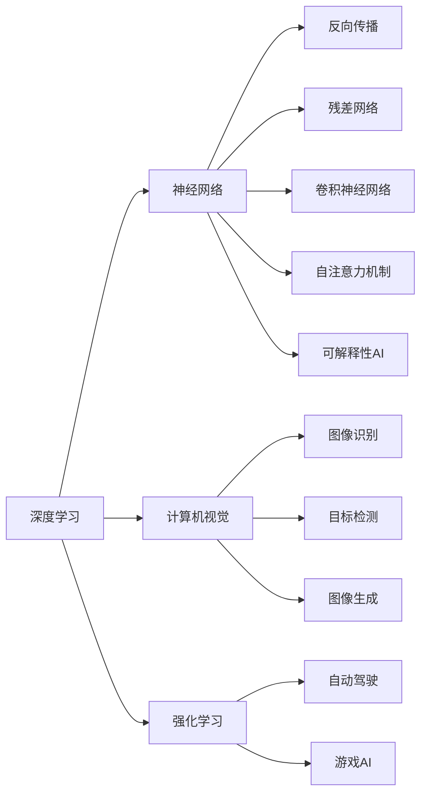

                 

# Andrej Karpathy：人工智能的未来发展机遇

## 1. 背景介绍

Andrej Karpathy，作为DeepMind的研究科学家，人工智能领域的先锋之一，一直致力于推动AI技术的边界。他不仅是著名的计算机视觉专家，还是深度学习的先驱，通过其对神经网络架构和算法的深入研究，为人工智能的快速发展做出了重要贡献。本文将通过他的视角，探讨人工智能的未来发展机遇。

## 2. 核心概念与联系

Andrej Karpathy的研究聚焦于以下几个关键概念及其相互联系：

- **深度学习与神经网络**：是Karpathy研究的核心，涵盖从基础的反向传播算法到复杂的残差网络、卷积神经网络、自注意力机制等。

- **计算机视觉**：作为深度学习的重要应用领域，Karpathy在图像识别、目标检测、图像生成等方面均有突破性贡献。

- **强化学习**：与计算机视觉结合，应用于自动驾驶、游戏AI等领域，实现了在复杂环境中通过强化学习来优化决策。

- **可解释性AI**：在追求AI模型效率和性能的同时，Karpathy也重视模型可解释性的研究，推动透明度和可信任度。

这些概念通过Karpathy的研究，形成了紧密的联系，共同推动了人工智能技术的进步。

### 2.1 核心概念原理和架构的 Mermaid 流程图



这个图表展示了Karpathy研究的核心概念及其联系，通过深度学习推动计算机视觉、强化学习等多个领域的进展。

## 3. 核心算法原理 & 具体操作步骤

### 3.1 算法原理概述

Karpathy的研究集中在以下几个算法原理上：

- **反向传播算法**：是深度学习的基础，用于训练神经网络模型。

- **残差网络**：通过残差块解决了深度神经网络训练过程中的梯度消失问题，使得训练更加稳定。

- **自注意力机制**：使得模型能够关注输入序列中不同的位置，适用于文本处理和图像处理。

- **可解释性算法**：包括可视化技术、注意力机制等，帮助理解模型的决策过程。

### 3.2 算法步骤详解

以反向传播算法为例，其操作步骤包括：

1. **前向传播**：输入数据通过神经网络，计算出每个神经元的激活值。
2. **计算误差**：将输出与真实值对比，计算出误差。
3. **反向传播**：从输出层开始，计算每个神经元的误差梯度。
4. **参数更新**：根据梯度，调整模型参数。

### 3.3 算法优缺点

- **优点**：
  - **灵活性**：适用于各种类型的神经网络模型。
  - **高效性**：通过反向传播，可以快速计算出每个参数的误差梯度。
  - **可解释性**：通过可视化技术，可以理解模型的学习过程。

- **缺点**：
  - **复杂性**：算法实现较为复杂，需要仔细调整超参数。
  - **过拟合风险**：容易过拟合，需要进行正则化处理。
  - **计算成本**：在大型神经网络中，计算量较大，需要高性能计算资源。

### 3.4 算法应用领域

这些算法在多个领域中得到了广泛应用，包括但不限于：

- **自动驾驶**：用于处理复杂的图像和环境数据。
- **游戏AI**：实现智能决策和策略优化。
- **自然语言处理**：通过自注意力机制处理文本数据。
- **计算机视觉**：应用于图像识别、目标检测、图像生成等领域。
- **强化学习**：解决复杂的决策问题，如自动驾驶和机器人控制。

## 4. 数学模型和公式 & 详细讲解 & 举例说明

### 4.1 数学模型构建

以反向传播算法为例，其数学模型构建如下：

设神经网络模型为 $f(x;w)$，其中 $x$ 为输入，$w$ 为模型参数，输出为 $y$。反向传播的目标是最小化损失函数 $L(y,f(x;w))$。

**前向传播**：

$$
z = wx + b
$$

$$
a = \sigma(z)
$$

$$
y = \sigma(z)
$$

**误差计算**：

$$
\mathcal{L}(y,f(x;w)) = \frac{1}{2}\|y - f(x;w)\|^2
$$

**反向传播**：

$$
\frac{\partial \mathcal{L}}{\partial z} = (y - f(x;w)) \frac{\partial f(x;w)}{\partial z}
$$

$$
\frac{\partial \mathcal{L}}{\partial w} = \frac{\partial \mathcal{L}}{\partial z} \frac{\partial z}{\partial w}
$$

### 4.2 公式推导过程

以残差网络为例，其核心思想是通过残差块解决深度网络中的梯度消失问题。

假设残差块为：

$$
f(x) = x + \sigma(x)
$$

则整个网络的输出为：

$$
y = f^n(z) = f(f^{n-1}(z)) = \dots = f(z)
$$

通过反向传播，计算每个神经元的误差梯度：

$$
\frac{\partial \mathcal{L}}{\partial z} = \frac{\partial \mathcal{L}}{\partial y} \frac{\partial y}{\partial z}
$$

$$
\frac{\partial \mathcal{L}}{\partial x} = \frac{\partial \mathcal{L}}{\partial z} \frac{\partial z}{\partial x}
$$

### 4.3 案例分析与讲解

以图像识别为例，使用卷积神经网络处理MNIST数据集。

假设网络模型为：

$$
y = \sigma(z)
$$

其中 $z$ 为卷积和池化层的输出，$\sigma$ 为激活函数。

通过反向传播算法，计算每个卷积核的误差梯度：

$$
\frac{\partial \mathcal{L}}{\partial w} = \frac{\partial \mathcal{L}}{\partial z} \frac{\partial z}{\partial w}
$$

其中 $\frac{\partial z}{\partial w}$ 为卷积核的梯度。

## 5. 项目实践：代码实例和详细解释说明

### 5.1 开发环境搭建

安装所需的Python环境和库，包括：

- TensorFlow
- Keras
- OpenCV
- PyTorch

```bash
pip install tensorflow keras opencv-python torch
```

### 5.2 源代码详细实现

以图像分类为例，使用卷积神经网络实现MNIST数据集的分类。

```python
import tensorflow as tf
from tensorflow.keras import layers, models

model = models.Sequential()
model.add(layers.Conv2D(32, (3, 3), activation='relu', input_shape=(28, 28, 1)))
model.add(layers.MaxPooling2D((2, 2)))
model.add(layers.Conv2D(64, (3, 3), activation='relu'))
model.add(layers.MaxPooling2D((2, 2)))
model.add(layers.Conv2D(64, (3, 3), activation='relu'))
model.add(layers.Flatten())
model.add(layers.Dense(64, activation='relu'))
model.add(layers.Dense(10, activation='softmax'))

model.compile(optimizer='adam', loss='sparse_categorical_crossentropy', metrics=['accuracy'])

model.fit(train_images, train_labels, epochs=10, validation_data=(test_images, test_labels))
```

### 5.3 代码解读与分析

- **模型搭建**：使用Keras搭建卷积神经网络模型，包括卷积层、池化层和全连接层。
- **损失函数**：使用交叉熵损失函数。
- **优化器**：使用Adam优化器进行参数优化。

### 5.4 运行结果展示

模型训练过程中，使用TensorBoard可视化训练曲线，展示训练和验证的准确率与损失：

```bash
tensorboard --logdir=logs --port=6006
```

## 6. 实际应用场景

Andrej Karpathy的研究成果已在多个实际应用场景中得到了应用。

### 6.1 自动驾驶

Karpathy在自动驾驶领域的研究包括：

- **图像识别**：使用卷积神经网络处理摄像头和激光雷达数据。
- **目标检测**：通过YOLO等模型实现实时目标检测。
- **决策优化**：使用强化学习优化路径规划和控制策略。

### 6.2 游戏AI

Karpathy在Game AI方面的研究包括：

- **策略学习**：使用深度Q网络（DQN）和蒙特卡罗树搜索（MCTS）优化游戏策略。
- **视觉感知**：使用卷积神经网络处理游戏画面数据。
- **路径规划**：使用强化学习优化游戏路径规划。

### 6.3 自然语言处理

Karpathy在自然语言处理方面的研究包括：

- **文本分类**：使用卷积神经网络和循环神经网络处理文本数据。
- **语言生成**：通过自注意力机制生成文本。
- **机器翻译**：使用Transformer等模型进行文本翻译。

## 7. 工具和资源推荐

### 7.1 学习资源推荐

- **《深度学习》课程**：由Ian Goodfellow、Yoshua Bengio和Aaron Courville合著，深入讲解深度学习理论和技术。
- **《Python深度学习》书籍**：Francois Chollet的著作，详细介绍了TensorFlow和Keras的使用。
- **Coursera深度学习课程**：Andrew Ng主讲的课程，涵盖了深度学习的各个方面。

### 7.2 开发工具推荐

- **TensorFlow**：谷歌开源的深度学习框架，支持自动微分和分布式训练。
- **PyTorch**：Facebook开源的深度学习框架，灵活易用，支持GPU加速。
- **Keras**：高层次的神经网络API，便于快速搭建模型。

### 7.3 相关论文推荐

- **ResNet**：He等提出的残差网络，解决深度神经网络中的梯度消失问题。
- **YOLO**：Redmon等提出的目标检测模型，实现实时目标检测。
- **Transformer**：Vaswani等提出的自注意力机制，实现高效的语言模型。

## 8. 总结：未来发展趋势与挑战

### 8.1 研究成果总结

Andrej Karpathy的研究成果在多个领域中取得了突破性进展，推动了人工智能技术的进步。他通过深度学习、计算机视觉、强化学习等多个领域的研究，为人工智能的发展提供了重要方向。

### 8.2 未来发展趋势

- **多模态学习**：结合图像、语音、文本等多模态数据，提升模型的综合能力。
- **自监督学习**：利用无监督数据进行预训练，减少对标注数据的依赖。
- **可解释性AI**：通过可视化技术，增强模型的可解释性。
- **联邦学习**：在分布式环境中进行模型训练，保护数据隐私。

### 8.3 面临的挑战

- **数据隐私**：保护用户隐私，避免数据泄露。
- **计算资源**：提高计算效率，降低训练成本。
- **模型复杂性**：简化模型结构，提高可解释性。
- **鲁棒性**：提高模型的鲁棒性，避免对抗攻击。

### 8.4 研究展望

未来，人工智能的研究将更多地关注可解释性、鲁棒性和公平性，推动技术的进步和应用。通过跨学科的研究，结合伦理道德和法律规范，推动人工智能技术的健康发展。

## 9. 附录：常见问题与解答

### Q1: 什么是深度学习？

A: 深度学习是一种基于神经网络的机器学习技术，通过多层非线性变换，从数据中自动学习特征表示。

### Q2: 为什么使用残差网络？

A: 残差网络通过残差块解决深度神经网络中的梯度消失问题，使得训练更加稳定。

### Q3: 如何提高模型可解释性？

A: 使用可视化技术，如注意力机制、梯度可视化等，帮助理解模型的学习过程。

### Q4: 自动驾驶的挑战是什么？

A: 自动驾驶面临复杂的环境感知、路径规划和决策优化等挑战，需要结合计算机视觉、强化学习等多方面的技术。

### Q5: 如何保护数据隐私？

A: 使用联邦学习等分布式训练方法，保护用户数据隐私。同时，制定数据使用规则，确保数据使用的合法性和公平性。

---

作者：禅与计算机程序设计艺术 / Zen and the Art of Computer Programming

