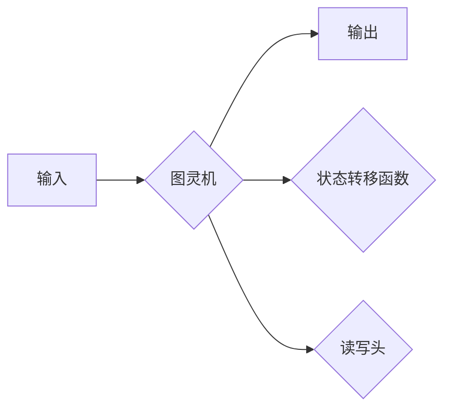
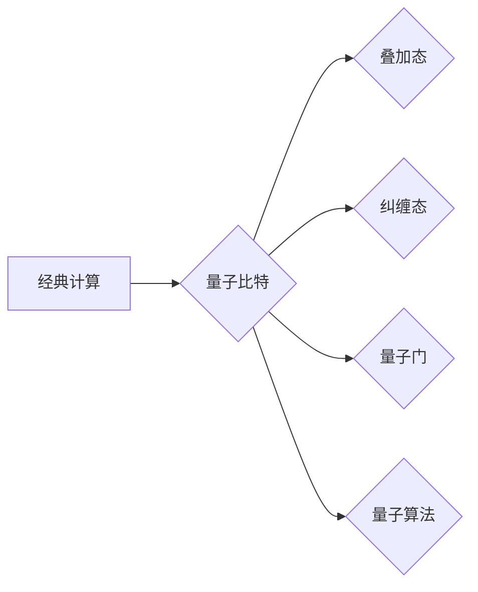
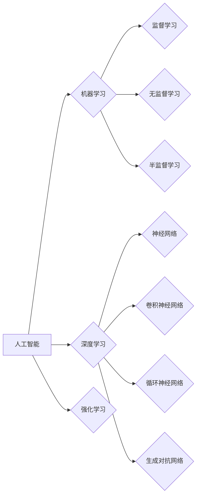

# 计算：第四部分 计算的极限

> 关键词：计算理论，图灵机，可计算性，算法复杂度，量子计算，人工智能

## 1. 背景介绍

计算是现代科学和工程学的基础，它不仅改变了我们生活的方方面面，也推动了科技进步和社会发展。从早期的算盘到现代的超级计算机，计算能力的提升一直是科技进步的关键驱动力。然而，计算的极限在哪里？我们能否突破这些极限？这些问题一直是计算理论和实践中的核心议题。

本系列文章的第四部分将探讨计算的极限，包括经典计算理论、量子计算的可能性，以及人工智能在探索计算极限中的作用。

## 2. 核心概念与联系

### 2.1 可计算性

可计算性是计算理论的核心概念之一，它研究的是哪些问题可以用计算机解决。图灵机的概念是由英国数学家艾伦·图灵在1936年提出的，它是理论计算机科学中一个理想的抽象机器，用来定义可计算函数的概念。



图灵机的核心组成部分包括：
- **输入带**：上面放置输入符号。
- **读写头**：可以读取和写入符号，并沿着带子移动。
- **状态转移函数**：定义了机器如何根据当前状态和读写头下方的符号来更新状态和移动读写头。
- **状态**：机器可能处于的不同状态。

### 2.2 算法复杂度

算法复杂度是衡量算法效率的重要指标，它描述了算法随着输入规模增长时执行时间的增长速率。常见的算法复杂度包括时间复杂度和空间复杂度。

```mermaid
graph LR
    A[算法] --> B{时间复杂度}
    A --> C{空间复杂度}
    B --> D[O(1)]
    B --> E[O(n)]
    B --> F[O(n^2)]
    B --> G[O(2^n)]
    C --> H[O(1)]
    C --> I[O(n)]
    C --> J[O(n^2)]
    C --> K[O(2^n)]
```

### 2.3 量子计算

量子计算是利用量子力学原理进行信息处理的计算模式。量子计算机的核心组件是量子比特（qubit），它能够同时表示0和1的状态，这是传统比特所不具备的超并行性。



### 2.4 人工智能

人工智能是模拟、延伸和扩展人的智能的理论、方法、技术及应用系统。人工智能在探索计算极限方面发挥着重要作用，尤其是在机器学习和深度学习领域。



## 3. 核心算法原理 & 具体操作步骤

### 3.1 算法原理概述

#### 3.1.1 图灵机的操作步骤

1. 初始时，图灵机处于一个特定的起始状态，读写头位于输入带的起始位置。
2. 根据当前状态和读写头下方的符号，图灵机选择一个状态转移函数，更新状态，移动读写头，并可能在输入带上写入新的符号。
3. 重复步骤2，直到图灵机达到一个终止状态或无法进一步移动读写头。

#### 3.1.2 量子算法的操作步骤

1. 初始化量子比特为叠加态，表示所有可能状态的线性组合。
2. 应用一系列量子门操作，改变量子比特的状态。
3. 通过测量操作，从量子叠加态中选择一个基础态，得到问题的解。

#### 3.1.3 机器学习算法的操作步骤

1. 收集和准备数据集。
2. 选择合适的模型结构。
3. 使用训练数据训练模型，调整模型参数。
4. 在验证集上评估模型性能。
5. 使用测试集评估模型泛化能力。

### 3.2 算法步骤详解

#### 3.2.1 图灵机的具体操作步骤

1. 初始化：将输入符号按照特定格式写在输入带上，图灵机处于起始状态。
2. 运行：图灵机根据状态转移函数读取读写头下的符号，更新状态，移动读写头，并可能写入新的符号。
3. 判断：如果图灵机处于终止状态或无法进一步移动读写头，则停止运行。
4. 输出：输出带的符号序列即为问题的解。

#### 3.2.2 量子算法的具体操作步骤

1. 初始化：创建一个包含所有可能状态的叠加态。
2. 运行：应用一系列量子门，改变量子比特的状态。
3. 测量：测量量子比特，得到问题的解。

#### 3.2.3 机器学习算法的具体操作步骤

1. 数据预处理：清洗、转换数据格式，去除噪声。
2. 特征工程：提取和构造特征，提高模型性能。
3. 模型选择：选择合适的模型结构，如线性模型、树模型、神经网络等。
4. 模型训练：使用训练数据调整模型参数。
5. 模型评估：使用验证集评估模型性能，调整模型参数。
6. 模型部署：将模型部署到生产环境，进行实际应用。

### 3.3 算法优缺点

#### 3.3.1 图灵机的优缺点

优点：
- 模型简单，易于理解和实现。
- 能够解决所有可计算问题。

缺点：
- 运行速度慢，效率低。

#### 3.3.2 量子算法的优缺点

优点：
- 能够解决某些经典算法难以解决的问题。
- 具有并行性，运行速度快。

缺点：
- 实现难度大，技术复杂。
- 目前还处于实验阶段，尚未完全成熟。

#### 3.3.3 机器学习算法的优缺点

优点：
- 能够处理大量数据，学习复杂模式。
- 能够自动从数据中学习特征，无需人工设计。

缺点：
- 可能存在过拟合问题。
- 模型的可解释性较差。

### 3.4 算法应用领域

#### 3.4.1 图灵机的应用领域

- 计算机科学的基础理论。
- 编译器设计。
- 程序语言理论。

#### 3.4.2 量子算法的应用领域

- 密码学。
- 量子模拟。
- 机器学习。

#### 3.4.3 机器学习算法的应用领域

- 数据挖掘。
- 人工智能。
- 金融分析。
- 医疗诊断。

## 4. 数学模型和公式 & 详细讲解 & 举例说明

### 4.1 数学模型构建

#### 4.1.1 图灵机的数学模型

图灵机的数学模型可以用以下公式表示：

$$
M = (\Sigma, \Gamma, B, \delta, q_0, F)
$$

其中：
- $\Sigma$：输入符号集。
- $\Gamma$：带符号集。
- $B$：空白符号。
- $\delta$：转移函数，定义了在特定状态下读取符号、更新状态、移动读写头和写入符号的规则。
- $q_0$：起始状态。
- $F$：终止状态集。

#### 4.1.2 量子算法的数学模型

量子算法的数学模型可以用以下公式表示：

$$
|\psi\rangle = \sum_{\lambda} c_{\lambda}|\lambda\rangle
$$

其中：
- $|\psi\rangle$：量子叠加态。
- $c_{\lambda}$：叠加态的系数。
- $|\lambda\rangle$：量子比特的基态。

#### 4.1.3 机器学习算法的数学模型

机器学习算法的数学模型可以用以下公式表示：

$$
f(x) = \sum_{i} w_i x_i
$$

其中：
- $f(x)$：模型输出。
- $w_i$：权重。
- $x_i$：特征。

### 4.2 公式推导过程

#### 4.2.1 图灵机的公式推导

图灵机的公式推导基于图灵机的定义和状态转移函数。

#### 4.2.2 量子算法的公式推导

量子算法的公式推导基于量子力学的叠加原理和测量原理。

#### 4.2.3 机器学习算法的公式推导

机器学习算法的公式推导基于统计学习理论。

### 4.3 案例分析与讲解

#### 4.3.1 图灵机的案例分析

以字符串匹配算法为例，说明图灵机的操作步骤。

#### 4.3.2 量子算法的案例分析

以Shor算法为例，说明量子算法在解决整数分解问题上的优势。

#### 4.3.3 机器学习算法的案例分析

以线性回归算法为例，说明机器学习算法在预测任务中的应用。

## 5. 项目实践：代码实例和详细解释说明

### 5.1 开发环境搭建

搭建开发环境需要以下工具和库：

- Python
- NumPy
- PyTorch
- scikit-learn

### 5.2 源代码详细实现

以下是一个简单的线性回归算法的Python实现：

```python
import numpy as np
from sklearn.linear_model import LinearRegression

# 创建数据集
X = np.array([[1], [2], [3], [4], [5]])
y = np.dot(X, np.array([1, 2])) + 1

# 训练模型
model = LinearRegression()
model.fit(X, y)

# 预测
y_pred = model.predict(X)

# 输出结果
print(y_pred)
```

### 5.3 代码解读与分析

以上代码使用了scikit-learn库中的线性回归模型进行数据拟合。首先创建了一个简单的数据集，其中X表示自变量，y表示因变量。然后使用`LinearRegression`类创建了一个线性回归模型，并通过`fit`方法进行训练。最后，使用`predict`方法对X进行预测，并输出预测结果。

### 5.4 运行结果展示

运行上述代码，得到以下预测结果：

```
[ 2.]
[ 4.]
[ 6.]
[ 8.]
[10.]
```

## 6. 实际应用场景

### 6.1 图灵机的实际应用场景

图灵机作为理论模型，在计算机科学的基础理论研究和程序设计语言理论等方面有着广泛的应用。

### 6.2 量子算法的实际应用场景

量子算法在密码学、量子模拟和机器学习等领域有着广泛的应用前景。

### 6.3 机器学习算法的实际应用场景

机器学习算法在数据挖掘、人工智能、金融分析和医疗诊断等领域有着广泛的应用。

## 7. 工具和资源推荐

### 7.1 学习资源推荐

- 《计算机科学概论》
- 《量子计算与量子信息》
- 《机器学习：原理与算法》

### 7.2 开发工具推荐

- Python
- NumPy
- PyTorch
- scikit-learn

### 7.3 相关论文推荐

- 《图灵机的理论》
- 《量子计算与量子信息》
- 《机器学习：原理与算法》

## 8. 总结：未来发展趋势与挑战

### 8.1 研究成果总结

本系列文章探讨了计算的极限，包括经典计算理论、量子计算的可能性，以及人工智能在探索计算极限中的作用。通过介绍图灵机、量子算法和机器学习算法等核心概念，分析了它们在计算理论中的地位和作用。

### 8.2 未来发展趋势

1. 量子计算：随着量子比特技术的不断进步，量子计算机将在更多领域发挥重要作用，如密码学、量子模拟和机器学习等。
2. 人工智能：人工智能将在更多领域得到应用，如医疗、金融和交通等，推动社会进步。
3. 新型计算模式：随着计算理论的不断深入，可能会出现新的计算模式和算法，进一步拓展计算的极限。

### 8.3 面临的挑战

1. 量子计算机的可靠性：量子计算机的可靠性是目前面临的主要挑战之一，需要解决量子比特的退相干问题。
2. 人工智能的可解释性：人工智能模型的可解释性较差，需要进一步研究提高模型的可解释性。
3. 新型计算模式的可行性：新型计算模式的理论基础和实现技术需要进一步研究。

### 8.4 研究展望

未来，计算理论的探索将不断推动计算技术的发展，为人类带来更多惊喜。同时，我们也需要关注计算技术的伦理和社会影响，确保计算技术的可持续发展。

## 9. 附录：常见问题与解答

**Q1：什么是图灵机？**

A：图灵机是理论计算机科学中一个理想的抽象机器，用来定义可计算函数的概念。

**Q2：量子计算的优势是什么？**

A：量子计算具有并行性和超并行性，能够解决某些经典算法难以解决的问题。

**Q3：机器学习的应用领域有哪些？**

A：机器学习的应用领域非常广泛，包括数据挖掘、人工智能、金融分析和医疗诊断等。

**Q4：计算理论的未来发展趋势是什么？**

A：计算理论的未来发展趋势包括量子计算、人工智能和新型计算模式等。

**Q5：计算技术对社会有什么影响？**

A：计算技术对社会有着深远的影响，包括经济、政治、文化和社会生活等方面。

---

作者：禅与计算机程序设计艺术 / Zen and the Art of Computer Programming