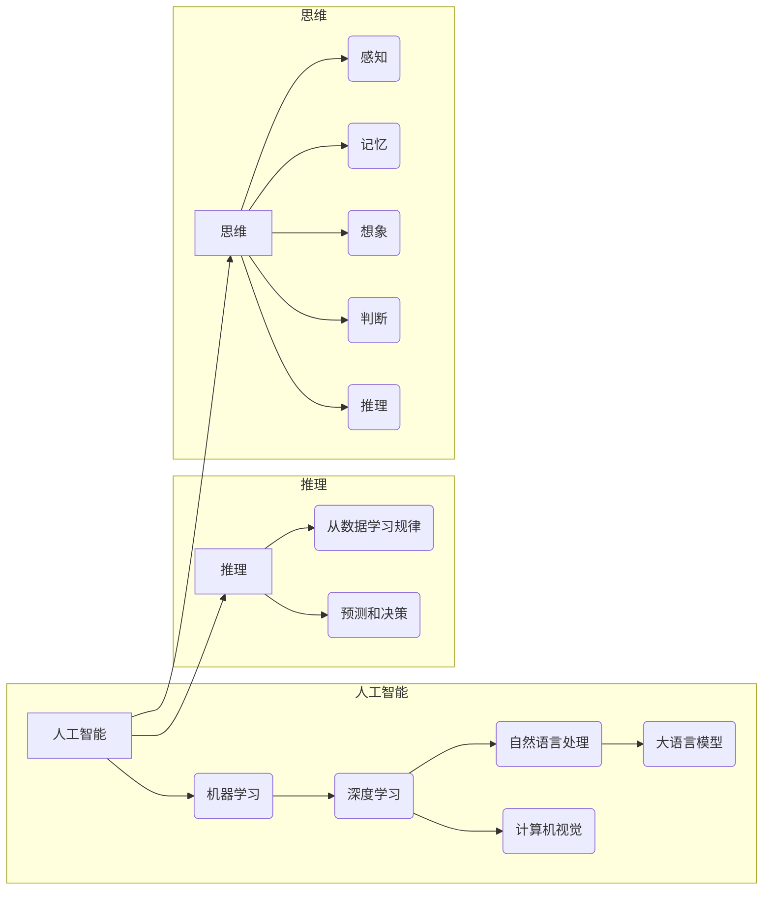

> 人工智能，大模型，推理，思维，语言，认知，神经网络，自然语言处理，认知模型

# 语言≠思维：大模型的推理误区

## 1. 背景介绍

随着深度学习技术的飞速发展，人工智能在自然语言处理（NLP）领域的应用越来越广泛。大语言模型（Large Language Models，LLMs）如BERT、GPT系列等，凭借其强大的语言理解和生成能力，在文本分类、问答系统、机器翻译等任务上取得了令人瞩目的成绩。然而，尽管这些模型在语言处理方面表现出色，但它们在推理和思考方面的能力却远未达到人类的水平。本文将探讨大模型的推理误区，分析其背后的原因，并展望未来认知模型的发展方向。

## 2. 核心概念与联系

### 2.1 核心概念

#### 2.1.1 人工智能

人工智能（Artificial Intelligence，AI）是研究、开发用于模拟、延伸和扩展人的智能的理论、方法、技术和应用的学科。它包括机器学习、深度学习、自然语言处理、计算机视觉等多个分支。

#### 2.1.2 大语言模型

大语言模型是自然语言处理领域的一种重要技术，它通过在大量文本数据上进行预训练，学习到丰富的语言知识，具备较强的语言理解和生成能力。

#### 2.1.3 推理

推理是从已知信息得出新结论的过程。在人工智能领域，推理通常指的是机器从数据中学习规律、模式，并利用这些规律进行预测和决策。

#### 2.1.4 思维

思维是人类大脑对客观世界的反映，包括感知、记忆、想象、判断、推理等认知活动。

### 2.2 核心概念原理和架构的 Mermaid 流程图



## 3. 核心算法原理 & 具体操作步骤

### 3.1 算法原理概述

大模型的推理能力主要来自于其复杂的神经网络结构和在海量数据上的预训练。通过多层神经网络对语言特征进行提取和组合，模型能够学习到语言中的规律和模式，并在推理过程中运用这些知识进行预测和决策。

### 3.2 算法步骤详解

1. **数据准备**：收集大量文本数据，进行预处理，如分词、去停用词、词性标注等。

2. **模型选择**：选择合适的预训练语言模型，如BERT、GPT系列等。

3. **预训练**：在预处理后的文本数据上，使用预训练任务（如掩码语言模型、下一句预测等）对模型进行预训练，使模型学习到丰富的语言知识。

4. **微调**：使用下游任务的标注数据对模型进行微调，使模型适应特定任务。

5. **推理**：将模型应用于新的输入数据，进行预测和决策。

### 3.3 算法优缺点

#### 3.3.1 优点

- **强大的语言理解能力**：预训练过程使模型学习到丰富的语言知识，具备较强的语言理解能力。
- **高效**：在大量数据上进行预训练后，模型可以快速应用于新的任务，无需从头开始训练。

#### 3.3.2 缺点

- **推理能力有限**：大模型主要擅长语言理解和生成，但在推理和思考方面仍有局限性。
- **数据依赖性高**：模型的性能很大程度上取决于预训练数据的质量和数量。
- **可解释性差**：模型内部工作机制复杂，难以解释其推理过程。

### 3.4 算法应用领域

大模型的推理能力在以下领域得到了广泛应用：

- **文本分类**：如新闻分类、情感分析、垃圾邮件过滤等。
- **问答系统**：如智能客服、智能问答等。
- **机器翻译**：如机器翻译、机器同传等。
- **文本摘要**：如自动生成摘要、信息提取等。

## 4. 数学模型和公式 & 详细讲解 & 举例说明

### 4.1 数学模型构建

大模型的推理过程可以通过神经网络进行数学建模。以下以BERT模型为例进行说明。

#### 4.1.1 BERT模型

BERT模型是一种基于Transformer的自回归语言模型，通过掩码语言模型（Masked Language Model，MLM）和下一句预测（Next Sentence Prediction，NSP）等预训练任务进行预训练，学习到丰富的语言知识。

#### 4.1.2 数学模型

BERT模型的输入为一个文本序列 $x = [x_1, x_2, ..., x_n]$，对应的输出为一个概率分布 $p(y|x) = \prod_{i=1}^n p(y_i|x_i)$。其中，$x_i$ 表示文本序列中的第 $i$ 个token，$y_i$ 表示第 $i$ 个token的预测概率。

### 4.2 公式推导过程

BERT模型的预训练目标是最小化以下损失函数：

$$
L = \sum_{i=1}^n L_i
$$

其中，$L_i$ 表示第 $i$ 个token的损失，可以表示为：

$$
L_i = -\log p(y_i|x)
$$

通过反向传播和优化算法（如Adam）对模型参数进行更新，最终得到最优的模型参数 $\theta^*$。

### 4.3 案例分析与讲解

以下以情感分析任务为例，演示如何使用BERT模型进行推理。

假设有一个情感分析数据集，包含文本和对应的情感标签（正面、负面）。

1. **数据准备**：将文本和标签进行预处理，如分词、去停用词等。
2. **模型选择**：选择预训练的BERT模型。
3. **微调**：在标注数据集上对BERT模型进行微调。
4. **推理**：将新文本输入到微调后的模型，得到情感标签。

例如，对于文本 "今天天气真好"，模型可能会预测为“正面”。

## 5. 项目实践：代码实例和详细解释说明

### 5.1 开发环境搭建

1. 安装Python和PyTorch。
2. 安装transformers库。

### 5.2 源代码详细实现

```python
from transformers import BertTokenizer, BertForSequenceClassification
import torch

# 加载预训练模型和分词器
model = BertForSequenceClassification.from_pretrained('bert-base-uncased')
tokenizer = BertTokenizer.from_pretrained('bert-base-uncased')

# 数据准备
texts = ["今天天气真好"]
labels = [1]  # 1表示正面

# 分词和编码
encoding = tokenizer(texts, return_tensors='pt', padding=True, truncation=True)
input_ids = encoding['input_ids'].to(device)
attention_mask = encoding['attention_mask'].to(device)

# 推理
outputs = model(input_ids, attention_mask=attention_mask)
logits = outputs.logits

# 获取预测结果
prediction = logits.argmax(dim=1).item()

print("预测结果：", prediction)
```

### 5.3 代码解读与分析

以上代码展示了使用BERT模型进行情感分析推理的完整流程。首先，加载预训练模型和分词器。然后，将文本和标签进行预处理，并分词编码。接下来，将输入数据输入到微调后的模型，得到预测结果。

### 5.4 运行结果展示

运行以上代码，得到预测结果为1，表示文本"今天天气真好"的情感为正面。

## 6. 实际应用场景

### 6.1 情感分析

情感分析是应用最广泛的NLP任务之一，通过分析文本中的情感倾向，可以为用户提供有针对性的服务。

### 6.2 问答系统

问答系统可以应用于智能客服、智能助手等领域，为用户提供高效便捷的服务。

### 6.3 机器翻译

机器翻译可以将一种语言的文本翻译成另一种语言，促进不同语言之间的交流。

### 6.4 文本摘要

文本摘要可以自动提取文本中的关键信息，方便用户快速了解文本内容。

## 7. 工具和资源推荐

### 7.1 学习资源推荐

- 《深度学习》
- 《自然语言处理实战》
- 《BERT技术解析》

### 7.2 开发工具推荐

- PyTorch
- Transformers库
- Jupyter Notebook

### 7.3 相关论文推荐

- "BERT: Pre-training of Deep Bidirectional Transformers for Language Understanding"
- "Generative Pre-trained Transformers"
- "BERT-4-Quest: A New Benchmark for Question Answering"

## 8. 总结：未来发展趋势与挑战

### 8.1 研究成果总结

本文从大模型的推理误区出发，探讨了人工智能、大语言模型、推理、思维等核心概念，分析了大模型推理的原理和步骤，并给出了一个简单的情感分析推理示例。同时，本文还介绍了大模型在各个领域的应用场景，并推荐了相关学习资源和论文。

### 8.2 未来发展趋势

- **更强大的推理能力**：通过改进模型结构和训练方法，提高大模型的推理能力，使其能够更好地模拟人类的思考过程。
- **多模态融合**：将文本、图像、视频等多模态信息融合到模型中，提升模型的认知能力。
- **可解释性**：提高模型的可解释性，使其推理过程更加透明，便于理解和控制。

### 8.3 面临的挑战

- **数据依赖性**：大模型对训练数据的质量和数量有很高的要求，如何获取高质量的训练数据是一个挑战。
- **模型复杂度**：大模型的计算量和存储量巨大，如何降低模型的复杂度是一个挑战。
- **伦理和安全性**：如何防止模型被滥用，以及如何确保模型输出的安全性是一个挑战。

### 8.4 研究展望

大模型作为一种新兴的人工智能技术，具有巨大的潜力。未来，随着研究的不断深入，大模型将在各个领域发挥越来越重要的作用，推动人工智能技术的发展。

## 9. 附录：常见问题与解答

### 9.1 问题一：大模型能否完全替代人类思维？

答：目前的大模型在推理和思考方面仍有局限性，无法完全替代人类思维。但大模型可以帮助人类提高工作效率，解决一些复杂问题。

### 9.2 问题二：如何评估大模型的推理能力？

答：可以通过各种基准测试和实际应用场景来评估大模型的推理能力。

### 9.3 问题三：大模型是否存在偏见？

答：是的，大模型可能存在偏见。因此，在使用大模型时需要关注其偏见问题，并采取措施进行缓解。

作者：禅与计算机程序设计艺术 / Zen and the Art of Computer Programming