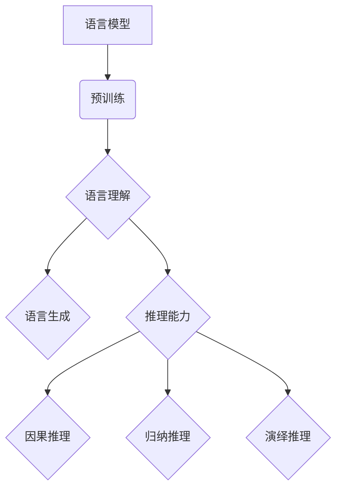

> 语言模型，推理能力，认知模型，自然语言处理，机器学习，可解释性，大模型挑战

# 语言与推理：大模型的认知挑战

### 1. 背景介绍

随着深度学习技术的飞速发展，语言模型（Language Models，LMs）在自然语言处理（Natural Language Processing，NLP）领域取得了显著的进展。这些模型，如BERT、GPT-3等，展现了惊人的语言理解和生成能力。然而，尽管这些模型在处理大量文本数据时表现出色，但它们的推理能力却一直是一个备受争议的话题。本文将深入探讨大语言模型在语言理解和推理方面的认知挑战，并分析其背后的原理和未来发展方向。

### 2. 核心概念与联系

#### 2.1 核心概念原理

**语言模型（Language Models）**：语言模型是用于预测下一个词或字符的概率分布的统计模型。它们通过学习大量文本数据来捕捉语言的统计规律。

**推理（Reasoning）**：推理是指从已知信息中推导出新信息的认知过程。在NLP中，推理能力包括因果推理、归纳推理和演绎推理等。

**认知模型（Cognitive Models）**：认知模型是模拟人类认知过程的模型，旨在理解和解释人类是如何理解和处理语言的。

#### 2.2 架构的 Mermaid 流程图



### 3. 核心算法原理 & 具体操作步骤

#### 3.1 算法原理概述

大语言模型通常基于深度神经网络，如Transformer，通过预训练学习语言的复杂模式和统计规律。这些模型在处理文本时，能够生成连贯的文本、回答问题、翻译语言等。

#### 3.2 算法步骤详解

1. **预训练**：在大规模文本语料库上进行预训练，学习语言模式。
2. **语言理解**：通过上下文理解词汇和句子的含义。
3. **语言生成**：根据给定的上下文生成连贯的文本。
4. **推理能力**：利用语言理解能力进行因果推理、归纳推理和演绎推理。

#### 3.3 算法优缺点

**优点**：

- 强大的语言理解能力。
- 能够生成连贯的文本。
- 能够进行简单的推理任务。

**缺点**：

- 推理能力有限，难以处理复杂逻辑。
- 可解释性差，难以理解模型的决策过程。
- 容易受到对抗样本的攻击。

#### 3.4 算法应用领域

- 文本生成。
- 问答系统。
- 机器翻译。
- 情感分析。
- 文本摘要。

### 4. 数学模型和公式 & 详细讲解 & 举例说明

#### 4.1 数学模型构建

语言模型通常基于概率模型，如隐马尔可夫模型（HMM）或神经网络模型，如Transformer。

#### 4.2 公式推导过程

以Transformer为例，其核心思想是自注意力（Self-Attention）机制：

$$
\text{Attention}(Q, K, V) = \text{softmax}\left(\frac{QK^T}{\sqrt{d_k}}\right) V
$$

其中，$Q$ 是查询向量，$K$ 是键向量，$V$ 是值向量，$d_k$ 是键向量的维度，softmax 是归一化函数。

#### 4.3 案例分析与讲解

假设我们有一个句子 "I like to read books"，我们可以使用Transformer来预测下一个词：

1. **编码**：将句子编码为向量序列。
2. **注意力计算**：计算每个词与其他词之间的注意力权重。
3. **解码**：根据注意力权重和前一个词的编码，预测下一个词。

### 5. 项目实践：代码实例和详细解释说明

#### 5.1 开发环境搭建

1. 安装Python和PyTorch。
2. 安装Hugging Face的Transformers库。

#### 5.2 源代码详细实现

```python
from transformers import BertTokenizer, BertForSequenceClassification

# 加载预训练模型和分词器
tokenizer = BertTokenizer.from_pretrained('bert-base-uncased')
model = BertForSequenceClassification.from_pretrained('bert-base-uncased')

# 加载文本
text = "I like to read books."

# 编码文本
encoded_input = tokenizer(text, return_tensors='pt')

# 预测
predictions = model(**encoded_input)

# 解码预测结果
labels = predictions.logits.argmax(dim=1)
print(labels)
```

#### 5.3 代码解读与分析

这段代码首先加载了BERT模型和分词器，然后对文本进行编码，并使用模型进行预测。预测结果是一个类别标签，表示文本的情感倾向。

### 6. 实际应用场景

#### 6.4 未来应用展望

大语言模型的推理能力将在以下领域得到更广泛的应用：

- 自动问答系统。
- 机器翻译。
- 智能助手。
- 法律文本分析。
- 医学诊断。

### 7. 工具和资源推荐

#### 7.1 学习资源推荐

- 《深度学习自然语言处理》
- 《Natural Language Processing with Transformers》
- arXiv论文预印本

#### 7.2 开发工具推荐

- PyTorch
- Hugging Face的Transformers库

#### 7.3 相关论文推荐

- "Attention is All You Need"
- "BERT: Pre-training of Deep Bidirectional Transformers for Language Understanding"
- "The Curious Case of Neural Text Generation"

### 8. 总结：未来发展趋势与挑战

#### 8.1 研究成果总结

本文深入探讨了语言模型在推理能力方面的认知挑战，分析了其背后的原理和未来发展方向。

#### 8.2 未来发展趋势

- 更强大的推理能力。
- 更高的可解释性。
- 更低的计算复杂度。

#### 8.3 面临的挑战

- 推理能力的提升。
- 可解释性的增强。
- 安全性和隐私保护。

#### 8.4 研究展望

未来，语言模型将在推理能力方面取得更大的突破，为人类社会带来更多便利。

### 9. 附录：常见问题与解答

**Q1：大语言模型的推理能力如何？**

A1：大语言模型的推理能力有限，难以处理复杂逻辑。

**Q2：如何提升大语言模型的推理能力？**

A2：可以通过改进模型结构、引入先验知识、使用对抗训练等方法提升大语言模型的推理能力。

**Q3：大语言模型的可解释性如何？**

A3：大语言模型的可解释性较差，难以理解模型的决策过程。

**Q4：如何增强大语言模型的可解释性？**

A4：可以通过可视化模型内部结构、使用可解释性增强技术等方法增强大语言模型的可解释性。

作者：禅与计算机程序设计艺术 / Zen and the Art of Computer Programming