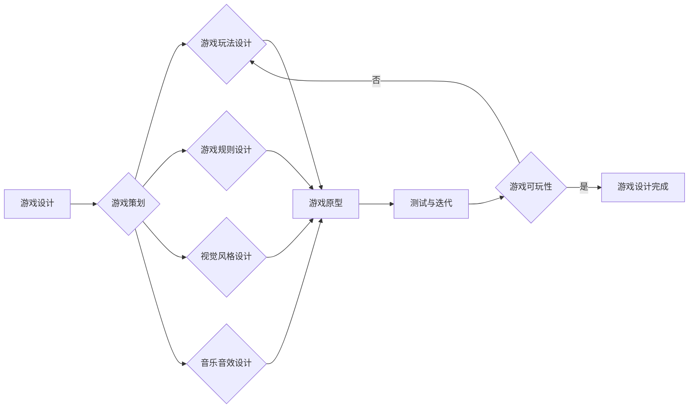

# 超级玛丽游戏的设计与实现

> 关键词：超级玛丽，游戏设计，游戏实现，游戏引擎，像素艺术，游戏逻辑，游戏开发

## 1. 背景介绍

超级玛丽（Super Mario）是一款经典的街机游戏，由日本任天堂公司开发，自1985年发布以来，已成为全球无数玩家的童年记忆。本文旨在探讨超级玛丽游戏的设计与实现，从核心概念到具体技术细节，解析这款经典游戏的魅力所在。

## 2. 核心概念与联系

### 2.1 游戏设计概念

游戏设计是游戏开发的第一步，它涉及到游戏的玩法、规则、视觉风格、音乐音效等多个方面。以下是游戏设计中的一些核心概念：

- **游戏玩法**：游戏的核心机制和操作方式。
- **游戏规则**：玩家在游戏中需要遵守的规则，如得分、生命值、关卡设计等。
- **视觉风格**：游戏的整体视觉风格，包括角色设计、背景设计、UI设计等。
- **音乐音效**：游戏中的音乐和音效，为游戏营造氛围。

以下是一个简单的Mermaid流程图，展示了游戏设计的基本流程：



### 2.2 游戏实现概念

游戏实现是游戏设计的具体实现过程，它涉及到编程语言、游戏引擎、开发工具等多个方面。以下是游戏实现的一些核心概念：

- **编程语言**：用于开发游戏的语言，如C++、C#、Python等。
- **游戏引擎**：用于构建游戏的软件框架，如Unity、Unreal Engine、GameMaker等。
- **开发工具**：辅助游戏开发的工具，如图像编辑器、音频编辑器、调试器等。

## 3. 核心算法原理 & 具体操作步骤

### 3.1 算法原理概述

超级玛丽游戏的核心算法主要包括以下几部分：

- **游戏逻辑**：处理游戏中的各种事件，如玩家的操作、敌人的移动、道具的收集等。
- **物理引擎**：模拟游戏中的物理现象，如角色的运动、碰撞检测等。
- **渲染引擎**：负责渲染游戏画面，包括角色、背景、效果等。

### 3.2 算法步骤详解

#### 3.2.1 游戏逻辑

游戏逻辑是游戏的核心，负责处理游戏中的各种事件。以下是一个简单的游戏逻辑流程：

1. 初始化游戏状态，包括玩家的位置、生命值、得分等。
2. 检测玩家的输入，如按键、触摸等。
3. 根据玩家的输入更新游戏状态，如移动玩家角色、改变游戏难度等。
4. 更新游戏画面，显示玩家角色和游戏环境。
5. 检测游戏结束条件，如玩家生命值为0、完成所有关卡等。

#### 3.2.2 物理引擎

物理引擎负责模拟游戏中的物理现象，如角色的运动、碰撞检测等。以下是一个简单的物理引擎流程：

1. 初始化物理参数，如重力、摩擦力等。
2. 更新角色位置，根据物理参数计算运动轨迹。
3. 进行碰撞检测，判断角色与其他物体是否发生碰撞。
4. 根据碰撞结果调整角色状态，如改变速度、播放音效等。

#### 3.2.3 渲染引擎

渲染引擎负责渲染游戏画面，包括角色、背景、效果等。以下是一个简单的渲染引擎流程：

1. 初始化渲染参数，如分辨率、颜色模式等。
2. 循环绘制游戏画面：
   - 绘制背景
   - 绘制角色
   - 绘制道具
   - 绘制效果
   - 刷新画面

### 3.3 算法优缺点

#### 3.3.1 优点

- **游戏体验良好**：合理的游戏逻辑和物理引擎设计，使得游戏体验流畅自然。
- **可扩展性强**：游戏设计采用模块化设计，方便后续扩展和修改。
- **易于学习**：游戏设计简单易懂，适合初学者学习和实践。

#### 3.3.2 缺点

- **开发周期较长**：游戏设计需要充分考虑各种细节，开发周期相对较长。
- **资源消耗较大**：游戏画面和音效等资源需要消耗较多内存和CPU资源。

### 3.4 算法应用领域

超级玛丽游戏的核心算法在游戏开发领域有着广泛的应用，如：

- **平台游戏**：如《塞尔达传说》、《马里奥赛车》等。
- **动作游戏**：如《王者荣耀》、《英雄联盟》等。
- **冒险游戏**：如《古剑奇谭》、《剑网3》等。

## 4. 数学模型和公式 & 详细讲解 & 举例说明

### 4.1 数学模型构建

超级玛丽游戏的数学模型主要包括以下几部分：

- **角色运动模型**：描述角色的运动轨迹，通常使用二次贝塞尔曲线或参数方程表示。
- **碰撞检测模型**：判断角色与其他物体是否发生碰撞，通常使用空间分割算法实现。

以下是一个简单的角色运动模型的数学公式：

$$
\begin{cases}
x(t) = x_0 + vt + \frac{1}{2}at^2 \\
y(t) = y_0 + vt + \frac{1}{2}at^2
\end{cases}
$$

其中，$x(t)$ 和 $y(t)$ 分别为角色在时间和空间中的位置，$v$ 为速度，$a$ 为加速度，$x_0$ 和 $y_0$ 为初始位置。

### 4.2 公式推导过程

角色运动模型的推导过程如下：

1. 根据牛顿第二定律，物体的加速度 $a$ 与作用力 $F$ 成正比，与物体质量 $m$ 成反比，即 $F = ma$。
2. 将作用力分解为水平和垂直两个方向，设水平方向的作用力为 $F_x$，垂直方向的作用力为 $F_y$，则有：
   - 水平方向：$F_x = m \cdot a_x$
   - 垂直方向：$F_y = m \cdot a_y$
3. 根据牛顿第三定律，作用力和反作用力大小相等、方向相反，即 $F_x = -F_x'$，$F_y = -F_y'$。
4. 假设水平方向没有摩擦力，则有 $F_x' = 0$，即水平方向的速度保持不变。
5. 根据上述分析，可以列出以下方程组：
   - 水平方向：$a_x = \frac{F_x}{m} = 0$
   - 垂直方向：$a_y = \frac{F_y}{m} = g$
6. 根据初速度 $v_0$ 和初始高度 $h_0$，可以求得角色的运动方程：
   - 水平方向：$x(t) = x_0 + v_0t$
   - 垂直方向：$y(t) = y_0 + v_0t - \frac{1}{2}gt^2$

### 4.3 案例分析与讲解

以下是一个简单的碰撞检测案例：

假设有一个矩形区域 $A$ 和一个圆形区域 $B$，需要判断它们是否发生碰撞。以下是碰撞检测的步骤：

1. 计算矩形区域 $A$ 的边界框 $A_{\text{bb}}$ 和圆形区域 $B$ 的边界框 $B_{\text{bb}}$。
2. 检查 $A_{\text{bb}}$ 和 $B_{\text{bb}}$ 是否相交：
   - 如果不相交，则 $A$ 和 $B$ 没有发生碰撞，结束检测。
   - 如果相交，则 $A$ 和 $B$ 发生了碰撞，需要进行进一步的碰撞响应处理。

以下是边界框相交的简单判断方法：

- 设矩形区域 $A$ 的左上角为 $(x_A, y_A)$，右下角为 $(x_B, y_B)$；圆形区域 $B$ 的圆心为 $(x_C, y_C)$，半径为 $r$。
- 如果 $x_A < x_C + r$ 且 $x_B > x_C - r$ 且 $y_A < y_C + r$ 且 $y_B > y_C - r$，则 $A$ 和 $B$ 发生了碰撞。

## 5. 项目实践：代码实例和详细解释说明

### 5.1 开发环境搭建

以下是一个使用Unity引擎开发超级玛丽游戏的开发环境搭建步骤：

1. 下载并安装Unity Hub。
2. 打开Unity Hub，创建一个新的Unity项目，选择2D项目模板。
3. 下载并安装必要的Unity插件，如2D物理引擎、Sprite Renderer等。
4. 下载并安装必要的Unity asset包，如马里奥角色、背景、道具等。

### 5.2 源代码详细实现

以下是一个简单的Unity C#代码示例，用于控制马里奥角色的移动：

```csharp
using System.Collections;
using System.Collections.Generic;
using UnityEngine;

public class MarioController : MonoBehaviour
{
    public float moveSpeed = 5f;
    private Rigidbody2D rb;
    private bool facingRight = true;

    void Start()
    {
        rb = GetComponent<Rigidbody2D>();
    }

    void Update()
    {
        float moveHorizontal = Input.GetAxis("Horizontal");
        rb.velocity = new Vector2(moveHorizontal * moveSpeed, rb.velocity.y);

        if (moveHorizontal > 0 && !facingRight)
        {
            Flip();
        }
        else if (moveHorizontal < 0 && facingRight)
        {
            Flip();
        }
    }

    void Flip()
    {
        facingRight = !facingRight;
        transform.Rotate(0f, 180f, 0f);
    }
}
```

### 5.3 代码解读与分析

以上代码实现了马里奥角色的水平移动和翻转功能。

- `moveSpeed` 变量用于控制马里奥角色的移动速度。
- `rb` 变量用于获取马里奥角色的Rigidbody2D组件。
- `facingRight` 变量用于记录马里奥角色的朝向。
- `Update` 方法在每个帧更新时调用，获取玩家的输入并更新马里奥角色的速度。
- `Flip` 方法用于翻转马里奥角色的朝向。

### 5.4 运行结果展示

运行上述代码，可以看到马里奥角色会根据玩家的输入水平移动，并在需要时翻转朝向。

## 6. 实际应用场景

超级玛丽游戏的设计与实现具有广泛的应用场景，以下是一些例子：

- **游戏开发教育**：超级玛丽游戏的设计与实现可以作为游戏开发教育的案例，帮助初学者了解游戏开发的基本流程和技术。
- **游戏开发实践**：超级玛丽游戏的设计与实现可以作为游戏开发实践的项目，提高开发者的实际操作能力。
- **游戏引擎开发**：超级玛丽游戏的设计与实现可以作为游戏引擎开发的参考，帮助开发者理解游戏引擎的核心技术。

## 7. 工具和资源推荐

### 7.1 学习资源推荐

- **书籍**：
  - 《Unity游戏开发实战》
  - 《Unity 2018游戏开发从入门到精通》
  - 《游戏编程模式》
- **在线课程**：
  - Unity官方教程
  - Udemy游戏开发课程
  - Coursera游戏设计课程
- **网站**：
  - Unity官方论坛
  - Stack Overflow
  - 游戏开发博客

### 7.2 开发工具推荐

- **游戏引擎**：
  - Unity
  - Unreal Engine
  - Godot
- **编辑器**：
  - Photoshop
  - Illustrator
  - Audacity
- **开发语言**：
  - C#
  - C++
  - Python

### 7.3 相关论文推荐

- **《A Survey of Game Design and Development》**：概述了游戏设计和开发的基本概念、技术和工具。
- **《Game Engine Architecture》**：介绍了游戏引擎的设计原则和实现方法。
- **《Game Programming Patterns》**：总结了游戏编程中的常见模式和最佳实践。

## 8. 总结：未来发展趋势与挑战

### 8.1 研究成果总结

超级玛丽游戏的设计与实现为我们提供了丰富的游戏开发经验和启示。通过本文的介绍，我们了解了游戏设计的基本概念、核心算法和实现方法。同时，我们还探讨了超级玛丽游戏在游戏开发教育、游戏开发实践和游戏引擎开发等方面的应用。

### 8.2 未来发展趋势

随着游戏技术的不断发展，未来超级玛丽游戏的设计与实现可能会呈现出以下发展趋势：

- **更加复杂和丰富的游戏玩法**：游戏设计将更加注重玩家的体验和互动性。
- **更加精美的视觉效果**：游戏画面将更加精美，视觉风格更加多样化。
- **更加丰富的音乐音效**：游戏音效将更加生动，为玩家营造更好的游戏氛围。

### 8.3 面临的挑战

在超级玛丽游戏的设计与实现过程中，我们可能会面临以下挑战：

- **游戏开发难度增加**：游戏设计越来越复杂，对开发者的技术要求越来越高。
- **游戏开发成本增加**：游戏开发需要投入更多的人力、物力和财力。
- **游戏市场竞争加剧**：游戏市场竞争激烈，游戏质量要求越来越高。

### 8.4 研究展望

面对未来游戏开发的挑战，我们需要从以下几个方面进行研究和探索：

- **游戏设计创新**：不断探索新的游戏玩法、游戏机制和游戏主题。
- **游戏技术突破**：研究新的游戏开发技术，提高游戏质量和开发效率。
- **游戏产业生态建设**：加强游戏产业链上下游的协同，促进游戏产业的健康发展。

通过不断的研究和探索，相信超级玛丽游戏的设计与实现将会在未来游戏开发中发挥更大的作用。

## 9. 附录：常见问题与解答

**Q1：超级玛丽游戏的设计与实现需要哪些技术？**

A：超级玛丽游戏的设计与实现需要以下技术：

- 游戏设计
- 游戏开发
- 游戏引擎
- 编程语言
- 图形渲染
- 音频处理
- 物理引擎

**Q2：如何使用Unity引擎开发超级玛丽游戏？**

A：使用Unity引擎开发超级玛丽游戏需要以下步骤：

1. 创建Unity项目
2. 设计游戏场景
3. 创建游戏角色
4. 编写游戏逻辑代码
5. 测试和优化游戏

**Q3：超级玛丽游戏的设计与实现有哪些应用场景？**

A：超级玛丽游戏的设计与实现具有以下应用场景：

- 游戏开发教育
- 游戏开发实践
- 游戏引擎开发

**Q4：如何提高超级玛丽游戏的质量？**

A：提高超级玛丽游戏的质量可以从以下几个方面入手：

- 优化游戏设计，提高游戏玩法和游戏机制
- 优化游戏画面和音效
- 优化游戏性能，提高运行速度和稳定性
- 加强游戏测试，确保游戏质量

作者：禅与计算机程序设计艺术 / Zen and the Art of Computer Programming