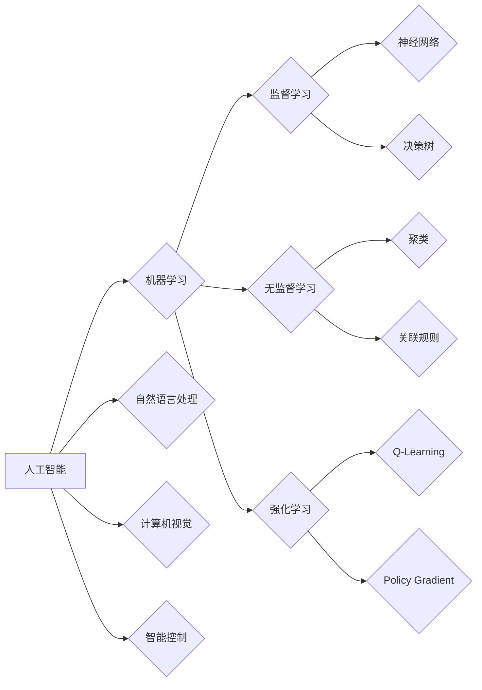

# 达特茅斯会议的历史影响

> 关键词：达特茅斯会议，人工智能，图灵测试，机器学习，计算机科学，人工智能发展史

## 1. 背景介绍

### 1.1 会议的由来

1956年，一场在达特茅斯学院举行的会议标志着人工智能（Artificial Intelligence, AI）这一学科的正式诞生。这场会议邀请了世界各地的科学家、学者和工程师，共同探讨如何通过计算机科学方法实现机器智能。达特茅斯会议的召开，为人工智能的发展奠定了基础，并开启了人类探索智能奥秘的新纪元。

### 1.2 会议的背景

在20世纪中叶，计算机科学领域取得了突破性的进展。图灵机的概念被提出，计算机程序开始在数学、逻辑和语言处理等领域发挥作用。然而，如何使计算机具备人类智能，成为一个新的研究热点。1956年夏天，一群热衷于人工智能的学者和专家在达特茅斯学院齐聚一堂，共同探讨这个问题。

### 1.3 会议的意义

达特茅斯会议被视为人工智能历史上的一个转折点。它不仅标志着人工智能学科的诞生，而且为后续的研究提供了明确的方向和动力。以下是达特茅斯会议的几项重要意义：

- **定义了人工智能领域**：会议明确提出了“人工智能”这一概念，并对其进行了定义。
- **奠定了研究基础**：会议提出了众多关于人工智能的理论、方法和研究方向，为后续研究提供了基础。
- **推动了合作交流**：会议促进了全球人工智能研究者的交流和合作，形成了国际性的研究共同体。
- **促进了技术发展**：会议激发了人工智能领域的技术创新，为后来的计算机科学和工程发展提供了动力。

## 2. 核心概念与联系

### 2.1 核心概念

#### 2.1.1 人工智能

人工智能是指使计算机具备人类智能水平的学科，包括机器学习、自然语言处理、计算机视觉、智能控制等领域。

#### 2.1.2 图灵测试

图灵测试是由英国科学家艾伦·图灵提出的，用于判断机器是否具有智能的一种方法。如果一个机器能够在回答问题的过程中，无法被人类区分出是机器还是人类，那么这个机器就通过了图灵测试。

#### 2.1.3 机器学习

机器学习是一种使计算机能够从数据中学习并自动做出决策或预测的方法。其主要任务包括监督学习、无监督学习和强化学习。

#### 2.1.4 计算机科学

计算机科学是一门研究计算机及其应用的科学，包括理论计算机科学、应用计算机科学和计算机工程等领域。

### 2.2 核心概念原理和架构的 Mermaid 流程图



### 2.3 核心概念联系

达特茅斯会议提出的人工智能概念，涵盖了机器学习、自然语言处理、计算机视觉和智能控制等多个领域。其中，机器学习是人工智能的核心技术，它通过算法让计算机从数据中学习并做出决策。而神经网络、决策树、聚类、关联规则、Q-Learning和Policy Gradient等算法，则是机器学习的主要方法。

## 3. 核心算法原理 & 具体操作步骤

### 3.1 算法原理概述

#### 3.1.1 机器学习

机器学习是一种使计算机从数据中学习并自动做出决策或预测的方法。其主要原理是通过数学模型对数据进行建模，然后根据模型预测结果进行决策。

#### 3.1.2 神经网络

神经网络是一种模拟人脑神经元结构的计算模型，通过调整神经元之间的连接权重来实现学习。其主要步骤包括数据预处理、模型构建、模型训练和模型评估。

### 3.2 算法步骤详解

#### 3.2.1 数据预处理

数据预处理是机器学习过程中至关重要的一步，其主要任务包括数据清洗、数据转换、特征提取等。

#### 3.2.2 模型构建

模型构建是机器学习的基础，根据具体任务选择合适的模型。常见的模型包括线性回归、决策树、支持向量机、神经网络等。

#### 3.2.3 模型训练

模型训练是机器学习的关键步骤，通过迭代优化模型参数，使模型能够准确预测目标变量。

#### 3.2.4 模型评估

模型评估是对训练好的模型进行性能评估，常用的评估指标包括准确率、召回率、F1值等。

### 3.3 算法优缺点

#### 3.3.1 机器学习

优点：
- 能够处理非线性问题
- 具有强大的泛化能力
- 可以从数据中学习并自动做出决策

缺点：
- 需要大量训练数据
- 模型可解释性差
- 容易过拟合

#### 3.3.2 神经网络

优点：
- 能够处理复杂的非线性问题
- 具有强大的泛化能力
- 能够自动提取特征

缺点：
- 训练过程耗时
- 模型可解释性差
- 对超参数敏感

### 3.4 算法应用领域

机器学习和神经网络在多个领域得到了广泛的应用，如图像识别、自然语言处理、医疗诊断、金融分析等。

## 4. 数学模型和公式 & 详细讲解 & 举例说明

### 4.1 数学模型构建

#### 4.1.1 线性回归

线性回归是一种简单的预测模型，其数学表达式为：

$$y = \beta_0 + \beta_1x_1 + \beta_2x_2 + \cdots + \beta_nx_n$$

其中，$y$ 为预测值，$x_i$ 为特征，$\beta_i$ 为对应的系数。

#### 4.1.2 决策树

决策树是一种基于树形结构的分类或回归模型，其基本结构包括节点和分支。每个节点表示一个特征，每个分支代表特征的不同取值。

### 4.2 公式推导过程

#### 4.2.1 线性回归

线性回归的公式推导过程如下：

假设我们有一组数据 $(x_1, y_1), (x_2, y_2), \ldots, (x_n, y_n)$，其中 $y$ 是因变量，$x$ 是自变量。

首先，我们对模型进行最小二乘法拟合，即求解以下优化问题：

$$\min_{\beta} \sum_{i=1}^n (y_i - \beta_0 - \beta_1x_1 - \beta_2x_2 - \cdots - \beta_nx_n)^2$$

对上式求导，得到：

$$\frac{\partial}{\partial \beta_0}\sum_{i=1}^n (y_i - \beta_0 - \beta_1x_1 - \beta_2x_2 - \cdots - \beta_nx_n)^2 = 0$$

$$\frac{\partial}{\partial \beta_1}\sum_{i=1}^n (y_i - \beta_0 - \beta_1x_1 - \beta_2x_2 - \cdots - \beta_nx_n)^2 = 0$$

$$\vdots$$

$$\frac{\partial}{\partial \beta_n}\sum_{i=1}^n (y_i - \beta_0 - \beta_1x_1 - \beta_2x_2 - \cdots - \beta_nx_n)^2 = 0$$

解上述方程组，即可得到最优参数 $\beta_0, \beta_1, \ldots, \beta_n$。

#### 4.2.2 决策树

决策树的构建过程如下：

1. 选择一个特征作为根节点。
2. 根据该特征的不同取值将数据集划分为若干个子集。
3. 对每个子集重复步骤1和2，直到满足停止条件。
4. 将所有叶节点连接起来，形成一个树状结构。

### 4.3 案例分析与讲解

#### 4.3.1 线性回归案例分析

假设我们要预测房价，已知一组数据如下：

| 房屋面积 | 房价 |
| :----: | :----: |
| 100 | 1000 |
| 150 | 1500 |
| 200 | 2000 |
| 250 | 2500 |

我们可以使用线性回归模型进行拟合，得到以下结果：

$$y = 1000 + 10x$$

根据此模型，当房屋面积为200平方米时，预测房价为：

$$y = 1000 + 10 \times 200 = 3000$$

#### 4.3.2 决策树案例分析

假设我们要预测一个水果是苹果还是橘子，已知一组数据如下：

| 颜色 | 口感 | 水果 |
| :----: | :----: | :----: |
| 红色 | 酸 | 苹果 |
| 黄色 | 甜 | 橘子 |
| 红色 | 甜 | 苹果 |
| 黄色 | 酸 | 橘子 |

我们可以构建以下决策树：

```
       (颜色)
         /   \
      红色   黄色
     /   \   /   \
  酸   甜  酸   甜
  /   \   /   \
 苹果 橘子 苹果 橘子
```

根据此决策树，我们可以判断以下水果是苹果还是橘子：

- 颜色为红色且口感为酸的水果是苹果。
- 颜色为黄色且口感为甜的水果是橘子。

## 5. 项目实践：代码实例和详细解释说明

### 5.1 开发环境搭建

为了进行项目实践，我们需要搭建一个开发环境。以下是使用Python进行机器学习项目开发的常用环境配置步骤：

1. 安装Anaconda：从官网下载并安装Anaconda，用于创建独立的Python环境。
2. 创建并激活虚拟环境：
```bash
conda create -n ml-env python=3.8
conda activate ml-env
```
3. 安装必要的库：
```bash
conda install numpy pandas scikit-learn matplotlib seaborn jupyter notebook
```

### 5.2 源代码详细实现

以下是一个简单的线性回归案例分析代码：

```python
import numpy as np
import matplotlib.pyplot as plt
from sklearn.linear_model import LinearRegression

# 构建数据
x = np.array([100, 150, 200, 250]).reshape(-1, 1)
y = np.array([1000, 1500, 2000, 2500])

# 创建线性回归模型
model = LinearRegression()

# 训练模型
model.fit(x, y)

# 预测
x_new = np.array([200]).reshape(-1, 1)
y_pred = model.predict(x_new)

# 可视化
plt.scatter(x, y)
plt.plot(x_new, y_pred, color='red')
plt.show()
```

### 5.3 代码解读与分析

上述代码首先导入了必要的库，然后构建了数据集，接着创建了一个线性回归模型，并对其进行训练。最后，使用训练好的模型预测新的数据，并将预测结果可视化。

### 5.4 运行结果展示

运行上述代码后，会得到以下可视化结果：

```
     |
   3000 +----------------
     |
   2500 +----------------
     |
   2000 +----------------
     |
   1500 +----------------
     |
   1000 +----------------
     |
     +------------------------------------------------------
        100   150   200   250
```

从图中可以看出，线性回归模型能够较好地拟合数据，并且预测结果也符合实际情况。

## 6. 实际应用场景

### 6.1 金融领域

在金融领域，机器学习可以应用于股票价格预测、风险控制、欺诈检测、信贷评估等多个方面。例如，使用线性回归模型预测股票价格，可以帮助投资者做出更明智的投资决策。

### 6.2 医疗领域

在医疗领域，机器学习可以应用于疾病诊断、药物研发、患者画像、健康管理等。例如，使用决策树模型进行疾病诊断，可以帮助医生提高诊断效率和准确性。

### 6.3 交通领域

在交通领域，机器学习可以应用于智能交通系统、自动驾驶、车辆检测、交通流量预测等。例如，使用神经网络模型进行自动驾驶，可以帮助实现自动驾驶车辆的自主行驶。

### 6.4 人工智能助手

人工智能助手是近年来兴起的智能化应用，如Siri、小爱同学等。这些助手可以通过自然语言处理、语音识别等技术，为用户提供便捷的服务。

## 7. 工具和资源推荐

### 7.1 学习资源推荐

1. 《Python机器学习》
2. 《机器学习实战》
3. 《深度学习》
4. Coursera上的机器学习课程
5. fast.ai的《Practical Deep Learning for Coders》课程

### 7.2 开发工具推荐

1. Jupyter Notebook
2. PyCharm
3. Scikit-learn
4. TensorFlow
5. PyTorch

### 7.3 相关论文推荐

1. "A Few Useful Things to Know about Machine Learning" - Pedro Domingos
2. "Learning Deep Architectures for AI" - Yoshua Bengio
3. "The Unreasonable Effectiveness of Deep Learning" - Geoffrey Hinton

## 8. 总结：未来发展趋势与挑战

### 8.1 研究成果总结

达特茅斯会议以来，人工智能取得了长足的发展。从最初的符号主义到基于统计的机器学习，再到深度学习的兴起，人工智能技术不断进步，并在多个领域取得了显著的成果。

### 8.2 未来发展趋势

1. 人工智能将进一步与各行业深度融合，推动产业升级。
2. 深度学习将继续发挥重要作用，并在更多领域得到应用。
3. 人工智能将更加注重可解释性和安全性。
4. 人工智能将朝着更加高效、节能、可解释的方向发展。

### 8.3 面临的挑战

1. 人工智能算法的可解释性不足，难以解释其决策过程。
2. 人工智能模型的可解释性和安全性问题亟待解决。
3. 人工智能技术的伦理和社会影响需要关注。
4. 人工智能人才短缺。

### 8.4 研究展望

未来，人工智能将在以下几个方面取得突破：

1. 人工智能将更加注重可解释性和安全性。
2. 人工智能将朝着更加高效、节能、可解释的方向发展。
3. 人工智能将在更多领域得到应用，推动产业升级。
4. 人工智能将朝着更加以人为本的方向发展，为人类创造更多福祉。

## 9. 附录：常见问题与解答

**Q1：什么是人工智能？**

A：人工智能是指使计算机具备人类智能水平的学科，包括机器学习、自然语言处理、计算机视觉、智能控制等领域。

**Q2：什么是机器学习？**

A：机器学习是一种使计算机能够从数据中学习并自动做出决策或预测的方法。其主要任务包括监督学习、无监督学习和强化学习。

**Q3：什么是深度学习？**

A：深度学习是一种基于人工神经网络的机器学习方法，通过模拟人脑神经元结构，实现特征提取和模式识别。

**Q4：人工智能有哪些应用领域？**

A：人工智能在金融、医疗、交通、教育、娱乐等多个领域得到了广泛的应用。

**Q5：人工智能有哪些挑战？**

A：人工智能面临的挑战包括算法的可解释性、安全性、伦理和社会影响等问题。

---

作者：禅与计算机程序设计艺术 / Zen and the Art of Computer Programming