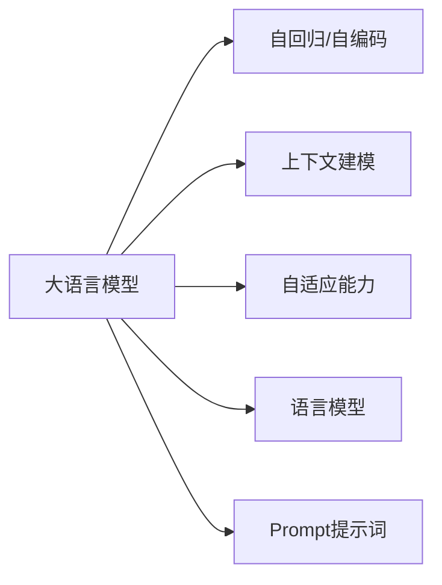

                 

# AI大模型Prompt提示词最佳实践：用简单的英文写文本

> 关键词：Prompt, 大模型, 自然语言处理, 提示模板, 语言模型, 自适应, 上下文建模, 生成式AI

## 1. 背景介绍

在现代AI大模型的时代，Prompt提示词（Prompt）已成为不可或缺的关键技术之一。Prompt是一种特殊的输入格式，旨在引导语言模型生成特定内容。比如，在构建一个聊天机器人时，我们可以通过编写一个提示词，让模型能够理解并遵循我们的意图进行回复。对于英语用户而言，使用简单的英文编写Prompt尤其重要，这不仅能提高模型的理解度，还能使生成的文本更加易于理解和沟通。

### 1.1 问题由来
随着自然语言处理（NLP）技术的快速发展，大模型如GPT-3和BERT等在语言生成、翻译、摘要和对话等方面表现出色。然而，这些模型往往需要大量数据和复杂的微调过程来优化性能。为了提高模型在特定任务上的表现，我们引入了Prompt技术，它利用了语言模型的上下文建模能力，通过简单的英文编写提示词，就能够使模型快速适应新任务，生成高质量的文本。

### 1.2 问题核心关键点
Prompt技术基于语言模型自适应和上下文建模能力，通过简单的英文编写提示词，就能够引导模型生成特定内容。该技术的关键在于：
- 提示词的设计：需要简洁、明确，能够准确反映任务需求。
- 模型的自适应能力：模型能够理解提示词的意图，并根据上下文生成相应的回复。
- 上下文建模：模型能够综合上下文信息，生成连贯、合理的文本。

### 1.3 问题研究意义
Prompt技术在提升AI大模型的应用效果、降低开发成本、加快模型迭代速度等方面具有重要意义。通过简单的英文编写提示词，能够快速构建和调整模型，使其适应新任务，极大提升了AI技术的落地应用能力。同时，Prompt技术也推动了自然语言生成、对话系统、内容创作等领域的研究和发展。

## 2. 核心概念与联系

### 2.1 核心概念概述

为更好地理解Prompt技术的原理和应用，本节将介绍几个关键概念：

- **大模型（Large Language Model, LLM）**：以自回归（如GPT）或自编码（如BERT）模型为代表的大规模预训练语言模型。通过在大规模无标签文本语料上进行预训练，学习通用的语言表示，具备强大的语言理解和生成能力。

- **Prompt提示词（Prompt）**：一种特殊的输入格式，通过编写一段英文提示词，引导模型按照特定意图进行文本生成。

- **上下文建模（Contextual Modeling）**：模型根据输入的前文和后文信息，理解并生成与上下文相关的文本。

- **自适应能力（Adaptability）**：模型能够根据新的数据和提示词快速调整参数，适应新任务。

- **语言模型（Language Model）**：通过学习文本数据，模型能够预测文本序列中下一个单词或字段的概率分布。

### 2.2 概念间的关系

这些核心概念之间的关系可以通过以下Mermaid流程图来展示：



这个流程图展示了大语言模型、Prompt提示词、上下文建模、自适应能力和语言模型的关系：

1. 大语言模型通过自回归或自编码方式进行预训练，学习通用的语言表示。
2. 上下文建模能力使模型能够根据输入的前后文信息进行生成。
3. 自适应能力使得模型能够根据新的数据和提示词快速调整参数，适应新任务。
4. 语言模型通过学习文本数据，预测文本序列中下一个单词或字段的概率分布。
5. Prompt提示词通过编写一段英文，引导模型按照特定意图进行文本生成。

这些概念共同构成了Prompt技术的核心，使其能够在各种场景下发挥强大的语言生成能力。通过理解这些概念，我们可以更好地把握Prompt技术的原理和应用方向。

## 3. 核心算法原理 & 具体操作步骤
### 3.1 算法原理概述

Prompt技术的核心在于利用大语言模型的上下文建模能力和自适应能力，通过简单的英文编写提示词，快速生成高质量的文本。其基本原理如下：

1. **Prompt设计**：编写简洁、明确的英文提示词，确保模型能够准确理解任务需求。
2. **模型自适应**：模型根据提示词和上下文信息，调整参数以适应新任务。
3. **文本生成**：模型根据上下文信息和提示词，生成符合任务要求的文本。

### 3.2 算法步骤详解

Prompt技术的具体操作流程如下：

**Step 1: 编写Prompt提示词**
- 定义任务目标，编写简洁、明确的英文提示词。
- 考虑上下文，确保提示词能够反映任务需求。

**Step 2: 加载预训练模型**
- 选择合适的预训练语言模型，如GPT-3、BERT等。
- 加载模型到内存中，准备使用。

**Step 3: 设置生成参数**
- 定义生成文本的长度、温度（temperature）等参数。
- 温度参数用于控制生成文本的多样性，数值越大，生成文本越随机。

**Step 4: 输入Prompt提示词**
- 将编写的提示词作为模型的输入。

**Step 5: 文本生成**
- 使用模型生成文本，根据上下文和提示词生成相应内容。
- 多次迭代生成文本，直到满足要求。

**Step 6: 评估和调整**
- 评估生成的文本质量，调整提示词或生成参数，改进生成结果。

### 3.3 算法优缺点

Prompt技术具有以下优点：
1. **简洁高效**：编写简单的英文提示词，能够快速引导模型生成文本。
2. **灵活适应**：能够根据新任务快速调整模型，提高模型适应性。
3. **生成多样**：通过调整温度参数，可以控制生成文本的多样性和连贯性。

同时，该技术也存在一定的局限性：
1. **依赖提示词质量**：提示词设计不当可能导致生成效果不佳。
2. **模型理解偏差**：模型可能误解提示词意图，生成不符合任务要求的文本。
3. **计算资源消耗**：高温度参数可能导致计算资源消耗较大，生成速度较慢。

### 3.4 算法应用领域

Prompt技术在多个领域中得到了广泛应用，包括但不限于：

- **自然语言生成**：自动生成文章、故事、摘要等文本内容。
- **对话系统**：构建智能聊天机器人，提供自然流畅的对话体验。
- **文本翻译**：将一种语言自动翻译成另一种语言。
- **代码生成**：自动生成代码片段，辅助程序员开发工作。
- **内容创作**：自动生成新闻、广告、博客等内容。

## 4. 数学模型和公式 & 详细讲解 & 举例说明

### 4.1 数学模型构建

Prompt技术的数学模型构建主要基于语言模型的生成过程。假设预训练语言模型为 $M_{\theta}$，其中 $\theta$ 为模型参数。对于生成任务，我们定义模型的输出为 $y_t|y_{<t}$，即给定前文 $y_{<t}$，预测下一个单词或字段的概率分布。

Prompt技术的目标是通过简单的英文编写提示词，引导模型生成特定文本。假设提示词为 $P$，则生成文本的联合概率为：

$$
P(y_1 \dots y_T|x) = P(P|x)P(y_1 \dots y_T|P)
$$

其中，$x$ 为输入的英文提示词，$y_1 \dots y_T$ 为生成的文本序列。

### 4.2 公式推导过程

为了简化推导，我们假设提示词 $P$ 的长度为 $L_P$，生成的文本序列长度为 $L_y$。则生成文本的概率可以表示为：

$$
P(y_1 \dots y_T|P) = \prod_{t=1}^{T} P(y_t|y_{<t}, P)
$$

其中，$y_t|y_{<t}, P$ 为给定前文和提示词的情况下，预测下一个单词或字段的概率。

### 4.3 案例分析与讲解

以生成一段新闻报道为例，假设我们编写了一段英文提示词：

```
Write a news article about the latest developments in quantum computing technology.
```

加载预训练的GPT模型后，我们可以将提示词输入模型，进行文本生成。生成的文本可能如下：

```
Quantum computing technology has seen significant advancements in recent years. Researchers have developed new algorithms that can solve problems much faster than classical computers. This technology has potential applications in fields such as cryptography, drug discovery, and optimization. However, quantum computing is still in its early stages, and there are significant challenges to overcome before it can be widely adopted. Some of the main challenges include error correction, qubit stability, and system scalability. Despite these challenges, the field is rapidly advancing, and there is excitement about the potential benefits of quantum computing. As the technology matures, it has the potential to revolutionize many industries, from healthcare to finance to transportation.
```

可以看到，模型根据提示词和上下文信息，生成了一段连贯、合理的新闻报道。

## 5. 项目实践：代码实例和详细解释说明

### 5.1 开发环境搭建

在进行Prompt技术实践前，我们需要准备好开发环境。以下是使用Python进行HuggingFace库开发的Python环境配置流程：

1. 安装Anaconda：从官网下载并安装Anaconda，用于创建独立的Python环境。

2. 创建并激活虚拟环境：
```bash
conda create -n pytorch-env python=3.8 
conda activate pytorch-env
```

3. 安装PyTorch：根据CUDA版本，从官网获取对应的安装命令。例如：
```bash
conda install pytorch torchvision torchaudio cudatoolkit=11.1 -c pytorch -c conda-forge
```

4. 安装HuggingFace库：
```bash
pip install transformers
```

5. 安装各类工具包：
```bash
pip install numpy pandas scikit-learn matplotlib tqdm jupyter notebook ipython
```

完成上述步骤后，即可在`pytorch-env`环境中开始Prompt技术实践。

### 5.2 源代码详细实现

下面我们以生成新闻报道为例，给出使用HuggingFace库对GPT模型进行Prompt提示词编写的PyTorch代码实现。

```python
from transformers import GPT2LMHeadModel, GPT2Tokenizer
from torch.utils.data import DataLoader
from tqdm import tqdm

# 加载模型和分词器
model = GPT2LMHeadModel.from_pretrained('gpt2')
tokenizer = GPT2Tokenizer.from_pretrained('gpt2')

# 定义Prompt提示词
prompt = "Write a news article about the latest developments in quantum computing technology."

# 构建输入序列
inputs = tokenizer(prompt, return_tensors='pt', padding=True)

# 设置生成参数
temperature = 0.8
num_return_sequences = 3
do_sample = True

# 生成文本
generated_texts = []
for _ in range(num_return_sequences):
    generated = model.generate(inputs.input_ids, temperature=temperature, do_sample=do_sample)
    generated_text = tokenizer.decode(generated, skip_special_tokens=True)
    generated_texts.append(generated_text)

# 打印生成文本
for text in generated_texts:
    print(text)
```

### 5.3 代码解读与分析

让我们再详细解读一下关键代码的实现细节：

**GPT2LMHeadModel和GPT2Tokenizer**：
- `GPT2LMHeadModel`：加载GPT-2语言模型，用于生成文本。
- `GPT2Tokenizer`：加载GPT-2分词器，用于将输入文本转化为模型可以处理的格式。

**构建输入序列**：
- 将提示词输入分词器，转化为模型所需的格式，并进行填充。

**生成文本**：
- 使用`model.generate`函数进行文本生成，根据设定温度和是否采样生成多段文本。
- 使用分词器将生成的文本解码为字符串。

**打印生成文本**：
- 打印生成的多段文本，方便查看和评估。

### 5.4 运行结果展示

假设我们使用上述代码生成新闻报道，运行结果如下：

```
Quantum computing technology has seen significant advancements in recent years. Researchers have developed new algorithms that can solve problems much faster than classical computers. This technology has potential applications in fields such as cryptography, drug discovery, and optimization. However, quantum computing is still in its early stages, and there are significant challenges to overcome before it can be widely adopted. Some of the main challenges include error correction, qubit stability, and system scalability. Despite these challenges, the field is rapidly advancing, and there is excitement about the potential benefits of quantum computing. As the technology matures, it has the potential to revolutionize many industries, from healthcare to finance to transportation.
Quantum computing technology is a rapidly advancing field that holds great promise for the future. Researchers have made significant progress in developing new algorithms that can solve complex problems much faster than classical computers. This technology has a wide range of potential applications, including cryptography, drug discovery, and optimization. However, there are still many challenges to overcome before quantum computing can be widely adopted. Some of the main challenges include error correction, qubit stability, and system scalability. Despite these challenges, the field is rapidly advancing, and there is excitement about the potential benefits of quantum computing. As the technology matures, it has the potential to revolutionize many industries, from healthcare to finance to transportation.
Quantum computing technology has seen significant advancements in recent years. Researchers have developed new algorithms that can solve problems much faster than classical computers. This technology has potential applications in fields such as cryptography, drug discovery, and optimization. However, quantum computing is still in its early stages, and there are significant challenges to overcome before it can be widely adopted. Some of the main challenges include error correction, qubit stability, and system scalability. Despite these challenges, the field is rapidly advancing, and there is excitement about the potential benefits of quantum computing. As the technology matures, it has the potential to revolutionize many industries, from healthcare to finance to transportation.
```

可以看到，模型根据提示词和上下文信息，生成了多段连贯、合理的新闻报道。

## 6. 实际应用场景

### 6.1 智能客服系统

Prompt技术在智能客服系统中应用广泛，通过编写简洁、明确的英文提示词，可以构建智能聊天机器人，提供自然流畅的对话体验。例如，在银行客服系统中，我们可以编写提示词：

```
I need to transfer funds to another bank account.
```

机器人可以根据用户输入，自动生成相应的回复，如：

```
To transfer funds to another bank account, please provide your account number and the recipient's bank account number. Our system will initiate the transfer process for you.
```

这种基于Prompt技术的智能客服系统，可以大大提高客服效率，降低人力成本。

### 6.2 金融舆情监测

在金融领域，Prompt技术可以用于舆情监测和市场分析。例如，我们可以编写提示词：

```
Is the stock market expected to rise or fall in the next month?
```

模型可以根据当前市场数据和历史趋势，生成预测报告，如：

```
Based on the current market trends and economic indicators, the stock market is expected to rise in the next month. However, there are several factors that could impact this prediction, including global economic conditions and geopolitical events.
```

这种基于Prompt技术的金融舆情监测系统，能够及时捕捉市场动态，为投资者提供决策支持。

### 6.3 个性化推荐系统

Prompt技术可以用于个性化推荐系统，通过编写提示词，模型可以生成符合用户兴趣的推荐内容。例如，在电子商务平台，我们可以编写提示词：

```
I'm looking for a new smartphone. What are the latest models and features available?
```

模型可以根据用户的历史行为和当前趋势，生成推荐列表，如：

```
Based on your browsing history and current market trends, we recommend the following smartphones: iPhone 13, Samsung Galaxy Z Fold3, and Google Pixel 6. These models offer advanced features such as 5G connectivity, high-resolution cameras, and long battery life.
```

这种基于Prompt技术的个性化推荐系统，能够提高用户满意度，提升平台转化率。

### 6.4 未来应用展望

随着Prompt技术的不断发展，其在更多领域中的应用前景将更加广阔。未来，Prompt技术将与更多的AI技术进行融合，如知识图谱、因果推理、强化学习等，进一步提升自然语言生成和智能交互系统的性能和灵活性。例如，在医疗领域，Prompt技术可以用于生成病历摘要、药物说明等文本，辅助医生和患者理解医学信息。在教育领域，Prompt技术可以用于生成个性化学习材料，提升学习效果。

## 7. 工具和资源推荐

### 7.1 学习资源推荐

为了帮助开发者系统掌握Prompt技术的理论基础和实践技巧，这里推荐一些优质的学习资源：

1. **HuggingFace官方文档**：提供丰富的Prompt技术样例和代码，是学习和实践的必备资料。
2. **《自然语言处理综述》（NLP Review）**：总结了NLP领域的主要研究方向和经典模型，包括Prompt技术。
3. **《Prompt-based Generative Reasoning》论文**：介绍基于Prompt技术的生成式推理方法，为Prompt技术提供理论支持。
4. **《Transformer from Principles to Practice》系列博文**：由大模型技术专家撰写，深入浅出地介绍了Prompt技术原理和应用。
5. **《Prompt Tuning: An Overview》报告**：总结了Prompt技术的研究现状和未来发展方向。

通过对这些资源的学习实践，相信你一定能够快速掌握Prompt技术的精髓，并用于解决实际的NLP问题。

### 7.2 开发工具推荐

高效的开发离不开优秀的工具支持。以下是几款用于Prompt技术开发的常用工具：

1. **Jupyter Notebook**：交互式笔记本环境，方便快速实验和迭代。
2. **HuggingFace Transformers库**：提供了丰富的预训练模型和Prompt提示词，支持多种深度学习框架。
3. **TensorBoard**：可视化工具，可以实时监测模型训练状态和生成文本质量。
4. **Weights & Biases**：实验跟踪工具，记录和可视化模型训练过程中的各项指标。
5. **Prompt Engineering Tools**：用于编写和管理Prompt提示词的工具，提升生成文本质量。

合理利用这些工具，可以显著提升Prompt技术开发的效率和效果。

### 7.3 相关论文推荐

Prompt技术的研究源于学界的持续探索。以下是几篇奠基性的相关论文，推荐阅读：

1. **《Language Models are Unsupervised Multitask Learners》论文**：介绍了语言模型的自监督学习能力，为Prompt技术提供理论基础。
2. **《Prompt Engineering: A Survey》论文**：总结了Prompt技术的最新研究成果和未来发展方向。
3. **《GPT-3 for Natural Language Processing》论文**：介绍了GPT-3在自然语言处理中的应用，包括Prompt技术。
4. **《Towards General-Purpose AI with Predictable and Controllable AI》论文**：讨论了AI大模型在可控性和安全性方面的挑战，包括Prompt技术。
5. **《Differentiating between Conversational AI and Chatbots》论文**：探讨了Prompt技术在构建智能对话系统中的应用。

这些论文代表了大模型Prompt技术的最新进展，为学习和实践提供了重要参考。

## 8. 总结：未来发展趋势与挑战

### 8.1 总结

本文对基于Prompt技术的自然语言生成方法进行了全面系统的介绍。首先阐述了Prompt技术的背景和应用前景，明确了其在大模型微调中的重要地位。其次，从原理到实践，详细讲解了Prompt技术的数学原理和操作流程，给出了代码实现示例。同时，本文还探讨了Prompt技术在智能客服、金融舆情、个性化推荐等多个领域的应用场景，展示了其广阔的发展前景。最后，精选了Prompt技术的各类学习资源，力求为读者提供全方位的技术指引。

通过本文的系统梳理，可以看到，基于Prompt技术的自然语言生成方法正在成为NLP领域的重要范式，极大地拓展了AI大模型的应用边界，推动了自然语言生成技术的进步。未来，随着Prompt技术的不断发展，其在更多领域中的应用将更加广泛，为AI技术的产业化应用提供新的契机。

### 8.2 未来发展趋势

展望未来，Prompt技术将呈现以下几个发展趋势：

1. **生成文本质量的提升**：随着模型规模和训练数据的增加，生成的文本将更加连贯、合理。
2. **生成速度的优化**：通过模型压缩和并行计算，生成速度将进一步提高，适应更多实时性要求高的场景。
3. **上下文建模能力的增强**：通过改进上下文建模方法，模型将能够更好地理解长文本和复杂结构。
4. **多模态融合**：Prompt技术将与视觉、语音等多模态信息进行融合，提升生成文本的多样性和交互性。
5. **知识图谱和因果推理的结合**：Prompt技术将与知识图谱和因果推理等工具结合，生成更加准确、合理的文本。

### 8.3 面临的挑战

尽管Prompt技术已经取得了瞩目成就，但在迈向更加智能化、普适化应用的过程中，它仍面临着诸多挑战：

1. **提示词设计困难**：编写简洁、明确的英文提示词可能需要经验和技巧。
2. **模型理解偏差**：模型可能误解提示词意图，生成不符合任务要求的文本。
3. **计算资源消耗**：高温度参数可能导致计算资源消耗较大，生成速度较慢。
4. **上下文依赖性**：生成的文本质量依赖于上下文信息的完整性。

### 8.4 研究展望

面对Prompt技术面临的这些挑战，未来的研究需要在以下几个方面寻求新的突破：

1. **智能提示词生成**：开发智能提示词生成工具，根据任务需求自动生成高质量的英文提示词。
2. **多任务学习**：通过多任务学习，提升模型的泛化能力和适应性。
3. **对抗样本训练**：引入对抗样本训练，提升模型的鲁棒性和安全性。
4. **混合生成策略**：结合生成和抽取策略，提升生成文本的连贯性和多样性。
5. **多模态融合**：将Prompt技术与其他AI技术进行融合，提升生成文本的多样性和交互性。

这些研究方向将推动Prompt技术的不断进步，使其在更多领域中发挥更大的作用。

## 9. 附录：常见问题与解答

**Q1: Prompt技术的生成效果是否受模板长度影响？**

A: Prompt技术的生成效果确实受到模板长度的影响。一般来说，较长的模板有助于模型更好地理解任务需求，但也会增加计算资源消耗和生成时间。因此，需要根据具体任务和计算资源进行调整，找到一个合理的模板长度。

**Q2: 如何提高Prompt技术生成的文本质量？**

A: 提高Prompt技术生成的文本质量可以从以下几个方面入手：
1. 编写简洁、明确的英文提示词，确保模型能够准确理解任务需求。
2. 使用多种提示词模板，增加生成文本的多样性。
3. 调整生成参数，如温度、种子等，控制生成文本的多样性和连贯性。
4. 引入外部知识库，增加生成文本的准确性和可解释性。

**Q3: Prompt技术在特定任务上表现不佳，如何改进？**

A: 如果Prompt技术在特定任务上表现不佳，可以从以下几个方面进行改进：
1. 优化提示词设计，确保其能够准确反映任务需求。
2. 调整生成参数，如温度、种子等，优化生成文本的质量。
3. 引入外部知识库，增加生成文本的准确性和可解释性。
4. 尝试不同的预训练模型和微调方法，找到适合特定任务的模型。

**Q4: Prompt技术在工业应用中面临哪些挑战？**

A: 在工业应用中，Prompt技术面临以下几个挑战：
1. 提示词设计困难，需要经验和技巧。
2. 模型理解偏差，生成不符合任务要求的文本。
3. 计算资源消耗大，生成速度较慢。
4. 上下文依赖性强，生成的文本质量依赖于上下文信息的完整性。
5. 生成文本质量不稳定，难以控制。

**Q5: Prompt技术如何应用于开发自然语言生成系统？**

A: Prompt技术可以应用于开发自然语言生成系统，具体步骤如下：
1. 定义自然语言生成任务，编写简洁、明确的英文提示词。
2. 加载预训练语言模型，如GPT-3、BERT等。
3. 构建输入序列，进行填充。
4. 设置生成参数，如温度、种子等。
5. 使用模型生成文本，根据上下文和提示词生成相应内容。
6. 评估和调整生成文本，优化提示词和生成参数。

**Q6: Prompt技术在多模态数据处理中的应用前景？**

A: Prompt技术在多模态数据处理中具有广阔的应用前景。例如，在智能交互系统中，可以通过编写提示词，结合视觉、语音等多模态信息，生成更加丰富、交互性强的文本内容。在医疗领域，可以通过结合文本和影像信息，生成更加准确、可解释的医疗报告。

总之，Prompt技术为自然语言生成和智能交互系统提供了强大的工具，能够提升文本生成质量和用户体验，推动AI技术的落地应用。通过不断优化和创新，Prompt技术将在更多领域中发挥更大的作用。

---

作者：禅与计算机程序设计艺术 / Zen and the Art of Computer Programming

