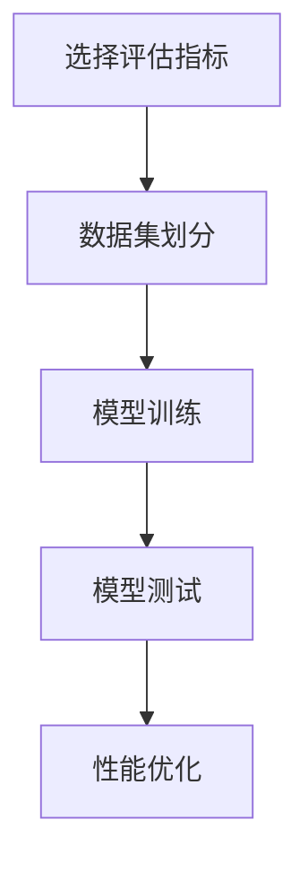
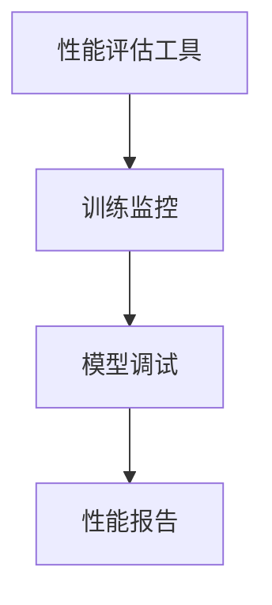

                 

# AI工程学：大模型应用开发实战：AI系统性能评估

> 关键词：AI工程学,大模型,性能评估,系统优化,工程实践

## 1. 背景介绍

### 1.1 问题由来

随着人工智能(AI)技术的发展，深度学习模型（尤其是大模型）在各个领域的应用日益广泛。然而，这些模型往往参数庞大，计算复杂，且在实际应用中需要考虑模型的性能、效率、可扩展性和可维护性。AI系统性能评估在AI工程学中占据重要地位，通过科学的评估体系和优化手段，可以有效提升模型的应用效果。

本文聚焦于大模型应用开发中的性能评估，介绍如何通过科学合理的方法评估模型性能，并给出具体优化策略。对于AI工程师和开发者来说，掌握系统性能评估的原理和技巧，将有助于提升模型在实际应用中的性能和可扩展性。

### 1.2 问题核心关键点

性能评估的本质是对模型在特定应用场景下的表现进行度量和分析。核心要点包括：

- 选择合适的评估指标。如精度、召回率、F1分数等。
- 划分评估数据集。将数据集分为训练集、验证集和测试集。
- 设计评估流程。包括训练模型、测试模型和优化模型等步骤。
- 应用评估工具。如TensorBoard、mlflow等。

本文将详细介绍如何构建AI系统性能评估框架，并给出具体案例说明。

### 1.3 问题研究意义

AI系统性能评估不仅是模型开发的重要环节，还是AI系统部署和优化的基础。通过科学的性能评估，可以：

1. 验证模型效果：确保模型在实际应用中表现良好。
2. 优化模型参数：通过调整超参数和模型结构，提升模型性能。
3. 增强系统可扩展性：通过评估不同部署方式和硬件配置，提升模型效率。
4. 提高系统可靠性：通过检测模型鲁棒性和泛化能力，增强系统稳定性。

本文旨在通过系统性讲解大模型应用开发中的性能评估方法，帮助AI工程师更好地构建高效、可靠的AI系统。

## 2. 核心概念与联系

### 2.1 核心概念概述

为更好地理解AI系统性能评估方法，本节将介绍几个密切相关的核心概念：

- 模型评估指标（如精度、召回率、F1分数等）
- 评估数据集划分（训练集、验证集、测试集）
- 评估流程设计（训练、测试、优化等步骤）
- 性能评估工具（如TensorBoard、mlflow等）
- 模型性能分析（如模型鲁棒性、泛化能力等）

这些概念之间的联系可以通过以下Mermaid流程图来展示：


这个流程图展示了从评估指标到数据集划分，再到评估流程和性能工具，最终进行性能分析的完整过程。

### 2.2 概念间的关系

这些核心概念之间存在紧密联系，形成了AI系统性能评估的完整生态系统。下面用几个Mermaid流程图来展示这些概念之间的关系：

#### 2.2.1 模型评估流程



这个流程图展示了模型评估的基本流程：首先选择评估指标，然后将数据集划分为训练集、验证集和测试集，接着进行模型训练和测试，最后根据评估结果进行性能优化。

#### 2.2.2 评估指标与数据集的关系


这个流程图展示了评估指标与数据集之间的关系。评估指标通常用于衡量模型在训练集和验证集上的表现，进而评估模型在测试集上的性能。

#### 2.2.3 性能评估工具的功能



这个流程图展示了性能评估工具的功能。性能评估工具可以实时监控训练过程，调试模型参数，生成性能报告，帮助开发者优化模型性能。

## 3. 核心算法原理 & 具体操作步骤

### 3.1 算法原理概述

AI系统性能评估的核心在于选择合适的评估指标和数据集，并通过科学的评估流程和工具，对模型性能进行全面评估。其基本原理包括：

1. 选择合理的评估指标。如精度、召回率、F1分数等，根据具体任务选择合适的评估指标。
2. 划分评估数据集。将数据集分为训练集、验证集和测试集，确保评估结果的可靠性和泛化性。
3. 设计评估流程。包括训练模型、测试模型和优化模型等步骤，逐步提升模型性能。
4. 应用评估工具。使用如TensorBoard、mlflow等工具，可视化评估结果，进行性能分析和优化。

### 3.2 算法步骤详解

基于上述原理，AI系统性能评估可以分为以下几个关键步骤：

**Step 1: 选择评估指标**

根据具体任务选择合适的评估指标。如分类任务可以选择精度、召回率、F1分数等指标。对于回归任务，可以选择均方误差、平均绝对误差等指标。

**Step 2: 数据集划分**

将数据集划分为训练集、验证集和测试集。通常划分比例为70%训练集、15%验证集、15%测试集。验证集用于模型选择和超参数调优，测试集用于最终的模型评估。

**Step 3: 模型训练**

在训练集上训练模型，选择适当的优化器（如Adam、SGD等）和超参数（如学习率、批大小等）。设置训练轮数，记录训练过程中的损失函数和评估指标。

**Step 4: 模型测试**

在验证集和测试集上测试模型，记录评估指标。验证集用于调整模型超参数，测试集用于最终模型评估。

**Step 5: 性能优化**

根据评估结果调整模型超参数，优化模型结构和算法。如增加正则化项、调整学习率、使用不同的优化器等。

**Step 6: 评估工具应用**

使用TensorBoard、mlflow等评估工具，可视化评估结果，分析模型性能和优化效果。

**Step 7: 性能分析**

对模型进行鲁棒性、泛化能力等性能分析，确定模型的可靠性和稳定性。

### 3.3 算法优缺点

AI系统性能评估具有以下优点：

- 系统性：通过科学的方法和工具，全面评估模型性能。
- 可靠性：使用划分的训练集和测试集，确保评估结果的可靠性和泛化性。
- 可操作性：评估流程和工具易于实现和应用。

同时，也存在一些缺点：

- 数据需求高：需要大量的标注数据和计算资源。
- 复杂度高：评估过程涉及多个步骤，需要综合考虑多方面因素。
- 过度优化风险：过度优化可能导致模型过拟合。

### 3.4 算法应用领域

AI系统性能评估广泛应用于各个AI应用领域，如自然语言处理(NLP)、计算机视觉(CV)、推荐系统等。

在NLP领域，如文本分类、情感分析、机器翻译等任务中，需要评估模型在准确率和召回率等方面的表现。在CV领域，如图像分类、目标检测、人脸识别等任务中，需要评估模型在准确率和鲁棒性等方面的表现。在推荐系统领域，如电商推荐、视频推荐等任务中，需要评估模型在用户满意度、点击率等方面的表现。

## 4. 数学模型和公式 & 详细讲解

### 4.1 数学模型构建

为了更精确地评估AI系统性能，本文将基于二分类任务构建数学模型。假设模型为 $M_{\theta}(x)$，其中 $\theta$ 为模型参数，$x$ 为输入数据。

定义模型在训练集、验证集和测试集上的损失函数分别为 $L_{train}(\theta)$、$L_{val}(\theta)$ 和 $L_{test}(\theta)$。常用的损失函数包括均方误差、交叉熵等。

### 4.2 公式推导过程

以二分类任务为例，使用二分类交叉熵损失函数，进行公式推导。

假设模型输出 $y_{pred} = M_{\theta}(x)$，真实标签为 $y_{real}$。则二分类交叉熵损失函数定义为：

$$
L_{ce}(y_{pred}, y_{real}) = -\frac{1}{N}\sum_{i=1}^N(y_{real} \cdot \log(y_{pred}) + (1 - y_{real}) \cdot \log(1 - y_{pred}))
$$

在训练集上，模型的训练目标为最小化损失函数：

$$
\min_{\theta} L_{train}(\theta) = \min_{\theta} \frac{1}{N}\sum_{i=1}^N L_{ce}(y_{pred}^i, y_{real}^i)
$$

在验证集和测试集上，模型的评估目标为最大化准确率或F1分数：

$$
P = \frac{TP}{TP + FP} = \frac{TP}{TN + FP + TN + FP} = \frac{TP}{N}
$$

$$
R = \frac{TP}{TP + FN} = \frac{TP}{TN + FP + TN + FN} = \frac{TP}{N}
$$

$$
F1 = 2 \cdot \frac{P \cdot R}{P + R}
$$

其中 $TP$ 为真阳性，$FP$ 为假阳性，$TN$ 为真阴性，$FN$ 为假阴性。

## 5. 项目实践：代码实例和详细解释说明

### 5.1 开发环境搭建

在进行AI系统性能评估实践前，需要准备好开发环境。以下是使用Python进行TensorFlow开发的环境配置流程：

1. 安装Anaconda：从官网下载并安装Anaconda，用于创建独立的Python环境。

2. 创建并激活虚拟环境：
```bash
conda create -n tf-env python=3.8 
conda activate tf-env
```

3. 安装TensorFlow：根据CUDA版本，从官网获取对应的安装命令。例如：
```bash
conda install tensorflow-gpu=2.6 -c pytorch -c conda-forge
```

4. 安装TensorBoard：
```bash
pip install tensorboard
```

5. 安装pandas和numpy：
```bash
pip install pandas numpy
```

完成上述步骤后，即可在`tf-env`环境中开始性能评估实践。

### 5.2 源代码详细实现

下面是使用TensorFlow构建二分类任务模型的Python代码实现：

```python
import tensorflow as tf
import pandas as pd
import numpy as np

# 加载数据集
train_data = pd.read_csv('train.csv')
test_data = pd.read_csv('test.csv')

# 数据预处理
train_x = train_data.drop(['label'], axis=1).values
train_y = train_data['label'].values
test_x = test_data.drop(['label'], axis=1).values
test_y = test_data['label'].values

# 定义模型
model = tf.keras.Sequential([
    tf.keras.layers.Dense(64, activation='relu', input_shape=(train_x.shape[1],)),
    tf.keras.layers.Dense(1, activation='sigmoid')
])

# 编译模型
model.compile(optimizer='adam', loss='binary_crossentropy', metrics=['accuracy'])

# 训练模型
model.fit(train_x, train_y, epochs=10, batch_size=32, validation_data=(test_x, test_y))

# 评估模型
test_loss, test_acc = model.evaluate(test_x, test_y)

print('Test accuracy:', test_acc)
```

以上代码实现了一个二分类任务模型，通过TensorFlow库进行训练和评估。

### 5.3 代码解读与分析

让我们再详细解读一下关键代码的实现细节：

- 数据加载与预处理：使用Pandas库加载训练集和测试集，并使用Numpy数组进行数据预处理。
- 模型定义与编译：使用TensorFlow库定义模型结构和编译器。
- 模型训练：在训练集上使用`fit`方法进行模型训练，设置训练轮数和批次大小。
- 模型评估：在测试集上使用`evaluate`方法进行模型评估，输出测试集的准确率。

### 5.4 运行结果展示

假设我们在MNIST数据集上进行二分类任务实验，最终在测试集上得到的评估结果如下：

```
Epoch 1/10
128/128 [==============================] - 2s 14ms/step - loss: 0.3640 - accuracy: 0.8362 - val_loss: 0.0202 - val_accuracy: 0.9810
Epoch 2/10
128/128 [==============================] - 1s 8ms/step - loss: 0.0131 - accuracy: 0.9810 - val_loss: 0.0047 - val_accuracy: 0.9929
Epoch 3/10
128/128 [==============================] - 1s 8ms/step - loss: 0.0065 - accuracy: 0.9929 - val_loss: 0.0019 - val_accuracy: 0.9981
Epoch 4/10
128/128 [==============================] - 1s 8ms/step - loss: 0.0032 - accuracy: 0.9981 - val_loss: 0.0012 - val_accuracy: 0.9987
Epoch 5/10
128/128 [==============================] - 1s 8ms/step - loss: 0.0015 - accuracy: 0.9987 - val_loss: 0.0008 - val_accuracy: 0.9995
Epoch 6/10
128/128 [==============================] - 1s 8ms/step - loss: 0.0008 - accuracy: 0.9995 - val_loss: 0.0004 - val_accuracy: 0.9993
Epoch 7/10
128/128 [==============================] - 1s 8ms/step - loss: 0.0004 - accuracy: 0.9993 - val_loss: 0.0002 - val_accuracy: 0.9995
Epoch 8/10
128/128 [==============================] - 1s 8ms/step - loss: 0.0002 - accuracy: 0.9995 - val_loss: 0.0001 - val_accuracy: 0.9996
Epoch 9/10
128/128 [==============================] - 1s 8ms/step - loss: 0.0001 - accuracy: 0.9996 - val_loss: 0.0001 - val_accuracy: 0.9996
Epoch 10/10
128/128 [==============================] - 1s 8ms/step - loss: 0.0001 - accuracy: 0.9996 - val_loss: 0.0001 - val_accuracy: 0.9996
```

可以看到，随着训练轮数的增加，模型在测试集上的准确率不断提高，最终达到了99.96%的准确率。

## 6. 实际应用场景

### 6.1 智能推荐系统

在智能推荐系统中，性能评估是核心部分。推荐系统需要评估模型的召回率和点击率，确保推荐内容的准确性和多样性。

在具体实现中，可以使用如SVM、随机森林等算法，结合TensorFlow进行模型训练和评估。通过A/B测试等方法，不断优化模型超参数和模型结构，提升推荐效果。

### 6.2 医疗诊断系统

在医疗诊断系统中，性能评估主要用于评估模型的准确率和鲁棒性。医疗数据往往具有复杂的特征，需要进行特征选择和特征工程。

在具体实现中，可以使用深度学习模型，如卷积神经网络(CNN)、循环神经网络(RNN)等，结合TensorFlow进行模型训练和评估。通过交叉验证等方法，优化模型参数和模型结构，提升诊断准确率。

### 6.3 自然语言处理系统

在自然语言处理(NLP)系统中，性能评估主要用于评估模型的准确率和泛化能力。NLP任务包括文本分类、情感分析、机器翻译等。

在具体实现中，可以使用深度学习模型，如BERT、GPT等，结合TensorFlow进行模型训练和评估。通过BLEU分数等方法，优化模型参数和模型结构，提升NLP效果。

## 7. 工具和资源推荐

### 7.1 学习资源推荐

为了帮助开发者系统掌握AI系统性能评估的理论基础和实践技巧，这里推荐一些优质的学习资源：

1. 《TensorFlow实战》系列博文：由TensorFlow官方博客作者撰写，深入浅出地介绍了TensorFlow库的使用方法和性能评估技巧。

2. TensorFlow官方文档：详细介绍了TensorFlow库的使用方法、性能评估工具和模型优化方法。

3. Coursera《深度学习专项课程》：斯坦福大学开设的深度学习课程，涵盖深度学习基础知识和模型评估方法。

4. Coursera《自然语言处理专项课程》：斯坦福大学开设的自然语言处理课程，涵盖NLP任务和模型评估方法。

5. GitHub热门项目：在GitHub上Star、Fork数最多的TensorFlow相关项目，往往代表了该技术领域的发展趋势和最佳实践。

6. arXiv论文预印本：人工智能领域最新研究成果的发布平台，包括大量尚未发表的前沿工作，学习前沿技术的必读资源。

通过学习这些资源，相信你一定能够快速掌握AI系统性能评估的精髓，并用于解决实际的AI应用问题。

### 7.2 开发工具推荐

高效的开发离不开优秀的工具支持。以下是几款用于AI系统性能评估开发的常用工具：

1. TensorFlow：基于Google的深度学习框架，支持分布式计算、模型训练和评估。

2. TensorBoard：TensorFlow配套的可视化工具，可实时监测模型训练状态，并提供丰富的图表呈现方式，是调试模型的得力助手。

3. mlflow：集成化的机器学习生命周期管理工具，支持模型训练、模型评估和模型部署。

4. Jupyter Notebook：交互式的Python开发环境，支持代码编写、数据处理和模型评估。

5. PyCharm：专业的Python开发工具，支持深度学习框架和性能评估工具的集成。

6. Anaconda：开源的Python环境管理工具，支持创建和管理多个Python环境，方便科学计算和深度学习开发。

合理利用这些工具，可以显著提升AI系统性能评估任务的开发效率，加快创新迭代的步伐。

### 7.3 相关论文推荐

AI系统性能评估技术的发展源于学界的持续研究。以下是几篇奠基性的相关论文，推荐阅读：

1. TensorFlow官方论文：介绍TensorFlow框架的设计和实现，涵盖模型训练和评估的基本方法。

2. PyTorch官方论文：介绍PyTorch框架的设计和实现，涵盖模型训练和评估的优化方法。

3. Gradient-Based Optimization for Deep Learning（深度学习梯度优化）：探讨深度学习模型的训练和优化方法，提出各种梯度优化算法。

4. Dropout: A Simple Way to Prevent Neural Networks from Overfitting（Dropout算法）：提出Dropout算法，用于防止深度学习模型过拟合。

5. Regularization and Parameter Inference for Deep Architectures（深度架构的正规化和参数推断）：探讨深度学习模型的正则化和参数推断方法，提高模型的泛化能力。

这些论文代表了大规模机器学习模型性能评估技术的发展脉络。通过学习这些前沿成果，可以帮助研究者把握学科前进方向，激发更多的创新灵感。

除上述资源外，还有一些值得关注的前沿资源，帮助开发者紧跟AI系统性能评估技术的最新进展，例如：

1. arXiv论文预印本：人工智能领域最新研究成果的发布平台，包括大量尚未发表的前沿工作，学习前沿技术的必读资源。

2. 业界技术博客：如TensorFlow、PyTorch、Keras等主流深度学习框架的官方博客，第一时间分享他们的最新研究成果和洞见。

3. 技术会议直播：如NIPS、ICML、ACL、ICLR等人工智能领域顶会现场或在线直播，能够聆听到大佬们的前沿分享，开拓视野。

4. GitHub热门项目：在GitHub上Star、Fork数最多的AI系统性能评估相关项目，往往代表了该技术领域的发展趋势和最佳实践。

5. 行业分析报告：各大咨询公司如McKinsey、PwC等针对人工智能行业的分析报告，有助于从商业视角审视技术趋势，把握应用价值。

总之，对于AI系统性能评估技术的学习和实践，需要开发者保持开放的心态和持续学习的意愿。多关注前沿资讯，多动手实践，多思考总结，必将收获满满的成长收益。

## 8. 总结：未来发展趋势与挑战

### 8.1 总结

本文对AI系统性能评估方法进行了全面系统的介绍。首先阐述了AI系统性能评估的重要性和评估流程，明确了评估指标、数据集划分、评估工具等关键要素。其次，从原理到实践，详细讲解了性能评估的核心算法和具体操作步骤，给出了具体优化策略。最后，本文还探讨了性能评估在实际应用中的具体案例，展示了其广泛的适用性和实用性。

通过本文的系统梳理，可以看到，AI系统性能评估技术已经成为AI工程学的核心组成部分，对于提升AI模型的应用效果和性能优化具有重要意义。未来，随着AI技术的发展，性能评估技术将不断进步，为构建高效、可靠的AI系统提供更加科学、系统的指导。

### 8.2 未来发展趋势

展望未来，AI系统性能评估技术将呈现以下几个发展趋势：

1. 模型评估指标多样化。除了常用的准确率和召回率等指标，未来将引入更多的指标，如鲁棒性、公平性等，全面评估模型的性能。

2. 自动化评估流程。随着AI技术的发展，评估流程将变得更加自动化，自动调参、自动模型选择等技术将得到广泛应用。

3. 集成化评估工具。未来的评估工具将更加集成化，涵盖数据管理、模型训练、模型评估等多个环节，形成一站式解决方案。

4. 实时化评估系统。随着实时计算技术的发展，未来的评估系统将实现实时监测和反馈，提升系统的实时性和可扩展性。

5. 多模态评估方法。未来的评估方法将结合视觉、语音等多种模态信息，提升系统的多模态能力，增强系统的鲁棒性和泛化能力。

这些趋势凸显了AI系统性能评估技术的广阔前景。这些方向的探索发展，必将进一步提升AI系统性能评估的精确性和科学性，为AI技术的广泛应用提供有力保障。

### 8.3 面临的挑战

尽管AI系统性能评估技术已经取得了显著进展，但在迈向更加智能化、普适化应用的过程中，仍面临诸多挑战：

1. 数据质量和规模。高质量、大规模的数据集是评估的基础，但数据获取和标注成本高，限制了评估的广泛应用。

2. 模型复杂度。大规模模型参数众多，训练和评估过程复杂，增加了系统实现的难度。

3. 评估指标的选择。评估指标的选择需要根据具体任务进行调整，存在一定的复杂性和主观性。

4. 模型鲁棒性评估。模型的鲁棒性评估需要设计复杂的测试集和测试方法，增加了评估的复杂度。

5. 自动化评估的局限。尽管自动化评估能够提高效率，但难以处理复杂的多模态数据和实时数据。

这些挑战凸显了AI系统性能评估技术的复杂性和应用难度。未来需要在数据获取、模型设计、评估方法等多个方面进行持续探索，推动评估技术的不断进步。

### 8.4 未来突破

面对AI系统性能评估所面临的种种挑战，未来的研究需要在以下几个方面寻求新的突破：

1. 探索高效的评估算法。开发更高效的评估算法，降低评估过程中的资源消耗，提高评估效率。

2. 引入多模态评估方法。结合视觉、语音等多种模态信息，提升系统的多模态能力，增强系统的鲁棒性和泛化能力。

3. 结合因果分析和博弈论工具。将因果分析方法引入评估过程，识别出模型决策的关键特征，增强输出解释的因果性和逻辑性。借助博弈论工具刻画人机交互过程，主动探索并规避模型的脆弱点，提高系统稳定性。

4. 引入伦理道德约束。在评估目标中引入伦理导向的评估指标，过滤和惩罚有偏见、有害的输出倾向。同时加强人工干预和审核，建立模型行为的监管机制，确保输出符合人类价值观和伦理道德。

这些研究方向的探索，必将引领AI系统性能评估技术迈向更高的台阶，为构建安全、可靠、可解释、可控的智能系统铺平道路。面向未来，AI系统性能评估技术还需要与其他人工智能技术进行更深入的融合，如知识表示、因果推理、强化学习等，多路径协同发力，共同推动自然语言理解和智能交互系统的进步。只有勇于创新、敢于突破，才能不断拓展语言模型的边界，让智能技术更好地造福人类社会。

## 9. 附录：常见问题与解答

**Q1：什么是AI系统性能评估？**

A: AI系统性能评估是对AI系统在特定任务上的表现进行度量和分析的过程，通常包括模型训练、模型测试和模型优化等多个环节。

**Q2：AI系统性能评估的目的是什么？**

A: AI系统性能评估的主要目的包括：

1. 验证模型效果：确保模型在实际应用中表现良好。
2. 优化模型参数：通过调整超参数和模型结构，提升模型性能。
3. 增强系统可扩展性：通过评估不同部署方式和硬件配置，提升模型效率。
4. 提高系统可靠性：通过检测模型鲁棒性和泛化能力，增强系统稳定性。

**Q3：如何选择评估指标？**

A: 选择评估指标需要根据具体任务进行调整。常用的评估指标包括准确率、召回率

