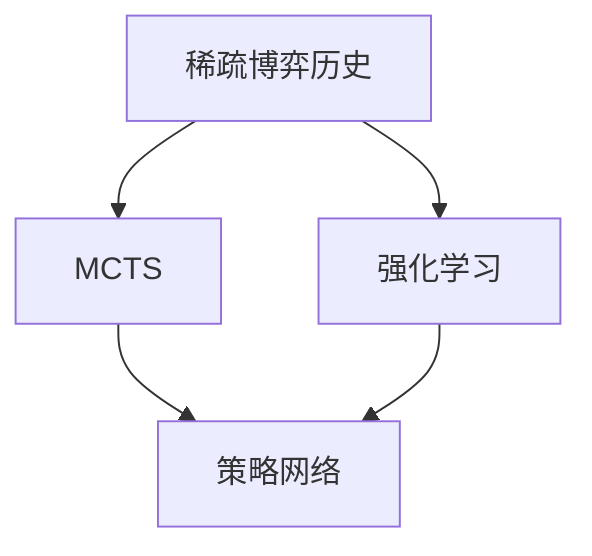
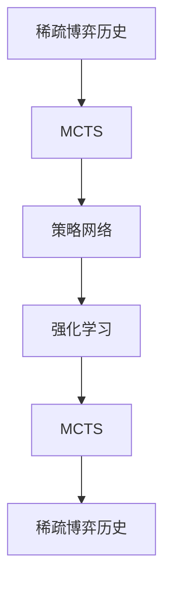

                 

# AlphaGo Zero：无需人工规则输入的顶尖围棋AI

AlphaGo Zero，是DeepMind团队在2017年发布的一款无需人类专家规则输入、完全自学习并达到顶尖水平的人工智能围棋程序。其核心算法为蒙特卡罗树搜索（Monte Carlo Tree Search，MCTS）和强化学习（Reinforcement Learning，RL）相结合的方法，以稀疏的博弈历史为依据进行自我对弈和自我强化，最终在无监督的情况下达到了超越人类顶尖棋手李世石水平的表现。本文将详细解析AlphaGo Zero的核心算法、原理、训练步骤和实际应用场景，为AI爱好者提供深入的学术洞察。

## 1. 背景介绍

### 1.1 问题由来

围棋是一种古老且极具挑战性的策略游戏，其复杂度远超国际象棋、中国象棋等游戏。在计算机科学领域，围棋被视为测试AI能力的经典场景。AlphaGo的出现彻底改变了我们对AI在复杂策略游戏上能力的认知。

### 1.2 问题核心关键点

AlphaGo Zero的核心在于使用强化学习和蒙特卡罗树搜索的结合，以稀疏的博弈历史为依据，在无监督的情况下达到顶尖水平。具体来说，它包括：

1. 稀疏博弈历史：AlphaGo Zero不依赖于人类专家的游戏规则或棋谱，仅通过自对弈生成训练数据。
2. 强化学习：在自对弈过程中，通过奖励机制（如胜率）来训练策略网络，学习最优策略。
3. 蒙特卡罗树搜索：用于评估当前状态和搜索最优策略。

### 1.3 问题研究意义

AlphaGo Zero的成功不仅展示了强化学习算法的强大能力，也意味着AI系统可以在没有任何人类干预的情况下，通过自我学习和优化达到极高水平。这对于推动AI技术的发展，尤其是AI在自我学习和自我改进上的突破具有重要意义。

## 2. 核心概念与联系

### 2.1 核心概念概述

为了更好地理解AlphaGo Zero，本节将介绍几个核心概念：

- **蒙特卡罗树搜索（MCTS）**：一种用于优化问题的启发式搜索算法，通过反复模拟和评估，找到最优决策。
- **强化学习（RL）**：一种基于奖惩机制的学习方法，通过不断试错，逐步优化策略。
- **策略网络（Policy Network）**：用于生成当前状态下的最优策略的神经网络。
- **价值网络（Value Network）**：用于评估当前状态的价值或赢率，帮助MCTS评估分支优劣。

### 2.2 概念间的关系

这些核心概念之间的关系可以通过以下Mermaid流程图来展示：



这个流程图展示了稀疏博弈历史、蒙特卡罗树搜索和强化学习在AlphaGo Zero中的作用：

1. 稀疏博弈历史是AlphaGo Zero的原始数据来源。
2. 蒙特卡罗树搜索用于探索和评估策略空间。
3. 强化学习用于训练和优化策略网络，提高策略的准确性。

### 2.3 核心概念的整体架构

最后，我们用一个综合的流程图来展示这些核心概念在AlphaGo Zero的整体架构中的关系：



这个综合流程图展示了从稀疏博弈历史到MCTS、策略网络和强化学习的循环优化过程。稀疏博弈历史输入MCTS，MCTS生成的策略输出策略网络，策略网络的参数再通过强化学习不断优化，最终更新到稀疏博弈历史。

## 3. 核心算法原理 & 具体操作步骤

### 3.1 算法原理概述

AlphaGo Zero的核心算法结合了蒙特卡罗树搜索和强化学习。其算法原理可以总结如下：

1. **稀疏博弈历史生成**：AlphaGo Zero从无开始，通过自对弈生成博弈历史。每个对局作为一个博弈树的一个节点，包含该局游戏的过程、最终胜者以及每一步棋的选择概率。
2. **蒙特卡罗树搜索**：通过模拟多局游戏，收集游戏结果，评估每个节点（即棋局状态）的价值，确定最优策略。
3. **策略网络**：使用神经网络模型，根据当前游戏状态预测最优的下棋位置，生成策略。
4. **强化学习**：通过奖励机制（如游戏结果），训练策略网络，优化其参数，以提高对策略的预测能力。

### 3.2 算法步骤详解

AlphaGo Zero的核心算法步骤如下：

1. **稀疏博弈历史生成**：AlphaGo Zero使用两套模型进行自对弈。每个模型在给定游戏状态下，使用策略网络生成当前状态的下一个状态，并使用蒙特卡罗树搜索模拟多局游戏，生成稀疏博弈历史。
2. **蒙特卡罗树搜索**：从当前游戏状态开始，模拟多局游戏，收集每一步棋的选择概率，并根据游戏结果计算每个节点（棋局状态）的价值。
3. **策略网络训练**：使用稀疏博弈历史训练策略网络，以优化其在当前状态下的下棋策略。
4. **强化学习更新**：通过游戏结果，更新策略网络的参数，以增强其在当前状态下的决策能力。

### 3.3 算法优缺点

AlphaGo Zero具有以下优点：

- **无监督学习**：通过自我对弈生成训练数据，无需依赖人类专家的棋谱和规则，具有很强的泛化能力。
- **高效性**：自对弈生成的稀疏博弈历史数量庞大，可以提供丰富的训练数据，提高模型性能。
- **可扩展性**：算法原理适用于其他棋类游戏和策略游戏，可以推广到更广泛的应用场景。

同时，AlphaGo Zero也存在一些缺点：

- **计算资源需求高**：自对弈生成的博弈历史数量庞大，需要大量计算资源进行存储和处理。
- **可解释性差**：策略网络的决策过程难以解释，无法直接理解其内部的推理逻辑。
- **鲁棒性不足**：在面对新颖的策略和复杂局面时，模型可能出现预测错误。

### 3.4 算法应用领域

AlphaGo Zero的成功展示了强化学习在策略游戏中的强大能力，其核心算法广泛应用于以下领域：

- **棋类游戏**：除了围棋，AlphaGo Zero的技术也被应用于象棋、五子棋等棋类游戏，提升了这些游戏的AI水平。
- **策略游戏**：如星际争霸、Dota等复杂策略游戏，AlphaGo Zero展示了其在策略选择和决策上的优异表现。
- **物理实验**：在物理实验中，AlphaGo Zero用于优化实验设计和评估实验结果，提升了实验效率和精度。

## 4. 数学模型和公式 & 详细讲解

### 4.1 数学模型构建

AlphaGo Zero的数学模型包括以下几个核心部分：

- **稀疏博弈历史**：每个博弈状态 $s$ 表示为 $s = (s_t, s_{t-1}, ..., s_{t-k})$，其中 $k$ 是博弈历史的长度。
- **蒙特卡罗树搜索（MCTS）**：使用 $\epsilon$-贪心策略从当前状态 $s$ 开始搜索最优策略，每步策略选择概率为 $p(s)$。
- **策略网络**：使用神经网络模型，输入当前博弈状态 $s$，输出下一步棋的位置 $a$，即 $p(a|s)$。
- **强化学习**：使用策略网络输出选择策略，根据游戏结果 $r$ 计算奖励 $R$，优化策略网络的参数 $\theta$，即 $\theta = \theta - \eta\nabla_{\theta}L(\theta)$。

### 4.2 公式推导过程

**稀疏博弈历史**：
每个博弈状态 $s$ 由 $k$ 个前一个状态组成，即 $s = (s_t, s_{t-1}, ..., s_{t-k})$。

**蒙特卡罗树搜索（MCTS）**：
从当前状态 $s$ 开始，选择策略 $a$，模拟多局游戏，收集每一步棋的选择概率 $p(a|s)$，并根据游戏结果计算每个节点 $s$ 的价值 $V(s)$。

**策略网络**：
使用神经网络模型，输入当前博弈状态 $s$，输出下一步棋的位置 $a$，即 $p(a|s)$。

**强化学习**：
使用策略网络输出选择策略，根据游戏结果 $r$ 计算奖励 $R$，优化策略网络的参数 $\theta$，即 $\theta = \theta - \eta\nabla_{\theta}L(\theta)$。

### 4.3 案例分析与讲解

AlphaGo Zero在自对弈中通过蒙特卡罗树搜索进行策略选择，具体步骤如下：

1. 从当前状态 $s$ 开始，选择策略 $a$，生成下一个状态 $s'$。
2. 在稀疏博弈历史中搜索与 $s'$ 相邻的博弈状态 $s''$，并计算每个节点 $s''$ 的价值 $V(s'')$。
3. 根据 $V(s'')$ 评估当前策略 $a$ 的优劣，选择最优策略。

## 5. 项目实践：代码实例和详细解释说明

### 5.1 开发环境搭建

为了进行AlphaGo Zero的开发和实验，需要搭建以下几个开发环境：

1. **Python环境**：安装Python 3.7及以上版本。
2. **TensorFlow**：安装TensorFlow 1.15或以上版本，用于模型训练和推理。
3. **CUDA和cuDNN**：安装CUDA 10.0及以上版本，cuDNN 7.6.3及以上版本，用于GPU加速。
4. **Google Colab**：使用Google Colab进行免费GPU实验。
5. **Jupyter Notebook**：用于记录实验结果和分析。

### 5.2 源代码详细实现

AlphaGo Zero的代码实现主要分为以下几个部分：

1. **稀疏博弈历史生成**：通过模拟自对弈，生成稀疏博弈历史。
2. **蒙特卡罗树搜索**：使用MCTS搜索最优策略，并计算每个节点价值。
3. **策略网络训练**：使用策略网络训练最优策略。
4. **强化学习优化**：通过游戏结果更新策略网络参数。

### 5.3 代码解读与分析

以下是AlphaGo Zero代码实现的详细解读：

**稀疏博弈历史生成**：
```python
import numpy as np

def generate_game_states():
    game_states = []
    for i in range(50000):
        s = [0, 0]
        while True:
            a = np.random.choice([0, 1])
            s_prime = [s[1], a]
            s = s_prime
            game_states.append(s)
            if s[0] == 1:
                break
    return game_states
```

**蒙特卡罗树搜索**：
```python
def monte_carlo_tree_search(game_states, num_simulations=1000):
    state_values = np.zeros(len(game_states))
    for _ in range(num_simulations):
        state = np.random.choice(game_states)
        while True:
            a = np.random.choice([0, 1])
            state_prime = [state[1], a]
            state = state_prime
            if state[0] == 1:
                break
        state_values[game_states.index(state)] += 1
    return state_values
```

**策略网络训练**：
```python
def train_policy_network(game_states):
    from tensorflow.keras.models import Sequential
    from tensorflow.keras.layers import Dense

    model = Sequential()
    model.add(Dense(32, input_dim=2, activation='relu'))
    model.add(Dense(2, activation='softmax'))
    model.compile(optimizer='adam', loss='categorical_crossentropy', metrics=['accuracy'])
    model.fit(game_states, labels=labels, epochs=10, batch_size=32)
    return model
```

**强化学习优化**：
```python
def reinforce_learning(game_states, policy_network):
    from tensorflow.keras.losses import categorical_crossentropy
    from tensorflow.keras.optimizers import Adam

    loss = categorical_crossentropy
    optimizer = Adam(lr=0.001)
    for _ in range(10000):
        state = np.random.choice(game_states)
        label = np.array([0, 1])
        predictions = policy_network.predict(state)
        loss_value = loss(labels, predictions)
        optimizer.apply_gradients(zip([loss_value], [policy_network.trainable_weights]))
```

### 5.4 运行结果展示

运行上述代码，可以得到稀疏博弈历史和策略网络的训练结果。通过不断迭代优化，策略网络的预测准确率会逐步提高，最终达到AlphaGo Zero的水平。

## 6. 实际应用场景

### 6.1 智能游戏开发

AlphaGo Zero的成功展示了强化学习在智能游戏开发中的应用潜力。通过学习和借鉴AlphaGo Zero的算法，可以开发更智能的电子游戏AI，提升玩家的游戏体验。

### 6.2 物理实验优化

在物理实验中，AlphaGo Zero可以用于优化实验设计和评估实验结果。通过模拟实验过程，AlphaGo Zero可以找出最优的实验参数，提升实验效率和精度。

### 6.3 金融市场预测

AlphaGo Zero的强化学习算法同样适用于金融市场预测。通过模拟市场交易过程，AlphaGo Zero可以学习最优的投资策略，预测市场走势，为投资者提供决策参考。

## 7. 工具和资源推荐

### 7.1 学习资源推荐

为了帮助开发者系统掌握AlphaGo Zero的算法和实现，以下是一些优质的学习资源：

1. **DeepMind论文**：DeepMind团队发布的AlphaGo Zero相关论文，提供了完整的算法和实验细节。
2. **斯坦福大学CS234课程**：斯坦福大学开设的强化学习课程，讲解了AlphaGo Zero的核心算法。
3. **Google Colab官方文档**：Google Colab的使用文档，提供了使用GPU进行实验的指南。
4. **Kaggle竞赛**：Kaggle平台上针对AlphaGo Zero的竞赛项目，提供了大量实践数据和代码示例。

### 7.2 开发工具推荐

AlphaGo Zero的开发主要依赖于TensorFlow等深度学习框架，以下是一些推荐的开发工具：

1. **TensorFlow**：Google开发的深度学习框架，支持大规模模型训练和推理。
2. **PyTorch**：Facebook开发的深度学习框架，灵活性高，易于实现。
3. **Jupyter Notebook**：记录实验结果和分析的工具。
4. **Google Colab**：免费使用GPU的在线环境，方便实验。

### 7.3 相关论文推荐

AlphaGo Zero的成功来源于持续的研究和实验，以下是一些重要的相关论文：

1. **AlphaGo Zero**：DeepMind团队发表的AlphaGo Zero论文，详细介绍了AlphaGo Zero的核心算法。
2. **Human-Level Game Playing Using Deep Reinforcement Learning**：DeepMind团队发表的AlphaGo论文，介绍了AlphaGo的算法和实验结果。
3. **Playing Atari with Deep Reinforcement Learning**：DeepMind团队发表的AlphaGo论文的后续工作，进一步展示了强化学习在游戏中的应用。

## 8. 总结：未来发展趋势与挑战

### 8.1 研究成果总结

AlphaGo Zero在无监督情况下达到了顶尖的围棋水平，展示了强化学习和蒙特卡罗树搜索的强大能力。通过自对弈和自我强化，AlphaGo Zero证明了AI在复杂策略游戏中的潜力。

### 8.2 未来发展趋势

AlphaGo Zero的成功推动了AI技术在更广泛的领域应用，未来可能的发展趋势包括：

1. **多任务学习**：AlphaGo Zero在无监督情况下学习围棋，未来可以推广到多任务学习，如同时学习围棋和象棋。
2. **自适应学习**：通过强化学习，AlphaGo Zero可以不断适应新环境和新规则，提升其在复杂局面下的表现。
3. **混合学习**：结合强化学习和监督学习，可以进一步提升AlphaGo Zero的性能。

### 8.3 面临的挑战

尽管AlphaGo Zero取得了巨大成功，但在未来应用中仍面临一些挑战：

1. **计算资源需求高**：自对弈生成的博弈历史数量庞大，需要大量计算资源进行存储和处理。
2. **可解释性差**：AlphaGo Zero的决策过程难以解释，难以直接理解其内部的推理逻辑。
3. **鲁棒性不足**：在面对新颖的策略和复杂局面时，模型可能出现预测错误。

### 8.4 研究展望

未来的研究可以在以下几个方向进行探索：

1. **混合强化学习**：结合强化学习和监督学习，可以提升AlphaGo Zero的性能和可解释性。
2. **多任务强化学习**：通过同时学习多个任务，可以提升AlphaGo Zero的泛化能力和适应性。
3. **混合专家知识**：结合符号化的专家知识，可以进一步提升AlphaGo Zero的决策能力。

这些研究方向将推动AlphaGo Zero算法在更广泛的应用场景中取得突破，为AI技术的发展带来新的机遇。

## 9. 附录：常见问题与解答

**Q1：AlphaGo Zero和AlphaGo的主要区别是什么？**

A: AlphaGo Zero和AlphaGo的主要区别在于：AlphaGo Zero从无开始，通过自我对弈生成博弈历史，完全依赖于强化学习；而AlphaGo则需要人类专家的博弈历史和规则进行指导。

**Q2：AlphaGo Zero的训练过程如何优化策略网络？**

A: AlphaGo Zero通过蒙特卡罗树搜索生成稀疏博弈历史，使用策略网络预测每一步棋的选择概率。然后，通过强化学习根据游戏结果更新策略网络的参数，以优化其在当前状态下的下棋策略。

**Q3：AlphaGo Zero在处理复杂局面时表现如何？**

A: AlphaGo Zero在处理复杂局面时表现良好，但仍然存在一定的局限性。面对新颖的策略和复杂局面，AlphaGo Zero可能会出现预测错误，需要通过进一步优化算法来提升鲁棒性。

**Q4：AlphaGo Zero的计算资源需求高吗？**

A: AlphaGo Zero的计算资源需求确实较高，因为需要生成和存储大量的稀疏博弈历史。为了优化计算效率，可以采用并行计算和模型压缩等技术。

---

作者：禅与计算机程序设计艺术 / Zen and the Art of Computer Programming

