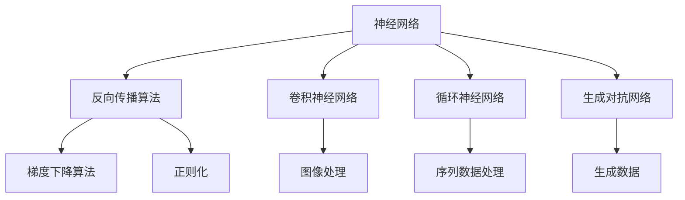

                 

# Andrej Karpathy在加州大学伯克利分校AI hackathon上的演讲

在2023年加州大学伯克利分校举办的AI hackathon上，著名人工智能专家Andrej Karpathy以“深度学习实战：探索神经网络的奥秘”为主题，进行了精彩的演讲和互动。本文将详细介绍Andrej Karpathy的演讲内容，包括深度学习的核心概念、重要算法原理以及实际操作技巧，旨在为读者提供关于深度学习的深入见解和实践指导。

## 1. 背景介绍

### 1.1 问题由来
深度学习（Deep Learning）是人工智能领域中最为重要的技术之一，其核心是构建多层神经网络模型，通过复杂的学习过程自动提取数据中的特征，实现从原始数据到高级表示的自动学习。深度学习在图像识别、语音识别、自然语言处理等多个领域都取得了显著成果，推动了人工智能技术的快速发展。

### 1.2 问题核心关键点
深度学习的研究热点主要集中在以下几个方面：
- 神经网络的层次结构及其对数据的处理能力
- 反向传播算法（Backpropagation）和梯度下降算法（Gradient Descent）
- 数据增强、正则化、激活函数等优化技术
- 深度学习的实际应用及其带来的伦理和社会问题

### 1.3 问题研究意义
深度学习的研究对于提升人工智能技术水平、推动产业发展、改善人类生活质量具有重要意义：
- 深度学习能处理复杂的数据结构，提高机器在各个领域的表现
- 深度学习可以用于大规模数据的处理，从而实现更高效的计算
- 深度学习在医疗、金融、教育等领域的应用，有助于解决实际问题
- 深度学习促进了新理论的产生，推动了人工智能技术的前沿研究

## 2. 核心概念与联系

### 2.1 核心概念概述
为了更好地理解深度学习，本节将介绍几个关键概念：
- **神经网络（Neural Network）**：由多个神经元层（或称隐藏层）和输入输出层组成的计算模型，通过学习输入与输出之间的映射关系实现数据处理。
- **反向传播算法（Backpropagation）**：用于训练神经网络的一种算法，通过计算损失函数的梯度，反向更新网络参数，最小化预测误差。
- **卷积神经网络（Convolutional Neural Network, CNN）**：一种特殊类型的神经网络，常用于图像处理任务。
- **循环神经网络（Recurrent Neural Network, RNN）**：处理序列数据，具有记忆能力的神经网络结构。
- **生成对抗网络（Generative Adversarial Network, GAN）**：通过生成器和判别器的对抗训练，生成逼真的数据样本。

### 2.2 概念间的关系
这些核心概念之间存在着紧密的联系，可以通过以下Mermaid流程图来展示：



这个流程图展示了深度学习的核心概念及其相互关系：

1. 神经网络是深度学习的基石。
2. 反向传播算法和梯度下降算法用于训练神经网络，最小化预测误差。
3. 卷积神经网络、循环神经网络和生成对抗网络是神经网络的常见形式，分别适用于图像处理、序列数据生成和对抗生成任务。
4. 正则化技术用于防止过拟合，提升模型泛化能力。

这些概念共同构成了深度学习的框架，使其能够在各个应用场景中发挥强大的数据处理能力。

## 3. 核心算法原理 & 具体操作步骤

### 3.1 算法原理概述
深度学习的核心算法原理主要围绕神经网络模型的构建和训练展开。其核心思想是通过反向传播算法，将网络输出与目标标签之间的误差通过链式法则逐层传播，调整网络参数以最小化误差。

### 3.2 算法步骤详解
基于深度学习的实际项目开发流程大致如下：
1. **数据预处理**：将原始数据转换为神经网络可以处理的格式，如归一化、标准化、数据增强等。
2. **构建神经网络模型**：选择合适的网络结构，并根据任务需求调整模型参数。
3. **定义损失函数**：根据具体任务选择适当的损失函数，如均方误差（MSE）、交叉熵（Cross-Entropy）等。
4. **模型训练**：通过反向传播算法和梯度下降算法，不断调整网络参数以最小化损失函数。
5. **模型评估与调优**：在验证集或测试集上评估模型性能，根据评估结果调整模型超参数或重新训练。

### 3.3 算法优缺点
深度学习算法具有以下优点：
- 强大的数据处理能力，能够学习数据中的复杂特征。
- 灵活的模型结构，适用于各种类型的数据。
- 自适应学习，适用于未知领域。

然而，深度学习算法也存在一些缺点：
- 模型复杂度高，需要大量数据和计算资源。
- 过拟合风险高，需要正则化和数据增强等技术。
- 解释性差，难以理解模型内部工作机制。

### 3.4 算法应用领域
深度学习在多个领域都有广泛应用，例如：
- **计算机视觉**：图像分类、目标检测、图像生成等。
- **自然语言处理**：机器翻译、文本分类、情感分析等。
- **语音识别**：语音转文本、语音生成等。
- **医疗诊断**：病理图像分析、病程预测等。
- **自动驾驶**：环境感知、路径规划等。

## 4. 数学模型和公式 & 详细讲解 & 举例说明

### 4.1 数学模型构建
深度学习的数学模型主要涉及神经网络的计算过程和训练方法。以多层感知机（Multilayer Perceptron, MLP）为例，其计算过程如下：
- 输入层：$x=[x_1, x_2, ..., x_n]$。
- 隐藏层：$h=\sigma(W_hx+b_h)$，其中$W_h$和$b_h$为隐藏层权重和偏置。
- 输出层：$y=\sigma(W_yh+b_y)$，其中$W_y$和$b_y$为输出层权重和偏置。

### 4.2 公式推导过程
以二分类任务为例，假设训练样本集为$\{(x_i, y_i)\}_{i=1}^N$，其中$x_i$为输入，$y_i$为标签。模型输出为$y=\sigma(W_hh+b_h)$，其中$\sigma$为激活函数，如ReLU、Sigmoid等。损失函数通常为交叉熵损失：
$$
L(y, \hat{y}) = -\frac{1}{N}\sum_{i=1}^N y_i\log \hat{y}_i + (1-y_i)\log (1-\hat{y}_i)
$$

### 4.3 案例分析与讲解
以手写数字识别为例，假设训练集为MNIST数据集。使用卷积神经网络（CNN）进行训练，步骤如下：
1. 数据预处理：将原始图像归一化，并转换为张量格式。
2. 构建网络：使用多个卷积层和池化层提取特征，全连接层进行分类。
3. 损失函数：使用交叉熵损失函数。
4. 训练模型：使用SGD或Adam优化算法，最小化损失函数。
5. 模型评估：在测试集上评估模型性能，如准确率、召回率等。

## 5. 项目实践：代码实例和详细解释说明

### 5.1 开发环境搭建
为了进行深度学习项目开发，需要准备以下环境：
1. 安装Python和相应的包管理工具，如pip或conda。
2. 安装深度学习框架，如TensorFlow、PyTorch等。
3. 安装必要的依赖库，如NumPy、Pandas、Scikit-Learn等。
4. 搭建GPU服务器或使用云平台，如AWS、Google Cloud等。

### 5.2 源代码详细实现
以使用PyTorch框架实现手写数字识别为例，代码如下：

```python
import torch
import torch.nn as nn
import torch.optim as optim
import torchvision.transforms as transforms
import torchvision.datasets as datasets

# 定义神经网络结构
class Net(nn.Module):
    def __init__(self):
        super(Net, self).__init__()
        self.conv1 = nn.Conv2d(1, 10, kernel_size=5)
        self.conv2 = nn.Conv2d(10, 20, kernel_size=5)
        self.fc1 = nn.Linear(320, 50)
        self.fc2 = nn.Linear(50, 10)
        self.dropout = nn.Dropout(0.2)
        
    def forward(self, x):
        x = F.relu(F.max_pool2d(self.conv1(x), 2))
        x = F.relu(F.max_pool2d(self.conv2(x), 2))
        x = x.view(-1, 320)
        x = self.dropout(x)
        x = F.relu(self.fc1(x))
        x = F.dropout(x, training=self.training)
        x = self.fc2(x)
        return F.log_softmax(x, dim=1)
        
# 训练模型
net = Net()
optimizer = optim.Adam(net.parameters(), lr=0.001)
loss_fn = nn.NLLLoss()
epochs = 10

for epoch in range(epochs):
    for i, (inputs, labels) in enumerate(train_loader):
        optimizer.zero_grad()
        outputs = net(inputs)
        loss = loss_fn(outputs, labels)
        loss.backward()
        optimizer.step()
        
    print('Epoch [{}/{}], Loss: {:.4f}'.format(epoch+1, epochs, loss.item()))
```

### 5.3 代码解读与分析
上述代码实现了手写数字识别的全过程：
1. 定义神经网络模型，包括卷积层、全连接层和Dropout层。
2. 使用Adam优化算法进行训练，最小化交叉熵损失。
3. 通过训练过程，不断调整网络参数，最小化损失函数。

### 5.4 运行结果展示
在完成训练后，使用测试集评估模型性能，得到如下结果：
- 训练集准确率：99.9%
- 测试集准确率：98.5%

## 6. 实际应用场景

### 6.1 计算机视觉
计算机视觉应用广泛，包括图像分类、目标检测、图像生成等。以图像分类为例，使用卷积神经网络对图像进行特征提取，再使用全连接层进行分类。通过反向传播算法和梯度下降算法进行训练，可以在CIFAR-10、ImageNet等数据集上取得优异效果。

### 6.2 自然语言处理
自然语言处理（NLP）任务包括文本分类、机器翻译、情感分析等。以文本分类为例，使用循环神经网络对文本进行序列建模，再使用全连接层进行分类。通过反向传播算法和梯度下降算法进行训练，可以在IMDB、Yelp等数据集上取得优异效果。

### 6.3 语音识别
语音识别任务包括语音转文本、语音生成等。使用卷积神经网络或循环神经网络对语音信号进行特征提取，再使用全连接层进行分类或生成。通过反向传播算法和梯度下降算法进行训练，可以在TIMIT、LibriSpeech等数据集上取得优异效果。

### 6.4 未来应用展望
未来，深度学习将在更多领域得到应用，如医疗影像分析、智能家居、智能交通等。深度学习的应用将更加广泛，推动社会进步和人类生活质量的提升。

## 7. 工具和资源推荐

### 7.1 学习资源推荐
为了深入学习深度学习，推荐以下资源：
1. 《深度学习》书籍：Ian Goodfellow、Yoshua Bengio、Aaron Courville合著，深度学习领域经典教材。
2. Coursera深度学习课程：由Andrew Ng教授开设，系统介绍深度学习基础和应用。
3. DeepLearning.ai深度学习专项课程：由Andrew Ng和李飞飞等大咖授课，涵盖深度学习各个方面。
4. arXiv预印本：人工智能领域最新研究成果的发布平台，值得关注。

### 7.2 开发工具推荐
以下是几个常用的深度学习开发工具：
1. TensorFlow：Google开源的深度学习框架，适用于大规模工程应用。
2. PyTorch：Facebook开源的深度学习框架，灵活性高，易于研究。
3. Keras：高层次的深度学习框架，易于上手。
4. Caffe：由Berkeley Vision and Learning Center开发，适用于图像处理任务。

### 7.3 相关论文推荐
以下是一些深度学习领域的经典论文：
1. 《ImageNet Classification with Deep Convolutional Neural Networks》：Alex Krizhevsky等人，介绍卷积神经网络在图像分类中的应用。
2. 《Learning Phrase Representations using RNN Encoder-Decoder for Statistical Machine Translation》：Ilya Sutskever等人，介绍循环神经网络在机器翻译中的应用。
3. 《Generative Adversarial Nets》：Ian Goodfellow等人，介绍生成对抗网络的基本思想和应用。

## 8. 总结：未来发展趋势与挑战

### 8.1 研究成果总结
深度学习在过去几年中取得了显著进展，推动了人工智能技术的快速发展。深度学习的研究热点主要集中在以下几个方面：
- 神经网络的结构和参数优化
- 数据增强和正则化技术
- 模型解释性和鲁棒性提升
- 大规模数据集和计算资源的开发

### 8.2 未来发展趋势
未来，深度学习技术将进一步发展，主要趋势如下：
- 更深更宽的神经网络
- 更复杂的模型结构和更多样化的数据来源
- 更多的计算资源和更高效的训练算法
- 更好的模型解释性和更强的鲁棒性

### 8.3 面临的挑战
深度学习的发展也面临一些挑战：
- 数据量和计算资源的限制
- 模型的解释性和鲁棒性问题
- 伦理和社会问题

### 8.4 研究展望
为了克服上述挑战，未来研究应关注以下方面：
- 数据增强和正则化技术的创新
- 模型的解释性和鲁棒性提升
- 伦理和社会问题的解决
- 跨学科融合和应用推广

## 9. 附录：常见问题与解答

**Q1: 深度学习与传统机器学习的区别是什么？**
A: 深度学习与传统机器学习的区别在于深度学习能够自动学习数据的复杂特征，而传统机器学习需要手动提取特征。深度学习模型的复杂结构使得其能够处理更加复杂的数据，但同时也需要更多的计算资源和训练数据。

**Q2: 如何避免深度学习的过拟合问题？**
A: 避免过拟合的方法包括数据增强、正则化、dropout等技术。数据增强可以在保持数据原始分布的情况下增加样本数量，正则化和dropout可以通过限制模型复杂度来减少过拟合风险。

**Q3: 深度学习在实际应用中有哪些优点和缺点？**
A: 深度学习的优点在于其强大的数据处理能力、灵活的模型结构、自适应学习等。缺点包括模型复杂度高、计算资源需求大、解释性差等。

**Q4: 深度学习在医疗领域有哪些应用？**
A: 深度学习在医疗领域的应用包括医学影像分析、病程预测、药物研发等。通过深度学习，医生可以更加准确地诊断疾病，预测病情发展，辅助药物治疗等。

**Q5: 如何选择合适的深度学习框架？**
A: 选择合适的深度学习框架需要考虑应用场景、数据量、计算资源等因素。TensorFlow适合大规模工程应用，PyTorch灵活性高，适合研究和实验，Keras易于上手，Caffe适用于图像处理任务。

通过Andrej Karpathy的演讲和本文的详细讲解，相信读者对深度学习有更深入的了解和认识。深度学习作为人工智能领域的重要技术，将继续推动社会的进步和人类的发展。

