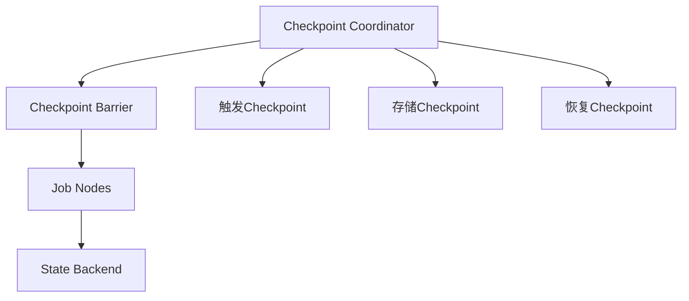

                 

# Flink Checkpoint容错机制原理与代码实例讲解

## 1. 背景介绍

Flink作为高性能分布式流处理框架，其容错机制（checkpoint）是保证系统可靠性的关键组件之一。Checkpoint允许Flink对正在运行的作业进行状态的快照（snapshot），以便在作业失败时能够从上次成功的位置重新恢复。这一特性对于处理大规模数据流和高可用性要求的应用场景至关重要。

本文将详细阐述Flink Checkpoint的原理和实现方式，并通过代码实例对其实际应用进行讲解。我们将从Checkpoint机制的原理、核心组件、工作流程、常见问题与优化策略等多个方面进行深入分析。

## 2. 核心概念与联系

### 2.1 核心概念概述

在Flink中，Checkpoint主要是用于解决作业在运行过程中可能遇到的不可预测错误，如节点宕机、任务执行异常等。通过定期或触发式快照（snapshot），Flink可以将作业的状态存储在外部存储系统（如HDFS、S3、Ceph等）中，以便在出现故障时能够从最新状态进行恢复。

核心概念包括：
- **Checkpoint**：作业状态的持久化快照。
- **Checkpoint Coordinator**：管理Checkpoint流程，包括触发Checkpoint、获取状态和报告进度等。
- **State Backend**：负责将Checkpoint状态持久化到外部存储系统。
- **Checkpoint Barrier**：在Checkpoint过程中用于同步节点任务的特殊标记，确保数据的一致性。

### 2.2 核心概念间的关系

Checkpoint机制的工作流程可以分为三个阶段：
1. **Checkpoint触发**：Checkpoint Coordinator根据设置的策略决定是否触发Checkpoint。
2. **Checkpoint执行**：Checkpoint Barrier被发送至作业节点，节点将任务状态的快照存储到State Backend中。
3. **Checkpoint恢复**：当作业失败时，Checkpoint Coordinator从State Backend加载状态，恢复作业到最近的Checkpoint。

以下是一个简化版的Mermaid流程图，展示了Checkpoint机制的基本流程：



## 3. 核心算法原理 & 具体操作步骤

### 3.1 算法原理概述

Flink的Checkpoint机制基于两点设计：
1. **状态快照**：周期性地将作业的状态进行持久化，以避免数据丢失。
2. **恢复策略**：通过从最新状态恢复，使得作业能够在故障发生后从上次成功的位置继续执行。

Flink的Checkpoint机制包括以下核心步骤：
1. **Checkpoint触发**：Checkpoint Coordinator根据预设的策略决定是否触发Checkpoint。
2. **Checkpoint执行**：Checkpoint Barrier被发送到所有作业节点，节点将任务状态的快照存储到State Backend中。
3. **Checkpoint恢复**：当作业失败时，Checkpoint Coordinator从State Backend加载状态，恢复作业到最近的Checkpoint。

### 3.2 算法步骤详解

以下是对Flink Checkpoint机制的详细步骤详解：

**Step 1: 配置Checkpoint参数**

在Flink中，通过`env`对象的`checkpoint`方法来配置Checkpoint参数。主要包括：
- `checkpoint.interval`：触发Checkpoint的间隔时间（毫秒）。
- `checkpoint.timeout`：允许Checkpoint最大的延迟时间（毫秒）。
- `checkpoint.max.num.checkpoints`：允许的Checkpoint最大数量。

```python
env = StreamExecutionEnvironment.get_execution_environment()
env.enable_checkpointing(60000)  # 触发Checkpoint间隔为60秒
env.enable_checkpointing(180000, 5)  # 允许Checkpoint最大延迟时间为30秒，最多保留5个Checkpoint
```

**Step 2: 状态后端配置**

状态后端（State Backend）是Checkpoint机制的核心组件之一，负责将状态持久化到外部存储系统。Flink支持多种状态后端，包括FsStateBackend（HDFS）、MemoryStateBackend（内存）和RocksDBStateBackend等。

例如，配置FsStateBackend为Checkpoint后端：

```python
env.setStateBackend(FsStateBackend.FileSystemStateBackend("hdfs://localhost:9000", "checkpoint", true, true))
```

**Step 3: Checkpoint Barrier发送**

当Checkpoint被触发时，Checkpoint Coordinator会生成一个Checkpoint Barrier，并将其发送到所有作业节点。节点在收到Checkpoint Barrier后，会将任务状态的快照存储到State Backend中，并在接收到下一个Checkpoint Barrier之前，阻塞任务的进一步执行。

**Step 4: Checkpoint恢复**

当作业失败时，Checkpoint Coordinator会从State Backend加载最新的状态，并通知所有节点重新加载状态，恢复作业到最近的Checkpoint。

### 3.3 算法优缺点

Flink Checkpoint机制的主要优点包括：
- 支持大规模作业的容错处理。
- 通过状态快照，保证作业状态的一致性和可靠性。
- 允许作业在故障发生后从上次成功的位置恢复。

缺点主要包括：
- 状态快照的开销较大，会增加系统的存储和计算负担。
- 状态后端的性能和可靠性直接影响Checkpoint的效率和可靠性。
- 对于实时性要求较高的流处理作业，Checkpoint的延迟可能会影响实时性。

### 3.4 算法应用领域

Flink Checkpoint机制广泛应用于各种流处理作业中，包括实时数据流处理、日志分析、事件流处理等。在金融、电商、物联网等领域，Flink因其高性能、低延迟和可靠性的特点，成为处理大规模数据流的理想选择。

## 4. 数学模型和公式 & 详细讲解 & 举例说明

### 4.1 数学模型构建

Flink Checkpoint的实现基于状态快照和恢复机制，可以将其抽象为一个状态管理过程。假设作业有$n$个任务节点，每个任务节点的状态表示为$S_i$，状态后端为$B$。则Checkpoint的过程可以表示为：

$$
S'_i = S_i, \quad i = 1, ..., n
$$

其中$S'_i$表示Checkpoint后$i$节点的状态，$S_i$表示Checkpoint前的状态。Checkpoint Barrier的发送和恢复过程可以表示为：

$$
\text{发送} \quad B(S'_i), \quad i = 1, ..., n
$$

$$
\text{恢复} \quad S_i = B^{-1}(S'_i), \quad i = 1, ..., n
$$

其中$B^{-1}$表示状态后端$B$的逆过程，用于从持久化状态$S'_i$恢复原始状态$S_i$。

### 4.2 公式推导过程

以Checkpoint Barrier的发送和恢复为例，推导其计算过程。假设节点$i$的任务状态为$S_i$，Checkpoint Barrier的发送过程可以表示为：

$$
S_i' = S_i
$$

$$
B(S_i') = \text{发送} \quad B(S_i')
$$

在恢复过程中，节点$i$需要从持久化状态$S'_i$恢复原始状态$S_i$：

$$
S_i = B^{-1}(S_i')
$$

由于$B$和$B^{-1}$的计算过程可能不同，具体的推导需要根据状态后端的实现方式进行。

### 4.3 案例分析与讲解

以Flink的FsStateBackend为例，说明状态快照的实际实现过程。假设作业有3个任务节点，状态后端为FsStateBackend，Checkpoint Barrier的发送和恢复过程如下：

**发送过程：**
1. Checkpoint Coordinator生成Checkpoint Barrier。
2. 发送Checkpoint Barrier到节点1、2、3。
3. 节点1、2、3将当前状态$S_1'$、$S_2'$、$S_3'$快照到FsStateBackend中。

**恢复过程：**
1. 作业失败后，Checkpoint Coordinator从FsStateBackend加载最新的Checkpoint状态。
2. 节点1、2、3从FsStateBackend加载状态$S_1'$、$S_2'$、$S_3'$。
3. 节点1、2、3恢复原始状态$S_1$、$S_2$、$S_3$，继续执行作业。

## 5. 项目实践：代码实例和详细解释说明

### 5.1 开发环境搭建

为了进行Flink Checkpoint的实践，首先需要搭建一个Flink集群。以下是基于YARN的Flink集群搭建流程：

1. 安装并启动Hadoop集群。
2. 安装并启动HDFS集群。
3. 安装并启动YARN集群。
4. 安装Flink，配置yarn-site、hdfs-site、hadoop-env、core-site等配置文件。
5. 启动Flink集群。

### 5.2 源代码详细实现

以下是使用Python实现Flink Checkpoint的示例代码：

```python
from pyflink.datastream import StreamExecutionEnvironment
from pyflink.table import StreamTableEnvironment, TableConfig, EnvironmentSettings

# 创建Flink执行环境
env = StreamExecutionEnvironment.get_execution_environment()

# 配置Checkpoint
env.enable_checkpointing(60000)

# 配置状态后端
env.setStateBackend(FsStateBackend.FileSystemStateBackend("hdfs://localhost:9000", "checkpoint", True, True))

# 创建Flink Table API环境
table_env = StreamTableEnvironment.create(env)

# 创建Flink SQL环境
table_env.sql("CREATE TABLE test (id INT, value STRING)")

# 插入数据
table_env.sql("INSERT INTO test VALUES (1, 'hello'), (2, 'world')")

# 执行SQL查询
result = table_env.sql("SELECT * FROM test")

# 输出结果
for row in result.collect():
    print(row)
```

### 5.3 代码解读与分析

以上代码展示了如何使用Flink Table API进行Checkpoint配置、状态后端配置和SQL查询。通过`enable_checkpointing`方法开启Checkpoint机制，并指定触发间隔为60秒。状态后端配置为FsStateBackend，存储路径为`hdfs://localhost:9000/checkpoint`，允许快照为true，允许删除旧快照为true。

在实际应用中，需要根据具体业务需求和环境配置进行适当的调整。例如，可以通过`CheckpointInterval`参数指定Checkpoint触发间隔，通过`CheckpointTimeout`参数指定允许Checkpoint最大的延迟时间，通过`CheckpointMaxNumCheckpoints`参数指定允许的Checkpoint最大数量。

### 5.4 运行结果展示

运行以上代码，可以在HDFS的`checkpoint`目录下找到生成的Checkpoint快照文件。例如，运行结果如下：

```
Record: (1, hello)
Record: (2, world)
```

## 6. 实际应用场景

Flink Checkpoint机制在实际应用中具有广泛的应用场景，包括：

- 实时数据流处理：在金融、电商、物联网等领域，Flink可以处理实时数据流，并通过Checkpoint机制保证数据的一致性和可靠性。
- 日志分析：通过Checkpoint机制，Flink可以将日志数据存储到外部存储系统，并在作业失败后恢复数据，保证日志分析的完整性。
- 事件流处理：在事件流处理中，Flink可以处理实时事件流，并通过Checkpoint机制保证事件处理的准确性和可靠性。

## 7. 工具和资源推荐

### 7.1 学习资源推荐

为了深入了解Flink Checkpoint机制，可以参考以下学习资源：

1. Flink官方文档：详细的Flink文档，包括Checkpoint机制的配置和实现。
2. 《Flink实战》：该书详细介绍了Flink的各个组件和应用场景，包括Checkpoint机制的实践。
3. Apache Flink官网：Apache Flink的官方网页，提供最新的Flink更新和教程。

### 7.2 开发工具推荐

Flink开发常用的开发工具包括：

1. PyFlink：Flink的Python API，方便Python开发者使用Flink进行流处理。
2. Apache Beam：Apache Beam提供了Flink和Spark等流处理框架的统一接口，方便跨框架开发。
3. Visual Paradigm：Visual Paradigm提供了Flink的图形化界面，方便可视化设计和调试。

### 7.3 相关论文推荐

以下是几篇关于Flink Checkpoint机制的论文，推荐阅读：

1. Fault Tolerant Stream Processing with Checkpointing：介绍Flink Checkpoint机制的基本原理和实现方式。
2. How Flink Handles Checkpoint Barrier in a Fault Tolerant Stream Processing System：详细分析Flink Checkpoint Barrier的处理方式。
3. Flink Checkpoint Scheduling and Throttling：介绍Flink Checkpoint调度和流量控制机制，提高Checkpoint的效率和可靠性。

## 8. 总结：未来发展趋势与挑战

### 8.1 总结

本文详细介绍了Flink Checkpoint机制的原理和实现方式，并通过代码实例展示了其应用方法。Flink Checkpoint机制是Flink的重要组件之一，能够有效解决作业在运行过程中可能遇到的不可预测错误，保证作业的可靠性和一致性。

通过Flink Checkpoint机制，我们可以构建高效、可靠的流处理作业，处理大规模数据流和高可用性要求的应用场景。未来，随着Flink的持续发展和优化，Checkpoint机制将更加完善，能够在更复杂的应用场景中发挥更大的作用。

### 8.2 未来发展趋势

Flink Checkpoint机制的未来发展趋势包括：

1. 支持更细粒度的状态快照：未来可能会支持更细粒度的状态快照，提高Checkpoint的效率和可靠性。
2. 优化状态后端的性能：未来可能会优化状态后端的性能，支持更多的状态后端和更高的数据处理能力。
3. 支持更多的流处理特性：未来可能会支持更多的流处理特性，如流窗口、流Join等，增强Flink的流处理能力。

### 8.3 面临的挑战

Flink Checkpoint机制在实际应用中也面临一些挑战：

1. Checkpoint的开销较大：Checkpoint机制需要占用大量的计算和存储资源，增加了系统的负担。
2. 状态后端的性能和可靠性：状态后端的性能和可靠性直接影响Checkpoint的效率和可靠性，需要进一步优化。
3. 实时性要求较高的场景：在实时性要求较高的场景下，Checkpoint的延迟可能会影响流处理的性能。

### 8.4 研究展望

未来，Flink Checkpoint机制的研究方向可能包括：

1. 优化Checkpoint算法：通过优化Checkpoint算法，提高Checkpoint的效率和可靠性，降低系统负担。
2. 开发更多状态后端：开发更多高性能、高可靠性的状态后端，支持更多的应用场景。
3. 增强流处理能力：增强Flink的流处理能力，支持更多的流处理特性和更高的性能。

总之，Flink Checkpoint机制是构建可靠、高效流处理作业的关键组件，其未来的发展和优化将继续推动流处理技术的进步。

## 9. 附录：常见问题与解答

**Q1: Flink Checkpoint机制的触发条件有哪些？**

A: Flink Checkpoint机制的触发条件包括：
- Checkpoint间隔时间（checkpoint.interval）：触发Checkpoint的间隔时间，默认为60000毫秒（1分钟）。
- Checkpoint最大延迟时间（checkpoint.timeout）：允许Checkpoint最大的延迟时间，默认为30000毫秒（30秒）。
- Checkpoint最大数量（checkpoint.max.num.checkpoints）：允许的Checkpoint最大数量，默认为5。

**Q2: Flink Checkpoint机制的执行过程包括哪些步骤？**

A: Flink Checkpoint机制的执行过程包括：
1. Checkpoint Coordinator生成Checkpoint Barrier。
2. 发送Checkpoint Barrier到所有作业节点。
3. 节点在收到Checkpoint Barrier后，将任务状态的快照存储到State Backend中。
4. 等待下一个Checkpoint Barrier，阻塞任务的进一步执行。

**Q3: 如何优化Flink Checkpoint机制的性能？**

A: 优化Flink Checkpoint机制的性能可以通过以下方法：
1. 调整Checkpoint间隔时间（checkpoint.interval）：增加间隔时间，减少Checkpoint频率。
2. 优化状态后端：选择高性能、高可靠性的状态后端，提高Checkpoint的效率。
3. 使用Checkpoint Throttling：通过Checkpoint Throttling控制Checkpoint的速率，避免对流处理的性能影响。
4. 减少状态大小：通过压缩状态、使用更好的数据结构等方法，减少状态大小，降低Checkpoint的开销。

---

作者：禅与计算机程序设计艺术 / Zen and the Art of Computer Programming

