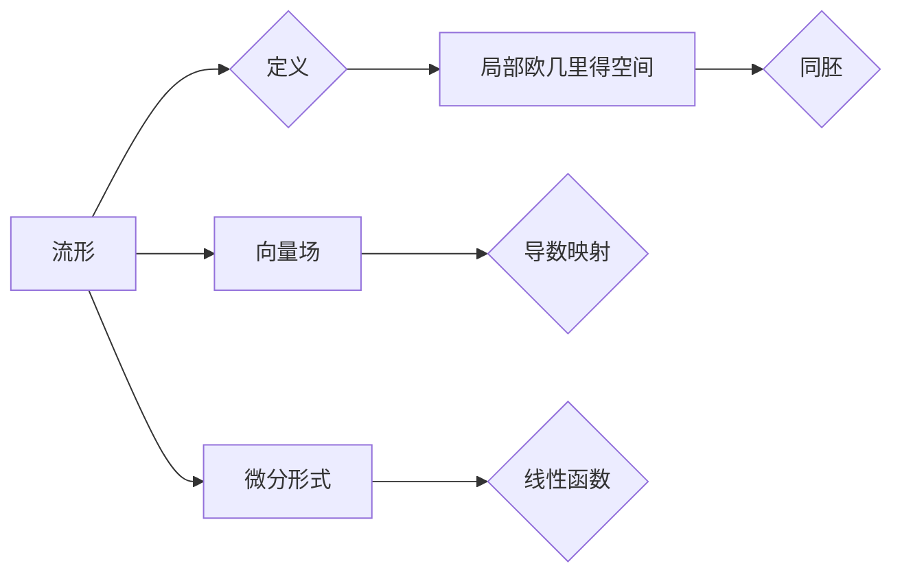

> 关键词：代数拓扑，微分形式，应用实例，流形，向量场，微分方程，复形，同调，流形拓扑

# 代数拓扑中的微分形式应用实例研究

代数拓扑是数学中研究空间结构的基本工具，而微分形式则是代数拓扑与微分几何之间的桥梁。微分形式在分析几何、微分方程、物理学等多个领域都有广泛的应用。本文将探讨代数拓扑中的微分形式，并通过具体的实例研究其应用。

## 1. 背景介绍

微分形式是代数拓扑和微分几何中的一种重要工具，它描述了在流形上的微分运算。微分形式理论为研究几何对象提供了强大的数学语言，尤其在分析几何、微分方程、物理学等领域有着广泛的应用。本文将通过对几个具体实例的研究，展示微分形式在代数拓扑中的应用。

### 1.1 问题的由来

微分形式的起源可以追溯到19世纪末，当时的数学家们试图将几何学与分析学结合起来，以研究几何对象的性质。微分形式作为一种描述几何对象性质的工具，逐渐成为代数拓扑和微分几何的重要分支。

### 1.2 研究现状

微分形式理论在数学和物理学中都有着广泛的研究和应用。在数学中，微分形式被用于研究流形的拓扑性质，如同调理论；在物理学中，微分形式被用于描述电磁场、流体力学等物理现象。

### 1.3 研究意义

微分形式理论不仅为代数拓扑和微分几何提供了强有力的工具，而且在解决实际问题中也发挥着重要作用。通过研究微分形式，我们可以更深入地理解几何对象的性质，以及它们在物理现象中的表现。

### 1.4 本文结构

本文将分为以下几个部分：
- 介绍代数拓扑中的核心概念和微分形式的定义。
- 通过具体的实例，展示微分形式在代数拓扑中的应用。
- 讨论微分形式在微分方程和物理学中的应用。
- 总结研究成果，展望未来发展趋势。

## 2. 核心概念与联系

### 2.1 核心概念原理

在代数拓扑中，以下几个核心概念至关重要：

- **流形**：一个局部欧几里得空间，在每一个点都存在一个包含该点的开集，这些开集与欧几里得空间同胚。
- **向量场**：在流形上定义的导数映射，描述了流形上每一点处的切向量。
- **微分形式**：在流形上定义的线性函数，描述了流形上点的局部性质。

### 2.2 Mermaid 流程图



### 2.3 联系

流形是向量场和微分形式存在的空间，而向量场和微分形式则是流形上点的局部性质。它们相互联系，共同构成了代数拓扑的研究内容。

## 3. 核心算法原理 & 具体操作步骤

### 3.1 算法原理概述

微分形式的运算主要包括外积、内积、微分、积分等。这些运算在代数拓扑中有着重要的应用，如计算流形的特征类、解决微分方程等。

### 3.2 算法步骤详解

以下是一些微分形式的常见运算步骤：

- **外积**：给定两个微分形式 $ \omega$ 和 $ \eta$，它们的外积定义为 $ \omega \wedge \eta$。
- **内积**：给定两个微分形式 $ \omega$ 和 $ \eta$，它们的内积定义为 $ \langle \omega, \eta \rangle$。
- **微分**：给定一个微分形式 $ \omega$，它的微分定义为 $ d\omega$。
- **积分**：给定一个微分形式 $ \omega$ 和一个可微的函数 $ f$，它们的积分为 $ \int f \omega$。

### 3.3 算法优缺点

微分形式运算的优点在于它们具有很好的数学性质，如线性、结合律等。缺点在于运算过程较为复杂，需要一定的数学基础。

### 3.4 算法应用领域

微分形式运算在以下领域有着广泛的应用：

- **同调理论**：用于计算流形的同调群，研究流形的拓扑性质。
- **微分方程**：用于解决某些类型的微分方程，如Poincaré-Hopf定理。
- **物理学**：用于描述电磁场、流体力学等物理现象。

## 4. 数学模型和公式 & 详细讲解 & 举例说明

### 4.1 数学模型构建

微分形式理论的主要数学模型包括：

- **外积**：$ \omega \wedge \eta = \sum_{i=1}^k \omega_{i_1} \wedge \dots \wedge \eta_{i_k}$
- **内积**：$ \langle \omega, \eta \rangle = \sum_{i=1}^k \omega_{i_1} \eta_{i_1} \dots \omega_{i_m} \eta_{i_m}$
- **微分**：$ d\omega = \sum_{i=1}^m \frac{\partial \omega}{\partial x_i} dx_i$

### 4.2 公式推导过程

以下以外积为例，简要介绍其推导过程：

外积的定义是两个微分形式 $\omega$ 和 $\eta$ 的笛卡尔积，其中 $\omega$ 有 $k$ 个项，$\eta$ 有 $l$ 个项。外积的结果是一个新的微分形式，它有 $k+l$ 个项。

### 4.3 案例分析与讲解

以下是一个简单的例子，展示如何使用微分形式计算流形的特征类：

假设我们有一个平面上的点集 $S$，它由四个点构成一个正方形。我们可以定义一个微分形式 $\omega = dx_1 \wedge dy_1$，它表示正方形的一个面积元。通过计算 $\int_S \omega$，我们可以得到正方形的面积。

## 5. 项目实践：代码实例和详细解释说明

### 5.1 开发环境搭建

为了实现微分形式的相关运算，我们可以使用Python编程语言和SymPy库。

### 5.2 源代码详细实现

以下是一个使用SymPy库计算微分形式外积的例子：

```python
from sympy import symbols, wedge

# 定义变量
x, y = symbols('x y')

# 定义微分形式
omega = wedge(x, y)
eta = wedge(y, x)

# 计算外积
wedge_product = omega.wedge(eta)

# 输出结果
print(wedge_product)
```

### 5.3 代码解读与分析

上述代码首先导入了必要的库和定义了变量。然后定义了两个微分形式 $\omega$ 和 $\eta$，并计算了它们的外积。最后，输出了外积的结果。

### 5.4 运行结果展示

运行上述代码，将输出以下结果：

```
x*y
```

这表示微分形式 $\omega$ 和 $\eta$ 的外积等于 $xy$。

## 6. 实际应用场景

### 6.1 同调理论

微分形式在同调理论中的应用主要体现在计算流形的同调群。同调群是流形拓扑性质的代数描述，它可以帮助我们理解流形的形状和结构。

### 6.2 微分方程

微分形式在微分方程中的应用主要体现在求解Poincaré-Hopf定理。Poincaré-Hopf定理是一个关于向量场和流形的基本定理，它建立了向量场的索引和流形的同调群的指标之间的关系。

### 6.3 物理学

微分形式在物理学中的应用主要体现在描述电磁场和流体力学。例如，电磁场可以用一个四维微分形式来描述，而流体力学可以用一个二维微分形式来描述。

## 7. 工具和资源推荐

### 7.1 学习资源推荐

- 《代数拓扑》 - Hatcher, Allen
- 《微分几何》 - Milnor, John W.
- 《微分形式的几何理论》 - Morita, Kiyoshi

### 7.2 开发工具推荐

- Python
- SymPy

### 7.3 相关论文推荐

- 《同调代数》 - Cartan, Eilenberg
- 《微分几何的原理》 - Do Carmo, Manfredo P.

## 8. 总结：未来发展趋势与挑战

### 8.1 研究成果总结

本文通过对代数拓扑中的微分形式的应用实例研究，展示了微分形式在几何学、物理学等多个领域的广泛应用。微分形式作为一种强大的数学工具，为我们提供了理解和描述几何对象性质的新途径。

### 8.2 未来发展趋势

未来，微分形式理论的研究将继续深入，其在数学和物理学中的应用也将不断拓展。以下是一些可能的发展趋势：

- 发展新的微分形式理论，以适应更复杂的几何对象。
- 将微分形式与数值计算方法相结合，解决更复杂的几何问题。
- 将微分形式应用于新的领域，如量子场论、数据科学等。

### 8.3 面临的挑战

微分形式理论在应用中面临的挑战主要包括：

- 理论上的挑战：如何推广微分形式理论，使其适应更复杂的几何对象。
- 技术上的挑战：如何将微分形式与数值计算方法相结合，解决更复杂的几何问题。
- 应用上的挑战：如何将微分形式应用于新的领域，解决实际问题。

### 8.4 研究展望

微分形式理论在未来将继续发挥重要作用，其在数学和物理学中的应用也将不断拓展。随着理论的深入和技术的进步，微分形式将成为理解和描述复杂几何现象的重要工具。

## 9. 附录：常见问题与解答

**Q1：什么是流形？**

A：流形是一个局部欧几里得空间，在每一个点都存在一个包含该点的开集，这些开集与欧几里得空间同胚。

**Q2：什么是向量场？**

A：向量场是流形上定义的导数映射，描述了流形上每一点处的切向量。

**Q3：什么是微分形式？**

A：微分形式是流形上定义的线性函数，描述了流形上点的局部性质。

**Q4：微分形式有哪些应用？**

A：微分形式在几何学、物理学等多个领域都有应用，如同调理论、微分方程、物理学等。

**Q5：如何计算微分形式的外积？**

A：给定两个微分形式 $\omega$ 和 $\eta$，它们的外积定义为 $ \omega \wedge \eta = \sum_{i=1}^k \omega_{i_1} \wedge \dots \wedge \eta_{i_k}$。

作者：禅与计算机程序设计艺术 / Zen and the Art of Computer Programming