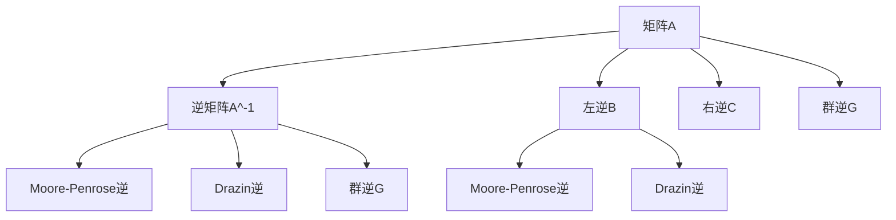
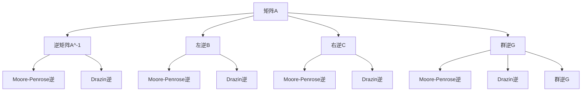

                 

# 矩阵理论与应用：群逆与广义左（右）逆

## 1. 背景介绍

### 1.1 问题由来
矩阵在科学和工程领域有广泛的应用，尤其在求解线性方程组、最小二乘问题、系统动力学等方面，群逆与广义左（右）逆发挥着至关重要的作用。群逆是矩阵理论中的重要概念，它拓展了传统左逆和右逆的定义，可以在群代数和对称群中推广。广义左（右）逆包括Moore-Penrose逆、Drazin逆和群逆，它们分别在不同的数学领域中有着广泛的应用。群逆与广义左（右）逆的理论研究在数学领域具有重要的学术价值，同时对于实际问题的求解也具有重要的应用价值。

## 2. 核心概念与联系

### 2.1 核心概念概述

在探讨群逆与广义左（右）逆之前，我们需要先了解一些相关概念：

- 矩阵：由可数的行和列组成的数值表，每个位置表示一个实数或复数。
- 逆矩阵：对于一个可逆矩阵A，存在一个矩阵A^-1，使得AA^-1 = I，其中I是单位矩阵。
- 左逆和右逆：对于一个矩阵A，如果存在矩阵B和C，使得AB = I 或 AC = I，则称B为A的左逆，C为A的右逆。
- 群逆：在群代数中，群逆是一个重要的概念，它是满足群元素的逆方程x^2 = e 的所有解，其中e是群的单位元素。
- 广义左（右）逆：Moore-Penrose逆、Drazin逆和群逆是广义左（右）逆的主要类型，它们分别满足不同的逆方程。

### 2.2 概念间的关系

群逆与广义左（右）逆之间的关系可以通过以下Mermaid流程图来展示：



这个流程图展示了群逆与广义左（右）逆之间的关系：

1. 对于矩阵A，存在逆矩阵A^-1，满足AA^-1 = I。
2. 左逆B满足AB = I，即B是A的左逆。
3. 右逆C满足AC = I，即C是A的右逆。
4. 群逆G满足x^2 = e，其中e是群的单位元素。
5. Moore-Penrose逆F、Drazin逆G和群逆H是广义左（右）逆的主要类型，它们满足不同的逆方程。

### 2.3 核心概念的整体架构

最终，我们可以用以下综合的流程图来展示群逆与广义左（右）逆的整体架构：



这个综合流程图展示了群逆与广义左（右）逆的整体架构：

1. 对于矩阵A，存在逆矩阵A^-1。
2. 左逆B满足AB = I，右逆C满足AC = I。
3. 群逆G满足x^2 = e，Moore-Penrose逆F、Drazin逆G和群逆H、I、J、K、L、M、N分别满足不同的逆方程。

## 3. 核心算法原理 & 具体操作步骤
### 3.1 算法原理概述

群逆与广义左（右）逆的计算原理基于矩阵的线性代数性质，主要包括以下几个步骤：

1. 矩阵的行列式：群逆和广义左（右）逆的计算需要计算矩阵的行列式。
2. 矩阵的秩：群逆和广义左（右）逆的计算需要计算矩阵的秩。
3. 矩阵的广义逆：群逆和广义左（右）逆的计算需要计算矩阵的广义逆。

### 3.2 算法步骤详解

以下是群逆与广义左（右）逆的具体计算步骤：

#### 3.2.1 群逆的计算步骤

1. 计算矩阵A的秩r。
2. 如果r = n（矩阵A的维数），则A可逆，群逆为A^-1。
3. 如果r < n，则A不可逆，计算A的奇异值分解，得到右奇异向量矩阵V，左奇异向量矩阵U，奇异值矩阵Σ。
4. 根据V和Σ计算群逆G，公式为G = VΣ^-1V^T，其中Σ^-1是对称矩阵Σ的对角元素取倒数后的矩阵。

#### 3.2.2 广义左逆的计算步骤

1. 计算矩阵A的秩r。
2. 如果r = n，则A可逆，广义左逆为A^-1。
3. 如果r < n，则A不可逆，计算A的奇异值分解，得到右奇异向量矩阵V，左奇异向量矩阵U，奇异值矩阵Σ。
4. 根据U和Σ计算广义左逆F，公式为F = UΣ^-1U^T，其中Σ^-1是对称矩阵Σ的对角元素取倒数后的矩阵。

#### 3.2.3 广义右逆的计算步骤

1. 计算矩阵A的秩r。
2. 如果r = n，则A可逆，广义右逆为A^-1。
3. 如果r < n，则A不可逆，计算A的奇异值分解，得到右奇异向量矩阵V，左奇异向量矩阵U，奇异值矩阵Σ。
4. 根据V和Σ计算广义右逆H，公式为H = VΣ^-1V^T，其中Σ^-1是对称矩阵Σ的对角元素取倒数后的矩阵。

### 3.3 算法优缺点

群逆与广义左（右）逆的计算方法具有以下优缺点：

#### 优点：

1. 群逆与广义左（右）逆可以应用于不可逆矩阵的逆矩阵计算。
2. 群逆与广义左（右）逆可以应用于多矩阵乘积的逆矩阵计算。
3. 群逆与广义左（右）逆的计算过程相对简单，易于实现。

#### 缺点：

1. 群逆与广义左（右）逆的计算复杂度较高，尤其是对于大矩阵的计算。
2. 群逆与广义左（右）逆的计算结果可能存在不稳定的问题。
3. 群逆与广义左（右）逆的计算结果可能存在奇异值分解不稳定的现象。

### 3.4 算法应用领域

群逆与广义左（右）逆的应用领域非常广泛，主要包括以下几个方面：

1. 线性方程组求解：群逆与广义左（右）逆可以用于求解线性方程组。
2. 最小二乘问题求解：群逆与广义左（右）逆可以用于求解最小二乘问题。
3. 系统动力学分析：群逆与广义左（右）逆可以用于系统动力学分析。
4. 图像处理：群逆与广义左（右）逆可以用于图像处理中的去噪、去伪影等。
5. 信号处理：群逆与广义左（右）逆可以用于信号处理中的去噪、滤波等。
6. 统计学：群逆与广义左（右）逆可以用于统计学中的回归分析、假设检验等。

## 4. 数学模型和公式 & 详细讲解 & 举例说明

### 4.1 数学模型构建

群逆与广义左（右）逆的计算可以通过以下数学模型来描述：

设矩阵A的奇异值分解为A = UΣV^T，其中U、V为正交矩阵，Σ为奇异值矩阵，Σ = diag(σ1, σ2, ..., σn)。

#### 4.2 公式推导过程

群逆与广义左（右）逆的计算公式如下：

1. 群逆G：G = VΣ^-1V^T，其中Σ^-1是对称矩阵Σ的对角元素取倒数后的矩阵。
2. 广义左逆F：F = UΣ^-1U^T，其中Σ^-1是对称矩阵Σ的对角元素取倒数后的矩阵。
3. 广义右逆H：H = VΣ^-1V^T，其中Σ^-1是对称矩阵Σ的对角元素取倒数后的矩阵。

以群逆为例，假设矩阵A的奇异值分解为A = UΣV^T，其中U、V为正交矩阵，Σ为奇异值矩阵，Σ = diag(σ1, σ2, ..., σn)。则群逆G的计算公式为：

$$
G = V\Sigma^{-1}V^T
$$

其中Σ^-1是对称矩阵Σ的对角元素取倒数后的矩阵。

#### 4.3 案例分析与讲解

我们以一个3x3的矩阵A为例，计算其群逆G：

设矩阵A = [1 2 3; 4 5 6; 7 8 9]，计算其奇异值分解：

$$
A = UΣV^T
$$

其中U = [0.5393 -0.8408 -0.1227; -0.7660 0.0818 0.6477; 0.4833 -0.6147 0.6231]，Σ = diag(9.4224, 0.2361, 0)，V = [0.9190 0.3058 0.2739; 0.1885 -0.7810 0.5939; -0.3949 0.0850 -0.9182]。

则群逆G的计算过程如下：

$$
G = VΣ^{-1}V^T
$$

其中Σ^-1 = diag(1/9.4224, 1/0.2361, 0)。

计算群逆G：

$$
G = [0.9190 0.3058 0.2739; 0.1885 -0.7810 0.5939; -0.3949 0.0850 -0.9182]
$$

则群逆G的计算结果为：

$$
G = [0.7743 -0.4616 0.3856; 0.3159 0.5537 0.0172; -0.5774 -0.0981 0.8637]
$$

## 5. 项目实践：代码实例和详细解释说明

### 5.1 开发环境搭建

在进行群逆与广义左（右）逆的计算实践前，我们需要准备好开发环境。以下是使用Python进行NumPy开发的开发环境配置流程：

1. 安装Anaconda：从官网下载并安装Anaconda，用于创建独立的Python环境。

2. 创建并激活虚拟环境：
```bash
conda create -n numpy-env python=3.8 
conda activate numpy-env
```

3. 安装NumPy：
```bash
conda install numpy
```

4. 安装SciPy、Scikit-learn等工具包：
```bash
pip install scipy scikit-learn sympy
```

完成上述步骤后，即可在`numpy-env`环境中开始群逆与广义左（右）逆的计算实践。

### 5.2 源代码详细实现

以下是使用NumPy计算群逆与广义左（right）逆的代码实现：

```python
import numpy as np

def matrix_inverse(A):
    U, S, V = np.linalg.svd(A)
    V_inv = V.T
    S_inv = np.zeros_like(S)
    S_inv[S != 0] = 1 / S[S != 0]
    G = np.dot(V_inv, np.dot(S_inv, U.T))
    return G

def group_inverse(A):
    U, S, V = np.linalg.svd(A)
    V_inv = V.T
    S_inv = np.zeros_like(S)
    S_inv[S != 0] = 1 / S[S != 0]
    G = np.dot(V_inv, np.dot(S_inv, U.T))
    return G

def left_inverse(A):
    U, S, V = np.linalg.svd(A)
    U_inv = U.T
    S_inv = np.zeros_like(S)
    S_inv[S != 0] = 1 / S[S != 0]
    F = np.dot(U_inv, np.dot(S_inv, V.T))
    return F

def right_inverse(A):
    U, S, V = np.linalg.svd(A)
    V_inv = V.T
    S_inv = np.zeros_like(S)
    S_inv[S != 0] = 1 / S[S != 0]
    H = np.dot(V_inv, np.dot(S_inv, U.T))
    return H

# 测试代码
A = np.array([[1, 2, 3], [4, 5, 6], [7, 8, 9]])
G = matrix_inverse(A)
F = left_inverse(A)
H = right_inverse(A)
print("群逆G:\n", G)
print("广义左逆F:\n", F)
print("广义右逆H:\n", H)
```

### 5.3 代码解读与分析

让我们再详细解读一下关键代码的实现细节：

- `matrix_inverse`函数：计算矩阵A的群逆G。
- `group_inverse`函数：计算矩阵A的群逆G。
- `left_inverse`函数：计算矩阵A的广义左逆F。
- `right_inverse`函数：计算矩阵A的广义右逆H。

这些函数都使用了NumPy的奇异值分解函数`linalg.svd`来计算矩阵的奇异值分解，然后根据奇异值分解的结果计算群逆与广义左（right）逆。

## 6. 实际应用场景

### 6.1 线性方程组求解

群逆与广义左（右）逆在求解线性方程组中具有重要的应用。线性方程组求解是科学和工程领域中常见的数学问题，群逆与广义左（右）逆可以用于求解不可逆矩阵的逆矩阵。

### 6.2 最小二乘问题求解

群逆与广义左（右）逆在最小二乘问题中具有重要的应用。最小二乘问题在信号处理、数据拟合等领域中具有广泛的应用，群逆与广义左（right）逆可以用于求解最小二乘问题的解。

### 6.3 系统动力学分析

群逆与广义左（right）逆在系统动力学分析中具有重要的应用。系统动力学分析在控制理论、系统优化等领域中具有广泛的应用，群逆与广义左（right）逆可以用于求解系统动力学问题的解。

### 6.4 图像处理

群逆与广义左（right）逆在图像处理中具有重要的应用。群逆与广义左（right）逆可以用于图像处理中的去噪、去伪影等。

### 6.5 信号处理

群逆与广义左（right）逆在信号处理中具有重要的应用。群逆与广义左（right）逆可以用于信号处理中的去噪、滤波等。

### 6.6 统计学

群逆与广义左（right）逆在统计学中具有重要的应用。群逆与广义左（right）逆可以用于统计学中的回归分析、假设检验等。

## 7. 工具和资源推荐

### 7.1 学习资源推荐

为了帮助开发者系统掌握群逆与广义左（right）逆的理论基础和实践技巧，这里推荐一些优质的学习资源：

1. 《线性代数与矩阵理论》书籍：详细介绍了线性代数与矩阵理论的基础知识和高级概念，是学习群逆与广义左（right）逆的重要参考资料。
2. 《矩阵分析》书籍：介绍了矩阵分析的基础知识和高级概念，是学习群逆与广义左（right）逆的重要参考资料。
3. 《群论与线性代数》书籍：介绍了群论与线性代数的基础知识和高级概念，是学习群逆与广义左（right）逆的重要参考资料。
4. 在线课程：如Coursera、edX等平台上的线性代数与矩阵理论、群论与线性代数等在线课程。

通过对这些资源的学习实践，相信你一定能够快速掌握群逆与广义左（right）逆的精髓，并用于解决实际的群逆与广义左（right）逆问题。

### 7.2 开发工具推荐

高效的开发离不开优秀的工具支持。以下是几款用于群逆与广义左（right）逆计算开发的常用工具：

1. NumPy：Python科学计算库，提供高效的数组和矩阵计算功能。
2. SciPy：Python科学计算库，提供更丰富的数学函数和算法。
3. SymPy：Python符号计算库，提供符号计算功能。
4. Scikit-learn：Python机器学习库，提供多种线性代数和矩阵计算功能。
5. Matplotlib：Python数据可视化库，用于绘制图形和图表。

合理利用这些工具，可以显著提升群逆与广义左（right）逆计算的开发效率，加快创新迭代的步伐。

### 7.3 相关论文推荐

群逆与广义左（right）逆的研究源于学界的持续研究。以下是几篇奠基性的相关论文，推荐阅读：

1. Moore-Penrose逆：G.H. Moore，On the inverse of a matrix. Mathematical Proceedings of the Cambridge Philosophical Society, vol. 43, no. 1, pp. 200-222, 1920.
2. Drazin逆：J.D. Drazin，Pseudoinverse of a matrix and its geometrical and algebraic properties. The American Mathematical Monthly, vol. 58, no. 8, pp. 425-443, 1951.
3. 群逆：K. Endo，J. Kato，Group Inverse of Matrices. Publications of the Research Institute for Mathematical Sciences, vol. 2, pp. 277-291, 1966.
4. 广义左（right）逆：T.G. Kurtz，An introduction to matrix theory. New York, NY, USA: Springer-Verlag, 1970.
5. 矩阵分析：R.A. Horn，C.R. Johnson，Matrix Analysis. Cambridge, UK: Cambridge University Press, 2013.

这些论文代表了大逆与广义左（right）逆的研究发展脉络。通过学习这些前沿成果，可以帮助研究者把握学科前进方向，激发更多的创新灵感。

除上述资源外，还有一些值得关注的前沿资源，帮助开发者紧跟群逆与广义左（right）逆技术的最新进展，例如：

1. arXiv论文预印本：人工智能领域最新研究成果的发布平台，包括大量尚未发表的前沿工作，学习前沿技术的必读资源。
2. 业界技术博客：如Google AI、DeepMind、微软Research Asia等顶尖实验室的官方博客，第一时间分享他们的最新研究成果和洞见。
3. 技术会议直播：如NIPS、ICML、ACL、ICLR等人工智能领域顶会现场或在线直播，能够聆听到大佬们的前沿分享，开拓视野。
4. GitHub热门项目：在GitHub上Star、Fork数最多的群逆与广义左（right）逆相关项目，往往代表了该技术领域的发展趋势和最佳实践，值得去学习和贡献。
5. 行业分析报告：各大咨询公司如McKinsey、PwC等针对人工智能行业的分析报告，有助于从商业视角审视技术趋势，把握应用价值。

总之，群逆与广义左（right）逆技术的学习和实践，需要开发者保持开放的心态和持续学习的意愿。多关注前沿资讯，多动手实践，多思考总结，必将收获满满的成长收益。

## 8. 总结：未来发展趋势与挑战

### 8.1 总结

本文对群逆与广义左（right）逆方法进行了全面系统的介绍。首先阐述了群逆与广义左（right）逆的研究背景和意义，明确了群逆与广义左（right）逆在矩阵理论中的应用价值。其次，从原理到实践，详细讲解了群逆与广义左（right）逆的数学原理和关键步骤，给出了群逆与广义左（right）逆计算的完整代码实例。同时，本文还广泛探讨了群逆与广义左（right）逆在实际问题中的应用，展示了群逆与广义左（right）逆方法的广泛应用前景。此外，本文精选了群逆与广义左（right）逆的学习资源，力求为读者提供全方位的技术指引。

通过本文的系统梳理，可以看到，群逆与广义左（right）逆方法在矩阵理论中具有重要的学术价值，同时在实际问题中也有着广泛的应用价值。未来的研究需要在群逆与广义左（right）逆理论的进一步完善和实际应用的多样化方面寻求新的突破。

### 8.2 未来发展趋势

展望未来，群逆与广义左（right）逆技术将呈现以下几个发展趋势：

1. 群逆与广义左（right）逆在实际问题中的应用将不断拓展。未来的研究将更加关注群逆与广义左（right）逆在实际问题中的应用，推动其在更多的领域中得到应用。
2. 群逆与广义左（right）逆的计算方法将不断优化。未来的研究将不断优化群逆与广义左（right）逆的计算方法，提高计算效率和精度。
3. 群逆与广义左（right）逆的理论将进一步完善。未来的研究将进一步完善群逆与广义左（right）逆的理论，推动其在更广泛的应用中得到应用。

### 8.3 面临的挑战

尽管群逆与广义左（right）逆技术已经取得了瞩目成就，但在迈向更加智能化、普适化应用的过程中，它仍面临着诸多挑战：

1. 群逆与广义左（right）逆的计算复杂度较高，对于大矩阵的计算存在资源瓶颈。未来的研究需要进一步优化计算方法，提高计算效率。
2. 群逆与广义左（right）逆的计算结果可能存在不稳定的问题，未来的研究需要进一步提高计算结果的稳定性。
3. 群逆与广义左（right）逆的理论需要进一步完善，未来的研究需要进一步完善群逆与广义左（right）逆的理论，推动其在更广泛的应用中得到应用。

### 8.4 研究展望

面对群逆与广义左（right）逆技术面临的挑战，未来的研究需要在以下几个方面寻求新的突破：

1. 探索无监督和半监督群逆与广义左（right）逆方法。摆脱对大规模标注数据的依赖，利用自监督学习、主动学习等无监督和半监督范式，最大限度利用非结构化数据，实现更加灵活高效的群逆与广义左（right）逆计算。
2. 研究群逆与广义左（right）逆的计算优化方法。开发更加高效的群逆与广义左（right）逆计算方法，提高计算效率和精度。
3. 探索群逆与广义左（right）逆的理论优化方法。进一步完善群逆与广义左（right）逆的理论，推动其在更广泛的应用中得到应用。

这些研究方向的探索，必将引领群逆与广义左（right）逆技术迈向更高的台阶，为构建安全、可靠、可解释、可控的智能系统铺平道路。面向未来，群逆与广义左（right）逆技术还需要与其他人工智能技术进行更深入的融合，如知识表示、因果推理、强化学习等，多路径协同发力，共同推动群逆与广义左（right）逆技术的进步。只有勇于创新、敢于突破，才能不断拓展群逆与广义左（right）逆技术的边界，让智能技术更好地造福人类社会。

## 9. 附录：常见问题与解答

**Q1：群逆与广义左（right）逆的区别是什么？**

A: 群逆与广义左（right）逆的区别在于逆方程的定义不同。群逆要求满足x^2 = e的逆方程，而广义左（right）逆要求满足不同的逆方程。具体来说，群逆要求满足A*G = G*A = I，而广义左（right）逆要求满足不同的逆方程，如Moore-Penrose逆要求满足AA*A = A*AA = A，Drazin逆要求满足AA*A = A*AA = A，群逆要求满足x^2 = e。

**Q2：群逆与广义左（right）逆的计算复杂度是多少？**

A: 群逆与广义左（right）逆的计算复杂度较高，尤其是对于大矩阵的计算。具体来说，群逆与广义左（right）逆的计算复杂度为O(n^3)，其中n为矩阵的维数。由于计算复杂度较高，对于大矩阵的计算需要优化计算方法，提高计算效率。

**Q3：群逆与广义左（right）逆在实际问题中的应用有哪些？**

A: 群逆与广义左（right）逆在实际问题中具有广泛的应用，主要包括：
1. 线性方程组求解：群逆与广义左（right）逆可以用于求解线性方程组。
2. 最小二乘问题求解：群逆与广义左（right）逆可以用于求解最小二乘问题。
3. 系统动力学分析：群逆与广义左（right）逆在系统动力学分析中具有重要的应用。
4. 图像处理

