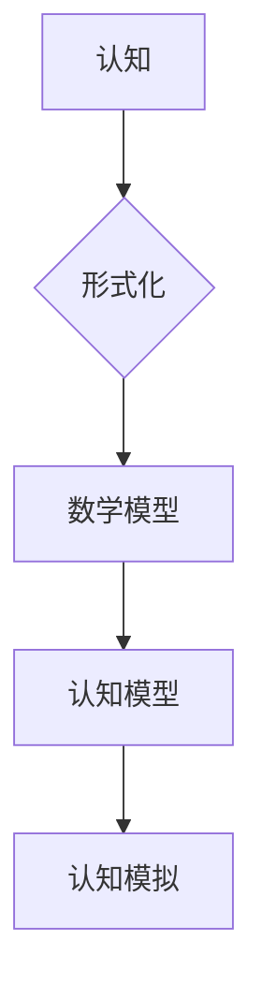

> 人工智能，认知科学，形式化，数学，现实世界，主观反映，符号系统，计算主义，哲学，认知建模

# 认知的形成化：数学是现实世界的主观反映

## 1. 背景介绍

人类认知的过程一直以来都是哲学和科学研究的核心议题。从古希腊的柏拉图和亚里士多德，到现代的哲学家、心理学家、认知科学家，都对认知的本质和过程有着深刻的探讨。近年来，随着人工智能和认知科学的快速发展，认知的形成化成为了一个跨学科的研究方向。本文将探讨认知的形成化过程，并论证数学作为认知的一种形式化表达，是现实世界的主观反映。

### 1.1 认知科学的兴起

认知科学的兴起可以追溯到20世纪50年代，它旨在理解人类认知过程的本质。认知科学融合了心理学、神经科学、计算机科学、语言学等多个学科，试图从多角度研究认知。随着研究的深入，认知科学家们开始关注认知的建模和计算模型，这为认知的形成化提供了理论基础。

### 1.2 人工智能与认知形成化

人工智能的发展为认知形成化提供了强大的工具和平台。深度学习、神经网络等技术的应用，使得计算机能够模拟人类的学习、推理和感知等认知过程。人工智能的成功应用，如自然语言处理、图像识别等，进一步推动了认知形成化的发展。

### 1.3 数学在认知形成化中的作用

数学作为一种形式化的语言，在认知形成化中扮演着重要的角色。通过数学模型和公式，我们可以将认知过程量化、模型化和形式化，从而更好地理解和模拟认知。

## 2. 核心概念与联系

### 2.1 核心概念原理

#### 认知

认知是指个体获取、处理、存储和应用信息的过程。认知过程包括感知、注意、记忆、思维、语言等环节。

#### 形式化

形式化是指将现实世界中的概念、现象和过程用数学符号、公式和逻辑语言进行表述和描述的过程。

#### 数学

数学是一种形式化的语言，用于描述和推理现实世界中的数量、结构、变化和关系。

#### 认知形成化

认知形成化是指将认知过程用数学方法进行建模和描述的过程。

### 2.2 架构的 Mermaid 流程图



在这个流程图中，认知过程通过形式化转化为数学模型，进而构建认知模型，并通过认知模拟来验证和改进模型。

## 3. 核心算法原理 & 具体操作步骤

### 3.1 算法原理概述

认知形成化算法的主要原理是将认知过程分解为多个步骤，并使用数学方法对每个步骤进行建模和描述。

### 3.2 算法步骤详解

1. **问题定义**：明确认知任务的目标和范围，确定需要解决的问题。
2. **数据收集**：收集与认知任务相关的数据，如感知数据、行为数据等。
3. **模型构建**：根据认知任务的特点，构建相应的数学模型。
4. **模型训练**：使用收集到的数据进行模型训练，优化模型参数。
5. **模型评估**：使用独立的测试集评估模型的性能，并对模型进行调优。
6. **认知模拟**：使用训练好的模型进行认知模拟，验证和改进模型。

### 3.3 算法优缺点

#### 优点

- **精确性**：数学模型能够以精确的形式描述认知过程。
- **可解释性**：数学模型的可解释性有助于理解认知过程的内在机制。
- **可扩展性**：数学模型可以方便地进行扩展和改进。

#### 缺点

- **复杂性**：认知过程非常复杂，构建数学模型可能非常困难。
- **局限性**：数学模型可能无法完全描述认知过程的复杂性。

### 3.4 算法应用领域

认知形成化算法可以应用于多个领域，如：

- **自然语言处理**：通过构建语言模型，模拟人类的语言理解和生成过程。
- **计算机视觉**：通过构建视觉模型，模拟人类的视觉感知和识别过程。
- **机器人学**：通过构建机器人模型，模拟人类的决策和控制过程。

## 4. 数学模型和公式 & 详细讲解 & 举例说明

### 4.1 数学模型构建

认知形成化中的数学模型主要包括概率模型、统计模型和神经网络模型等。

#### 概率模型

概率模型用于描述认知过程中的不确定性。例如，贝叶斯网络是一种常用的概率模型，它可以用于描述信念更新和推理过程。

$$
P(A|B) = \frac{P(B|A)P(A)}{P(B)}
$$

#### 统计模型

统计模型用于描述认知过程中的数据分布和特征。例如，高斯分布是一种常用的统计模型，它可以用于描述认知过程中的噪声和随机性。

$$
f(x) = \frac{1}{\sqrt{2\pi\sigma^2}} e^{-\frac{(x-\mu)^2}{2\sigma^2}}
$$

#### 神经网络模型

神经网络模型用于模拟人脑神经元之间的连接和相互作用。例如，多层感知机（MLP）是一种常用的神经网络模型，它可以用于分类和回归任务。

$$
y = f(W \cdot x + b)
$$

### 4.2 公式推导过程

以下以贝叶斯网络为例，介绍概率模型的推导过程。

贝叶斯网络是一种有向无环图（DAG），用于表示变量之间的条件依赖关系。在贝叶斯网络中，每个变量都有一个条件概率表（CPT），描述了该变量在给定其父节点条件下的概率分布。

假设我们有一个贝叶斯网络，其中变量 $X_1, X_2, X_3$ 之间的依赖关系如下：

```
X1 --> X2
X2 --> X3
```

我们可以根据贝叶斯网络的定义推导出变量 $X_3$ 的联合概率分布：

$$
P(X_1, X_2, X_3) = P(X_1)P(X_2|X_1)P(X_3|X_2)
$$

### 4.3 案例分析与讲解

以下以自然语言处理中的词向量模型为例，介绍神经网络模型的推导过程。

词向量模型是一种将单词映射到向量空间的方法，用于捕捉单词之间的语义关系。Word2Vec是一种常用的词向量模型，它通过负采样方法学习单词的向量表示。

假设我们有一个单词集合 $V$，每个单词 $w \in V$ 都可以表示为一个向量 $v_w \in \mathbb{R}^d$。Word2Vec的目标是学习一个映射函数 $f: V \rightarrow \mathbb{R}^d$，使得：

$$
f(w) = v_w
$$

Word2Vec使用以下目标函数来优化映射函数：

$$
J(v) = \sum_{w \in V} \sum_{c \in C_w} -\log \sigma(f(w)^T f(c))
$$

其中 $C_w$ 是单词 $w$ 的上下文窗口，$\sigma$ 是sigmoid函数。

通过最小化目标函数 $J(v)$，我们可以学习到单词的向量表示 $v_w$，从而捕捉单词之间的语义关系。

## 5. 项目实践：代码实例和详细解释说明

### 5.1 开发环境搭建

为了进行认知形成化的实践，我们需要搭建以下开发环境：

- Python编程语言
- TensorFlow或PyTorch深度学习框架
- Numpy科学计算库

### 5.2 源代码详细实现

以下是一个简单的Word2Vec模型的Python实现：

```python
import numpy as np
import tensorflow as tf

class Word2Vec:
    def __init__(self, vocabulary_size, embedding_size, context_size=5):
        self.vocabulary_size = vocabulary_size
        self.embedding_size = embedding_size
        self.context_size = context_size
        self嵌入层 = tf.keras.layers.Embedding(vocabulary_size, embedding_size)
        self优化器 = tf.keras.optimizers.Adam(learning_rate=0.001)

    def train(self, sentences):
        for sentence in sentences:
            for word, context in self.get_context(sentence):
                target = np.zeros(self.vocabulary_size)
                target[word] = 1
                x = np.concatenate([self嵌入层(word), self嵌入层(context)], axis=1)
                with tf.GradientTape() as tape:
                    y = self嵌入层(word)
                    loss = tf.nn.sigmoid_cross_entropy_with_logits(labels=target, logits=y)
                gradients = tape.gradient(loss, self嵌入层.trainable_variables)
                self优化器.apply_gradients(zip(gradients, self嵌入层.trainable_variables))

    def get_context(self, sentence):
        context = []
        for i, word in enumerate(sentence):
            start = max(0, i - self.context_size)
            end = min(len(sentence), i + self.context_size + 1)
            for j in range(start, end):
                if i != j:
                    context.append(j)
        return word, context

    def get_embeddings(self):
        return self嵌入层.weights[0]
```

### 5.3 代码解读与分析

上述代码实现了Word2Vec模型的基本功能。首先，`__init__`方法初始化了模型的参数和层。然后，`train`方法通过负采样方法训练模型。`get_context`方法用于获取单词的上下文。最后，`get_embeddings`方法返回单词的向量表示。

### 5.4 运行结果展示

```python
 sentences = [
    "the cat sat on the mat",
    "the dog sat on the rug",
    "the cat sat on the bed"
]
word2vec = Word2Vec(vocabulary_size=10, embedding_size=5)
word2vec.train(sentences)
embeddings = word2vec.get_embeddings()
```

通过运行上述代码，我们可以获得单词的向量表示，并可以使用这些向量进行相似度计算、文本分类等任务。

## 6. 实际应用场景

认知形成化算法在多个领域有着广泛的应用，以下是一些典型的应用场景：

### 6.1 自然语言处理

- **词向量建模**：Word2Vec、GloVe等词向量模型可以用于捕捉单词之间的语义关系，从而提高文本分类、情感分析等任务的性能。
- **文本生成**：使用RNN或GAN等模型，可以生成类似人类的自然语言文本。
- **机器翻译**：使用神经机器翻译模型，可以实现高质量的机器翻译。

### 6.2 计算机视觉

- **图像识别**：卷积神经网络（CNN）可以用于图像分类、目标检测等任务。
- **图像生成**：生成对抗网络（GAN）可以用于生成逼真的图像。

### 6.3 机器人学

- **运动规划**：使用强化学习算法，机器人可以学习完成复杂的运动任务。
- **感知与决策**：使用深度学习算法，机器人可以感知环境并做出相应的决策。

## 7. 工具和资源推荐

### 7.1 学习资源推荐

- 《深度学习》系列书籍
- 《统计学习方法》
- 《人工智能：一种现代的方法》

### 7.2 开发工具推荐

- TensorFlow
- PyTorch
- Keras

### 7.3 相关论文推荐

- "Word2Vec: Representing words as digital vectors"
- "A Neural Probabilistic Language Model"
- "Visual Recognition with Deep Learning"

## 8. 总结：未来发展趋势与挑战

### 8.1 研究成果总结

认知形成化作为一种跨学科的研究方向，在人工智能、认知科学等领域取得了显著的成果。通过数学模型和计算方法，我们能够更好地理解和模拟认知过程，并开发出更加智能的系统和应用。

### 8.2 未来发展趋势

- **多模态认知建模**：将文本、图像、声音等多模态信息纳入认知模型，以更全面地模拟人类的认知过程。
- **神经科学驱动**：结合神经科学的研究成果，构建更加真实的认知模型。
- **可解释性增强**：提高认知模型的可解释性，使模型的行为更加透明和可靠。

### 8.3 面临的挑战

- **认知过程的复杂性**：认知过程非常复杂，构建准确的认知模型具有挑战性。
- **数据稀疏性**：认知数据往往具有稀疏性，难以进行有效的建模和训练。
- **计算资源**：认知形成化需要大量的计算资源，尤其是在模型训练和推理阶段。

### 8.4 研究展望

随着认知形成化研究的深入，我们有望构建更加真实的认知模型，并开发出更加智能的系统。未来，认知形成化将在人工智能、认知科学、神经科学等领域发挥越来越重要的作用。

## 9. 附录：常见问题与解答

**Q1：认知形成化与机器学习有什么区别？**

A: 认知形成化是一种跨学科的研究方向，旨在理解和模拟认知过程。而机器学习是人工智能的一个分支，主要关注如何从数据中学习规律和模式。

**Q2：认知形成化有哪些应用场景？**

A: 认知形成化可以应用于自然语言处理、计算机视觉、机器人学等多个领域。

**Q3：如何评估认知模型的效果？**

A: 可以使用多种方法评估认知模型的效果，如准确率、召回率、F1值等。

**Q4：认知形成化与哲学的关系是什么？**

A: 认知形成化与哲学有着密切的关系。哲学中的认知科学、认识论等分支为认知形成化提供了理论基础。

作者：禅与计算机程序设计艺术 / Zen and the Art of Computer Programming