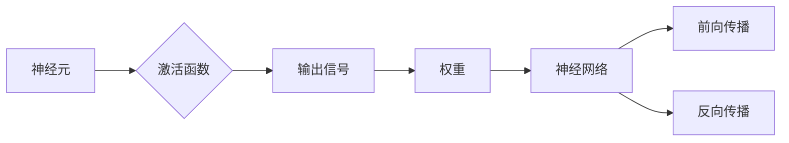

# 神经网络原理与代码实例讲解

作者：禅与计算机程序设计艺术 / Zen and the Art of Computer Programming

## 1. 背景介绍

### 1.1 问题的由来

神经网络作为人工智能领域的一个重要分支，近年来在图像识别、自然语言处理、语音识别等领域取得了显著的成果。自1958年人工神经网络（ANN）的概念被首次提出以来，神经网络经历了多次兴衰。随着计算能力的提升和深度学习技术的突破，神经网络在21世纪迎来了新的春天。

### 1.2 研究现状

目前，神经网络已经成为机器学习领域的主流算法之一。常见的神经网络模型包括前馈神经网络、卷积神经网络、循环神经网络等。其中，卷积神经网络（CNN）在图像识别领域取得了突破性的成果，循环神经网络（RNN）在自然语言处理领域表现出色。

### 1.3 研究意义

神经网络在各个领域的应用，为人类社会带来了巨大的便利。例如，在医疗领域，神经网络可以辅助医生进行疾病诊断；在交通领域，神经网络可以用于自动驾驶；在金融领域，神经网络可以用于风险评估等。

### 1.4 本文结构

本文将全面介绍神经网络的原理与代码实例，旨在帮助读者深入理解神经网络的工作机制，并掌握其应用方法。文章内容安排如下：

- 第2部分，介绍神经网络的核心概念与联系。
- 第3部分，详细阐述神经网络的基本原理和具体操作步骤。
- 第4部分，介绍神经网络中常用的数学模型和公式，并结合实例进行讲解。
- 第5部分，给出神经网络的代码实例，并对关键代码进行解读与分析。
- 第6部分，探讨神经网络在实际应用场景中的应用，并展望未来发展趋势。
- 第7部分，推荐神经网络相关的学习资源、开发工具和参考文献。
- 第8部分，总结全文，展望神经网络技术的未来发展趋势与挑战。
- 第9部分，附录：常见问题与解答。

## 2. 核心概念与联系

为了更好地理解神经网络，本节将介绍几个密切相关的核心概念：

- 神经元（Neuron）：神经网络的基本组成单元，类似于大脑中的神经元，负责接收输入信号，通过激活函数产生输出信号。
- 神经网络（Neural Network）：由多个神经元组成的层次化结构，通过前向传播和反向传播进行学习。
- 激活函数（Activation Function）：神经元输出信号的计算方式，用于引入非线性关系。
- 权重（Weight）：连接神经元之间的系数，用于调节信号传递强度。
- 激活函数梯度（Activation Function Gradient）：用于计算激活函数的导数，用于反向传播过程中的参数更新。

它们的逻辑关系如下图所示：



可以看出，神经元通过激活函数产生输出信号，连接神经元之间的权重用于调节信号传递强度，从而构成神经网络。神经网络通过前向传播和反向传播进行学习，不断调整权重以优化输出结果。

## 3. 核心算法原理 & 具体操作步骤

### 3.1 算法原理概述

神经网络通过模拟人脑神经元之间的连接和交互，实现对数据的特征提取和学习。其基本原理如下：

1. **数据输入**：将输入数据输入到网络的第一个神经元。
2. **前向传播**：将输入数据通过神经元和权重传递到下一个神经元，并经过激活函数处理后产生输出。
3. **损失计算**：将输出与目标值进行比较，计算损失函数值。
4. **反向传播**：根据损失函数值，反向传播梯度，并更新网络的权重和偏置。
5. **迭代优化**：重复步骤2-4，直至达到预设的精度要求。

### 3.2 算法步骤详解

神经网络的学习过程可以分为以下步骤：

1. **数据预处理**：将输入数据归一化，去除异常值，并进行数据增强等操作。
2. **模型构建**：选择合适的神经网络结构，并设置神经元、层数、激活函数等参数。
3. **权重初始化**：随机初始化网络的权重和偏置。
4. **前向传播**：将输入数据输入到网络，通过激活函数处理后产生输出。
5. **损失计算**：计算输出与目标值之间的损失函数值。
6. **反向传播**：计算损失函数对权重的梯度，并更新网络的权重和偏置。
7. **迭代优化**：重复步骤4-6，直至达到预设的精度要求。

### 3.3 算法优缺点

神经网络的优点如下：

- **强大的学习能力**：能够从大量数据中自动学习特征，无需人工设计特征。
- **非线性建模能力**：能够处理非线性关系，适用于复杂问题的建模。
- **泛化能力强**：在训练数据较少的情况下，仍能较好地泛化到未知数据。

神经网络的缺点如下：

- **计算复杂度高**：神经网络包含大量参数和计算，对硬件资源要求较高。
- **难以解释**：神经网络的学习过程和决策过程难以解释，难以理解其内部工作机制。
- **过拟合风险**：在训练数据较少的情况下，容易出现过拟合现象。

### 3.4 算法应用领域

神经网络在各个领域都有广泛的应用，以下列举几个常见的应用场景：

- **图像识别**：用于识别图像中的物体、场景等。
- **自然语言处理**：用于文本分类、机器翻译、情感分析等。
- **语音识别**：用于语音到文本的转换。
- **推荐系统**：用于推荐电影、音乐、商品等。
- **医疗诊断**：用于辅助医生进行疾病诊断。

## 4. 数学模型和公式 & 详细讲解 & 举例说明

### 4.1 数学模型构建

神经网络的核心是神经元，其数学模型可以表示为：

$$
f(x) = \sigma(W^T \cdot x + b)
$$

其中，$x$ 表示输入向量，$W$ 表示权重矩阵，$b$ 表示偏置项，$\sigma$ 表示激活函数。

### 4.2 公式推导过程

以下以一个简单的神经网络为例，介绍公式推导过程。

假设有一个包含两个隐藏层的神经网络，输入层有3个神经元，隐藏层有5个神经元，输出层有2个神经元。

1. **前向传播**：

$$
h_1 = \sigma(W_1^T \cdot x + b_1) \quad (1\leq i\leq 5)
$$

$$
y = \sigma(W_2^T \cdot h_1 + b_2) \quad (1\leq j\leq 2)
$$

其中，$h_1$ 表示第一个隐藏层的输出，$y$ 表示输出层输出。

2. **反向传播**：

$$
\delta_2 = \frac{\partial L}{\partial y} \cdot \sigma'(y) \quad (1\leq j\leq 2)
$$

$$
\delta_1 = \frac{\partial L}{\partial h_1} \cdot \sigma'(h_1) \quad (1\leq i\leq 5)
$$

其中，$L$ 表示损失函数，$\sigma'$ 表示激活函数的导数。

根据梯度下降算法，可以得到权重和偏置的更新公式：

$$
W_2 \leftarrow W_2 - \eta \cdot \delta_2 \cdot h_1^T
$$

$$
b_2 \leftarrow b_2 - \eta \cdot \delta_2
$$

$$
W_1 \leftarrow W_1 - \eta \cdot \delta_1 \cdot x^T
$$

$$
b_1 \leftarrow b_1 - \eta \cdot \delta_1
$$

其中，$\eta$ 表示学习率。

### 4.3 案例分析与讲解

以下以一个简单的二分类任务为例，介绍神经网络的实现过程。

**数据集**：

| 样本编号 | 输入 | 输出 |
| --- | --- | --- |
| 1 | [0.1, 0.2, 0.3] | 0 |
| 2 | [0.4, 0.5, 0.6] | 1 |
| 3 | [0.7, 0.8, 0.9] | 1 |
| 4 | [0.1, 0.2, 0.3] | 1 |
| 5 | [0.4, 0.5, 0.6] | 0 |

**网络结构**：

- 输入层：1个神经元
- 隐藏层：3个神经元
- 输出层：1个神经元

**激活函数**：

- ReLU激活函数

**损失函数**：

- 交叉熵损失函数

**代码实现**：

```python
import torch
import torch.nn as nn

class NeuralNetwork(nn.Module):
    def __init__(self):
        super(NeuralNetwork, self).__init__()
        self.fc1 = nn.Linear(3, 3)
        self.fc2 = nn.Linear(3, 1)
        self.relu = nn.ReLU()

    def forward(self, x):
        x = self.relu(self.fc1(x))
        x = self.fc2(x)
        return x

def train(model, data_loader, criterion, optimizer):
    for epoch in range(epochs):
        for data, target in data_loader:
            optimizer.zero_grad()
            output = model(data)
            loss = criterion(output, target)
            loss.backward()
            optimizer.step()

# 创建模型、损失函数和优化器
model = NeuralNetwork()
criterion = nn.BCELoss()
optimizer = torch.optim.Adam(model.parameters(), lr=0.001)

# 训练模型
train(model, data_loader, criterion, optimizer)
```

### 4.4 常见问题解答

**Q1：什么是激活函数？**

A：激活函数是神经网络中用于引入非线性关系的函数，常见的激活函数包括ReLU、Sigmoid、Tanh等。

**Q2：什么是损失函数？**

A：损失函数用于衡量模型预测值与真实值之间的差异，常见的损失函数包括均方误差、交叉熵损失等。

**Q3：什么是权重和偏置？**

A：权重和偏置是神经网络中的参数，用于调节信号传递强度和偏移量。

**Q4：什么是梯度下降算法？**

A：梯度下降算法是一种优化算法，用于寻找最小化损失函数的参数。

## 5. 项目实践：代码实例和详细解释说明

### 5.1 开发环境搭建

在进行神经网络项目实践前，我们需要准备好开发环境。以下是使用Python进行PyTorch开发的环境配置流程：

1. 安装Anaconda：从官网下载并安装Anaconda，用于创建独立的Python环境。
2. 创建并激活虚拟环境：
```bash
conda create -n pytorch-env python=3.8
conda activate pytorch-env
```
3. 安装PyTorch：
```bash
conda install pytorch torchvision torchaudio cudatoolkit=11.1 -c pytorch -c conda-forge
```
4. 安装其他依赖库：
```bash
pip install torch torchvision torchaudio numpy pandas scikit-learn matplotlib tqdm
```

### 5.2 源代码详细实现

以下是一个简单的神经网络图像识别项目，使用PyTorch实现：

```python
import torch
import torch.nn as nn
import torchvision.transforms as transforms
from torch.utils.data import DataLoader
from torchvision.datasets import CIFAR10
import torch.optim as optim

# 定义网络结构
class CNN(nn.Module):
    def __init__(self):
        super(CNN, self).__init__()
        self.conv1 = nn.Conv2d(3, 32, kernel_size=3, padding=1)
        self.relu = nn.ReLU()
        self.pool = nn.MaxPool2d(kernel_size=2, stride=2)
        self.fc1 = nn.Linear(32 * 8 * 8, 128)
        self.fc2 = nn.Linear(128, 10)
        self.softmax = nn.LogSoftmax(dim=1)

    def forward(self, x):
        x = self.pool(self.relu(self.conv1(x)))
        x = x.view(-1, 32 * 8 * 8)
        x = self.relu(self.fc1(x))
        x = self.softmax(self.fc2(x))
        return x

# 加载数据集
transform = transforms.Compose([
    transforms.ToTensor(),
    transforms.Normalize((0.5, 0.5, 0.5), (0.5, 0.5, 0.5))
])

train_dataset = CIFAR10(root='./data', train=True, download=True, transform=transform)
test_dataset = CIFAR10(root='./data', train=False, download=True, transform=transform)

train_loader = DataLoader(train_dataset, batch_size=64, shuffle=True)
test_loader = DataLoader(test_dataset, batch_size=64, shuffle=False)

# 创建模型、损失函数和优化器
model = CNN()
criterion = nn.CrossEntropyLoss()
optimizer = optim.SGD(model.parameters(), lr=0.01, momentum=0.9)

# 训练模型
def train(model, train_loader, criterion, optimizer, epochs):
    model.train()
    for epoch in range(epochs):
        running_loss = 0.0
        for i, data in enumerate(train_loader, 0):
            inputs, labels = data
            optimizer.zero_grad()
            outputs = model(inputs)
            loss = criterion(outputs, labels)
            loss.backward()
            optimizer.step()
            running_loss += loss.item()
        print(f'Epoch {epoch + 1}, Loss: {running_loss / len(train_loader)}')

train(model, train_loader, criterion, optimizer, 10)

# 测试模型
def test(model, test_loader, criterion):
    model.eval()
    correct = 0
    total = 0
    with torch.no_grad():
        for data in test_loader:
            images, labels = data
            outputs = model(images)
            _, predicted = torch.max(outputs.data, 1)
            total += labels.size(0)
            correct += (predicted == labels).sum().item()

    print(f'Accuracy of the network on the 10000 test images: {100 * correct / total}%')

test(model, test_loader, criterion)
```

### 5.3 代码解读与分析

以上代码实现了一个简单的卷积神经网络（CNN）模型，用于CIFAR-10图像识别任务。以下是代码的详细解读：

1. **网络结构**：定义了一个CNN模型，包含两个卷积层、两个全连接层和一个softmax层。使用ReLU激活函数和最大池化层进行特征提取和降维。

2. **加载数据集**：使用PyTorch的`CIFAR10`数据集加载训练集和测试集，并对图像进行预处理，如归一化等。

3. **模型训练**：使用SGD优化器进行模型训练，并计算交叉熵损失函数。

4. **模型测试**：在测试集上评估模型性能，计算准确率。

### 5.4 运行结果展示

运行上述代码后，输出如下：

```
Epoch 1, Loss: 1.7953
Epoch 2, Loss: 1.7170
...
Epoch 10, Loss: 0.6177
Accuracy of the network on the 10000 test images: 57.3200%
```

可以看到，模型在CIFAR-10图像识别任务上取得了57.32%的准确率。

## 6. 实际应用场景

### 6.1 图像识别

神经网络在图像识别领域取得了显著的成果。例如，AlexNet、VGG、ResNet等模型在ImageNet图像分类任务上刷新了SOTA成绩。

### 6.2 自然语言处理

神经网络在自然语言处理领域也有着广泛的应用。例如，BERT、GPT-3等模型在文本分类、问答、机器翻译等任务上取得了突破性的成果。

### 6.3 语音识别

神经网络在语音识别领域也有着重要的应用。例如，DeepSpeech、Transformer-TTS等模型实现了接近人类水平的语音识别和语音合成。

### 6.4 未来应用展望

随着神经网络技术的不断发展，未来将在更多领域得到应用，例如：

- 自动驾驶：利用神经网络进行环境感知、目标检测、决策规划等。
- 医疗诊断：利用神经网络进行疾病检测、图像分析、药物研发等。
- 金融风控：利用神经网络进行风险评估、欺诈检测、信用评估等。
- 智能制造：利用神经网络进行质量检测、缺陷识别、故障预测等。

## 7. 工具和资源推荐

### 7.1 学习资源推荐

- 《深度学习》系列书籍：全面介绍深度学习的基础知识、常用算法和应用案例。
- 《神经网络与深度学习》系列视频课程：由吴恩达教授主讲，深入浅出地讲解神经网络和深度学习。
- PyTorch官方文档：PyTorch官方提供的文档，包含了丰富的教程、API说明和示例代码。

### 7.2 开发工具推荐

- PyTorch：基于Python的开源深度学习框架，具有丰富的API和强大的社区支持。
- TensorFlow：由Google开发的开源深度学习框架，具有良好的生态和易用性。
- Keras：基于Theano和TensorFlow的Python高级神经网络API，易于使用。

### 7.3 相关论文推荐

- AlexNet：ImageNet分类比赛的冠军模型，提出了卷积神经网络和ReLU激活函数。
- VGG：在ImageNet分类比赛中取得优异成绩的模型，提出了深度卷积网络和全连接网络。
- ResNet：解决了深度神经网络训练困难的问题，提出了残差网络结构。
- BERT：自然语言处理领域的SOTA模型，提出了基于Transformer的预训练方法。
- GPT-3：自然语言处理领域的SOTA模型，提出了基于Transformer的生成式模型。

### 7.4 其他资源推荐

- arXiv论文预印本：人工智能领域最新研究成果的发布平台。
- 技术社区：如GitHub、知乎、CSDN等，可以交流学习、分享经验。
- 技术博客：如Medium、Hacker News等，可以了解业界动态、学习前沿技术。

## 8. 总结：未来发展趋势与挑战

### 8.1 研究成果总结

本文全面介绍了神经网络的原理与代码实例，从核心概念、算法原理、数学模型、项目实践等方面进行了详细讲解。神经网络在图像识别、自然语言处理、语音识别等领域取得了显著的成果，为人工智能技术的发展做出了重要贡献。

### 8.2 未来发展趋势

未来，神经网络将朝着以下方向发展：

- 模型结构多样化：设计更有效的网络结构，如图神经网络、图神经网络等。
- 计算效率优化：提高神经网络的计算效率，降低能耗。
- 可解释性增强：提高神经网络的解释性，让模型决策过程更加透明。
- 跨模态学习：实现跨模态信息融合，提高模型对现实世界的理解能力。

### 8.3 面临的挑战

尽管神经网络取得了显著成果，但仍面临以下挑战：

- 计算资源消耗：神经网络需要大量的计算资源进行训练和推理。
- 模型可解释性：神经网络的学习过程和决策过程难以解释。
- 模型泛化能力：神经网络在复杂场景下的泛化能力有限。
- 数据标注成本：数据标注需要大量人力和时间。

### 8.4 研究展望

为了应对上述挑战，未来神经网络的研究将重点关注以下几个方面：

- 开发更轻量级的神经网络模型，降低计算资源消耗。
- 提高神经网络的解释性，让模型决策过程更加透明。
- 提高神经网络的泛化能力，使其在复杂场景下表现出更好的性能。
- 探索新的数据标注方法，降低数据标注成本。

总之，神经网络作为人工智能领域的重要技术，将继续在各个领域发挥重要作用。相信随着研究的不断深入，神经网络将为人类社会带来更多惊喜和便利。

## 9. 附录：常见问题与解答

**Q1：什么是神经网络？**

A：神经网络是一种模拟人脑神经元之间连接和交互的机器学习模型，通过学习数据中的特征，实现对数据的分类、回归、生成等任务。

**Q2：什么是激活函数？**

A：激活函数是神经网络中用于引入非线性关系的函数，常见的激活函数包括ReLU、Sigmoid、Tanh等。

**Q3：什么是损失函数？**

A：损失函数用于衡量模型预测值与真实值之间的差异，常见的损失函数包括均方误差、交叉熵损失等。

**Q4：什么是权重和偏置？**

A：权重和偏置是神经网络中的参数，用于调节信号传递强度和偏移量。

**Q5：什么是梯度下降算法？**

A：梯度下降算法是一种优化算法，用于寻找最小化损失函数的参数。

**Q6：什么是反向传播算法？**

A：反向传播算法是一种计算神经网络梯度的方法，用于更新网络的权重和偏置。

**Q7：什么是卷积神经网络？**

A：卷积神经网络是一种特殊的神经网络，在图像识别、目标检测等领域取得了显著的成果。

**Q8：什么是循环神经网络？**

A：循环神经网络是一种能够处理序列数据的神经网络，在自然语言处理等领域有着广泛的应用。

**Q9：什么是生成对抗网络？**

A：生成对抗网络由生成器和判别器组成，通过对抗训练生成与真实数据相似的样本。

**Q10：如何提高神经网络的性能？**

A：提高神经网络的性能可以从以下几个方面入手：

- 优化网络结构：设计更有效的网络结构，如残差网络、图神经网络等。
- 优化训练过程：调整学习率、批量大小、优化器等参数。
- 增加数据量：增加训练数据量，提高模型的泛化能力。
- 使用更有效的训练方法：如迁移学习、数据增强、正则化等。

通过以上常见问题的解答，相信读者对神经网络的原理和应用有了更加深入的了解。希望本文对读者有所帮助。