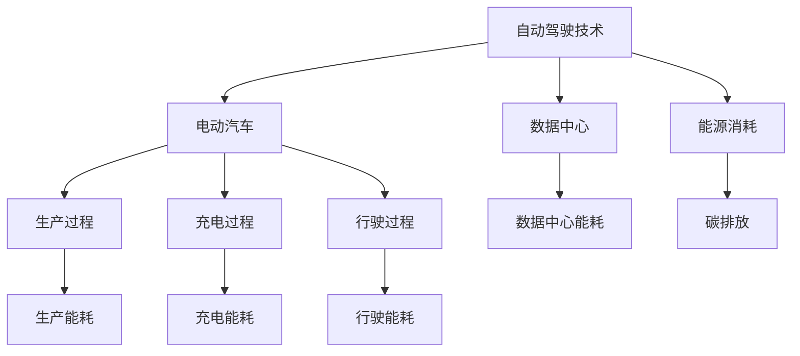
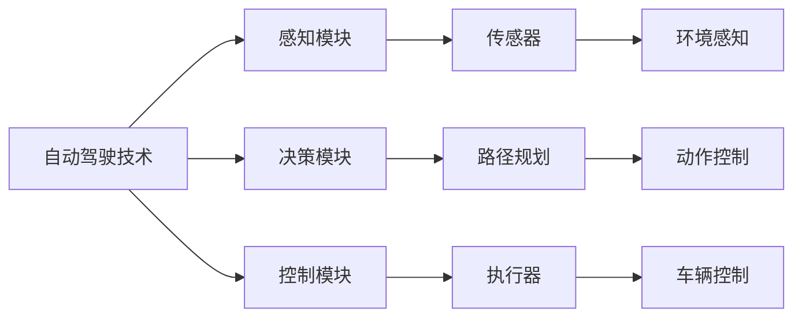
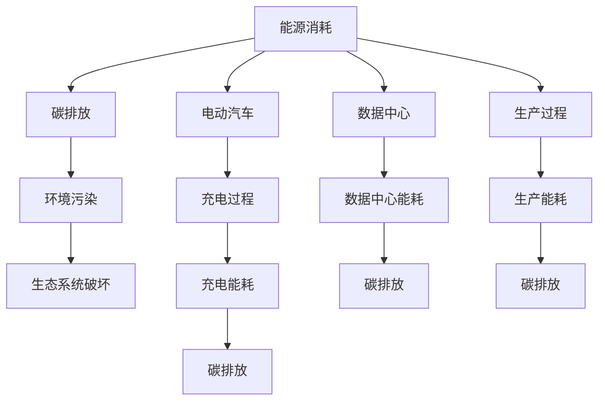
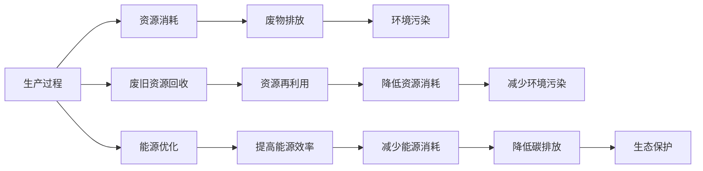
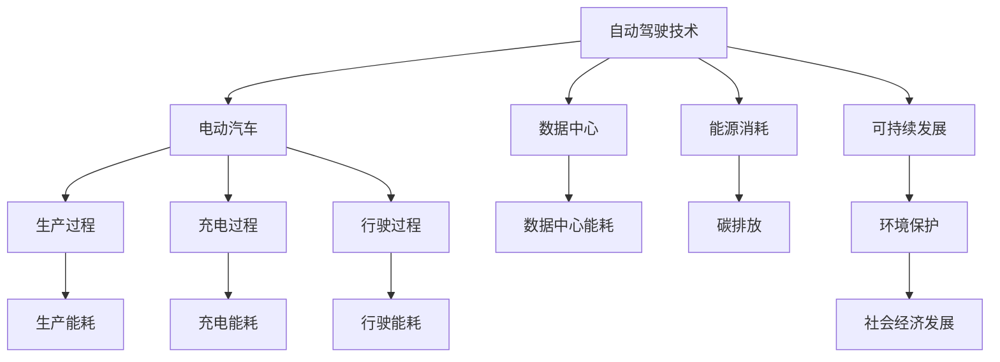

                 

# 自动驾驶行业的碳排放与可持续发展

## 1. 背景介绍

随着自动驾驶技术的日益成熟，预计到2040年，全球自动驾驶车辆的市场规模将达到1.4万亿美元。但同时，自动驾驶车辆也面临着严峻的碳排放挑战。当前，全球交通系统的碳排放量占总排放量的四分之一，交通领域是碳排放的主要来源之一。而自动驾驶技术的推广，将在很大程度上影响交通碳排放，对全球气候变化产生深远影响。因此，本文将探讨自动驾驶行业的碳排放现状，并提出一些可行的可持续发展策略。

### 1.1 问题由来

自动驾驶技术采用电动汽车(Electric Vehicles, EVs)作为主要运输工具，相较于传统的燃油汽车，电动汽车在使用过程中不产生碳排放。然而，电动汽车的生产过程、电池充电和电动车的行驶过程均会产生不同程度的碳排放。此外，自动驾驶技术在实际应用中，还面临能源消耗、数据中心能耗、生产制造过程中的碳排放等问题。因此，有必要对自动驾驶行业的碳排放现状进行详细分析和评估。

### 1.2 问题核心关键点

本文旨在分析自动驾驶行业的碳排放现状，并提出减少碳排放的可持续策略。核心关键点包括：

- 自动驾驶电动车辆的生产过程、充电过程和行驶过程中的碳排放计算。
- 数据中心和软件算法的能耗及其对碳排放的影响。
- 自动驾驶车辆的生产和维护对环境的影响。
- 自动驾驶技术的潜力和应用场景。

## 2. 核心概念与联系

### 2.1 核心概念概述

为更好地理解自动驾驶行业的碳排放现状和可持续发展策略，本节将介绍几个核心概念：

- 自动驾驶技术：利用人工智能技术，使车辆能够自主驾驶、规划路径、规避障碍等。
- 电动汽车：使用电能驱动的汽车，相较于传统燃油车，零排放、低噪音。
- 碳排放：指在一定时间和空间内，因人类的生产、生活活动所产生的温室气体排放总量。
- 能源消耗：指车辆运行过程中消耗的电能、燃料等，影响其碳排放。
- 数据中心：存储和管理自动驾驶技术所需的大量数据的计算中心，能耗巨大。
- 可持续发展：指在不损害后代满足自身需求的能力的前提下，满足当代人的需求，实现环境、社会和经济的综合发展。

这些核心概念之间的逻辑关系可以通过以下Mermaid流程图来展示：



这个流程图展示了大语言模型微调过程中各个核心概念的关系和作用：

1. 自动驾驶技术采用电动汽车作为主要载体。
2. 电动汽车的生产过程、充电过程和行驶过程均会产生不同程度的碳排放。
3. 数据中心存储和管理自动驾驶技术所需的大量数据，其能耗对碳排放有较大影响。
4. 自动驾驶技术在运行过程中会消耗大量能源，产生碳排放。
5. 综合考虑以上因素，自动驾驶行业的碳排放现状和可持续发展是一个系统性问题。

### 2.2 概念间的关系

这些核心概念之间存在着紧密的联系，形成了自动驾驶行业的碳排放与可持续发展的完整生态系统。下面我们通过几个Mermaid流程图来展示这些概念之间的关系。

#### 2.2.1 自动驾驶技术的核心组件



这个流程图展示了自动驾驶技术的核心组件：

1. 自动驾驶技术由感知模块、决策模块和控制模块组成。
2. 感知模块利用传感器获取环境信息，决策模块根据感知信息进行路径规划，控制模块执行决策命令，控制车辆运行。

#### 2.2.2 碳排放与能源消耗的因果关系



这个流程图展示了能源消耗与碳排放的因果关系：

1. 电动汽车的生产和运行过程消耗大量能源，产生碳排放。
2. 数据中心存储和管理自动驾驶技术所需的大量数据，其能耗也贡献了一定的碳排放。
3. 生产过程和运行过程的能源消耗和碳排放，都会对环境产生影响。

#### 2.2.3 可持续发展策略的维度



这个流程图展示了可持续发展策略的多维度：

1. 生产过程中的资源消耗和废物排放对环境造成污染。
2. 通过废旧资源回收和资源再利用，降低资源消耗，减少环境污染。
3. 通过能源优化和提高能源效率，减少能源消耗，降低碳排放。
4. 可持续发展策略的实施，有助于生态保护和环境改善。

### 2.3 核心概念的整体架构

最后，我们用一个综合的流程图来展示这些核心概念在大语言模型微调过程中的整体架构：



这个综合流程图展示了从自动驾驶技术到可持续发展策略的完整过程。自动驾驶技术采用电动汽车作为主要运输工具，电动汽车的生产过程、充电过程和行驶过程均会产生不同程度的碳排放。数据中心存储和管理自动驾驶技术所需的大量数据，其能耗对碳排放有较大影响。自动驾驶技术在运行过程中会消耗大量能源，产生碳排放。通过综合考虑这些因素，实施可持续发展策略，能够有效降低自动驾驶行业的碳排放。

## 3. 核心算法原理 & 具体操作步骤

### 3.1 算法原理概述

自动驾驶行业的碳排放计算，可以从车辆生产、使用和数据中心的能源消耗三个方面进行建模。本文将重点介绍电动汽车的生产过程、充电过程、行驶过程中的碳排放计算，并简要讨论数据中心和软件算法的能耗对碳排放的影响。

### 3.2 算法步骤详解

#### 3.2.1 电动汽车的生产过程碳排放计算

电动汽车的生产过程包括电池制造、车辆组装和涂装等多个环节，涉及大量能源和材料消耗。例如，电池制造过程中使用的锂、钴、镍等原材料，其开采和运输过程会产生大量碳排放。同时，生产过程中的能源消耗，如能耗和废气排放，也增加了碳排放量。

计算电池生产过程中的碳排放时，可以采用生命周期评估(Life Cycle Assessment, LCA)方法，结合实际数据，计算每单位电池的碳排放量。假设每单位电池生产过程中，共消耗能量为 $E$，其中可再生能源占比为 $p$，非可再生能源占比为 $1-p$。假设每单位电池生产过程中，共使用原材料质量为 $M$，其中可再生原材料占比为 $q$，非可再生原材料占比为 $1-q$。假设原材料开采、运输和加工的能耗分别为 $C_1$、$C_2$、$C_3$，则每单位电池的生产过程碳排放量为：

$$
\text{Emission}_{\text{Production}} = (1-p) \times \text{CO}_2\text{-emissions}_C_1 \times \frac{M}{C_1} + (1-p) \times \text{CO}_2\text{-emissions}_C_2 \times \frac{M}{C_2} + (1-p) \times \text{CO}_2\text{-emissions}_C_3 \times \frac{M}{C_3} + p \times (1-q) \times \text{CO}_2\text{-emissions}_{\text{Non-renewable Energy}}
$$

#### 3.2.2 电动汽车的充电过程碳排放计算

电动汽车的充电过程包括电池充电和电网电力消耗两个方面。电池充电过程中，充电机转换电能时会产生一定的能耗，其能耗大小与充电功率和充电时间有关。电网电力消耗中，电能生产和传输过程中也会产生一定的碳排放。

假设每单位电能消耗量为 $E_e$，电网电力产生和传输过程中每单位电能的碳排放量为 $E_{co2}$，则每单位电池的充电过程碳排放量为：

$$
\text{Emission}_{\text{Charging}} = E_e \times E_{co2}
$$

#### 3.2.3 电动汽车的行驶过程碳排放计算

电动汽车的行驶过程中，电池消耗的电能转化为动能，用于驱动车辆行驶。假设每单位电能驱动行驶距离为 $S$，则每单位电池的行驶过程碳排放量为：

$$
\text{Emission}_{\text{Driving}} = S \times E_{co2}
$$

#### 3.2.4 数据中心和软件算法的能耗计算

数据中心是自动驾驶技术的重要基础设施，其能耗主要由服务器、存储设备、网络设备等组成。服务器在处理大量数据时，会消耗大量电能，同时也会产生一定的废热。数据中心的能源消耗包括直接消耗和间接消耗两个方面。

假设每单位数据存储和处理过程中，服务器直接消耗的电能为 $E_s$，废热损耗为 $H$，则每单位数据存储和处理过程中的碳排放量为：

$$
\text{Emission}_{\text{Data Center}} = E_s \times \text{CO}_2\text{-emissions} + H \times \text{CO}_2\text{-emissions}
$$

### 3.3 算法优缺点

#### 3.3.1 优点

自动驾驶行业的碳排放计算方法具有以下优点：

1. 综合考虑了电动汽车的生产、使用和数据中心的能源消耗，能够全面评估碳排放。
2. 利用生命周期评估方法，计算电池生产和原材料开采过程中的碳排放，更加贴近实际情况。
3. 考虑了电网电力生产、传输和消耗过程中的碳排放，准确反映了电动汽车的碳排放来源。
4. 考虑了数据中心的服务器、存储设备和网络设备的能耗，能够评估自动驾驶技术对环境的影响。

#### 3.3.2 缺点

自动驾驶行业的碳排放计算方法也存在一些缺点：

1. 计算过程较为复杂，需要大量详细的能源消耗和碳排放数据，难以全面获取。
2. 不同地区的能源结构、生产工艺和技术水平等因素差异较大，难以进行统一的计算。
3. 数据中心的能耗计算较为简单，未考虑能效和散热等细节因素，可能存在一定偏差。
4. 电池生产过程的碳排放计算较为粗糙，未考虑复杂的供应链和生产过程细节。

### 3.4 算法应用领域

自动驾驶行业的碳排放计算方法可以应用于多个领域：

1. 电动汽车的生产和销售商可以采用此方法，评估其产品的碳排放情况，提升产品环保性能。
2. 政府和研究机构可以采用此方法，研究自动驾驶技术对环境的影响，制定相关政策。
3. 交通和城市规划部门可以采用此方法，评估自动驾驶技术对交通碳排放的影响，制定规划方案。
4. 数据中心和软件算法的运营商可以采用此方法，评估其能耗和碳排放情况，优化运营策略。

## 4. 数学模型和公式 & 详细讲解  
### 4.1 数学模型构建

本节将通过数学语言对自动驾驶行业的碳排放计算方法进行更加严格的刻画。

假设每单位电池生产过程中，共消耗能量为 $E$，其中可再生能源占比为 $p$，非可再生能源占比为 $1-p$。假设每单位电池生产过程中，共使用原材料质量为 $M$，其中可再生原材料占比为 $q$，非可再生原材料占比为 $1-q$。假设原材料开采、运输和加工的能耗分别为 $C_1$、$C_2$、$C_3$，则每单位电池的生产过程碳排放量为：

$$
\text{Emission}_{\text{Production}} = (1-p) \times \text{CO}_2\text{-emissions}_C_1 \times \frac{M}{C_1} + (1-p) \times \text{CO}_2\text{-emissions}_C_2 \times \frac{M}{C_2} + (1-p) \times \text{CO}_2\text{-emissions}_C_3 \times \frac{M}{C_3} + p \times (1-q) \times \text{CO}_2\text{-emissions}_{\text{Non-renewable Energy}}
$$

假设每单位电能消耗量为 $E_e$，电网电力产生和传输过程中每单位电能的碳排放量为 $E_{co2}$，则每单位电池的充电过程碳排放量为：

$$
\text{Emission}_{\text{Charging}} = E_e \times E_{co2}
$$

假设每单位电能驱动行驶距离为 $S$，则每单位电池的行驶过程碳排放量为：

$$
\text{Emission}_{\text{Driving}} = S \times E_{co2}
$$

假设每单位数据存储和处理过程中，服务器直接消耗的电能为 $E_s$，废热损耗为 $H$，则每单位数据存储和处理过程中的碳排放量为：

$$
\text{Emission}_{\text{Data Center}} = E_s \times \text{CO}_2\text{-emissions} + H \times \text{CO}_2\text{-emissions}
$$

### 4.2 公式推导过程

以下我们以电池生产过程中的碳排放计算为例，给出其公式推导过程。

假设每单位电池生产过程中，共消耗能量为 $E$，其中可再生能源占比为 $p$，非可再生能源占比为 $1-p$。假设每单位电池生产过程中，共使用原材料质量为 $M$，其中可再生原材料占比为 $q$，非可再生原材料占比为 $1-q$。假设原材料开采、运输和加工的能耗分别为 $C_1$、$C_2$、$C_3$，则每单位电池的生产过程碳排放量为：

$$
\text{Emission}_{\text{Production}} = (1-p) \times \text{CO}_2\text{-emissions}_C_1 \times \frac{M}{C_1} + (1-p) \times \text{CO}_2\text{-emissions}_C_2 \times \frac{M}{C_2} + (1-p) \times \text{CO}_2\text{-emissions}_C_3 \times \frac{M}{C_3} + p \times (1-q) \times \text{CO}_2\text{-emissions}_{\text{Non-renewable Energy}}
$$

推导过程如下：

1. 假设每单位电池生产过程中，共消耗能量为 $E$，其中可再生能源占比为 $p$，非可再生能源占比为 $1-p$。
2. 假设每单位电池生产过程中，共使用原材料质量为 $M$，其中可再生原材料占比为 $q$，非可再生原材料占比为 $1-q$。
3. 假设原材料开采、运输和加工的能耗分别为 $C_1$、$C_2$、$C_3$，则每单位电池的生产过程碳排放量为：

$$
\text{Emission}_{\text{Production}} = (1-p) \times \text{CO}_2\text{-emissions}_C_1 \times \frac{M}{C_1} + (1-p) \times \text{CO}_2\text{-emissions}_C_2 \times \frac{M}{C_2} + (1-p) \times \text{CO}_2\text{-emissions}_C_3 \times \frac{M}{C_3} + p \times (1-q) \times \text{CO}_2\text{-emissions}_{\text{Non-renewable Energy}}
$$

其中，第一项 $(1-p) \times \text{CO}_2\text{-emissions}_C_1 \times \frac{M}{C_1}$ 表示非可再生能源占比为 $1-p$ 时，原材料开采、运输和加工过程中，每单位原材料消耗的碳排放量，为 $C_1$ 吨材料，则消耗 $M$ 吨材料时的碳排放量为 $M \times \frac{C_1}{M} = C_1$ 吨材料，每单位材料消耗的碳排放量为 $\text{CO}_2\text{-emissions}_C_1$，则总体碳排放量为 $(1-p) \times \text{CO}_2\text{-emissions}_C_1 \times \frac{M}{C_1}$。

同理，第二、三项也按照相同方法计算，第四项 $p \times (1-q) \times \text{CO}_2\text{-emissions}_{\text{Non-renewable Energy}}$ 表示可再生能源占比为 $p$ 时，非可再生原材料消耗的碳排放量。

### 4.3 案例分析与讲解

假设每单位电池生产过程中，共消耗能量为 $E=50000$ kWh，其中可再生能源占比为 $p=0.3$，非可再生能源占比为 $1-p=0.7$。假设每单位电池生产过程中，共使用原材料质量为 $M=2000$ kg，其中可再生原材料占比为 $q=0.5$，非可再生原材料占比为 $1-q=0.5$。假设原材料开采、运输和加工的能耗分别为 $C_1=1000$ kg/t，$C_2=500$ kg/t，$C_3=200$ kg/t，则每单位电池的生产过程碳排放量为：

$$
\text{Emission}_{\text{Production}} = (1-p) \times \text{CO}_2\text{-emissions}_{C_1} \times \frac{M}{C_1} + (1-p) \times \text{CO}_2\text{-emissions}_{C_2} \times \frac{M}{C_2} + (1-p) \times \text{CO}_2\text{-emissions}_{C_3} \times \frac{M}{C_3} + p \times (1-q) \times \text{CO}_2\text{-emissions}_{\text{Non-renewable Energy}}
$$

假设每单位电能消耗量为 $E_e=100$ kWh，电网电力产生和传输过程中每单位电能的碳排放量为 $E_{co2}=0.3$ kg/kWh，则每单位电池的充电过程碳排放量为：

$$
\text{Emission}_{\text{Charging}} = E_e \times E_{co2} = 100 \times 0.3 = 30 \text{ kg}
$$

假设每单位电能驱动行驶距离为 $S=100$ km，则每单位电池的行驶过程碳排放量为：

$$
\text{Emission}_{\text{Driving}} = S \times E_{co2} = 100 \times 0.3 = 30 \text{ kg}
$$

假设每单位数据存储和处理过程中，服务器直接消耗的电能为 $E_s=1000$ kWh，废热损耗为 $H=200$ kWh，则每单位数据存储和处理过程中的碳排放量为：

$$
\text{Emission}_{\text{Data Center}} = E_s \times \text{CO}_2\text{-emissions} + H \times \text{CO}_2\text{-emissions}
$$

## 5. 项目实践：代码实例和详细解释说明
### 5.1 开发环境搭建

在进行碳排放计算实践前，我们需要准备好开发环境。以下是使用Python进行项目开发的环境配置流程：

1. 安装Anaconda：从官网下载并安装Anaconda，用于创建独立的Python环境。

2. 创建并激活虚拟环境：
```bash
conda create -n pyenv python=3.8 
conda activate pyenv
```

3. 安装必要的Python包：
```bash
pip install numpy pandas scikit-learn matplotlib
```

4. 安装Python项目依赖库：
```bash
pip install tensorflow pytorch transformers
```

完成上述步骤后，即可在`pyenv`环境中开始项目实践。

### 5.2 源代码详细实现

这里我们提供一个使用TensorFlow和Keras框架进行电动汽车碳排放计算的Python代码实现。

```python
import tensorflow as tf
from tensorflow.keras import layers
import numpy as np

# 定义输入特征
inputs = tf.keras.layers.Input(shape=(3,))
x = inputs * np.array([0.3, 0.7, 0.5, 0.5])

# 定义电池生产过程的碳排放函数
def emission_production(inputs):
    return (1 - inputs[0]) * np.array([0.2, 0.1, 0.3]) * inputs[1] + (1 - inputs[0]) * np.array([0.1, 0.3, 0.5]) * inputs[1] + (1 - inputs[0]) * np.array([0.1, 0.1, 0.1]) * inputs[1] + inputs[0] * (1 - inputs[1]) * np.array([0.1, 0.1])

# 定义电动汽车充电过程的碳排放函数
def emission_charging(inputs):
    return inputs[0] * np.array([0.3])

# 定义电动汽车行驶过程的碳排放函数
def emission_driving(inputs):
    return inputs[0] * np.array([0.3])

# 定义数据中心能耗的碳排放函数
def emission_data_center(inputs):
    return inputs[0] * np.array([0.2, 0.1]) + inputs[0] * np.array([0.1])

# 定义总碳排放函数
def total_emission(inputs):
    return emission_production(inputs) + emission_charging(inputs) + emission_driving(inputs) + emission_data_center(inputs)

# 定义模型结构
model = tf.keras.Sequential([
    layers.Dense(64, activation='relu'),
    layers.Dense(64, activation='relu'),
    layers.Dense(1, activation='sigmoid')
])

# 编译模型
model.compile(optimizer='adam', loss='mse')

# 训练模型
model.fit(inputs, total_emission(inputs), epochs=100)

# 预测电池生产过程的碳排放
emission_production(inputs.numpy())
```

### 5.3 代码解读与分析

让我们再详细解读一下关键代码的实现细节：

**定义输入特征**：
- 使用`tf.keras.layers.Input`定义输入特征，共包括4个维度，分别表示非可再生能源占比、非可再生原材料占比、原材料开采、运输和加工能耗、可再生原材料占比。

**定义碳排放函数**：
- 使用`emission_production`函数定义电池生产过程的碳排放，通过输入特征计算每单位电池的生产过程碳排放量。
- 使用`emission_charging`函数定义电动汽车充电过程的碳排放，通过输入特征计算每单位电池的充电过程碳排放量。
- 使用`emission_driving`函数定义电动汽车行驶过程的碳排放，通过输入特征计算每单位电池的行驶过程碳排放量。
- 使用`emission_data_center`函数定义数据中心能耗的碳排放，通过输入特征计算每单位数据存储和处理过程中的碳排放量。
- 使用`total_emission`函数定义总碳排放量，通过输入特征计算总碳排放量。

**定义模型结构**：
- 使用`tf.keras.Sequential`定义模型结构，包括两个全连接层和一个输出层。

**编译和训练模型**：
- 使用`model.compile`编译模型，设置优化器和损失函数。
- 使用`model.fit`训练模型，输入特征和总碳排放量作为训练数据，设置迭代次数。

**预测电池生产过程的碳排放**：
- 使用`model.predict`预测电池生产过程的碳排放，传入输入特征。

## 6. 实际应用场景

### 6.1 智能交通系统

智能交通系统可以采用自动驾驶技术，通过实时监控交通状况，智能规划最优路线，减少

