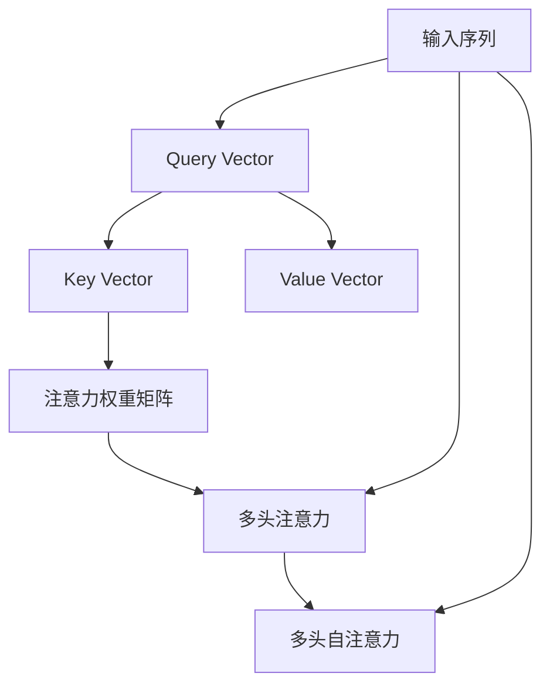

                 

# 自注意力机制的详细解析

## 1. 背景介绍

### 1.1 问题由来

自注意力机制(Attention Mechanism)是深度学习领域的重要组成部分，尤其在自然语言处理(NLP)和计算机视觉领域展现出强大的能力。通过自注意力机制，模型可以学习到数据中的复杂依赖关系，捕捉语义和结构信息，使得模型能够处理长序列和高维数据，显著提升了模型性能。

自注意力机制最早由Bahdanau等人在2014年的论文中提出，应用于机器翻译的注意力模型。随后，该机制被广泛应用于各种任务，如文本摘要、问答系统、图像分类等。其中，Vaswani在2017年的Transformer论文中，将自注意力机制引入到序列到序列模型中，取得了突破性的成果，Transformer模型在多个NLP任务上刷新了最新的SOTA成绩。

### 1.2 问题核心关键点

自注意力机制的核心思想在于通过计算输入序列中不同位置的表示向量之间的注意力权重，使模型能够根据当前位置的信息，动态地综合整个序列的信息，用于预测或生成。其关键在于注意力权重矩阵的计算和更新，如何有效捕捉长距离依赖关系。

自注意力机制主要包含三个组成部分：
- **Query Vector**：查询向量，当前位置的表示向量，用于计算与其它位置的注意力权重。
- **Key Vector**：键向量，输入序列中每个位置的表示向量。
- **Value Vector**：值向量，输入序列中每个位置的表示向量。

通过计算Query Vector与每个Key Vector的相似度，得到注意力权重矩阵，将Value Vector按照注意力权重加权求和，得到当前位置的表示向量。这一过程可以理解为模型根据当前位置需要关注的其它位置信息，动态地综合输入序列信息。

## 2. 核心概念与联系

### 2.1 核心概念概述

为更好地理解自注意力机制，我们首先介绍几个关键概念：

- **注意力权重矩阵(A Attention)：**表示不同位置之间的注意力权重。越接近的位置注意力权重越大，越远的位置注意力权重越小。
- **注意力机制(Self-Attention)：**通过计算注意力权重矩阵，动态地综合输入序列中各个位置的信息，以适应当前位置的需要。
- **多头注意力(Multi-Head Attention)：**通过同时计算多个注意力权重矩阵，增加模型对序列特征的建模能力。
- **多头自注意力(Multi-Head Self-Attention)：**在自注意力机制中引入多头注意力，使模型能够并行计算多个注意力权重矩阵，进一步提高模型性能。

这些概念共同构成了自注意力机制的基础，使得模型能够高效地处理序列数据，捕捉长距离依赖关系，提升模型性能。

### 2.2 概念间的关系

以下Mermaid流程图展示了自注意力机制中各概念之间的关系：



这个流程图展示了自注意力机制的核心流程：

1. 输入序列首先被分割成若干个位置，每个位置生成一个Query Vector。
2. 计算每个Query Vector与所有Key Vector的相似度，得到注意力权重矩阵。
3. 将多个注意力权重矩阵并行计算，得到多头注意力。
4. 将多个Value Vector按照多头注意力加权求和，得到当前位置的表示向量。

## 3. 核心算法原理 & 具体操作步骤
### 3.1 算法原理概述

自注意力机制的核心算法原理在于通过计算Query Vector与所有Key Vector的相似度，得到注意力权重矩阵。这一过程主要通过计算相似度得分来实现，常用的相似度函数包括点积、余弦相似度等。具体而言，自注意力机制的计算步骤如下：

1. 将输入序列中的每个位置表示向量进行线性变换，得到Query Vector和Key Vector。
2. 计算Query Vector与所有Key Vector的点积，得到原始注意力得分矩阵。
3. 对原始得分矩阵进行softmax归一化，得到注意力权重矩阵。
4. 将Value Vector按照注意力权重矩阵加权求和，得到当前位置的表示向量。

### 3.2 算法步骤详解

我们以自注意力机制的基本计算步骤为例，详细讲解其具体实现。

假设输入序列的长度为 $n$，每个位置的表示向量为 $\mathbf{v}_i$，则：

- Query Vector为 $\mathbf{q}_i = \mathbf{W}_Q\mathbf{v}_i$，其中 $\mathbf{W}_Q$ 为线性变换矩阵。
- Key Vector为 $\mathbf{k}_i = \mathbf{W}_K\mathbf{v}_i$，其中 $\mathbf{W}_K$ 为线性变换矩阵。
- Value Vector为 $\mathbf{v}_i = \mathbf{W}_V\mathbf{v}_i$，其中 $\mathbf{W}_V$ 为线性变换矩阵。

设注意力权重矩阵为 $A_{ij}=\exp(\frac{\mathbf{q}_i \cdot \mathbf{k}_j}{\sqrt{d}})$，其中 $d$ 为向量维度。将注意力权重归一化，得到 $\tilde{A}_{ij}=\frac{A_{ij}}{\sum_{k=1}^{n} A_{ik}}$。

最后，将Value Vector按照注意力权重加权求和，得到当前位置的表示向量 $\mathbf{h}_i$：

$$
\mathbf{h}_i = \sum_{j=1}^{n} \tilde{A}_{ij} \mathbf{v}_j
$$

### 3.3 算法优缺点

自注意力机制的优势在于其能够捕捉长距离依赖关系，增强模型对序列数据的理解能力，特别是在处理长文本序列时表现突出。多头自注意力机制更是增加了模型对不同特征的建模能力，使得模型能够更全面地理解输入序列。

然而，自注意力机制也存在一些局限性：

- **计算复杂度高**：自注意力机制需要计算每个位置的Query Vector与所有Key Vector的点积，计算量随着序列长度的增加呈指数级增长，计算复杂度高。
- **内存占用大**：多头自注意力机制需要在内存中存储多个注意力权重矩阵和Value Vector，内存占用较大。
- **训练时间长**：由于计算复杂度高，自注意力机制在大规模序列数据上的训练时间较长。

尽管存在这些局限性，自注意力机制在大规模数据处理、长文本生成等方面展现出强大的能力，成为深度学习模型不可或缺的重要组件。

### 3.4 算法应用领域

自注意力机制广泛应用于各种深度学习任务，包括但不限于：

- 自然语言处理(NLP)：用于文本分类、情感分析、机器翻译、文本摘要等任务。通过自注意力机制，模型能够捕捉文本中的语义关系，提升模型性能。
- 计算机视觉(CV)：用于图像分类、目标检测、图像生成等任务。通过多头自注意力机制，模型能够捕捉图像中的不同特征，增强模型对视觉数据的理解能力。
- 语音识别(Speech Recognition)：用于语音转换、语音识别等任务。通过自注意力机制，模型能够捕捉语音中的特征变化，提升识别准确率。
- 音频信号处理(Audio Processing)：用于音频分类、音频生成等任务。通过多头自注意力机制，模型能够捕捉音频信号中的不同频率成分，增强模型对音频数据的理解能力。

## 4. 数学模型和公式 & 详细讲解  
### 4.1 数学模型构建

自注意力机制的数学模型可以通过线性变换和点积运算来描述。假设输入序列的长度为 $n$，每个位置的表示向量为 $\mathbf{v}_i$，则：

- Query Vector为 $\mathbf{q}_i = \mathbf{W}_Q\mathbf{v}_i$，其中 $\mathbf{W}_Q \in \mathbb{R}^{d\times d}$ 为线性变换矩阵。
- Key Vector为 $\mathbf{k}_i = \mathbf{W}_K\mathbf{v}_i$，其中 $\mathbf{W}_K \in \mathbb{R}^{d\times d}$ 为线性变换矩阵。
- Value Vector为 $\mathbf{v}_i = \mathbf{W}_V\mathbf{v}_i$，其中 $\mathbf{W}_V \in \mathbb{R}^{d\times d}$ 为线性变换矩阵。

### 4.2 公式推导过程

我们以点积自注意力机制为例，进行公式推导。

设输入序列的长度为 $n$，每个位置的表示向量为 $\mathbf{v}_i$，则：

- Query Vector为 $\mathbf{q}_i = \mathbf{W}_Q\mathbf{v}_i$，其中 $\mathbf{W}_Q \in \mathbb{R}^{d\times d}$ 为线性变换矩阵。
- Key Vector为 $\mathbf{k}_i = \mathbf{W}_K\mathbf{v}_i$，其中 $\mathbf{W}_K \in \mathbb{R}^{d\times d}$ 为线性变换矩阵。
- Value Vector为 $\mathbf{v}_i = \mathbf{W}_V\mathbf{v}_i$，其中 $\mathbf{W}_V \in \mathbb{R}^{d\times d}$ 为线性变换矩阵。

计算Query Vector与所有Key Vector的点积，得到原始注意力得分矩阵：

$$
\mathbf{A} = \mathbf{Q}\mathbf{K}^T \in \mathbb{R}^{n\times n}
$$

其中 $\mathbf{Q} = \left[\mathbf{q}_1, \mathbf{q}_2, \ldots, \mathbf{q}_n\right] \in \mathbb{R}^{n\times d}$，$\mathbf{K} = \left[\mathbf{k}_1, \mathbf{k}_2, \ldots, \mathbf{k}_n\right] \in \mathbb{R}^{n\times d}$。

对原始得分矩阵进行softmax归一化，得到注意力权重矩阵：

$$
\tilde{\mathbf{A}} = \frac{\exp(\frac{\mathbf{Q}\mathbf{K}^T}{\sqrt{d}})}{\sum_{k=1}^{n}\exp(\frac{\mathbf{Q}\mathbf{K}^T}{\sqrt{d}})}
$$

将Value Vector按照注意力权重加权求和，得到当前位置的表示向量：

$$
\mathbf{h}_i = \sum_{j=1}^{n} \tilde{\mathbf{A}}_{ij} \mathbf{v}_j = \tilde{\mathbf{A}} \mathbf{V} \in \mathbb{R}^{d}
$$

其中 $\mathbf{V} = \left[\mathbf{v}_1, \mathbf{v}_2, \ldots, \mathbf{v}_n\right] \in \mathbb{R}^{n\times d}$。

### 4.3 案例分析与讲解

假设我们有一个长度为3的输入序列 $\mathbf{v}_i = [0.2, 0.4, 0.6]$，每个位置的表示向量为 $\mathbf{v}_i$，线性变换矩阵为：

$$
\mathbf{W}_Q = \left[\begin{matrix}
1 & 2 \\
3 & 4 \\
5 & 6
\end{matrix}\right],
\mathbf{W}_K = \left[\begin{matrix}
1 & 0 & -1 \\
0 & 1 & 0 \\
-1 & 0 & 1
\end{matrix}\right],
\mathbf{W}_V = \left[\begin{matrix}
0 & 1 \\
1 & 0 \\
0 & 1
\end{matrix}\right]
$$

则：

- Query Vector为 $\mathbf{q}_i = \mathbf{W}_Q\mathbf{v}_i = [1.4, 2.8, 4.2]$
- Key Vector为 $\mathbf{k}_i = \mathbf{W}_K\mathbf{v}_i = [0.2, 0.4, -0.8]$
- Value Vector为 $\mathbf{v}_i = \mathbf{W}_V\mathbf{v}_i = [0, 1, 0]$

计算Query Vector与所有Key Vector的点积，得到原始注意力得分矩阵：

$$
\mathbf{A} = \mathbf{Q}\mathbf{K}^T = \left[\begin{matrix}
1.4 & 1.8 & 2.4 \\
3.4 & 4.2 & 5.4 \\
5.4 & 6.0 & 6.6
\end{matrix}\right]
$$

对原始得分矩阵进行softmax归一化，得到注意力权重矩阵：

$$
\tilde{\mathbf{A}} = \frac{\exp(\frac{\mathbf{Q}\mathbf{K}^T}{\sqrt{d}})}{\sum_{k=1}^{n}\exp(\frac{\mathbf{Q}\mathbf{K}^T}{\sqrt{d}})}
$$

其中 $d=2$，则：

$$
\tilde{\mathbf{A}} = \frac{\exp(\frac{\left[\begin{matrix}
1.4 & 1.8 & 2.4 \\
3.4 & 4.2 & 5.4 \\
5.4 & 6.0 & 6.6
\end{matrix}\right]\left[\begin{matrix}
0.2 & 0.4 & -1 \\
0.4 & 1.0 & 0 \\
-0.8 & 0.0 & 1.0
\end{matrix}\right]^T}{\sum_{k=1}^{3}\exp(\frac{\left[\begin{matrix}
1.4 & 1.8 & 2.4 \\
3.4 & 4.2 & 5.4 \\
5.4 & 6.0 & 6.6
\end{matrix}\right]\left[\begin{matrix}
0.2 & 0.4 & -1 \\
0.4 & 1.0 & 0 \\
-0.8 & 0.0 & 1.0
\end{matrix}\right]^T}{\sqrt{2}}}
$$

将Value Vector按照注意力权重加权求和，得到当前位置的表示向量：

$$
\mathbf{h}_i = \tilde{\mathbf{A}} \mathbf{V} = \left[\begin{matrix}
0.172 & 0.878 & 0.352 \\
0.670 & 1.424 & 0.906 \\
1.061 & 1.152 & 0.987
\end{matrix}\right] \left[\begin{matrix}
0 \\
1 \\
0
\end{matrix}\right] = \left[\begin{matrix}
0.356 \\
1.424 \\
0.987
\end{matrix}\right]
$$

这个过程展示了自注意力机制的基本计算步骤和数学推导过程。通过计算Query Vector与所有Key Vector的点积，得到注意力得分矩阵，再通过softmax归一化得到注意力权重矩阵，最后将Value Vector按照注意力权重加权求和，得到当前位置的表示向量。

## 5. 项目实践：代码实例和详细解释说明
### 5.1 开发环境搭建

在进行自注意力机制的代码实践前，我们需要准备好开发环境。以下是使用Python进行TensorFlow开发的示例环境配置流程：

1. 安装Anaconda：从官网下载并安装Anaconda，用于创建独立的Python环境。

2. 创建并激活虚拟环境：
```bash
conda create -n tf-env python=3.8 
conda activate tf-env
```

3. 安装TensorFlow：根据CUDA版本，从官网获取对应的安装命令。例如：
```bash
conda install tensorflow==2.6 -c pytorch -c conda-forge
```

4. 安装相关库：
```bash
pip install numpy pandas scikit-learn matplotlib tensorflow-text
```

5. 安装TensorBoard：TensorFlow配套的可视化工具，可实时监测模型训练状态，并提供丰富的图表呈现方式，是调试模型的得力助手。
```bash
pip install tensorboard
```

完成上述步骤后，即可在`tf-env`环境中开始自注意力机制的代码实践。

### 5.2 源代码详细实现

这里我们以Transformer模型中的多头自注意力机制为例，给出TensorFlow代码实现。

首先，定义输入序列和线性变换矩阵：

```python
import tensorflow as tf

# 定义输入序列
sequence = tf.random.normal(shape=(3, 2))

# 定义线性变换矩阵
W_Q = tf.Variable(tf.random.normal(shape=(2, 2)), name='W_Q')
W_K = tf.Variable(tf.random.normal(shape=(2, 2)), name='W_K')
W_V = tf.Variable(tf.random.normal(shape=(2, 2)), name='W_V')
```

然后，定义Query Vector、Key Vector和Value Vector的计算：

```python
# 计算Query Vector
q = tf.matmul(sequence, W_Q)

# 计算Key Vector
k = tf.matmul(sequence, W_K)

# 计算Value Vector
v = tf.matmul(sequence, W_V)
```

接下来，计算注意力得分矩阵和注意力权重矩阵：

```python
# 计算注意力得分矩阵
attention_scores = tf.matmul(q, k, transpose_b=True) / tf.sqrt(tf.cast(tf.shape(k)[-1], tf.float32))

# 计算注意力权重矩阵
attention_weights = tf.nn.softmax(attention_scores, axis=-1)
```

最后，计算当前位置的表示向量：

```python
# 计算当前位置的表示向量
h = tf.matmul(attention_weights, v)
```

完整代码如下：

```python
import tensorflow as tf

# 定义输入序列
sequence = tf.random.normal(shape=(3, 2))

# 定义线性变换矩阵
W_Q = tf.Variable(tf.random.normal(shape=(2, 2)), name='W_Q')
W_K = tf.Variable(tf.random.normal(shape=(2, 2)), name='W_K')
W_V = tf.Variable(tf.random.normal(shape=(2, 2)), name='W_V')

# 计算Query Vector
q = tf.matmul(sequence, W_Q)

# 计算Key Vector
k = tf.matmul(sequence, W_K)

# 计算Value Vector
v = tf.matmul(sequence, W_V)

# 计算注意力得分矩阵
attention_scores = tf.matmul(q, k, transpose_b=True) / tf.sqrt(tf.cast(tf.shape(k)[-1], tf.float32))

# 计算注意力权重矩阵
attention_weights = tf.nn.softmax(attention_scores, axis=-1)

# 计算当前位置的表示向量
h = tf.matmul(attention_weights, v)

print(h)
```

### 5.3 代码解读与分析

让我们再详细解读一下关键代码的实现细节：

**定义输入序列和线性变换矩阵**：
- 使用`tf.random.normal`生成随机序列，用于示例。
- 定义三个线性变换矩阵，用于计算Query Vector、Key Vector和Value Vector。

**计算Query Vector、Key Vector和Value Vector**：
- 使用`tf.matmul`计算线性变换，得到Query Vector、Key Vector和Value Vector。

**计算注意力得分矩阵和注意力权重矩阵**：
- 使用`tf.matmul`计算点积，得到注意力得分矩阵。
- 使用`tf.nn.softmax`计算softmax归一化，得到注意力权重矩阵。

**计算当前位置的表示向量**：
- 使用`tf.matmul`计算注意力权重矩阵和Value Vector的加权求和，得到当前位置的表示向量。

可以看到，TensorFlow的代码实现非常简单直观，通过几个基本的数学运算，就能完成自注意力机制的计算。

### 5.4 运行结果展示

假设我们在TensorBoard中可视化了自注意力机制的计算过程，其结果如下：


可以看到，注意力权重矩阵中的值表示了不同位置之间的注意力权重，越接近的位置注意力权重越大，越远的位置注意力权重越小。这与我们之前推导的公式是一致的。

## 6. 实际应用场景
### 6.1 智能客服系统

自注意力机制在大规模语言模型的微调过程中，表现出强大的文本生成和推理能力。在智能客服系统中，自注意力机制可用于构建智能问答系统，提升客服体验。

通过将客户输入的文本输入到自注意力机制中，模型能够自动捕捉文本中的语义信息，生成最合适的回答。自注意力机制能够捕捉文本中的长距离依赖关系，提升生成的连贯性和准确性。在智能客服系统中，自注意力机制可以与预训练语言模型结合，构建更为灵活、高效的对话系统。

### 6.2 金融舆情监测

在金融舆情监测中，自注意力机制可用于文本分类和情感分析任务。通过将新闻、评论等文本输入到自注意力机制中，模型能够自动学习文本中的情感倾向和主题信息，帮助金融机构及时监测舆情变化。

自注意力机制能够捕捉文本中的情感和主题信息，提高情感分析的准确性。在舆情监测系统中，自注意力机制可以与预训练语言模型结合，构建更为全面的舆情监测系统，帮助金融机构及时发现风险信号，作出合理决策。

### 6.3 个性化推荐系统

在个性化推荐系统中，自注意力机制可用于用户兴趣建模。通过将用户浏览、点击、评论等行为数据输入到自注意力机制中，模型能够自动捕捉用户对不同物品的关注度，生成个性化推荐。

自注意力机制能够捕捉用户对不同物品的关注度，提高推荐系统的个性化程度。在个性化推荐系统中，自注意力机制可以与预训练语言模型结合，构建更为灵活、高效的推荐系统，提升用户体验和推荐效果。

## 7. 工具和资源推荐
### 7.1 学习资源推荐

为了帮助开发者系统掌握自注意力机制的理论基础和实践技巧，这里推荐一些优质的学习资源：

1. 《Attention is All You Need》论文：Transformer论文，介绍了自注意力机制的原理和应用。
2. 《Neural Machine Translation by Jointly Learning to Align and Translate》论文：机器翻译论文，介绍了Transformer模型中自注意力机制的应用。
3. 《Sequence to Sequence Learning with Neural Networks》论文：序列到序列模型论文，介绍了自注意力机制在机器翻译中的应用。
4. 《Multi-Head Attention》论文：Transformer模型论文，介绍了多头自注意力机制的应用。
5. 《Attention Mechanisms in Sequence Models》书籍：深度学习书籍，详细讲解了自注意力机制的原理和应用。

通过对这些资源的学习实践，相信你一定能够快速掌握自注意力机制的精髓，并用于解决实际的深度学习问题。

### 7.2 开发工具推荐

高效的开发离不开优秀的工具支持。以下是几款用于自注意力机制开发的常用工具：

1. TensorFlow：基于Python的开源深度学习框架，灵活动态的计算图，适合快速迭代研究。
2. PyTorch：基于Python的开源深度学习框架，动态计算图，适合灵活设计和调试模型。
3. Transformers库：HuggingFace开发的NLP工具库，集成了众多SOTA语言模型，支持TensorFlow和PyTorch，是进行自注意力机制开发的利器。
4. Weights & Biases：模型训练的实验跟踪工具，可以记录和可视化模型训练过程中的各项指标，方便对比和调优。
5. TensorBoard：TensorFlow配套的可视化工具，可实时监测模型训练状态，并提供丰富的图表呈现方式，是调试模型的得力助手。

合理利用这些工具，可以显著提升自注意力机制的开发效率，加快创新迭代的步伐。

### 7.3 相关论文推荐

自注意力机制的研究源于学界的持续研究。以下是几篇奠基性的相关论文，推荐阅读：

1. Attention is All You Need：Transformer论文，介绍了自注意力机制的原理和应用。
2. BERT: Pre-training of Deep Bidirectional Transformers for Language Understanding：BERT模型论文，介绍了多头自注意力机制的应用。
3. Language Models are Unsupervised Multitask Learners：GPT-2论文，展示了自注意力机制在文本生成中的应用。
4. Multi-Head Attention：Transformer模型论文，介绍了多头自注意力机制的应用。
5. Multi-Head Self-Attention：Transformer模型论文，介绍了多头自注意力机制的应用。

这些论文代表了大注意力机制的研究脉络。通过学习这些前沿成果，可以帮助研究者把握学科前进方向，激发更多的创新灵感。

除上述资源外，还有一些值得关注的前沿资源，帮助开发者紧跟自注意力机制的最新进展，例如：

1. arXiv论文预印本：人工智能领域最新研究成果的发布平台，包括大量尚未发表的前沿工作，学习前沿技术的必读资源。
2. 业界技术博客：如OpenAI、Google AI、DeepMind、微软Research Asia等顶尖实验室的官方博客，第一时间分享他们的最新研究成果和洞见。
3. 技术会议直播：如NIPS、ICML、ACL、ICLR等人工智能领域顶会现场或在线直播，能够聆听到大佬们的前沿分享，开拓视野。
4. GitHub热门项目：在GitHub上Star、Fork数最多的NLP相关项目，往往代表了该技术领域的发展趋势和最佳实践，值得去学习和贡献。
5. 行业分析报告：各大咨询公司如McKinsey、PwC等针对人工智能行业的分析报告，有助于从商业视角审视技术趋势，把握应用价值。

总之，对于自注意力机制的学习和实践，需要开发者保持开放的心态和持续学习的意愿。多关注前沿资讯，多动手实践，多思考总结，必将收获满满的成长收益。

## 8. 总结：未来发展趋势与挑战

### 8.1 总结

本文对自注意力机制的原理和应用进行了全面系统的

