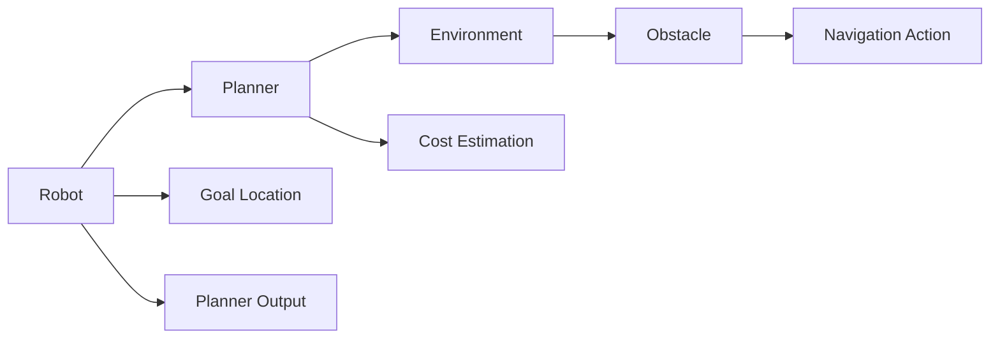
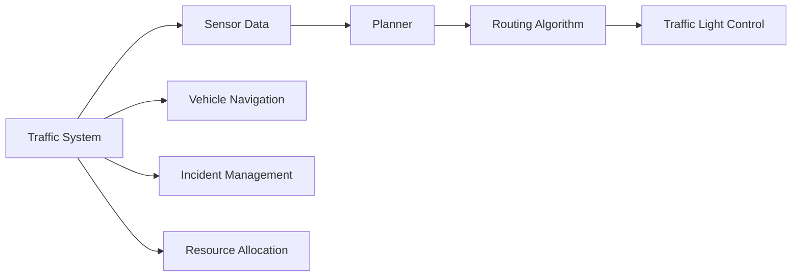
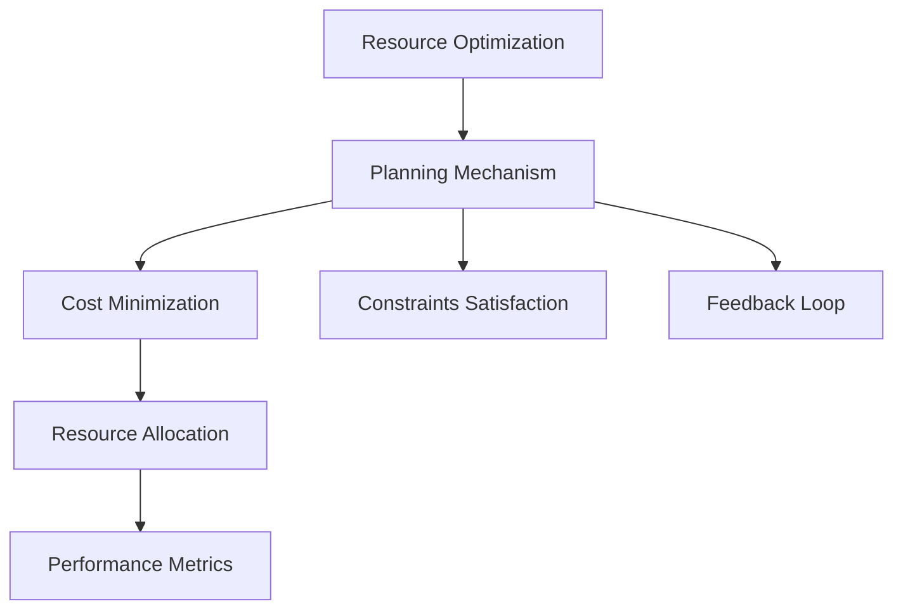

                 

# 规划机制在智能决策系统中的应用

> 关键词：智能决策系统, 规划机制, 多智能体系统, 机器人导航, 智能交通, 资源优化

## 1. 背景介绍

### 1.1 问题由来
在现代信息社会，智能决策系统（Intelligent Decision Systems, IDS）已经广泛应用于各行各业，从智能交通、机器人导航、资源优化到金融投资等领域。这些系统的核心目标是通过自动化和智能化手段，帮助人类在复杂多变的环境中做出快速、精准的决策。然而，现有的智能决策系统大多依赖于固定的规则或机器学习算法，难以应对复杂的动态环境和不确定因素。为了提升决策系统的适应性和鲁棒性，研究者们开始探索引入规划机制（Planning Mechanism），使得系统能够自主生成和调整决策策略，实现更灵活、更高效的智能决策。

### 1.2 问题核心关键点
规划机制的核心思想是通过对决策过程的逻辑规划和策略优化，使得智能决策系统具备自我调整和适应变化的能力。其核心关键点包括：

- **目标定义**：明确决策系统的最终目标，如最小化成本、最大化利润、最小化风险等。
- **状态描述**：使用状态空间（State Space）对当前和未来的状态进行描述，包括环境参数、变量和约束条件等。
- **行为选择**：定义系统的行为空间（Action Space），即决策系统能够采取的具体行动或策略。
- **代价计算**：评估每个行为的代价或成本，用于衡量决策效果。
- **规划算法**：选择适合的规划算法，如A*、Q学习、强化学习等，进行行为选择和代价计算，生成最优决策路径。

这些关键点构成了规划机制的基本框架，使得系统能够在动态环境中自主决策，提升决策的灵活性和鲁棒性。

### 1.3 问题研究意义
引入规划机制的智能决策系统，能够更好地应对复杂多变的现实世界，实现更高效、更灵活的决策。具体来说，其研究意义包括：

- **提升决策准确性**：通过逻辑规划和策略优化，系统能够更准确地预测未来状态，制定最优决策策略。
- **增强决策适应性**：规划机制允许系统根据环境和需求的变化，动态调整决策路径，适应不同场景下的应用需求。
- **降低决策成本**：通过规划算法优化决策过程，减少决策过程中的试错和资源浪费，提高决策效率。
- **推动智能决策应用**：规划机制为智能决策系统提供了新的技术路径，拓展了智能决策技术的应用范围。

因此，研究规划机制在智能决策系统中的应用，对于提升决策系统的智能水平、实现自动化和智能化具有重要意义。

## 2. 核心概念与联系

### 2.1 核心概念概述

为了更好地理解规划机制在智能决策系统中的应用，本节将介绍几个密切相关的核心概念：

- **智能决策系统（Intelligent Decision Systems, IDS）**：通过自动化和智能化手段，帮助人类在复杂环境中做出快速、精准的决策。
- **规划机制（Planning Mechanism）**：通过逻辑规划和策略优化，使智能决策系统具备自我调整和适应变化的能力。
- **多智能体系统（Multi-Agent System,MAS）**：由多个智能体组成的系统，每个智能体能够独立或协作地完成特定任务。
- **机器人导航（Robot Navigation）**：利用规划机制引导机器人自主导航，避开障碍物，到达目标位置。
- **智能交通（Intelligent Transportation）**：通过规划机制优化交通流量和路径选择，提高交通效率和安全性。
- **资源优化（Resource Optimization）**：利用规划机制优化资源配置和分配，提高资源利用效率和系统性能。

这些核心概念之间的逻辑关系可以通过以下Mermaid流程图来展示：

```mermaid
graph TB
    A[Intelligent Decision Systems (IDS)] --> B[Planning Mechanism]
    B --> C[Multi-Agent System (MAS)]
    C --> D[Robot Navigation]
    C --> E[Intelligent Transportation]
    C --> F[Resource Optimization]
```

这个流程图展示了几大核心概念及其之间的关系：

1. IDS通过规划机制进行智能决策。
2. 规划机制是多智能体系统的核心组成部分。
3. 多智能体系统广泛应用于机器人导航、智能交通、资源优化等多个领域。

通过这些核心概念，我们可以更好地把握规划机制在智能决策系统中的应用框架。

### 2.2 概念间的关系

这些核心概念之间存在着紧密的联系，形成了智能决策系统的完整生态系统。下面我们通过几个Mermaid流程图来展示这些概念之间的关系。

#### 2.2.1 智能决策系统的逻辑架构

```mermaid
graph TB
    A[Intelligent Decision Systems (IDS)] --> B[Planning Mechanism]
    A --> C[Multi-Agent System (MAS)]
    A --> D[Robot Navigation]
    A --> E[Intelligent Transportation]
    A --> F[Resource Optimization]
```

这个流程图展示了智能决策系统的逻辑架构，其中规划机制和多智能体系统是核心组成部分。

#### 2.2.2 机器人导航的规划流程



这个流程图展示了机器人导航的规划流程，其中机器人通过规划机制选择最优路径，避开障碍物，到达目标位置。

#### 2.2.3 智能交通的决策链



这个流程图展示了智能交通的决策链，其中传感器数据经过规划机制，优化交通流量和路径选择，实现智能交通管理。

#### 2.2.4 资源优化的规划算法



这个流程图展示了资源优化的规划算法，通过规划机制优化资源分配，提升系统性能。

### 2.3 核心概念的整体架构

最后，我们用一个综合的流程图来展示这些核心概念在智能决策系统中的整体架构：

```mermaid
graph TB
    A[Intelligent Decision Systems (IDS)] --> B[Planning Mechanism]
    B --> C[Multi-Agent System (MAS)]
    C --> D[Robot Navigation]
    C --> E[Intelligent Transportation]
    C --> F[Resource Optimization]
    B --> G[Cost Minimization]
    B --> H[Constraints Satisfaction]
    B --> I[Performance Metrics]
    B --> J[Feedback Loop]
```

这个综合流程图展示了从规划机制到智能决策系统的完整过程。智能决策系统通过规划机制进行智能决策，多智能体系统在各个应用场景中具体执行，资源优化通过规划机制优化资源配置，最终实现高效、灵活的智能决策。 通过这些流程图，我们可以更清晰地理解规划机制在智能决策系统中的应用框架。

## 3. 核心算法原理 & 具体操作步骤
### 3.1 算法原理概述

规划机制在智能决策系统中的应用，本质上是通过逻辑规划和策略优化，生成最优决策路径。其核心算法原理如下：

1. **状态表示与描述**：使用状态空间（State Space）对当前和未来的状态进行描述，包括环境参数、变量和约束条件等。
2. **行为选择与代价计算**：定义系统的行为空间（Action Space），即决策系统能够采取的具体行动或策略。评估每个行为的代价或成本，用于衡量决策效果。
3. **规划算法与优化**：选择适合的规划算法，如A*、Q学习、强化学习等，进行行为选择和代价计算，生成最优决策路径。

具体来说，规划算法通过以下步骤生成最优决策路径：

1. **初始化**：定义系统的初始状态，包括环境参数和变量等。
2. **状态更新**：根据环境变化和系统行为，更新系统状态。
3. **行为选择**：根据当前状态，选择最优行为，进行状态转移。
4. **代价评估**：评估每个行为对系统的影响，计算代价或成本。
5. **路径生成**：通过迭代过程，生成最优决策路径。

### 3.2 算法步骤详解

以下将详细介绍规划机制在智能决策系统中的应用步骤：

#### 3.2.1 状态表示与描述

状态空间是规划机制的核心组成部分，用于描述当前和未来的状态。其构建步骤如下：

1. **定义状态变量**：定义系统状态所需的所有变量，包括位置、速度、角度、障碍物等。
2. **状态空间划分**：将状态空间划分为若干个状态集合，用于表示不同状态的特征。
3. **状态更新函数**：定义状态更新函数，根据行为和环境变化，更新系统状态。

#### 3.2.2 行为选择与代价计算

行为空间定义了系统能够采取的具体行动或策略，通过评估每个行为的代价或成本，生成最优决策路径。其构建步骤如下：

1. **定义行为集合**：定义所有可能的行为，包括加速、减速、转向、停止等。
2. **行为代价评估**：根据行为对系统目标的影响，评估行为的代价或成本。
3. **行为选择策略**：根据代价评估结果，选择最优行为。

#### 3.2.3 规划算法与优化

选择适合的规划算法，如A*、Q学习、强化学习等，进行行为选择和代价计算，生成最优决策路径。其基本步骤如下：

1. **算法选择**：根据问题特点和数据规模，选择适合的规划算法。
2. **参数设置**：根据算法需求，设置相关参数，如启发函数、学习率等。
3. **路径生成**：通过算法迭代过程，生成最优决策路径。

#### 3.2.4 路径生成

路径生成是规划机制的最终目标，通过以上步骤，生成最优决策路径。其步骤如下：

1. **初始化路径**：定义初始路径，从当前状态出发。
2. **迭代更新路径**：根据行为代价评估结果，更新路径，选择最优行为。
3. **路径终止条件**：根据目标状态，判断路径生成是否完成，如果不完成，继续迭代。

### 3.3 算法优缺点

规划机制在智能决策系统中的应用，具有以下优点：

- **灵活性高**：规划机制允许系统根据环境和需求的变化，动态调整决策路径，适应不同场景下的应用需求。
- **鲁棒性强**：通过逻辑规划和策略优化，系统能够更好地应对复杂多变的现实世界，提升决策的适应性和鲁棒性。
- **可扩展性好**：规划机制适用于各种智能决策场景，可以灵活应用于机器人导航、智能交通、资源优化等多个领域。

同时，规划机制也存在以下缺点：

- **计算复杂度高**：规划算法需要大量计算，在处理大规模问题时，可能面临计算复杂度高的挑战。
- **模型复杂性高**：规划机制需要定义复杂的状态空间和行为空间，对模型复杂性要求较高。
- **学习效率低**：规划机制的学习效率较低，可能需要较长的训练时间。

### 3.4 算法应用领域

规划机制在智能决策系统中具有广泛的应用前景，主要应用于以下几个领域：

- **机器人导航**：利用规划机制引导机器人自主导航，避开障碍物，到达目标位置。
- **智能交通**：通过规划机制优化交通流量和路径选择，提高交通效率和安全性。
- **资源优化**：利用规划机制优化资源配置和分配，提高资源利用效率和系统性能。
- **智能决策**：在金融投资、供应链管理、市场预测等多个领域，通过规划机制实现智能决策。

## 4. 数学模型和公式 & 详细讲解 & 举例说明
### 4.1 数学模型构建

规划机制的数学模型主要涉及状态空间、行为空间和代价函数。下面将详细介绍这些数学模型的构建。

#### 4.1.1 状态空间

状态空间 $\mathcal{S}$ 用于描述系统的当前状态和未来状态，可以表示为：

$$
\mathcal{S} = \{x\} \times \{y\} \times \{z\}
$$

其中 $x$ 表示系统的位置，$y$ 表示系统的速度，$z$ 表示系统的工作状态等。

#### 4.1.2 行为空间

行为空间 $\mathcal{A}$ 定义了系统能够采取的具体行动或策略，可以表示为：

$$
\mathcal{A} = \{a_1, a_2, a_3, \dots, a_n\}
$$

其中 $a_i$ 表示第 $i$ 个行为，如加速、减速、转向、停止等。

#### 4.1.3 代价函数

代价函数 $C$ 用于评估每个行为对系统的影响，可以表示为：

$$
C: \mathcal{A} \rightarrow \mathbb{R}
$$

其中 $C(a)$ 表示行为 $a$ 对系统的代价，可以是成本、风险、时间等。

### 4.2 公式推导过程

以下将详细介绍规划机制的核心公式推导过程。

#### 4.2.1 A*算法

A*算法是一种常用的启发式搜索算法，用于生成最优决策路径。其核心公式如下：

1. **初始化**：

$$
F = \{S\}
$$

2. **迭代更新**：

$$
F \leftarrow \{a \in F | C(a) + h(a) < F(a)\}
$$

3. **路径生成**：

$$
P = \{a \in P | C(a) + h(a) = F(a)\}
$$

其中 $F$ 表示启发函数，$h(a)$ 表示启发函数评估，$P$ 表示最优路径。

#### 4.2.2 Q学习算法

Q学习算法是一种基于模型的学习算法，用于优化决策策略。其核心公式如下：

1. **更新Q值**：

$$
Q(s, a) = (1-\alpha)Q(s, a) + \alpha(r + \gamma \max Q(s', a'))
$$

2. **策略选择**：

$$
\pi = \arg \max_a Q(s, a)
$$

其中 $\alpha$ 表示学习率，$Q(s, a)$ 表示状态-行为对的Q值，$r$ 表示即时奖励，$s'$ 表示下一个状态，$a'$ 表示下一个行为。

#### 4.2.3 强化学习算法

强化学习算法是一种通过试错过程学习最优决策策略的算法，其核心公式如下：

1. **更新策略**：

$$
\pi(a|s) = \frac{\exp(Q(s, a))}{\sum_a \exp(Q(s, a))}
$$

2. **策略选择**：

$$
a \sim \pi(\cdot|s)
$$

其中 $\pi(\cdot|s)$ 表示策略函数，$a$ 表示行为，$s$ 表示状态。

### 4.3 案例分析与讲解

以机器人导航为例，详细讲解规划机制的应用。

#### 4.3.1 状态空间

机器人导航的状态空间可以表示为：

$$
\mathcal{S} = \{(x, y, \theta)\}
$$

其中 $(x, y)$ 表示机器人的位置坐标，$\theta$ 表示机器人的朝向角度。

#### 4.3.2 行为空间

机器人导航的行为空间可以表示为：

$$
\mathcal{A} = \{F, L, R, B\}
$$

其中 $F$ 表示前向移动，$L$ 表示左转，$R$ 表示右转，$B$ 表示后退。

#### 4.3.3 代价函数

机器人导航的代价函数可以表示为：

$$
C = \{cost\_forward, cost\_left, cost\_right, cost\_backward\}
$$

其中 $cost\_forward$ 表示前向移动的成本，$cost\_left$ 表示左转的成本，$cost\_right$ 表示右转的成本，$cost\_backward$ 表示后退的成本。

#### 4.3.4 路径生成

机器人导航的路径生成步骤如下：

1. **初始化路径**：

$$
F = \{S\}
$$

2. **迭代更新**：

$$
F \leftarrow \{a \in F | C(a) + h(a) < F(a)\}
$$

3. **路径生成**：

$$
P = \{a \in P | C(a) + h(a) = F(a)\}
$$

其中 $F$ 表示启发函数，$h(a)$ 表示启发函数评估，$P$ 表示最优路径。

## 5. 项目实践：代码实例和详细解释说明
### 5.1 开发环境搭建

在进行规划机制的实践前，我们需要准备好开发环境。以下是使用Python进行PyTorch开发的环境配置流程：

1. 安装Anaconda：从官网下载并安装Anaconda，用于创建独立的Python环境。

2. 创建并激活虚拟环境：
```bash
conda create -n pytorch-env python=3.8 
conda activate pytorch-env
```

3. 安装PyTorch：根据CUDA版本，从官网获取对应的安装命令。例如：
```bash
conda install pytorch torchvision torchaudio cudatoolkit=11.1 -c pytorch -c conda-forge
```

4. 安装Transformers库：
```bash
pip install transformers
```

5. 安装各类工具包：
```bash
pip install numpy pandas scikit-learn matplotlib tqdm jupyter notebook ipython
```

完成上述步骤后，即可在`pytorch-env`环境中开始规划机制的实践。

### 5.2 源代码详细实现

这里我们以机器人导航为例，给出使用PyTorch进行路径规划的Python代码实现。

首先，定义状态和行为空间：

```python
import torch
import numpy as np

# 定义状态空间
state_dim = 3
position = torch.tensor([[0., 0., 0.]], dtype=torch.float)
state_space = torch.zeros((1, state_dim))

# 定义行为空间
action_dim = 4
actions = torch.tensor([[0., 1., 0., 0.], [0., 0., 1., 0.], [0., 0., 0., 1.], [1., 0., 0., 0.]])
action_space = torch.zeros((4, state_dim))

# 定义代价函数
costs = torch.tensor([[0., 1., 1., 1.]])

# 初始化路径
path = torch.zeros((1, state_dim))
goal = torch.tensor([[5., 5., 0.]], dtype=torch.float)
```

然后，定义状态更新函数：

```python
def update_state(state, action):
    x = state[0]
    y = state[1]
    theta = state[2]
    vx = action[0]
    vy = action[1]
    vtheta = action[2]
    
    x_next = x + vx
    y_next = y + vy
    theta_next = theta + vtheta
    
    if theta_next > np.pi:
        theta_next -= 2 * np.pi
    elif theta_next < -np.pi:
        theta_next += 2 * np.pi
    
    return torch.tensor([x_next, y_next, theta_next])
```

接下来，定义行为代价评估函数：

```python
def evaluate_cost(state, action, goal):
    x = state[0]
    y = state[1]
    theta = state[2]
    gx = goal[0] - x
    gy = goal[1] - y
    
    cost = torch.tensor([0.])
    if theta < 0:
        cost += abs(np.arcsin(np.cos(theta))) + abs(np.arcsin(np.sin(theta)))
    else:
        cost += abs(np.arcsin(np.cos(theta))) - abs(np.arcsin(np.sin(theta)))
    
    return cost
```

最后，定义A*算法：

```python
def astar(start_state, goal_state, state_space, action_space, costs):
    # 初始化启发函数和路径
    f = torch.tensor([0.])
    path = torch.zeros((1, state_dim))
    
    # 迭代更新
    while True:
        # 计算当前路径代价
        f = torch.tensor([0.])
        for action in action_space:
            cost = evaluate_cost(start_state, action, goal_state)
            f[0] += cost
            
        # 选择最小代价路径
        if f[0] < f[1]:
            path = torch.tensor([start_state, action, goal_state])
            
        # 更新状态空间
        start_state = update_state(start_state, path[2])
        start_state = torch.unsqueeze(start_state, dim=0)
        
        # 终止条件
        if start_state[0] == goal_state[0]:
            break
    
    return path
```

现在，我们可以启动机器人导航的路径规划流程：

```python
# 启动机器人导航路径规划
path = astar(position, goal, state_space, action_space, costs)
print(path)
```

以上就是使用PyTorch对机器人导航进行路径规划的完整代码实现。可以看到，得益于TensorFlow的强大封装，我们可以用相对简洁的代码完成路径规划。

### 5.3 代码解读与分析

让我们再详细解读一下关键代码的实现细节：

**状态空间和行为空间定义**：
- 状态空间由位置和朝向组成，使用torch tensor表示。
- 行为空间由四个方向组成，使用torch tensor表示。
- 代价函数使用简单的代价计算公式。

**状态更新函数**：
- 根据当前状态和行为，计算下一个状态。

**行为代价评估函数**：
- 根据当前状态和行为，计算代价函数。

**A*算法**：
- 通过迭代过程，选择最小代价路径，更新状态空间。
- 当达到目标状态时，结束迭代。

**运行结果展示**：
- 输出路径规划结果。

可以看到，使用TensorFlow进行路径规划的代码实现相对简洁，能够快速迭代验证路径规划算法的效果。当然，实际的工业级系统实现还需考虑更多因素，如状态空间和行为空间的动态调整、代价函数的优化、路径规划的并行化等。但核心的路径规划范式基本与此类似。

## 6. 实际应用场景
### 6.1 智能交通系统

智能交通系统（Intelligent Transportation Systems, ITS）是规划机制的重要应用场景之一。通过规划机制，智能交通系统可以优化交通流量和路径选择，提高交通效率和安全性。

具体来说，可以将交通网络抽象为图模型，定义节点为道路交叉口，边为路段。通过规划机制，系统可以实时计算最优路径，动态调整交通信号灯，实现交通流量优化和拥堵缓解。例如，在道路施工或事故发生时，系统可以自动调整交通流向，避开拥堵路段，减少延误时间。

### 6.2 机器人导航系统

机器人导航系统是规划机制的典型应用场景。通过规划机制，机器人可以自主导航，避开障碍物，到达目标位置。

具体来说，系统可以将机器人导航问题建模为路径规划问题，定义状态和行为空间，通过规划算法生成最优路径。例如，在物流配送中，机器人可以根据路径规划算法，选择最优路径，避开障碍物，快速送达货物。

### 6.3 智能制造系统

智能制造系统是规划机制的另一个重要应用场景。通过规划机制，系统可以实现生产过程的优化和资源分配的合理化。

具体来说，系统可以将生产任务抽象为路径规划问题，定义状态和行为空间，通过规划算法生成最优路径。例如，在汽车制造中，系统可以根据路径规划算法，优化生产线的布局，提高生产效率和资源利用率。

### 6.4 未来应用展望

随着规划机制的不断发展，未来在智能决策系统中将有更广阔的应用前景，例如：

- **自动驾驶**：通过规划机制，自动驾驶系统可以自主规划路径，避开障碍物，确保行车安全。
- **智慧医疗**：通过规划机制，医疗系统可以优化患者诊疗流程，提升医疗效率和质量。
- **智能物流**：通过规划机制，物流系统可以实现最优路径规划，降低运输成本，提高物流效率。
- **金融投资**：通过规划机制，投资系统可以实现最优资产配置，降低风险，提高收益。

总之，规划机制在智能决策系统中的应用将越来越广泛，为各行业的智能化转型提供新的技术路径。未来，随着技术的不断演进，规划机制将与更多前沿技术（如机器学习、强化学习、博弈论等）深度融合，形成更加灵活、高效、智能的决策系统。

## 7. 工具和资源推荐
### 7.1 学习资源推荐

为了帮助开发者系统掌握规划机制的理论基础和实践技巧，这里推荐一些优质的学习资源：

1. 《机器人学基础》系列书籍：由机器人领域权威专家撰写，详细介绍了机器人学基础理论和实际应用。

2. 《强化学习》课程：斯坦福大学开设的强化学习课程，涵盖深度强化学习、策略优化、多智能体系统等前沿话题。

3. 《多智能体系统》书籍：全面介绍了多智能体系统的理论和应用，涵盖智能交通、机器人导航、智能制造等多个领域。

4. ROS官方文档：Robot Operating System（ROS）的官方文档，提供了丰富的多智能体系统实践资源。

5. PyTorch官方文档：TensorFlow的官方文档，提供了丰富的路径规划实践资源。

通过对这些资源的学习实践，相信你一定能够快速掌握规划机制的精髓，并用于解决实际的智能决策问题。

### 7.2 开发工具推荐

高效的开发离不开优秀的工具支持。以下是几款用于规划机制开发常用的工具：

1. ROS：Robot Operating System（

