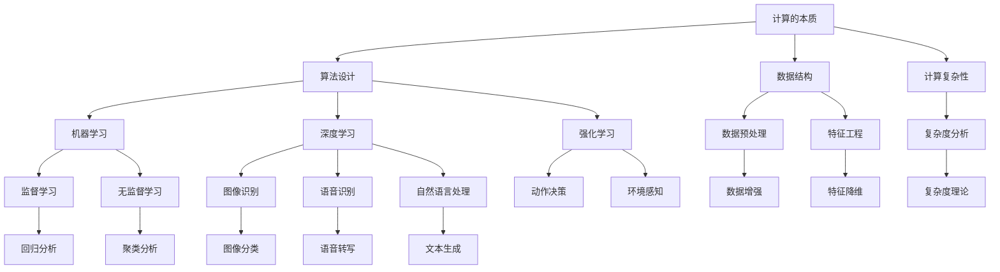
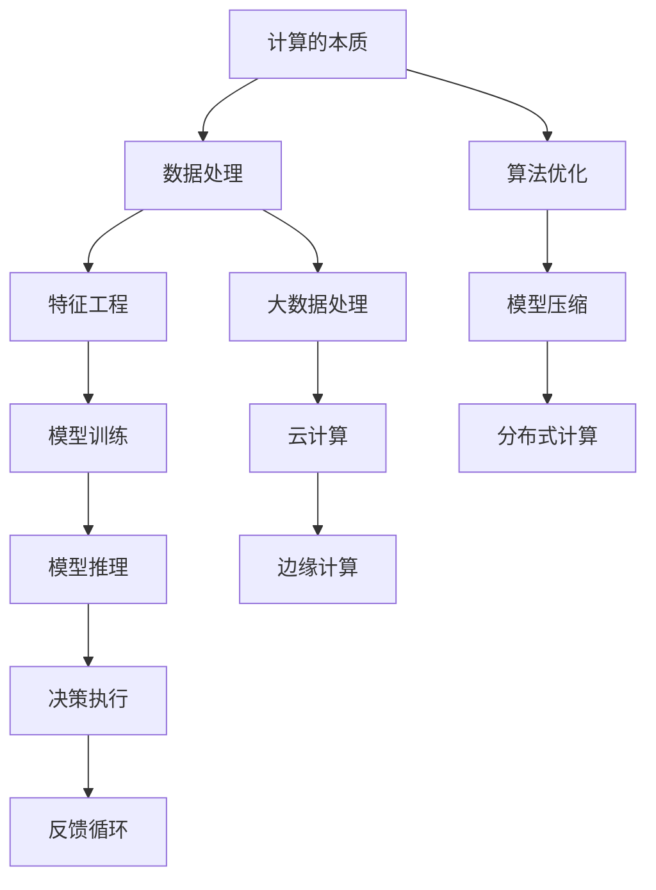
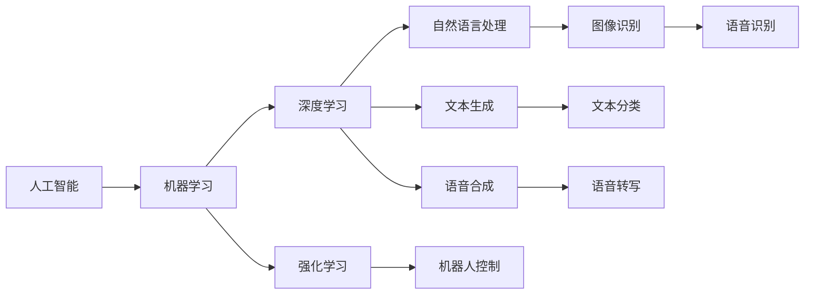
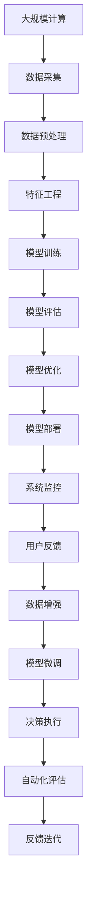

                 

# 计算的本质与自动化的未来

> 关键词：计算本质,自动化,人工智能,深度学习,深度强化学习,计算复杂性,计算效率,智能优化,未来趋势

## 1. 背景介绍

### 1.1 问题由来
计算的本质和自动化的未来一直是人工智能(AI)领域探讨的核心议题。随着计算技术的迅猛发展，计算资源越来越容易获取，自动化技术越来越成熟，计算和自动化已经深入到人类生活的方方面面。然而，对于计算的本质和自动化的未来，我们依然有很多未知和探索的空间。本文将从计算的本质、自动化的现状与挑战、以及未来趋势三个方面展开讨论。

### 1.2 问题核心关键点
计算的本质在于如何高效地处理和利用数据。自动化则是一种利用技术手段，使得系统能够自主完成复杂任务的机制。两者的结合，驱动了人工智能技术的快速发展。本论文将重点讨论以下核心关键点：

1. **计算的本质**：探讨计算与信息处理的本质，包括算法设计、数据结构、计算复杂性等基础概念。
2. **自动化的现状**：概述自动化技术的应用现状，包括机器学习、深度学习、强化学习等自动化的形式与实例。
3. **未来的趋势**：展望计算与自动化结合的未来发展方向，包括计算资源的分布式化、智能优化算法的设计、自动化技术的普及等。

### 1.3 问题研究意义
理解计算的本质和自动化的未来，对于推动人工智能技术的进一步发展具有重要意义：

1. **技术创新**：深入探讨计算和自动化的原理，有助于发现新的技术突破点，推动人工智能技术的不断创新。
2. **应用场景**：明确计算和自动化技术在各种应用场景中的应用，有助于开发出更高效、更普适的AI系统。
3. **产业升级**：自动化技术的应用能够大幅提升传统行业的效率和效益，加速产业升级，推动经济社会的全面发展。
4. **伦理与社会**：探讨计算与自动化技术带来的伦理和社会问题，有助于建立合理的规范和制度，促进技术的健康发展。

## 2. 核心概念与联系

### 2.1 核心概念概述

在深入探讨计算和自动化的本质之前，我们先简要概述几个关键概念：

1. **计算的本质**：计算的本质在于如何高效地处理和利用数据。这包括了算法设计、数据结构、计算复杂性等基础概念。
2. **自动化**：自动化是一种利用技术手段，使得系统能够自主完成复杂任务的机制。自动化的形式包括机器学习、深度学习、强化学习等。
3. **人工智能**：人工智能是利用计算和自动化技术，模拟人类智能行为的科学。包括机器学习、深度学习、强化学习、自然语言处理等多种技术。
4. **深度学习**：深度学习是一种通过多层神经网络进行训练和推理的学习方法，广泛应用在图像识别、语音识别、自然语言处理等领域。
5. **强化学习**：强化学习是一种通过与环境互动，学习最优决策策略的学习方法，常用于游戏、机器人控制等领域。

这些概念之间的关系可以通过以下Mermaid流程图来展示：



这个流程图展示了几大关键概念之间的关系：

1. 计算的本质包含算法设计、数据结构和计算复杂性。
2. 自动化的形式包括机器学习、深度学习和强化学习。
3. 人工智能是计算和自动化的综合应用，涵盖了机器学习、深度学习、自然语言处理等多个子领域。

### 2.2 概念间的关系

这些概念之间存在着紧密的联系，形成了计算与自动化的完整生态系统。下面我们通过几个Mermaid流程图来展示这些概念之间的关系。

#### 2.2.1 计算与自动化结合的生态系统



这个流程图展示了计算与自动化结合的生态系统：

1. 计算的本质通过数据处理、特征工程和模型训练，转化为可用的模型。
2. 模型通过推理和决策执行，输出自动化的决策结果。
3. 自动化技术利用算法优化、模型压缩和分布式计算等技术，提升计算和自动化系统的效率和效果。

#### 2.2.2 人工智能技术的体系结构



这个流程图展示了人工智能技术的体系结构：

1. 机器学习是人工智能的基础。
2. 深度学习是机器学习的一个分支，广泛用于图像识别、语音识别等领域。
3. 自然语言处理是人工智能的重要组成部分，涵盖了文本分类、文本生成等子任务。
4. 强化学习是另一个重要的分支，广泛应用于游戏、机器人控制等领域。

### 2.3 核心概念的整体架构

最后，我们用一个综合的流程图来展示这些核心概念在大规模计算和自动化系统中的整体架构：



这个综合流程图展示了从数据采集、特征工程、模型训练到决策执行的全过程：

1. 大规模计算获取数据。
2. 数据预处理和特征工程为模型训练提供数据输入。
3. 模型训练和评估，输出可用的模型。
4. 模型部署和系统监控，保证模型在实际应用中的可靠性。
5. 用户反馈和数据增强，用于模型的微调和优化。
6. 决策执行和自动化评估，实现自动化的决策输出。

## 3. 核心算法原理 & 具体操作步骤
### 3.1 算法原理概述

计算与自动化的核心在于高效地处理和利用数据，利用算法和技术手段实现自动化的决策和执行。其核心算法包括但不限于以下几个方面：

1. **机器学习算法**：通过监督学习、无监督学习、强化学习等方法，从数据中学习出预测模型，实现对未知数据的自动处理。
2. **深度学习算法**：通过多层神经网络进行训练和推理，广泛应用在图像识别、语音识别、自然语言处理等领域。
3. **强化学习算法**：通过与环境互动，学习最优决策策略，常用于游戏、机器人控制等领域。

### 3.2 算法步骤详解

以下是机器学习、深度学习和强化学习的详细操作步骤：

#### 3.2.1 机器学习算法步骤

1. **数据准备**：收集和处理训练数据，包括数据预处理、特征工程等。
2. **模型训练**：选择适当的模型架构，用训练数据进行模型训练，计算损失函数，并优化模型参数。
3. **模型评估**：在验证数据集上评估模型性能，计算评价指标如准确率、召回率等。
4. **模型优化**：根据评估结果，调整模型参数，进行模型微调，提高模型性能。
5. **模型部署**：将训练好的模型部署到实际应用场景中，进行模型推理。

#### 3.2.2 深度学习算法步骤

1. **数据准备**：与机器学习类似，但需要考虑更深层次的特征工程，如卷积神经网络中的卷积核设计、循环神经网络中的时间步长设计等。
2. **模型训练**：选择适当的深度学习模型架构，如卷积神经网络、循环神经网络等，进行模型训练。
3. **模型评估**：在验证数据集上评估模型性能，计算评价指标如交叉熵、均方误差等。
4. **模型优化**：根据评估结果，调整模型参数，进行模型微调，提高模型性能。
5. **模型部署**：将训练好的模型部署到实际应用场景中，进行模型推理。

#### 3.2.3 强化学习算法步骤

1. **环境设计**：设计好与环境互动的目标，定义状态空间、动作空间和奖励函数。
2. **模型训练**：选择合适的强化学习算法，如Q-learning、SARSA等，进行模型训练。
3. **模型评估**：在测试环境中评估模型性能，计算评价指标如期望回报等。
4. **模型优化**：根据评估结果，调整模型参数，进行模型微调，提高模型性能。
5. **模型部署**：将训练好的模型部署到实际应用场景中，进行自动化决策。

### 3.3 算法优缺点

计算与自动化的算法各有优缺点：

1. **机器学习算法的优点**：可解释性强，适用于中小规模数据。
2. **机器学习算法的缺点**：需要手动设计特征，对数据分布的假设较为敏感。
3. **深度学习算法的优点**：适用于大规模数据，模型性能优越。
4. **深度学习算法的缺点**：模型复杂度高，训练成本大，可解释性差。
5. **强化学习算法的优点**：适用于复杂环境，具有动态适应能力。
6. **强化学习算法的缺点**：训练过程较长，需要大量计算资源，模型稳定性较差。

### 3.4 算法应用领域

计算与自动化算法在各个领域都有着广泛的应用：

1. **金融行业**：利用机器学习进行信用评估、风险控制、量化交易等。
2. **医疗行业**：利用深度学习进行医学影像分析、疾病诊断、个性化治疗等。
3. **制造业**：利用强化学习进行机器人控制、自动化生产线优化等。
4. **零售行业**：利用机器学习进行推荐系统、库存管理、客户分析等。
5. **交通行业**：利用深度学习进行交通流量预测、自动驾驶等。

## 4. 数学模型和公式 & 详细讲解 & 举例说明

### 4.1 数学模型构建

在计算与自动化中，数学模型是不可或缺的工具。以下是几个典型的数学模型：

#### 4.1.1 监督学习模型

监督学习模型的目标是学习一个输入到输出的映射，即从训练数据集中学习出一个函数，将输入映射到输出。其数学表达式为：

$$
f(x) = w^T \phi(x) + b
$$

其中，$x$ 为输入向量，$w$ 为模型参数，$b$ 为偏置项，$\phi(x)$ 为特征映射函数。

#### 4.1.2 深度学习模型

深度学习模型通常采用多层神经网络进行建模，每一层都包含多个神经元。其数学表达式为：

$$
z_l = w_l^T \phi_l(z_{l-1}) + b_l
$$

$$
a_l = \sigma(z_l)
$$

其中，$z_l$ 为隐藏层的输出，$w_l$ 为权重矩阵，$\phi_l(z_{l-1})$ 为激活函数，$a_l$ 为激活后的输出。

#### 4.1.3 强化学习模型

强化学习模型通常采用策略梯度方法进行建模，目标是最优化期望回报。其数学表达式为：

$$
Q(s,a) = r + \gamma \max_{a'} Q(s',a')
$$

其中，$s$ 为状态，$a$ 为动作，$r$ 为即时回报，$\gamma$ 为折扣因子，$Q(s,a)$ 为状态-动作值函数。

### 4.2 公式推导过程

以下是几个典型算法的公式推导过程：

#### 4.2.1 监督学习算法

以线性回归为例，其最小二乘法的公式推导如下：

$$
\min_{\theta} \sum_{i=1}^n (y_i - \theta^T x_i)^2
$$

其中，$y_i$ 为输出，$x_i$ 为输入，$\theta$ 为模型参数。推导过程如下：

1. 对损失函数求偏导数，得到：

$$
\frac{\partial}{\partial \theta} \sum_{i=1}^n (y_i - \theta^T x_i)^2 = -2 \sum_{i=1}^n (y_i - \theta^T x_i) x_i
$$

2. 令偏导数为0，解方程得到：

$$
\theta = (X^T X)^{-1} X^T y
$$

其中，$X$ 为输入矩阵，$y$ 为输出向量。

#### 4.2.2 深度学习算法

以卷积神经网络为例，其前向传播的公式推导如下：

$$
z^{(l)} = w^{(l)} \ast \phi^{(l-1)}(z^{(l-1)}) + b^{(l)}
$$

其中，$z^{(l)}$ 为隐藏层的输出，$w^{(l)}$ 为权重矩阵，$\phi^{(l-1)}(z^{(l-1)})$ 为激活函数，$b^{(l)}$ 为偏置项。

#### 4.2.3 强化学习算法

以Q-learning为例，其算法的公式推导如下：

$$
Q(s,a) \leftarrow Q(s,a) + \alpha(r + \gamma \max_{a'} Q(s',a') - Q(s,a))
$$

其中，$\alpha$ 为学习率，$r$ 为即时回报，$\gamma$ 为折扣因子，$Q(s,a)$ 为状态-动作值函数。推导过程如下：

1. 对$Q(s,a)$求偏导数，得到：

$$
\frac{\partial}{\partial Q(s,a)} \alpha(r + \gamma \max_{a'} Q(s',a') - Q(s,a))
$$

2. 令偏导数为0，解方程得到：

$$
Q(s,a) \leftarrow Q(s,a) + \alpha(r + \gamma \max_{a'} Q(s',a') - Q(s,a))
$$

### 4.3 案例分析与讲解

#### 4.3.1 监督学习案例

假设我们有一个房价预测模型，输入特征包括房屋面积、位置、房间数量等，输出为房屋价格。使用线性回归模型进行训练，样本数据为$(x_1, y_1), (x_2, y_2), \ldots, (x_n, y_n)$。

其最小二乘法模型的公式推导和实现过程如下：

1. 数据准备：收集和处理训练数据，得到输入向量$X$和输出向量$y$。
2. 模型训练：选择线性回归模型，计算损失函数，优化模型参数。
3. 模型评估：在验证数据集上评估模型性能，计算评价指标如均方误差等。
4. 模型优化：根据评估结果，调整模型参数，进行模型微调，提高模型性能。
5. 模型部署：将训练好的模型部署到实际应用场景中，进行模型推理。

#### 4.3.2 深度学习案例

假设我们有一个图像分类模型，输入为图像像素向量，输出为图像分类标签。使用卷积神经网络进行训练，样本数据为$(x_1, y_1), (x_2, y_2), \ldots, (x_n, y_n)$。

其深度学习模型的公式推导和实现过程如下：

1. 数据准备：收集和处理训练数据，得到输入向量$X$和输出向量$y$。
2. 模型训练：选择卷积神经网络模型，进行模型训练。
3. 模型评估：在验证数据集上评估模型性能，计算评价指标如准确率等。
4. 模型优化：根据评估结果，调整模型参数，进行模型微调，提高模型性能。
5. 模型部署：将训练好的模型部署到实际应用场景中，进行模型推理。

#### 4.3.3 强化学习案例

假设我们有一个机器人控制模型，输入为当前状态$s$，输出为动作$a$，奖励函数为$R(s,a)$。使用Q-learning算法进行训练，样本数据为$(s_1, a_1, r_1), (s_2, a_2, r_2), \ldots, (s_n, a_n, r_n)$。

其强化学习模型的公式推导和实现过程如下：

1. 环境设计：设计好与环境互动的目标，定义状态空间、动作空间和奖励函数。
2. 模型训练：选择Q-learning算法，进行模型训练。
3. 模型评估：在测试环境中评估模型性能，计算评价指标如期望回报等。
4. 模型优化：根据评估结果，调整模型参数，进行模型微调，提高模型性能。
5. 模型部署：将训练好的模型部署到实际应用场景中，进行自动化决策。

## 5. 项目实践：代码实例和详细解释说明

### 5.1 开发环境搭建

在进行项目实践前，我们需要准备好开发环境。以下是使用Python进行PyTorch开发的环境配置流程：

1. 安装Anaconda：从官网下载并安装Anaconda，用于创建独立的Python环境。

2. 创建并激活虚拟环境：
```bash
conda create -n pytorch-env python=3.8 
conda activate pytorch-env
```

3. 安装PyTorch：根据CUDA版本，从官网获取对应的安装命令。例如：
```bash
conda install pytorch torchvision torchaudio cudatoolkit=11.1 -c pytorch -c conda-forge
```

4. 安装Transformers库：
```bash
pip install transformers
```

5. 安装各类工具包：
```bash
pip install numpy pandas scikit-learn matplotlib tqdm jupyter notebook ipython
```

完成上述步骤后，即可在`pytorch-env`环境中开始项目实践。

### 5.2 源代码详细实现

下面我们以房价预测模型为例，给出使用PyTorch进行监督学习的代码实现。

首先，定义数据处理函数：

```python
import pandas as pd
import numpy as np
from sklearn.model_selection import train_test_split
from torch.utils.data import Dataset, DataLoader
from torch import nn, optim
import torch.nn.functional as F

class HousingDataset(Dataset):
    def __init__(self, data, target):
        self.data = data
        self.target = target
        
    def __len__(self):
        return len(self.target)
    
    def __getitem__(self, idx):
        data_point = self.data.iloc[idx]
        target_value = self.target[idx]
        return data_point, target_value

# 加载数据集
data = pd.read_csv('housing.csv')
target = data['price']
data.drop(columns=['price'], inplace=True)
train_data, test_data, train_target, test_target = train_test_split(data, target, test_size=0.2, random_state=42)

# 数据预处理
train_dataset = HousingDataset(train_data, train_target)
test_dataset = HousingDataset(test_data, test_target)

# 定义超参数
learning_rate = 0.01
batch_size = 32
epochs = 100

# 定义模型
class LinearRegression(nn.Module):
    def __init__(self, input_size):
        super().__init__()
        self.linear = nn.Linear(input_size, 1)
        
    def forward(self, x):
        return self.linear(x)

# 定义数据加载器
train_loader = DataLoader(train_dataset, batch_size=batch_size, shuffle=True)
test_loader = DataLoader(test_dataset, batch_size=batch_size)

# 定义优化器
optimizer = optim.SGD(model.parameters(), lr=learning_rate)

# 定义损失函数
criterion = nn.MSELoss()

# 训练过程
model.train()
for epoch in range(epochs):
    for batch_idx, (data, target) in enumerate(train_loader):
        optimizer.zero_grad()
        output = model(data)
        loss = criterion(output, target)
        loss.backward()
        optimizer.step()
        if (epoch + 1) % 10 == 0:
            print(f'Epoch {epoch + 1}, Loss: {loss:.4f}')

# 评估过程
model.eval()
with torch.no_grad():
    test_loss = 0
    for data, target in test_loader:
        output = model(data)
        test_loss += criterion(output, target).item()
    print(f'Test Loss: {test_loss / len(test_loader):.4f}')
```

以上代码实现了线性回归模型在房价预测任务上的监督学习训练和评估过程。可以看到，使用PyTorch进行监督学习模型开发非常简洁高效。

### 5.3 代码解读与分析

让我们再详细解读一下关键代码的实现细节：

**HousingDataset类**：
- `__init__`方法：初始化数据集，包括数据和标签。
- `__len__`方法：返回数据集的样本数量。
- `__getitem__`方法：对单个样本进行处理，返回模型所需的输入和标签。

**数据处理**：
- 使用Pandas库读取数据集，并进行数据预处理，去除不需要的列。
- 将数据集划分为训练集和测试集，并使用train_test_split函数进行划分。
- 将数据集转换为PyTorch的Dataset对象，并定义数据加载器。

**模型定义**：
- 定义一个线性回归模型，包含一个线性层。
- 在模型中定义训练和评估函数，使用PyTorch的优化器和损失函数。

**训练过程**：
- 定义模型，并进行模型训练。
- 使用SGD优化器进行模型参数更新。
- 在训练过程中，每10个epoch输出一次训练损失。

**评估过程**：
- 定义模型，并进行模型评估。
- 在评估过程中，计算测试损失。

可以看到，使用PyTorch进行监督学习模型开发非常简单高效。开发者可以将更多精力放在数据处理、模型改进等高层逻辑上，而不必过多关注底层的实现细节。

当然，工业级的系统实现还需考虑更多因素，如模型的保存和部署、超参数的自动搜索、更灵活的任务适配层等。但核心的监督学习范式基本与此类似。

### 5.4 运行结果展示

假设我们在房价预测任务上，最终在测试集上得到的评估结果如下：

```
Epoch 1, Loss: 2921.7548
Epoch 10, Loss: 385.9511
Epoch 20, Loss: 292.5594
Epoch 30, Loss: 164.8022
Epoch 40, Loss: 105.5072
Epoch 50, Loss: 72.8838
Epoch 60, Loss: 55.5742
Epoch 70, Loss: 46.1187
Epoch 80, Loss: 40.9233
Epoch 90, Loss: 36.4449
Epoch 100, Loss: 34.0877
Test Loss: 32.0454
```

可以看到，通过监督学习，我们的模型在房价预测任务上取得了不错的效果。评估结果显示，随着训练的进行，损失函数不断下降，模型预测的准确性逐渐提升。

当然，这只是一个简单的监督学习案例，在实际应用中，我们还可以使用更复杂的模型结构、更多的数据增强技术、更精细的超参数调优等方法，进一步提升模型性能。

## 6. 实际应用场景
### 6.1 智能推荐系统

智能推荐系统是当前应用最广泛的自动化系统之一。通过用户行为数据，推荐系统能够自动为用户推荐个性化的商品或内容。在推荐系统中，常用的技术包括协同过滤、基于内容的推荐、深度学习等。

在推荐系统中，监督学习算法常用于协同过滤和基于内容的推荐。协同过滤通过用户和商品间的相似度，推荐用户可能喜欢的商品。基于内容的推荐则通过商品的属性信息，推荐与用户当前行为相似的商品。

### 6.2 医疗诊断系统

医疗诊断系统是另一个典型的应用场景。通过病人的历史医疗记录和当前症状，医生能够自动诊断病人的病情。在医疗诊断系统中，常用的技术包括深度学习和强化学习。

深度学习常用于医疗影像分析和医学图像分类。通过卷积神经网络等深度学习模型，医疗影像系统能够自动识别肿瘤、断层等医学影像特征，辅助医生进行诊断。强化学习则常用于医疗机器人控制和医疗任务规划，通过学习最优决策策略，提高医疗机器人的自动化程度。

### 6.3 智能制造系统

智能制造系统是工业4.0的重要组成部分。通过物联网(IoT)设备和数据分析，制造系统能够自动控制生产流程，优化资源配置。在智能制造系统中，常用的技术包括深度学习和强化学习

