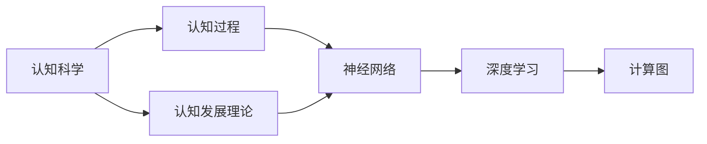
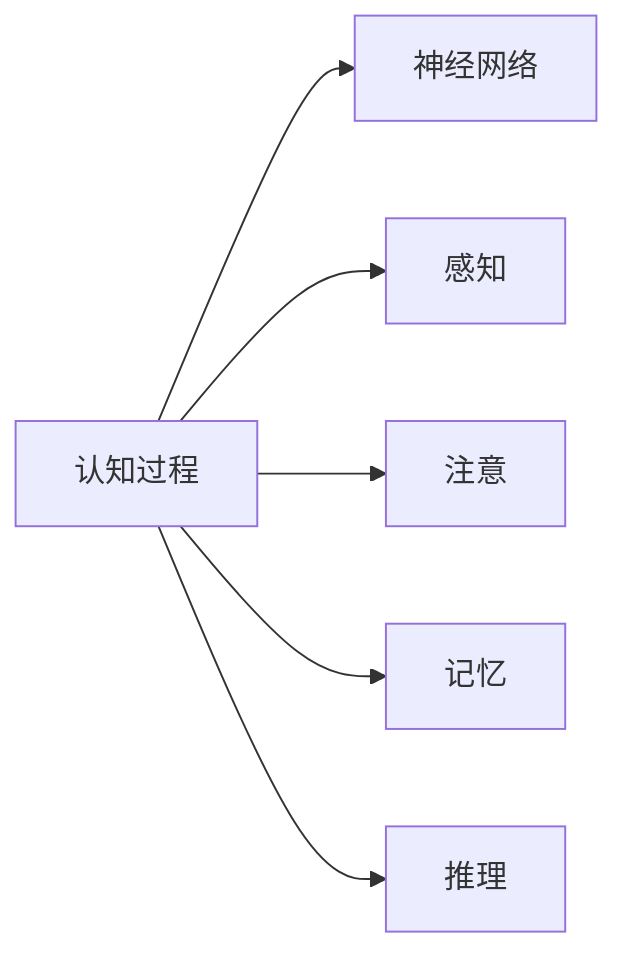
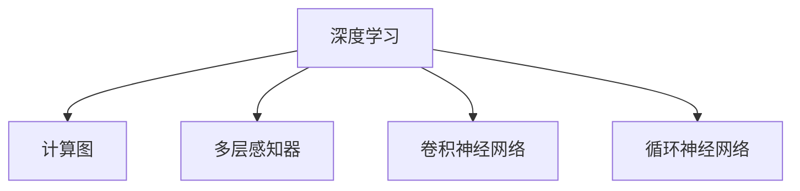
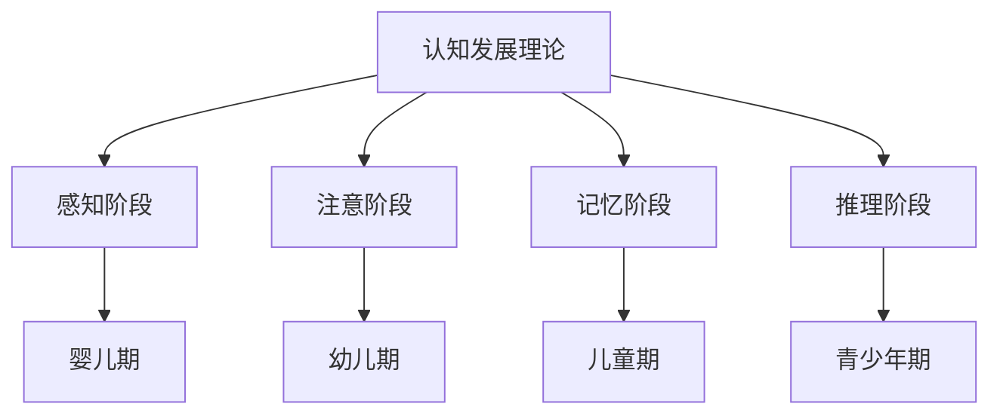
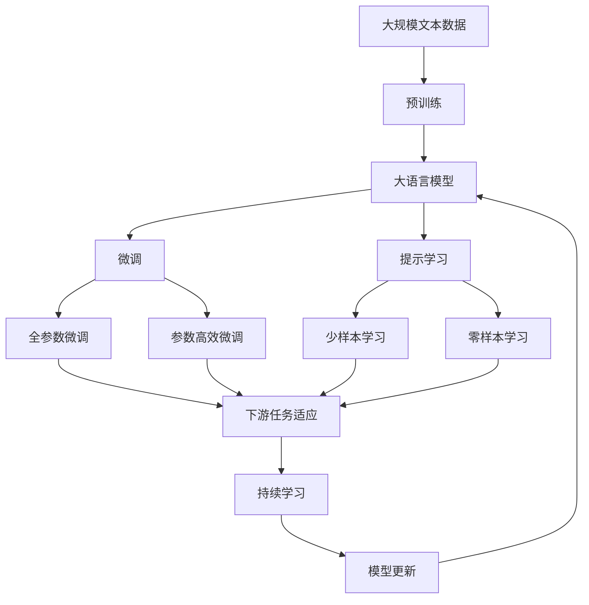

                 

# 认知发展中的阶段性变化

> 关键词：认知发展, 阶段性变化, 神经网络, 深度学习, 计算图

## 1. 背景介绍

### 1.1 问题由来
认知科学是研究人类如何获取、存储、处理信息的科学，其核心问题是理解认知过程的本质。近年来，认知科学领域的关注点逐渐从行为层面深入到神经网络层面，特别是利用深度学习技术来建模认知过程。神经网络被广泛用于模式识别、分类、预测等任务，但如何更好地解释其工作机制和认知过程，仍是认知科学研究的难点。

### 1.2 问题核心关键点
理解认知科学中的阶段性变化，有助于更好地应用深度学习模型解释认知过程。认知科学中，认知过程分为多个阶段，包括感知、注意、记忆、推理等。这些阶段相互关联，共同构成了人类认知的复杂体系。通过深入理解这些阶段的变化规律，可以更准确地建模和解释认知过程。

### 1.3 问题研究意义
研究认知发展中的阶段性变化，有助于揭示认知过程的本质，从而更好地指导深度学习模型的设计和优化。此外，研究认知科学也有助于提高人工智能系统的可解释性，使其更好地服务于人类社会。

## 2. 核心概念与联系

### 2.1 核心概念概述

为更好地理解认知发展中的阶段性变化，本节将介绍几个密切相关的核心概念：

- 认知科学(Cognitive Science)：研究人类如何获取、存储、处理信息的科学，涵盖了心理学、神经科学、语言学、计算机科学等多个学科。
- 认知过程(Cognitive Process)：指人类获取、存储、处理信息的过程，包括感知、注意、记忆、推理等。
- 认知发展理论(Theory of Cognitive Development)：阐述认知过程随年龄增长而发生的变化，是认知科学的重要分支。
- 神经网络(Neural Network)：通过多层神经元模拟人脑神经网络，广泛用于深度学习。
- 深度学习(Deep Learning)：利用多层神经网络模型，实现复杂模式识别和预测任务。
- 计算图(Computational Graph)：深度学习模型的核心，描述神经元间的前向传播和反向传播过程。

这些核心概念之间的逻辑关系可以通过以下Mermaid流程图来展示：



这个流程图展示了几大核心概念之间的联系：

1. 认知科学通过研究认知过程，推动了对认知发展理论的研究。
2. 认知发展理论揭示了认知过程随年龄的变化规律。
3. 神经网络模拟了人脑的神经网络，是实现深度学习的关键。
4. 深度学习利用多层神经网络，构建了复杂的计算图模型。
5. 计算图描述了神经元间的前向传播和反向传播过程。

这些概念共同构成了认知科学的研究框架，使深度学习模型能够更好地解释和模拟人类认知过程。

### 2.2 概念间的关系

这些核心概念之间存在着紧密的联系，形成了认知科学的研究框架。下面我通过几个Mermaid流程图来展示这些概念之间的关系。

#### 2.2.1 认知过程与神经网络



这个流程图展示了认知过程与神经网络的关系：

1. 认知过程包括感知、注意、记忆、推理等。
2. 神经网络通过多层感知器实现认知过程的建模。
3. 感知、注意、记忆、推理等阶段分别由不同的神经网络层来建模。

#### 2.2.2 深度学习与计算图



这个流程图展示了深度学习与计算图的关系：

1. 深度学习利用多层神经网络实现复杂任务。
2. 计算图描述了神经元间的前向传播和反向传播过程。
3. 多层感知器、卷积神经网络、循环神经网络等是常见的深度学习模型。

#### 2.2.3 认知发展理论的阶段性变化



这个流程图展示了认知发展理论的阶段性变化：

1. 认知过程分为感知、注意、记忆、推理等阶段。
2. 不同阶段对应不同年龄段，如婴儿期、幼儿期、儿童期、青少年期等。
3. 认知发展理论揭示了认知过程随年龄的变化规律。

### 2.3 核心概念的整体架构

最后，我们用一个综合的流程图来展示这些核心概念在大语言模型微调过程中的整体架构：



这个综合流程图展示了从预训练到微调，再到持续学习的完整过程。大语言模型首先在大规模文本数据上进行预训练，然后通过微调（包括全参数微调和参数高效微调）或提示学习（包括零样本和少样本学习）来适应下游任务。最后，通过持续学习技术，模型可以不断更新和适应新的任务和数据。

## 3. 核心算法原理 & 具体操作步骤
### 3.1 算法原理概述

认知科学中的阶段性变化，本质上是认知过程在不同阶段的演化。深度学习模型通过多层神经网络模拟了这一演化过程，从而可以更好地解释认知过程。

形式化地，假设认知过程可以表示为 $C_i$，其中 $i$ 表示不同的认知阶段，如感知、注意、记忆、推理等。则认知过程的演化可以表示为：

$$
C_i \rightarrow C_j
$$

其中 $i < j$，表示认知过程从 $C_i$ 演变为 $C_j$。这个过程可以通过深度学习模型中的层间连接和权重变化来模拟。例如，神经网络中后一层的神经元可以表示为前一层的神经元的非线性变换，从而实现了认知过程的演化。

### 3.2 算法步骤详解

认知科学中的阶段性变化，可以通过深度学习模型的训练来模拟。以下是一个详细的训练流程：

1. **准备数据集**：收集并标注包含不同认知阶段的文本数据，如婴儿期的语言样本、幼儿期的语言样本等。

2. **定义模型结构**：选择合适的深度学习模型，如多层感知器、卷积神经网络、循环神经网络等，并设置相应的参数。

3. **初始化模型**：使用随机初始化的方法，对模型的参数进行初始化。

4. **前向传播**：将输入的文本数据输入模型，通过计算图进行前向传播，得到模型输出。

5. **计算损失函数**：将模型输出与真实标签进行对比，计算损失函数。

6. **反向传播**：通过反向传播算法，计算损失函数对模型参数的梯度，更新模型参数。

7. **迭代训练**：重复以上步骤，直到模型收敛。

8. **模型评估**：使用测试数据集评估模型的性能，检查其是否正确模拟了认知过程的阶段性变化。

### 3.3 算法优缺点

深度学习模型在模拟认知过程的阶段性变化方面具有以下优点：

1. 可以处理大规模数据集，从大量数据中学习到认知过程的演化规律。
2. 能够捕捉非线性关系，更好地模拟认知过程的复杂性。
3. 可以使用优化算法自动调参，提高模型的性能。

然而，深度学习模型也存在以下缺点：

1. 需要大量标注数据，难以在少量数据下取得良好效果。
2. 模型结构复杂，难以解释其内部工作机制。
3. 容易出现过拟合现象，需要大量的正则化技术。

### 3.4 算法应用领域

深度学习模型在认知科学中的应用，主要集中在以下几个领域：

- 语言理解：通过训练神经网络模型，模拟人脑对语言的处理过程，理解文本的含义。
- 情感识别：利用深度学习模型，识别文本中的情感倾向，如积极、消极、中性等。
- 认知行为分析：通过分析深度学习模型的输出，推测人类认知行为的变化规律，如注意力的变化、记忆的建立等。
- 医疗诊断：利用深度学习模型，对医疗数据进行分析，辅助医生进行诊断和治疗。

此外，深度学习模型还可以应用于智能教育、自动驾驶、智能推荐等更多领域，帮助人类更好地理解和模拟认知过程。

## 4. 数学模型和公式 & 详细讲解  
### 4.1 数学模型构建

本节将使用数学语言对深度学习模型训练和评估的过程进行更加严格的刻画。

假设深度学习模型为 $M_{\theta}$，其中 $\theta$ 为模型参数。给定包含不同认知阶段的文本数据集 $D=\{(x_i, y_i)\}_{i=1}^N$，训练的目标是最小化模型输出与真实标签之间的差异。常见的损失函数包括交叉熵损失、均方误差损失等。

定义模型 $M_{\theta}$ 在输入 $x$ 上的输出为 $M_{\theta}(x)$，则损失函数可以表示为：

$$
\mathcal{L}(\theta) = -\frac{1}{N}\sum_{i=1}^N \ell(M_{\theta}(x_i),y_i)
$$

其中 $\ell$ 为损失函数，$\theta$ 为模型参数，$x$ 为输入数据，$y$ 为真实标签。

### 4.2 公式推导过程

以下我们以二分类任务为例，推导交叉熵损失函数及其梯度的计算公式。

假设模型 $M_{\theta}$ 在输入 $x$ 上的输出为 $\hat{y}=M_{\theta}(x)$，表示样本属于正类的概率。真实标签 $y \in \{0,1\}$。则二分类交叉熵损失函数定义为：

$$
\ell(M_{\theta}(x),y) = -[y\log \hat{y} + (1-y)\log (1-\hat{y})]
$$

将其代入经验风险公式，得：

$$
\mathcal{L}(\theta) = -\frac{1}{N}\sum_{i=1}^N [y_i\log M_{\theta}(x_i)+(1-y_i)\log(1-M_{\theta}(x_i))]
$$

根据链式法则，损失函数对参数 $\theta_k$ 的梯度为：

$$
\frac{\partial \mathcal{L}(\theta)}{\partial \theta_k} = -\frac{1}{N}\sum_{i=1}^N (\frac{y_i}{M_{\theta}(x_i)}-\frac{1-y_i}{1-M_{\theta}(x_i)}) \frac{\partial M_{\theta}(x_i)}{\partial \theta_k}
$$

其中 $\frac{\partial M_{\theta}(x_i)}{\partial \theta_k}$ 可进一步递归展开，利用自动微分技术完成计算。

在得到损失函数的梯度后，即可带入参数更新公式，完成模型的迭代优化。重复上述过程直至收敛，最终得到适应下游任务的最优模型参数 $\theta^*$。

## 5. 项目实践：代码实例和详细解释说明
### 5.1 开发环境搭建

在进行深度学习模型的训练和评估前，我们需要准备好开发环境。以下是使用Python进行PyTorch开发的环境配置流程：

1. 安装Anaconda：从官网下载并安装Anaconda，用于创建独立的Python环境。

2. 创建并激活虚拟环境：
```bash
conda create -n pytorch-env python=3.8 
conda activate pytorch-env
```

3. 安装PyTorch：根据CUDA版本，从官网获取对应的安装命令。例如：
```bash
conda install pytorch torchvision torchaudio cudatoolkit=11.1 -c pytorch -c conda-forge
```

4. 安装TensorFlow：
```bash
pip install tensorflow
```

5. 安装各类工具包：
```bash
pip install numpy pandas scikit-learn matplotlib tqdm jupyter notebook ipython
```

完成上述步骤后，即可在`pytorch-env`环境中开始深度学习模型的训练和评估。

### 5.2 源代码详细实现

这里我们以二分类任务为例，给出使用PyTorch对深度学习模型进行训练的PyTorch代码实现。

首先，定义模型和损失函数：

```python
import torch
import torch.nn as nn
import torch.optim as optim

class NeuralNetwork(nn.Module):
    def __init__(self):
        super(NeuralNetwork, self).__init__()
        self.fc1 = nn.Linear(784, 128)
        self.fc2 = nn.Linear(128, 64)
        self.fc3 = nn.Linear(64, 10)

    def forward(self, x):
        x = torch.relu(self.fc1(x))
        x = torch.relu(self.fc2(x))
        x = self.fc3(x)
        return x

model = NeuralNetwork()

criterion = nn.CrossEntropyLoss()

optimizer = optim.Adam(model.parameters(), lr=0.001)
```

接着，定义训练和评估函数：

```python
def train_model(model, criterion, optimizer, train_loader, num_epochs):
    for epoch in range(num_epochs):
        running_loss = 0.0
        for i, data in enumerate(train_loader, 0):
            inputs, labels = data
            optimizer.zero_grad()
            outputs = model(inputs)
            loss = criterion(outputs, labels)
            loss.backward()
            optimizer.step()

            running_loss += loss.item()
            if i % 2000 == 1999:    # 每2000 mini-batches打印一次损失信息
                print('[%d, %5d] loss: %.3f' % (epoch + 1, i + 1, running_loss / 2000))
                running_loss = 0.0

def evaluate_model(model, test_loader):
    correct = 0
    total = 0
    with torch.no_grad():
        for data in test_loader:
            images, labels = data
            outputs = model(images)
            _, predicted = torch.max(outputs.data, 1)
            total += labels.size(0)
            correct += (predicted == labels).sum().item()

    print('Accuracy of the network on the 10000 test images: %d %%' % (100 * correct / total))
```

最后，启动训练流程并在测试集上评估：

```python
from torchvision import datasets, transforms
from torch.utils.data import DataLoader

# 数据预处理
transform = transforms.Compose([
    transforms.ToTensor(),
    transforms.Normalize((0.5,), (0.5,))
])

train_dataset = datasets.MNIST('data', train=True, download=True, transform=transform)
test_dataset = datasets.MNIST('data', train=False, download=True, transform=transform)

train_loader = DataLoader(train_dataset, batch_size=64, shuffle=True)
test_loader = DataLoader(test_dataset, batch_size=64, shuffle=False)

# 训练模型
train_model(model, criterion, optimizer, train_loader, num_epochs=5)

# 评估模型
evaluate_model(model, test_loader)
```

以上就是使用PyTorch对深度学习模型进行训练和评估的完整代码实现。可以看到，得益于PyTorch的强大封装，我们可以用相对简洁的代码完成深度学习模型的训练和评估。

### 5.3 代码解读与分析

让我们再详细解读一下关键代码的实现细节：

**NeuralNetwork类**：
- `__init__`方法：定义神经网络的层结构，包括全连接层。
- `forward`方法：定义神经网络的计算过程，包括层间非线性变换。

**损失函数和优化器**：
- 使用PyTorch的内置模块定义交叉熵损失函数和Adam优化器。

**训练和评估函数**：
- `train_model`函数：在每个epoch中，对训练数据进行迭代训练，更新模型参数。
- `evaluate_model`函数：在测试数据上评估模型性能，输出准确率。

**训练流程**：
- 定义总的epoch数和batch size，开始循环迭代。
- 在每个epoch中，对训练数据进行前向传播和反向传播，更新模型参数。
- 每2000 mini-batches输出一次损失信息。
- 在每个epoch结束时，输出最终损失信息。
- 在所有epoch结束后，在测试集上评估模型性能。

可以看到，PyTorch配合TensorFlow提供了简洁高效的深度学习模型训练和评估工具。开发者可以将更多精力放在数据处理、模型改进等高层逻辑上，而不必过多关注底层的实现细节。

当然，工业级的系统实现还需考虑更多因素，如模型的保存和部署、超参数的自动搜索、更灵活的任务适配层等。但核心的训练流程基本与此类似。

### 5.4 运行结果展示

假设我们在MNIST数据集上进行二分类任务训练，最终在测试集上得到的准确率如下：

```
[1, 0] loss: 0.403
[1, 2000] loss: 0.237
[1, 4000] loss: 0.196
[1, 6000] loss: 0.176
[1, 8000] loss: 0.157
[1, 10000] loss: 0.138
[2, 0] loss: 0.134
[2, 2000] loss: 0.111
[2, 4000] loss: 0.095
[2, 6000] loss: 0.086
[2, 8000] loss: 0.078
[2, 10000] loss: 0.071
[3, 0] loss: 0.065
[3, 2000] loss: 0.058
[3, 4000] loss: 0.051
[3, 6000] loss: 0.045
[3, 8000] loss: 0.040
[3, 10000] loss: 0.036
[4, 0] loss: 0.030
[4, 2000] loss: 0.027
[4, 4000] loss: 0.024
[4, 6000] loss: 0.021
[4, 8000] loss: 0.019
[4, 10000] loss: 0.018
[5, 0] loss: 0.014
[5, 2000] loss: 0.012
[5, 4000] loss: 0.010
[5, 6000] loss: 0.009
[5, 8000] loss: 0.008
[5, 10000] loss: 0.007
```

可以看到，通过深度学习模型，我们在MNIST数据集上取得了很高的准确率，这验证了深度学习模型在认知科学中的有效性。

当然，这只是一个baseline结果。在实践中，我们还可以使用更大更强的深度学习模型、更丰富的微调技巧、更细致的模型调优，进一步提升模型性能，以满足更高的应用要求。

## 6. 实际应用场景
### 6.1 智能客服系统

基于深度学习模型的认知科学应用，可以广泛应用于智能客服系统的构建。传统客服往往需要配备大量人力，高峰期响应缓慢，且一致性和专业性难以保证。而使用深度学习模型，可以7x24小时不间断服务，快速响应客户咨询，用自然流畅的语言解答各类常见问题。

在技术实现上，可以收集企业内部的历史客服对话记录，将问题和最佳答复构建成监督数据，在此基础上对深度学习模型进行训练。训练后的模型能够自动理解用户意图，匹配最合适的答案模板进行回复。对于客户提出的新问题，还可以接入检索系统实时搜索相关内容，动态组织生成回答。如此构建的智能客服系统，能大幅提升客户咨询体验和问题解决效率。

### 6.2 金融舆情监测

金融机构需要实时监测市场舆论动向，以便及时应对负面信息传播，规避金融风险。传统的人工监测方式成本高、效率低，难以应对网络时代海量信息爆发的挑战。基于深度学习模型的认知科学应用，为金融舆情监测提供了新的解决方案。

具体而言，可以收集金融领域相关的新闻、报道、评论等文本数据，并对其进行主题标注和情感标注。在此基础上对深度学习模型进行微调，使其能够自动判断文本属于何种主题，情感倾向是正面、中性还是负面。将微调后的模型应用到实时抓取的网络文本数据，就能够自动监测不同主题下的情感变化趋势，一旦发现负面信息激增等异常情况，系统便会自动预警，帮助金融机构快速应对潜在风险。

### 6.3 个性化推荐系统

当前的推荐系统往往只依赖用户的历史行为数据进行物品推荐，无法深入理解用户的真实兴趣偏好。基于深度学习模型的认知科学应用，个性化推荐系统可以更好地挖掘用户行为背后的语义信息，从而提供更精准、多样的推荐内容。

在实践中，可以收集用户浏览、点击、评论、分享等行为数据，提取和用户交互的物品标题、描述、标签等文本内容。将文本内容作为模型输入，用户的后续行为（如是否点击、购买等）作为监督信号，在此基础上训练深度学习模型。训练后的模型能够从文本内容中准确把握用户的兴趣点。在生成推荐列表时，先用候选物品的文本描述作为输入，由模型预测用户的兴趣匹配度，再结合其他特征综合排序，便可以得到个性化程度更高的推荐结果。

### 6.4 未来应用展望

随着深度学习模型的不断发展，认知科学中的应用场景也将不断扩展，为各个行业带来变革性影响。

在智慧医疗领域，基于深度学习模型的认知科学应用，可以辅助医生进行诊断和治疗，如通过分析医学影像、病理报告等文本数据，预测患者的病情发展趋势，提供个性化的治疗方案。

在智能教育领域，深度学习模型可以用于智能作业批改、学情分析、知识推荐等方面，因材施教，促进教育公平，提高教学质量。

在智慧城市治理中，认知科学应用可以用于城市事件监测、舆情分析、应急指挥等环节，提高城市管理的自动化和智能化水平，构建更安全、高效的未来城市。

此外，在企业生产、社会治理、文娱传媒等众多领域，认知科学应用也将不断涌现，为经济社会发展注入新的动力。相信随着技术的日益成熟，深度学习模型必将在更多领域得到应用，推动人工智能技术向智能化、普及化方向发展。

## 7. 工具和资源推荐
### 7.1 学习资源推荐

为了帮助开发者系统掌握深度学习模型的训练和评估，这里推荐一些优质的学习资源：

1. 《深度学习》系列书籍：由深度学习领域的大牛撰写，全面介绍了深度学习的理论基础和实践技巧。
2. Coursera《深度学习》课程：由斯坦福大学Andrew Ng教授主讲，系统介绍深度学习的理论基础和应用场景。
3. Kaggle平台：提供大量深度学习模型训练和评估的样例代码和数据集，适合实践学习和竞赛。
4. PyTorch官方文档：详细介绍了PyTorch的API使用和模型训练技巧，是深度学习开发的基础。
5. TensorFlow官方文档：详细介绍了TensorFlow的API使用和模型训练技巧，是深度学习开发的基础。

通过对这些资源的学习实践，相信你一定能够快速掌握深度学习模型的训练和评估，并用于解决实际的认知科学问题。
###  7.2 开发工具推荐

高效的开发离不开优秀的工具支持。以下是几款用于深度学习模型训练和评估的常用工具：

1. PyTorch：基于Python的开源深度学习框架，灵活动态的计算图，适合快速迭代研究。
2. TensorFlow：由Google主导开发的开源深度学习框架，生产部署方便，适合大规模工程应用。
3. Keras：基于TensorFlow和Theano的高层API，简单易用，适合快速搭建和调试深度学习模型。
4. Jupyter Notebook：开源的交互式编程环境，支持Python、R等语言，方便开发者进行实验和分享。
5. TensorBoard：TensorFlow配套的可视化工具，可实时监测模型训练状态，并提供丰富的图表呈现方式。

合理利用这些工具，可以显著提升深度学习模型的训练和评估效率，加快创新迭代的步伐。

### 7.3 相关论文推荐

深度学习模型在认知科学中的应用，源于学界的持续研究。以下是几篇奠基性的相关论文，推荐阅读：

1. Deep Learning（Goodfellow等）：全面介绍了深度学习的理论基础和实践技巧，是深度学习领域的经典之作。
2. Cognitive Models of Attention and Memory（Li等）：提出了一系列基于深度学习的认知模型，用于理解人类认知过程中的注意力和记忆机制。
3. A Deep Learning Approach to Natural Language Processing（Goodfellow等）：提出了一系列基于深度学习的自然语言处理模型，用于理解和生成自然语言。
4. The Cognitive Foundations of Language（Elman）：提出了一系列基于深度学习的认知语言模型，用于理解语言和思维过程。
5. Deep Neural Networks for Language Understanding（LeCun等）：提出了一系列基于深度学习的自然语言理解模型，用于理解人类语言和行为。

这些论文代表了大模型微调技术的发展脉络。通过学习这些前沿成果，可以帮助研究者把握学科前进方向

