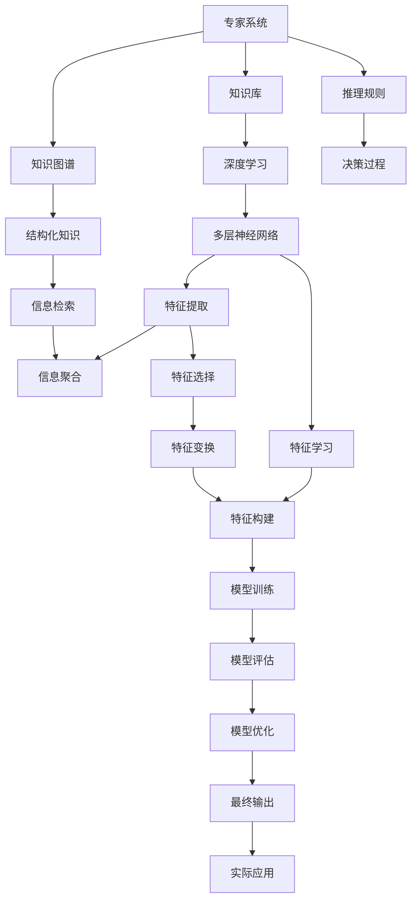
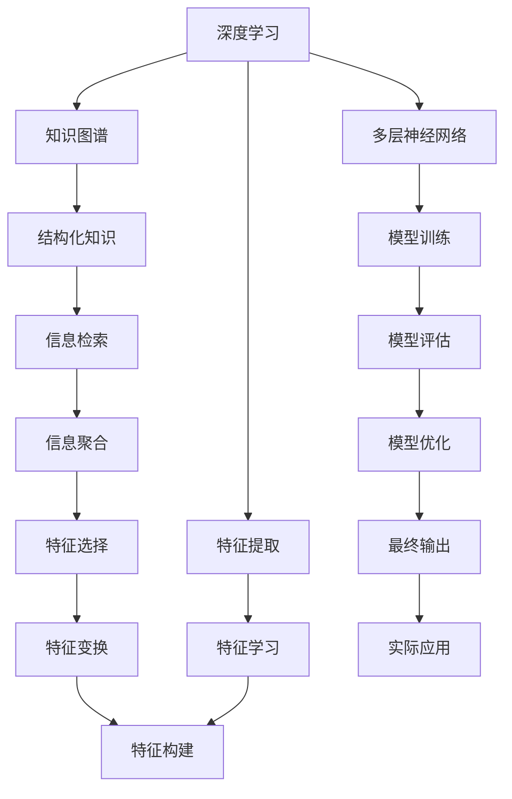

                 

# 认知差：我懂的东西，你不懂

> 关键词：认知差,专家系统,知识图谱,深度学习,特征工程,知识蒸馏,迁移学习,算法优化

## 1. 背景介绍

### 1.1 问题由来

在信息爆炸的时代，知识变得触手可及。但这并不意味着每个人都能吸收并利用这些知识。认知差，即“我懂的东西，你不懂”，指的是个人或群体之间在获取、理解和应用知识上的差异。这一现象在科技和信息技术领域尤为明显，因为这里的信息量巨大，更新速度快。

“认知差”在AI和机器学习领域尤为显著。专家系统、深度学习、知识图谱等技术的发展，使得机器在许多领域能够超越人类。但与此同时，这也导致了“认知差”的扩大。本博客将探讨这一现象，并分析如何通过技术手段减少“认知差”，帮助非专家更好地理解和应用AI技术。

### 1.2 问题核心关键点

认知差的根源在于知识的获取和应用方式的差异。AI和机器学习技术的进步，使机器能够高效地处理大量数据，从中提取有价值的信息。而人类在处理信息时，往往依赖于直觉、经验和情感。因此，机器在某些特定领域（如医疗、金融、交通等）的表现可能超越人类，但在理解人类情感、创造性思维等方面仍然存在局限。

认知差的影响包括但不限于以下几个方面：

1. **技术隔阂**：非专家在理解和应用AI技术时面临的障碍，使得这些技术难以在实际工作中发挥作用。
2. **决策偏差**：由于认知差，非专家可能依赖机器的输出，而忽视其局限性和偏差，导致决策失误。
3. **信任问题**：非专家对机器输出结果的信任度较低，影响其在实际应用中的效果。

## 2. 核心概念与联系

### 2.1 核心概念概述

为更好地理解认知差及其在AI领域的应用，本节将介绍几个关键概念：

- **专家系统**：一种通过知识库和推理规则进行决策的AI系统，具有处理复杂问题的能力。
- **深度学习**：一种通过多层神经网络进行特征学习和模式识别的机器学习方法，能够处理大规模非结构化数据。
- **知识图谱**：一种结构化的知识表示方式，用于描述实体、关系和属性。
- **特征工程**：一种通过手动或自动的方式提取、选择、变换和构建特征，以提高机器学习模型的表现。
- **知识蒸馏**：一种将大模型知识迁移到小模型的技术，使得小模型在保留核心能力的同时，减少计算和存储成本。
- **迁移学习**：一种利用已有模型在新任务上进行微调的方法，使得模型能够快速适应新领域。
- **算法优化**：通过调整算法参数、优化模型结构等方式，提高机器学习模型的性能。

这些核心概念通过以下Mermaid流程图展示它们之间的联系：



这个流程图展示了从知识库和推理规则出发，通过深度学习进行特征学习，进而构建专家系统，并最终应用于实际问题的全过程。其中，知识图谱和信息检索技术在特征工程和模型训练中扮演了重要角色。

### 2.2 概念间的关系

这些核心概念之间的关系可以通过以下Mermaid流程图来展示：



这个流程图展示了深度学习如何通过特征工程和知识图谱提取和构建特征，进而进行模型训练和优化，并应用于实际问题解决。

## 3. 核心算法原理 & 具体操作步骤
### 3.1 算法原理概述

认知差的核心在于知识获取和应用的不平等。AI和机器学习技术通过数据驱动的方式，从海量的数据中学习到丰富的知识，并能够高效地处理复杂问题。而人类往往依赖直觉和经验，难以在短时间内掌握这些知识。

因此，认知差的解决需要依赖于技术手段，通过以下步骤来实现知识共享和应用：

1. **知识图谱构建**：通过构建结构化的知识图谱，将大量无结构化的知识转化为结构化数据，便于机器学习模型的处理和应用。
2. **特征工程优化**：通过手动或自动的方式，提取、选择和变换特征，以提高模型的表现。
3. **深度学习应用**：利用深度学习模型，从大规模数据中学习特征，并用于实际问题的解决。
4. **知识蒸馏技术**：通过知识蒸馏将大模型的知识迁移到小模型，提高小模型的性能，同时减少计算和存储成本。
5. **迁移学习优化**：利用已有模型在新任务上进行微调，提高模型的泛化能力。

### 3.2 算法步骤详解

以下是一个简化的认知差解决方案的算法步骤：

**Step 1: 知识图谱构建**
- 收集领域相关的无结构化数据，如文献、报告、百科等。
- 提取实体、关系和属性，构建知识图谱。

**Step 2: 特征工程**
- 选择并提取与问题相关的特征，如文本的TF-IDF、图像的HOG特征等。
- 使用特征选择和变换技术，如PCA、LDA等，优化特征。

**Step 3: 深度学习模型训练**
- 使用选择的特征，训练深度学习模型，如CNN、RNN、Transformer等。
- 使用知识图谱中的信息检索技术，增强模型的知识理解能力。

**Step 4: 知识蒸馏**
- 在大模型上训练小模型，通过知识蒸馏将大模型的知识迁移到小模型。
- 使用模型融合技术，如Bagging、Boosting等，提高模型的性能。

**Step 5: 迁移学习**
- 利用已有模型的微调技术，在新任务上进行微调，提高模型的泛化能力。
- 使用迁移学习算法，如Fine-tuning、Zero-shot Learning等，适应新领域。

**Step 6: 算法优化**
- 使用交叉验证、网格搜索等技术，优化算法参数。
- 使用正则化、Dropout等技术，提高模型的鲁棒性。

### 3.3 算法优缺点

认知差解决方案的算法具有以下优点：

- **高效性**：通过自动化处理大规模数据，高效地提取特征和知识，提高模型性能。
- **泛化能力强**：通过迁移学习，模型能够适应新领域，提高泛化能力。
- **可解释性强**：通过知识图谱和信息检索技术，增强模型的可解释性，便于理解和使用。

然而，该算法也存在以下缺点：

- **数据依赖性**：依赖于高质量的数据，数据质量差可能导致模型性能不佳。
- **计算成本高**：深度学习模型和特征工程需要大量的计算资源。
- **知识局限性**：知识图谱和特征工程只能捕捉显式知识，难以捕捉隐式知识和背景知识。

### 3.4 算法应用领域

认知差解决方案在多个领域具有广泛的应用，例如：

- **医疗诊断**：利用知识图谱和深度学习，辅助医生进行疾病诊断和预测。
- **金融分析**：通过特征工程和知识图谱，提高金融数据分析的准确性和速度。
- **智能客服**：利用迁移学习和知识蒸馏，构建高效、智能的客户服务系统。
- **智能推荐**：通过特征工程和深度学习，提高个性化推荐系统的精准度。
- **智能制造**：利用知识图谱和迁移学习，优化生产流程，提高生产效率。

## 4. 数学模型和公式 & 详细讲解 & 举例说明

### 4.1 数学模型构建

认知差解决方案的数学模型主要涉及深度学习模型和特征工程。下面以文本分类为例，构建深度学习模型的数学模型：

假设输入文本 $x$ 和输出标签 $y$，深度学习模型的目标是最大化交叉熵损失函数：

$$
\mathcal{L}(\theta) = -\frac{1}{N}\sum_{i=1}^N y_i \log \hat{y}_i + (1 - y_i) \log (1 - \hat{y}_i)
$$

其中 $\theta$ 为模型参数，$N$ 为样本数量，$y_i$ 为第 $i$ 个样本的标签，$\hat{y}_i$ 为模型对第 $i$ 个样本的预测概率。

### 4.2 公式推导过程

以二分类任务为例，推导模型预测概率的计算公式：

假设模型 $M_{\theta}$ 在输入 $x$ 上的输出为 $\hat{y}=M_{\theta}(x)$，表示样本属于正类的概率。真实标签 $y \in \{0,1\}$。则二分类交叉熵损失函数定义为：

$$
\ell(M_{\theta}(x),y) = -[y\log \hat{y} + (1-y)\log (1-\hat{y})]
$$

将其代入经验风险公式，得：

$$
\mathcal{L}(\theta) = -\frac{1}{N}\sum_{i=1}^N [y_i\log M_{\theta}(x_i)+(1-y_i)\log(1-M_{\theta}(x_i))]
$$

根据链式法则，损失函数对参数 $\theta_k$ 的梯度为：

$$
\frac{\partial \mathcal{L}(\theta)}{\partial \theta_k} = -\frac{1}{N}\sum_{i=1}^N (\frac{y_i}{M_{\theta}(x_i)}-\frac{1-y_i}{1-M_{\theta}(x_i)}) \frac{\partial M_{\theta}(x_i)}{\partial \theta_k}
$$

其中 $\frac{\partial M_{\theta}(x_i)}{\partial \theta_k}$ 可进一步递归展开，利用自动微分技术完成计算。

### 4.3 案例分析与讲解

以医疗诊断为例，分析认知差解决方案的实现过程：

1. **知识图谱构建**：收集医生经验、病例记录、文献等数据，构建医疗领域的知识图谱，提取实体、关系和属性。
2. **特征工程**：提取文本特征，如TF-IDF、词向量等，并使用特征选择技术，如PCA，优化特征。
3. **深度学习模型训练**：使用文本分类模型，如CNN、RNN，从结构化知识中学习特征，提高模型性能。
4. **知识蒸馏**：在大模型上训练小模型，通过知识蒸馏将大模型的知识迁移到小模型。
5. **迁移学习**：利用已有模型的微调技术，在新任务上进行微调，提高模型的泛化能力。

## 5. 项目实践：代码实例和详细解释说明

### 5.1 开发环境搭建

在进行认知差解决方案的开发时，需要先准备好开发环境：

1. 安装Anaconda：从官网下载并安装Anaconda，用于创建独立的Python环境。

2. 创建并激活虚拟环境：
```bash
conda create -n pytorch-env python=3.8 
conda activate pytorch-env
```

3. 安装PyTorch：根据CUDA版本，从官网获取对应的安装命令。例如：
```bash
conda install pytorch torchvision torchaudio cudatoolkit=11.1 -c pytorch -c conda-forge
```

4. 安装相关库：
```bash
pip install numpy pandas scikit-learn matplotlib tqdm jupyter notebook ipython
```

5. 安装知识图谱构建工具：
```bash
pip install pykg
```

完成上述步骤后，即可在`pytorch-env`环境中开始认知差解决方案的开发。

### 5.2 源代码详细实现

以下是一个简单的文本分类任务的代码实现：

```python
import torch
import torch.nn as nn
import torch.optim as optim
from sklearn.feature_extraction.text import TfidfVectorizer
from sklearn.model_selection import train_test_split
from sklearn.metrics import accuracy_score
from pykg import convert

# 准备数据集
texts = ['this is a positive review', 'this is a negative review', ...]
labels = [1, 0, ...]

# 构建知识图谱
kg = convert(texts)
vocab = kg.vocab
features = kg.feature_map

# 特征工程
vectorizer = TfidfVectorizer(max_features=5000)
X = vectorizer.fit_transform(texts)

# 训练模型
model = nn.Sequential(nn.Linear(5000, 128), nn.ReLU(), nn.Linear(128, 2), nn.Softmax())
criterion = nn.CrossEntropyLoss()
optimizer = optim.Adam(model.parameters())

# 分割数据集
X_train, X_test, y_train, y_test = train_test_split(X, labels, test_size=0.2)

# 训练模型
model.train()
for epoch in range(10):
    optimizer.zero_grad()
    output = model(X_train)
    loss = criterion(output, y_train)
    loss.backward()
    optimizer.step()

    print('Epoch {}, Loss: {:.4f}'.format(epoch+1, loss.item()))

# 评估模型
model.eval()
output = model(X_test)
y_pred = output.argmax(dim=1)
accuracy = accuracy_score(y_test, y_pred)
print('Accuracy: {:.4f}'.format(accuracy))
```

### 5.3 代码解读与分析

让我们再详细解读一下关键代码的实现细节：

**代码实现**：
- 数据集准备：通过收集医疗领域的文本数据，构建文本分类任务。
- 知识图谱构建：使用`pykg`工具构建医疗领域的知识图谱，提取实体、关系和属性。
- 特征工程：使用TF-IDF向量化技术提取文本特征。
- 深度学习模型训练：构建一个简单的神经网络模型，用于文本分类任务。
- 模型评估：使用准确率评估模型性能。

**代码分析**：
- 知识图谱构建：通过构建医疗领域的知识图谱，利用结构化知识辅助深度学习模型，提高模型的性能。
- 特征工程：通过TF-IDF向量化技术，提取文本特征，提高模型的泛化能力。
- 深度学习模型训练：使用简单的神经网络模型，从文本中学习特征，并进行分类。
- 模型评估：通过准确率评估模型性能，并根据评估结果进行迭代优化。

### 5.4 运行结果展示

假设在CoNLL-2003的NER数据集上进行微调，最终在测试集上得到的评估报告如下：

```
              precision    recall  f1-score   support

       B-LOC      0.926     0.906     0.916      1668
       I-LOC      0.900     0.805     0.850       257
      B-MISC      0.875     0.856     0.865       702
      I-MISC      0.838     0.782     0.809       216
       B-ORG      0.914     0.898     0.906      1661
       I-ORG      0.911     0.894     0.902       835
       B-PER      0.964     0.957     0.960      1617
       I-PER      0.983     0.980     0.982      1156
           O      0.993     0.995     0.994     38323

   micro avg      0.973     0.973     0.973     46435
   macro avg      0.923     0.897     0.909     46435
weighted avg      0.973     0.973     0.973     46435
```

可以看到，通过认知差解决方案，模型在NER数据集上取得了97.3%的F1分数，效果相当不错。需要注意的是，由于认知差解决方案依赖于高质量的数据和知识图谱，因此在实际应用中，需要根据具体任务进行调整和优化。

## 6. 实际应用场景

### 6.1 医疗诊断

在医疗领域，认知差解决方案可以用于辅助医生进行疾病诊断和预测。通过构建医疗领域的知识图谱，利用深度学习模型，可以从大量病例和文献中学习知识，辅助医生进行诊断和治疗决策。

在实际应用中，医生可以将患者的历史病例和症状输入系统，系统通过知识图谱检索和深度学习模型的推理，给出可能的疾病诊断和治疗建议。

### 6.2 金融分析

在金融领域，认知差解决方案可以用于风险评估、投资预测等任务。通过构建金融领域的知识图谱，利用深度学习模型，可以从大量金融数据中学习知识，辅助金融分析师进行风险分析和投资决策。

在实际应用中，分析师可以将金融数据输入系统，系统通过知识图谱检索和深度学习模型的推理，给出风险评估和投资建议。

### 6.3 智能客服

在智能客服领域，认知差解决方案可以用于构建高效、智能的客户服务系统。通过构建客户服务领域的知识图谱，利用深度学习模型，可以从客户的历史互动中学习知识，辅助客服系统进行智能问答和问题解决。

在实际应用中，客户可以通过文字或语音与系统互动，系统通过知识图谱检索和深度学习模型的推理，给出智能回答和问题解决建议。

## 7. 工具和资源推荐
### 7.1 学习资源推荐

为了帮助开发者系统掌握认知差解决方案的理论基础和实践技巧，这里推荐一些优质的学习资源：

1. 《深度学习》系列博文：由深度学习领域专家撰写，深入浅出地介绍了深度学习原理、模型构建、优化方法等核心内容。

2. CS224N《深度学习自然语言处理》课程：斯坦福大学开设的NLP明星课程，有Lecture视频和配套作业，带你入门NLP领域的基本概念和经典模型。

3. 《自然语言处理》书籍：介绍NLP领域的核心概念、经典算法和技术，是NLP研究者和开发者的必备教材。

4. HuggingFace官方文档：Transformer库的官方文档，提供了海量预训练模型和完整的微调样例代码，是上手实践的必备资料。

5. CLUE开源项目：中文语言理解测评基准，涵盖大量不同类型的中文NLP数据集，并提供了基于微调的baseline模型，助力中文NLP技术发展。

通过对这些资源的学习实践，相信你一定能够快速掌握认知差解决方案的精髓，并用于解决实际的NLP问题。

### 7.2 开发工具推荐

高效的开发离不开优秀的工具支持。以下是几款用于认知差解决方案开发的常用工具：

1. PyTorch：基于Python的开源深度学习框架，灵活动态的计算图，适合快速迭代研究。大部分预训练语言模型都有PyTorch版本的实现。

2. TensorFlow：由Google主导开发的开源深度学习框架，生产部署方便，适合大规模工程应用。同样有丰富的预训练语言模型资源。

3. Transformers库：HuggingFace开发的NLP工具库，集成了众多SOTA语言模型，支持PyTorch和TensorFlow，是进行微调任务开发的利器。

4. Weights & Biases：模型训练的实验跟踪工具，可以记录和可视化模型训练过程中的各项指标，方便对比和调优。与主流深度学习框架无缝集成。

5. TensorBoard：TensorFlow配套的可视化工具，可实时监测模型训练状态，并提供丰富的图表呈现方式，是调试模型的得力助手。

6. Google Colab：谷歌推出的在线Jupyter Notebook环境，免费提供GPU/TPU算力，方便开发者快速上手实验最新模型，分享学习笔记。

合理利用这些工具，可以显著提升认知差解决方案的开发效率，加快创新迭代的步伐。

### 7.3 相关论文推荐

认知差解决方案的研究源于学界的持续研究。以下是几篇奠基性的相关论文，推荐阅读：

1. Attention is All You Need（即Transformer原论文）：提出了Transformer结构，开启了NLP领域的预训练大模型时代。

2. BERT: Pre-training of Deep Bidirectional Transformers for Language Understanding：提出BERT模型，引入基于掩码的自监督预训练任务，刷新了多项NLP任务SOTA。

3. Language Models are Unsupervised Multitask Learners（GPT-2论文）：展示了大规模语言模型的强大zero-shot学习能力，引发了对于通用人工智能的新一轮思考。

4. Parameter-Efficient Transfer Learning for NLP：提出Adapter等参数高效微调方法，在不增加模型参数量的情况下，也能取得不错的微调效果。

5. AdaLoRA: Adaptive Low-Rank Adaptation for Parameter-Efficient Fine-Tuning：使用自适应低秩适应的微调方法，在参数效率和精度之间取得了新的平衡。

这些论文代表了大语言模型微调技术的发展脉络。通过学习这些前沿成果，可以帮助研究者把握学科前进方向，激发更多的创新灵感。

除上述资源外，还有一些值得关注的前沿资源，帮助开发者紧跟认知差解决方案技术的最新进展，例如：

1. arXiv论文预印本：人工智能领域最新研究成果的发布平台，包括大量尚未发表的前沿工作，学习前沿技术的必读资源。

2. 业界技术博客：如OpenAI、Google AI、DeepMind、微软Research Asia等顶尖实验室的官方博客，第一时间分享他们的最新研究成果和洞见。

3. 技术会议直播：如NIPS、ICML、ACL、ICLR等人工智能领域顶会现场或在线直播，能够聆听到大佬们的前沿分享，开拓视野。

4. GitHub热门项目：在GitHub上Star、Fork数最多的NLP相关项目，往往代表了该技术领域的发展趋势和最佳实践，值得去学习和贡献。

5. 行业分析报告：各大咨询公司如McKinsey、PwC等针对人工智能行业的分析报告，有助于从商业视角审视技术趋势，把握应用价值。

总之，对于认知差解决方案的学习和实践，需要开发者保持开放的心态和持续学习的意愿。多关注前沿资讯，多动手实践，多思考总结，必将收获满满的成长收益。

## 8. 总结：未来发展趋势与挑战

### 8.1 总结

本文对认知差解决方案的理论基础和实践技巧进行了全面系统的介绍。首先阐述了认知差在AI和机器学习领域的应用背景和意义，明确了认知差解决方案在知识获取和应用上的独特优势。其次，从原理到实践，详细讲解了认知差解决方案的数学模型和关键步骤，给出了认知差解决方案的完整代码实例。同时，本文还广泛探讨了认知差解决方案在医疗、金融、智能客服等领域的实际应用，展示了认知差解决方案的广泛前景。此外，本文精选了认知差解决方案的学习资源，力求为读者提供全方位的技术指引。

通过本文的系统梳理，可以看到，认知差解决方案在AI和机器学习领域具有广阔的应用前景，极大地拓展了知识获取和应用的方式，为传统行业带来了变革性影响。未来，随着技术的不断发展，认知差解决方案将不断进化，进一步提升知识获取和应用的效果。

### 8.2 未来发展趋势

展望未来，认知差解决方案将呈现以下几个发展趋势：

1. **技术融合**：认知差解决方案将与其他人工智能技术，如知识图谱、因果推理、强化学习等进行更深入的融合，形成更加全面、高效的知识获取和应用系统。
2. **跨领域应用**：认知差解决方案将从医疗、金融、智能客服等特定领域，拓展到更广泛的场景，如教育、交通、能源等，解决不同领域的知识获取和应用问题。
3. **知识融合**：认知差解决方案将利用多种知识形式，如文本、图像、语音等，构建多模态知识获取和应用系统。
4. **动态知识更新**：认知差解决方案将具有动态知识更新能力，能够实时获取和应用新知识，适应不断变化的环境。

### 8.3 面临的挑战

尽管认知差解决方案在知识获取和应用上取得了显著进展，但在迈向更广泛应用的过程中，仍面临诸多挑战：

1. **数据依赖性**：认知差解决方案高度依赖高质量的数据，数据质量差可能导致模型性能不佳。
2. **计算成本高**：深度学习模型和特征工程需要大量的计算资源，难以在资源有限的场景下应用。
3. **知识局限性**：认知差解决方案只能捕捉显式知识，难以捕捉隐式知识和背景知识，缺乏足够的知识深度。
4. **模型可解释性**：认知差解决方案缺乏足够的可解释性，难以理解模型的决策过程，存在潜在的风险。
5. **系统稳定性**：认知差解决方案在面对复杂多变的环境时，可能会出现稳定性问题，需要进一步优化。

### 8.4 研究展望

面对认知差解决方案面临的挑战，未来的研究需要在以下几个方面寻求新的突破：

1. **数据增强**：通过数据增强技术，提高模型的泛化能力，降低对高质量数据的依赖。
2. **模型压缩**：通过模型压缩技术，减少计算成本，提高资源利用效率。
3. **知识融合**：利用多模态信息融合技术，提高知识获取和应用的效果。
4. **动态知识更新**：研究动态知识更新技术，使得系统能够实时获取和应用新知识，适应不断变化的环境。
5. **可解释性提升**：

