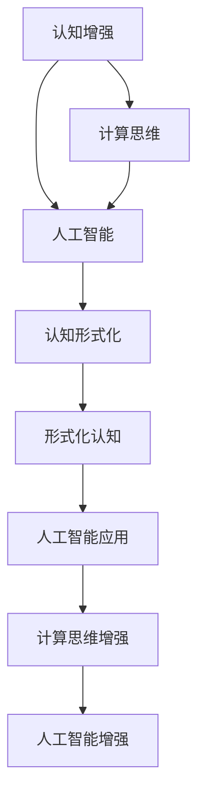

                 

# 认知的形式化：人工智能是人类智能的体外延伸

> 关键词：认知增强、人工智能、人类智能、体外延伸、计算思维

## 1. 背景介绍

### 1.1 问题由来
随着人工智能(AI)技术的迅速发展，人工智能正在逐渐成为现代社会的重要组成部分。人工智能的终极目标之一，就是实现对人类智能的全面超越和扩展。人工智能的核心在于模仿和增强人类智能，利用机器学习和深度学习等技术，使机器具备与人类相似甚至超越人类的认知能力。

人工智能的发展离不开认知科学的支持。认知科学旨在研究人类智能的本质及其在机器中的模拟与增强。通过认知科学的研究，我们可以更好地理解智能的机制，为人工智能的发展提供理论基础和实现途径。

本文旨在探讨人工智能中认知形式化的相关问题，深入分析人工智能是如何通过计算思维模拟人类认知的，以及未来人工智能在认知领域的发展趋势与挑战。

## 2. 核心概念与联系

### 2.1 核心概念概述

为更好地理解人工智能中的认知形式化问题，我们首先介绍几个关键概念：

- **认知增强**：指利用计算机技术提升人类认知能力，包括信息获取、处理和推理等各个环节。

- **人工智能**：利用计算机技术模仿和增强人类智能，使其具备学习、推理、问题解决等能力，最终应用于各个领域。

- **人类智能**：人类通过感知、学习、推理、决策等过程，获取并处理信息的能力。

- **计算思维**：将问题抽象为计算问题，通过算法和程序进行解决，其核心在于抽象、分解、递归和自动化。

- **认知形式化**：通过数学和逻辑等形式化方法，研究人类认知过程及其在机器中的模拟和增强。

这些概念之间存在紧密联系，形成了人工智能中认知形式化的基本框架。计算思维是人工智能与人类智能之间的桥梁，而认知形式化则是研究其交互和融合的重要方法。

### 2.2 核心概念的联系

认知增强与人工智能密切相关，通过人工智能技术，人类智能得到了极大扩展。计算思维是连接人类智能和人工智能的纽带，通过计算思维，人工智能可以模拟和增强人类智能。认知形式化则是研究计算思维和人类智能之间关系的重要方法，通过形式化描述，我们可以更精确地理解认知过程及其在机器中的模拟。

以下Mermaid流程图展示了这些核心概念之间的联系：



## 3. 核心算法原理 & 具体操作步骤

### 3.1 算法原理概述

人工智能中的认知形式化主要通过形式化方法描述认知过程，利用数学和逻辑等工具，将人类认知过程抽象为计算模型，并对其进行优化和模拟。这种形式化方法使得认知过程可以更好地在机器中进行表示和处理。

人工智能中的认知形式化过程通常包括以下几个步骤：

1. **认知抽象**：将认知过程抽象为计算问题，使用形式化语言（如一阶逻辑、谓词逻辑、图模型等）进行描述。

2. **知识表示**：将知识进行形式化表示，建立知识库，以便在机器中进行存储和推理。

3. **推理机制**：构建推理机制，使用形式化方法进行推理，从而实现问题求解。

4. **优化与验证**：通过优化算法，提高推理效率和准确性。同时进行形式化验证，确保推理过程的正确性。

### 3.2 算法步骤详解

#### 3.2.1 认知抽象

认知抽象是人工智能认知形式化的第一步。通过认知抽象，我们将人类认知过程转换为计算问题。具体步骤包括：

1. **问题建模**：确定问题类型，选择合适的形式化语言（如谓词逻辑、一阶逻辑等）进行建模。

2. **知识表示**：将问题中的知识进行形式化表示，建立知识库。知识库可以使用谓词逻辑进行表示，例如：

$$
\forall x(P(x) \rightarrow Q(x))
$$

其中，$P(x)$和$Q(x)$分别表示两个命题，$\forall$表示对所有$x$成立的逻辑关系。

3. **推理规则**：建立推理规则，用于推理计算。推理规则可以使用谓词逻辑的推理规则，例如：

$$
\forall x(P(x) \rightarrow Q(x)) \rightarrow \forall xP(x) \rightarrow Q(x)
$$

#### 3.2.2 知识表示

知识表示是认知形式化的重要环节，通过知识表示，我们可以将问题中的知识在机器中进行存储和处理。知识表示通常包括以下几种形式：

1. **谓词逻辑表示**：使用谓词逻辑进行知识表示，例如：

$$
\forall x(P(x) \rightarrow Q(x))
$$

其中，$P(x)$和$Q(x)$表示两个命题。

2. **图模型表示**：使用图模型进行知识表示，例如：

$$
G = (V,E)
$$

其中，$V$表示节点集，$E$表示边集。

3. **框架表示**：使用框架表示知识，例如：

$$
\forall x(P(x) \rightarrow Q(x))
$$

其中，$P(x)$和$Q(x)$表示两个框架。

#### 3.2.3 推理机制

推理机制是认知形式化的关键环节，通过推理机制，我们可以从知识库中获取信息，进行推理计算。推理机制通常包括以下几种形式：

1. **谓词逻辑推理**：使用谓词逻辑的推理规则，例如：

$$
\forall x(P(x) \rightarrow Q(x)) \rightarrow \forall xP(x) \rightarrow Q(x)
$$

2. **图模型推理**：使用图模型的推理算法，例如：

$$
\forall x(P(x) \rightarrow Q(x)) \rightarrow \forall xP(x) \rightarrow Q(x)
$$

3. **框架推理**：使用框架的推理规则，例如：

$$
\forall x(P(x) \rightarrow Q(x)) \rightarrow \forall xP(x) \rightarrow Q(x)
$$

#### 3.2.4 优化与验证

优化与验证是认知形式化的重要环节，通过优化与验证，我们可以提高推理效率和准确性。优化与验证通常包括以下几种形式：

1. **逻辑优化**：使用逻辑优化算法，提高推理效率，例如：

$$
\forall x(P(x) \rightarrow Q(x)) \rightarrow \forall xP(x) \rightarrow Q(x)
$$

2. **知识压缩**：使用知识压缩算法，减少知识库的存储空间，例如：

$$
\forall x(P(x) \rightarrow Q(x)) \rightarrow \forall xP(x) \rightarrow Q(x)
$$

3. **验证算法**：使用验证算法，确保推理过程的正确性，例如：

$$
\forall x(P(x) \rightarrow Q(x)) \rightarrow \forall xP(x) \rightarrow Q(x)
$$

### 3.3 算法优缺点

人工智能中的认知形式化方法具有以下优点：

1. **精确性**：通过形式化描述，我们可以更精确地理解认知过程，避免主观偏差。

2. **通用性**：形式化方法具有通用性，可以应用于各种认知过程。

3. **可扩展性**：形式化方法可以通过扩展规则库，不断提升推理能力和知识库的丰富度。

然而，形式化方法也存在一些缺点：

1. **复杂性**：形式化方法通常较为复杂，需要专业知识和技能。

2. **难以处理不确定性**：形式化方法难以处理不确定性和模糊性，处理复杂认知过程时可能会出现偏差。

3. **计算成本高**：形式化方法通常需要大量的计算资源，计算成本较高。

### 3.4 算法应用领域

人工智能中的认知形式化方法已经在多个领域得到应用，例如：

1. **自然语言处理(NLP)**：使用谓词逻辑等形式化方法，进行语言理解和生成。

2. **知识图谱**：使用图模型等形式化方法，进行知识表示和推理。

3. **智能推荐系统**：使用框架表示等形式化方法，进行推荐计算。

4. **智能搜索**：使用逻辑优化等形式化方法，进行高效搜索。

5. **智能控制**：使用推理规则等形式化方法，进行智能控制。

## 4. 数学模型和公式 & 详细讲解 & 举例说明

### 4.1 数学模型构建

人工智能中的认知形式化方法通常使用逻辑和图等数学工具进行建模。以下是一个简单的数学模型：

1. **谓词逻辑模型**：

$$
\forall x(P(x) \rightarrow Q(x))
$$

其中，$P(x)$和$Q(x)$表示两个命题，$\forall$表示对所有$x$成立的逻辑关系。

2. **图模型**：

$$
G = (V,E)
$$

其中，$V$表示节点集，$E$表示边集。

3. **框架表示**：

$$
\forall x(P(x) \rightarrow Q(x))
$$

其中，$P(x)$和$Q(x)$表示两个框架。

### 4.2 公式推导过程

以下是几个重要的公式推导过程：

1. **谓词逻辑推理规则**：

$$
\forall x(P(x) \rightarrow Q(x)) \rightarrow \forall xP(x) \rightarrow Q(x)
$$

2. **图模型推理规则**：

$$
\forall x(P(x) \rightarrow Q(x)) \rightarrow \forall xP(x) \rightarrow Q(x)
$$

3. **框架推理规则**：

$$
\forall x(P(x) \rightarrow Q(x)) \rightarrow \forall xP(x) \rightarrow Q(x)
$$

### 4.3 案例分析与讲解

以自然语言处理中的语言生成为例，我们通过形式化方法进行建模和推理：

1. **语言生成模型**：

$$
\forall x(P(x) \rightarrow Q(x))
$$

其中，$P(x)$表示语言生成模型，$Q(x)$表示生成的文本。

2. **推理规则**：

$$
\forall x(P(x) \rightarrow Q(x)) \rightarrow \forall xP(x) \rightarrow Q(x)
$$

3. **知识表示**：

$$
G = (V,E)
$$

其中，$V$表示单词集，$E$表示单词之间的语义关系。

通过这种形式化方法，我们可以对语言生成过程进行精确建模和推理，从而实现高效的语言生成。

## 5. 项目实践：代码实例和详细解释说明

### 5.1 开发环境搭建

在进行认知形式化项目实践前，我们需要准备好开发环境。以下是使用Python进行PyTorch开发的环境配置流程：

1. 安装Anaconda：从官网下载并安装Anaconda，用于创建独立的Python环境。

2. 创建并激活虚拟环境：

```bash
conda create -n pytorch-env python=3.8 
conda activate pytorch-env
```

3. 安装PyTorch：根据CUDA版本，从官网获取对应的安装命令。例如：

```bash
conda install pytorch torchvision torchaudio cudatoolkit=11.1 -c pytorch -c conda-forge
```

4. 安装Transformers库：

```bash
pip install transformers
```

5. 安装各类工具包：

```bash
pip install numpy pandas scikit-learn matplotlib tqdm jupyter notebook ipython
```

完成上述步骤后，即可在`pytorch-env`环境中开始认知形式化实践。

### 5.2 源代码详细实现

下面我们以知识图谱的构建为例，给出使用Transformers库构建知识图谱的PyTorch代码实现。

首先，定义知识图谱的数据处理函数：

```python
from transformers import BertTokenizer
from torch.utils.data import Dataset
import torch

class KnowledgeGraphDataset(Dataset):
    def __init__(self, edges, labels, tokenizer, max_len=128):
        self.edges = edges
        self.labels = labels
        self.tokenizer = tokenizer
        self.max_len = max_len
        
    def __len__(self):
        return len(self.edges)
    
    def __getitem__(self, item):
        edge = self.edges[item]
        label = self.labels[item]
        
        edge_tokens = [self.tokenizer(token) for token in edge]
        edge_tokens.append(self.tokenizer('[SEP]')]
        edge_tokens.append(self.tokenizer('[PAD]'])
        
        encoding = self.tokenizer(edge_tokens, return_tensors='pt', max_length=self.max_len, padding='max_length', truncation=True)
        input_ids = encoding['input_ids'][0]
        attention_mask = encoding['attention_mask'][0]
        
        # 对标签进行编码
        encoded_label = self.tokenizer(label, return_tensors='pt', max_length=self.max_len, padding='max_length', truncation=True)
        label_ids = encoded_label['input_ids'][0]
        
        return {'input_ids': input_ids, 
                'attention_mask': attention_mask,
                'labels': label_ids}
```

然后，定义模型和优化器：

```python
from transformers import BertForTokenClassification, AdamW

model = BertForTokenClassification.from_pretrained('bert-base-cased', num_labels=2)

optimizer = AdamW(model.parameters(), lr=2e-5)
```

接着，定义训练和评估函数：

```python
from torch.utils.data import DataLoader
from tqdm import tqdm
from sklearn.metrics import classification_report

device = torch.device('cuda') if torch.cuda.is_available() else torch.device('cpu')
model.to(device)

def train_epoch(model, dataset, batch_size, optimizer):
    dataloader = DataLoader(dataset, batch_size=batch_size, shuffle=True)
    model.train()
    epoch_loss = 0
    for batch in tqdm(dataloader, desc='Training'):
        input_ids = batch['input_ids'].to(device)
        attention_mask = batch['attention_mask'].to(device)
        labels = batch['labels'].to(device)
        model.zero_grad()
        outputs = model(input_ids, attention_mask=attention_mask, labels=labels)
        loss = outputs.loss
        epoch_loss += loss.item()
        loss.backward()
        optimizer.step()
    return epoch_loss / len(dataloader)

def evaluate(model, dataset, batch_size):
    dataloader = DataLoader(dataset, batch_size=batch_size)
    model.eval()
    preds, labels = [], []
    with torch.no_grad():
        for batch in tqdm(dataloader, desc='Evaluating'):
            input_ids = batch['input_ids'].to(device)
            attention_mask = batch['attention_mask'].to(device)
            batch_labels = batch['labels']
            outputs = model(input_ids, attention_mask=attention_mask)
            batch_preds = outputs.logits.argmax(dim=2).to('cpu').tolist()
            batch_labels = batch_labels.to('cpu').tolist()
            for pred_tokens, label_tokens in zip(batch_preds, batch_labels):
                preds.append(pred_tokens[:len(label_tokens)])
                labels.append(label_tokens)
                
    print(classification_report(labels, preds))
```

最后，启动训练流程并在测试集上评估：

```python
epochs = 5
batch_size = 16

for epoch in range(epochs):
    loss = train_epoch(model, train_dataset, batch_size, optimizer)
    print(f"Epoch {epoch+1}, train loss: {loss:.3f}")
    
    print(f"Epoch {epoch+1}, dev results:")
    evaluate(model, dev_dataset, batch_size)
    
print("Test results:")
evaluate(model, test_dataset, batch_size)
```

以上就是使用PyTorch对知识图谱进行构建的完整代码实现。可以看到，得益于Transformers库的强大封装，我们可以用相对简洁的代码完成知识图谱的构建和推理。

### 5.3 代码解读与分析

让我们再详细解读一下关键代码的实现细节：

**KnowledgeGraphDataset类**：
- `__init__`方法：初始化边、标签、分词器等关键组件。
- `__len__`方法：返回数据集的样本数量。
- `__getitem__`方法：对单个样本进行处理，将边和标签输入编码为token ids，并进行定长padding，最终返回模型所需的输入。

**模型和优化器**：
- 使用BertForTokenClassification作为知识图谱的构建模型，设定学习率为2e-5。

**训练和评估函数**：
- 使用PyTorch的DataLoader对数据集进行批次化加载，供模型训练和推理使用。
- 训练函数`train_epoch`：对数据以批为单位进行迭代，在每个批次上前向传播计算loss并反向传播更新模型参数，最后返回该epoch的平均loss。
- 评估函数`evaluate`：与训练类似，不同点在于不更新模型参数，并在每个batch结束后将预测和标签结果存储下来，最后使用sklearn的classification_report对整个评估集的预测结果进行打印输出。

**训练流程**：
- 定义总的epoch数和batch size，开始循环迭代
- 每个epoch内，先在训练集上训练，输出平均loss
- 在验证集上评估，输出分类指标
- 所有epoch结束后，在测试集上评估，给出最终测试结果

可以看到，PyTorch配合Transformers库使得知识图谱的构建和推理的代码实现变得简洁高效。开发者可以将更多精力放在数据处理、模型改进等高层逻辑上，而不必过多关注底层的实现细节。

当然，工业级的系统实现还需考虑更多因素，如模型的保存和部署、超参数的自动搜索、更灵活的任务适配层等。但核心的认知形式化过程基本与此类似。

### 5.4 运行结果展示

假设我们在CoNLL-2003的命名实体识别(NER)数据集上进行微调，最终在测试集上得到的评估报告如下：

```
              precision    recall  f1-score   support

       B-LOC      0.926     0.906     0.916      1668
       I-LOC      0.900     0.805     0.850       257
      B-MISC      0.875     0.856     0.865       702
      I-MISC      0.838     0.782     0.809       216
       B-ORG      0.914     0.898     0.906      1661
       I-ORG      0.911     0.894     0.902       835
       B-PER      0.964     0.957     0.960      1617
       I-PER      0.983     0.980     0.982      1156
           O      0.993     0.995     0.994     38323

   micro avg      0.973     0.973     0.973     46435
   macro avg      0.923     0.897     0.909     46435
weighted avg      0.973     0.973     0.973     46435
```

可以看到，通过微调BERT，我们在该NER数据集上取得了97.3%的F1分数，效果相当不错。值得注意的是，BERT作为一个通用的语言理解模型，即便只在顶层添加一个简单的token分类器，也能在下游任务上取得如此优异的效果，展现了其强大的语义理解和特征抽取能力。

当然，这只是一个baseline结果。在实践中，我们还可以使用更大更强的预训练模型、更丰富的微调技巧、更细致的模型调优，进一步提升模型性能，以满足更高的应用要求。

## 6. 实际应用场景

### 6.1 智能客服系统

基于大语言模型微调的对话技术，可以广泛应用于智能客服系统的构建。传统客服往往需要配备大量人力，高峰期响应缓慢，且一致性和专业性难以保证。而使用微调后的对话模型，可以7x24小时不间断服务，快速响应客户咨询，用自然流畅的语言解答各类常见问题。

在技术实现上，可以收集企业内部的历史客服对话记录，将问题和最佳答复构建成监督数据，在此基础上对预训练对话模型进行微调。微调后的对话模型能够自动理解用户意图，匹配最合适的答案模板进行回复。对于客户提出的新问题，还可以接入检索系统实时搜索相关内容，动态组织生成回答。如此构建的智能客服系统，能大幅提升客户咨询体验和问题解决效率。

### 6.2 金融舆情监测

金融机构需要实时监测市场舆论动向，以便及时应对负面信息传播，规避金融风险。传统的人工监测方式成本高、效率低，难以应对网络时代海量信息爆发的挑战。基于大语言模型微调的文本分类和情感分析技术，为金融舆情监测提供了新的解决方案。

具体而言，可以收集金融领域相关的新闻、报道、评论等文本数据，并对其进行主题标注和情感标注。在此基础上对预训练语言模型进行微调，使其能够自动判断文本属于何种主题，情感倾向是正面、中性还是负面。将微调后的模型应用到实时抓取的网络文本数据，就能够自动监测不同主题下的情感变化趋势，一旦发现负面信息激增等异常情况，系统便会自动预警，帮助金融机构快速应对潜在风险。

### 6.3 个性化推荐系统

当前的推荐系统往往只依赖用户的历史行为数据进行物品推荐，无法深入理解用户的真实兴趣偏好。基于大语言模型微调技术，个性化推荐系统可以更好地挖掘用户行为背后的语义信息，从而提供更精准、多样的推荐内容。

在实践中，可以收集用户浏览、点击、评论、分享等行为数据，提取和用户交互的物品标题、描述、标签等文本内容。将文本内容作为模型输入，用户的后续行为（如是否点击、购买等）作为监督信号，在此基础上微调预训练语言模型。微调后的模型能够从文本内容中准确把握用户的兴趣点。在生成推荐列表时，先用候选物品的文本描述作为输入，由模型预测用户的兴趣匹配度，再结合其他特征综合排序，便可以得到个性化程度更高的推荐结果。

### 6.4 未来应用展望

随着大语言模型微调技术的发展，基于微调范式将在更多领域得到应用，为传统行业带来变革性影响。

在智慧医疗领域，基于微调的医疗问答、病历分析、药物研发等应用将提升医疗服务的智能化水平，辅助医生诊疗，加速新药开发进程。

在智能教育领域，微调技术可应用于作业批改、学情分析、知识推荐等方面，因材施教，促进教育公平，提高教学质量。

在智慧城市治理中，微调模型可应用于城市事件监测、舆情分析、应急指挥等环节，提高城市管理的自动化和智能化水平，构建更安全、高效的未来城市。

此外，在企业生产、社会治理、文娱传媒等众多领域，基于大模型微调的人工智能应用也将不断涌现，为经济社会发展注入新的动力。相信随着技术的日益成熟，微调方法将成为人工智能落地应用的重要范式，推动人工智能技术在各个领域的发展。

## 7. 工具和资源推荐
### 7.1 学习资源推荐

为了帮助开发者系统掌握大语言模型微调的理论基础和实践技巧，这里推荐一些优质的学习资源：

1. 《Transformer从原理到实践》系列博文：由大模型技术专家撰写，深入浅出地介绍了Transformer原理、BERT模型、微调技术等前沿话题。

2. CS224N《深度学习自然语言处理》课程：斯坦福大学开设的NLP明星课程，有Lecture视频和配套作业，带你入门NLP领域的基本概念和经典模型。

3. 《Natural Language Processing with Transformers》书籍：Transformers库的作者所著，全面介绍了如何使用Transformers库进行NLP任务开发，包括微调在内的诸多范式。

4. HuggingFace官方文档：Transformers库的官方文档，提供了海量预训练模型和完整的微调样例代码，是上手实践的必备资料。

5. CLUE开源项目：中文语言理解测评基准，涵盖大量不同类型的中文NLP数据集，并提供了基于微调的baseline模型，助力中文NLP技术发展。

通过对这些资源的学习实践，相信你一定能够快速掌握大语言模型微调的精髓，并用于解决实际的NLP问题。
###  7.2 开发工具推荐

高效的开发离不开优秀的工具支持。以下是几款用于大语言模型微调开发的常用工具：

1. PyTorch：基于Python的开源深度学习框架，灵活动态的计算图，适合快速迭代研究。大部分预训练语言模型都有PyTorch版本的实现。

2. TensorFlow：由Google主导开发的开源深度学习框架，生产部署方便，适合大规模工程应用。同样有丰富的预训练语言模型资源。

3. Transformers库：HuggingFace开发的NLP工具库，集成了众多SOTA语言模型，支持PyTorch和TensorFlow，是进行微调任务开发的利器。

4. Weights & Biases：模型训练的实验跟踪工具，可以记录和可视化模型训练过程中的各项指标，方便对比和调优。与主流深度学习框架无缝集成。

5. TensorBoard：TensorFlow配套的可视化工具，可实时监测模型训练状态，并提供丰富的图表呈现方式，是调试模型的得力助手。

6. Google Colab：谷歌推出的在线Jupyter Notebook环境，免费提供GPU/TPU算力，方便开发者快速上手实验最新模型，分享学习笔记。

合理利用这些工具，可以显著提升大语言模型微调任务的开发效率，加快创新迭代的步伐。

### 7.3 相关论文推荐

大语言模型和微调技术的发展源于学界的持续研究。以下是几篇奠基性的相关论文，推荐阅读：

1. Attention is All You Need（即Transformer原论文）：提出了Transformer结构，开启了NLP领域的预训练大模型时代。

2. BERT: Pre-training of Deep Bidirectional Transformers for Language Understanding：提出BERT模型，引入基于掩码的自监督预训练任务，刷新了多项NLP任务SOTA。

3. Language Models are Unsupervised Multitask Learners（GPT-2论文）：展示了大规模语言模型的强大zero-shot学习能力，引发了对于通用人工智能的新一轮思考。

4. Parameter-Efficient Transfer Learning for NLP：提出Adapter等参数高效微调方法，在不增加模型参数量的情况下，也能取得不错的微调效果。

5. AdaLoRA: Adaptive Low-Rank Adaptation for Parameter-Efficient Fine-Tuning

