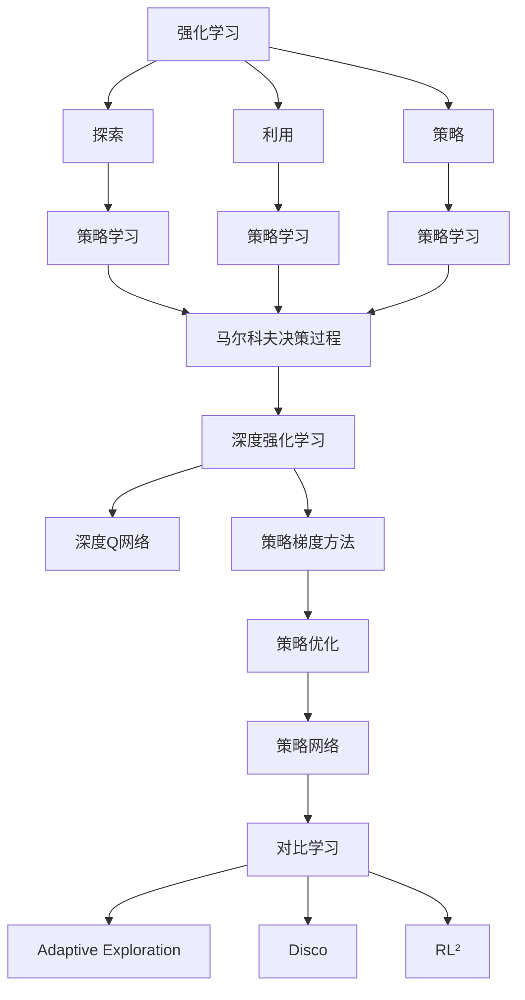
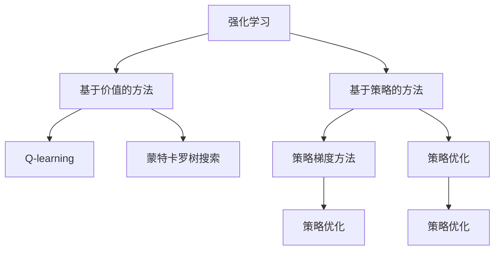
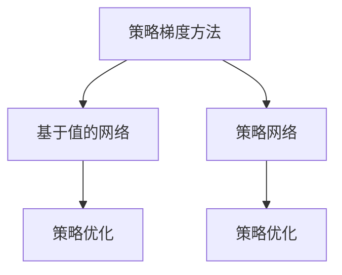
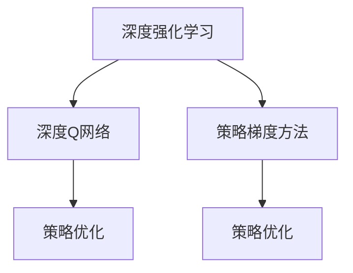
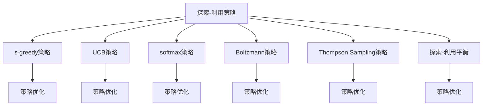
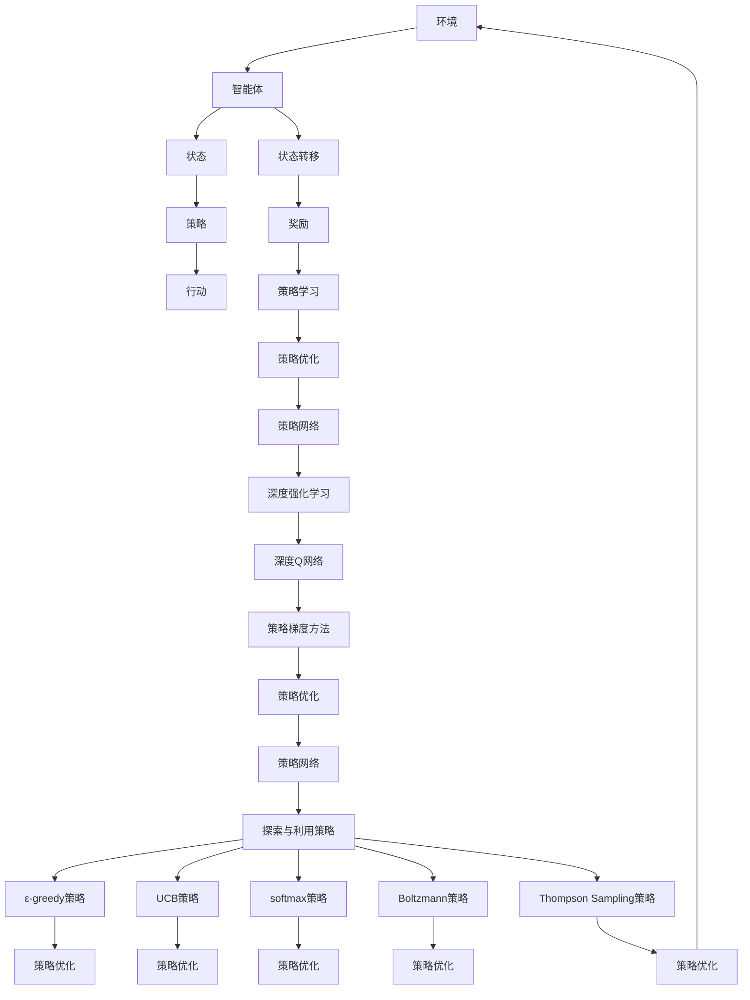

                 

# 强化学习Reinforcement Learning探索与利用策略深度剖析

> 关键词：强化学习,探索,利用策略,策略学习,马尔科夫决策过程,深度强化学习,AlphaGo,探索-利用困境,Deep Q-Network,策略梯度方法,策略优化,策略网络,对比学习,Adaptive Exploration,Disco,RL²

## 1. 背景介绍

### 1.1 问题由来
强化学习(Reinforcement Learning, RL)作为一种行为学习机制，在人工智能、机器人学、游戏智能等领域具有广泛应用。其核心思想是通过与环境的交互，让智能体自主学习如何制定策略，以最大化长期奖励。强化学习不同于监督学习(需要大量标注数据)和无监督学习(数据无需标注)，其目标是让智能体在未知环境中逐步学会最优行动策略，在不断试错中提升绩效。

强化学习包括策略学习、环境建模和奖励函数设计等多个关键组件。在策略学习方面，有两种主要方法：基于价值的方法和基于策略的方法。其中，策略学习算法如策略梯度、策略优化等，通过直接优化策略，逐步获得最优策略。本节将对强化学习的核心概念进行详细阐述，特别是探索与利用策略，及其在实际应用中的深入剖析。

### 1.2 问题核心关键点
探索与利用策略在强化学习中起着至关重要的作用。智能体需要在当前状态下做出行动决策，而这一决策过程受到当前状态值（即利用已知的先验信息）和探索未知状态值（即探索新状态）的冲突影响。探索可以带来新信息，有助于智能体获取更好的策略，但同时也会引入更多噪声，导致性能波动。利用已知信息可以更快获得确定性收益，但难以进一步提升性能。探索与利用之间的平衡，是强化学习中最为核心的挑战之一。

有效的探索与利用策略能够帮助智能体在不同状态下做出合理决策，平衡风险与收益，最终最大化长期奖励。选择合适的探索与利用策略是强化学习算法的关键。

### 1.3 问题研究意义
强化学习探索与利用策略的研究，对于推动智能体在未知复杂环境中自主学习和适应至关重要：

1. 提升智能体决策能力：通过合理的探索策略，智能体能够在未经历的状态空间中获取更多信息，从而提高决策质量和精准性。
2. 加速学习进程：有效的利用策略可以使智能体迅速适应当前环境，快速收敛到最优策略。
3. 规避学习瓶颈：探索策略可以克服学习过程中可能出现的局部最优解，引导智能体跳出“局部最优”误区。
4. 增强泛化能力：通过探索新信息，智能体能够在更多不同场景中表现出稳定的适应性。
5. 提高鲁棒性：多样化的探索策略可以帮助智能体更好地应对外部环境的变化，增强系统的稳定性。

在智能搜索、机器人控制、自动化交易、游戏AI等领域，探索与利用策略的优化是提升系统性能和智能度的重要手段。未来研究将进一步探索多样化的探索策略，推动强化学习算法在更复杂场景中的高效应用。

## 2. 核心概念与联系

### 2.1 核心概念概述

为了更好地理解强化学习中的探索与利用策略，本节将介绍几个密切相关的核心概念：

- 强化学习(Reinforcement Learning)：智能体通过与环境的交互，学习如何做出最优决策，以最大化长期奖励。
- 探索(Exploration)：智能体在未知状态下尝试新行动，以获取新信息。
- 利用(Exploitation)：智能体在已知状态下利用已知信息，做出确定性最优决策。
- 策略(Strategy)：智能体在每个状态下做出的行动决策序列。
- 策略学习(Strategy Learning)：通过优化策略，使智能体在当前状态下做出最优决策。
- 马尔科夫决策过程(Markov Decision Process, MDP)：用于描述强化学习环境的数学模型，包括状态、行动、状态转移概率和奖励。
- 深度强化学习(Deep Reinforcement Learning)：结合深度学习与强化学习，利用神经网络进行状态表示和策略学习。
- 探索-利用困境(Ericsson's Exploitation and Exploration Dilemma)：智能体在当前状态下选择利用已知信息还是探索未知信息的决策难题。
- 策略网络(Actor-Critic Network)：结合策略和价值网络，共同优化智能体的行动决策。
- 深度Q网络(Deep Q-Network, DQN)：基于深度学习的Q值函数优化方法。
- 策略梯度方法(Strategy Gradient Methods)：直接优化策略的强化学习算法。
- 对比学习(Contrastive Learning)：通过对比不同样本之间的差异，提升智能体的学习效果。
- Adaptive Exploration：自适应探索策略，根据环境特性和智能体当前状态自动调整探索程度。
- Disco：一种自适应探索方法，通过调整参数探索不同策略。
- RL²：一种基于策略的强化学习算法，强调探索与利用之间的平衡。

这些核心概念之间存在紧密的联系，构成了强化学习探索与利用策略的基础理论框架。下面通过Mermaid流程图展示这些概念之间的关系：



这个流程图展示了一系列核心概念之间的关系：

1. 强化学习是探索和利用的基本框架，旨在通过环境交互不断优化策略。
2. 探索和利用是策略学习的重要组成部分，通过平衡二者提升智能体性能。
3. 策略学习包括多种算法，通过直接优化策略或价值函数实现。
4. 策略学习在MDP模型中得以实现，并结合深度学习优化策略网络。
5. 策略梯度方法直接优化策略，是探索与利用策略的核心算法。
6. 深度Q网络是常见的策略优化方法，通过优化Q值函数实现。
7. 对比学习是提升探索策略的常用方法，通过对比不同样本的相似度来优化。
8. Adaptive Exploration、Disco、RL²等方法在探索策略中得到广泛应用，不断优化智能体的行为决策。

这些概念共同构成了强化学习探索与利用策略的理论基础，为实际应用提供了方法和技术指导。

### 2.2 概念间的关系

这些核心概念之间存在着紧密的联系，形成了强化学习探索与利用策略的完整生态系统。下面通过多个Mermaid流程图来展示这些概念之间的关系。

#### 2.2.1 强化学习范式



这个流程图展示了强化学习的两种主要范式：基于价值的方法和基于策略的方法。基于价值的方法如Q-learning和蒙特卡罗树搜索，通过优化价值函数实现；基于策略的方法如策略梯度方法和策略优化，通过直接优化策略实现。

#### 2.2.2 策略梯度方法



这个流程图展示了策略梯度方法的两种主要网络结构：基于值的网络和策略网络。基于值的网络通过优化Q值函数实现策略优化，而策略网络直接优化策略函数，实现策略优化。

#### 2.2.3 深度强化学习



这个流程图展示了深度强化学习的主要网络结构：深度Q网络和策略梯度方法。深度Q网络通过优化Q值函数实现策略优化，而策略梯度方法直接优化策略函数，实现策略优化。

#### 2.2.4 探索与利用策略



这个流程图展示了探索与利用策略的主要方法：ε-greedy策略、UCB策略、softmax策略、Boltzmann策略和Thompson Sampling策略。这些策略在实际应用中，通过优化策略函数实现策略优化，从而达到探索与利用平衡。

### 2.3 核心概念的整体架构

最后，我们用一个综合的流程图来展示这些核心概念在大规模强化学习探索与利用策略中的整体架构：



这个综合流程图展示了从环境到智能体的全过程，强调了探索与利用策略在大规模强化学习中的核心地位。智能体通过优化策略，结合环境状态和奖励信息，不断调整行动决策，以最大化长期奖励。

## 3. 核心算法原理 & 具体操作步骤
### 3.1 算法原理概述

强化学习的探索与利用策略，其核心在于智能体如何平衡当前状态下的行动决策，既能够探索新状态获取新信息，又能够利用已知信息快速收敛。这一过程涉及多个关键组件：

1. **策略函数**：智能体在每个状态下做出行动的策略函数，可以是一个映射函数 $A(s_t)$，表示在状态 $s_t$ 下采取行动 $a_t$ 的概率分布。
2. **值函数**：智能体在每个状态下评估当前行动的收益，可以是一个预测函数 $Q(s_t, a_t)$，表示在状态 $s_t$ 下采取行动 $a_t$ 的长期奖励。
3. **探索策略**：智能体在未经历的状态下选择探索新状态的策略，可以是一个概率分布 $e(s_t)$，表示在状态 $s_t$ 下以一定概率选择探索行动。
4. **利用策略**：智能体在已知状态下选择确定性最优行动的策略，可以是一个映射函数 $u(s_t)$，表示在状态 $s_t$ 下采取最优行动 $a_t$。

这些组件共同构成了一个智能体在每个状态下的决策框架，帮助智能体在探索与利用之间取得平衡。

### 3.2 算法步骤详解

强化学习探索与利用策略的优化，一般包括以下几个关键步骤：

**Step 1: 初始化策略和参数**

- 初始化策略函数 $A(s_t)$ 和值函数 $Q(s_t, a_t)$ 的参数。
- 设置探索策略 $e(s_t)$ 和利用策略 $u(s_t)$ 的参数。

**Step 2: 模拟环境交互**

- 从环境中抽取当前状态 $s_t$。
- 根据策略函数 $A(s_t)$ 和探索策略 $e(s_t)$，随机生成当前状态的行动 $a_t$。
- 执行行动 $a_t$，观察下一个状态 $s_{t+1}$ 和奖励 $r_t$。

**Step 3: 更新值函数和策略函数**

- 根据当前状态 $s_t$、行动 $a_t$、下一个状态 $s_{t+1}$ 和奖励 $r_t$，计算Q值 $Q(s_t, a_t)$。
- 根据Q值 $Q(s_t, a_t)$，更新值函数 $Q(s_t, a_t)$ 的参数。
- 根据当前状态 $s_t$ 和Q值 $Q(s_t, a_t)$，更新策略函数 $A(s_t)$ 的参数。

**Step 4: 探索与利用策略的调整**

- 根据当前状态 $s_t$ 和行动 $a_t$，计算Q值 $Q(s_t, a_t)$。
- 根据Q值 $Q(s_t, a_t)$，更新探索策略 $e(s_t)$ 和利用策略 $u(s_t)$ 的参数。
- 在策略优化中，通常采用梯度下降等优化算法更新策略函数的参数。

**Step 5: 参数更新**

- 根据当前状态 $s_t$ 和行动 $a_t$，计算Q值 $Q(s_t, a_t)$。
- 根据Q值 $Q(s_t, a_t)$，更新值函数 $Q(s_t, a_t)$ 的参数。
- 根据当前状态 $s_t$ 和Q值 $Q(s_t, a_t)$，更新策略函数 $A(s_t)$ 的参数。

**Step 6: 迭代训练**

- 重复Step 2至Step 5，直到训练收敛或达到预设的迭代次数。

### 3.3 算法优缺点

强化学习探索与利用策略具有以下优点：

1. 智能体可以在未知环境中通过探索获取新信息，提升决策质量。
2. 能够自动平衡当前状态下的行动决策，在探索和利用之间取得平衡。
3. 可以处理非线性、非平稳环境的决策问题，适应性强。

然而，这一方法也存在一定的局限性：

1. 探索策略的选择可能引入额外的噪声，影响智能体性能。
2. 需要大量计算资源和数据，在大规模问题中可能难以实现。
3. 在稀疏奖励和连续状态空间中，探索策略的优化存在难度。
4. 难以处理非马尔科夫决策过程，对环境的依赖性较强。

尽管存在这些局限性，强化学习的探索与利用策略在实际应用中仍然展示了强大的性能和灵活性。未来研究将继续探索更高效的探索策略，提升智能体的决策能力。

### 3.4 算法应用领域

强化学习探索与利用策略在多个领域具有广泛应用，主要包括：

1. **游戏智能**：如AlphaGo、AlphaStar等，通过智能体在复杂博弈环境中自学习最优策略。
2. **机器人控制**：通过强化学习，使机器人能够在未知环境中自主导航和操作。
3. **自动驾驶**：通过强化学习，使车辆在复杂交通场景中做出智能决策。
4. **金融交易**：通过强化学习，使智能体在股票市场中实现自动交易和风险控制。
5. **推荐系统**：通过强化学习，优化用户行为预测和推荐算法，提升用户体验。
6. **生物计算**：通过强化学习，优化生物信息学中的序列比对和结构预测。
7. **智能制造**：通过强化学习，优化生产过程和资源分配，提高生产效率。

强化学习的探索与利用策略，已成为解决复杂决策问题的强大工具，广泛应用于各个领域。

## 4. 数学模型和公式 & 详细讲解 & 举例说明

### 4.1 数学模型构建

强化学习的探索与利用策略，其核心在于通过优化策略函数和值函数，最大化长期奖励。记智能体在状态 $s_t$ 下采取行动 $a_t$ 的策略函数为 $A(s_t)$，在状态 $s_t$ 下采取行动 $a_t$ 的值函数为 $Q(s_t, a_t)$。

假设智能体在状态 $s_t$ 下采取行动 $a_t$ 的奖励为 $r_t$，下一个状态为 $s_{t+1}$，状态转移概率为 $P(s_{t+1}|s_t, a_t)$，则策略函数 $A(s_t)$ 和值函数 $Q(s_t, a_t)$ 的优化目标为：

$$
\min_{A, Q} \mathbb{E}\left[\sum_{t=0}^{\infty} \gamma^t r_t\right]
$$

其中 $\gamma$ 为折扣因子，控制长期奖励的权重。

### 4.2 公式推导过程

在强化学习中，常用的优化方法包括策略梯度方法和Q值学习方法。下面以策略梯度方法为例，推导其数学公式。

策略梯度方法通过优化策略函数 $A(s_t)$，使得智能体在每个状态下采取最优行动，从而最大化长期奖励。设智能体在状态 $s_t$ 下采取行动 $a_t$ 的策略函数为 $A(s_t)$，则策略梯度为：

$$
\frac{\partial \log A(s_t, a_t)}{\partial \theta}
$$

其中 $\theta$ 为策略函数的参数。

通过策略梯度，智能体在每个状态 $s_t$ 下采取行动 $a_t$ 的策略优化目标为：

$$
\max_{A(s_t)} \mathbb{E}\left[\frac{\partial \log A(s_t, a_t)}{\partial \theta}\right]
$$

根据上述公式，智能体在每个状态 $s_t$ 下采取行动 $a_t$ 的策略函数参数 $\theta$ 的更新公式为：

$$
\theta \leftarrow \theta + \eta \frac{\partial \log A(s_t, a_t)}{\partial \theta}
$$

其中 $\eta$ 为学习率，通过优化策略函数，智能体在每个状态 $s_t$ 下采取行动 $a_t$ 的概率分布会逐渐逼近最优策略。

### 4.3 案例分析与讲解

下面以AlphaGo为例，分析其探索与利用策略的实现。

AlphaGo在围棋博弈中，通过强化学习优化了其策略函数和值函数。在实际对弈中，AlphaGo通过以下步骤实现探索与利用：

1. 在当前状态下，利用深度神经网络计算当前状态下所有可能行动的Q值。
2. 根据Q值，选择当前状态下Q值最大的行动作为利用策略。
3. 在未经历的状态下，通过随机选择一定比例的行动进行探索，以获取新信息。
4. 在每个博弈中，AlphaGo不断根据对弈结果更新其策略函数和值函数。
5. 通过多次对弈和策略优化，AlphaGo逐步提高了其在围棋博弈中的决策能力。

在实际应用中，AlphaGo的探索与利用策略可以通过以下数学公式描述：

$$
A(s_t) = \frac{e(s_t) + u(s_t)}{e(s_t)}
$$

其中 $e(s_t)$ 为探索策略，$u(s_t)$ 为利用策略。AlphaGo在每个状态下，以 $e(s_t)$ 的概率选择探索新行动，以 $u(s_t)$ 的概率选择确定性最优行动。通过不断优化策略函数和值函数，AlphaGo能够在围棋博弈中取得卓越的性能。

## 5. 项目实践：代码实例和详细解释说明

### 5.1 开发环境搭建

在进行强化学习探索与利用策略的实践前，我们需要准备好开发环境。以下是使用Python进行TensorFlow进行强化学习开发的简单环境配置流程：

1. 安装Anaconda：从官网下载并安装Anaconda，用于创建独立的Python环境。

2. 创建并激活虚拟环境：
```bash
conda create -n tf-env python=3.8 
conda activate tf-env
```

3. 安装TensorFlow：
```bash
conda install tensorflow tensorflow-gpu
```

4. 安装相关库：
```bash
pip install gym
pip install numpy pandas matplotlib
```

完成上述步骤后，即可在`tf-env`环境中开始强化学习实践。

### 5.2 源代码详细实现

这里我们以Deep Q-Network为例，给出使用TensorFlow实现Q值优化的Python代码实现。

首先，定义Q值函数和目标函数：

```python
import tensorflow as tf

class QNetwork(tf.keras.Model):
    def __init__(self, state_dim, action_dim):
        super(QNetwork, self).__init__()
        self.fc1 = tf.keras.layers.Dense(128, activation='relu')
        self.fc2 = tf.keras.layers.Dense(128, activation='relu')
        self.fc3 = tf.keras.layers.Dense(action_dim, activation='linear')

    def call(self, state):
        x = self.fc1(state)
        x = self.fc2(x)
        return self.fc3(x)

class TargetQNetwork(tf.keras.Model):
    def __init__(self, state_dim, action_dim):
        super(TargetQNetwork, self).__init__()
        self.fc1 = tf.keras.layers.Dense(128, activation='relu')
        self.fc2 = tf.keras.layers.Dense(128, activation='relu')
        self.fc3 = tf.keras.layers.Dense(action_dim, activation='linear')

    def call(self, state):
        x = self.fc1(state)
        x = self.fc2(x)
        return self.fc3(x)

def q_value(state, q_net):
    q_value = q_net(state)
    return tf.reduce_mean(q_value, axis=1)

def target_q_value(state, target_q_net):
    target_q_value = target_q_net(state)
    return tf.reduce_mean(target_q_value, axis=1)

def q_loss(q_value, target_q_value):
    return tf.losses.mean_squared_error(target_q_value, q_value)

def build_nets(state_dim, action_dim):
    q_net = QNetwork(state_dim, action_dim)
    target_q_net = TargetQNetwork(state_dim, action_dim)
    return q_net, target_q_net

def update_target(q_net, target_q_net, target_update_rate=0.01):
    for target_param, param in zip(target_q_net.trainable_variables, q_net.trainable_variables):
        target_param.assign(target_param * target_update_rate + param * (1-target_update_rate))
```

然后，定义策略函数和探索策略：

```python
import numpy as np

def epsilon_greedy(q_value, state_dim, epsilon=0.1):
    actions = []
    for state in state_dim:
        if np.random.uniform() < epsilon:
            action = np.random.randint(action_dim)
        else:
            action = np.argmax(q_value)
        actions.append(action)
    return actions
```

接下来，定义训练函数和评估函数：

```python
def train(q_net, target_q_net, env, train_steps, batch_size, gamma=0.99, learning_rate=0.001):
    state_dim = env.observation_space.shape[0]
    action_dim = env.action_space.n

    q_value = q_value(env.state, q_net)
    target_q_value = target_q_value(env.state, target_q_net)

    for i in range(train_steps):
        actions = epsilon_greedy(q_value, state_dim)
        next_state, reward, done, _ = env.step(actions)
        next_q_value = q_value(next_state, q_net)
        target_q_value = reward + gamma * np.amax(target_q_value)
        q_value = q_value(env.state, q_net)
        target_q_value = target_q_value + (1-gamma) * np.amax(next_q_value)
        q_loss = q_loss(q_value, target_q_value)

        optimizer.apply_gradients(zip([tf.grad(q_loss, v) for v in q_net.trainable_variables], q_net.trainable_variables))
        if done:
            env.reset()

    return q_net

def evaluate(q_net, env, episodes):
    scores = []
    for _ in range(episodes):
        score = 0
        state = env.reset()
        done = False
        while not done:
            action = np.argmax(q_net(state))
            state, reward, done, _ = env.step(action)
            score += reward
        scores.append(score)
    return np.mean(scores)
```

最后，启动训练流程并在测试集上评估：

```python
state_dim = env.observation_space.shape[0]
action_dim = env.action_space.n

q_net, target_q_net = build_nets(state_dim, action_dim)
optimizer = tf.keras.optimizers.Adam(lr=learning_rate)

env = gym.make('CartPole-v0')
train(train_steps=1000, batch_size=32, q_net=q_net, target_q_net=target_q_net, env=env, gamma=gamma, learning_rate=learning_rate)

for episode in range(10):
    print(f"Episode {episode+1}: {evaluate(q_net, env, episodes=10)}")
```

以上就是使用TensorFlow实现Deep Q-Network的完整代码实现。可以看到，通过简单的代码实现，我们可以对强化学习的基本原理进行实践和验证。

### 5.3 代码解读与分析

让我们再详细解读一下关键代码的实现细节：

**QNetwork类**：
- 定义了深度神经网络的层结构，包括全连接层和输出层。

**q_value函数**：
- 计算当前状态下所有可能行动的Q值，并

