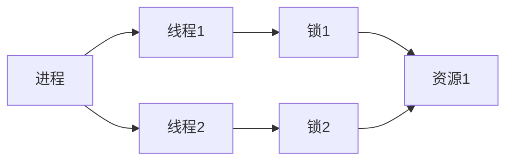

                 

## 1. 背景介绍

在当今高度依赖并行处理和高性能计算的互联网应用中，线程管理成为提高系统吞吐量的关键。无论是Web服务器、数据库管理系统，还是分布式计算框架，线程的管理和调度都是决定系统响应速度和稳定性的重要因素。然而，线程管理也带来了并发性、资源竞争和死锁等复杂问题，需要开发者具备深入的理解和技能。本文将全面介绍线程管理的核心概念、算法原理、具体操作步骤，并结合实际案例进行详细讲解，为开发高性能并行系统提供全面的技术指引。

## 2. 核心概念与联系

### 2.1 核心概念概述

为了更好地理解线程管理，我们首先需要了解一些基本概念：

- **线程（Thread）**：线程是操作系统调度执行的基本单位，可以理解为一个执行流程。每个线程独立拥有程序计数器、寄存器等执行环境。

- **进程（Process）**：进程是资源分配的基本单位，包含一个或多个线程，共享内存和资源。

- **上下文切换（Context Switching）**：进程/线程间切换执行状态的过程，涉及到保存当前线程状态，恢复其他线程状态，是系统调度和执行开销的主要来源。

- **锁（Lock）**：锁机制用于保护共享资源，防止并发访问和数据竞争。常见的锁包括互斥锁、读写锁、条件变量等。

- **死锁（Deadlock）**：多个进程/线程互相持有对方需要的资源，导致都无法继续执行，形成死锁状态。

这些概念通过以下Mermaid流程图紧密联系在一起，展示了线程管理的整体架构：



这个图展示了一个简单系统中，进程A创建了两个线程B和C，每个线程持有不同的锁，以访问不同的共享资源F。通过这种多线程并发控制，可以实现高效的资源利用和任务处理。

### 2.2 核心概念的关系

- **线程与进程**：进程是线程的容器，多个线程共享进程的资源。
- **上下文切换**：线程间的切换耗费时间和资源，需要避免频繁切换。
- **锁与死锁**：锁机制用于同步线程访问共享资源，但锁的使用不当可能导致死锁问题。

了解这些概念后，我们可以深入探讨线程管理的具体算法和操作方法。

## 3. 核心算法原理 & 具体操作步骤

### 3.1 算法原理概述

线程管理的主要目标是通过合理调度线程，最大化系统吞吐量，同时确保线程安全和资源合理利用。常见的线程管理算法包括：

- **轮询调度**：线程按照时间片轮流执行，适用于任务量较小、任务执行时间短的情况。
- **优先级调度**：根据线程优先级进行调度，高优先级线程优先执行，适用于重要任务需要优先完成的情况。
- **多级反馈队列**：将任务分为多个队列，每个队列设置不同的优先级，适用于需要支持不同类型任务的系统。
- **抢占式调度**：操作系统可以随时中断线程执行，分配给更高优先级的线程，适用于需要快速响应的事件驱动系统。

### 3.2 算法步骤详解

以**多级反馈队列调度**为例，详细讲解线程管理的步骤：

1. **创建队列**：根据系统需求创建多个优先级队列，不同队列的优先级不同。
2. **调度策略**：每个队列采用时间片轮询或抢占式调度策略。
3. **优先级调整**：根据任务执行情况动态调整线程优先级，低优先级线程进入高优先级队列。
4. **资源分配**：根据线程优先级分配CPU资源，高优先级线程优先执行。

### 3.3 算法优缺点

**多级反馈队列调度**的优点：

- 支持不同优先级任务的调度，灵活性高。
- 动态调整线程优先级，适应任务执行情况。

缺点：

- 调度算法实现复杂，需要维护多个队列和线程状态。
- 上下文切换频繁，可能影响系统响应速度。

**轮询调度的优点**：

- 实现简单，适用于任务量较小的情况。

缺点：

- 任务执行时间长时，线程等待时间长，效率低。

### 3.4 算法应用领域

线程管理算法在各种高性能计算和互联网应用中都有广泛应用：

- **Web服务器**：采用线程池技术，通过多线程并行处理HTTP请求，提高系统吞吐量。
- **数据库管理系统**：通过线程池管理数据库连接，减少连接建立和关闭的开销。
- **分布式计算框架**：使用线程调度器分配任务到不同计算节点，提高任务处理效率。

## 4. 数学模型和公式 & 详细讲解

### 4.1 数学模型构建

假设系统中有$n$个线程，每个线程的执行时间为$T_i$，系统调度器采用时间片轮询策略，每个时间片长度为$t$。系统总执行时间为$T$，则数学模型如下：

$$ T = \sum_{i=1}^n T_i + \sum_{i=1}^n (n-1) t $$

其中，$\sum_{i=1}^n T_i$是所有线程执行时间的总和，$\sum_{i=1}^n (n-1) t$是所有线程间的上下文切换时间总和。

### 4.2 公式推导过程

设每个线程的执行时间为$T_i$，系统时间片为$t$，则单个线程的执行周期$C_i = T_i + (n-1)t$。系统总执行周期为$T' = \sum_{i=1}^n C_i$。系统吞吐量为：

$$ P = \frac{T'}{T} $$

将$T'$代入公式，并利用上文提到的数学模型，推导出：

$$ P = \frac{\sum_{i=1}^n (T_i + (n-1)t)}{\sum_{i=1}^n T_i + (n-1)t} $$

简化得到：

$$ P = \frac{1}{n} + \frac{(n-1)t}{\sum_{i=1}^n T_i + (n-1)t} $$

可以看出，吞吐量$P$随线程数$n$的增加而减小，且与任务执行时间分布有关。

### 4.3 案例分析与讲解

以**Web服务器线程池**为例，分析线程管理对系统吞吐量的影响。

假设服务器响应每个请求需要$T_i$时间，系统有$n$个线程处理请求，时间片$t$设置为100ms。每个请求到达服务器后，系统会分配一个线程进行处理，并在处理完成后将线程返回池中。

在计算吞吐量时，需要考虑两个因素：线程数$n$和请求处理时间分布$T_i$。

- **固定线程数**：在$n$固定的情况下，系统吞吐量与请求处理时间分布密切相关。请求处理时间分布越均匀，吞吐量越高。
- **动态线程数**：通过调整线程数$n$，可以在请求量波动时保持高吞吐量。当请求量增加时，增加线程数；当请求量减少时，减少线程数。

## 5. 项目实践：代码实例和详细解释说明

### 5.1 开发环境搭建

搭建Python开发环境，并使用Django框架开发Web服务器线程池示例：

```bash
pip install django
```

创建一个Django项目和应用：

```bash
django-admin startproject thread_pool
cd thread_pool
python manage.py startapp thread_handler
```

### 5.2 源代码详细实现

在`thread_handler/views.py`文件中实现线程池：

```python
from django.http import HttpResponse
import threading

class ThreadPoolView(threading.Thread):
    def __init__(self, request):
        super().__init__()
        self.request = request
        self.id = request.GET.get('id', 0)
    
    def run(self):
        # 执行任务
        print(f"Thread {self.id} started.")
        # 模拟耗时操作
        import time
        time.sleep(2)
        print(f"Thread {self.id} completed.")

def thread_pool(request):
    # 创建多个线程
    threads = [ThreadPoolView(request) for _ in range(int(request.GET.get('size', 10)))]
    for t in threads:
        t.start()
    # 等待所有线程完成
    for t in threads:
        t.join()
    return HttpResponse("Done.")
```

### 5.3 代码解读与分析

- **创建线程**：通过`ThreadPoolView`类继承自`threading.Thread`，在`__init__`方法中保存请求信息。
- **执行任务**：在`run`方法中模拟耗时操作，这里使用`time.sleep`模拟任务执行。
- **线程启动**：在`thread_pool`方法中创建指定数量的线程，并启动执行。
- **线程等待**：使用`join`方法等待所有线程执行完毕。

### 5.4 运行结果展示

启动Django服务器：

```bash
python manage.py runserver
```

在`http://127.0.0.1:8000`中访问`/thread_pool?size=4`，可以看到4个线程同时执行任务的结果。

## 6. 实际应用场景

### 6.1 分布式数据库

在高并发的分布式数据库系统中，线程管理非常关键。系统通过多线程并发处理请求，需要考虑线程安全、锁机制、死锁等复杂问题。

### 6.2 分布式计算框架

分布式计算框架如Spark、Hadoop等，通过多线程并行处理任务，提高数据处理效率。系统调度器需要合理分配任务到各个计算节点，同时确保线程安全和数据一致性。

### 6.3 实时数据处理

实时数据处理系统如Kafka、Flink等，需要高效管理线程，以支持高并发的数据流处理。系统通过多线程并发处理数据流，需要考虑任务调度、锁机制、线程安全等问题。

## 7. 工具和资源推荐

### 7.1 学习资源推荐

- **《操作系统概念》**：由Richard E.olved教授所著，全面介绍操作系统原理和线程管理技术，适合深入学习。
- **《Linux多线程编程》**：由David Marisa编写的在线教程，详细讲解Linux系统下的多线程编程实践。
- **《Python多线程编程》**：由Yao Wu所著，介绍Python语言下的多线程编程和线程管理技术。

### 7.2 开发工具推荐

- **JProfiler**：用于性能分析、线程监控的工具，支持多线程系统的性能优化。
- **GDB**：开源调试工具，支持多线程调试和栈分析。
- **Valgrind**：内存调试工具，检测多线程系统的内存泄漏和竞争条件。

### 7.3 相关论文推荐

- **《Multicore Task Scheduling》**：IEEE论文，详细分析多核系统下的任务调度算法和线程管理技术。
- **《High-Performance Multiprocessor Systems》**：Amazon公司开源的多线程系统设计文档，提供多线程编程和调度的最佳实践。

## 8. 总结：未来发展趋势与挑战

### 8.1 研究成果总结

本文详细介绍了线程管理的核心概念、算法原理和操作步骤，结合实际案例进行了讲解。通过数学模型和公式推导，展示了线程管理对系统吞吐量的影响。通过项目实践，演示了如何使用Python实现线程池，并分析了运行结果。

### 8.2 未来发展趋势

未来线程管理技术将进一步向智能化、自动化和分布式方向发展：

- **智能化调度**：基于机器学习和大数据分析，自动调整线程调度策略，优化系统性能。
- **自动化管理**：引入容器化和Kubernetes等技术，实现线程管理的自动化部署和运维。
- **分布式调度**：通过分布式计算框架，实现多机协同处理，提高系统吞吐量和可靠性。

### 8.3 面临的挑战

尽管线程管理技术不断发展，但仍面临一些挑战：

- **调度算法复杂性**：多线程系统的调度算法复杂，需要考虑并发性、竞争和死锁等问题。
- **性能优化困难**：多线程系统的性能优化困难，上下文切换、锁机制等开销较大。
- **资源竞争**：多线程系统中的资源竞争和数据一致性问题需要仔细处理。

### 8.4 研究展望

未来的研究应致力于：

- **多线程系统优化**：优化多线程系统的调度算法和资源分配策略，提升系统性能和稳定性。
- **智能调度算法**：基于机器学习和人工智能技术，实现更智能、高效的线程管理。
- **分布式线程管理**：研究分布式系统下的线程调度和管理技术，实现高效的多机协同处理。

## 9. 附录：常见问题与解答

**Q1：什么是上下文切换？**

A: 上下文切换是指操作系统在处理多个任务时，需要在不同的线程间切换执行状态，保存当前线程的状态并恢复其他线程的状态，以便继续执行。上下文切换会导致系统开销，因此需要尽量减少切换次数。

**Q2：如何使用Python实现线程池？**

A: 可以使用Python标准库中的`concurrent.futures`模块实现线程池。示例代码如下：

```python
from concurrent.futures import ThreadPoolExecutor

def task(n):
    print(f"Task {n} started.")
    import time
    time.sleep(2)
    print(f"Task {n} completed.")

with ThreadPoolExecutor(max_workers=4) as executor:
    executor.map(task, range(10))
```

**Q3：线程死锁的原因是什么？**

A: 线程死锁是由于多个线程互相等待对方释放资源，导致无法继续执行。例如，线程A持有资源X，等待资源Y，而线程B持有资源Y，等待资源X。两个线程都无法继续执行，形成死锁。

---

作者：禅与计算机程序设计艺术 / Zen and the Art of Computer Programming

